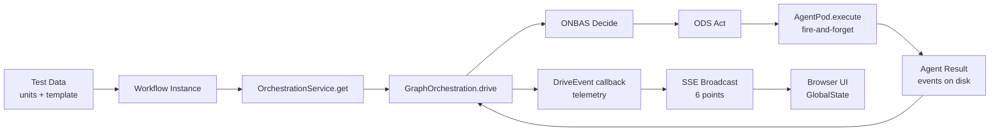

# Research Report: Harness Full Workflow Execution with Telemetry

**Generated**: 2026-03-16T08:30:00Z
**Research Query**: "Build harness command to run full workflow with stage-by-stage telemetry, matching test-pipeline, enabling agents to observe and iterate on orchestration"
**Mode**: New Plan (076-harness-workflow-runner)
**Location**: `docs/plans/076-harness-workflow-runner/research-dossier.md`
**FlowSpace**: Available
**Findings**: 75+ across 8 subagents

## Executive Summary

### What It Does
The harness needs a new `workflow` command group that creates test data, runs a full workflow through the real orchestration engine (ONBAS/ODS/PodManager/drive()), and provides stage-by-stage telemetry so agents can observe what's happening at every step. This mirrors the proven `scripts/test-advanced-pipeline.ts` which successfully runs 6-node graphs with real agents, Q&A, parallel fan-out, and session chains.

### Business Purpose
Plan 074 implemented all 6 phases of workflow execution but the agent never physically validated it worked — nodes got stuck at "starting", SSE events failed silently, paths were wrong. The harness workflow runner closes this gap: it gives agents (and humans) a structured command to run → observe → iterate on real workflows, creating the feedback loop that was missing.

### Key Insights
1. **The orchestration engine works** — `test-advanced-pipeline.ts` proves it with 23 assertions. The problem is wiring: web DI, SSE routing, and path mismatches.
2. **DriveEvent callback is the telemetry contract** — 4 event types (iteration, idle, status, error) with full OrchestrationRunResult per iteration. The harness must consume these.
3. **Fire-and-forget pod execution is the observability gap** — ODS calls `pod.execute()` without awaiting, errors logged to stderr only. Agents can't see what happened unless they check server logs.
4. **Reality snapshots are the state contract** — `buildPositionalGraphReality()` provides full graph state (node statuses, questions, sessions, progress) at any point. Harness should expose these.
5. **The harness is external tooling** — per ADR-0014, it consumes domain contracts via CLI subprocess calls and browser automation. No monorepo imports. The CG CLI is the bridge.

### Quick Stats
- **Components**: 6 core orchestration (OrchestrationService, ONBAS, ODS, PodManager, EHS, AgentContextService)
- **Dependencies**: 6 domains + 3 infrastructure layers
- **Test Coverage**: 8,809 LoC tests, 3.5:1 ratio — but **web execution path NOT e2e tested**
- **Prior Learnings**: 15 relevant discoveries from Plans 030, 067, 070, 074
- **Domains**: 6 relevant domains (workflow-ui, positional-graph, agents, events, state, workflow-events)

## How It Currently Works

### Entry Points

| Entry Point | Type | Location | Purpose |
|------------|------|----------|---------|
| `scripts/test-advanced-pipeline.ts` | Script | `scripts/` | Proven E2E: 6-node graph, real agents, 23 assertions |
| `just test-pipeline` | Justfile recipe | `justfile` | Runs test-advanced-pipeline.ts |
| `harness test-data create env` | Harness CLI | `harness/src/test-data/` | Creates units + template + workflow instance |
| `harness test-data run` | Harness CLI | `harness/src/test-data/` | Runs workflow via `cg wf run` CLI |
| `runWorkflow()` server action | Web API | `apps/web/app/actions/` | Browser Run button → WorkflowExecutionManager |
| `cg wf run <slug>` | CLI | `apps/cli/src/commands/` | CLI drive handler → OrchestrationService |

### Core Execution Flow

1. **Build Stack**: `OrchestrationService` wraps ONBAS + ODS + EHS + PodManager
2. **Get Handle**: `orchestrationService.get(ctx, graphSlug)` → cached per-graph `GraphOrchestration`
3. **Drive Loop**: `handle.drive({ maxIterations, onEvent })` → Settle→Decide→Act cycle ×200
4. **Settle**: Load graph state → EventHandlerService.processGraph() → persist mutations
5. **Decide**: ONBAS.getNextAction(reality) → OrchestrationRequest
6. **Act**: ODS.execute(request) → fire-and-forget `pod.execute()` for agent/code nodes
7. **Emit**: DriveEvent callback with iteration/idle/status/error + Reality snapshot
8. **Repeat**: Until graph-complete, graph-failed, max-iterations, or AbortSignal

### Data Flow


### State Files Written During Execution

| File | Path | Contents |
|------|------|----------|
| pod-sessions.json | `.chainglass/data/workflows/{slug}/pod-sessions.json` | `{sessions: Record<nodeId, sessionId>}` |
| graph-state.json | Via graphService.persistGraphState() | Full State (node statuses, questions, outputs) |
| events.jsonl | `.chainglass/data/workflows/{slug}/events.jsonl` | Node event log (question:ask, progress:update, etc.) |
| execution-registry.json | `~/.config/chainglass/execution-registry.json` | Active executions for restart recovery |

## Architecture & Design

### The test-advanced-pipeline.ts Reference Implementation

This is the **gold standard** — 6-node, 4-line graph with real Copilot agents:

```
Line 0: [human-input]           — user provides requirements
Line 1: [spec-writer]           — asks Q&A, writes spec + languages
Line 2: [programmer-a] [programmer-b]  — parallel, noContext isolated
Line 3: [reviewer] [summariser] — serial, context chain from spec-writer
```

**What it proves**: Q&A loops, parallel fan-out, context isolation, global session inheritance, line ordering, 23 assertions all pass.

**How it builds the stack** (buildStack function, lines 262-305):
```typescript
const ods = new ODS({
  graphService: service,
  podManager,
  contextService: new AgentContextService(),
  agentManager,
  scriptRunner: new ScriptRunner(),
  workUnitService,
});
const orchestrationService = new OrchestrationService({
  graphService: service,
  onbas: new ONBAS(),
  ods,
  eventHandlerService,
  podManager,
});
```

### DriveEvent Telemetry Contract (IC-03)

```typescript
type DriveEvent =
  | { type: 'iteration'; message: string; data: OrchestrationRunResult }
  | { type: 'idle'; message: string }
  | { type: 'status'; message: string }
  | { type: 'error'; message: string; error?: unknown };
```

The `onEvent` callback is **awaited** — enables back-pressure. Each iteration includes full `OrchestrationRunResult` with actions taken, stop reason, and Reality snapshot.

### Design Patterns

1. **Commander.js hierarchical registration** (PS-01): All harness commands use `registerXCommand(program)` factory + HarnessEnvelope JSON output
2. **Fire-and-forget pod execution** (PS-04): ODS calls `pod.execute()` without awaiting; session ID captured in `.then()` chain
3. **Per-graph handle pattern** (PS-10): OrchestrationService → cached GraphOrchestration per `{worktreePath}|{graphSlug}`
4. **withTestGraph lifecycle** (PS-09): mkdtemp → register workspace → copy fixtures → run → cleanup
5. **Multi-layer error handling** (PS-05): sync validation → await-wrapped creation → fire-and-forget .catch()

## Dependencies & Integration

### Orchestration Engine Internal Dependencies

```
OrchestrationService
├── IPositionalGraphService (graph CRUD + state)
├── ONBAS (pure decision logic, stateless)
├── ODS (dispatch service)
│   ├── graphService
│   ├── podManager
│   ├── contextService (AgentContextService)
│   ├── agentManager (IAgentManagerService)
│   ├── scriptRunner (IScriptRunner)
│   └── workUnitService (IWorkUnitService)
├── EventHandlerService (node events)
│   └── NodeEventService + registry
└── PodManager (pod lifecycle + sessions)
    └── IFileSystem (NodeFileSystemAdapter)
```

### Harness → CG CLI Contract

The harness calls `cg` via subprocess (`runCg()` in `harness/src/test-data/cg-runner.ts`):

| Command | Purpose |
|---------|---------|
| `cg unit create <slug> --type <type>` | Create work unit |
| `cg unit update <slug> --patch <file>` | Patch unit config |
| `cg unit delete <slug>` | Delete work unit |
| `cg unit info <slug>` | Check unit exists |
| `cg wf create <slug>` | Create workflow |
| `cg wf delete <slug>` | Delete workflow |
| `cg wf show <slug>` | Get workflow status |
| `cg wf line add <slug>` | Add line to graph |
| `cg wf node add <slug> <lineId> <unitSlug>` | Add node to line |
| `cg wf run <slug>` | Execute workflow |
| `cg wf stop <slug>` | Stop workflow |
| `cg template save-from <src> --as <tpl>` | Save template |
| `cg template instantiate <tpl> --id <id>` | Instantiate workflow |
| `cg template delete <tpl>` | Delete template |

### SSE Telemetry Pipeline

```
WorkflowExecutionManager.handleEvent()
  → ICentralEventNotifier (via ISSEBroadcaster)
    → SSEManager.broadcast('workflow-execution', data)
      → /api/events/mux EventSource
        → ServerEventRoute component
          → GlobalState paths:
            workflow-execution:{key}:status
            workflow-execution:{key}:iterations
            workflow-execution:{key}:lastEventType
```

**6 broadcast points** (PL-10): starting, running, iteration events, completed, failed, stopping. Missing any creates UI blind spots.

### External Dependencies

| Service | Required By | Auth |
|---------|-------------|------|
| GitHub Copilot SDK (`@github/copilot-sdk`) | SdkCopilotAdapter | `GH_TOKEN` env var |
| Claude CLI (subprocess) | ClaudeCodeAdapter | `ANTHROPIC_API_KEY` env var |
| Node.js fs/child_process | PodManager, ScriptRunner | N/A |

## Quality & Testing

### Current Test Coverage
- **Unit Tests**: 6,051 LoC, 12 files — orchestration-service, drive, ODS, ONBAS, pods
- **Integration Tests**: 1,430 LoC, 4 files — real filesystem with withTestGraph, describe.skip for real agents
- **E2E Script**: 657 LoC — test-advanced-pipeline.ts, 23 assertions, real Copilot agents
- **Harness Tests**: Separate suite in `harness/tests/` — infrastructure-focused

### CRITICAL GAP: Web Execution Path NOT Tested (QT-08)

No integration test validates:
```
UI → runWorkflow() → WorkflowExecutionManager.start()
  → orchestrationService.get() → drive() → ODS → output → SSE → UI
```

`test/integration/real-agent-web-routes.test.ts` has `describe.skip` + 4 TODOs. This is exactly why the Run button didn't work — the web wiring was never physically validated.

## Prior Learnings (From Previous Implementations)

### PL-01: Fire-and-Forget Promise Handling (CRITICAL)
**Source**: 074 Phase 2, DYK #3
`drivePromise` MUST have both `.then()` AND `.catch()` handlers. Missing either creates unhandled rejection crashes.

### PL-02: SSE Broadcast Race Condition (HIGH)
**Source**: 074 Phase 3, DYK #3
SSE broadcasts from `.then()` handler race ahead of server action response. Gate button visibility on server action response, not SSE status.

### PL-05: CDP Loopback in Docker (HIGH)
**Source**: 067 Phase 2, T009
Chromium binds CDP to 127.0.0.1 inside Docker. Need socat proxy to bridge to 0.0.0.0 for host access.

### PL-08: ODS Needs 5 Dependencies, Not 3 (MEDIUM)
**Source**: 030 Phase 6, T008
ODSDependencies requires: graphService, podManager, contextService, agentManager, scriptRunner, workUnitService. Don't forget any when constructing in web DI.

### PL-09: Channel Name Must Match 3 Places (HIGH)
**Source**: 074 Phase 3
`WorkspaceDomain.WorkflowExecution === 'workflow-execution'` must match in: workspace-domain.ts, layout.tsx WORKSPACE_SSE_CHANNELS, workflow-execution-route.ts.

### PL-13: Copilot SDK Wins Over CLI Subprocess (MEDIUM)
**Source**: 070 Workshop 001
`@github/copilot-sdk` with `SdkCopilotAdapter` gives typed events, reliable session IDs, zero-arg constructor (`GH_TOKEN` env). No log parsing.

### PL-14: Reset Graph Before Restart (HIGH)
**Source**: 074 Phase 2, DYK #1
After `stop()`, nodes are `'interrupted'`. ONBAS skips them. `restart()` MUST call `resetGraph()` before re-driving.

## Domain Context

### Domains Relevant to This Research

| Domain | Relationship | Key Contracts |
|--------|-------------|---------------|
| `_platform/positional-graph` | **Core engine** — all orchestration contracts | IOrchestrationService, IGraphOrchestration, DriveEvent, INodeEventService |
| `workflow-ui` | **Leaf consumer** — exports zero contracts, pure UI | Canvas, node properties, execution buttons |
| `agents` | **Agent execution** — adapter chain | IAgentAdapter, IAgentManagerService, AgentWorkUnitBridge |
| `_platform/events` | **Transport** — SSE pipeline | ICentralEventNotifier, ISSEBroadcaster |
| `_platform/state` | **Reactive state** — GlobalState | useGlobalState, ServerEventRoute |
| `workflow-events` | **Q&A lifecycle** | IWorkflowEvents (askQuestion, answerQuestion) |
| `work-unit-state` | **Agent status bridge** | IWorkUnitStateService, AgentWorkUnitBridge |

### Domain Actions Needed

- **No new domains** — harness is external tooling per ADR-0014
- **Potential contract addition** (DB-07): `IExecutionObserver` interface in positional-graph for structured execution telemetry without polling
- **All existing contracts sufficient** for MVP harness workflow runner

## Modification Considerations

### What the Harness Workflow Runner Needs

1. **`harness workflow run`** — Orchestrate full pipeline: create test data → run workflow → collect telemetry → assert results
2. **`harness workflow status`** — Query current execution state (node statuses, active pods, session IDs)
3. **`harness workflow logs`** — Capture server stdout/stderr during execution (ODS pod failures, drive events)
4. **`harness workflow reset`** — Clean all state and re-create fresh test data
5. **Stage-by-stage telemetry** — After each drive iteration, the harness should be able to see: what ONBAS decided, what ODS dispatched, what pod status is, what events were written

### Key Design Decision: CLI vs Direct Orchestration

**Option A: CLI-only** — Harness calls `cg wf run` via subprocess, captures stdout/stderr for telemetry
- Pro: Maintains harness isolation (ADR-0014), no monorepo imports
- Con: Limited telemetry (only what CLI prints), no per-iteration callbacks

**Option B: Direct orchestration** — Harness imports orchestration stack directly (like test-advanced-pipeline.ts does)
- Pro: Full DriveEvent callbacks, Reality snapshots, per-iteration observability
- Con: Breaks harness isolation, requires monorepo imports

**Option C: Hybrid** — Harness calls `cg wf run` for execution but uses separate API/SSE endpoints for telemetry
- Pro: Maintains isolation AND gets telemetry via REST/SSE
- Con: More complex, requires API endpoints to exist

**Recommendation**: Option C (Hybrid) — aligns with ADR-0014 while providing telemetry. The web server already has SSE channels and REST APIs. Harness connects to `/api/events/mux?channels=workflow-execution` for live updates and polls `cg wf show` for status snapshots.

### Missing APIs for Harness Telemetry

1. **`cg wf status <slug> --detailed`** — Current `cg wf show` returns graph structure. Need node-level status (starting, running, complete, error), active pod info, session IDs.
2. **Server log capture** — Need to capture `[ODS] Pod execution failed` and similar server-side logs. Options: log file, structured logging to SSE, or harness console-logs command with URL filter.
3. **Per-node event query** — `cg wf events <slug> [--node <nodeId>]` to read event store from CLI.
4. **Reality snapshot API** — REST endpoint returning `buildPositionalGraphReality()` for current graph state.

### Safe to Modify
- `harness/src/cli/commands/` — Add new workflow command group
- `harness/src/test-data/` — Extend environment with telemetry collection
- `apps/cli/src/commands/` — Add `cg wf status --detailed` and `cg wf events`

### Modify with Caution
- `packages/positional-graph/src/features/030-orchestration/` — Core engine; changes affect all consumers
- `apps/web/src/features/074-workflow-execution/` — Web execution path; SSE/GlobalState wiring

## Critical Discoveries

### Discovery 01: Web Execution Path Is Untested and Currently Broken
**Impact**: Critical
**Sources**: QT-08, IA-09, PL-01
Web DI constructs OrchestrationService differently from test-pipeline script. `real-agent-web-routes.test.ts` has 4 TODOs. User confirmed: Run button either does nothing or nodes get stuck at "starting". Must be debugged before harness can validate it.

### Discovery 02: Fire-and-Forget Makes Pods Invisible to Telemetry
**Impact**: Critical
**Sources**: PS-04, IA-07, PL-01
ODS calls `pod.execute()` without awaiting. Errors logged to stderr only via `.catch()`. No structured event emitted on pod failure. Harness must capture server stderr or add structured error events to the orchestration event stream.

### Discovery 03: DriveEvent Is the Only Programmatic Telemetry Hook
**Impact**: High
**Sources**: IA-02, IA-03, PS-03
The `onEvent` callback in `drive()` is the sole telemetry channel. It provides iteration counts, Reality snapshots, and status messages. But it's only available to the caller of `drive()` — the harness can't access it from outside the process without SSE or REST intermediary.

### Discovery 04: withTestGraph() Is the Reusable Test Infrastructure
**Impact**: High
**Sources**: IA-10, PS-09, QT-03
`dev/test-graphs/shared/graph-test-runner.ts` provides `withTestGraph()` lifecycle, `buildDiskWorkUnitService()`, assertion helpers, and Q&A automation. The harness workflow runner should mirror this pattern (or delegate to it via CLI).

### Discovery 05: 15 Prior Learnings From Plans 030/067/070/074
**Impact**: High
**Sources**: PL-01 through PL-15
Institutional knowledge includes: promise handling gotchas, SSE race conditions, hydration patterns, CDP Docker networking, session vs pod lifecycle differences, and graph reset requirements. All directly applicable to building the harness workflow runner.

## Recommendations

### If Building the Harness Workflow Runner
1. **Fix web execution first** — Debug why nodes get stuck at "starting" before trying to validate via harness
2. **Use Hybrid approach (Option C)** — CLI for execution, SSE/REST for telemetry, maintain harness isolation
3. **Add `cg wf status --detailed`** — Expose node-level status, pod info, session IDs via CLI
4. **Mirror test-advanced-pipeline assertions** — Same 23 checks as acceptance criteria for harness
5. **Capture server logs** — Either structured logging or harness log-capture command

### Architecture for `harness workflow` Commands
```
harness workflow
├── run         # Create env + run + collect telemetry + assert
├── status      # Query current execution state via cg wf status --detailed
├── logs        # Capture server stdout/stderr during execution
├── reset       # Clean all state, re-create fresh test data
├── create-env  # Alias for test-data create env
└── help        # Show all workflow commands with descriptions
```

## Next Steps

1. **Fix current runtime bugs** (nodes stuck at "starting", SSE route processing errors) — prerequisite for harness validation
2. Run `/plan-1b-specify` to create the feature specification for harness workflow runner
3. Consider `/plan-2c-workshop` for the telemetry architecture (CLI vs SSE vs hybrid)

---

**Research Complete**: 2026-03-16T08:30:00Z
**Report Location**: `docs/plans/076-harness-workflow-runner/research-dossier.md`
