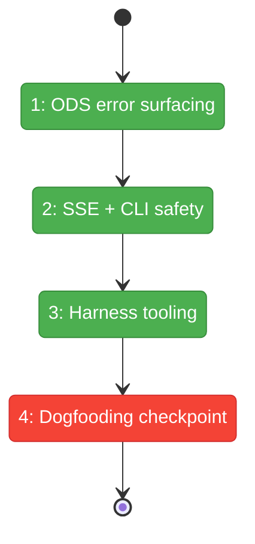
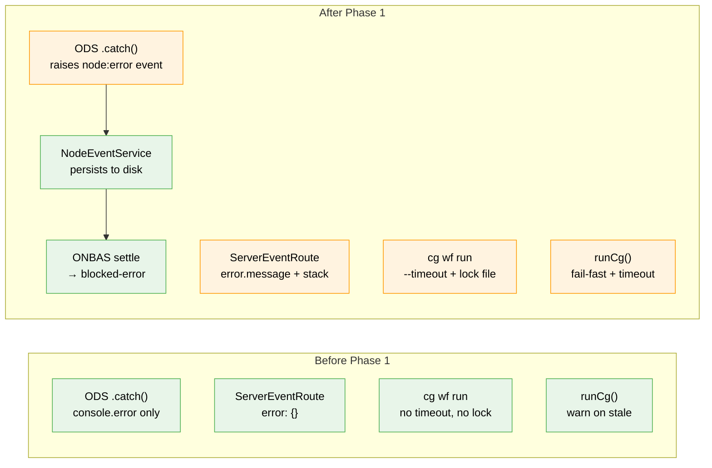

# Flight Plan: Phase 1 — Fix Execution Blockers

**Plan**: [harness-workflow-runner-plan.md](../../harness-workflow-runner-plan.md)
**Phase**: Phase 1: Fix Execution Blockers
**Generated**: 2026-03-17
**Status**: Ready for takeoff

---

## Departure → Destination

**Where we are**: Plan 074 built the workflow execution system (6 phases, all committed), but runtime bugs prevent it from actually working. Pods fail silently (ODS `.catch()` swallows errors), SSE route errors show `{}`, and `cg wf run` has no timeout or concurrency protection. A human clicking Run sees nodes stuck at "starting" forever.

**Where we're going**: A developer can run `cg wf run test-workflow --verbose --timeout 120` and either see nodes progress through the full lifecycle OR get a clear error message telling them exactly which node failed and why. Pod failures surface as `node:error` events that ONBAS processes. SSE errors show real messages. The foundation is solid for Phase 2-3 telemetry and harness commands.

---

## Domain Context

### Domains We're Changing

| Domain | What Changes | Key Files |
|--------|-------------|-----------|
| `_platform/positional-graph` | ODS `.catch()` raises `node:error` event; CLI gets `--timeout` + filesystem lock; ODSDependencies gets nodeEventService | `ods.ts`, `cli-drive-handler.ts`, `positional-graph.command.ts` |
| `_platform/events` | SSE route error serialization fix | `server-event-route.tsx` |
| _(harness)_ | `runCg()` fail-fast freshness + subprocess timeout | `cg-runner.ts` |

### Domains We Depend On (no changes)

| Domain | What We Consume | Contract |
|--------|----------------|----------|
| `_platform/positional-graph` | Node event system | INodeEventService.raise(), `node:error` type, NodeErrorPayloadSchema |
| `_platform/positional-graph` | Drive loop abort | IGraphOrchestration.drive({ signal }) — AbortSignal support |

---

## Flight Status

<!-- Updated by /plan-6-v2: pending → active → done. Use blocked for problems/input needed. -->

**Legend**: grey = pending | yellow = active | red = blocked/needs input | green = done

---

## Stages

<!-- Updated by /plan-6-v2 during implementation: [ ] → [~] → [x] -->

- [x] **Stage 1: ODS error surfacing** — Add pendingErrors queue to ODS, drain in drive loop settle phase
- [x] **Stage 2: SSE + CLI safety** — Fix error serialization (`server-event-route.tsx`), add `--timeout` + AbortSignal (`cli-drive-handler.ts`, `positional-graph.command.ts`), add filesystem lock (`positional-graph.command.ts`)
- [x] **Stage 3: Harness tooling** — Strengthen `runCg()` build freshness to fail-fast, add subprocess timeout (`cg-runner.ts`)
- [~] **Stage 4: Dogfooding checkpoint** — Rebuild packages, run `cg wf run test-workflow --verbose`, verify nodes progress or error clearly

---

## Architecture: Before & After

**Legend**: existing (green, unchanged) | changed (orange, modified) | new (blue, created)

---

## Acceptance Criteria

- [ ] AC-5: Pod failures visible in output (not silently swallowed) — node:error event written, ONBAS transitions to blocked-error
- [ ] AC-13: Nodes progress through full lifecycle, not stuck at "starting" — OR produce clear error with message

## Goals & Non-Goals

**Goals**:
- ✅ Pod failures produce visible node:error events
- ✅ SSE errors show real messages
- ✅ CLI has timeout and concurrency protection
- ✅ Harness tooling fails fast on stale builds

**Non-Goals**:
- ❌ Not building `--detailed` or `--json-events` (Phase 2)
- ❌ Not building harness workflow commands (Phase 3)
- ❌ Not fixing web UI specifically (Phase 4)

---

## Checklist

- [x] T001: ODS `.catch()` → queue error in pendingErrors Map
- [x] T002: Drive loop settle drains ODS errors → raises node:error events
- [x] T003: Fix SSE error serialization (error.message + stack)
- [x] T004: Add `--timeout` to `cg wf run` with AbortSignal
- [x] T005: Add filesystem lock for concurrent drive() prevention
- [x] T006: Strengthen `runCg()` build freshness to fail-fast
- [x] T007: Add subprocess timeout to `runCg()`
- [!] T008: Dogfooding checkpoint — BLOCKED by pre-existing CLI DI bug (`_Ie.resolve is not a function`)
