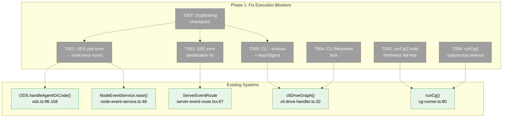
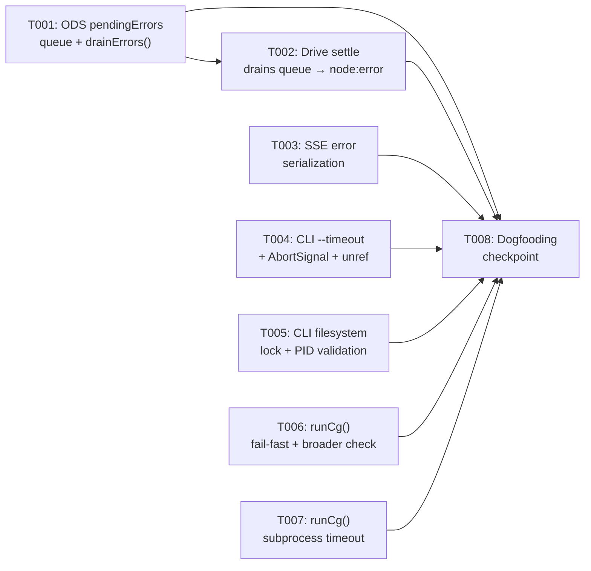
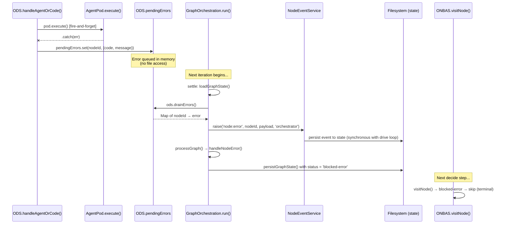

# Phase 1: Fix Execution Blockers — Tasks + Context Brief

**Plan**: [harness-workflow-runner-plan.md](../../harness-workflow-runner-plan.md)
**Phase**: Phase 1: Fix Execution Blockers
**Spec**: [harness-workflow-runner-spec.md](../../harness-workflow-runner-spec.md)
**Created**: 2026-03-17
**Status**: Pending

> **Read the spec's Problem Context section FIRST.** See `harness-workflow-runner-spec.md § Problem Context` for the bug table, dogfooding contract, and known runtime issues.

---

## Executive Briefing

**Purpose**: Fix the runtime bugs that prevent workflows from actually executing, so the harness workflow commands (Phase 2-3) have a working foundation. These bugs were discovered when a human clicked Run in the browser and nothing worked — despite 5568 unit tests passing.

**What We're Building**: Six surgical fixes to the orchestration engine and harness tooling:
1. ODS pod failures surface through the event system instead of being silently swallowed
2. SSE route errors show real messages instead of `{}`
3. CLI workflow run has a timeout and prevents concurrent corruption
4. Harness tooling fails fast on stale CLI builds

**Goals**:
- ✅ Pods that fail during execution produce a visible `node:error` event discovered by ONBAS
- ✅ SSE route catch blocks serialize Error objects with message + stack
- ✅ `cg wf run` has `--timeout` (default 600s) and filesystem lock
- ✅ `runCg()` subprocess has configurable timeout and strict build freshness
- ✅ A real workflow can be run via `cg wf run` with nodes progressing past "starting"

**Non-Goals**:
- ❌ Not building harness workflow commands (Phase 3)
- ❌ Not adding `--detailed` or `--json-events` to CLI (Phase 2)
- ❌ Not changing ONBAS/ODS algorithms — only surfacing errors that are currently swallowed
- ❌ Not fixing the web UI execution path specifically — Phase 4 validates that

---

## Pre-Implementation Check

| File | Exists? | Domain Check | Notes |
|------|---------|-------------|-------|
| `packages/positional-graph/src/features/030-orchestration/ods.ts` | ✓ | _platform/positional-graph | Modify `.catch()` at lines 152-155 |
| `apps/web/src/lib/state/server-event-route.tsx` | ✓ | _platform/events | Modify catch block at lines 67-73 |
| `apps/cli/src/commands/positional-graph.command.ts` | ✓ | _platform/positional-graph | Add `--timeout` to `wf run` at lines 1902-1937 |
| `apps/cli/src/features/036-cli-orchestration-driver/cli-drive-handler.ts` | ✓ | _platform/positional-graph | Add `signal` + `timeout` to CliDriveOptions |
| `harness/src/test-data/cg-runner.ts` | ✓ | _(harness)_ | Strengthen freshness check + add timeout |

**Concept Search**: No new concepts introduced — extending existing `node:error` event type and existing `AbortSignal` support in `drive()`.

**Harness Context**: Harness exists at L3 maturity. Health check: `just harness health`. Boot: `just harness dev`. Local dev: `just dev`. This phase works against local dev server (no Docker required).

---

## Architecture Map



---

## Tasks

| Status | ID | Task | Domain | Path(s) | Done When | Notes |
|--------|-----|------|--------|---------|-----------|-------|
| [x] | T001 | Add `pendingErrors` queue to ODS — `.catch()` queues error instead of just logging | _platform/positional-graph | `packages/positional-graph/src/features/030-orchestration/ods.ts`, `packages/positional-graph/src/features/030-orchestration/ods.types.ts` | `.catch()` calls `this.pendingErrors.set(nodeId, {code: 'POD_FAILED', message})` instead of just `console.error()`. Expose `drainErrors(): Map<string, {code, message}>` method that returns and clears the map. | **P1-DYK #1+#2**: Cannot call `nodeEventService.raise()` from `.catch()` — creates race condition on state file (raiseEvent does read-modify-write concurrently with drive loop settle phase). Also, NodeEventService is per-context (not global singleton), so DI wiring into ODS is complex. Solution: queue in memory, let drive loop drain synchronously during settle. |
| [x] | T002 | Drive loop settle phase drains ODS error queue → raises `node:error` events | _platform/positional-graph | `packages/positional-graph/src/features/030-orchestration/graph-orchestration.ts` | After `processGraph()` in `run()`, call `ods.drainErrors()` and for each error, call `nodeEventService.raise('node:error', nodeId, {code, message}, 'orchestrator')`. Persist state. Node transitions to `blocked-error` on next settle. | This runs synchronously inside the drive loop — no concurrent state file access. `node:error` type already registered in `core-event-types.ts:39-47` with `allowedSources: ['orchestrator']`. Valid from states: `'starting'`, `'agent-accepted'` — matches pod execution timing. |
| [x] | T003 | Fix SSE route error serialization | _platform/events | `apps/web/src/lib/state/server-event-route.tsx` | `console.warn` shows `error.message` and `error.stack` instead of `{}` | ~5 line change at lines 67-73. Replace `error` with `error instanceof Error ? { message: error.message, stack: error.stack, name: error.name } : String(error)`. |
| [x] | T004 | Add `--timeout` flag to `cg wf run` with AbortSignal | _platform/positional-graph | `apps/cli/src/commands/positional-graph.command.ts`, `apps/cli/src/features/036-cli-orchestration-driver/cli-drive-handler.ts` | `cg wf run test-wf --timeout 60` aborts drive() after 60s, returns exit code 1 with reason `'stopped'` | Add `timeout?: number` to CliDriveOptions. Create AbortController, set timeout via `setTimeout`. Pass `signal` to `handle.drive()`. drive() already checks `signal?.aborted` at iteration boundaries (graph-orchestration.ts:159,171). Default: 600s. **P1-DYK #3**: Call `timer.unref()` so timer doesn't prevent clean process exit if drive() finishes first. Call `handle.cleanup()` after drive() returns to terminate still-running fire-and-forget pods. |
| [x] | T005 | Add filesystem lock for CLI drive() | _platform/positional-graph | `apps/cli/src/commands/positional-graph.command.ts` | Second `cg wf run test-wf` returns error "workflow already running" with exit code 1 | Lock file at `${worktreePath}/.chainglass/data/workflows/${slug}/drive.lock`. Write PID on acquire, delete on exit/signal. **P1-DYK #4**: Write PID inside lock file. On acquire, check if existing lock PID is still alive via `process.kill(pid, 0)`. If dead, delete stale lock and acquire. Register cleanup on `process.on('exit')`, `SIGTERM`, `SIGINT`. Create directory with `mkdir({recursive: true})` before writing lock. |
| [x] | T006 | Strengthen `runCg()` build freshness — fail-fast | _(harness)_ | `harness/src/test-data/cg-runner.ts` | Missing CLI bundle → throw error (not warn). Stale bundle → throw error (not warn). | Currently at lines 52-71: `console.error()` + return. Change to `throw new Error()` so callers see failure. **P1-DYK #5**: Currently only checks `unit.command.ts` — misses the files we're changing (ods.ts, cli-drive-handler.ts, positional-graph.command.ts). Check CLI bundle mtime against `apps/cli/src/` directory (any .ts file newer = stale). Also check `packages/positional-graph/dist/` mtime to catch package rebuild needs. |
| [x] | T007 | Add subprocess timeout to `runCg()` | _(harness)_ | `harness/src/test-data/cg-runner.ts` | `execFile()` calls include `timeout` option. Default 600s, configurable via `CgExecOptions.timeout` | Lines 101-115: add `timeout` to `execFile()` options in both `runLocal()` and `runInContainer()`. Node `execFile` supports `timeout` natively. Add `timeout?: number` to `CgExecOptions` interface. |
| [!] | T008 | Rebuild packages + verify workflow runs past "starting" | _platform/positional-graph | N/A | `cg wf run test-workflow --verbose` shows nodes transitioning starting → accepted → complete (or blocked-error if agents unavailable) | **Dogfooding checkpoint**. Steps: `pnpm --filter @chainglass/positional-graph build && pnpm --filter @chainglass/cli build && just test-data create env && cg wf run test-workflow --verbose`. Include output in execution log. If nodes still stuck, diagnose using the improved error messages from T001-T003. |

---

## Context Brief

### Key Findings from Plan

- **Finding 01** (Critical): ODS `.catch()` swallows pod failures. Resolution: T001+T002 — write `node:error` event via NodeEventService. The `node:error` event type is already registered with `allowedSources: ['orchestrator']` and payload schema requiring `code` + `message`.
- **Finding 02** (Critical): SSE route serializes Error as `{}`. Resolution: T003 — serialize error.message/stack explicitly.
- **Finding 03** (Critical): `cg wf run` blocks indefinitely. Resolution: T004 — AbortController + `--timeout` flag.
- **Finding 04** (Critical): No lock prevents concurrent drive() corruption. Resolution: T005 — filesystem lock file.
- **Finding 08** (High): Build freshness warns but doesn't fail. Resolution: T006 — throw instead of warn.

### Domain Dependencies

| Domain | Contract | What We Use | Entry Point |
|--------|----------|-------------|-------------|
| `_platform/positional-graph` | INodeEventService | `raise('node:error', nodeId, payload, source)` to write pod failure events | `packages/positional-graph/src/features/032-node-event-system/node-event-service.ts:48` |
| `_platform/positional-graph` | NodeErrorPayloadSchema | Zod schema: `{ code: string, message: string, details?: string, recoverable?: boolean }` | `packages/positional-graph/src/features/032-node-event-system/event-payloads.schema.ts` |
| `_platform/positional-graph` | IGraphOrchestration.drive() | Accepts `signal?: AbortSignal` in DriveOptions — already wired to check abort at iteration boundaries | `packages/positional-graph/src/features/030-orchestration/graph-orchestration.ts:159,171` |
| `_platform/positional-graph` | abortableSleep() | Sleep that respects AbortSignal — used in drive() idle loop | `packages/positional-graph/src/features/030-orchestration/abortable-sleep.ts` |
| `_platform/events` | ServerEventRoute | Catches errors during SSE event processing — fix serialization | `apps/web/src/lib/state/server-event-route.tsx:67-73` |

### Domain Constraints

- **ADR-0010**: Pod failure events MUST flow through filesystem → event system → ONBAS settle. Do NOT bypass by calling graphService directly from ODS.
- **ADR-0012**: ODS must not call Graph Domain services. Events are the extension point.
- **ADR-0014**: Harness is external tooling — `runCg()` changes stay in `harness/` directory, no monorepo imports.
- `node:error` event can only be raised from states `'starting'` or `'agent-accepted'` — matches pod execution timing.
- `handleNodeError` handler (in event-handlers.ts) transitions node status to `'blocked-error'` — ONBAS recognizes this as terminal.

### Harness Context

- **Boot**: `just dev` (local) or `just harness dev` (Docker)
- **Interact**: `cg wf run test-workflow --verbose` via CLI subprocess
- **Observe**: CLI stdout/stderr output, `cg wf show test-workflow`
- **Maturity**: L3 (Boot + Browser + Evidence + CLI SDK)
- **Pre-phase validation**: Verify CLI is built: `test -f apps/cli/dist/cli.cjs`

### Implementation Sequence



T001 must come before T002 (ODS needs the queue before drive loop can drain it). T003-T007 are independent. T008 validates everything.

### Event System Flow (T001+T002 detail — queue-based approach)



**Why queue-based** (P1-DYK #1+#2):
- `raiseEvent()` does read-modify-write on the state file. Calling it from `.catch()` (concurrent with drive loop) creates a lost-update race condition.
- `NodeEventService` is per-context (not a global singleton) — DI wiring into ODS is complex.
- Queue approach: `.catch()` sets memory → drive loop drains synchronously during settle → no concurrent file access → no DI changes needed.

---

## DYK Analysis (2026-03-17)

| # | Insight | Impact | Resolution |
|---|---------|--------|------------|
| P1-DYK #1 | `raiseEvent()` does read-modify-write on state file — calling from `.catch()` creates lost-update race with drive loop | Critical | Queue errors in ODS memory (`pendingErrors` Map), drive loop drains during settle — no concurrent file access |
| P1-DYK #2 | `NodeEventService` is per-context (closures over `loadState`/`persistState`), not a global DI singleton | High | Error queue sidesteps DI wiring entirely — ODS doesn't need NodeEventService injected |
| P1-DYK #3 | `setTimeout` without `.unref()` prevents Node.js from exiting when drive() completes before timeout | Medium | Call `timer.unref()` on the timeout timer; call `handle.cleanup()` after drive() returns |
| P1-DYK #4 | Crashed processes leave stale lock files that permanently block future runs | High | Write PID in lock file, check if PID is alive via `process.kill(pid, 0)` before rejecting; clean stale locks |
| P1-DYK #5 | Build freshness only checks `unit.command.ts` — misses `ods.ts`, `cli-drive-handler.ts`, package dist/ | Medium | Check CLI bundle mtime against `apps/cli/src/` directory and `packages/positional-graph/dist/` |

---

## Discoveries & Learnings

_Populated during implementation by plan-6._

| Date | Task | Type | Discovery | Resolution | References |
|------|------|------|-----------|------------|------------|
| 2026-03-17 | T008 | Blocker | `cg wf run` fails with `_Ie.resolve is not a function` — CLI DI container resolution broken in compiled bundle. Pre-existing (verified on committed code). | Blocks dogfooding checkpoint. Need to fix CLI DI container or use `test-advanced-pipeline.ts` script (which builds its own stack). | `apps/cli/dist/cli.cjs`, `apps/cli/src/lib/container.ts:302` |

---

## Directory Layout

```
docs/plans/076-harness-workflow-runner/
  ├── harness-workflow-runner-plan.md
  ├── harness-workflow-runner-spec.md
  ├── research-dossier.md
  ├── workshops/
  │   ├── 001-harness-workflow-experience.md
  │   ├── 002-telemetry-architecture.md
  │   └── 003-cg-cli-status-enhancement.md
  └── tasks/phase-1-fix-execution-blockers/
      ├── tasks.md                  ← this file
      ├── tasks.fltplan.md          ← flight plan
      └── execution.log.md          ← created by plan-6
```
