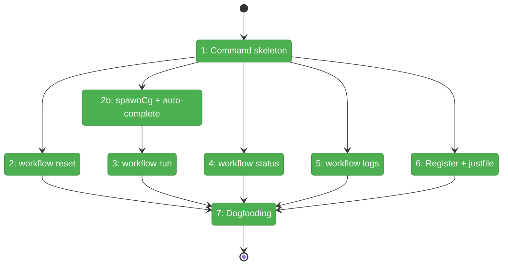
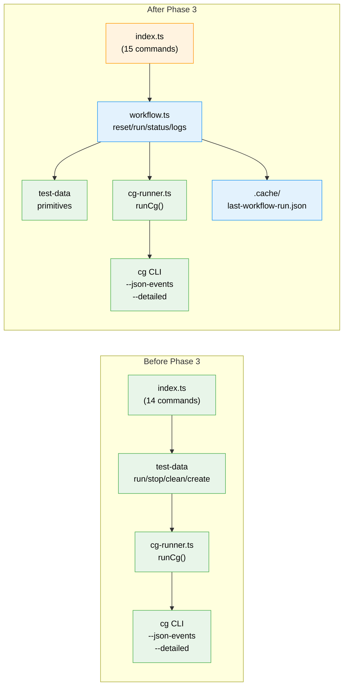

# Flight Plan: Phase 3 — Harness Workflow Commands

**Plan**: [harness-workflow-runner-plan.md](../../harness-workflow-runner-plan.md)
**Phase**: Phase 3: Harness Workflow Commands
**Generated**: 2026-03-18
**Status**: Landed

---

## Departure → Destination

**Where we are**: Phase 1 fixed the execution blockers (ODS error surfacing, SSE serialization, CLI timeout/lock, build freshness). Phase 2 added CLI telemetry (`cg wf show --detailed`, `cg wf run --json-events`, GH_TOKEN check). The orchestration engine works and emits structured telemetry — but the harness has no way to consume it. Workflow execution is only accessible via raw CLI commands that agents must manually compose.

**Where we're going**: A developer or agent can run `just harness workflow run` and get back a structured HarnessEnvelope JSON showing exactly what happened — which nodes ran, which failed, what ONBAS decided, what ODS dispatched. They can drill into `workflow status` for a live snapshot, `workflow logs` for the full timeline, or `workflow logs --node X` for single-node forensics. The debugging cycle becomes: `reset → run → read → fix → repeat` — all through structured JSON.

---

## Domain Context

### Domains We're Changing

| Domain | What Changes | Key Files |
|--------|-------------|-----------|
| _(harness)_ | New `workflow` command group (reset, run, status, logs) | `harness/src/cli/commands/workflow.ts` (new), `harness/src/cli/index.ts` (modified) |
| project root | Justfile documentation for workflow commands | `justfile` (verified/documented) |

### Domains We Depend On (no changes)

| Domain | What We Consume | Contract |
|--------|----------------|----------|
| _(harness)_/test-data | `cleanTestData()`, `createEnv()`, `statusTestData()` | Test data lifecycle primitives |
| _(harness)_/test-data | `runCg(args, options): CgExecResult` | CLI subprocess with freshness + timeout |
| _(harness)_/output | `formatSuccess()`, `formatError()`, `exitWithEnvelope()` | HarnessEnvelope JSON output |
| _platform/positional-graph | `cg wf run --json-events --timeout` | NDJSON DriveEvent stream |
| _platform/positional-graph | `cg wf show --detailed --json` | Node-level status with timing, sessions, blockers |

---

## Flight Status

<!-- Updated by /plan-6-v2: pending → active → done. Use blocked for problems/input needed. -->

**Legend**: grey = pending | yellow = active | red = blocked/needs input | green = done

---

## Stages

<!-- Updated by /plan-6-v2 during implementation: [ ] → [~] → [x] -->

- [x] **Stage 1: Create command skeleton** — Commander.js group with 4 subcommand stubs (`workflow.ts` — new file)
- [x] **Stage 2: Implement workflow reset** — compose `cleanTestData()` + `createEnv()` into single command
- [x] **Stage 2b: Create spawnCg() + auto-completion**
- [x] **Stage 3: Implement workflow run**
- [x] **Stage 4: Implement workflow status** — delegate to `cg wf show --detailed`, wrap in HarnessEnvelope
- [x] **Stage 5: Implement workflow logs** — read cached events from last run, `--node` and `--errors` filters
- [x] **Stage 6: Register and integrate** — index.ts import + justfile verification
- [x] **Stage 7: Dogfooding validation** — full reset → run (to completion) → status → logs cycle with evidence capture

---

## Architecture: Before & After

**Legend**: existing (green, unchanged) | changed (orange, modified) | new (blue, created)

---

## Acceptance Criteria

- [ ] AC-1: `harness workflow run` creates test data, executes, collects telemetry, reports pass/fail
- [ ] AC-6: `harness workflow status` returns node-level status, pods, sessions, iterations
- [ ] AC-7: `harness workflow reset` cleans + recreates (idempotent)
- [ ] AC-9: All commands return HarnessEnvelope JSON
- [ ] AC-10: Agent can iterate using reset→run→read→fix→repeat cycle
- [ ] AC-11: `harness workflow logs` captures execution timeline + server errors
- [ ] AC-12: Works against local dev server
- [ ] AC-15: Progressive disclosure (4 levels)

## Goals & Non-Goals

**Goals**:
- ✅ Four workflow commands: reset, run, status, logs
- ✅ All return HarnessEnvelope JSON
- ✅ Progressive disclosure: summary → node detail → timeline → forensics
- ✅ Agent can iterate with reset→run→read→fix→repeat
- ✅ Works against local dev server (no Docker required)

**Non-Goals**:
- ❌ No orchestration engine changes
- ❌ No web UI validation (Phase 4)
- ❌ No auto-answering Q&A nodes
- ❌ No dev server startup (harness uses servers, doesn't start them)

---

## Checklist

- [x] T001: Create `workflow.ts` command skeleton with Commander.js group
- [x] T002: Implement `workflow reset` — clean + create env
- [x] T002b: Create `spawnCg()` streaming runner + auto-completion module (cross-repo import)
- [x] T003: Implement `workflow run` — streaming NDJSON + auto-complete + assertions
- [x] T004: Implement `workflow status` — wrap `cg wf show --detailed`
- [x] T005: Implement `workflow logs` — cached events with --node/--errors filters
- [x] T006: Register workflow command in index.ts
- [x] T007: Add justfile documentation/recipe for workflow commands
- [x] T008: Dogfooding checkpoint — full lifecycle validation (workflow runs to completion)
