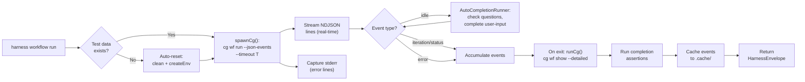
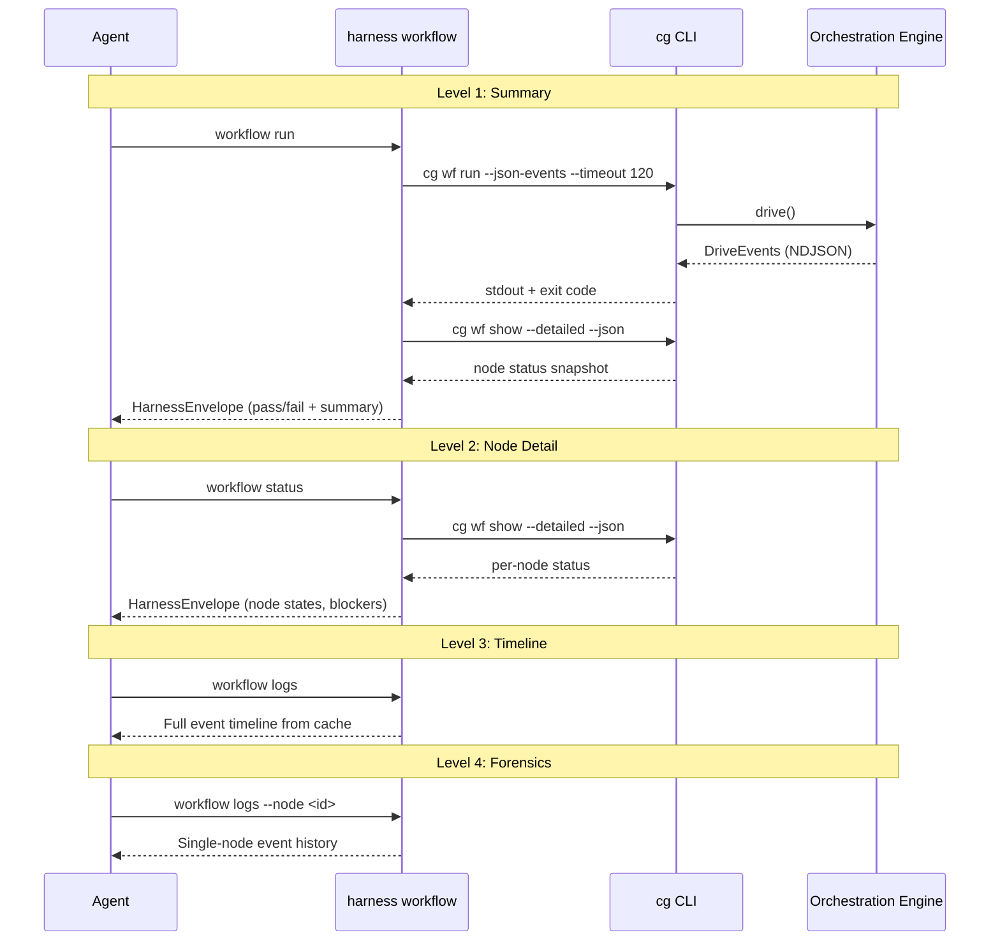

# Phase 3: Harness Workflow Commands — Tasks + Context Brief

**Plan**: [harness-workflow-runner-plan.md](../../harness-workflow-runner-plan.md)
**Phase**: Phase 3: Harness Workflow Commands
**Spec**: [harness-workflow-runner-spec.md](../../harness-workflow-runner-spec.md)
**Created**: 2026-03-18
**Status**: Pending

> **Read the spec's Problem Context section FIRST.** See `harness-workflow-runner-spec.md § Problem Context` for the bug table, dogfooding contract, and known runtime issues.

---

## Executive Briefing

**Purpose**: Build the `harness workflow` command group that guides agents through running, observing, and debugging full workflow pipelines. This is the experience layer — it composes the CLI telemetry from Phase 2 (`--detailed`, `--json-events`) and the test-data primitives from Plan 074 Phase 6 into four purpose-built commands: reset, run, status, and logs.

**What We're Building**: A Commander.js command group at `harness/src/cli/commands/workflow.ts` that wraps existing CG CLI and test-data operations into agent-friendly commands returning structured `HarnessEnvelope` JSON. Each command targets a specific moment in the debugging loop: clean slate (reset), execute + assert (run), inspect now (status), inspect over time (logs).

**Goals**:
- ✅ `harness workflow reset` — one command to clean all workflow state and recreate fresh test data
- ✅ `harness workflow run` — execute workflow, capture NDJSON telemetry + stderr, run assertions, return structured pass/fail
- ✅ `harness workflow status` — wrap `cg wf show --detailed` in HarnessEnvelope for node-level debugging
- ✅ `harness workflow logs` — read accumulated events with `--node` and `--errors` filters for progressive disclosure
- ✅ All commands return HarnessEnvelope JSON that agents can parse and act on
- ✅ Progressive disclosure: Level 1 (run→summary) → Level 2 (status→node detail) → Level 3 (logs→timeline) → Level 4 (logs --node→forensics)
- ✅ Agent can iterate using: reset → run → read output → fix code → repeat

**Non-Goals**:
- ❌ Not changing the orchestration engine (ONBAS, ODS, PodManager)
- ❌ Not modifying CG CLI commands (done in Phase 1-2)
- ❌ Not validating the web UI execution path (Phase 4)
- ❌ Not auto-answering Q&A nodes during automated runs (future enhancement)
- ❌ Not starting the dev server — harness uses servers, doesn't start them

---

## Prior Phase Context

### Phase 1: Fix Execution Blockers (Complete)

**A. Deliverables**:
- `packages/positional-graph/src/features/030-orchestration/ods.ts` — `pendingErrors` Map + `drainErrors()` for pod error surfacing
- `packages/positional-graph/src/features/030-orchestration/graph-orchestration.ts` — Drive loop settle phase drains ODS error queue → `node:error` events
- `apps/web/src/lib/state/server-event-route.tsx` — Error serialization fix (message + stack + name)
- `apps/cli/src/commands/positional-graph.command.ts` — `--timeout` flag, filesystem lock with PID validation
- `apps/cli/src/features/036-cli-orchestration-driver/cli-drive-handler.ts` — `timeout` + `signal` in CliDriveOptions
- `harness/src/test-data/cg-runner.ts` — Fail-fast build freshness, subprocess timeout, broader mtime checks
- `apps/cli/esbuild.config.ts` — Externalized `@github/copilot-sdk` (pre-existing bug fix)
- `apps/cli/src/lib/container.ts` — Dynamic `import()` for CopilotClient (pre-existing bug fix)
- `harness/src/test-data/environment.ts` — `createWorkflow()` rewritten to use `cg wf create`

**B. Dependencies Exported**:
- `ODS.drainErrors(): Map<string, {code, message}>` — pod error queue
- `CliDriveOptions.timeout?: number` — configurable timeout (default 600s)
- `CgExecOptions.timeout?: number` — subprocess timeout (default 600s)
- Filesystem lock at `${worktreePath}/.chainglass/data/workflows/${slug}/drive.lock`

**C. Gotchas & Debt**:
- `raiseEvent()` race condition avoided via in-memory queue (P1-DYK #1)
- `setTimeout.unref()` required for clean process exit (P1-DYK #3)
- Stale lock files cleaned via PID validation (P1-DYK #4)
- Template instantiate puts graphs in wrong directory — must use `cg wf create` directly

**D. Incomplete Items**: None — all 8 tasks complete.

**E. Patterns to Follow**:
- Queue-based error propagation (memory queue → synchronous drain during settle)
- Signal-based cancellation via AbortSignal
- PID-based lock validation
- Explicit Error serialization (message, stack, name — never raw Error to JSON)
- ADR-0010/0012 compliance: events as extension points, not direct service calls

### Phase 2: CLI Telemetry Enhancement (Complete)

**A. Deliverables**:
- `cg wf show --detailed --json` — per-node status with lineId, nodeId, unitType, timing, sessionId, blockedBy, errors
- `cg wf run --json-events` — NDJSON DriveEvents to stdout (type: status|iteration|idle|error)
- GH_TOKEN pre-flight check in `cg wf run`

**B. Dependencies Exported (Phase 3 consumes these)**:

`--detailed` output contract:
```json
{
  "success": true,
  "command": "wf.show",
  "data": {
    "slug": "...",
    "execution": { "status", "totalNodes", "completedNodes", "progress" },
    "lines": [{ "id": "...", "label": "...", "nodes": [{ "id", "unitSlug", "type", "status", "startedAt", "completedAt", "error", "sessionId", "blockedBy" }] }],
    "questions": [],
    "sessions": {}
  }
}
```

`--json-events` NDJSON line format:
```json
{"type": "status|iteration|idle|error", "message": "...", "timestamp": "ISO8601", "data?": {}, "error?": "..."}
```

**C. Gotchas & Debt**:
- Field names: `lineId` (not `line.id`), `nodeId` (not `node.id`), `unitType` (not `node.type`)
- `readyDetail` has booleans (not reasons array): `precedingLinesComplete`, `inputsAvailable`, `serialNeighborComplete`
- Use `getReality()` — never construct PodManager/NodeFileSystemAdapter directly
- `--json-events` is independent from global `--json` flag

**D. Incomplete Items**: None — all tasks + code review fixes complete.

**E. Patterns to Follow**:
- Contract-first telemetry: use `getOrchestrationService().get(ctx, slug).getReality()`
- NDJSON streaming: one JSON object per line, parseable by `jq`
- Blocker derivation: explicit boolean checks on `readyDetail.*Complete` fields
- Pre-flight environment validation before orchestration

---

## Pre-Implementation Check

| File | Exists? | Domain Check | Notes |
|------|---------|-------------|-------|
| `harness/src/cli/commands/workflow.ts` | ✗ New | _(harness)_ | Follow `agent.ts` pattern: export `registerWorkflowCommand(program)` |
| `harness/src/cli/index.ts` | ✓ | _(harness)_ | Add import + `registerWorkflowCommand(program)` call |
| `harness/src/test-data/environment.ts` | ✓ | _(harness)_ | Reuse `cleanTestData()`, `createEnv()`, `statusTestData()`, `runTestWorkflow()` |
| `harness/src/test-data/cg-runner.ts` | ✓ | _(harness)_ | Reuse `runCg()` for `cg wf show --detailed --json` calls |
| `harness/src/cli/output.ts` | ✓ | _(harness)_ | Reuse `formatSuccess()`, `formatError()`, `exitWithEnvelope()` |
| `justfile` | ✓ | project root | Add `harness workflow` recipe |

**Concept Search**: `workflow.ts` does not exist. Workflow execution primitives exist in `test-data/environment.ts` (`runTestWorkflow`, `stopTestWorkflow`, `createEnv`, `cleanTestData`). No duplication risk — Phase 3 composes these primitives into a higher-level experience layer.

**Harness Context**: Harness at L3 maturity. Health check: `just harness health`. Boot: `just harness dev` (Docker) or `just dev` (local). Phase 3 works against local dev server — no Docker required.

---

## Architecture Map

```mermaid
flowchart TD
    classDef pending fill:#9E9E9E,stroke:#757575,color:#fff
    classDef existing fill:#E8F5E9,stroke:#4CAF50,color:#000
    classDef new fill:#E3F2FD,stroke:#2196F3,color:#000

    subgraph Phase3["Phase 3: Harness Workflow Commands"]
        T001["T001: Command skeleton<br/>+ Commander.js group"]:::pending
        T002["T002: workflow reset"]:::pending
        T002b["T002b: spawnCg() + auto-<br/>completion (cross-repo)"]:::pending
        T003["T003: workflow run<br/>(streaming + assertions)"]:::pending
        T004["T004: workflow status"]:::pending
        T005["T005: workflow logs<br/>(--node, --errors filters)"]:::pending
        T006["T006: Register in index.ts"]:::pending
        T007["T007: justfile recipe"]:::pending
        T008["T008: Dogfooding<br/>checkpoint"]:::pending

        T001 --> T002 & T002b & T004 & T005 & T006
        T002b --> T003
        T002 & T003 & T004 & T005 & T006 --> T008
    end

    subgraph NewFiles["New Files"]
        WF["harness/src/cli/commands/<br/>workflow.ts"]:::new
        SPAWN["harness/src/test-data/<br/>cg-spawner.ts"]:::new
        AUTO["harness/src/test-data/<br/>auto-completion.ts"]:::new
    end

    subgraph ModifiedFiles["Modified Files"]
        IDX["harness/src/cli/<br/>index.ts"]:::existing
        JF["justfile"]:::existing
        PKG["harness/package.json<br/>(add positional-graph dep)"]:::existing
    end

    subgraph ReusedModules["Reused Modules (no changes)"]
        ENV["environment.ts<br/>cleanTestData, createEnv,<br/>statusTestData"]:::existing
        CGR["cg-runner.ts<br/>runCg()"]:::existing
        OUT["output.ts<br/>formatSuccess, formatError,<br/>exitWithEnvelope"]:::existing
    end

    T001 -.-> WF
    T002b -.-> SPAWN & AUTO & PKG
    T006 -.-> IDX
    T007 -.-> JF
    T002 -.-> ENV
    T003 -.-> SPAWN & AUTO & WF
    T004 -.-> CGR
    T005 -.-> WF
```



---

## Tasks

| Status | ID | Task | Domain | Path(s) | Done When | Notes |
|--------|-----|------|--------|---------|-----------|-------|
| [x] | T001 | Create `workflow.ts` command skeleton with Commander.js group and 4 subcommand stubs (reset, run, status, logs) | _(harness)_ | `harness/src/cli/commands/workflow.ts` | `registerWorkflowCommand(program)` exports a Commander.js command group with 4 subcommands that each print "not implemented" and exit | Follow `agent.ts` pattern (line 39): export `registerWorkflowCommand`, create `new Command('workflow')`, chain `.command()` stubs. Import `CgExecOptions` from `cg-runner.ts`. Add shared `--target` option (local/container, default local). |
| [x] | T002 | Implement `workflow reset` — clean all state + recreate fresh test data | _(harness)_ | `harness/src/cli/commands/workflow.ts` | `harness workflow reset` returns `{command: "workflow.reset", status: "ok", data: {cleaned: true, created: {units, template, workflow}}}` and is idempotent | Compose `cleanTestData()` + `createEnv()` from `environment.ts`. Wrap in try/catch. Return `formatSuccess('workflow.reset', {cleaned, created})`. If createEnv fails, return `formatError` with step that failed. Per Workshop 001 D1: one command, clean slate. |
| [x] | T002b | Create `spawnCg()` streaming runner + auto-completion module — cross-repo import of `@chainglass/positional-graph` | _(harness)_ | `harness/src/test-data/cg-spawner.ts` (new), `harness/src/test-data/auto-completion.ts` (new), `harness/package.json` | (1) `spawnCg()` uses `child_process.spawn()` with line-by-line stdout processing — returns event emitter or async iterator for real-time NDJSON streaming. (2) `AutoCompletionRunner` ports `QuestionWatcher` + `completeUserInputNode` patterns from `scripts/test-advanced-pipeline.ts` using direct `@chainglass/positional-graph` imports. (3) `harness/package.json` adds `@chainglass/positional-graph` as workspace dependency. | **P3-DYK #2+#3**: `execFile()` buffers all output — no streaming for "God mode" views. User overrides ADR-0014 for this case: harness may import `@chainglass/positional-graph` directly (same precedent as existing `@chainglass/shared` import per ADR-0014 amendment). **spawnCg()**: Same pre-flight checks as `runCg()` (build freshness). Returns `{ process: ChildProcess, lines: AsyncIterable<string>, result: Promise<CgExecResult> }`. **AutoCompletionRunner**: Monitors NDJSON stream for idle events → checks for pending questions via `IPositionalGraphService` → auto-answers with scripted responses → auto-completes user-input nodes. Port `QuestionWatcher` class and `completeUserInputNode()` from `scripts/test-advanced-pipeline.ts` (lines 190-248, 465-475) and `dev/test-graphs/shared/helpers.ts`. |
| [x] | T003 | Implement `workflow run` — use `spawnCg()` for streaming NDJSON, auto-complete nodes, run assertions, return structured result | _(harness)_ | `harness/src/cli/commands/workflow.ts` | `harness workflow run` returns HarnessEnvelope with `{exitCode, exitReason, iterations, nodeStatus, events[], stderrLines[], assertions[]}`. Events are NDJSON-parsed DriveEvents. Final node status comes from `cg wf show --detailed`. Workflow runs to completion (not just timeout). | **Most complex task. Uses T002b.** Steps: (1) Auto-reset if `statusTestData()` shows missing data (per Workshop 001 D2). (2) Spawn `cg wf run test-workflow --json-events --timeout <T>` via `spawnCg()` (P3-DYK #2: streaming, not buffered). (3) Process NDJSON lines in real time — display with `--verbose`, accumulate events. (4) On idle events, trigger `AutoCompletionRunner` to complete user-input nodes and answer Q&A (P3-DYK #3: cross-repo import enabled). (5) Capture stderr lines. (6) On exit, call `runCg(['wf', 'show', 'test-workflow', '--detailed'])` for final snapshot. (7) Run completion assertions (all nodes complete, session chains valid, Q&A answered — adapted from test-pipeline's 23 assertions). (8) Cache events to `harness/.cache/last-workflow-run.json` (P3-DYK #4: `mkdirSync({recursive: true})` first). (9) Return HarnessEnvelope. **P3-DYK #1**: Timeout is seconds for CLI arg but milliseconds for `CgExecOptions.timeout` — convert with `* 1000` and add 10s buffer so CLI exits gracefully before subprocess kill. **P3-DYK #5**: `runCg()` auto-adds `--json` — don't duplicate; stdout from `--json-events` is pure NDJSON (safe). Options: `--timeout <seconds>` (default 120), `--verbose` (stream events live to stderr). |
| [x] | T004 | Implement `workflow status` — wrap `cg wf show --detailed` in HarnessEnvelope | _(harness)_ | `harness/src/cli/commands/workflow.ts` | `harness workflow status` returns `{command: "workflow.status", status: "ok", data: <detailed-output>}` with per-node status, pods, sessions, iteration count | Simple delegation: call `runCg(['wf', 'show', 'test-workflow', '--detailed'], options)`, parse JSON stdout, wrap in `formatSuccess('workflow.status', parsed)`. If workflow doesn't exist, return `formatError` with E131. Per Workshop 001: "What's happening right now?" **P3-DYK #5**: `runCg()` auto-adds `--json` so stdout is already JSON — parse directly, don't double-wrap. |
| [x] | T005 | Implement `workflow logs` — read cached events from last run, support `--node` and `--errors` filters | _(harness)_ | `harness/src/cli/commands/workflow.ts` | `harness workflow logs` returns event timeline; `--node <id>` filters to single node; `--errors` shows errors only | Read from `harness/.cache/last-workflow-run.json` (written by T003). Parse, apply filters: `--errors` keeps only `type=error` events, `--node <id>` keeps events mentioning that nodeId in data/message. Return `formatSuccess('workflow.logs', {events, filters})`. If no cached run, return `formatError` with E132 "No workflow run data — run `harness workflow run` first". **P3-DYK #4**: Cache directory created by T003 via `mkdirSync`. |
| [x] | T006 | Register workflow command in `harness/src/cli/index.ts` | _(harness)_ | `harness/src/cli/index.ts` | `import { registerWorkflowCommand }` + `registerWorkflowCommand(program)` called in `createCli()` | One import + one function call. Place after `registerTestDataCommand`. |
| [x] | T007 | Add `just harness workflow` convenience note to justfile | _(harness)_ | `justfile` | `just harness workflow run` works from repo root | The existing `harness *ARGS` recipe at line 115 already passes through arbitrary args: `cd harness && pnpm exec tsx src/cli/index.ts {{ARGS}}`. Verify `just harness workflow run` routes correctly. If it works, just add a comment documenting the workflow subcommands. If it doesn't, add explicit recipe. |
| [x] | T008 | Dogfooding checkpoint — full reset → run → status → logs cycle with COMPLETE workflow | _(harness)_ | N/A | Complete harness workflow session captured in execution.log.md: reset output, run output (with NDJSON events showing all nodes reaching completion), status output (with node states), logs output (with filters). Workflow runs to completion (auto-answer + auto-complete enabled). | **Validation**: Run `just harness workflow reset`, then `just harness workflow run --timeout 300 --verbose`, then `just harness workflow status`, then `just harness workflow logs --errors`. Include all HarnessEnvelope outputs in execution log. Verify assertions pass (adapted from test-pipeline's 23 checks). Per dogfooding contract: if it works through the harness, it works. |

---

## Context Brief

### Key Findings from Plan

- **Finding 07** (High): Harness has no workflow command group — `test-data run/stop` exist but no run+observe+assert flow. **Action**: T001-T006 build the complete command group.
- **Finding 09** (High): GH_TOKEN not pre-flight validated. **Action**: Already fixed in Phase 2 (T2.3). Harness `workflow run` inherits this via `cg wf run`.
- **Workshop 001 D2**: Auto-reset on missing data — `workflow run` checks status and creates test data if missing. **Action**: T003 implements auto-reset.
- **Workshop 001 D3**: Assertions built into `workflow run` — structural checks on execution results. **Action**: T003 includes assertion framework.
- **Workshop 001 D6**: Container not required — works with local dev server. **Action**: `--target local` default, container optional.

### Domain Dependencies (concepts and contracts this phase consumes)

- `_(harness)_/test-data`: `cleanTestData(options)` + `createEnv(options)` + `statusTestData(options)` — test data lifecycle primitives
- `_(harness)_/test-data`: `runCg(args, options): CgExecResult` — CLI subprocess execution with build freshness + timeout
- `_(harness)_/test-data`: `spawnCg(args, options)` — **NEW** (T002b): streaming subprocess via `spawn()` for real-time NDJSON
- `_(harness)_/output`: `formatSuccess(command, data, status?)` + `formatError(command, code, message)` + `exitWithEnvelope(envelope)` — structured output
- `_platform/positional-graph` (via CLI): `cg wf run --json-events --timeout` → NDJSON DriveEvents to stdout
- `_platform/positional-graph` (via CLI): `cg wf show --detailed --json` → per-node status with timing, sessions, blockers
- `_platform/positional-graph` (**direct import**, ADR-0014 override): `IPositionalGraphService`, `completeUserInputNode()`, `answerNodeQuestion()`, `buildPositionalGraphReality()` — for auto-completion during workflow runs
- `_(harness)_/constants`: `WORKFLOW_SLUG = 'test-workflow'` — hardcoded test workflow ID

### Domain Constraints

- **ADR-0014 (Amended for Phase 3)**: Harness is external tooling — most interaction via `runCg()` CLI subprocess. **Exception**: user overrides ADR-0014 for `@chainglass/positional-graph` import in the harness (same precedent as existing `@chainglass/shared` import per ADR-0014 amendment). This enables auto-completion of user-input nodes and Q&A answering during workflow runs, matching the `test-advanced-pipeline.ts` capability.
- All commands return `HarnessEnvelope` JSON — never raw text output.
- Follow Commander.js pattern from `agent.ts`: export `registerWorkflowCommand(program)`, use `program.addCommand()`.
- Error codes: use E130+ range (E130 = dev server not running, E131 = workflow not found, E132 = no cached run data).

### Harness Context

- **Boot**: `just dev` (local) or `just harness dev` (Docker)
- **Health check**: `just harness health` → JSON envelope with app/services status
- **Interact**: `just harness workflow <subcommand>` via CLI subprocess
- **Observe**: HarnessEnvelope JSON output from each command
- **Maturity**: L3 (Boot + Browser + Evidence + CLI SDK)
- **Pre-phase validation**: Agent MUST validate harness at start of implementation (Boot → Interact → Observe)

### Reusable from Prior Phases

**From Phase 1**:
- `CgExecOptions` interface with `target`, `timeout`, `workspacePath`, `containerName`
- `runCg()` with build freshness check and subprocess timeout
- `cleanTestData()`, `createEnv()`, `statusTestData()` from `environment.ts`

**From Phase 2**:
- `cg wf show --detailed --json` output contract (see Prior Phase Context § Phase 2 § B)
- `cg wf run --json-events` NDJSON line format (see Prior Phase Context § Phase 2 § B)
- GH_TOKEN pre-flight check (built into `cg wf run`)

**From `agent.ts` command**:
- Commander.js registration pattern: `registerAgentCommand(program)` at line 39
- Subcommand structure: `.command('run <slug>')`, `.option()`, `.action()`
- Error handling: pre-flight validation → `formatError()` → `exitWithEnvelope()`

### System Flow: Workflow Run Command



### Progressive Disclosure Sequence



---

## DYK Analysis (2026-03-18)

| # | Insight | Impact | Resolution |
|---|---------|--------|------------|
| P3-DYK #1 | `CgExecOptions.timeout` is **milliseconds** (default 600,000) but CLI `--timeout` flag is **seconds** (default 600) — easy silent failure if units mixed | Critical | T003 must convert: pass `timeout` as seconds to CLI arg, pass `timeout * 1000` to `CgExecOptions.timeout`, set subprocess timeout 10s higher than CLI timeout so CLI exits gracefully |
| P3-DYK #2 | `runCg()` uses `execFile()` which buffers ALL stdout/stderr until process exits — no real-time streaming for "God mode" views | High | **User chose Option B**: create `spawnCg()` in new `cg-spawner.ts` using `child_process.spawn()` with line-by-line stdout processing. Returns async iterable for real-time NDJSON event display. T002b. |
| P3-DYK #3 | `test-advanced-pipeline.ts` auto-completes user-input nodes and auto-answers Q&A via direct API calls (`completeUserInputNode`, `QuestionWatcher`) — harness needs same for full workflow completion | High | **User overrides ADR-0014**: harness may import `@chainglass/positional-graph` directly (same precedent as `@chainglass/shared`). Port `QuestionWatcher` + `completeUserInputNode` patterns into new `auto-completion.ts`. T002b. |
| P3-DYK #4 | Event cache at `harness/.cache/last-workflow-run.json` — directory doesn't exist on first run, needs `.gitignore` entry | Medium | T003: `mkdirSync({recursive: true})` before writing cache. Verify `harness/.gitignore` covers `.cache/`. |
| P3-DYK #5 | `runCg()` auto-adds `--json` to all CLI args (line 126-128 in `cg-runner.ts`) — confirmed safe with `--json-events` (NDJSON bypasses JSON adapter) but don't duplicate | Low | Awareness: don't manually add `--json`. For `workflow status` (T004), stdout is already JSON — parse directly. Error output is JSON-formatted too (helpful for machine parsing). |

---

## Discoveries & Learnings

_Populated during implementation by plan-6._

| Date | Task | Type | Discovery | Resolution | References |
|------|------|------|-----------|------------|------------|

---

## Directory Layout

```
docs/plans/076-harness-workflow-runner/
  ├── harness-workflow-runner-plan.md
  ├── harness-workflow-runner-spec.md
  ├── research-dossier.md
  ├── workshops/
  │   ├── 001-harness-workflow-experience.md
  │   ├── 002-telemetry-architecture.md
  │   └── 003-cg-cli-status-enhancement.md
  └── tasks/
      ├── phase-1-fix-execution-blockers/
      │   ├── tasks.md
      │   ├── tasks.fltplan.md
      │   └── execution.log.md
      ├── phase-2-cli-telemetry-enhancement/
      │   ├── tasks.md
      │   ├── execution.log.md
      │   └── reviews/
      └── phase-3-harness-workflow-commands/
          ├── tasks.md                  ← this file
          ├── tasks.fltplan.md          ← flight plan
          └── execution.log.md          ← created by plan-6
```
