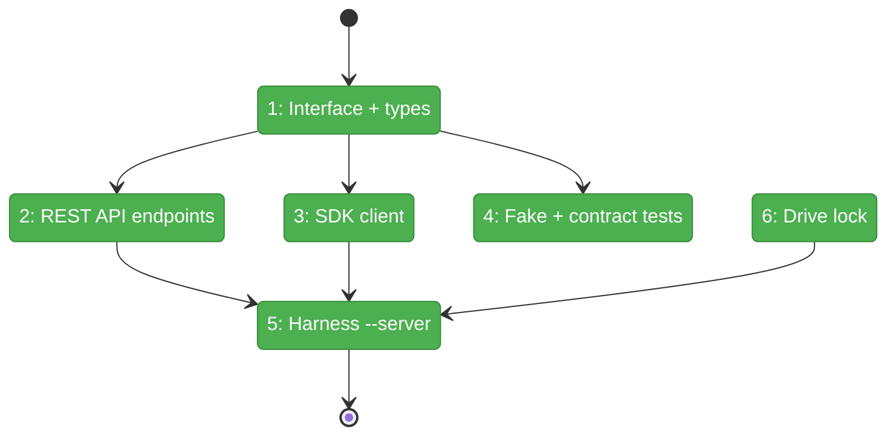
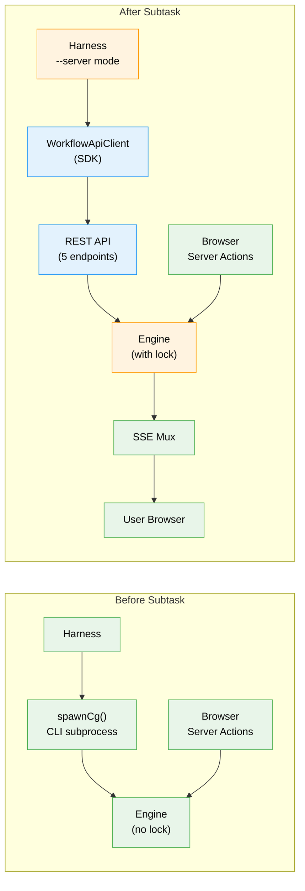

# Flight Plan: Subtask 001 — Workflow REST API + SDK

**Subtask**: [001-subtask-workflow-rest-api-sdk.md](001-subtask-workflow-rest-api-sdk.md)
**Parent Phase**: Phase 4: End-to-End Validation + Docs
**Generated**: 2026-03-21
**Status**: Landed

---

## What → Why

**Problem**: The harness can't trigger workflow execution through the web server — only via CLI subprocess. This means the web path is untestable from the harness, concurrent CLI+web runs can corrupt graph state, and the user never sees harness-triggered runs in their browser.

**Fix**: 5 REST endpoints + typed SDK client + drive lock. Harness calls `POST /execution` → user sees nodes moving in browser → one path, one lock, one truth.

---

## Domain Context

### Domains We're Changing

| Domain | What Changes | Key Files |
|--------|-------------|-----------|
| workflow-ui | 5 new REST API routes (Tier 1 execution control) | `apps/web/app/api/workspaces/[slug]/workflows/[graphSlug]/execution/route.ts`, `.../detailed/route.ts` |
| _platform/positional-graph | Drive lock moves into engine | `packages/positional-graph/src/features/030-orchestration/graph-orchestration.ts` |
| _(harness)_ | SDK client + `--server` mode | `harness/src/sdk/workflow-api-client.ts`, `harness/src/cli/commands/workflow.ts` |

### Domains We Depend On (no changes)

| Domain | What We Consume | Contract |
|--------|----------------|----------|
| workflow-ui | WorkflowExecutionManager | start/stop/restart/getStatus |
| _platform/events | SSE mux | Browser receives execution-update events |

---

## Flight Status

**Legend**: grey = pending | yellow = active | red = blocked/needs input | green = done

---

## Stages

- [x] **Stage 1: Define contract** — IWorkflowApiClient interface + response DTOs (`workflow-api-client.interface.ts`)
- [x] **Stage 2: Build REST API** — 5 Tier 1 endpoints wrapping WorkflowExecutionManager (`execution/route.ts`, `detailed/route.ts`)
- [x] **Stage 3: Build SDK client** — WorkflowApiClient with typed fetch calls (`workflow-api-client.ts`)
- [x] **Stage 4: Build fake + tests** — FakeWorkflowApiClient + contract test suite (`fake-workflow-api-client.ts`, `workflow-api-client.test.ts`)
- [x] **Stage 5: Wire harness** — `--server` mode in workflow commands, uses SDK instead of spawnCg
- [x] **Stage 6: Drive lock** — Move filesystem lock into GraphOrchestration.drive(), remove from CLI

---

## Architecture: Before & After

---

## Acceptance Criteria

- [x] `POST /api/workspaces/{slug}/workflows/{graph}/execution` starts a workflow
- [x] `GET .../execution` returns current execution status
- [x] `DELETE .../execution` stops a running workflow
- [x] `GET .../detailed` returns per-node status with timing/sessions/blockers
- [x] `WorkflowApiClient` implements `IWorkflowApiClient` with typed fetch calls
- [x] `FakeWorkflowApiClient` passes same contract tests as real client
- [x] `harness workflow run --server` triggers web execution and user sees it in browser
- [x] Concurrent `drive()` calls on same graph are rejected (lock in engine)

---

## Checklist

- [x] ST001: Define IWorkflowApiClient interface + response types
- [x] ST002: Implement Tier 1 REST API endpoints (5 routes)
- [x] ST003: Implement WorkflowApiClient (fetch-based SDK)
- [x] ST004: Implement FakeWorkflowApiClient + contract tests
- [x] ST005: Wire SDK into harness `--server` mode
- [x] ST006: Move drive lock into GraphOrchestration.drive()
