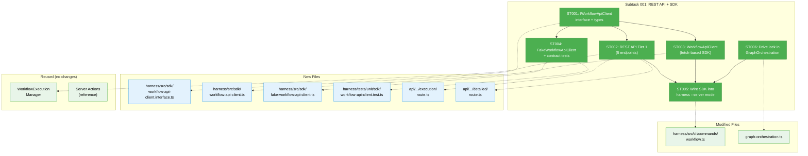
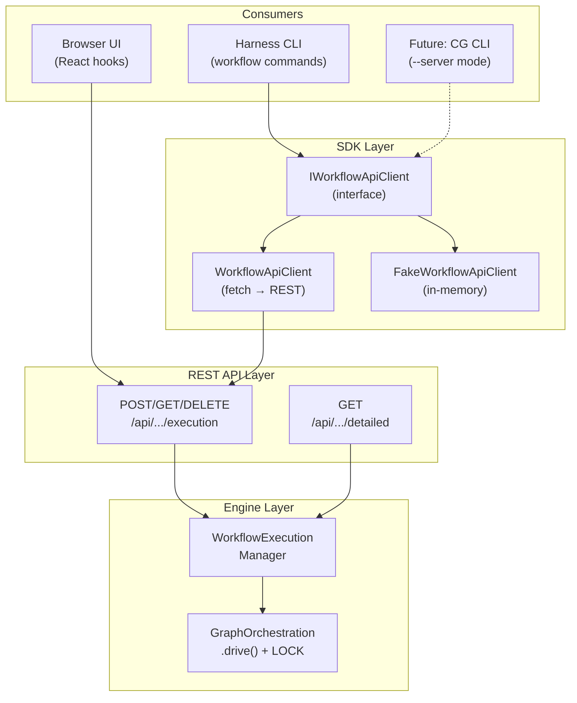
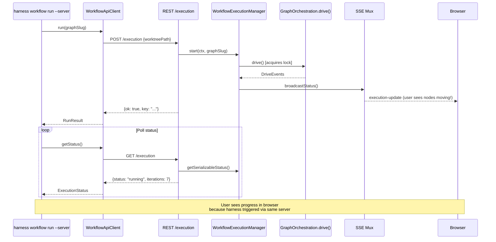

# Subtask 001: Workflow REST API + SDK

**Parent Phase**: Phase 4: End-to-End Validation + Docs
**Parent Task**: T001 (Web UI validation — blocked without API for harness-triggered execution)
**Plan**: [harness-workflow-runner-plan.md](../../harness-workflow-runner-plan.md)
**Workshop**: [004-workflow-rest-api.md](../../workshops/004-workflow-rest-api.md)
**Created**: 2026-03-21
**Status**: Complete

---

## Parent Context

Phase 4 T001 requires validating the web UI execution path. Currently:
- The browser "Run" button uses **Server Actions** (not REST) — callable only from React components
- The harness can't trigger web execution without browser automation
- CLI and web drive loops have no cross-process lock — concurrent runs corrupt graph state

This subtask adds Tier 1 REST API endpoints + a typed SDK client so the harness can trigger and observe workflow execution through the web server. When the harness calls `POST /api/workspaces/{slug}/workflows/{graph}/execution`, the user sees nodes progressing in their browser — same as if they clicked Run.

---

## Executive Briefing

**Purpose**: Create a REST API for workflow execution control, a typed SDK that consumes it, and wire the SDK into the harness workflow commands. This gives the harness "server mode" — executing workflows through the web server instead of CLI subprocess, enabling full web path validation without browser automation.

**What We're Building**:
1. **5 REST API endpoints** (Tier 1) in `apps/web/app/api/workspaces/[slug]/workflows/[graphSlug]/`
2. **IWorkflowApiClient interface** — typed contract for the SDK
3. **WorkflowApiClient** — fetch-based HTTP client implementing the interface
4. **FakeWorkflowApiClient** — mock implementation for SDK unit testing
5. **SDK unit tests** — contract tests verifying Fake/Real parity (existing codebase pattern)
6. **Harness integration** — `workflow run --server` mode uses SDK instead of CLI subprocess
7. **Drive lock** in `GraphOrchestration.drive()` — one lock, one place

**Goals**:
- ✅ Harness can trigger workflow execution via web server REST API
- ✅ User sees harness-triggered runs in their browser (same SSE path)
- ✅ SDK is independently testable with FakeWorkflowApiClient
- ✅ Contract well-defined via IWorkflowApiClient interface
- ✅ Drive lock prevents concurrent CLI + web corruption
- ✅ Loose coupling: SDK depends on interface, not implementation

**Non-Goals**:
- ❌ Tier 2/3 endpoints (graph CRUD, unit CRUD, templates) — future plan
- ❌ `cg wf run --server` CLI variant — future plan
- ❌ PACT contract testing setup — follow-up workshop
- ❌ Auto-completion via REST — keep direct import for now
- ❌ OpenAPI spec generation — future plan

---

## Pre-Implementation Check

| File | Exists? | Domain Check | Notes |
|------|---------|-------------|-------|
| `apps/web/app/api/workspaces/[slug]/workflows/` | ✗ New | workflow-ui | New route directory |
| `apps/web/app/api/workspaces/[slug]/workflows/[graphSlug]/execution/route.ts` | ✗ New | workflow-ui | Thin wrapper around WorkflowExecutionManager |
| `apps/web/app/api/workspaces/[slug]/workflows/[graphSlug]/detailed/route.ts` | ✗ New | workflow-ui | Wraps getReality() |
| `harness/src/sdk/workflow-api-client.ts` | ✗ New | _(harness)_ | Typed fetch-based SDK |
| `harness/src/sdk/workflow-api-client.interface.ts` | ✗ New | _(harness)_ | IWorkflowApiClient contract |
| `harness/src/sdk/fake-workflow-api-client.ts` | ✗ New | _(harness)_ | Mock for testing |
| `harness/tests/unit/sdk/workflow-api-client.test.ts` | ✗ New | _(harness)_ | Contract tests |
| `harness/src/cli/commands/workflow.ts` | ✓ | _(harness)_ | Add --server mode |
| `packages/positional-graph/src/features/030-orchestration/graph-orchestration.ts` | ✓ | _platform/positional-graph | Add drive lock |
| `apps/web/app/actions/workflow-execution-actions.ts` | ✓ | workflow-ui | Reference for endpoint logic |

**Concept Search**: No existing HTTP SDK for workflow operations. Existing patterns: native `fetch()` in harness health probes, SdkCopilotAdapter for agent SDK pattern, contract tests in `test/contracts/` with Fake/Real parity.

---

## Architecture Map

---

## Tasks

| Status | ID | Task | Domain | Path(s) | Done When | Notes |
|--------|-----|------|--------|---------|-----------|-------|
| [x] | ST001 | Define `IWorkflowApiClient` interface + response types — the contract between SDK consumers and the REST API | _(harness)_ | `harness/src/sdk/workflow-api-client.interface.ts` | Interface exports: `IWorkflowApiClient` with 5 methods (run, stop, restart, getStatus, getDetailed), plus typed response DTOs (RunResult, ExecutionStatus, DetailedStatus). All types are serializable (no AbortController/Promise internals). | **Contract-first**: define the interface before implementing either side. Methods mirror the 5 Tier 1 endpoints from Workshop 004. Response types match existing `SerializableExecutionStatus` + `--detailed` output contract from Phase 2. Interface must be importable from both SDK and test code without pulling in fetch or server dependencies. |
| [x] | ST002 | Implement Tier 1 REST API endpoints — 5 routes wrapping WorkflowExecutionManager | workflow-ui | `apps/web/app/api/workspaces/[slug]/workflows/[graphSlug]/execution/route.ts` (new), `apps/web/app/api/workspaces/[slug]/workflows/[graphSlug]/execution/restart/route.ts` (new), `apps/web/app/api/workspaces/[slug]/workflows/[graphSlug]/detailed/route.ts` (new) | `POST /execution` starts workflow (returns RunResult), `GET /execution` returns status, `DELETE /execution` stops, `POST /execution/restart` restarts, `GET /detailed` returns getReality() output. All follow existing route pattern: `export const dynamic = 'force-dynamic'`, auth gate (with `DISABLE_AUTH` bypass), DI container resolution. | Thin wrappers — logic is in `workflow-execution-actions.ts` and can be mostly copied. Follow `apps/web/app/api/agents/route.ts` pattern (lines 53-95): auth → container → service → JSON response. Params are `Promise<{slug, graphSlug}>` (Next.js 16 async params). worktreePath from query param or request body. |
| [x] | ST003 | Implement `WorkflowApiClient` — typed fetch-based SDK | _(harness)_ | `harness/src/sdk/workflow-api-client.ts` | Class implements `IWorkflowApiClient`. Constructor takes `{baseUrl, workspaceSlug, worktreePath}`. Each method maps to a fetch call. Responses parsed and typed. Error handling wraps fetch failures into typed errors. | Follow harness health probe pattern (native `fetch()`). No axios dependency. Constructor DI for base URL enables both local (`localhost:3000`) and container (`chainglass-wt:3000`) usage. Timeout on fetch via `AbortSignal.timeout()`. |
| [x] | ST004 | Implement `FakeWorkflowApiClient` + contract tests | _(harness)_ | `harness/src/sdk/fake-workflow-api-client.ts` (new), `harness/tests/unit/sdk/workflow-api-client.test.ts` (new) | `FakeWorkflowApiClient` implements `IWorkflowApiClient` with in-memory state. Contract test suite runs against both Fake and (when server available) Real client. Tests verify: run returns key, status reflects running, stop stops, restart resets, detailed returns node data. | Follow existing contract test pattern from `test/contracts/agent-instance.contract.test.ts`: shared test suite function called with different implementations. Fake tracks state transitions in memory. PACT integration deferred to follow-up workshop. |
| [x] | ST005 | Wire SDK into harness `workflow run --server` mode | _(harness)_ | `harness/src/cli/commands/workflow.ts` | `harness workflow run --server` uses `WorkflowApiClient` instead of `spawnCg()`: POST to start, poll GET for status, GET detailed for final snapshot. `harness workflow status --server` uses GET detailed. Events observed via SSE polling or GET status polling. | `--server` option added to `run` and `status` subcommands. When `--server`: instantiate `WorkflowApiClient({baseUrl, workspaceSlug, worktreePath})`, call SDK methods. Existing `--target local` path unchanged (still uses `spawnCg`). Auto-completion still uses direct imports (REST auto-completion is future scope). |
| [x] | ST006 | Move filesystem lock into `GraphOrchestration.drive()` | _platform/positional-graph | `packages/positional-graph/src/features/030-orchestration/graph-orchestration.ts` | `drive()` acquires filesystem lock at `{graphPath}/drive.lock` before iteration loop, releases in finally block. Both CLI and web paths protected. Second concurrent `drive()` on same graph gets clear error. Remove CLI-level lock from `positional-graph.command.ts`. | Per user decision: "must be same code, same system." Lock uses PID validation pattern from Phase 1 (check if existing lock PID is alive). `graphPath` available from service context. Remove duplicate lock logic from CLI command handler. Existing unit tests must still pass (FakeODS/FakeGraphOrchestration don't use filesystem). |

---

## Context Brief

### Key Findings

- **Workshop 004**: Designed full 3-tier REST API. Tier 1 (5 endpoints) is minimum for Phase 4 validation.
- **Existing route pattern**: Auth → DI container → service → JSON response. Dynamic route params are `Promise<{...}>` in Next.js 16.
- **Existing SDK pattern**: `SdkCopilotAdapter` uses constructor DI, implements interface, delegates to injected client.
- **Existing contract test pattern**: `test/contracts/*.contract.test.ts` — shared test suite runs against Fake and Real implementations.
- **No PACT**: Codebase uses Vitest-based contract tests. PACT setup deferred to follow-up workshop.
- **DYK #1**: Drive lock must be in engine, not CLI — both paths go through `drive()`.

### Domain Dependencies

| Domain | Contract | What We Use |
|--------|----------|-------------|
| workflow-ui | `WorkflowExecutionManager` | start/stop/restart/getSerializableStatus — REST endpoints delegate to this |
| _platform/positional-graph | `IGraphOrchestration.drive()` | Add lock acquisition here |
| _platform/positional-graph | `IGraphOrchestration.getReality()` | `/detailed` endpoint returns this |
| _(harness)_ | `HarnessEnvelope` | `workflow run --server` returns same envelope format |

### Domain Constraints

- REST endpoints go in `apps/web/app/api/` — standard Next.js API routes
- SDK lives in `harness/src/sdk/` — external tooling, no monorepo service imports
- Interface lives in harness (not shared package) — SDK is harness-scoped for now
- Lock change in positional-graph must not break existing tests (FakeGraphOrchestration)

### Layered Architecture

### Contract Flow

---

## After Subtask Completion

When all ST tasks are done:
1. **T001 (Web UI validation)** is unblocked — harness can trigger execution via `--server` and user sees it in browser
2. **T006 (Final dogfooding)** can run `harness workflow run --server` for full round-trip proof
3. Resume Phase 4 remaining tasks (T002-T006) with the API + SDK available
4. **PACT workshop** can be scheduled to formalize contract testing between SDK and API

---

## Discoveries & Learnings

_Populated during implementation by plan-6._

| Date | Task | Type | Discovery | Resolution | References |
|------|------|------|-----------|------------|------------|
| 2026-03-22 | ST002 | pattern | REST route helper `_resolve-worktree.ts` extracted from server actions to share validation logic between routes | Created shared helper in execution/ directory, imported by all 3 route files | `apps/web/app/api/.../execution/_resolve-worktree.ts` |
| 2026-03-22 | ST002 | design | Detailed endpoint replicates CLI `wf show --detailed` logic — builds reality via OrchestrationService + formats inline | Duplicated CLI's formatting logic into REST handler; converts Map→object for JSON serialization | `apps/web/app/api/.../detailed/route.ts` |
| 2026-03-22 | ST006 | gotcha | `node:fs` imports in graph-orchestration.ts need biome import ordering (node: before relative imports) | Fixed via `biome check --fix --unsafe` | `graph-orchestration.ts` |
| 2026-03-22 | ST005 | design | Harness `--server` mode polls getStatus() every 2s vs local mode's streaming NDJSON — trade-off is less real-time but works through REST | Acceptable for Phase 4 validation; SSE polling could be added later | `workflow.ts` |
| 2026-03-22 | ST006 | gotcha | Spawner test `cg-spawner.test.ts` fails after CLI source change because CLI bundle is stale — `checkBuildFreshness()` catches it | Rebuild via `just fft` (which runs build first) | `harness/tests/unit/cli/cg-spawner.test.ts` |
