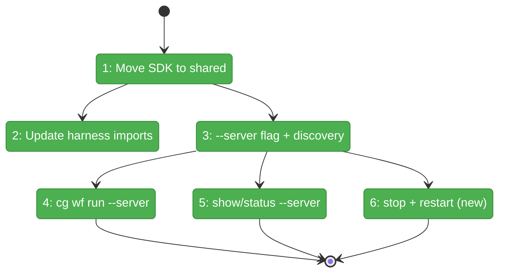
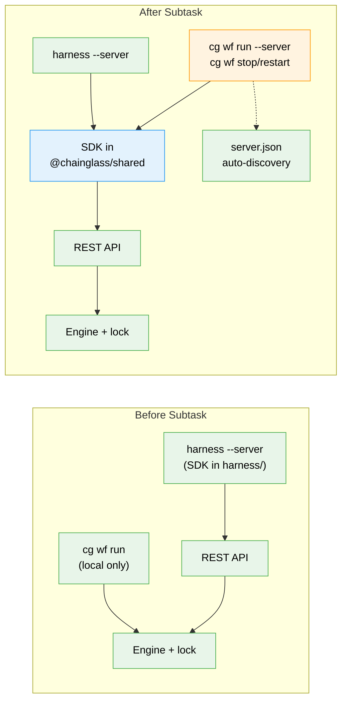

# Flight Plan: Subtask 002 — CG CLI Server Mode Commands

**Subtask**: [002-subtask-cg-cli-server-mode.md](002-subtask-cg-cli-server-mode.md)
**Parent Phase**: Phase 4: End-to-End Validation + Docs
**Generated**: 2026-03-23
**Status**: Landed

---

## What → Why

**Problem**: The `cg` CLI — what users actually type — only drives workflows locally. The web server has REST endpoints (Subtask 001) and the harness has `--server` mode, but the user's main tool can't use them. There's also no way to stop or restart a web-hosted execution from the command line.

**Fix**: Move SDK to shared package, add `--server` flag to `cg wf`, implement 5 server-mode commands. User types `cg wf run --server` → web server drives → browser shows live progress.

---

## Domain Context

### Domains We're Changing

| Domain | What Changes | Key Files |
|--------|-------------|-----------|
| _platform/shared | SDK moved here — new `./sdk/workflow` subpath export | `packages/shared/src/sdk/workflow/`, `packages/shared/package.json` |
| _platform/positional-graph | `--server` flag + 4 server-mode handlers + 2 new commands | `apps/cli/src/commands/positional-graph.command.ts` |
| _(harness)_ | Import paths updated to `@chainglass/shared/sdk/workflow` | `harness/src/sdk/`, `harness/src/cli/commands/workflow.ts` |

### Domains We Depend On (no changes)

| Domain | What We Consume | Contract |
|--------|----------------|----------|
| workflow-ui | REST API Tier 1 | 5 execution endpoints (from Subtask 001) |
| _platform/shared | `readServerInfo()` | Port discovery from `.chainglass/server.json` |

---

## Flight Status

**Legend**: grey = pending | yellow = active | red = blocked/needs input | green = done

---

## Stages

- [x] **Stage 1: Move SDK** — Move interface + client to `packages/shared/src/sdk/workflow/`, add barrel + package.json export
- [x] **Stage 2: Update harness** — Repoint harness imports, delete old files, verify 83 tests pass
- [x] **Stage 3: Wire CLI** — Add `--server` parent flag, `discoverServerUrl()`, SDK instantiation in `positional-graph.command.ts`
- [x] **Stage 4: Run command** — `cg wf run --server` with poll loop, NDJSON synthesis, timeout
- [x] **Stage 5: Read commands** — `cg wf show --detailed --server` + `cg wf status --server`
- [x] **Stage 6: New commands** — `cg wf stop` + `cg wf restart` (server-only)

---

## Architecture: Before & After

---

## Acceptance Criteria

- [x] `cg wf run test-workflow --server` starts execution via REST, user sees it in browser
- [x] `cg wf run test-workflow --server --json-events` emits NDJSON status lines
- [x] `cg wf show test-workflow --detailed --server --json` returns same structure as local
- [x] `cg wf status test-workflow --server` returns execution status
- [x] `cg wf stop test-workflow` stops a web-hosted execution
- [x] `cg wf restart test-workflow` restarts a web-hosted execution
- [x] `cg wf stop` without `--server` prints helpful error
- [x] Server URL auto-discovered from `.chainglass/server.json` — zero config needed
- [x] `import { WorkflowApiClient } from '@chainglass/shared/sdk/workflow'` works
- [x] All 5581 monorepo tests + 83 harness tests pass

---

## Checklist

- [x] ST001: Move SDK to packages/shared/src/sdk/workflow/
- [x] ST002: Update harness imports
- [x] ST003: Add --server flag + discoverServerUrl to cg wf
- [x] ST004: Implement cg wf run --server
- [x] ST005: Implement cg wf show/status --server
- [x] ST006: Add cg wf stop + restart commands
