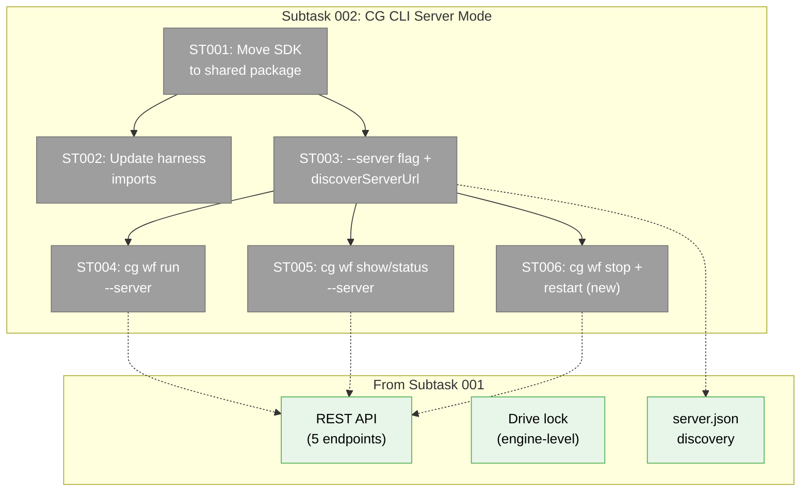
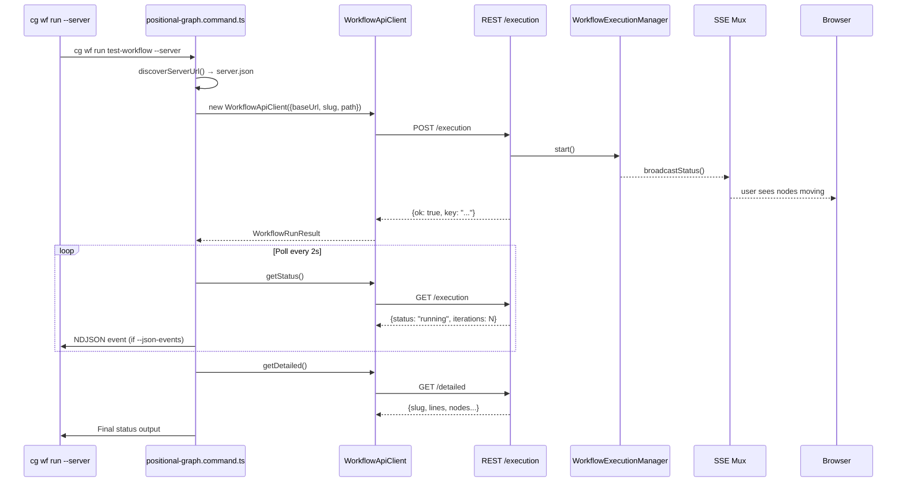

# Subtask 002: CG CLI Server Mode Commands

**Parent Phase**: Phase 4: End-to-End Validation + Docs
**Parent Task**: N/A — extends Phase 4 with CG CLI `--server` mode (builds on Subtask 001 REST API + SDK)
**Plan**: [harness-workflow-runner-plan.md](../../harness-workflow-runner-plan.md)
**Workshop**: [006-cg-cli-server-mode.md](../../workshops/006-cg-cli-server-mode.md)
**Created**: 2026-03-23
**Status**: Complete

---

## Parent Context

Subtask 001 delivered 5 REST API endpoints + a typed SDK client in the harness. The harness can now trigger workflow execution via `--server` mode and the user sees it in their browser. But the **main `cg` CLI** — what users actually type — still only drives locally. This subtask moves the SDK to `packages/shared` so both CLI and harness can consume it, then adds `--server` mode to `cg wf` commands.

**What exists (from Subtask 001)**:
- 5 REST endpoints at `/api/workspaces/{slug}/workflows/{graphSlug}/{execution,detailed}`
- `IWorkflowApiClient` interface (5 methods) + `WorkflowApiClient` (fetch-based)
- Drive lock in `GraphOrchestration.drive()` — protects both CLI and web paths
- `.chainglass/server.json` port discovery (Plan 067) — already used by Event Popper CLI

**What's missing**:
- SDK lives in `harness/src/sdk/` — CG CLI can't import it
- `cg wf run` only drives locally — no `--server` option
- No `cg wf stop` command — no way to stop a web-hosted execution from CLI
- No `cg wf restart` command

---

## Executive Briefing

**Purpose**: Add `--server` mode to 5 `cg wf` commands so users can drive workflows through the web server from the CLI. When you type `cg wf run test-workflow --server`, the web server's WorkflowExecutionManager runs the drive loop, SSE events reach the browser, and you see nodes progressing — same as clicking Run in the UI.

**What We're Building**:
1. Move SDK to `packages/shared/src/sdk/workflow/` — single source of truth
2. `--server` parent flag on `cg wf` with auto-discovery via `.chainglass/server.json`
3. `cg wf run --server` — POST to start, poll for status, synthesize NDJSON events
4. `cg wf show --detailed --server` — GET /detailed via SDK
5. `cg wf status --server` — GET /execution via SDK
6. `cg wf stop` — NEW command (DELETE /execution, server-only)
7. `cg wf restart` — NEW command (POST /execution/restart, server-only)

**Goals**:
- ✅ `cg wf run test-workflow --server` drives through web server, user sees it in browser
- ✅ `cg wf stop test-workflow` stops a web-hosted execution
- ✅ Server URL auto-discovered from `.chainglass/server.json` (zero config)
- ✅ SDK importable from `@chainglass/shared/sdk/workflow` by any package
- ✅ Existing local mode unchanged — `--server` is opt-in

**Non-Goals**:
- ❌ `--server` for CRUD commands (create, delete, line/node — needs Tier 2/3 REST)
- ❌ SSE streaming from CLI (polling is fine for v1)
- ❌ `--server` as default (future decision)
- ❌ Remote server support (localhost only for now)

---

## Pre-Implementation Check

| File | Exists? | Domain Check | Notes |
|------|---------|-------------|-------|
| `packages/shared/src/sdk/workflow/index.ts` | ✗ New | _platform/shared | New barrel export for SDK |
| `packages/shared/src/sdk/workflow/workflow-api-client.interface.ts` | ✗ Move | _platform/shared | From harness/src/sdk/ |
| `packages/shared/src/sdk/workflow/workflow-api-client.ts` | ✗ Move | _platform/shared | From harness/src/sdk/ |
| `packages/shared/package.json` | ✓ | _platform/shared | Add `./sdk/workflow` export |
| `harness/src/sdk/workflow-api-client.interface.ts` | ✓ Delete | _(harness)_ | Replaced by shared import |
| `harness/src/sdk/workflow-api-client.ts` | ✓ Delete | _(harness)_ | Replaced by shared import |
| `harness/src/sdk/fake-workflow-api-client.ts` | ✓ | _(harness)_ | Update imports only, stays in harness |
| `harness/src/cli/commands/workflow.ts` | ✓ | _(harness)_ | Update imports |
| `harness/tests/unit/sdk/workflow-api-client.test.ts` | ✓ | _(harness)_ | Update imports |
| `apps/cli/src/commands/positional-graph.command.ts` | ✓ | _platform/positional-graph | Add --server flag + 4 server-mode handlers |

**Concept Search**: `discoverServerUrl()` exists in `event-popper-client.ts` — reusable pattern for server URL discovery.

---

## Architecture Map

---

## Tasks

| Status | ID | Task | Domain | Path(s) | Done When | Notes |
|--------|-----|------|--------|---------|-----------|-------|
| [x] | ST001 | Move SDK interface + client to `packages/shared/src/sdk/workflow/` — create barrel export, add `./sdk/workflow` subpath to package.json exports | _platform/shared | `packages/shared/src/sdk/workflow/index.ts` (new), `packages/shared/src/sdk/workflow/workflow-api-client.interface.ts` (move), `packages/shared/src/sdk/workflow/workflow-api-client.ts` (move), `packages/shared/package.json` (modify) | `import { WorkflowApiClient } from '@chainglass/shared/sdk/workflow'` works from both harness and CLI. Build succeeds. | Move only interface + real client. FakeWorkflowApiClient stays in harness (test double). Follow existing `./event-popper` export pattern. |
| [x] | ST002 | Update harness imports — point to `@chainglass/shared/sdk/workflow` instead of relative `../../sdk/` | _(harness)_ | `harness/src/sdk/fake-workflow-api-client.ts` (modify imports), `harness/src/cli/commands/workflow.ts` (modify imports), `harness/tests/unit/sdk/workflow-api-client.test.ts` (modify imports) | All 83 harness unit tests pass with new import paths. Delete old `harness/src/sdk/workflow-api-client.interface.ts` and `harness/src/sdk/workflow-api-client.ts`. | Keep `fake-workflow-api-client.ts` in harness — imports interface from shared. |
| [x] | ST003 | Add `--server` parent flag + `discoverServerUrl()` to `cg wf` command group — resolves server URL from `.chainglass/server.json` or `--server-url` override | _platform/positional-graph | `apps/cli/src/commands/positional-graph.command.ts` | `cg wf --server --help` shows the flag. `discoverServerUrl()` reads `server.json` with PID validation. Error message "Chainglass server not running" when server.json missing. | Reuse `readServerInfo()` from `@chainglass/shared/event-popper`. Follow `event-popper-client.ts discoverServerUrl()` pattern. Parent-level option so all subcommands inherit it. |
| [x] | ST004 | Implement `cg wf run <slug> --server` — POST to start, poll GET for status every 2s, synthesize NDJSON events if `--json-events`, GET /detailed on completion | _platform/positional-graph | `apps/cli/src/commands/positional-graph.command.ts` | `cg wf run test-workflow --server` starts execution via REST, prints final status. With `--json-events`, emits NDJSON status lines every poll. `--timeout` kills poll loop. | Mirror harness `runViaServer()` pattern but integrated into existing CLI output adapters (JSON adapter, text adapter). |
| [x] | ST005 | Implement `cg wf show --detailed --server` and `cg wf status --server` — GET endpoints via SDK | _platform/positional-graph | `apps/cli/src/commands/positional-graph.command.ts` | `cg wf show test-workflow --detailed --server --json` returns identical structure to local `--detailed`. `cg wf status test-workflow --server` returns execution status. | For `show --detailed --server`: GET /detailed, format through existing adapter. For `status --server`: GET /execution, format through adapter. |
| [x] | ST006 | Add new `cg wf stop <slug>` and `cg wf restart <slug>` commands — auto-discover server via server.json, DELETE/POST via SDK | _platform/positional-graph | `apps/cli/src/commands/positional-graph.command.ts` | `cg wf stop test-workflow` stops web-hosted execution. `cg wf restart test-workflow` restarts it. Auto-discovers server from server.json — no `--server` flag required. If no server running, prints actionable error. | DYK #2: These commands only work server-side, so `--server` is implicit. Auto-discover via `readServerInfo()`. Error: "No running server found. Start with `just dev` or use `--server-url`." |

---

## Context Brief

### Key Findings

- **Workshop 006**: 5 commands get `--server`, 24+ CRUD commands don't (no value). Stop/restart are new server-only commands.
- **server.json discovery**: `readServerInfo()` from `@chainglass/shared/event-popper` — Zod-validated, PID-checked, recycling-safe. Already used by Event Popper CLI.
- **discoverServerUrl()**: Existing pattern in `event-popper-client.ts` — two-location fallback (cwd → apps/web).
- **SDK export pattern**: `packages/shared/package.json` has 13 subpath exports. Add `./sdk/workflow` following `./event-popper` pattern.
- **CLI output adapters**: `cg wf` commands use `adapter.format('wf.show', data)` — server mode must produce same data shapes so adapters work unchanged.

### Domain Dependencies

| Domain | Contract | What We Use |
|--------|----------|-------------|
| _platform/shared | `@chainglass/shared/event-popper` | `readServerInfo()` for port discovery |
| _platform/shared | `@chainglass/shared/sdk/workflow` (new) | `WorkflowApiClient`, `IWorkflowApiClient` |
| workflow-ui | REST API Tier 1 (5 endpoints) | Server-side execution control |
| _platform/positional-graph | `IGraphOrchestration.drive()` | Engine lock protects concurrent access |

### Domain Constraints

- CLI commands live in `apps/cli/src/commands/positional-graph.command.ts` — single file, large
- SDK moves to `packages/shared` — must build before CLI can import
- `--server` is opt-in — all existing local-mode behavior must be preserved
- New `stop`/`restart` commands are server-only — no local equivalent

### Reusable from Subtask 001

- `WorkflowApiClient` class — constructor DI, typed methods, error handling
- `IWorkflowApiClient` interface — 5 methods matching REST endpoints
- Response DTOs — `WorkflowRunResult`, `WorkflowStopResult`, `WorkflowExecutionStatus`, `WorkflowDetailedStatus`
- `resolveServerContext()` in harness — reference implementation for URL + workspace resolution
- `runViaServer()` in harness — reference implementation for poll-based execution

### Contract Flow

---

## After Subtask Completion

When all ST tasks are done:
1. Users can `cg wf run test-workflow --server` and see it in their browser
2. Users can `cg wf stop test-workflow` to halt a web-hosted run
3. SDK is in `packages/shared` — any future consumer (plugins, scripts) can import it
4. Phase 4 T006 (final dogfooding) can include a `--server` mode proof

---

## Critical Insights (2026-03-23)

| # | Insight | Decision |
|---|---------|----------|
| 1 | Ctrl+C in `--server` mode disconnects observer but workflow keeps running on server — different from local where Ctrl+C stops drive | By design: CLI is fire-and-forget. User sends `cg wf stop` to kill. |
| 2 | `stop`/`restart` only work in server mode — requiring `--server` flag is unnecessary friction | Auto-discover server via server.json. No `--server` flag needed on these two commands. Fall back to helpful error if no server found. |
| 3 | REST endpoints validate worktreePath against registered workspaces — local mode doesn't require registration | Catch 400 and print actionable error: "Workspace not registered. Register at http://... or run `cg workspace register`." |
| 4 | `--json-events` local emits per-iteration events (sub-second), server polls every 2s — agents see different fidelity | Add `"mode": "server"\|"local"` field to NDJSON events. Document polling vs streaming in help text. |
| 5 | REST endpoints require auth session — SDK sends plain fetch with no auth headers, only works with DISABLE_AUTH=true | Add `localToken` field to `.chainglass/server.json` (random, rotates per restart). CLI reads and sends as header. REST accepts local token OR session auth. Filesystem access = trust boundary. |

Action items:
- ST004: Implement fire-and-forget Ctrl+C behavior (no SIGINT→stop)
- ST006: `stop`/`restart` auto-discover server.json, no `--server` required
- ST004: Catch 400 with actionable "workspace not registered" error
- ST004: Add `mode` field to synthesized NDJSON events
- NEW: Add `localToken` to server.json write + REST endpoint auth check (cross-cuts ST001/ST003)

---

## Discoveries & Learnings

_Populated during implementation by plan-6._

| Date | Task | Type | Discovery | Resolution | References |
|------|------|------|-----------|------------|------------|
