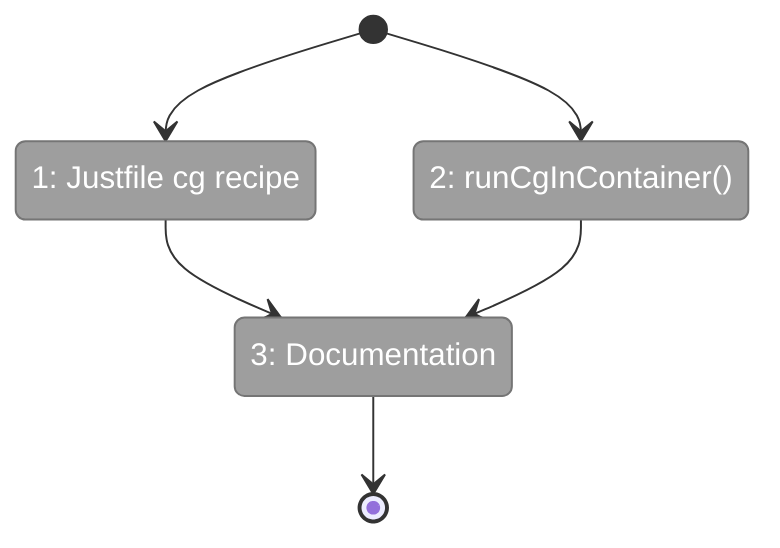
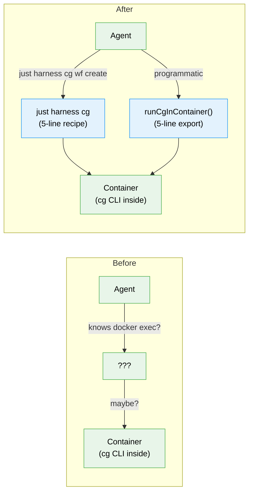

# Flight Plan: Subtask 003 — Harness Container CG Commands

**Subtask**: [003-subtask-harness-container-cg.md](003-subtask-harness-container-cg.md)
**Parent Phase**: Phase 4: End-to-End Validation + Docs
**Generated**: 2026-03-23
**Status**: Ready for takeoff

---

## What → Why

**Problem**: Agents can't easily run `cg wf` commands inside the harness Docker container. The plumbing exists (`docker exec`, `runCg --target container`) but there's no shortcut and no documentation — agents coming in cold have no idea this flow exists.

**Fix**: One justfile recipe (`just harness cg`), one export (`runCgInContainer()`), three doc updates. Agent types `just harness cg wf create my-test` and it works.

---

## Domain Context

### Domains We're Changing

| Domain | What Changes | Key Files |
|--------|-------------|-----------|
| _(harness)_ | New `cg` justfile recipe + `runCgInContainer()` export | `harness/justfile`, `harness/src/test-data/cg-runner.ts` |
| docs | Container CG flow added to project rules, README, CLAUDE.md | 3 doc files |

### Domains We Depend On (no changes)

| Domain | What We Consume | Contract |
|--------|----------------|----------|
| _(harness)_ | `runCg()` + `computePorts()` | Existing container execution |
| _platform/positional-graph | `cg wf --server` | CLI commands from Subtask 002 |

---

## Flight Status

**Legend**: grey = pending | yellow = active | red = blocked/needs input | green = done

---

## Stages

- [ ] **Stage 1: Justfile recipe** — add `cg` recipe that wraps `docker exec` (`harness/justfile`)
- [ ] **Stage 2: Export helper** — add `runCgInContainer()` to cg-runner.ts (`harness/src/test-data/cg-runner.ts`)
- [ ] **Stage 3: Documentation** — README container section, project rules CLI table, CLAUDE.md harness commands

---

## Architecture: Before & After

---

## Acceptance Criteria

- [ ] `just harness cg wf show test-workflow --detailed --json` returns valid JSON from container
- [ ] `just harness cg wf run test-workflow --server --json` starts workflow via container's web server
- [ ] `import { runCgInContainer } from '../../test-data/cg-runner.js'` works in harness code
- [ ] CLAUDE.md shows `just harness cg` in Harness Commands
- [ ] `docs/project-rules/harness.md` has full create→run→stop recipe

---

## Checklist

- [ ] ST001: Add `cg` recipe to harness justfile
- [ ] ST002: Export `runCgInContainer()` from cg-runner
- [ ] ST003: Documentation (README + project rules + CLAUDE.md)
