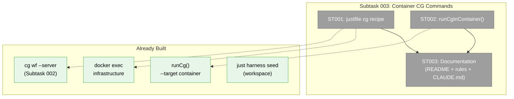

# Subtask 003: Harness Container CG Command Execution

**Parent Phase**: Phase 4: End-to-End Validation + Docs
**Parent Task**: T001 (Web UI validation — needs container-based execution for full proof)
**Plan**: [harness-workflow-runner-plan.md](../../harness-workflow-runner-plan.md)
**Workshop**: [007-harness-container-commands.md](../../workshops/007-harness-container-commands.md)
**Created**: 2026-03-23
**Status**: Pending

---

## Parent Context

Subtask 001 built the REST API + SDK. Subtask 002 added `--server` mode to the `cg` CLI. Both were proven working against the local dev server. But the harness runs inside a **Docker container** — agents need a simple, discoverable way to run `cg` commands inside that container so they can create workflows, run them via `--server`, observe progress, and verify results all against the container's web server.

**What exists**:
- `runCg()` and `spawnCg()` already support `--target container` via `docker exec`
- Container name derived from `computePorts().worktree` → `chainglass-${name}`
- CLI path inside container: `node /app/apps/cli/dist/cli.cjs`
- Workspace path inside container: `/app/scratch/harness-test-workspace/`
- `server.json` auto-discovery works via two-path fallback (`cwd` → `apps/web/`)

**What's missing**:
- No `just harness cg` shortcut — agents must know the full `docker exec` invocation
- No exported `runCgInContainer()` for programmatic use by harness commands/agents
- No documentation showing agents the end-to-end container workflow
- Harness project rules don't mention `cg wf` commands at all

---

## Executive Briefing

**Purpose**: Give agents a one-command way to run any `cg` CLI command inside the harness container, and make the end-to-end workflow flow (create → run → observe → stop) discoverable from project rules and README.

**What We're Building**:
1. `just harness cg <args>` justfile recipe — wraps `docker exec` with correct container name + workspace path
2. `runCgInContainer()` export from harness — programmatic equivalent for harness commands and agent scripts
3. Documentation updates — README, project rules, how-to guide sections showing the container flow

**Goals**:
- ✅ `just harness cg wf create my-test` works out of the box
- ✅ `just harness cg wf run my-test --server --json` drives workflow through container's web server
- ✅ `just harness cg wf stop my-test` stops it
- ✅ Agent coming in cold can find the flow in project rules and README
- ✅ Harness commands can use `runCgInContainer()` programmatically

**Non-Goals**:
- ❌ New harness CLI subcommand (justfile + export is enough)
- ❌ Global `cg` command inside container (bind-mount CLI works fine)
- ❌ Auto-seed on first cg command (agents run `just harness seed` explicitly)
- ❌ Auto-build CLI if stale (agents run `just build` explicitly)

---

## Pre-Implementation Check

| File | Exists? | Domain Check | Notes |
|------|---------|-------------|-------|
| `harness/justfile` | ✓ | _(harness)_ | Add `cg` recipe |
| `harness/src/test-data/cg-runner.ts` | ✓ | _(harness)_ | Add `runCgInContainer()` export |
| `harness/README.md` | ✓ | _(harness)_ | Add Container CG Commands section |
| `docs/project-rules/harness.md` | ✓ | docs | Add `cg wf` container commands to CLI table |
| `CLAUDE.md` | ✓ | docs | Add `just harness cg` to Harness Commands section |

---

## Architecture Map



---

## Tasks

| Status | ID | Task | Domain | Path(s) | Done When | Notes |
|--------|-----|------|--------|---------|-----------|-------|
| [ ] | ST001 | Add `cg` recipe to harness justfile — wraps `docker exec` with computed container name and hardcoded workspace path | _(harness)_ | `harness/justfile` | `just harness cg wf show test-workflow --detailed --json` returns valid JSON from inside the container | Pattern: follow existing `exec` recipe (line 50). Add `--workspace-path /app/scratch/harness-test-workspace` automatically. Use `_ports` for container name. |
| [ ] | ST002 | Export `runCgInContainer()` from cg-runner — convenience wrapper that sets target=container, containerName, workspacePath for programmatic use | _(harness)_ | `harness/src/test-data/cg-runner.ts` | `import { runCgInContainer } from '../../test-data/cg-runner.js'` works in harness commands. Returns `CgExecResult`. | Wraps existing `runCg()` with `{ target: 'container', containerName: computePorts().worktree, workspacePath: '/app/scratch/harness-test-workspace' }`. 5-line function. |
| [ ] | ST003 | Documentation — add container CG command flow to README, project rules, and CLAUDE.md so agents can discover it | _(harness)_ + docs | `harness/README.md`, `docs/project-rules/harness.md`, `CLAUDE.md` | Agent reading project rules sees `just harness cg` in the CLI table. README has "Running CG commands in container" section with examples. CLAUDE.md Harness Commands has `just harness cg`. | **Critical for discoverability**: agents coming in cold read CLAUDE.md and project rules first. If the flow isn't there, they won't find it. Include the full create→run→observe→stop recipe. |

---

## Context Brief

### Key Findings

- **Workshop 007**: Option B (justfile + export) is the right scope. 5 lines of justfile + 5 lines of export.
- **Existing infrastructure**: `runCg()` already supports `--target container` with `docker exec`. `spawnCg()` too. Just needs a convenience wrapper.
- **server.json works inside container**: Two-path fallback finds `/app/apps/web/.chainglass/server.json`. No special config needed.
- **DISABLE_AUTH=true in container**: No auth barrier. localToken is bonus but not required.
- **Workspace always at `/app/scratch/harness-test-workspace/`**: Hardcoded in seed, bind-mounted from host. Agent never needs to specify it.

### Domain Dependencies

| Domain | Contract | What We Use |
|--------|----------|-------------|
| _(harness)_ | `runCg()` | Container execution via `docker exec` |
| _(harness)_ | `computePorts()` | Container name derivation |
| _(harness)_ | `just harness seed` | Creates workspace inside container |

### Discoverability Plan — How Agents Find This

An agent coming in cold reads these files in order:

```
1. CLAUDE.md § Harness Commands
   → sees: just harness cg <args>    # Run cg CLI inside container
   → sees: just harness cg wf run my-test --server --json

2. docs/project-rules/harness.md § CLI Commands table
   → sees: harness cg <args>  | Run any cg command inside the container
   → sees: Full recipe: seed → cg wf create → cg wf run --server → screenshot

3. harness/README.md § Running CG Commands in Container
   → sees: Detailed examples, fire-and-forget pattern, combining with Playwright
```

### End-to-End Recipe (What Docs Will Show)

```bash
# 1. Boot and seed (if not already done)
just harness dev && just harness seed

# 2. Create a workflow inside the container
just harness cg wf create my-test --json

# 3. Add nodes
just harness cg wf node add my-test <line-id> test-agent --json
just harness cg wf node add my-test <line-id> test-user-input --json

# 4. Start workflow via --server (fire-and-forget)
just harness cg wf run my-test --server --json &

# 5. Check status
just harness cg wf show my-test --detailed --server --json

# 6. Capture what the user sees
just harness screenshot my-test-running

# 7. Stop it
just harness cg wf stop my-test --json

# 8. Verify final state
just harness cg wf show my-test --detailed --server --json
```

---

## After Subtask Completion

When all ST tasks are done:
1. Agents can run `just harness cg wf <anything>` inside the container
2. Harness commands can use `runCgInContainer()` programmatically
3. Phase 4 T001 (web UI validation) can be done entirely through the container
4. Phase 4 T006 (final dogfooding) has a clear recipe to follow

---

## Discoveries & Learnings

_Populated during implementation by plan-6._

| Date | Task | Type | Discovery | Resolution | References |
|------|------|------|-----------|------------|------------|
