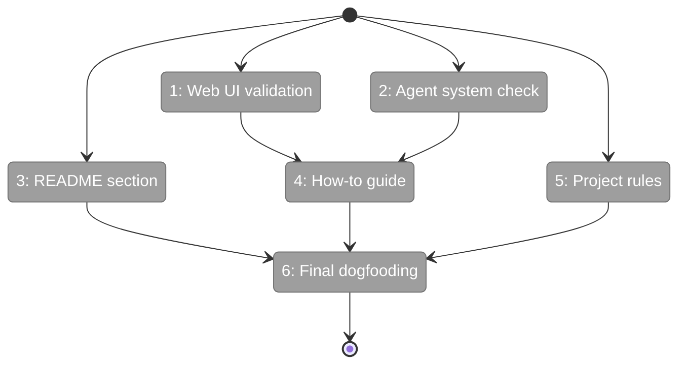
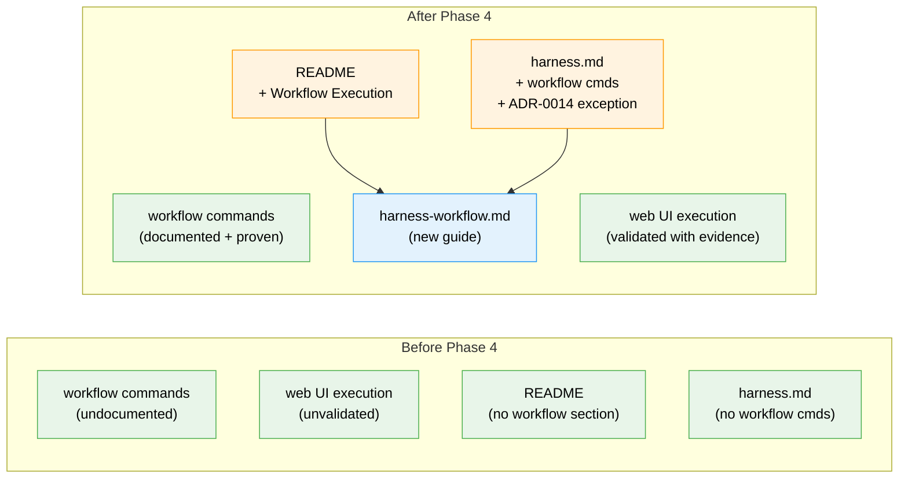

# Flight Plan: Phase 4 — End-to-End Validation + Docs

**Plan**: [harness-workflow-runner-plan.md](../../harness-workflow-runner-plan.md)
**Phase**: Phase 4: End-to-End Validation + Docs
**Generated**: 2026-03-20
**Status**: Ready for takeoff

---

## Departure → Destination

**Where we are**: Phases 1-3 built the foundation (execution bug fixes), the instrumentation (CLI telemetry), and the experience layer (harness workflow commands). The CLI path works — `just harness workflow run` spawns the orchestration engine, streams NDJSON events, auto-completes nodes, and returns structured pass/fail. But the web UI path (clicking Run in the browser) hasn't been validated, documentation doesn't exist, and no full workflow-to-completion proof has been captured.

**Where we're going**: A developer or agent can read `docs/how/harness-workflow.md`, understand the workflow system, run their first workflow via the harness, and debug failures using progressive disclosure — all from documentation. The web UI Run button is verified working. The harness README documents the commands. The project rules record the ADR-0014 exception. A complete dogfooding run proves it all works.

---

## Domain Context

### Domains We're Changing

| Domain | What Changes | Key Files |
|--------|-------------|-----------|
| _(harness)_ | README gets Workflow Execution section | `harness/README.md` |
| docs | New how-to guide + project rules update | `docs/how/harness-workflow.md` (new), `docs/project-rules/harness.md` |

### Domains We Depend On (no changes)

| Domain | What We Consume | Contract |
|--------|----------------|----------|
| workflow-ui | WorkflowExecutionManager (start/stop/restart) | Web execution path validation |
| _(harness)_ | workflow commands (reset/run/status/logs) | CLI execution path validation |
| _platform/positional-graph | cg wf run --json-events, cg wf show --detailed | CLI telemetry |
| agents | IAgentManagerService, IAgentAdapter | Agent system verification |
| _platform/events | SSE mux /api/events/mux | Real-time UI updates |

---

## Flight Status

<!-- Updated by /plan-6-v2: pending → active → done. Use blocked for problems/input needed. -->

**Legend**: grey = pending | yellow = active | red = blocked/needs input | green = done

---

## Stages

<!-- Updated by /plan-6-v2 during implementation: [ ] → [~] → [x] -->

- [ ] **Stage 1: Web UI validation** — start dev server, click Run, observe node transitions, capture evidence
- [ ] **Stage 2: Agent system verification** — check if ODS-dispatched pods register in agent system
- [ ] **Stage 3: README Workflow Execution section** — command table with examples
- [ ] **Stage 4: harness-workflow.md how-to guide** — setup, running, progressive disclosure, troubleshooting
- [ ] **Stage 5: Project rules update** — CLI table + ADR-0014 exception + history entry
- [ ] **Stage 6: Final dogfooding checkpoint** — full reset→run→status→logs with real agents

---

## Architecture: Before & After

**Legend**: existing (green, unchanged) | changed (orange, modified) | new (blue, created)

---

## Acceptance Criteria

- [ ] AC-2: Per-node status transitions observable
- [ ] AC-8: Test workflow topology matches test-advanced-pipeline
- [ ] AC-13: Web UI Run button works — nodes progress through full lifecycle

---

## Goals & Non-Goals

**Goals**:
- ✅ Web UI validated with evidence
- ✅ Agent system integration verified (or gap documented)
- ✅ Three documentation artifacts delivered
- ✅ Full dogfooding run with real agents
- ✅ Plan 076 marked complete

**Non-Goals**:
- ❌ No new features or commands
- ❌ No fixing web UI bugs (document, don't fix)
- ❌ No orchestration engine changes
- ❌ No new test suites

---

## Checklist

- [ ] T001: Verify web UI workflow execution (click Run, observe nodes)
- [ ] T002: Verify agent nodes in existing agent system
- [ ] T003: Add Workflow Execution section to harness/README.md
- [ ] T004: Create docs/how/harness-workflow.md guide
- [ ] T005: Update docs/project-rules/harness.md (commands + ADR-0014)
- [ ] T006: Final dogfooding checkpoint with evidence
