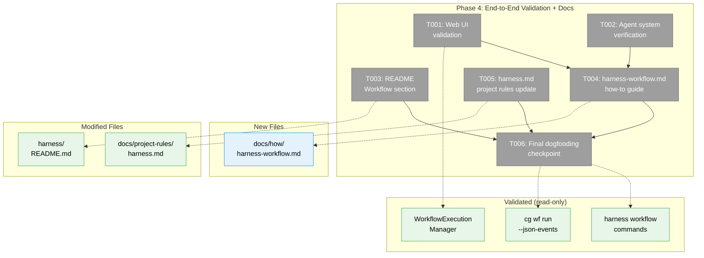
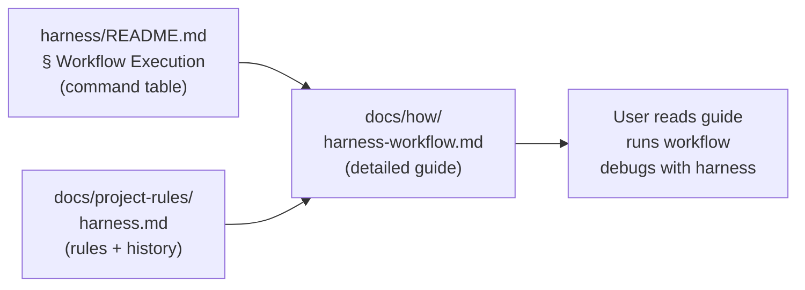
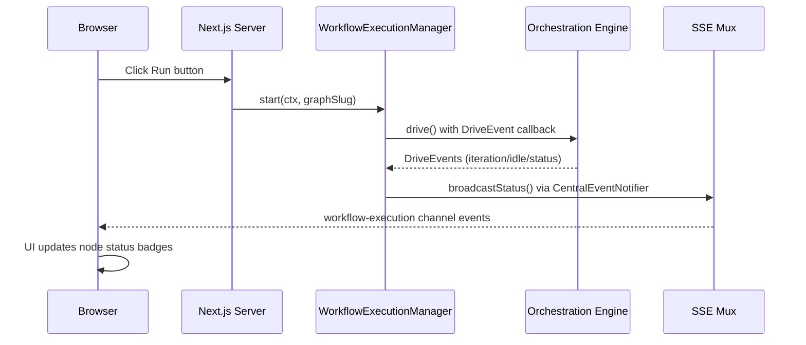

# Phase 4: End-to-End Validation + Documentation — Tasks + Context Brief

**Plan**: [harness-workflow-runner-plan.md](../../harness-workflow-runner-plan.md)
**Phase**: Phase 4: End-to-End Validation + Docs
**Spec**: [harness-workflow-runner-spec.md](../../harness-workflow-runner-spec.md)
**Created**: 2026-03-20
**Status**: Pending

> **Read the spec's Problem Context section FIRST.** See `harness-workflow-runner-spec.md § Problem Context` for the bug table, dogfooding contract, and known runtime issues.

---

## Executive Briefing

**Purpose**: Prove the complete workflow execution system works end-to-end (CLI path, web UI path, harness path) and write documentation so future agents and developers can use the harness workflow commands. This is the final phase — if it passes, Plan 076 is done.

**What We're Building**: No new code features. This phase validates existing implementation across all three execution surfaces (CLI, web, harness) and creates three documentation artifacts: harness README section, detailed how-to guide, and project rules update. It also records the ADR-0014 override for positional-graph imports.

**Goals**:
- ✅ Web UI Run button verified working — nodes progress through full lifecycle via browser
- ✅ Agent nodes verified in existing agent system (or gap documented)
- ✅ `harness/README.md` updated with Workflow Execution section + command table
- ✅ `docs/how/harness-workflow.md` created with detailed guide, examples, debugging escalation
- ✅ `docs/project-rules/harness.md` updated with workflow commands + ADR-0014 import exception
- ✅ Full dogfooding run captured with real agents completing all nodes

**Non-Goals**:
- ❌ No new harness commands or CLI changes
- ❌ No orchestration engine changes
- ❌ No new test suites (validation IS the test)
- ❌ No fixing web UI bugs outside the workflow execution path

---

## Prior Phase Context

### Phase 1: Fix Execution Blockers (Complete)

**A. Deliverables**: ODS `pendingErrors` queue + `drainErrors()`, SSE error serialization fix, CLI `--timeout` + filesystem lock, `runCg()` fail-fast + subprocess timeout. Pre-existing bug fixes: esbuild externalization, workspace resolution.

**B. Dependencies Exported**: `IODS.drainErrors()`, `CliDriveOptions.timeout`, `CgExecOptions.timeout`, filesystem lock at `.chainglass/data/workflows/{slug}/drive.lock`, `node:error` event type.

**C. Gotchas**: Race condition on state file avoided via in-memory queue. `NodeEventService` is per-context, not singleton. `setTimeout.unref()` required for clean exit. Stale locks cleaned via PID validation. Template instantiate vs `wf create` path mismatch.

**D. Incomplete Items**: None — all 8 tasks complete. Web UI path not yet validated (deferred to Phase 4).

**E. Patterns**: Queue-based error propagation, AbortSignal + `.unref()`, PID-based lock validation, fail-fast on build staleness, explicit Error serialization.

### Phase 2: CLI Telemetry Enhancement (Complete)

**A. Deliverables**: `cg wf show --detailed --json`, `cg wf run --json-events`, GH_TOKEN pre-flight check.

**B. Dependencies Exported**: `--detailed` output contract (per-node status with lineId, nodeId, unitType, timing, sessionId, blockedBy), `--json-events` NDJSON format (type/message/timestamp/data/error).

**C. Gotchas**: Field name mismatches fixed (FT-001). Use `getReality()` — never construct PodManager directly (FT-003). `readyDetail` has booleans, not reasons array. `--json-events` independent from global `--json` flag.

**D. Incomplete Items**: Domain history update (LOW, non-blocking).

**E. Patterns**: Contract-first telemetry via `getReality()`, NDJSON streaming, blocker derivation from boolean fields, pre-flight environment validation.

### Phase 3: Harness Workflow Commands (Complete)

**A. Deliverables**: `harness/src/cli/commands/workflow.ts` (reset/run/status/logs), `cg-spawner.ts` (streaming subprocess), `auto-completion.ts` (AutoCompletionRunner), index.ts registration, justfile comment.

**B. Dependencies Exported**: `registerWorkflowCommand(program)`, `spawnCg()` with `SpawnCgResult.timedOut`, `AutoCompletionRunner.onIdle()`, HarnessEnvelope contracts for all 4 commands, event cache at `harness/.cache/last-workflow-run.json`.

**C. Gotchas**: Commander.js `for await` doesn't keep event loop alive — use `on('line', ...)` instead. Timeout units: seconds for CLI, milliseconds for CgExecOptions (+10s buffer). `runCg()` auto-adds `--json`. Cache directory needs `mkdirSync({recursive: true})`.

**D. Incomplete Items**: No passing workflow-to-completion proof captured. Assertions are structural only (4 basic checks). FT-005/006/007 (MEDIUM) deferred.

**E. Patterns**: Commander.js registration pattern, streaming subprocess via `spawn()`, HarnessEnvelope for all outputs, progressive disclosure (4 levels), lazy dynamic import for heavy modules.

---

## Pre-Implementation Check

| File | Exists? | Domain Check | Notes |
|------|---------|-------------|-------|
| `harness/README.md` | ✓ | _(harness)_ | Add "Workflow Execution" section after CLI Commands (line ~115) |
| `docs/how/harness-workflow.md` | ✗ New | docs | Follow `docs/how/workflow-execution.md` pattern |
| `docs/project-rules/harness.md` | ✓ | docs | Add workflow commands to CLI table (lines 81-102), document ADR-0014 exception |
| `apps/web/src/features/074-workflow-execution/workflow-execution-manager.ts` | ✓ | workflow-ui | Read-only validation — start/stop/restart/getStatus methods |
| `apps/web/src/features/074-workflow-execution/execution-button-state.ts` | ✓ | workflow-ui | Read-only — deriveButtonState() maps status to Run/Stop/Restart visibility |

**Concept Search**: No new concepts — documentation + validation only.

**Harness Context**: Harness at L3 maturity. Health check: `just harness health`. Boot: `just harness dev` (Docker) or `just dev` (local). Phase 4 validates both local and web execution paths.

---

## Architecture Map



---

## Tasks

| Status | ID | Task | Domain | Path(s) | Done When | Notes |
|--------|-----|------|--------|---------|-----------|-------|
| [ ] | T001 | Verify web UI workflow execution — start dev server, navigate to workflow page, click Run, observe node transitions | workflow-ui | `apps/web/src/features/074-workflow-execution/` | Nodes transition: ready → starting → accepted → complete (or blocked-error). Status badges update in real-time via SSE. Screenshots captured as evidence. | **BLOCKED by Subtask 001** (REST API + SDK). Use `harness workflow run --server` to trigger web execution and observe in browser. If nodes are stuck, diagnose using Phase 1-2 fixes. Per AC-13. See [001-subtask-workflow-rest-api-sdk.md](001-subtask-workflow-rest-api-sdk.md). |
| [ ] | T002 | Verify agent nodes appear in existing agent system | agents | `apps/web/src/features/034-agentic-cli/` | Running workflow agent node appears in agent list with event history, OR gap is documented with explanation | Per clarification Q5: "same system under the hood." Check if ODS-dispatched pods register in AgentManagerService. If not wired, document the gap and its root cause — this is an observation task, not a fix task. |
| [ ] | T003 | Add Workflow Execution section to `harness/README.md` | _(harness)_ | `harness/README.md` | README has 4 workflow commands (reset/run/status/logs) with descriptions and examples in the command table pattern | Insert after existing CLI Commands section (~line 115). Follow 2-column `Command | Purpose` pattern. Include one usage example per command. Reference `docs/how/harness-workflow.md` for details. |
| [ ] | T004 | Create `docs/how/harness-workflow.md` — detailed guide | docs | `docs/how/harness-workflow.md` (new) | Guide covers: setup prerequisites, running workflows (CLI + harness), progressive disclosure levels, command reference with envelope schemas, common failure patterns, debugging escalation, dogfooding contract | Follow `docs/how/workflow-execution.md` pattern: title, architecture overview, how-to steps, troubleshooting. Include real output examples from Phase 3 dogfooding. Link to harness README for quick reference. |
| [ ] | T005 | Update `docs/project-rules/harness.md` — workflow commands + ADR-0014 exception | docs | `docs/project-rules/harness.md` | Harness project rules include: (1) all 4 workflow commands in CLI table, (2) Phase 076 history entry, (3) sanctioned import exception for `@chainglass/positional-graph` and `@chainglass/workflow` | Add commands to CLI table (lines 81-102). Add history entry. Update overview paragraph (line 11) to note the ADR-0014 exception for workflow auto-completion. |
| [ ] | T006 | Final dogfooding checkpoint — full validation with real agents | _(harness)_ | N/A | Complete `harness workflow reset → run → status → logs` cycle with real agent execution. HarnessEnvelope shows `exitReason=complete` (or documents why completion isn't achievable). Evidence captured in execution.log.md. | **This is the proof that Plan 076 works.** Run with GH_TOKEN set, `--timeout 300`, `--verbose`. If workflow completes: capture all node states as complete. If it times out waiting for agents: capture the point of failure and document. Either outcome is valid evidence — the harness told you what happened. |

---

## Context Brief

### Key Findings from Plan

- **Finding 07** (High): Harness had no workflow command group. **Action**: Delivered in Phase 3 — T001-T005 validate and document it.
- **Workshop 001 D3**: Assertions built into `workflow run`. **Action**: T006 exercises assertions with real agents.
- **Workshop 001 D6**: Works with local dev server. **Action**: T001 validates web UI on local dev, T006 validates CLI on local dev.
- **Spec AC-13**: Web UI Run button works, nodes not stuck at "starting". **Action**: T001 validates this specifically.

### Domain Dependencies

- `workflow-ui`: `WorkflowExecutionManager` (start/stop/restart/getStatus) — web execution path we're validating
- `workflow-ui`: `deriveButtonState()` — button visibility state machine
- `agents`: `IAgentManagerService`, `IAgentAdapter` — agent registration system to check
- `_platform/events`: SSE mux endpoint at `/api/events/mux?channels=workflow-execution` — real-time UI updates
- `_(harness)_`: `harness workflow` commands (reset/run/status/logs) — CLI validation path
- `_platform/positional-graph` (via CLI): `cg wf run --json-events`, `cg wf show --detailed` — CLI telemetry

### Domain Constraints

- **Phase 4 is read-only for code** — we validate and document, we don't fix. If web UI bugs are found, document them as gaps.
- **ADR-0014**: harness.md must document the Phase 076 import exception for `@chainglass/positional-graph` and `@chainglass/workflow`.
- All documentation follows existing patterns in their respective locations.

### Harness Context

- **Boot**: `just dev` (local) or `just harness dev` (Docker)
- **Health check**: `just harness health` → JSON envelope
- **Interact**: `just harness workflow <subcommand>` via CLI subprocess
- **Observe**: HarnessEnvelope JSON, browser screenshots, captured stderr
- **Maturity**: L3 (Boot + Browser + Evidence + CLI SDK)
- **Pre-phase validation**: Agent should validate harness + dev server at start of implementation

### Reusable from Prior Phases

- Phase 3 dogfooding evidence (workflow reset/run/status/logs output) — include in docs
- Phase 3 HarnessEnvelope schemas — document in how-to guide
- Phase 2 `--detailed` and `--json-events` output contracts — reference in guide
- Phase 1 error serialization improvements — mention in troubleshooting section

### Documentation Targets



### Web UI Validation Path



---

## Discoveries & Learnings

_Populated during implementation by plan-6._

| Date | Task | Type | Discovery | Resolution | References |
|------|------|------|-----------|------------|------------|

---

## Directory Layout

```
docs/plans/076-harness-workflow-runner/
  ├── harness-workflow-runner-plan.md
  ├── harness-workflow-runner-spec.md
  ├── research-dossier.md
  ├── workshops/
  │   ├── 001-harness-workflow-experience.md
  │   ├── 002-telemetry-architecture.md
  │   └── 003-cg-cli-status-enhancement.md
  └── tasks/
      ├── phase-1-fix-execution-blockers/
      ├── phase-2-cli-telemetry-enhancement/
      ├── phase-3-harness-workflow-commands/
      └── phase-4-end-to-end-validation-docs/
          ├── tasks.md                  ← this file
          ├── tasks.fltplan.md          ← flight plan
          └── execution.log.md          ← created by plan-6
```
