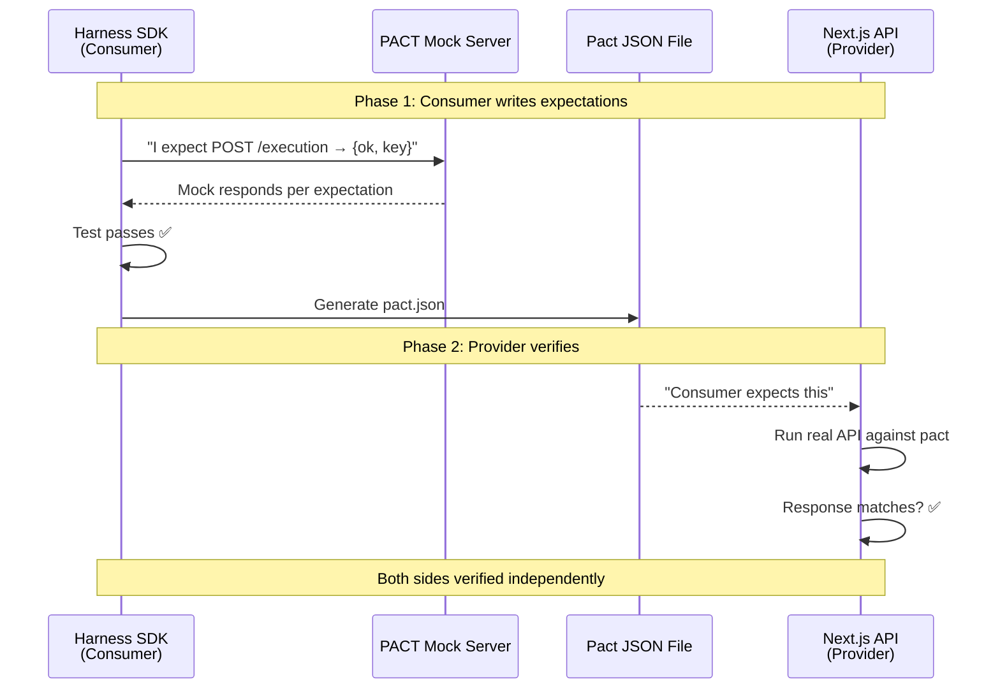

# Workshop: PACT Contract Testing for Workflow REST API

**Type**: Integration Pattern
**Plan**: 076-harness-workflow-runner
**Spec**: [harness-workflow-runner-spec.md](../harness-workflow-runner-spec.md)
**Created**: 2026-03-21
**Status**: Draft

**Related Documents**:
- [Workshop 004 — Workflow REST API](004-workflow-rest-api.md)
- [Subtask 001 — REST API + SDK](../tasks/phase-4-end-to-end-validation-docs/001-subtask-workflow-rest-api-sdk.md)

**Domain Context**:
- **Primary Domain**: `_(harness)_` — SDK client (consumer) lives in harness
- **Related Domains**: `workflow-ui` — REST API (provider) lives in web app

---

## Purpose

Define how PACT consumer-driven contract testing ensures the harness SDK (`WorkflowApiClient`) and the web REST API (`/api/workspaces/{slug}/workflows/...`) stay in sync. This workshop covers what PACT is, its first principles, and exactly how we apply it to our specific Workflow REST API contract.

## Key Questions Addressed

- What is PACT and why does it matter for our SDK → API contract?
- What goes in a pact test vs a unit test vs an integration test?
- How do consumer (harness SDK) and provider (Next.js API) tests work together in our monorepo?
- Where do pact files live? File-based or broker?
- How does PACT interact with our existing Vitest + contract test patterns?
- What does a good pact test look like for our 5 Tier 1 endpoints?

---

## Part 1: What is PACT?

### The Problem It Solves

We're building a REST API (provider) and a typed SDK (consumer). They're in the same monorepo but could easily drift:

```
┌──────────────────────────────────────────────────────────┐
│ The Drift Problem                                        │
│                                                          │
│ Day 1:  SDK calls POST /execution → API returns {ok}     │
│         ✅ Everything works                              │
│                                                          │
│ Day 30: Someone renames API field "ok" → "success"       │
│         SDK still expects "ok"                           │
│         Unit tests pass (they test in isolation)         │
│         Integration test? Nobody wrote one               │
│         💥 Breaks at runtime                             │
│                                                          │
│ Day 60: Someone adds required header to API              │
│         SDK doesn't send it                              │
│         💥 Silent 401 errors                             │
└──────────────────────────────────────────────────────────┘
```

**PACT prevents this** by making the contract between consumer and provider **explicit and automatically verified**.

### The Core Mental Model

PACT is a **bilateral agreement** between two systems:

```
Consumer says: "I will call POST /execution with this body
                and I expect you to return {ok: boolean, key: string}"

Provider says: "When you call POST /execution with that body,
                I will return {ok: boolean, key: string}"

The Pact:      A JSON file that records this agreement.
               Consumer generates it. Provider verifies it.
               If either side breaks it, tests fail.
```

### PACT vs Other Testing Approaches

| Approach | Tests | Requires | Catches |
|----------|-------|----------|---------|
| **Unit tests** | Logic in isolation | Nothing running | Logic bugs |
| **Contract tests (existing)** | Fake/Real interface parity | Both implementations | Interface drift |
| **PACT** | Consumer ↔ Provider agreement | Each side independently | API contract drift |
| **Integration tests** | Both systems together | Both running | Runtime bugs |
| **E2E tests** | Full user journey | Everything running | Everything |

**Key insight**: PACT sits between unit tests and integration tests. Each side runs independently but verifies the same contract.

### The PACT Lifecycle



---

## Part 2: First Principles — What Makes a Good Pact Test

### The Golden Rule

> **Test the shape, not the values. Test the interface, not the implementation.**

This single principle prevents 80% of PACT misuse.

### The Three Questions Test

Before adding an interaction, ask:

1. **Is this interaction actually used by the consumer?** (If not, don't test it)
2. **Can I verify this without testing business logic?** (If not, use unit tests)
3. **Does this interaction represent realistic behavior?** (If not, make it real)

### What SHOULD Be in a Pact

✅ Request-response pairs the consumer actually uses
✅ The **shape** of requests/responses (types, required fields, structure)
✅ Error cases you handle (404, 401, 500 with proper body structure)
✅ Headers you depend on (Content-Type, Authorization)

### What SHOULD NOT Be in a Pact

❌ Business logic validation ("10 purchases = 1000 points")
❌ Exact response values ("name must be Alice")
❌ Provider's internal implementation details
❌ Interactions that never happen in production
❌ Every possible field in the response (only what consumer uses)

### Matchers: Loose Over Tight

PACT provides matchers so you test types, not values:

| Matcher | Purpose | Example |
|---------|---------|---------|
| `like(value)` | Type matching | `like(123)` matches any number |
| `regex(pattern, example)` | Pattern matching | `regex(/^\d+$/, '123')` |
| `eachLike(element)` | Array of matching elements | `eachLike({id: like(1)})` |
| `uuid()` | UUID format | Matches any UUID v4 |
| `iso8601DateTime()` | ISO datetime | Matches any ISO timestamp |
| `boolean()` | Boolean value | Matches true or false |

**❌ Tight (fragile):**
```typescript
willRespondWith: {
  body: { ok: true, key: 'abc-123-def' }  // Exact values = breaks easily
}
```

**✅ Loose (resilient):**
```typescript
willRespondWith: {
  body: { ok: boolean(), key: like('abc-123-def') }  // Shape only
}
```

---

## Part 3: Provider States

Provider states answer: "What does the world need to look like for this response to make sense?"

### Our Provider States

| State | Meaning | Used By |
|-------|---------|---------|
| `workflow exists` | Test workflow has been created | GET /execution, POST /execution, GET /detailed |
| `workflow is running` | Drive loop is active | GET /execution (returns running status), DELETE /execution |
| `workflow is idle` | No active execution | POST /execution (starts fresh) |
| `workflow does not exist` | No graph at this slug | GET /execution (returns null/404) |

### How Provider States Work in Our Setup

**Consumer side** (harness SDK test — defines expectations):
```typescript
pact.addInteraction({
  states: [{ description: 'workflow exists' }],
  uponReceiving: 'a request to start workflow execution',
  withRequest: {
    method: 'POST',
    path: '/api/workspaces/test-ws/workflows/test-workflow/execution',
    headers: { 'Content-Type': 'application/json' },
    body: { worktreePath: like('/path/to/worktree') },
  },
  willRespondWith: {
    status: 200,
    body: {
      ok: boolean(),
      key: like('encoded-key'),
      already: boolean(),
    },
  },
});
```

**Provider side** (Next.js API test — sets up state):
```typescript
const opts = {
  provider: 'WorkflowAPI',
  providerBaseUrl: 'http://localhost:3000',
  pactUrls: [path.resolve(__dirname, '../../../pacts/HarnessSDK-WorkflowAPI.json')],
  stateHandlers: {
    'workflow exists': async () => {
      // Ensure test-workflow graph exists on disk
      await createTestWorkflow();
    },
    'workflow is running': async () => {
      await createTestWorkflow();
      await startTestWorkflow();
    },
    'workflow is idle': async () => {
      await createTestWorkflow();
      await ensureNotRunning();
    },
  },
};
```

---

## Part 4: Our Pact Tests — 5 Tier 1 Endpoints

### Consumer: HarnessSDK

**File**: `harness/tests/pact/workflow-api.consumer.test.ts`

```typescript
import { PactV3, MatchersV3 } from '@pact-foundation/pact';
import path from 'node:path';
import { WorkflowApiClient } from '../../src/sdk/workflow-api-client.js';

const { like, boolean, regex, eachLike } = MatchersV3;

const provider = new PactV3({
  consumer: 'HarnessSDK',
  provider: 'WorkflowAPI',
  dir: path.resolve(__dirname, '../../../pacts'),
});

describe('Workflow API Consumer (HarnessSDK)', () => {

  // ── POST /execution — Start Workflow ──────────────────────────────

  it('starts a workflow execution', async () => {
    provider
      .given('workflow exists')
      .uponReceiving('a request to start workflow execution')
      .withRequest({
        method: 'POST',
        path: '/api/workspaces/test-ws/workflows/test-workflow/execution',
        headers: { 'Content-Type': 'application/json' },
        body: { worktreePath: like('/path/to/worktree') },
      })
      .willRespondWith({
        status: 200,
        headers: { 'Content-Type': regex('application/json.*', 'application/json') },
        body: {
          ok: boolean(true),
          key: like('encoded-execution-key'),
          already: boolean(false),
        },
      });

    await provider.executeTest(async (mockServer) => {
      const client = new WorkflowApiClient({
        baseUrl: mockServer.url,
        workspaceSlug: 'test-ws',
        worktreePath: '/path/to/worktree',
      });

      const result = await client.run('test-workflow');
      expect(result.ok).toBe(true);
      expect(result.key).toBeDefined();
    });
  });

  // ── GET /execution — Get Status ───────────────────────────────────

  it('gets execution status when running', async () => {
    provider
      .given('workflow is running')
      .uponReceiving('a request for execution status')
      .withRequest({
        method: 'GET',
        path: '/api/workspaces/test-ws/workflows/test-workflow/execution',
        query: { worktreePath: like('/path/to/worktree') },
      })
      .willRespondWith({
        status: 200,
        body: {
          status: like('running'),
          iterations: like(5),
          totalActions: like(3),
          lastEventType: like('iteration'),
          lastMessage: like('ONBAS: start-node spec-writer-abc'),
        },
      });

    await provider.executeTest(async (mockServer) => {
      const client = new WorkflowApiClient({
        baseUrl: mockServer.url,
        workspaceSlug: 'test-ws',
        worktreePath: '/path/to/worktree',
      });

      const status = await client.getStatus('test-workflow');
      expect(status).not.toBeNull();
      expect(status!.status).toBeDefined();
      expect(status!.iterations).toBeGreaterThanOrEqual(0);
    });
  });

  // ── DELETE /execution — Stop Workflow ─────────────────────────────

  it('stops a running workflow', async () => {
    provider
      .given('workflow is running')
      .uponReceiving('a request to stop workflow execution')
      .withRequest({
        method: 'DELETE',
        path: '/api/workspaces/test-ws/workflows/test-workflow/execution',
        headers: { 'Content-Type': 'application/json' },
        body: { worktreePath: like('/path/to/worktree') },
      })
      .willRespondWith({
        status: 200,
        body: { ok: boolean(true) },
      });

    await provider.executeTest(async (mockServer) => {
      const client = new WorkflowApiClient({
        baseUrl: mockServer.url,
        workspaceSlug: 'test-ws',
        worktreePath: '/path/to/worktree',
      });

      const result = await client.stop('test-workflow');
      expect(result.ok).toBe(true);
    });
  });

  // ── POST /execution/restart — Restart ─────────────────────────────

  it('restarts a workflow', async () => {
    provider
      .given('workflow exists')
      .uponReceiving('a request to restart workflow execution')
      .withRequest({
        method: 'POST',
        path: '/api/workspaces/test-ws/workflows/test-workflow/execution/restart',
        headers: { 'Content-Type': 'application/json' },
        body: { worktreePath: like('/path/to/worktree') },
      })
      .willRespondWith({
        status: 200,
        body: {
          ok: boolean(true),
          key: like('encoded-execution-key'),
        },
      });

    await provider.executeTest(async (mockServer) => {
      const client = new WorkflowApiClient({
        baseUrl: mockServer.url,
        workspaceSlug: 'test-ws',
        worktreePath: '/path/to/worktree',
      });

      const result = await client.restart('test-workflow');
      expect(result.ok).toBe(true);
    });
  });

  // ── GET /detailed — Rich Diagnostics ──────────────────────────────

  it('gets detailed node-level status', async () => {
    provider
      .given('workflow exists')
      .uponReceiving('a request for detailed workflow status')
      .withRequest({
        method: 'GET',
        path: '/api/workspaces/test-ws/workflows/test-workflow/detailed',
        query: { worktreePath: like('/path/to/worktree') },
      })
      .willRespondWith({
        status: 200,
        body: {
          slug: like('test-workflow'),
          execution: {
            status: like('pending'),
            totalNodes: like(4),
            completedNodes: like(0),
            progress: like('0%'),
          },
          lines: eachLike({
            id: like('line-abc'),
            label: like('Input'),
            nodes: eachLike({
              id: like('node-123'),
              unitSlug: like('test-agent'),
              type: like('agent'),
              status: like('pending'),
              startedAt: null,
              completedAt: null,
              error: null,
              sessionId: null,
              blockedBy: [],
            }),
          }),
          questions: [],
          sessions: like({}),
        },
      });

    await provider.executeTest(async (mockServer) => {
      const client = new WorkflowApiClient({
        baseUrl: mockServer.url,
        workspaceSlug: 'test-ws',
        worktreePath: '/path/to/worktree',
      });

      const detailed = await client.getDetailed('test-workflow');
      expect(detailed.slug).toBe('test-workflow');
      expect(detailed.execution.totalNodes).toBeGreaterThan(0);
      expect(detailed.lines.length).toBeGreaterThan(0);
    });
  });
});
```

### Provider: WorkflowAPI

**File**: `apps/web/tests/pact/workflow-api.provider.test.ts`

```typescript
import { Verifier } from '@pact-foundation/pact';
import path from 'node:path';

describe('Workflow API Provider Verification', () => {
  // Requires: dev server running at localhost:3000 with DISABLE_AUTH=true

  it('verifies the HarnessSDK pact', async () => {
    const opts = {
      provider: 'WorkflowAPI',
      providerBaseUrl: 'http://localhost:3000',
      pactUrls: [
        path.resolve(__dirname, '../../../../pacts/HarnessSDK-WorkflowAPI.json'),
      ],
      stateHandlers: {
        'workflow exists': async () => {
          // Create test workflow via test-data helpers or direct API
          // This runs BEFORE the pact interaction
        },
        'workflow is running': async () => {
          // Start a workflow execution
        },
        'workflow is idle': async () => {
          // Ensure no active execution
        },
        'workflow does not exist': async () => {
          // Delete test workflow if it exists
        },
      },
    };

    return new Verifier(opts).verifyProvider();
  });
});
```

---

## Part 5: Monorepo Structure

For our monorepo, **Pattern 1 (shared pacts directory)** is best — consumer and provider are in the same repo:

```
project-root/
├── pacts/                                    ← Generated pact files
│   └── HarnessSDK-WorkflowAPI.json           ← Auto-generated, committed
│
├── harness/
│   ├── src/sdk/
│   │   ├── workflow-api-client.interface.ts   ← Contract (types)
│   │   ├── workflow-api-client.ts             ← Real client (consumer)
│   │   └── fake-workflow-api-client.ts        ← Fake client (testing)
│   └── tests/
│       ├── pact/
│       │   └── workflow-api.consumer.test.ts  ← Consumer pact test
│       └── unit/sdk/
│           └── workflow-api-client.test.ts    ← Contract tests (Fake/Real)
│
├── apps/web/
│   ├── app/api/workspaces/[slug]/workflows/   ← REST endpoints (provider)
│   └── tests/pact/
│       └── workflow-api.provider.test.ts       ← Provider verification
│
└── vitest.pact.config.ts                      ← Pact-specific vitest config
```

### Naming Convention

- **Consumer name**: `HarnessSDK` (the SDK is the consumer)
- **Provider name**: `WorkflowAPI` (the REST API is the provider)
- **Pact file**: `HarnessSDK-WorkflowAPI.json` (auto-generated from names)
- **Test files**: `*.consumer.test.ts` and `*.provider.test.ts`

### File-Based Pacts (Our Approach)

For a monorepo, file-based pacts are simpler and sufficient:

```typescript
// Consumer generates pact to pacts/ directory
const provider = new PactV3({
  consumer: 'HarnessSDK',
  provider: 'WorkflowAPI',
  dir: path.resolve(process.cwd(), 'pacts'),  // project-root/pacts/
});

// Provider reads from same directory
const opts = {
  pactUrls: [path.resolve(process.cwd(), 'pacts/HarnessSDK-WorkflowAPI.json')],
};
```

**Commit the pact file**: In a monorepo, the pact file is a living contract that should be version-controlled. When the consumer changes expectations, the pact file changes, and the provider verification must pass before merge.

---

## Part 6: PACT vs Our Existing Contract Tests

We already have Vitest-based contract tests in `test/contracts/`. PACT complements, not replaces:

| Aspect | Our Contract Tests | PACT |
|--------|-------------------|------|
| **What they test** | Fake/Real interface parity | HTTP request/response agreement |
| **Level** | TypeScript interface | Network protocol (HTTP) |
| **Catches** | Fake implementation drift | API endpoint drift |
| **Format** | Shared test function | JSON pact file |
| **Consumer** | Any code using the interface | HTTP client (SDK) |
| **Provider** | Class implementing interface | HTTP endpoint (route handler) |

### The Three-Layer Testing Stack

```
Layer 1: Contract Tests (existing)
  IWorkflowApiClient ← FakeWorkflowApiClient (in-memory)
  IWorkflowApiClient ← WorkflowApiClient (fetch-based)
  "Do both implementations satisfy the interface?"

Layer 2: PACT Tests (new)
  WorkflowApiClient ← PACT mock server ← pact.json → Next.js API
  "Does the SDK's HTTP behavior match the API's HTTP behavior?"

Layer 3: Integration Tests (harness dogfooding)
  harness workflow run --server → real API → real engine
  "Does the whole thing actually work end to end?"
```

**Layer 1** catches TypeScript interface drift.
**Layer 2** catches HTTP contract drift (field names, status codes, headers).
**Layer 3** catches runtime bugs (real data, real orchestration).

---

## Part 7: PACT + Vitest Setup

### Installation

```bash
pnpm add -D @pact-foundation/pact
```

### Vitest Config for Pact

```typescript
// vitest.pact.config.ts
import { defineConfig } from 'vitest/config';

export default defineConfig({
  test: {
    include: ['**/tests/pact/**/*.test.ts'],
    testTimeout: 30_000,  // Pact mock server startup can take time
    hookTimeout: 30_000,
    pool: 'forks',        // PACT needs process isolation
    poolOptions: {
      forks: { singleFork: true },  // One pact server at a time
    },
  },
});
```

### Running Pact Tests

```bash
# Consumer tests (generate pact files)
pnpm --filter @chainglass/harness vitest run --config vitest.pact.config.ts

# Provider tests (verify against pact files — requires dev server running)
DISABLE_AUTH=true pnpm dev &  # Start server with auth bypass
pnpm --filter @chainglass/web vitest run --config vitest.pact.config.ts
```

### Justfile Recipes

```makefile
# Run consumer pact tests (generates pact files)
pact-consumer:
    cd harness && pnpm exec vitest run --config vitest.pact.config.ts

# Run provider pact tests (verifies against generated pacts)
# Requires: just dev running with DISABLE_AUTH=true
pact-provider:
    cd apps/web && pnpm exec vitest run --config vitest.pact.config.ts

# Run both
pact: pact-consumer pact-provider
```

---

## Part 8: Anti-Patterns to Avoid

### ❌ Testing Business Logic in Pacts

```typescript
// BAD: This tests orchestration behavior, not API contract
provider.given('workflow with 6 nodes, 3 complete')
  .willRespondWith({
    body: {
      execution: { progress: '50%' }  // ← Business logic
    }
  });

// GOOD: Test the shape
provider.given('workflow exists')
  .willRespondWith({
    body: {
      execution: {
        progress: like('50%')  // ← "returns a string"
      }
    }
  });
```

### ❌ Over-Specifying Responses

```typescript
// BAD: Consumer now coupled to every field
willRespondWith: {
  body: {
    slug: 'test-workflow',
    execution: { status: 'pending', totalNodes: 4, completedNodes: 0, progress: '0%' },
    lines: [
      { id: 'line-abc', label: 'Input', nodes: [
        { id: 'node-123', unitSlug: 'test-agent', type: 'agent', status: 'pending',
          startedAt: null, completedAt: null, error: null, sessionId: null, blockedBy: [] }
      ]}
    ],
    questions: [],
    sessions: {}
  }
}

// GOOD: Only what consumer uses, with matchers
willRespondWith: {
  body: {
    slug: like('test-workflow'),
    execution: {
      status: like('pending'),
      totalNodes: like(4),
    },
    lines: eachLike({
      id: like('line-abc'),
      nodes: eachLike({
        id: like('node-123'),
        status: like('pending'),
      }),
    }),
  }
}
```

### ❌ Pact as Integration Test

```typescript
// BAD: This is an integration test disguised as pact
it('runs a full workflow and checks all nodes complete', async () => {
  // POST /execution
  // Wait 30 seconds
  // GET /execution — check status === 'completed'
  // GET /detailed — check all nodes complete
});

// GOOD: Each interaction tested independently
it('starts a workflow execution', () => { /* one interaction */ });
it('gets execution status', () => { /* one interaction */ });
it('gets detailed status', () => { /* one interaction */ });
```

---

## Part 9: PACT + OpenAPI — Complementary

PACT and OpenAPI serve different purposes:

```
OpenAPI (future):
  "Here's the full API spec — all endpoints, all fields, all types"
  → Auto-generated docs, SDK generation, schema validation

PACT (now):
  "Here's what the harness SDK actually uses"
  → Bilateral verification, prevents breaking changes

Combined:
  OpenAPI documents everything the API CAN do
  PACT verifies everything the SDK DOES do
```

For now, we use PACT. OpenAPI can be added later for documentation and SDK generation.

---

## Open Questions

### Q1: Should pact files be committed?

**RESOLVED**: Yes. In a monorepo, commit `pacts/HarnessSDK-WorkflowAPI.json`. It's a living contract — changes trigger both consumer and provider CI.

### Q2: When to run pact tests?

**RESOLVED**: Consumer tests run as part of `just fft` (they're fast — mock server, no real API needed). Provider tests run in a separate CI step that requires a dev server.

### Q3: Do we need a Pact Broker?

**RESOLVED**: No. File-based pacts in `pacts/` directory. We're a monorepo — consumer and provider are always at the same commit. Broker adds value for distributed teams; we're one team, one repo.

### Q4: How does DISABLE_AUTH interact with pact?

**RESOLVED**: Provider verification tests run with `DISABLE_AUTH=true` so the pact verifier doesn't need session cookies. Auth behavior is tested separately in integration tests.

---

## Quick Reference

```bash
# Install
pnpm add -D @pact-foundation/pact

# Generate consumer pact (harness side)
cd harness && pnpm exec vitest run tests/pact/

# Verify provider pact (web side, requires dev server)
DISABLE_AUTH=true just dev &
cd apps/web && pnpm exec vitest run tests/pact/

# Check pact file
cat pacts/HarnessSDK-WorkflowAPI.json | jq '.interactions | length'
# → 5 (one per endpoint)
```
