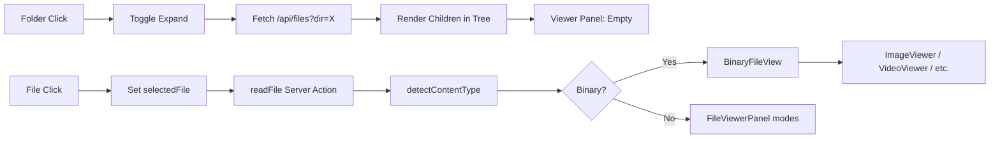
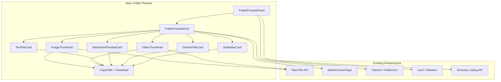

# Research Report: Folder Content Preview

**Generated**: 2026-04-08T07:35:00Z
**Research Query**: "When selecting folders, show preview grid of media contents (images, videos with hover-to-play, text, markdown) with copy-path and download buttons, recursive depth, themed, mobile-responsive"
**Mode**: Pre-Plan
**Location**: `docs/plans/077-folder-preview/research-dossier.md`
**FlowSpace**: Available
**Findings**: 56 across 8 subagents

## Executive Summary

### What It Does (Currently)

When a user clicks a folder in the file browser, it **only toggles expand/collapse** in the tree panel. The right-side viewer panel shows nothing for folders — just "Select a file to view". There is no folder content preview, gallery view, or media grid.

### What Already Exists (Reusable)

Significant infrastructure is already in place:
- **Binary viewers**: ImageViewer, PdfViewer, VideoViewer, AudioViewer, BinaryPlaceholder (Plan 046)
- **Raw file streaming API**: `/api/workspaces/[slug]/files/raw` with Range requests, MIME types, `?download=true`
- **Directory listing API**: `/api/workspaces/[slug]/files?tree=true` for recursive listings
- **Content type detection**: `detectContentType(filename)` → `{ category, mimeType }` covering image/pdf/video/audio/html/binary
- **Theme infrastructure**: FileIcon, FolderIcon, dark/light CSS vars, `next-themes`
- **Mobile patterns**: Sheet overlays, bottom tabs, responsive grids (1/2/3 col)
- **Card/grid UI**: WorkspaceCard, EmojiPicker, ColorPicker grid patterns

### Key Insights

1. **No new API routes needed** — the raw file route already serves any file with correct MIME type and supports download
2. **Binary viewers can be adapted** — ImageViewer/VideoViewer/AudioViewer are full-size; we need thumbnail variants
3. **Recursive listing already works** — the files API supports `?tree=true` for full recursive directory trees

### Quick Stats
- **Components to create**: ~5-8 new components (FolderPreview grid, media thumbnail variants, action buttons)
- **Components to reuse**: ~8 existing (raw file API, content type detection, FileIcon, Card, Skeleton, etc.)
- **Test coverage**: Good unit tests for FileTree and FileViewerPanel; harness mobile-ux-audit agent available
- **Complexity**: Medium — mostly UI composition over existing infrastructure
- **Prior Learnings**: 11 relevant discoveries from previous implementations
- **Domains**: Stays in `file-browser`, consuming `_platform/viewer`, `_platform/themes`, `_platform/file-ops`

## How It Currently Works

### Entry Points

| Entry Point | Type | Location | Purpose |
|------------|------|----------|---------|
| Browser page | Route | `app/(dashboard)/workspaces/[slug]/browser/page.tsx` | Server Component, bootstraps tree |
| BrowserClient | Client | `browser/browser-client.tsx` | Two-panel layout, state management |
| FileTree | Component | `features/041-file-browser/components/file-tree.tsx` | Tree navigation |
| FileViewerPanel | Component | `features/041-file-browser/components/file-viewer-panel.tsx` | File display |
| Files API | Route | `app/api/workspaces/[slug]/files/route.ts` | Directory listing |
| Raw File API | Route | `app/api/workspaces/[slug]/files/raw/route.ts` | Binary/text streaming |

### Core Execution Flow — Folder Click

1. **User clicks folder** in FileTree
   - `file-tree.tsx:461-547` — `TreeItem` handles click
   - Toggles `expandedDirs` Set (local state)
   - If children not cached, calls `onExpand(dirPath)`

2. **BrowserClient handles expand**
   - `browser-client.tsx:782-889` — wires `onExpand={fileNav.handleExpand}`
   - `use-file-navigation.ts:63-78` — fetches `/api/workspaces/${slug}/files?worktree=...&dir=...`
   - Stores children in `childEntries` state

3. **Viewer panel remains empty** (no folder preview)
   - `browser-client.tsx:860-870` — `{selectedFile ? <FileViewerPanel /> : <div>Select a file...</div>}`
   - Folder selection does NOT set `selectedFile`

### Data Flow



### Current Binary Viewer Capabilities

The file browser already has per-file viewers for binary content (Plan 046):

| Viewer | Content Type | Implementation | Notes |
|--------|-------------|----------------|-------|
| `ImageViewer` | image/* | `` tag via raw URL | Full-size, aspect-ratio preserved |
| `VideoViewer` | video/* | `<video>` tag with controls | Full HTML5 player |
| `AudioViewer` | audio/* | `<audio>` tag with controls | Compact player |
| `PdfViewer` | application/pdf | `<iframe>` embed | Browser PDF viewer |
| `HtmlViewer` | text/html | `<iframe sandbox>` | Sandboxed HTML render |
| `BinaryPlaceholder` | unknown binary | Icon + metadata display | Fallback |

All served via raw file API: `GET /api/workspaces/[slug]/files/raw?worktree=...&file=...`

### Content Type Detection

`apps/web/src/lib/content-type-detection.ts`:
- **Categories**: `image`, `pdf`, `video`, `audio`, `html`, `binary`
- **Image extensions**: png, jpg, jpeg, gif, bmp, svg, webp, ico, tiff, avif
- **Video extensions**: mp4, webm, mkv, avi, mov, wmv, flv, m4v
- **Audio extensions**: mp3, wav, ogg, flac, aac, wma, m4a
- Returns `ContentTypeInfo { category, mimeType }`
- `isBinaryExtension(filename)` — includes CSS/JS/JSON as "binary" (non-editable text)

## Architecture & Design

### Component Map — What Needs to Be Built



### Design Patterns to Follow

1. **Card grid pattern** (from WorkspaceCard, EmojiPicker): responsive grid with `grid-cols-1 md:grid-cols-2 lg:grid-cols-3`
2. **Hover-reveal actions** (from FileTree): `hidden group-hover:block` for copy/download buttons
3. **Tailwind + cn()** for styling: match existing component conventions
4. **Dark/light via CSS vars**: theme-aware thumbnails/backgrounds
5. **Lazy loading**: intersection observer for thumbnail loading
6. **URL state**: potentially add `?view=grid` param for folder preview mode

### Proposed Integration Point

In `browser-client.tsx`, when a folder is selected (or the current `dir` param changes):
- Instead of showing "Select a file to view", render `FolderPreviewPanel`
- The panel shows a responsive grid of the directory contents
- Clicking a file in the grid navigates to it in the viewer
- Clicking a subfolder navigates into it (recursive)

## Dependencies & Integration

### What This Feature Depends On

#### Internal Dependencies

| Dependency | Type | Purpose | Already Exists? |
|------------|------|---------|-----------------|
| Files API (`?dir=...`) | Required | List directory contents | ✅ Yes |
| Raw File API | Required | Serve images/videos/files | ✅ Yes |
| `detectContentType()` | Required | Categorize files for preview type | ✅ Yes |
| `FileIcon` / `FolderIcon` | Required | Themed icons in cards | ✅ Yes |
| `Card` / `Skeleton` UI | Required | Card grid and loading states | ✅ Yes |
| `cn()` / Tailwind | Required | Styling | ✅ Yes |
| `next-themes` | Required | Dark/light theme awareness | ✅ Yes |
| `useFileNavigation` | Required | Navigate to files from grid | ✅ Yes |
| Directory listing (recursive) | Optional | Deep folder preview | ✅ Yes (`?tree=true`) |

#### External Dependencies (New)

| Library | Purpose | Needed? |
|---------|---------|---------|
| None required | Raw ``, `<video>` tags are sufficient | — |

### What Depends on This

Nothing — this is a new leaf feature inside the file-browser domain.

## Quality & Testing

### Current Test Coverage

- **FileTree unit tests**: `test/unit/web/features/041-file-browser/file-tree.test.tsx` — render, select, expand, changed-file highlighting
- **FileViewerPanel unit tests**: `test/unit/web/features/041-file-browser/file-viewer-panel.test.tsx` — edit/preview/diff modes, binary viewer routing
- **Raw file route tests**: `test/unit/web/features/041-file-browser/raw-file-route.test.ts` — temp image.png, doc.pdf, video.mp4 fixtures
- **Content type detection tests**: Implicitly tested via file-actions tests
- **Mobile tests**: `useResponsive` hook tests with FakeMatchMedia, BottomTabBar phone-only tests

### Testing Strategy for Folder Preview

1. **Unit tests**: FolderPreviewGrid component renders correct card types per content category
2. **Harness mobile-ux-audit**: Validate grid layout at 375×812 mobile viewport
3. **Harness smoke tests**: Screenshot folder preview at desktop/tablet/mobile viewports
4. **Manual**: Hover-to-play video, theme toggle, deep folder navigation

### Mobile Harness Agent

Exists at `harness/agents/mobile-ux-audit/`:
- `prompt.md` defines 375×812 audit flow
- `instructions.md` with audit criteria
- Can be modified to include folder preview validation

## Modification Considerations

### ✅ Safe to Modify

1. **BrowserClient viewer section** — swap "Select a file" placeholder with FolderPreviewPanel
   - Well-isolated, clear integration point
   - `browser-client.tsx:860-870`

2. **New components in `features/041-file-browser/components/`**
   - Standard location for file browser components
   - No risk to existing components

### ⚠️ Modify with Caution

1. **Directory listing API** — if adding recursive preview metadata (thumbnails, content types)
   - Currently returns `{ name, type, path }` per entry
   - Adding `contentType` field is safe; restructuring the response is not
   - Consider a separate endpoint or query param for preview-augmented listings

2. **FileTree selection behavior** — folder click currently only expands
   - Adding folder "select" would need to coexist with expand behavior
   - Consider: single-click expands + selects, or use a dedicated preview button

### 🚫 Danger Zones

1. **Raw file API route** — serves all binary content; changes here affect all viewers
2. **detectContentType()** — used across binary viewers; extending categories affects routing

### Extension Points

1. **FileViewerPanel already switches on content type** — extend with folder type
2. **BinaryFileView already routes by category** — pattern can be replicated for thumbnails
3. **Files API already supports `?tree=true`** — recursive preview is ready

## Prior Learnings (From Previous Implementations)

### 📚 PL-01: Mobile Sequential Panels
**Source**: `docs/plans/041-file-browser/file-browser-spec.md:136-146`
**Type**: decision
**Action**: Folder preview grid should be full-screen on mobile, replacing tree panel

### 📚 PL-03: Raw File Endpoint Pattern
**Source**: `docs/plans/046-binary-file-viewers/research-dossier.md:191-205`
**Type**: insight
**Action**: Reuse the raw endpoint for all thumbnail `src` URLs — it already handles MIME types

### 📚 PL-05: Extension-First Detection
**Source**: `docs/plans/046-binary-file-viewers/binary-file-viewers-plan.md:49-50`
**Type**: gotcha
**Action**: Use `detectContentType()` for fast categorization; never read file content to determine preview type

### 📚 PL-07: Shiki Dual Themes
**Source**: `docs/plans/006-web-extras/tasks/phase-2/research-dossier.md:52-85`
**Type**: decision
**Action**: Any text/code preview cards must use CSS-var-based themes, not runtime switching

### 📚 PL-08: Performance at Scale
**Source**: `docs/plans/073-file-icons/research-dossier.md:247-252`
**Type**: gotcha
**Action**: Cap preview count per folder (e.g., 50 items), use lazy loading, no virtualization needed for thumbnails

### 📚 PL-10: Responsive Grid Pattern
**Source**: `docs/plans/041-file-browser/tasks/phase-3/execution.log.md:94-99`
**Type**: insight
**Action**: Use `grid-cols-1 md:grid-cols-2 lg:grid-cols-3 xl:grid-cols-4` for preview tiles

### Prior Learnings Summary

| ID | Type | Source Plan | Key Insight | Action |
|----|------|-------------|-------------|--------|
| PL-01 | decision | 041 | Mobile = sequential full-screen panels | Grid is full-screen on mobile |
| PL-03 | insight | 046 | Raw endpoint serves any file with MIME | Reuse for all thumbnail src URLs |
| PL-05 | gotcha | 046 | Extension detection before content scan | Use detectContentType(), never read bytes |
| PL-07 | decision | 006 | Shiki dual themes via CSS vars | Text previews use CSS-var themes |
| PL-08 | gotcha | 073 | 10k+ files need lazy loading | Cap items per page, lazy-load thumbnails |
| PL-10 | insight | 041 P3 | 1/2/3 col responsive grid | Use breakpoint-driven grid |
| PL-11 | decision | 041 P2 | URL-first state, deep links | Add ?view=grid URL param |

## Domain Context

### Existing Domains Relevant to This Research

| Domain | Relationship | Relevant Contracts | Key Components |
|--------|-------------|-------------------|----------------|
| `file-browser` | **Primary home** | FileTree, FileViewerPanel, directory listing, raw file API | All new components live here |
| `_platform/viewer` | Consumer | detectContentType(), isBinaryExtension() | Content categorization |
| `_platform/themes` | Consumer | FileIcon, FolderIcon | Themed icons in preview cards |
| `_platform/file-ops` | Indirect | IFileSystem.readDir() | Directory listing backend |
| `_platform/panel-layout` | Consumer | PanelShell, MainPanel | Layout container |

### Domain Map Position

Folder preview is a **new capability within `file-browser`** that composes existing infrastructure. No new domain warranted. The domain map topology doesn't change — `file-browser` already depends on all relevant infrastructure domains.

### Potential Domain Actions

- **No new domain needed** — feature fits cleanly into `file-browser`
- **Consider new viewer contract** if media thumbnails are reused in PR view or notes (defer until needed)
- **Update file-browser domain.md** Boundary → Owns section to include folder preview

## Critical Discoveries

### 🚨 Critical Finding 01: No Folder View Exists
**Impact**: Critical
**Source**: IA-02, IA-06, IA-10
**What**: Selecting a folder shows nothing in the viewer panel. The entire folder preview capability must be built from scratch.
**Why It Matters**: This is a greenfield feature, not a modification
**Required Action**: New component tree for FolderPreviewPanel

### 🚨 Critical Finding 02: Binary Viewers Are Full-Size Only
**Impact**: High
**Source**: IA-07, PS-02
**What**: ImageViewer, VideoViewer etc. render full-size with full controls. No thumbnail variants exist.
**Why It Matters**: Grid preview needs compact, card-sized renderers — not full-page viewers
**Required Action**: Create thumbnail-sized variants or separate thumbnail components

### 🚨 Critical Finding 03: Folder Selection vs Expansion Conflict
**Impact**: High
**Source**: IA-03, IA-10
**What**: Folder click currently toggles expand/collapse. Adding "select folder for preview" creates a UX conflict.
**Why It Matters**: Need to decide interaction model — click previews AND expands? Separate button? Different gesture?
**Required Action**: Design decision needed — recommend: click expands tree AND shows preview in viewer panel

### 🚨 Critical Finding 04: Raw File API Ready for Thumbnails
**Impact**: Positive
**Source**: IA-09, IC-05
**What**: `/api/workspaces/[slug]/files/raw` already serves images/videos with correct MIME types and Range support
**Why It Matters**: Thumbnail `` and `<video src>` can point directly at this endpoint — zero new API work
**Required Action**: None — just use the URL pattern

### 🚨 Critical Finding 05: Design Mockup Requirement
**Impact**: High
**Source**: User request
**What**: User wants static HTML+CSS+JS design mockups in the plan folder before implementation
**Why It Matters**: Must produce visual mockups for approval before coding
**Required Action**: Create `docs/plans/077-folder-preview/mockups/` with self-contained HTML preview files

## Supporting Documentation

### Related Plans
- **Plan 041**: File Browser — core infrastructure (all phases)
- **Plan 046**: Binary File Viewers — ImageViewer, VideoViewer, raw API
- **Plan 044**: Paste/Upload — file upload to scratch/
- **Plan 055**: Document Preview — Office format preview (workshops only)
- **Plan 073**: File Icons — FileIcon/FolderIcon theming

### Related How-To Docs
- `docs/how/file-browser.md` — File browser architecture
- `docs/how/viewer-patterns.md` — Viewer stack patterns
- `docs/how/sse-integration.md` — SSE channel patterns (if live updates needed)

## Recommendations

### If Building This Feature

1. **Start with mockups** — Static HTML+CSS+JS design files in plan folder for user approval
2. **Folder click = expand + preview** — Single click expands in tree AND shows grid in viewer panel
3. **Responsive grid** — 2-col mobile, 3-col tablet, 4-col desktop
4. **Lazy thumbnail loading** — IntersectionObserver for images/videos
5. **Cap at 100 items per level** — "Show more" button for large directories
6. **Hover-to-play video** — `onMouseEnter` triggers `video.play()`, `onMouseLeave` pauses
7. **Text/code files** — Show first ~10 lines with syntax highlighting in card
8. **Markdown files** — Show rendered preview in card
9. **Each card has**: FileIcon, filename, copy-path button, download button
10. **Subfolder cards** — Show folder icon + item count, click navigates deeper

### Component Breakdown (Preliminary)

| Component | Responsibility | Type |
|-----------|---------------|------|
| `FolderPreviewPanel` | Orchestrates grid for current directory | Client Component |
| `FolderPreviewGrid` | Responsive grid layout | Client Component |
| `PreviewCard` | Base card with actions (copy/download) | Client Component |
| `ImageThumbnail` | Image preview with lazy loading | Client Component |
| `VideoThumbnail` | Video preview with hover-to-play | Client Component |
| `TextPreviewCard` | First N lines of text/code | Server + Client |
| `MarkdownPreviewCard` | Rendered markdown excerpt | Server + Client |
| `AudioPreviewCard` | Compact audio player | Client Component |
| `SubfolderCard` | Folder with item count, navigates deeper | Client Component |
| `GenericFileCard` | Fallback for unknown types | Client Component |

## External Research Opportunities

### Research Opportunity 1: Gallery UI Patterns for Developer Tools

**Why Needed**: Current dev tools (VS Code, GitHub, GitLab) have evolved file preview patterns — we should match industry expectations
**Impact on Plan**: Informs grid layout, interaction model, and what "slick" means in this context
**Source Findings**: PS-08, IA-10

**Ready-to-use prompt:**
```
/deepresearch "What are the best file/folder preview gallery UX patterns in modern developer tools and file managers? Specifically:
1. How do VS Code, GitHub (repo browser), GitLab, and Figma handle folder content preview?
2. What grid layouts and card designs work best for mixed media (images, videos, text, code)?
3. What are best practices for hover-to-play video thumbnails in gallery views?
4. How do modern galleries handle dark/light theming?
5. What mobile patterns work for file preview grids (gesture interactions, card sizes)?
Stack: Next.js 16, React 19, Tailwind CSS v4, Server Components"
```

**Results location**: Save results to `docs/plans/077-folder-preview/external-research/gallery-ux-patterns.md`

---

**After External Research:**
- To conduct external research: Run the `/deepresearch` commands above
- To skip and proceed: Run `/plan-1b-specify` to create the feature specification

## Appendix: File Inventory

### Core Files (Existing — To Integrate With)

| File | Purpose | Notes |
|------|---------|-------|
| `browser-client.tsx` | Main browser shell | Integration point for folder preview |
| `file-tree.tsx` | Tree navigation | Folder click behavior |
| `file-viewer-panel.tsx` | File display panel | Will show FolderPreviewPanel for folders |
| `use-file-navigation.ts` | File/folder navigation hook | Directory fetching |
| `content-type-detection.ts` | File categorization | Drives preview type selection |
| `image-viewer.tsx` | Full-size image viewer | Reference for thumbnail variant |
| `video-viewer.tsx` | Full-size video viewer | Reference for hover-to-play variant |
| `audio-viewer.tsx` | Audio player | Reference for compact variant |
| `files/route.ts` | Directory listing API | Already supports ?tree=true |
| `files/raw/route.ts` | Raw file streaming | Thumbnail src URLs |

### Test Files (Existing)

| File | Coverage |
|------|----------|
| `test/unit/web/features/041-file-browser/file-tree.test.tsx` | Tree rendering, selection, expand |
| `test/unit/web/features/041-file-browser/file-viewer-panel.test.tsx` | Viewer modes, binary routing |
| `test/unit/web/features/041-file-browser/raw-file-route.test.ts` | Raw API with binary fixtures |
| `harness/agents/mobile-ux-audit/` | Mobile UX validation agent |

## Next Steps

1. **(Optional)** Run `/deepresearch` prompt above for gallery UX patterns
2. Run `/plan-1b-specify` to create the feature specification
3. Design mockups will be created during planning (HTML+CSS+JS in plan folder)

---

**Research Complete**: 2026-04-08T07:45:00Z
**Report Location**: `docs/plans/077-folder-preview/research-dossier.md`
