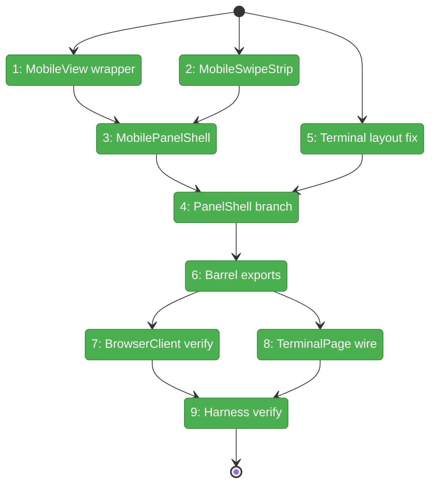
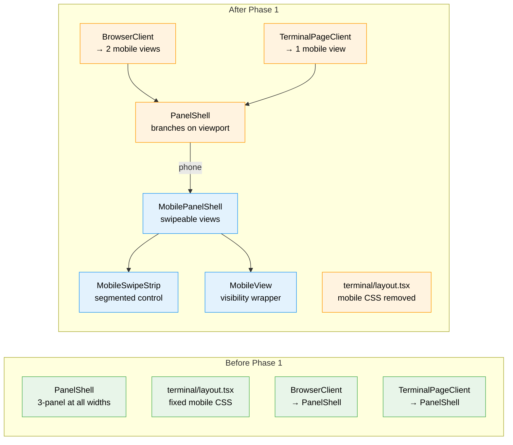

# Flight Plan: Phase 1 — Mobile Panel Shell

**Plan**: [mobile-experience-plan.md](../../mobile-experience-plan.md)
**Phase**: Phase 1: Mobile Panel Shell
**Generated**: 2026-04-12
**Status**: Ready for takeoff

---

## Departure → Destination

**Where we are**: Workspace pages (`/browser`, `/terminal`) render a fixed three-panel desktop layout (`PanelShell` with explorer + left + main) at all viewport widths. On phone screens, panels are squished to ~130px each — unusable for file browsing, code viewing, or terminal work. The responsive infrastructure exists (`useResponsive`, `BottomTabBar`) but is not wired into workspace layout.

**Where we're going**: A developer on a phone sees full-screen views — one panel fills the entire viewport. A segmented control at the top lets them tap or swipe between views. The browser page shows Files and Content views; the terminal page shows a single full-screen terminal. Desktop and tablet users see zero changes.

---

## Domain Context

### Domains We're Changing

| Domain | What Changes | Key Files |
|--------|-------------|-----------|
| `_platform/panel-layout` | Add `MobilePanelShell`, `MobileSwipeStrip`, `MobileView` components; modify `PanelShell` to branch on phone viewport; update barrel exports | `panel-shell.tsx`, `mobile-panel-shell.tsx` (new), `mobile-swipe-strip.tsx` (new), `mobile-view.tsx` (new), `index.ts` |
| `terminal` | Remove conflicting mobile CSS from layout; wire single-view mobile config into TerminalPageClient | `terminal/layout.tsx`, `terminal-page-client.tsx` |
| `file-browser` | Verify BrowserClient auto-branches correctly via PanelShell (no code changes expected) | `browser-client.tsx` |

### Domains We Depend On (no changes)

| Domain | What We Consume | Contract |
|--------|----------------|----------|
| `_platform/viewer` | FileViewer, MarkdownViewer render in Content view | ViewerFile, FileViewer |
| `_platform/sdk` | Keybindings continue to work unchanged | registerCommand |
| (hook) `useResponsive` | Phone detection via `useMobilePatterns` | ResponsiveState |

---

## Flight Status

<!-- Updated by /plan-6-v2: pending → active → done. Use blocked for problems/input needed. -->

**Legend**: grey = pending | yellow = active | red = blocked/needs input | green = done

---

## Stages

<!-- Updated by /plan-6-v2 during implementation: [ ] → [~] → [x] -->

- [x] **Stage 1: Build foundation components** — Create `MobileView` (view wrapper with visibility toggling) and `MobileSwipeStrip` (segmented control with tap/swipe/pill) (`mobile-view.tsx`, `mobile-swipe-strip.tsx` — new files)
- [x] **Stage 2: Build container + fix conflict** — Create `MobilePanelShell` (composes strip + views with transform-based switching) and remove conflicting mobile CSS from terminal layout (`mobile-panel-shell.tsx` — new file, `layout.tsx` — modified)
- [x] **Stage 3: Wire into PanelShell** — Add `useResponsive` branch to `PanelShell` + update barrel exports (`panel-shell.tsx`, `index.ts` — modified)
- [x] **Stage 4: Consumer wiring + verification** — Verify BrowserClient auto-branches, wire TerminalPageClient single-view config, run harness screenshots at mobile + desktop (`browser-client.tsx`, `terminal-page-client.tsx` — modified)

---

## Architecture: Before & After

**Legend**: existing (green, unchanged) | changed (orange, modified) | new (blue, created)

---

## Acceptance Criteria

- [ ] AC-01: Phone viewport (`<768px`) → `MobilePanelShell` renders (segmented control visible)
- [ ] AC-02: Tablet (768-1023px) and desktop (≥1024px) → desktop layout unchanged
- [ ] AC-03: Browser page mobile → 2 views (Files, Content)
- [ ] AC-04: Terminal page mobile → 1 full-screen terminal view
- [ ] AC-05: Segmented control with tap switching + sliding pill indicator
- [ ] AC-06: Swipe on strip switches views with ≤350ms CSS transition
- [ ] AC-07: Off-screen views remain mounted, hidden via `visibility: hidden` + `pointer-events: none`
- [ ] AC-08: Lucide icons (`FolderOpen`, `FileText`, `TerminalSquare`) match production app

## Goals & Non-Goals

**Goals**:
- Full-screen swipeable views on phone for workspace pages
- Segmented control with smooth transitions
- Zero desktop/tablet regression
- Resolve terminal layout conflict

**Non-Goals**:
- Terminal UX optimization (Phase 2)
- File browser touch targets (Phase 3)
- Explorer bar sheet (Phase 3)
- CSS containment optimization (Phase 4)
- Documentation (Phase 4)

---

## Checklist

- [x] T001: Create `MobileView` wrapper component
- [x] T002: Create `MobileSwipeStrip` segmented control
- [x] T003: Create `MobilePanelShell` container
- [x] T004: Modify `PanelShell` to branch on mobile
- [x] T005: Remove conflicting mobile CSS from `terminal/layout.tsx`
- [x] T006: Update barrel export
- [x] T007: Wire `BrowserClient` for mobile views
- [x] T008: Wire `TerminalPageClient` for mobile
- [x] T009: Harness verification — Phase 1
