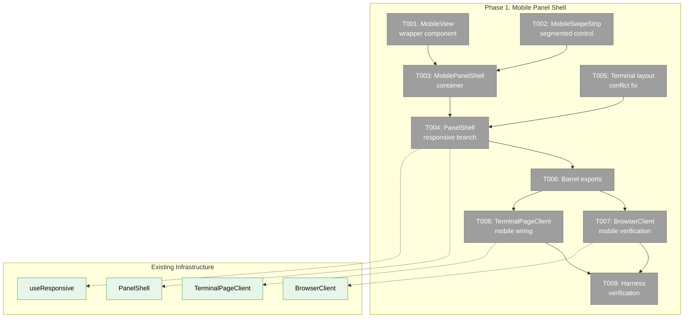
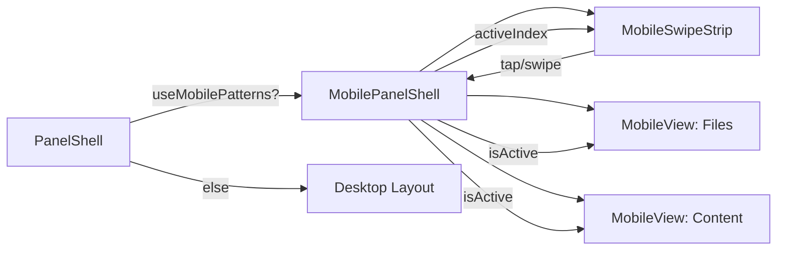
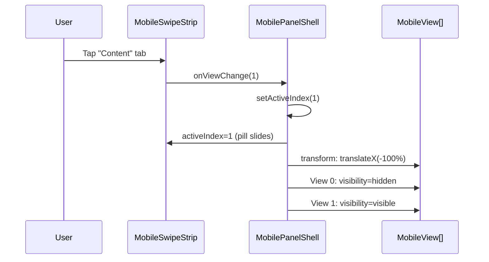

# Phase 1: Mobile Panel Shell — Tasks Dossier

**Plan**: [mobile-experience-plan.md](../../mobile-experience-plan.md)
**Phase**: Phase 1: Mobile Panel Shell
**Generated**: 2026-04-12
**Domain**: `_platform/panel-layout`

---

## Executive Briefing

**Purpose**: Create the mobile layout infrastructure that transforms workspace pages from a squished three-panel desktop layout into full-screen swipeable views on phone viewports. This is the foundational phase — all subsequent mobile UX work (terminal, browser, polish) depends on MobilePanelShell existing and being wired into PanelShell.

**What We're Building**: Three new components (`MobileView`, `MobileSwipeStrip`, `MobilePanelShell`) in the `_platform/panel-layout` domain, plus the responsive branching in `PanelShell` that renders the mobile shell on phones and the unchanged desktop layout on tablets/desktops. We also resolve a critical conflict in the terminal layout.

**Goals**:
- ✅ `PanelShell` renders `MobilePanelShell` on phone viewports (`<768px`)
- ✅ Desktop/tablet layout unchanged — zero behavioral regression
- ✅ Browser page shows 2 swipeable views (Files + Content) on mobile
- ✅ Terminal page shows 1 full-screen terminal view on mobile
- ✅ Segmented control with tap + swipe switching and sliding pill indicator
- ✅ Off-screen views stay mounted but hidden (`visibility: hidden` + `pointer-events: none`)
- ✅ Terminal layout.tsx conflict resolved (finding 01)
- ✅ `data-terminal-overlay-anchor` preserved on mobile (finding 04)

**Non-Goals**:
- ❌ No terminal UX optimization (font size, toolbar, touch-action) — that's Phase 2
- ❌ No file browser touch targets (48px rows) — that's Phase 3
- ❌ No explorer bar sheet — that's Phase 3
- ❌ No CSS containment — that's Phase 4
- ❌ No documentation — that's Phase 4

---

## Prior Phase Context

_Phase 1 — no prior phases._

---

## Pre-Implementation Check

| File | Exists? | Domain Check | Notes |
|------|---------|-------------|-------|
| `apps/web/src/features/_platform/panel-layout/components/panel-shell.tsx` | ✅ Yes | ✅ `_platform/panel-layout` | Modify — add `useResponsive` branch |
| `apps/web/src/features/_platform/panel-layout/components/mobile-panel-shell.tsx` | ❌ Create | ✅ `_platform/panel-layout` | New file |
| `apps/web/src/features/_platform/panel-layout/components/mobile-swipe-strip.tsx` | ❌ Create | ✅ `_platform/panel-layout` | New file |
| `apps/web/src/features/_platform/panel-layout/components/mobile-view.tsx` | ❌ Create | ✅ `_platform/panel-layout` | New file |
| `apps/web/src/features/_platform/panel-layout/index.ts` | ✅ Yes | ✅ `_platform/panel-layout` | Modify — add exports |
| `apps/web/app/(dashboard)/workspaces/[slug]/terminal/layout.tsx` | ✅ Yes | ⚠️ Cross-domain (`terminal`) | Remove conflicting mobile CSS |
| `apps/web/src/features/064-terminal/components/terminal-page-client.tsx` | ✅ Yes | ✅ `terminal` | Modify — single view on mobile |
| `apps/web/app/(dashboard)/workspaces/[slug]/browser/browser-client.tsx` | ✅ Yes | ✅ `file-browser` | PanelShell auto-branches — verify mobile slot mapping |
| `test/unit/web/features/_platform/panel-layout/mobile-panel-shell.test.tsx` | ❌ Create | ✅ test | New TDD test file |
| `test/unit/web/features/_platform/panel-layout/mobile-swipe-strip.test.tsx` | ❌ Create | ✅ test | New TDD test file |

**Concept Search**: No existing `MobilePanelShell`, `MobileSwipeStrip`, or `MobileView` components found in the codebase. Safe to create.

**Harness context**: Harness at L3 — Boot + Browser Interaction + Structured Evidence + CLI SDK. Health check: `just harness doctor`. Harness available for Phase 1 verification via `just harness screenshot-all` at mobile viewport.

---

## Architecture Map



---

## Tasks

| Status | ID | Task | Domain | Path(s) | Done When | Notes |
|--------|-----|------|--------|---------|-----------|-------|
| [x] | T001 | Create `MobileView` wrapper component | `_platform/panel-layout` | `apps/web/src/features/_platform/panel-layout/components/mobile-view.tsx`, `test/unit/web/features/_platform/panel-layout/mobile-panel-shell.test.tsx` | Component renders children at 100% width/height; sets `visibility: hidden` + `pointer-events: none` when `isActive=false`; keeps children mounted (no unmount/remount); applies `data-terminal-overlay-anchor` when `isTerminal=true` | **TDD**. Finding 04: preserve overlay anchor. Internal component (not exported from barrel). |
| [x] | T002 | Create `MobileSwipeStrip` segmented control | `_platform/panel-layout` | `apps/web/src/features/_platform/panel-layout/components/mobile-swipe-strip.tsx`, `test/unit/web/features/_platform/panel-layout/mobile-swipe-strip.test.tsx` | Renders tab labels with Lucide icons; sliding pill indicator animates (CSS transition) to active tab position; tap on tab calls `onViewChange(index)`; pointer-event swipe detection on the strip with 50px distance / 0.3 velocity threshold (per plan task 1.2); 42px height (per prototype validation — workshop 001's 48px was pre-prototype); accepts `views: Array<{ label: string; icon: ReactNode }>` and `activeIndex: number` | **TDD**. Workshop 001: top-strip swipe zone. Icons from spec AC-08: `FolderOpen`, `FileText`, `TerminalSquare`. Optional `rightAction` slot for future search icon (Phase 3). |
| [x] | T003 | Create `MobilePanelShell` container | `_platform/panel-layout` | `apps/web/src/features/_platform/panel-layout/components/mobile-panel-shell.tsx`, `test/unit/web/features/_platform/panel-layout/mobile-panel-shell.test.tsx` | Composes `MobileSwipeStrip` + `MobileView` children; views positioned via CSS `transform: translateX(-${activeIndex * 100}%)` with 350ms `cubic-bezier(0.22, 1, 0.36, 1)` transition; accepts `views: Array<{ label, icon, content }>` with variable count; height accounts for BottomTabBar (finding 07: use `calc(100dvh - 42px - var(--bottom-nav-height, 50px))` or measure dynamically); exposes `onViewChange` callback | **TDD**. Workshop 001: transform-based positioning. Finding 02: NO CSS `contain` yet (Phase 4). Finding 07: BottomTabBar height offset. |
| [x] | T004 | Modify `PanelShell` — add `mobileViews` prop + responsive branch | `_platform/panel-layout` | `apps/web/src/features/_platform/panel-layout/components/panel-shell.tsx`, `test/unit/web/features/_platform/panel-layout/mobile-panel-shell.test.tsx` | Add optional `mobileViews?: Array<{ label: string; icon: ReactNode; content: ReactNode }>` to `PanelShellProps`. When `useResponsive().useMobilePatterns` is true AND `mobileViews` is provided, render `MobilePanelShell`; otherwise render existing desktop layout unchanged. `autoSaveId` prop preserved unchanged. SSR: server returns desktop snapshot, client hydrates to mobile on phone — brief flash acceptable (`useResponsive` uses `useSyncExternalStore` with desktop server snapshot). Finding 06: safe to import `useResponsive`. | **TDD** — tests in `mobile-panel-shell.test.tsx`: PanelShell at 375px with `mobileViews` → MobilePanelShell; at 1024px → desktop; without `mobileViews` at 375px → desktop (graceful fallback). Additive API change — existing consumers unaffected. |
| [x] | T005 | Remove conflicting mobile CSS from `terminal/layout.tsx` | `terminal` | `apps/web/app/(dashboard)/workspaces/[slug]/terminal/layout.tsx` | Remove `fixed inset-0 bottom-[65px] z-10 bg-background` from the div class; keep `md:relative md:bottom-0 md:z-auto md:h-full` desktop styles; MobilePanelShell now owns mobile sizing; desktop terminal layout unchanged | **Lightweight**. Finding 01 (CRITICAL). Cross-domain change. Verify desktop terminal still renders correctly via harness screenshot at 1024px. |
| [x] | T006 | Update barrel export | `_platform/panel-layout` | `apps/web/src/features/_platform/panel-layout/index.ts` | Export `MobilePanelShell` and `MobileSwipeStrip` (contract components). `MobileView` is internal — NOT exported (per domain manifest). Export types: `MobilePanelShellProps`, `MobileSwipeStripProps` | **Lightweight**. Plan task 1.6 says export all 3 but domain manifest marks MobileView as internal — **dossier follows manifest** (authoritative). Plan task 1.6 to be corrected. |
| [x] | T007 | Wire `BrowserClient` mobile views via `mobileViews` prop | `file-browser` | `apps/web/app/(dashboard)/workspaces/[slug]/browser/browser-client.tsx` | Pass `mobileViews` prop to `PanelShell`: `[{ label: 'Files', icon: <FolderOpen />, content: <left slot> }, { label: 'Content', icon: <FileText />, content: <main slot> }]`. Explorer slot is **hidden on mobile in Phase 1** (Phase 3 reintroduces it as bottom Sheet). Verify at 375px: browser page shows 2 views. No mobile branching logic inside BrowserClient. | **Lightweight**. Finding 03: keep mobile concerns at shell/wrapper level. Visual verification via harness screenshot at 375px. |
| [x] | T008 | Wire `TerminalPageClient` mobile views via `mobileViews` prop | `terminal` | `apps/web/src/features/064-terminal/components/terminal-page-client.tsx` | Pass `mobileViews` prop to `PanelShell`: `[{ label: 'Terminal', icon: <TerminalSquare />, content: <MainPanel with TerminalView> }]`. Sessions list and TerminalPageHeader hidden on mobile (tmux manages sessions). MainPanel renders TerminalView when session selected, otherwise loading/empty state. Verify at 375px: single full-screen terminal view. | **Lightweight**. Per clarification Q5: terminal page = single view on mobile. Visual verification via harness screenshot at 375px. |
| [x] | T009 | Harness verification — Phase 1 | — | — | Run harness screenshots at mobile (375px) + desktop (1024px) viewports for both browser and terminal pages; MobilePanelShell renders at 375px (segmented control visible); desktop layout renders at 1024px (no segmented control); browser page shows 2 mobile views; terminal page shows 1 mobile view | **Harness**. Per ADR-0014 harness coverage. Command: `just harness screenshot-all` or equivalent at both viewports. |

---

## Context Brief

### Key findings from plan

- **Finding 01 (CRITICAL)**: Terminal `layout.tsx` has `fixed inset-0 bottom-[65px] z-10` that fights with MobilePanelShell for mobile positioning. **T005 removes this.** Must verify desktop terminal still works after removal.
- **Finding 02 (HIGH)**: CSS `contain` breaks overlays. **Action: do NOT add `contain` to MobileView in Phase 1.** Use only `visibility: hidden` + `pointer-events: none`. Deferred to Phase 4.
- **Finding 03 (HIGH)**: BrowserClient is ~900 lines. **Action: keep mobile concerns in MobilePanelShell/PanelShell wrapper layer, not inside BrowserClient.** T007 verifies this passively.
- **Finding 04 (HIGH)**: `data-terminal-overlay-anchor` on PanelShell's main div must be preserved. **T001 adds an `isTerminal` prop to MobileView** that applies the data attribute.
- **Finding 06 (HIGH)**: `useResponsive` is safe to import in PanelShell — no circular deps.
- **Finding 07 (HIGH)**: BottomTabBar is 50-65px at bottom. MobilePanelShell must account for this in height calc. **T003 uses `100dvh` minus strip height minus bottom nav.**

### Domain dependencies

- `_platform/panel-layout`: PanelShell (panel-shell.tsx), PanelShellProps (types) — we extend this
- `useResponsive` hook (`apps/web/src/hooks/useResponsive.ts`) — phone detection via `useMobilePatterns`
- `lucide-react`: `FolderOpen`, `FileText`, `TerminalSquare` icons — for segmented control tabs

### Domain constraints

- `MobileView` is internal — not exported from barrel
- `MobilePanelShell` and `MobileSwipeStrip` are contract — exported from barrel
- PanelShell API (`PanelShellProps`) MUST NOT change — existing consumers must work unchanged
- No new external dependencies (no gesture libraries)
- Import direction: panel-layout → hooks/useResponsive (leaf dependency, safe)

### Harness context

- **Boot**: `just harness dev` → `just harness doctor --wait`
- **Health**: `just harness health`
- **Interact**: Browser automation — `just harness screenshot <name>` at `--viewport mobile`
- **Observe**: Screenshots in harness evidence directory
- **Maturity**: L3 — Boot + Browser + Evidence + CLI SDK
- **Pre-phase validation**: Agent MUST validate harness at start of implementation (Boot → Interact → Observe)

### Reusable from prior phases

- `FakeMatchMedia` (`test/fakes/fake-match-media.ts`) — simulate phone/tablet/desktop viewports in tests
- `FakeResizeObserver` (`test/fakes/fake-resize-observer.ts`) — mock resize events
- `useResponsive` hook — already tested, stable API
- `BottomTabBar` — injected by dashboard layout, not by workspace pages (no changes needed)

### PanelShell → MobilePanelShell view mapping design

**Decision: Option B — `mobileViews` prop (CHOSEN)**

Add an optional `mobileViews` prop to `PanelShellProps`. This is an additive change — existing consumers without the prop see zero behavior change.

```tsx
interface PanelShellProps {
  explorer: ReactNode;
  left: ReactNode;
  main: ReactNode;
  autoSaveId?: string;
  /** Mobile view configuration. When provided + phone viewport, renders MobilePanelShell. */
  mobileViews?: Array<{ label: string; icon: ReactNode; content: ReactNode }>;
}
```

**Why not infer from existing props?** PanelShell doesn't know which icons/labels to use — that's page-specific. Browser needs `FolderOpen`/`FileText` with 2 views; terminal needs `TerminalSquare` with 1 view. The consumer knows best.

**SSR behavior**: `useResponsive` returns desktop on server via `useSyncExternalStore`. On phone, client hydrates to mobile after first paint — a brief desktop flash is acceptable for V1. No hydration mismatch because server always renders desktop.

**Fallback**: When `mobileViews` is not provided, PanelShell renders desktop layout even on phone. This means existing consumers (if any beyond browser/terminal) degrade gracefully.

**Rejected alternatives**:
- Option A (infer from props): PanelShell can't determine icon/label/count — too generic
- Option C (render props / slot pattern): Overengineered for 2 consumers

### Mermaid: Component relationships



### Mermaid: View switch sequence



---

## Discoveries & Learnings

_Populated during implementation by plan-6._

| Date | Task | Type | Discovery | Resolution | References |
|------|------|------|-----------|------------|------------|

**Types**: `gotcha` | `research-needed` | `unexpected-behavior` | `workaround` | `decision` | `debt` | `insight`

---

## Directory Layout

```
docs/plans/078-mobile-experience/
  ├── mobile-experience-plan.md
  ├── mobile-experience-spec.md
  ├── exploration.md
  ├── workshops/
  │   ├── 001-mobile-swipeable-panel-experience.md
  │   ├── 002-xterm-mobile-touch-first.md
  │   └── 003-smart-show-hide-mobile-chrome.md
  └── tasks/phase-1-mobile-panel-shell/
      ├── tasks.md              ← this file
      ├── tasks.fltplan.md      ← flight plan (below)
      └── execution.log.md     # created by plan-6
```
