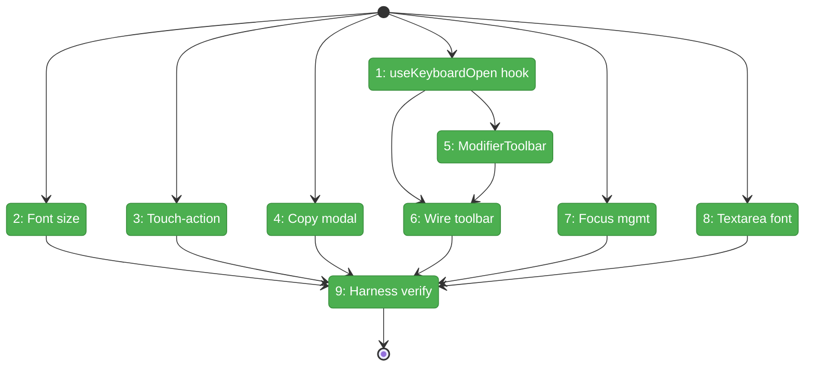
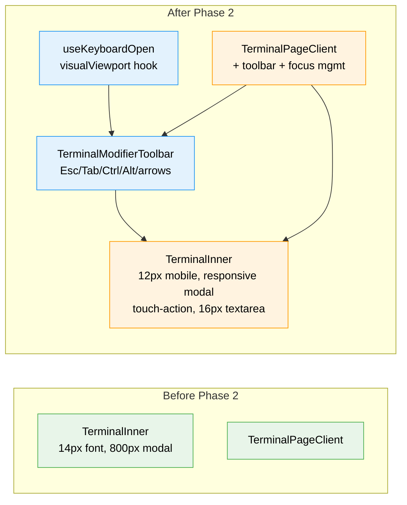

# Flight Plan: Phase 2 — Terminal Mobile UX

**Plan**: [mobile-experience-plan.md](../../mobile-experience-plan.md)
**Phase**: Phase 2: Terminal Mobile UX
**Generated**: 2026-04-12
**Status**: Landed

---

## Departure → Destination

**Where we are**: Phase 1 delivered MobilePanelShell — the terminal page shows a single full-screen view on phone. But the terminal itself is still desktop-optimized: 14px font squeezes ~46 columns on a 390px screen, no modifier keys (Esc/Ctrl/Tab), copy modal is 800px wide, and double-tap zoom fires unexpectedly. The terminal is *visible* on mobile but not *usable*.

**Where we're going**: A developer on their phone opens the terminal and gets a 12px font (~54 columns), can press Ctrl+C via a toolbar that auto-appears above the keyboard, copy text via a responsive modal, and navigate TUI menus with arrow keys — all without fighting iOS zoom or losing keyboard focus.

---

## Domain Context

### Domains We're Changing

| Domain | What Changes | Key Files |
|--------|-------------|-----------|
| `terminal` | Mobile font size, touch-action CSS, responsive copy modal, modifier toolbar, keyboard hook, focus management, textarea font fix | `terminal-inner.tsx`, `terminal-page-client.tsx`, `use-keyboard-open.ts` (new), `terminal-modifier-toolbar.tsx` (new) |

### Domains We Depend On (no changes)

| Domain | What We Consume | Contract |
|--------|----------------|----------|
| `_platform/panel-layout` | `MobilePanelShell.onViewChange` | Detect terminal view active |
| (hook) `useResponsive` | `useMobilePatterns` | Phone viewport detection |

---

## Flight Status

**Legend**: grey = pending | yellow = active | red = blocked/needs input | green = done

---

## Stages

- [x] **Stage 1: Foundation** — Create `useKeyboardOpen` hook + CSS/config fixes (font size, touch-action, copy modal, textarea font) — all independent (`use-keyboard-open.ts` — new, `terminal-inner.tsx` — modified)
- [x] **Stage 2: Toolbar** — Create `TerminalModifierToolbar` component with Esc/Tab/Ctrl/Alt/arrows (`terminal-modifier-toolbar.tsx` — new)
- [x] **Stage 3: Integration** — Wire toolbar to terminal with keyboard auto-show + focus management (`terminal-page-client.tsx` — modified)
- [x] **Stage 4: Verify** — Harness screenshots at mobile viewport

---

## Architecture: Before & After

---

## Acceptance Criteria

- [ ] AC-14: Terminal renders at 12px font on phone
- [ ] AC-15: Terminal container has `touch-action: manipulation`
- [ ] AC-16: Keyboard open → terminal refits
- [ ] AC-17: View-switch to terminal → terminal gets focus
- [ ] AC-18: Copy modal responsive sizing
- [ ] AC-19: Modifier toolbar auto-shows on keyboard open
- [ ] AC-20: Ctrl+C via toolbar sends `\x03`

## Goals & Non-Goals

**Goals**:
- Usable terminal on phone — type, navigate TUIs, copy text
- Modifier keys accessible via auto-showing toolbar
- Zero desktop regression

**Non-Goals**:
- Renderer switch (Canvas stays)
- Font size user control (V2)
- Landscape layout optimization

---

## Checklist

- [x] T001: Create `useKeyboardOpen` hook
- [x] T002: Mobile font size (12px)
- [x] T003: Add `touch-action: manipulation`
- [x] T004: Responsive copy modal
- [x] T005: Create `TerminalModifierToolbar`
- [x] T006: Wire toolbar + keyboard auto-show
- [x] T007: Terminal focus on view-switch
- [x] T008: Hidden textarea 16px font
- [x] T009: Harness verification
