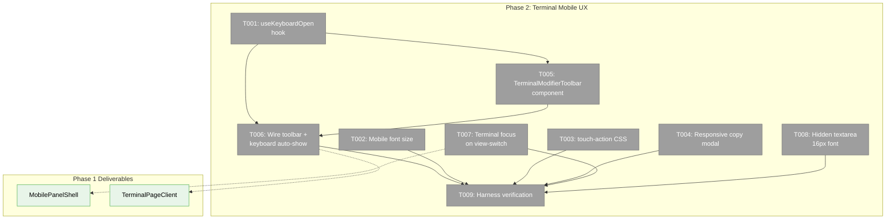
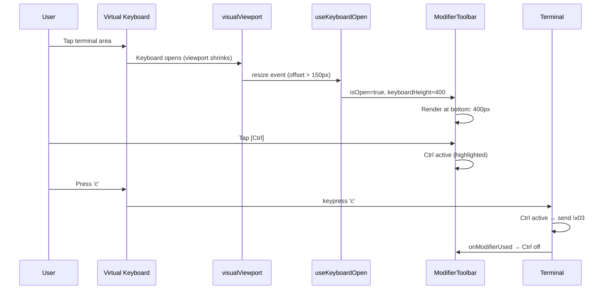

# Phase 2: Terminal Mobile UX — Tasks Dossier

**Plan**: [mobile-experience-plan.md](../../mobile-experience-plan.md)
**Phase**: Phase 2: Terminal Mobile UX
**Generated**: 2026-04-12
**Domain**: `terminal`

---

## Executive Briefing

**Purpose**: Optimize the xterm.js terminal for phone use. Phase 1 delivered the swipeable view container — now we make the terminal inside it actually usable on a phone. This means smaller font, touch-safe CSS, a responsive copy modal, a modifier key toolbar (Esc/Tab/Ctrl/Alt/arrows) that auto-docks above the virtual keyboard, and terminal focus management on view switch.

**What We're Building**: A `useKeyboardOpen` hook for detecting virtual keyboard state, a `TerminalModifierToolbar` component for sending keys missing from mobile keyboards, CSS/config changes to terminal-inner.tsx for mobile font size and touch behavior, and integration wiring to connect it all.

**Goals**:
- ✅ Terminal renders at 12px font on phone (54 columns), 14px on desktop
- ✅ `touch-action: manipulation` prevents double-tap zoom
- ✅ Copy modal responsive (no more 800px hard-code)
- ✅ Modifier toolbar auto-shows when keyboard opens, docks above keyboard
- ✅ Ctrl+C via toolbar sends `\x03`
- ✅ Terminal gets focus when swiped to (keyboard can open on tap)
- ✅ Hidden textarea at 16px prevents iOS auto-zoom

**Non-Goals**:
- ❌ No renderer switch (Canvas stays — Workshop 002 resolved this)
- ❌ No custom text selection (tmux show-buffer handles copy)
- ❌ No font size user control (V2 feature)
- ❌ No landscape-specific layout

---

## Prior Phase Context

### Phase 1: Mobile Panel Shell (✅ Complete)

**A. Deliverables**:
- `apps/web/src/features/_platform/panel-layout/components/mobile-view.tsx` — visibility wrapper
- `apps/web/src/features/_platform/panel-layout/components/mobile-swipe-strip.tsx` — segmented control
- `apps/web/src/features/_platform/panel-layout/components/mobile-panel-shell.tsx` — swipeable container
- `apps/web/src/features/_platform/panel-layout/components/panel-shell.tsx` — modified with `mobileViews` prop + `useResponsive` branch
- `apps/web/src/features/_platform/panel-layout/index.ts` — barrel exports updated
- `apps/web/app/(dashboard)/workspaces/[slug]/terminal/layout.tsx` — removed conflicting mobile CSS
- `apps/web/src/features/064-terminal/components/terminal-page-client.tsx` — passes `mobileViews` with single Terminal view
- `apps/web/app/(dashboard)/workspaces/[slug]/browser/browser-client.tsx` — passes `mobileViews` with Files + Content views

**B. Dependencies Exported**:
- `MobilePanelShell` — accepts `views: Array<{ label, icon, content }>`, exposes `onViewChange` callback. Internal `MobileView` handles `isTerminal` flag for overlay anchor.
- `MobileSwipeStrip` — accepts `views`, `activeIndex`, `onViewChange`, optional `rightAction` slot
- `PanelShellProps.mobileViews` — additive prop, consumer-driven mobile view config
- `useResponsive().useMobilePatterns` — phone detection (already existed, now wired into PanelShell)

**C. Gotchas & Debt**:
- `useResponsive` module-level cache can cause stale values in tests — use dynamic imports in test files for isolation.
- `setPointerCapture` wrapped in try/catch for jsdom compatibility.

**D. Incomplete Items**: None — all 9 tasks complete.

**E. Patterns to Follow**:
- Components in `apps/web/src/features/<domain>/components/`
- Hooks in `apps/web/src/features/<domain>/hooks/`
- Tests in `test/unit/web/features/<domain>/`
- Use `FakeMatchMedia` + `Object.defineProperty(window, 'innerWidth')` for viewport tests
- TDD test files created before implementation
- Harness verification via Playwright CDP at `http://127.0.0.1:9300` connecting to app at port 3178

---

## Pre-Implementation Check

| File | Exists? | Domain Check | Notes |
|------|---------|-------------|-------|
| `apps/web/src/features/064-terminal/hooks/use-keyboard-open.ts` | ❌ Create | ✅ `terminal` | New hook |
| `apps/web/src/features/064-terminal/components/terminal-modifier-toolbar.tsx` | ❌ Create | ✅ `terminal` | New component |
| `apps/web/src/features/064-terminal/components/terminal-inner.tsx` | ✅ Yes (428 lines) | ✅ `terminal` | Modify — fontSize (line 214), copy modal (line 400), touch-action, textarea font, bottomOffset (lines 99-115, 361) |
| `apps/web/src/features/064-terminal/components/terminal-view.tsx` | ✅ Yes (40 lines) | ✅ `terminal` | Dynamic import wrapper for TerminalInner. Has `isVisible` on TerminalInner but TerminalView doesn't pass it through yet. |
| `apps/web/src/features/064-terminal/components/terminal-page-client.tsx` | ✅ Yes | ✅ `terminal` | Modify — wire toolbar + focus callback |
| `test/unit/web/features/064-terminal/use-keyboard-open.test.ts` | ❌ Create | ✅ test | New TDD test |
| `test/unit/web/features/064-terminal/terminal-modifier-toolbar.test.tsx` | ❌ Create | ✅ test | New TDD test |
| `test/unit/web/features/064-terminal/terminal-toolbar-integration.test.tsx` | ❌ Create | ✅ test | New TDD integration test for T006 |

**Concept Search**: No existing `useKeyboardOpen` or `TerminalModifierToolbar` in codebase. The `visualViewport` logic in terminal-inner.tsx (lines 99-115) calculates `bottomOffset` — related but separate purpose. The new hook wraps the same API with a boolean+height return shape.

**Harness**: ✅ Running at `http://127.0.0.1:3178` (CDP at `:9300`). Healthy.

---

## Architecture Map



---

## Tasks

| Status | ID | Task | Domain | Path(s) | Done When | Notes |
|--------|-----|------|--------|---------|-----------|-------|
| [ ] | T001 | Create `useKeyboardOpen` hook | `terminal` | `apps/web/src/features/064-terminal/hooks/use-keyboard-open.ts`, `test/unit/web/features/064-terminal/use-keyboard-open.test.ts` | Returns `{ isOpen: boolean, keyboardHeight: number }` using `visualViewport` API; fires when viewport shrinks by >150px; no-op on desktop (returns `{ isOpen: false, keyboardHeight: 0 }`); cleanup removes listener | **TDD**. Workshop 003: 150px threshold. This hook will **replace** the existing `bottomOffset` visualViewport effect in terminal-inner.tsx (lines 99-115) — same API, different return shape. Returns `keyboardHeight` which serves both toolbar visibility AND container sizing. |
| [ ] | T002 | Mobile font size in `terminal-inner.tsx` | `terminal` | `apps/web/src/features/064-terminal/components/terminal-inner.tsx` | When `useResponsive().useMobilePatterns` is true, `Terminal({ fontSize: 12 })`; tablet/desktop stays at 14. Import `useResponsive` from `@/hooks/useResponsive`. | **Lightweight**. Workshop 002: 12px → ~54 cols on 390px. Deviation ledger: CSS-config change, test-after. |
| [ ] | T003 | Add `touch-action: manipulation` to `.xterm-screen` | `terminal` | `apps/web/src/features/064-terminal/components/terminal-inner.tsx` | After `terminal.open(container)`, query `.xterm-screen` element and set `touch-action: manipulation` style. Prevents double-tap zoom on mobile. Applied unconditionally (harmless on desktop). | **Lightweight**. Workshop 002: target `.xterm-screen` specifically (not container div). |
| [ ] | T004 | Responsive copy modal | `terminal` | `apps/web/src/features/064-terminal/components/terminal-inner.tsx` | Replace `style={{ width: '800px', ... height: '800px', ... }}` on copy modal (line 400) with `width: '100%', maxWidth: '95vw', maxHeight: '80vh'`. Modal fits mobile viewport. | **Lightweight**. |
| [ ] | T005 | Create `TerminalModifierToolbar` component | `terminal` | `apps/web/src/features/064-terminal/components/terminal-modifier-toolbar.tsx`, `test/unit/web/features/064-terminal/terminal-modifier-toolbar.test.tsx` | Renders 8 buttons: Esc, Tab, Ctrl (toggle), Alt (toggle), ←, ↑, ↓, →. 36px height. Calls `onKey(data: string)` for immediate keys (Esc→`\x1b`, Tab→`\t`, arrows→`\x1b[A/B/C/D`). Ctrl/Alt toggles — tap activates (visual: distinct bg + text color), deactivates via `onModifierUsed()`. Alt+key sends `\x1b` + key. Touch targets: modifiers 44×32px, arrows 36×32px. Styling: `border-top: 1px solid var(--border)`, semi-transparent bg. | **TDD**. Workshop 003 (not 002) defines Ctrl/Alt toggle + auto-reset behavior. |
| [ ] | T006 | Wire toolbar to terminal with keyboard auto-show | `terminal` | `apps/web/src/features/064-terminal/components/terminal-inner.tsx`, `test/unit/web/features/064-terminal/terminal-toolbar-integration.test.tsx` | When `useKeyboardOpen().isOpen` AND `useMobilePatterns`: (1) render toolbar at `position: fixed; bottom: <keyboardHeight>px`, (2) set terminal container `bottom` to `keyboardHeight + 36px` (toolbar height) so ResizeObserver refits, (3) toolbar keys go through `sendRef.current(data)` — same outbound path as `terminal.onData` (line 272), NOT `terminal.write()` which is inbound. Ctrl intercept: use `attachCustomKeyEventHandler` to catch next keydown when Ctrl active, compute `String.fromCharCode(e.key.toUpperCase().charCodeAt(0) & 0x1f)`, send via `sendRef.current`, return false, deactivate Ctrl. Alt: send `\x1b` + key char. Replaces existing `bottomOffset` state with `useKeyboardOpen().keyboardHeight`. | **TDD integration**. Test file: keyboard-open → toolbar visible, key send, Ctrl auto-reset. |
| [ ] | T007 | Terminal focus on initial mount (mobile) | `terminal` | `apps/web/src/features/064-terminal/components/terminal-inner.tsx` | On mobile (`useMobilePatterns`), auto-focus terminal after mount so virtual keyboard can be triggered by tap. Terminal page has only 1 mobile view — no view-switch event needed. Use existing `isVisible` pattern (lines 347-354) or focus on mount. Note: `PanelShell` does not expose `onViewChange` to consumers — if multi-view terminal pages are added later, revisit. | **Lightweight**. Rescoped: terminal page = single view, initial mount focus is sufficient. |
| [ ] | T008 | Hidden textarea 16px font-size | `terminal` | `apps/web/src/features/064-terminal/components/terminal-inner.tsx` | After `terminal.open(container)`, query `.xterm-helper-textarea` and set `style.fontSize = '16px'`. Prevents iOS Safari auto-zoom on focus. CSS rule approach also acceptable. | **Lightweight**. Workshop 002: iOS auto-zoom prevention. |
| [ ] | T009 | Harness verification — Phase 2 | — | — | Run harness screenshots at mobile viewport (390×844) for terminal page; verify font is visibly smaller than desktop, copy modal fits viewport. Toolbar auto-show cannot be verified via Playwright (needs real keyboard) — mark as manual/integration-test verified. | **Harness**. Playwright CDP at `:9300`. Toolbar keyboard-open behavior verified via unit tests + manual on phone. |

---

## Acceptance Criteria

| AC | Task(s) | Criteria |
|----|---------|----------|
| AC-14 | T002 | Terminal renders at 12px font on phone |
| AC-15 | T003 | Terminal container has `touch-action: manipulation` |
| AC-16 | T001, T006 | Keyboard open → terminal refits to reduced height |
| AC-17 | T007 | View-switch/mount → terminal gets focus |
| AC-18 | T004 | Copy modal responsive sizing (≤95vw) |
| AC-19 | T001, T005, T006 | Modifier toolbar auto-shows on keyboard open |
| AC-20 | T005, T006 | Ctrl+C via toolbar sends `\x03` |

---

## Context Brief

### Key findings from plan

- **Finding 01 (CRITICAL)**: Terminal layout.tsx mobile CSS conflict — **RESOLVED in Phase 1**.
- **Finding 04 (HIGH)**: `data-terminal-overlay-anchor` — **RESOLVED in Phase 1**.

### Domain dependencies

- `_platform/panel-layout`: `MobilePanelShell` (`onViewChange` callback) — detect terminal view active for focus management
- `useResponsive` hook (`@/hooks/useResponsive`) — phone detection for font size branching
- `terminal`: `useTerminalSocket` (send function) — send modifier key data to terminal
- `terminal`: existing `visualViewport` logic (terminal-inner.tsx:99-115) — reference for `useKeyboardOpen` design

### Domain constraints

- All new files in `apps/web/src/features/064-terminal/` (hooks/ or components/)
- `TerminalModifierToolbar` is internal to terminal domain — NOT exported from barrel
- `useKeyboardOpen` is internal but potentially reusable — keep in terminal domain for now
- No new external dependencies

### Harness context

- **Boot**: `just harness dev` — already running at `:3178`
- **Health**: `just harness health` — healthy
- **Interact**: Playwright CDP at `http://127.0.0.1:9300`, app at `http://127.0.0.1:3178`
- **Observe**: Screenshots via `page.screenshot()` at mobile viewport
- **Maturity**: L3

### Reusable from Phase 1

- `FakeMatchMedia` (`test/fakes/fake-match-media.ts`) — viewport simulation
- Harness screenshot approach — `chromium.connectOverCDP` with mobile context
- `useResponsive` import pattern

### Terminal-inner.tsx key locations

- **fontSize**: line 214 — `fontSize: 14` — change to conditional
- **visualViewport**: lines 99-115 — existing `bottomOffset` logic
- **copy modal**: line 400 — `width: '800px', height: '800px'` — make responsive
- **terminal focus**: lines 168, 352 — existing `.focus()` calls

### Mermaid: Toolbar keyboard flow



---

## Discoveries & Learnings

_Populated during implementation by plan-6._

| Date | Task | Type | Discovery | Resolution | References |
|------|------|------|-----------|------------|------------|

**Types**: `gotcha` | `research-needed` | `unexpected-behavior` | `workaround` | `decision` | `debt` | `insight`

---

## Directory Layout

```
docs/plans/078-mobile-experience/
  ├── mobile-experience-plan.md
  ├── mobile-experience-spec.md
  ├── exploration.md
  ├── workshops/
  │   ├── 001-mobile-swipeable-panel-experience.md
  │   ├── 002-xterm-mobile-touch-first.md
  │   └── 003-smart-show-hide-mobile-chrome.md
  └── tasks/
      ├── phase-1-mobile-panel-shell/   (✅ complete)
      └── phase-2-terminal-mobile-ux/
          ├── tasks.md              ← this file
          ├── tasks.fltplan.md      ← flight plan
          └── execution.log.md     # created by plan-6
```
