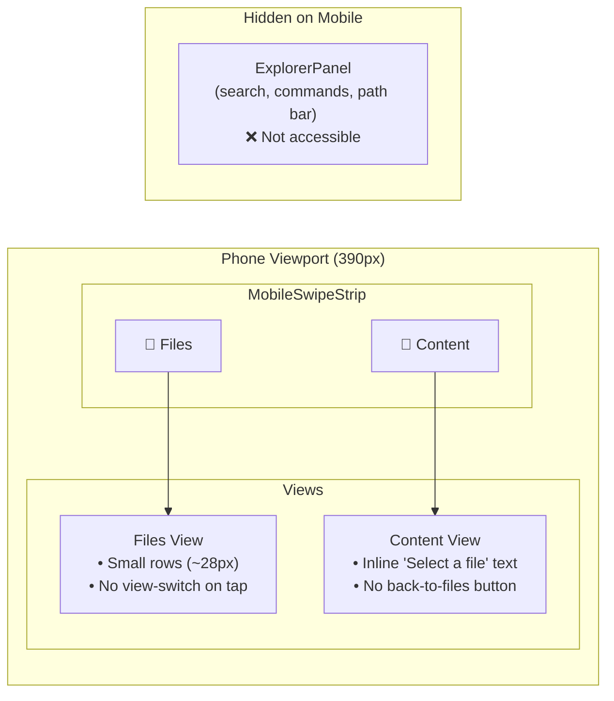
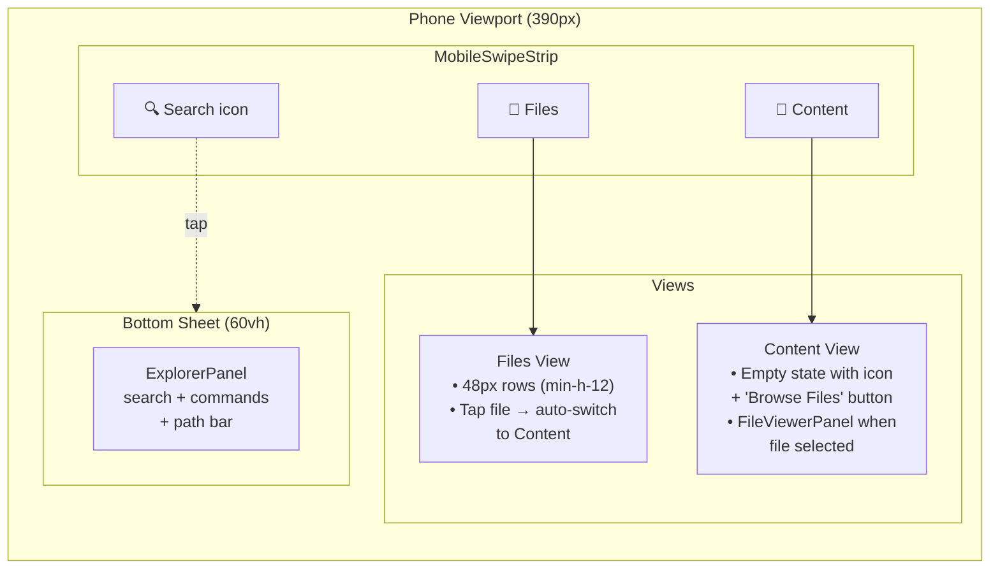
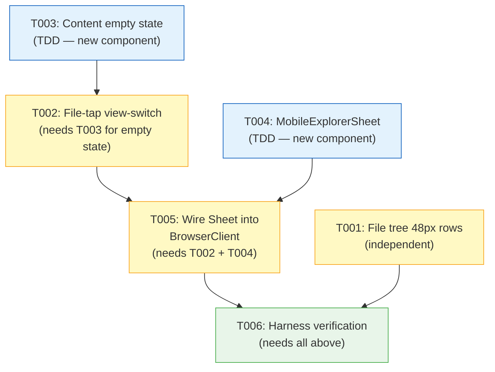

# Phase 3: Browser Mobile UX — Flight Plan

**Plan**: 078-mobile-experience
**Phase**: Phase 3: Browser Mobile UX
**Tasks Dossier**: [tasks.md](tasks.md)

---

## What This Phase Does

Transforms the file browser from a desktop-only experience into a touch-friendly mobile interface. After this phase, a user on a phone can browse files with properly sized touch targets, tap a file to auto-switch to the content viewer, see a helpful empty state when no file is selected, and access the search/command palette via a bottom sheet.

---

## Before → After

### Before (Phase 2 complete)



### After (Phase 3 complete)



---

## Key Architecture Changes

### 1. MobilePanelShell gains controlled mode

```
BEFORE: activeIndex = internal useState (uncontrolled)
AFTER:  activeIndex = optional prop (controlled when provided, uncontrolled otherwise)
```

This enables BrowserClient to programmatically switch views (file-tap → Content, "Browse Files" → Files).

### 2. PanelShell forwards new mobile props

```
BEFORE: <MobilePanelShell views={mobileViews} />
AFTER:  <MobilePanelShell views={mobileViews}
           onViewChange={onMobileViewChange}
           activeIndex={mobileActiveIndex}
           rightAction={mobileRightAction} />
```

### 3. ExplorerPanel reused inside Sheet (no duplication)

The same `ExplorerPanel` component rendered in the desktop explorer bar is wrapped in a `Sheet` for mobile — same props, same behavior, different container.

---

## Task Dependency Graph



Legend: 🟦 TDD (write tests first) · 🟨 Lightweight · 🟩 Harness

---

## Suggested Execution Order

1. **T001** (independent) + **T003** (TDD, independent) + **T004** (TDD, independent) — _can be parallel_
2. **T002** — depends on T003 (uses ContentEmptyState in the empty state slot)
3. **T005** — depends on T002 + T004 (wires everything together)
4. **T006** — verification gate

---

## Risk Mitigations

| Risk | Mitigation |
|------|------------|
| BrowserClient regression from view-switch wiring | Per finding 03: callback is wired at PanelShell props level only, no mobile branching inside BrowserClient render tree |
| ExplorerPanel inside Sheet has focus/keyboard issues | Test command palette keyboard interaction; Sheet manages focus trap via Radix |
| MobilePanelShell controlled mode breaks terminal page | Terminal page doesn't pass `activeIndex` — uncontrolled mode preserved as default |
| Sheet component missing `side="bottom"` | Confirmed: `sheet.tsx` supports `side="bottom"` with proper animations |

---

## Files Changed Summary

| File | Change Type | Domain |
|------|-------------|--------|
| `file-tree.tsx` | Modify (add `min-h-12` on mobile) | `file-browser` |
| `content-empty-state.tsx` | **Create** | `file-browser` |
| `mobile-explorer-sheet.tsx` | **Create** | `_platform/panel-layout` |
| `mobile-panel-shell.tsx` | Modify (controlled mode) | `_platform/panel-layout` |
| `panel-shell.tsx` | Modify (forward new props) | `_platform/panel-layout` |
| `browser-client.tsx` | Modify (view-switch + Sheet wiring) | `file-browser` |
| `index.ts` (panel-layout barrel) | Modify (export MobileExplorerSheet) | `_platform/panel-layout` |
| `content-empty-state.test.tsx` | **Create** | test |
| `mobile-explorer-sheet.test.tsx` | **Create** | test |

---

## Navigation

- **Tasks Dossier**: [tasks.md](tasks.md)
- **Plan**: [mobile-experience-plan.md](../../mobile-experience-plan.md)
- **Spec**: [mobile-experience-spec.md](../../mobile-experience-spec.md)
- **Workshop 001**: [Mobile Swipeable Panel](../../workshops/001-mobile-swipeable-panel-experience.md)
- **Workshop 003**: [Smart Show/Hide](../../workshops/003-smart-show-hide-mobile-chrome.md)
- **Phase 1 Dossier**: [phase-1-mobile-panel-shell/tasks.md](../phase-1-mobile-panel-shell/tasks.md)
- **Phase 2 Dossier**: [phase-2-terminal-mobile-ux/tasks.md](../phase-2-terminal-mobile-ux/tasks.md)
