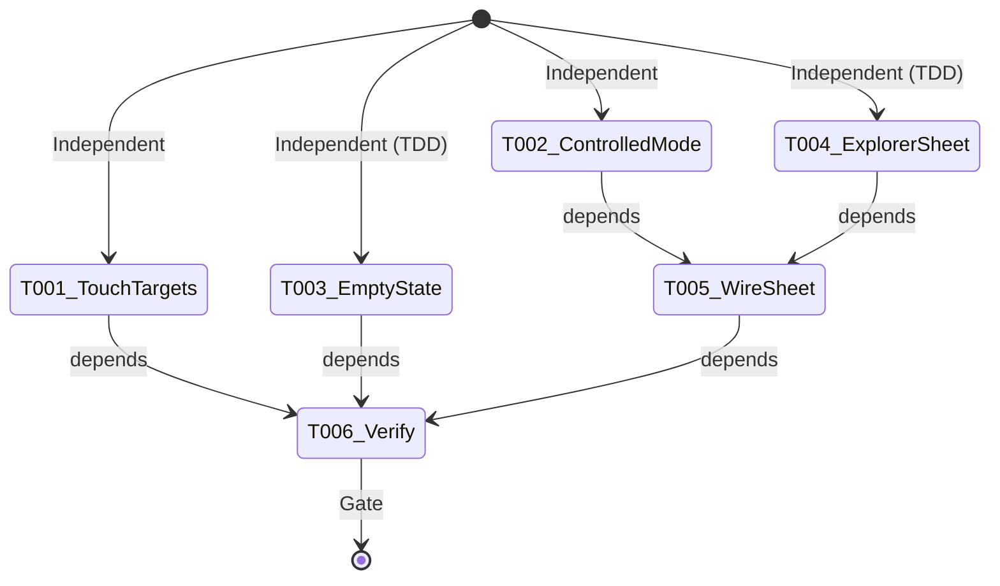
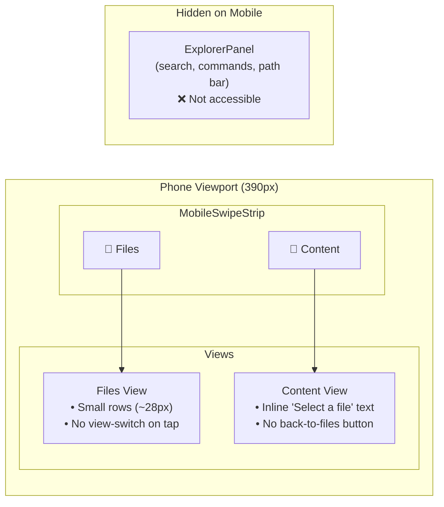
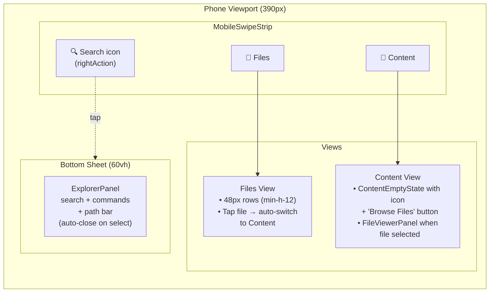

# Phase 3: Browser Mobile UX — Flight Plan

**Plan**: 078-mobile-experience
**Phase**: Phase 3: Browser Mobile UX
**Tasks Dossier**: [tasks.md](tasks.md)
**Revised**: 2026-04-13 (post-validation)

---

## Departure → Destination

**Departure (Phase 2 complete)**: Browser page on mobile shows swipeable Files + Content views via MobilePanelShell, but file rows are tiny (~28px), tapping a file doesn't auto-switch views, content shows generic inline text when empty, and ExplorerPanel (search/commands/path) is inaccessible on mobile.

**Destination (Phase 3 complete)**: File rows are 48px touch targets, tapping a file auto-switches to Content view via controlled MobilePanelShell, content shows a proper empty state with "Browse Files" button, and ExplorerPanel is accessible via a search icon → bottom Sheet in the swipe strip. All mobile logic lives in PanelShell/MobilePanelShell layer — BrowserClient has zero mobile branching.

---

## Domain Context

| Domain | Role | Changes |
|--------|------|---------|
| `_platform/panel-layout` | Infrastructure | MobilePanelShell gains controlled mode; PanelShell forwards new props; new MobileExplorerSheet component |
| `file-browser` | Business | FileTree touch targets; ContentEmptyState component; BrowserClient passes new PanelShell props |
| `shadcn/ui` | External | Consume Sheet with `side="bottom"` (Radix Dialog) — no changes |

---

## Flight Status



---

## Stages

### Stage 1: Independent tasks (parallel)

| Task | Type | What |
|------|------|------|
| T001 | Lightweight | Add `min-h-12` to `<button>` elements in file-tree.tsx on mobile |
| T002 | Lightweight | MobilePanelShell controlled mode + PanelShell forwarding + BrowserClient props (no render branching) |
| T003 | TDD | Create ContentEmptyState component with icon + "Browse Files" button |
| T004 | TDD | Create MobileExplorerSheet with shadcn Sheet, controlled `open`/`onOpenChange` API |

### Stage 2: Integration

| Task | Type | What | Depends |
|------|------|------|---------|
| T005 | Lightweight | Wire Sheet as `mobileRightAction`, auto-close on file select / code search select / command execute | T002, T004 |

### Stage 3: Verification

| Task | Type | What | Depends |
|------|------|------|---------|
| T006 | Harness | Screenshots at 375px + 1024px, terminal page uncontrolled mode check | All |

---

## Architecture Before/After

### Before (Phase 2 complete)



### After (Phase 3 complete)



### Key Architecture Changes

**1. MobilePanelShell gains controlled mode**
```
BEFORE: activeIndex = internal useState (uncontrolled only)
AFTER:  activeIndex = optional prop (controlled when provided, uncontrolled otherwise)
```
Terminal page continues uncontrolled (no `activeIndex` prop). Browser page uses controlled mode.

**2. PanelShell forwards new mobile props**
```
BEFORE: <MobilePanelShell views={mobileViews} />
AFTER:  <MobilePanelShell views={mobileViews}
           onViewChange={onMobileViewChange}
           activeIndex={mobileActiveIndex}
           rightAction={mobileRightAction} />
```

**3. BrowserClient: props only, no render branching**
BrowserClient passes `mobileActiveIndex`, `onMobileViewChange`, and `mobileRightAction` to PanelShell. The `onSelect` callback wrapping for view-switch happens in `mobileViews` prop assembly. BrowserClient does NOT import `useResponsive` or conditionally render based on viewport.

**4. ExplorerPanel reused inside Sheet (no duplication)**
Same `ExplorerPanel` component, same props — wrapped in `MobileExplorerSheet` on mobile.

**5. Sheet close API: Radix native + auto-close**
shadcn Sheet uses Radix Dialog: Escape, backdrop click, X button are native. Swipe-down NOT supported (scoped out V1). Auto-close on file select / code search select / command execute via consumer calling `onOpenChange(false)`.

---

## Acceptance Criteria

| AC | Criteria | Task(s) |
|----|----------|---------|
| AC-09 | File rows ≥48px on mobile (`min-h-12` on `<button>` elements) | T001 |
| AC-10 | File tap → content view auto-switch (always, even if same file re-selected) | T002 |
| AC-11 | Folder tap → expand/navigate (unchanged) | T002 |
| AC-12 | Content view shows selected file viewer | T002, T005 |
| AC-13 | Empty state when no file selected (icon + text + "Browse Files" button) | T003 |
| AC-23 | Explorer bar hidden by default, accessible via search icon → bottom sheet; auto-closes on file select, code search select, or command execute | T004, T005 |

---

## Goals / Non-Goals

**Goals**: Touch-friendly file rows, programmatic view switching via controlled MobilePanelShell, proper empty state, ExplorerPanel in bottom Sheet.

**Non-Goals**: No mobile branching in BrowserClient render tree. No swipe-down-to-close (Radix limitation). No `useMobilePatterns` in BrowserClient. No CSS containment (Phase 4). No documentation (Phase 4).

---

## Risk Mitigations

| Risk | Mitigation |
|------|------------|
| BrowserClient regression from view-switch wiring | Finding 03: ALL mobile logic in PanelShell/MobilePanelShell. BrowserClient only passes generic props. Zero render branching. |
| ExplorerPanel inside Sheet has focus/keyboard issues | Sheet manages focus trap via Radix; test command palette keyboard interaction inside Sheet |
| MobilePanelShell controlled mode breaks terminal page | Terminal page doesn't pass `activeIndex` — uncontrolled mode preserved as default. Add test to verify. |
| Same-file re-select doesn't switch view | Mobile `onSelect` wrapper calls `setMobileActiveIndex(1)` unconditionally BEFORE delegating to `handleFileSelect` |
| Sheet close is confusing without swipe-down | Radix provides Escape + backdrop click + X button natively. Scoped out for V1 — document as known limitation. |
| `min-h-12` on wrong element | Apply to `<button>` elements (~line 461 dirs, ~line 683 files), NOT wrapper `<div>` |

---

## Files Changed Summary

| File | Change Type | Domain |
|------|-------------|--------|
| `file-tree.tsx` | Modify (add `min-h-12` on `<button>` on mobile) | `file-browser` |
| `content-empty-state.tsx` | **Create** | `file-browser` |
| `content-empty-state.test.tsx` | **Create** | test |
| `mobile-explorer-sheet.tsx` | **Create** | `_platform/panel-layout` |
| `mobile-explorer-sheet.test.tsx` | **Create** | test |
| `mobile-panel-shell.tsx` | Modify (controlled mode `activeIndex` prop) | `_platform/panel-layout` |
| `mobile-panel-shell.test.tsx` | Modify (add controlled mode tests) | test |
| `panel-shell.tsx` | Modify (forward `onMobileViewChange`, `mobileActiveIndex`, `mobileRightAction`) | `_platform/panel-layout` |
| `panel-shell-responsive.test.tsx` | Modify (add forwarding tests) | test |
| `browser-client.tsx` | Modify (new PanelShell props — no render branching) | `file-browser` |
| `index.ts` (panel-layout barrel) | Modify (export MobileExplorerSheet) | `_platform/panel-layout` |

---

## Checklist

- [ ] T001 — File tree 48px touch targets on `<button>` elements
- [ ] T002a — MobilePanelShell controlled mode + tests
- [ ] T002b — PanelShell prop forwarding + tests
- [ ] T002c — BrowserClient props (no render branching, unconditional view-switch on file tap)
- [ ] T003 — ContentEmptyState component + tests
- [ ] T004 — MobileExplorerSheet with controlled `open`/`onOpenChange` + tests
- [ ] T005 — Wire Sheet as `mobileRightAction`, auto-close on file/code-search/command select
- [ ] T006 — Harness verification at 375px + 1024px + terminal uncontrolled check

---

## Navigation

- **Tasks Dossier**: [tasks.md](tasks.md)
- **Plan**: [mobile-experience-plan.md](../../mobile-experience-plan.md)
- **Spec**: [mobile-experience-spec.md](../../mobile-experience-spec.md)
- **Workshop 001**: [Mobile Swipeable Panel](../../workshops/001-mobile-swipeable-panel-experience.md)
- **Workshop 003**: [Smart Show/Hide](../../workshops/003-smart-show-hide-mobile-chrome.md)
- **Phase 1 Dossier**: [phase-1-mobile-panel-shell/tasks.md](../phase-1-mobile-panel-shell/tasks.md)
- **Phase 2 Dossier**: [phase-2-terminal-mobile-ux/tasks.md](../phase-2-terminal-mobile-ux/tasks.md)
