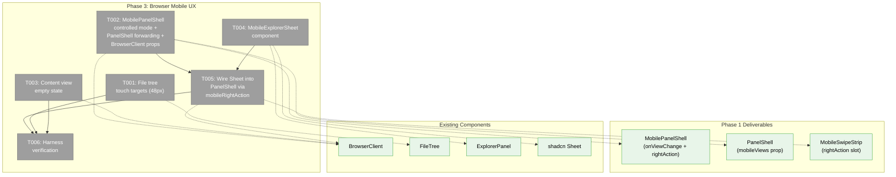
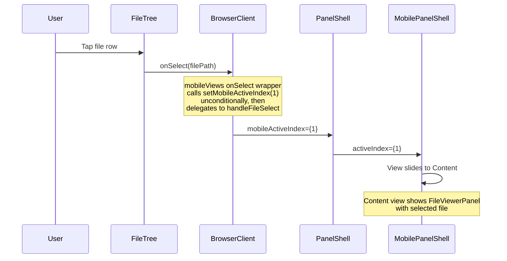
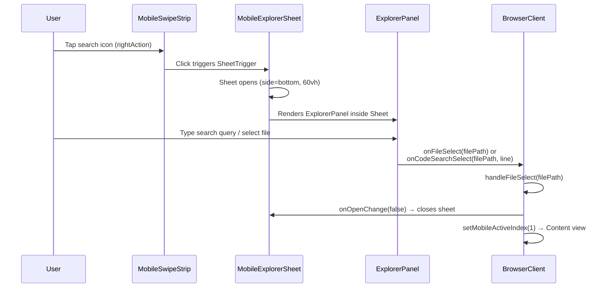

# Phase 3: Browser Mobile UX — Tasks Dossier

**Plan**: [mobile-experience-plan.md](../../mobile-experience-plan.md)
**Phase**: Phase 3: Browser Mobile UX
**Generated**: 2026-04-13
**Revised**: 2026-04-13 (post-validation)
**Domain**: `file-browser`, `_platform/panel-layout`

---

## Executive Briefing

**Purpose**: Make the file browser touch-friendly on phone viewports and wire the explorer bar as a bottom sheet. Phase 1 delivered the swipeable view container, Phase 2 optimized the terminal — now we make the browser page fully usable on a phone. This means bigger touch targets, auto-switching to the Content view when a file is tapped, an empty state when no file is selected, and the ExplorerPanel (search, command palette, path bar) accessible via a search icon → bottom Sheet.

**What We're Building**: Touch-friendly file rows (48px minimum height), controlled mode for MobilePanelShell so the browser page can drive view switches, PanelShell prop forwarding for mobile view control and right-action slot, a content empty state component with a "Browse Files" button, and a `MobileExplorerSheet` component wrapping `ExplorerPanel` in a shadcn `Sheet` triggered by a search icon.

**Goals**:
- ✅ File/folder rows have 48px minimum height on phone (accessible touch targets)
- ✅ Tapping a file auto-switches to Content view (no manual tab tap needed)
- ✅ Tapping a folder expands/navigates normally (unchanged behavior)
- ✅ Content view shows empty state when no file is selected, with "Browse Files" button
- ✅ Explorer bar (search, command palette, path nav) accessible via search icon → bottom Sheet
- ✅ Explorer Sheet auto-closes on file select, code search select, or command execute

**Non-Goals**:
- ❌ No mobile branching inside BrowserClient render tree (finding 03 — ALL mobile logic lives in PanelShell/MobilePanelShell layer; BrowserClient only passes generic props)
- ❌ No `useMobilePatterns` checks inside BrowserClient body — view switching is wired purely via PanelShell prop callbacks
- ❌ No swipe-down-to-close on Sheet — Radix Dialog (underlying shadcn Sheet) does not support swipe gestures; V1 relies on Escape, backdrop click, X button, and auto-close on selection
- ❌ No new URL params for mobile view state (component state only)
- ❌ No mobile code editing (read-only viewer only)
- ❌ No CSS containment optimization — that's Phase 4
- ❌ No documentation — that's Phase 4

---

## Prior Phase Context

### Phase 1: Mobile Panel Shell (✅ Complete)

**A. Deliverables**:
- `apps/web/src/features/_platform/panel-layout/components/mobile-view.tsx` — visibility wrapper
- `apps/web/src/features/_platform/panel-layout/components/mobile-swipe-strip.tsx` — segmented control
- `apps/web/src/features/_platform/panel-layout/components/mobile-panel-shell.tsx` — swipeable container
- `apps/web/src/features/_platform/panel-layout/components/panel-shell.tsx` — modified with `mobileViews` prop + `useResponsive` branch
- `apps/web/src/features/_platform/panel-layout/index.ts` — barrel exports updated
- `apps/web/app/(dashboard)/workspaces/[slug]/terminal/layout.tsx` — removed conflicting mobile CSS
- `apps/web/src/features/064-terminal/components/terminal-page-client.tsx` — passes `mobileViews` with single Terminal view
- `apps/web/app/(dashboard)/workspaces/[slug]/browser/browser-client.tsx` — passes `mobileViews` with Files + Content views

**B. Dependencies Exported**:
- `MobilePanelShell` — accepts `views: Array<{ label, icon, content }>`, exposes `onViewChange` callback. Internal `MobileView` handles `isTerminal` flag for overlay anchor.
- `MobileSwipeStrip` — accepts `views`, `activeIndex`, `onViewChange`, optional `rightAction` slot
- `PanelShellProps.mobileViews` — additive prop, consumer-driven mobile view config
- `useResponsive().useMobilePatterns` — phone detection (already existed, now wired into PanelShell)

**C. Gotchas & Debt**:
- `useResponsive` module-level cache can cause stale values in tests — use dynamic imports in test files for isolation.
- `setPointerCapture` wrapped in try/catch for jsdom compatibility.

**D. Incomplete Items**: None — all 9 tasks complete.

**E. Patterns to Follow**:
- Components in `apps/web/src/features/<domain>/components/`
- Hooks in `apps/web/src/features/<domain>/hooks/`
- Tests in `test/unit/web/features/<domain>/`
- Use `FakeMatchMedia` + `Object.defineProperty(window, 'innerWidth')` for viewport tests
- TDD test files created before implementation
- Harness verification via Playwright CDP at `http://127.0.0.1:9300` connecting to app at port 3178

### Phase 2: Terminal Mobile UX (✅ Complete)

**A. Deliverables**:
- `useKeyboardOpen` hook — `visualViewport`-based keyboard detection
- `TerminalModifierToolbar` — Esc/Tab/Ctrl/Alt/arrows toolbar
- Terminal font size, touch-action, responsive copy modal changes
- Terminal focus on mount

**B. Dependencies Exported**:
- `useKeyboardOpen` — reusable if needed (terminal domain, but extractable)
- Pattern: `useResponsive().useMobilePatterns` for conditional mobile behavior

**C. Gotchas & Debt**: None relevant to Phase 3.

**D. Incomplete Items**: None.

---

## Pre-Implementation Check

| File | Exists? | Domain Check | Notes |
|------|---------|-------------|-------|
| `apps/web/src/features/041-file-browser/components/file-tree.tsx` | ✅ Yes (~750 lines) | ✅ `file-browser` | Modify — add `min-h-12` on mobile to `<button>` elements: directory button (~line 461) and file button (~line 683). Target the interactive `<button>` element, not wrapper `<div>`. |
| `apps/web/src/features/041-file-browser/components/content-empty-state.tsx` | ❌ Create | ✅ `file-browser` | New: empty state component |
| `apps/web/src/features/_platform/panel-layout/components/mobile-explorer-sheet.tsx` | ❌ Create | ✅ `_platform/panel-layout` | New: Sheet wrapper for ExplorerPanel |
| `apps/web/src/features/_platform/panel-layout/components/mobile-panel-shell.tsx` | ✅ Yes (84 lines) | ✅ `_platform/panel-layout` | Modify — add optional `activeIndex` prop for controlled mode. Currently uncontrolled only (internal `useState`). |
| `apps/web/src/features/_platform/panel-layout/components/panel-shell.tsx` | ✅ Yes (58 lines) | ✅ `_platform/panel-layout` | Modify — add `onMobileViewChange`, `mobileActiveIndex`, `mobileRightAction` props and forward to MobilePanelShell |
| `apps/web/app/(dashboard)/workspaces/[slug]/browser/browser-client.tsx` | ✅ Yes (~1050 lines) | ✅ `file-browser` | Modify — pass new PanelShell props (`mobileActiveIndex`, `onMobileViewChange`, `mobileRightAction`). NO mobile branching inside render tree. |
| `apps/web/src/features/_platform/panel-layout/index.ts` | ✅ Yes | ✅ `_platform/panel-layout` | Modify — export `MobileExplorerSheet` |
| `apps/web/src/components/ui/sheet.tsx` | ✅ Yes | ✅ shadcn | Confirmed: `SheetContent` supports `side="bottom"`. Radix Dialog underneath provides `open`/`onOpenChange` controlled API, Escape key, backdrop click, X button. Does NOT support swipe-down gesture. |
| `test/unit/web/features/041-file-browser/content-empty-state.test.tsx` | ❌ Create | ✅ test | New TDD test |
| `test/unit/web/features/_platform/panel-layout/mobile-explorer-sheet.test.tsx` | ❌ Create | ✅ test | New TDD test |
| `test/unit/web/features/_platform/panel-layout/mobile-panel-shell.test.tsx` | ✅ Exists | ✅ test | Modify — add tests for controlled mode (`activeIndex` prop) |
| `test/unit/web/features/_platform/panel-layout/panel-shell-responsive.test.tsx` | ✅ Exists | ✅ test | Modify — add tests for new PanelShell props forwarding |

**Concept Search**: No existing `ContentEmptyState` or `MobileExplorerSheet` in codebase. BrowserClient already has an inline `"Select a file to view"` div (line 845) — T003 extracts this into a proper component with a view-switch button. Safe to create.

---

## Architecture Map



---

## Tasks

| Status | ID | Task | Domain | Path(s) | Done When | Notes |
|--------|-----|------|--------|---------|-----------|-------|
| [ ] | T001 | Increase file tree row height on mobile | `file-browser` | `apps/web/src/features/041-file-browser/components/file-tree.tsx` | See below | **Lightweight**. Independent — no dependencies. |
| [ ] | T002 | MobilePanelShell controlled mode + PanelShell forwarding + BrowserClient props | `_platform/panel-layout`, `file-browser` | `mobile-panel-shell.tsx`, `panel-shell.tsx`, `browser-client.tsx`, tests | See below | **Lightweight**. Independent — no dependencies. |
| [ ] | T003 | Create Content view empty state | `file-browser` | `content-empty-state.tsx`, test, `browser-client.tsx` | See below | **TDD**. Independent — no dependencies. |
| [ ] | T004 | Create `MobileExplorerSheet` component | `_platform/panel-layout` | `mobile-explorer-sheet.tsx`, test | See below | **TDD**. Independent — no dependencies. |
| [ ] | T005 | Wire Sheet into BrowserClient via PanelShell props | `file-browser`, `_platform/panel-layout` | `browser-client.tsx`, `panel-shell.tsx`, `index.ts` | See below | **Lightweight**. Depends on T002 + T004. |
| [ ] | T006 | Harness verification — Phase 3 | — | — | See below | **Harness**. Depends on all above. |

### T001: Increase file tree row height on mobile

**Domain**: `file-browser`
**Files**: `apps/web/src/features/041-file-browser/components/file-tree.tsx`
**Dependencies**: None (independent)

**Done when**:
1. When `useMobilePatterns` is true, the interactive `<button>` elements for directory rows (~line 461) and file rows (~line 683) have `min-h-12` (48px) class applied
2. The `min-h-12` class goes on the `<button>` element itself (not the wrapper `<div>`), since the button is the touch target
3. Desktop rows unchanged — no `min-h-12` when `useMobilePatterns` is false
4. Touch targets meet WCAG 2.5.5 (44px minimum)

**Approach**: Import `useResponsive` from `@/hooks/useResponsive` at the `FileTree` component level. Pass `isMobile` down via context or prop to row rendering. Conditionally add `min-h-12` to the `<button>` elements. Current button styling: `className="flex items-center gap-1 min-w-0 flex-1"` (dir, ~461) and `className="relative flex w-full items-center gap-1 px-2 py-1 text-left ..."` (file, ~683).

**Notes**: CSS-config change only. No circular dependency risk (`useResponsive` is a leaf hook). Verify via harness screenshot at 375px.

### T002: MobilePanelShell controlled mode + PanelShell forwarding + BrowserClient props

**Domain**: `_platform/panel-layout`, `file-browser`
**Files**:
- `apps/web/src/features/_platform/panel-layout/components/mobile-panel-shell.tsx`
- `apps/web/src/features/_platform/panel-layout/components/panel-shell.tsx`
- `apps/web/app/(dashboard)/workspaces/[slug]/browser/browser-client.tsx`
- `test/unit/web/features/_platform/panel-layout/mobile-panel-shell.test.tsx`
- `test/unit/web/features/_platform/panel-layout/panel-shell-responsive.test.tsx`
**Dependencies**: None (independent)

**Sub-tasks**:

**T002a: MobilePanelShell controlled mode**
1. Add optional `activeIndex?: number` prop to `MobilePanelShellProps`
2. When `activeIndex` is provided → controlled mode: use `props.activeIndex` as source of truth
3. When `activeIndex` is NOT provided → uncontrolled mode (current behavior): use internal `useState`
4. Implementation pattern:
   ```tsx
   const [internalIndex, setInternalIndex] = useState(0);
   const currentIndex = props.activeIndex ?? internalIndex;
   ```
5. When user swipes/taps: call `onViewChange(newIndex)` AND update `setInternalIndex` (for uncontrolled fallback)
6. **Test**: Verify controlled mode drives view changes. Verify uncontrolled mode (no `activeIndex` prop) still works — terminal page must not break.
7. Add tests to `mobile-panel-shell.test.tsx`

**T002b: PanelShell prop forwarding**
1. Add new props to `PanelShellProps`:
   ```tsx
   onMobileViewChange?: (index: number) => void;
   mobileActiveIndex?: number;
   mobileRightAction?: ReactNode;
   ```
2. Forward all three to `MobilePanelShell`:
   ```tsx
   <MobilePanelShell
     views={mobileViews}
     onViewChange={onMobileViewChange}
     activeIndex={mobileActiveIndex}
     rightAction={mobileRightAction}
   />
   ```
3. Add tests to `panel-shell-responsive.test.tsx`

**T002c: BrowserClient wiring (props only, no mobile branching)**
1. BrowserClient adds `useState` for `mobileActiveIndex`
2. Wrap the existing `onSelect` callback at the PanelShell prop level: create an `onMobileFileSelect` that calls the existing `handleFileSelect` AND sets `mobileActiveIndex` to 1 (Content view). This wrapping happens where `mobileViews` is constructed (prop assembly), NOT inside BrowserClient's conditional render tree.
3. Pass `mobileActiveIndex`, `onMobileViewChange` (the setState), and later `mobileRightAction` (T005) to PanelShell.
4. **On mobile, always switch to Content view on file tap, even if the same file is re-selected.** The existing `handleFileSelect` has early-return logic for `wasSelected` (same file re-selected returns without navigating). The mobile view-switch must happen REGARDLESS — it's about changing the visible view, not re-selecting the file. This means the mobile-aware `onSelect` wrapper calls `setMobileActiveIndex(1)` unconditionally, THEN delegates to `handleFileSelect` for the file navigation logic.
5. Preserve existing `handleFileSelect` behavior: overlay:close-all dispatch, double-select logic, etc. — untouched.
6. **No `useMobilePatterns` check inside BrowserClient's render tree.** The view-switch is driven entirely through PanelShell props. BrowserClient doesn't import `useResponsive` and doesn't conditionally render anything based on viewport.

**Notes**: Finding 03 compliance — zero mobile branching in BrowserClient render tree. The only BrowserClient changes are: (a) new `useState` for active view index, (b) a wrapped callback in `mobileViews` prop assembly, (c) new PanelShell props.

### T003: Create Content view empty state

**Domain**: `file-browser`
**Files**:
- `apps/web/src/features/041-file-browser/components/content-empty-state.tsx` (create)
- `test/unit/web/features/041-file-browser/content-empty-state.test.tsx` (create)
- `apps/web/app/(dashboard)/workspaces/[slug]/browser/browser-client.tsx` (modify)
**Dependencies**: None (independent)

**Done when**:
1. `ContentEmptyState` component renders: Lucide `FileText` icon (muted, 48×48), "Select a file" heading, "Browse Files" button
2. Button calls `onBrowseFiles()` callback when clicked
3. Replace inline `"Select a file to view"` div in BrowserClient (~line 845) with `<ContentEmptyState onBrowseFiles={() => setMobileActiveIndex(0)} />`
4. Desktop empty state unchanged
5. Component is internal to `file-browser` domain — NOT exported from barrel

**Tests (TDD)**:
- Renders icon, heading, and button
- Button calls `onBrowseFiles` callback
- No file viewer rendered when no file selected

### T004: Create `MobileExplorerSheet` component

**Domain**: `_platform/panel-layout`
**Files**:
- `apps/web/src/features/_platform/panel-layout/components/mobile-explorer-sheet.tsx` (create)
- `test/unit/web/features/_platform/panel-layout/mobile-explorer-sheet.test.tsx` (create)
**Dependencies**: None (independent)

**Done when**:
1. Component renders a search icon (`Lucide Search`, `h-4 w-4`) as the default trigger
2. Tapping trigger opens shadcn `Sheet` with `side="bottom"` and `className="h-[60vh]"`
3. `SheetContent` renders `children` (ExplorerPanel passed by consumer)
4. Component uses `open`/`onOpenChange` controlled state from shadcn Sheet (Radix Dialog underneath)
5. Close mechanism: Escape key, backdrop click, and X button handled natively by Radix. No swipe-down (Radix doesn't support it — scoped OUT for V1).
6. Auto-close on file select: consumer calls `onOpenChange(false)` or the component exposes a `close()` via callback ref

**Props**:
```tsx
interface MobileExplorerSheetProps {
  children: ReactNode;
  open: boolean;
  onOpenChange: (open: boolean) => void;
  trigger?: ReactNode; // defaults to Search icon button
}
```

**Tests (TDD)**:
- Renders trigger icon
- Opens sheet on trigger click
- Renders children inside sheet
- Calls `onOpenChange(false)` when sheet closes (Escape / backdrop)

**Notes**: Controlled `open`/`onOpenChange` API gives the consumer (BrowserClient via PanelShell) full control to auto-close on file select or command execute.

### T005: Wire Sheet into BrowserClient via PanelShell props

**Domain**: `file-browser`, `_platform/panel-layout`
**Files**:
- `apps/web/app/(dashboard)/workspaces/[slug]/browser/browser-client.tsx`
- `apps/web/src/features/_platform/panel-layout/index.ts`
**Dependencies**: T002 (PanelShell forwarding), T004 (MobileExplorerSheet)

**Done when**:
1. BrowserClient renders `<MobileExplorerSheet>` wrapping the existing `ExplorerPanel` (same props as the desktop `explorer` slot — lines 854-899)
2. Passes the sheet component as `mobileRightAction` prop on PanelShell — PanelShell forwards to MobilePanelShell → MobileSwipeStrip's `rightAction` slot
3. When a file is selected inside the sheet (via `ExplorerPanel.onFileSelect`), auto-close the sheet AND switch to Content view (set `mobileActiveIndex(1)`)
4. When a code search result is selected inside the sheet (via `onCodeSearchSelect`), auto-close the sheet AND switch to Content view
5. When a command is executed (`onCommandExecute`), auto-close the sheet
6. Update barrel export (`index.ts`) to include `MobileExplorerSheet`
7. Verify path bar, file search, and command palette work inside the sheet
8. Sheet trigger (search icon) appears right-aligned in MobileSwipeStrip

**Notes**: The `rightAction` slot on `MobileSwipeStrip` was designed in Phase 1 specifically for this use case. The sheet trigger goes inside the strip; the sheet content (ExplorerPanel) renders in a portal via Radix.

### T006: Harness verification — Phase 3

**Domain**: —
**Files**: —
**Dependencies**: T001, T002, T003, T004, T005

**Done when**:
1. Harness screenshots at mobile viewport (375×812) for browser page show:
   - File rows visibly taller than desktop (~48px)
   - Content empty state with icon and "Browse Files" button
   - Search icon visible in swipe strip
   - Tapping search icon opens sheet (if interactive automation available)
2. Desktop screenshots at 1024px confirm zero regression
3. Terminal page still works (MobilePanelShell uncontrolled mode — no `activeIndex` passed)

---

## Acceptance Criteria

| AC | Task(s) | Criteria |
|----|---------|----------|
| AC-09 | T001 | File rows ≥48px on mobile (`min-h-12` on `<button>` elements) |
| AC-10 | T002 | File tap → content view auto-switch (sets file param + switches to Content view). Always switches even if same file re-selected. |
| AC-11 | T002 | Folder tap → expand/navigate (unchanged — existing FileTree behavior preserved) |
| AC-12 | T002, T005 | Content view shows selected file viewer (existing FileViewerPanel, no changes) |
| AC-13 | T003 | Empty state when no file selected (icon + text + "Browse Files" button) |
| AC-23 | T004, T005 | Explorer bar hidden by default, accessible via search icon → bottom sheet. Auto-closes on file select, code search select, or command execute. |

---

## Context Brief

### Key findings from plan

- **Finding 03 (HIGH)**: BrowserClient is ~1050 lines. **Action: keep ALL mobile concerns at the PanelShell/MobilePanelShell wrapper level.** BrowserClient passes generic props (`mobileActiveIndex`, `onMobileViewChange`, `mobileRightAction`) to PanelShell. It does NOT import `useResponsive`, does NOT conditionally render based on viewport, and does NOT contain a `useMobilePatterns` check anywhere in its render tree. The `onSelect` callback wrapping for view-switch happens in the `mobileViews` prop assembly — pure data, no render branching.
- **Finding from Phase 1**: `MobileSwipeStrip` already has a `rightAction` slot — designed exactly for the search icon (Phase 3). No new API needed on the strip.
- **Finding from Phase 1**: `MobilePanelShell` manages `activeIndex` internally via `useState` and exposes `onViewChange` callback. For T002 (file-tap view switching), we need external control. Solution: make `activeIndex` optionally controlled (accept prop, use it as source of truth when provided).
- **Finding from Phase 1**: `PanelShell` currently renders `<MobilePanelShell views={mobileViews} />` without forwarding `onViewChange`, `activeIndex`, or `rightAction` — T002 adds this forwarding.
- **handleFileSelect edge case**: The existing `handleFileSelect` returns early if the same file is already selected (`wasSelected` check). On mobile, the view-switch must happen REGARDLESS of whether the file is the same — because the user might be on the Files view and tapping the already-selected file to navigate back to Content view. The mobile-aware callback calls `setMobileActiveIndex(1)` unconditionally before delegating to `handleFileSelect`.
- **Sheet close API**: shadcn Sheet wraps Radix Dialog. Close mechanisms are: Escape key, backdrop click, X button — all handled natively. Swipe-down is NOT supported by Radix Dialog and is scoped OUT for V1. Auto-close on selection is implemented by the consumer calling `onOpenChange(false)`.

### Domain dependencies

- `_platform/panel-layout`: `MobilePanelShell` (controlled mode), `MobileSwipeStrip` (rightAction slot), `PanelShell` (prop forwarding), `ExplorerPanel` (reuse inside Sheet)
- `file-browser`: `FileTree` (touch targets), `BrowserClient` (PanelShell prop wiring)
- `shadcn/ui`: `Sheet`, `SheetContent`, `SheetTrigger` — `side="bottom"` confirmed. `open`/`onOpenChange` controlled API from Radix Dialog.
- `lucide-react`: `Search`, `FileText` icons
- `useResponsive` hook — used in FileTree (T001) and PanelShell (existing). NOT used in BrowserClient.

### Domain constraints

- `ContentEmptyState` is internal to `file-browser` domain — NOT exported from barrel
- `MobileExplorerSheet` is internal to `_platform/panel-layout` but exported from barrel (used by BrowserClient cross-domain)
- No new external dependencies
- No mobile branching inside BrowserClient's render tree (finding 03)
- No `useMobilePatterns` import in BrowserClient

### Harness context

- **Boot**: `just harness dev` → `just harness doctor --wait`
- **Interact**: Playwright CDP or dev server at mobile viewport
- **Observe**: Screenshots at 375px and 1024px viewports
- **Maturity**: L3

### Reusable from prior phases

- `FakeMatchMedia` — viewport simulation in tests
- `useResponsive` import pattern
- Harness screenshot approach from Phase 1/2
- `MobileSwipeStrip.rightAction` slot — ready for the search icon

### MobilePanelShell controlled mode design

**Current (Phase 1)**: `activeIndex` is internal `useState`. `onViewChange` is a notification callback — consumers can observe but not drive view changes.

**Needed (Phase 3)**: BrowserClient must programmatically switch views (file-tap → Content view, "Browse Files" button → Files view).

**Solution: Optional controlled mode**

```tsx
// MobilePanelShell props (extended)
interface MobilePanelShellProps {
  views: MobilePanelShellView[];
  onViewChange?: (index: number) => void;
  rightAction?: ReactNode;
  /** When provided, MobilePanelShell uses this as source of truth (controlled mode) */
  activeIndex?: number;
}

// Inside MobilePanelShell:
const [internalIndex, setInternalIndex] = useState(0);
const currentIndex = props.activeIndex ?? internalIndex;
// When user swipes/taps, call onViewChange AND setInternalIndex
```

When `activeIndex` is provided (controlled mode), the component uses it directly. When not provided (uncontrolled mode, default), it uses internal state. This is backward-compatible — terminal page (single view, no external control) continues working unchanged.

**Tests required**:
- `mobile-panel-shell.test.tsx`: controlled mode renders correct view; uncontrolled mode works without `activeIndex` prop; `onViewChange` fires on user interaction in both modes
- `panel-shell-responsive.test.tsx`: new props forwarded to MobilePanelShell

### PanelShell forwarding additions

PanelShell currently renders:
```tsx
<MobilePanelShell views={mobileViews} />
```

After T002:
```tsx
<MobilePanelShell
  views={mobileViews}
  onViewChange={onMobileViewChange}
  activeIndex={mobileActiveIndex}
  rightAction={mobileRightAction}
/>
```

New PanelShellProps:
```tsx
interface PanelShellProps {
  // ... existing props ...
  mobileViews?: MobilePanelShellView[];
  /** Called when the mobile view changes (user swipe/tap or programmatic) */
  onMobileViewChange?: (index: number) => void;
  /** Controlled mobile view index — when provided, PanelShell drives MobilePanelShell */
  mobileActiveIndex?: number;
  /** Right action slot for MobileSwipeStrip (e.g. search icon) */
  mobileRightAction?: ReactNode;
}
```

### Mermaid: File-tap view-switch flow



### Mermaid: Explorer Sheet flow



---

## Discoveries & Learnings

_Populated during implementation by plan-6._

| Date | Task | Type | Discovery | Resolution | References |
|------|------|------|-----------|------------|------------|

**Types**: `gotcha` | `research-needed` | `unexpected-behavior` | `workaround` | `decision` | `debt` | `insight`

---

## Directory Layout

```
docs/plans/078-mobile-experience/
  ├── mobile-experience-plan.md
  ├── mobile-experience-spec.md
  ├── exploration.md
  ├── workshops/
  │   ├── 001-mobile-swipeable-panel-experience.md
  │   ├── 002-xterm-mobile-touch-first.md
  │   └── 003-smart-show-hide-mobile-chrome.md
  └── tasks/
      ├── phase-1-mobile-panel-shell/   (✅ complete)
      ├── phase-2-terminal-mobile-ux/   (✅ complete)
      └── phase-3-browser-mobile-ux/
          ├── tasks.md              ← this file
          ├── tasks.fltplan.md      ← flight plan
          └── execution.log.md     # created by plan-6
```
