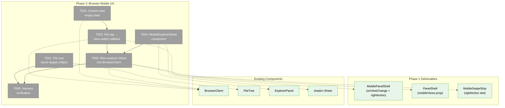
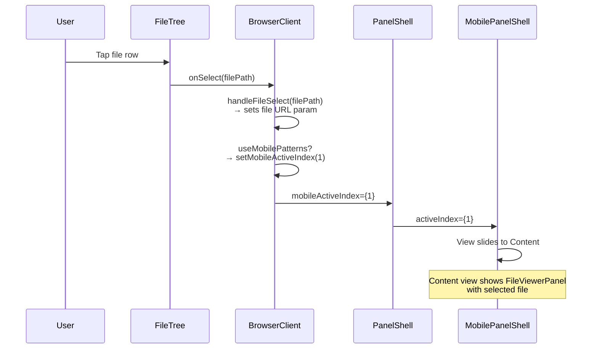
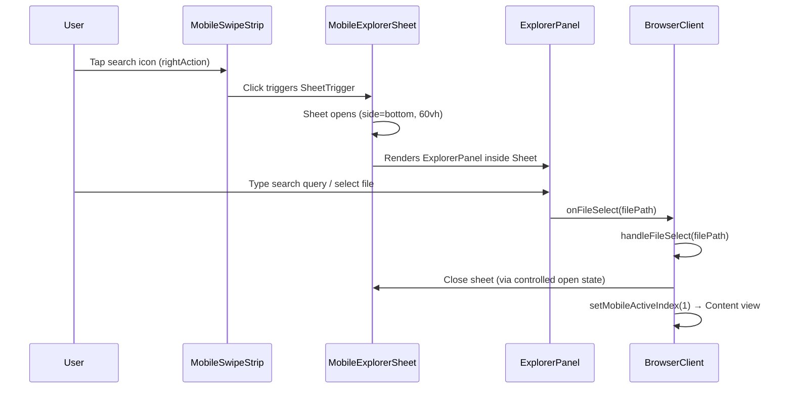

# Phase 3: Browser Mobile UX — Tasks Dossier

**Plan**: [mobile-experience-plan.md](../../mobile-experience-plan.md)
**Phase**: Phase 3: Browser Mobile UX
**Generated**: 2026-04-13
**Domain**: `file-browser`, `_platform/panel-layout`

---

## Executive Briefing

**Purpose**: Make the file browser touch-friendly on phone viewports and wire the explorer bar as a bottom sheet. Phase 1 delivered the swipeable view container, Phase 2 optimized the terminal — now we make the browser page fully usable on a phone. This means bigger touch targets, auto-switching to the Content view when a file is tapped, an empty state when no file is selected, and the ExplorerPanel (search, command palette, path bar) accessible via a search icon → bottom Sheet.

**What We're Building**: Touch-friendly file rows (48px minimum height), a view-switch callback that navigates from Files to Content on file tap, a content empty state component with a "Browse Files" button, and a `MobileExplorerSheet` component that wraps the existing `ExplorerPanel` in a shadcn `Sheet` triggered by a search icon in the swipe strip.

**Goals**:
- ✅ File/folder rows have 48px minimum height on phone (accessible touch targets)
- ✅ Tapping a file auto-switches to Content view (no manual tab tap needed)
- ✅ Tapping a folder expands/navigates normally (unchanged behavior)
- ✅ Content view shows empty state when no file is selected, with "Browse Files" button
- ✅ Explorer bar (search, command palette, path nav) accessible via search icon → bottom Sheet
- ✅ Explorer Sheet auto-closes on file select or command execute

**Non-Goals**:
- ❌ No mobile branching inside BrowserClient (finding 03 — keep mobile concerns at shell/wrapper level)
- ❌ No new URL params for mobile view state (component state only)
- ❌ No mobile code editing (read-only viewer only)
- ❌ No CSS containment optimization — that's Phase 4
- ❌ No documentation — that's Phase 4

---

## Prior Phase Context

### Phase 1: Mobile Panel Shell (✅ Complete)

**A. Deliverables**:
- `mobile-view.tsx` — visibility wrapper with `isActive`/`isTerminal` props
- `mobile-swipe-strip.tsx` — segmented control with `rightAction` slot
- `mobile-panel-shell.tsx` — swipeable container with `onViewChange` callback
- `panel-shell.tsx` — modified with `mobileViews` prop + `useResponsive` branch
- `browser-client.tsx` — passes `mobileViews` with Files + Content views

**B. Dependencies Exported**:
- `MobilePanelShell` — accepts `views: Array<{ label, icon, content }>`, exposes `onViewChange` callback, optional `rightAction` slot
- `MobileSwipeStrip` — accepts `views`, `activeIndex`, `onViewChange`, optional `rightAction` slot (where search icon will go)
- `PanelShellProps.mobileViews` — additive prop, consumer-driven mobile view config
- `MobilePanelShellView` — type for view objects

**C. Gotchas & Debt**:
- `useResponsive` module-level cache can cause stale values in tests — use dynamic imports
- `setPointerCapture` wrapped in try/catch for jsdom compatibility

**D. Incomplete Items**: None.

**E. Patterns to Follow**:
- Components in `apps/web/src/features/<domain>/components/`
- Tests in `test/unit/web/features/<domain>/`
- Use `FakeMatchMedia` + `Object.defineProperty(window, 'innerWidth')` for viewport tests
- TDD test files created before implementation

### Phase 2: Terminal Mobile UX (✅ Complete)

**A. Deliverables**:
- `useKeyboardOpen` hook — `visualViewport`-based keyboard detection
- `TerminalModifierToolbar` — Esc/Tab/Ctrl/Alt/arrows toolbar
- Terminal font size, touch-action, responsive copy modal changes
- Terminal focus on mount

**B. Dependencies Exported**:
- `useKeyboardOpen` — reusable if needed (terminal domain, but extractable)
- Pattern: `useResponsive().useMobilePatterns` for conditional mobile behavior

**C. Gotchas & Debt**: None relevant to Phase 3.

**D. Incomplete Items**: None.

---

## Pre-Implementation Check

| File | Exists? | Domain Check | Notes |
|------|---------|-------------|-------|
| `apps/web/src/features/041-file-browser/components/file-tree.tsx` | ✅ Yes (~750 lines) | ✅ `file-browser` | Modify — add `min-h-12` on mobile for file/folder rows (lines 425, 695) |
| `apps/web/src/features/041-file-browser/components/content-empty-state.tsx` | ❌ Create | ✅ `file-browser` | New: empty state component |
| `apps/web/src/features/_platform/panel-layout/components/mobile-explorer-sheet.tsx` | ❌ Create | ✅ `_platform/panel-layout` | New: Sheet wrapper for ExplorerPanel |
| `apps/web/src/features/_platform/panel-layout/components/mobile-panel-shell.tsx` | ✅ Yes (84 lines) | ✅ `_platform/panel-layout` | Verify — `onViewChange` + `rightAction` already wired from Phase 1 |
| `apps/web/src/features/_platform/panel-layout/components/panel-shell.tsx` | ✅ Yes (58 lines) | ✅ `_platform/panel-layout` | Modify — pass `onViewChange` + `rightAction` through to MobilePanelShell |
| `apps/web/app/(dashboard)/workspaces/[slug]/browser/browser-client.tsx` | ✅ Yes (~1050 lines) | ✅ `file-browser` | Modify — add `onMobileViewChange` callback to mobileViews, wire explorer Sheet, replace inline empty state with component |
| `apps/web/src/features/_platform/panel-layout/index.ts` | ✅ Yes | ✅ `_platform/panel-layout` | Modify — export `MobileExplorerSheet` |
| `apps/web/src/components/ui/sheet.tsx` | ✅ Yes | ✅ shadcn | Confirmed: `SheetContent` supports `side="bottom"` |
| `test/unit/web/features/041-file-browser/content-empty-state.test.tsx` | ❌ Create | ✅ test | New TDD test |
| `test/unit/web/features/_platform/panel-layout/mobile-explorer-sheet.test.tsx` | ❌ Create | ✅ test | New TDD test |

**Concept Search**: No existing `ContentEmptyState` or `MobileExplorerSheet` in codebase. BrowserClient already has an inline `"Select a file to view"` div (line 845) — T003 extracts this into a proper component with a view-switch button. Safe to create.

---

## Architecture Map



---

## Tasks

| Status | ID | Task | Domain | Path(s) | Done When | Notes |
|--------|-----|------|--------|---------|-----------|-------|
| [ ] | T001 | Increase file tree row height on mobile | `file-browser` | `apps/web/src/features/041-file-browser/components/file-tree.tsx` | When `useMobilePatterns` is true, directory rows (line ~425) and file rows (line ~695) have `min-h-12` (48px) class applied. Desktop rows unchanged. Touch targets meet WCAG 2.5.5 (44px minimum). Import `useResponsive` from `@/hooks/useResponsive` at the `FileTree` component level and pass `isMobile` down via context or prop to `TreeEntry`. | **Lightweight**. CSS-config change. Deviation: `py-1` (8px vertical padding) → conditional `min-h-12` class on mobile. Verify via harness screenshot at 375px that rows are visibly taller. Note: `useResponsive` in FileTree is a new import — no circular dependency risk (leaf hook). |
| [ ] | T002 | Wire file-tap to view-switch callback | `file-browser`, `_platform/panel-layout` | `apps/web/app/(dashboard)/workspaces/[slug]/browser/browser-client.tsx`, `apps/web/src/features/_platform/panel-layout/components/panel-shell.tsx`, `apps/web/src/features/_platform/panel-layout/components/mobile-panel-shell.tsx` | When user taps a file on mobile: (1) `handleFileSelect` sets `file` URL param as usual, (2) BrowserClient calls a view-switch callback to navigate to Content view (index 1). Folders continue to expand/navigate normally (unchanged). **Approach**: Add `onMobileViewChange` prop to `PanelShellProps` that PanelShell forwards to `MobilePanelShell`. BrowserClient wraps `handleFileSelect` to also call `onMobileViewChange(1)` when `useMobilePatterns` is true. MobilePanelShell already has `onViewChange` — need to expose a way for external code to SET the active index (currently internal `useState`). **Options**: (A) Make `MobilePanelShell` accept optional `controlledIndex`/`onViewChange` pair (controlled mode), or (B) use `useImperativeHandle` to expose `setActiveIndex`. **Recommended: Option A** — add optional `activeIndex` prop; when provided, MobilePanelShell uses it as the source of truth (controlled mode) and calls `onViewChange` for internal swipe/tap changes. BrowserClient manages the state. | **Lightweight**. Finding 03: NO mobile branching inside BrowserClient body — the callback is wired at the `mobileViews`/`PanelShell` props level, not inside BrowserClient's render tree. The `handleFileSelect` wrapper checks `useMobilePatterns` to decide whether to also call the view-switch. |
| [ ] | T003 | Create Content view empty state | `file-browser` | `apps/web/src/features/041-file-browser/components/content-empty-state.tsx`, `test/unit/web/features/041-file-browser/content-empty-state.test.tsx`, `apps/web/app/(dashboard)/workspaces/[slug]/browser/browser-client.tsx` | When no file is selected on mobile, Content view shows centered empty state with: (1) Lucide `FileText` icon (muted, 48×48), (2) "Select a file" heading text, (3) "Browse Files" button that calls `onBrowseFiles()` → switches to Files view (index 0). Replace the inline `"Select a file to view"` div in BrowserClient's mobile Content view (line ~845) with `<ContentEmptyState onBrowseFiles={() => setActiveViewIndex(0)} />`. Desktop empty state unchanged. | **TDD**. Test: renders icon, heading, button; button calls `onBrowseFiles`; no file viewer rendered. Component is internal to `file-browser` domain — not exported from barrel. |
| [ ] | T004 | Create `MobileExplorerSheet` component | `_platform/panel-layout` | `apps/web/src/features/_platform/panel-layout/components/mobile-explorer-sheet.tsx`, `test/unit/web/features/_platform/panel-layout/mobile-explorer-sheet.test.tsx` | Search icon (`Lucide Search`, `h-4 w-4`) wrapped in `SheetTrigger`; tapping opens shadcn `Sheet` with `side="bottom"` and `className="h-[60vh]"`; `SheetContent` renders children (the `ExplorerPanel` will be passed as children). Sheet auto-closes on file select via `onOpenChange` controlled state — consumer calls `close()` callback. Props: `children: ReactNode`, `onClose?: () => void`, optional `trigger?: ReactNode` for custom trigger. | **TDD**. Workshop 003: search icon → bottom sheet, 60vh, auto-close on file select/command. Test: renders trigger icon, opens sheet on click, renders children inside sheet, calls onClose. Uses shadcn `Sheet` (confirmed: `side="bottom"` supported in `apps/web/src/components/ui/sheet.tsx`). |
| [ ] | T005 | Wire `MobileExplorerSheet` into BrowserClient | `file-browser`, `_platform/panel-layout` | `apps/web/app/(dashboard)/workspaces/[slug]/browser/browser-client.tsx`, `apps/web/src/features/_platform/panel-layout/components/panel-shell.tsx`, `apps/web/src/features/_platform/panel-layout/index.ts` | (1) BrowserClient renders `MobileExplorerSheet` wrapping the existing `ExplorerPanel` (same props as the desktop `explorer` slot — lines 854-899). (2) Pass the sheet as `rightAction` prop on `mobileViews` level — PanelShell forwards to MobilePanelShell → MobileSwipeStrip's `rightAction` slot. (3) When a file is selected inside the sheet (via `ExplorerPanel.onFileSelect`), auto-close the sheet AND switch to Content view. (4) When a command is executed (`onCommandExecute`), auto-close the sheet. (5) Update barrel export to include `MobileExplorerSheet`. (6) Verify path bar, file search, and command palette work inside the sheet. | **Lightweight**. Workshop 003: explorer bar hidden by default, search icon in swipe strip, bottom sheet with ExplorerPanel. The `rightAction` slot on `MobileSwipeStrip` was designed in Phase 1 specifically for this use case. PanelShell currently does NOT forward `rightAction` to MobilePanelShell — add this forwarding. |
| [ ] | T006 | Harness verification — Phase 3 | — | — | Run harness screenshots at mobile viewport (375×812) for browser page; verify: (1) file rows are visibly taller than desktop, (2) content empty state renders with icon and button, (3) search icon visible in swipe strip, (4) tapping search icon opens sheet (if interactive automation available). Desktop screenshots at 1024px confirm zero regression. | **Harness**. Per ADR-0014 harness coverage. Use Playwright CDP if harness is running, otherwise manual verification via dev server at mobile viewport. |

---

## Acceptance Criteria

| AC | Task(s) | Criteria |
|----|---------|----------|
| AC-09 | T001 | File rows ≥48px on mobile (`min-h-12`) |
| AC-10 | T002 | File tap → content view auto-switch (sets file param + switches to Content view) |
| AC-11 | T002 | Folder tap → expand/navigate (unchanged — existing FileTree behavior preserved) |
| AC-12 | T002, T005 | Content view shows selected file viewer (existing FileViewerPanel, no changes) |
| AC-13 | T003 | Empty state when no file selected (icon + text + "Browse Files" button) |
| AC-23 | T004, T005 | Explorer bar hidden by default, accessible via search icon → bottom sheet |

---

## Context Brief

### Key findings from plan

- **Finding 03 (HIGH)**: BrowserClient is ~1050 lines. **Action: keep mobile concerns at the PanelShell/MobilePanelShell wrapper level.** T002 wires the view-switch callback via PanelShell props, not inside BrowserClient's render tree. The only change inside BrowserClient is wrapping `handleFileSelect` to also call `onMobileViewChange` when on mobile.
- **Finding from Phase 1**: `MobileSwipeStrip` already has a `rightAction` slot — designed exactly for the search icon (Phase 3). No new API needed on the strip.
- **Finding from Phase 1**: `MobilePanelShell` manages `activeIndex` internally via `useState` and exposes `onViewChange` callback. For T002 (file-tap view switching), we need external control. Solution: make `activeIndex` optionally controlled (accept prop, use it as source of truth when provided).
- **Finding from Phase 1**: `PanelShell` currently renders `<MobilePanelShell views={mobileViews} />` without forwarding `onViewChange` or `rightAction` — T002 and T005 must add this forwarding.

### Domain dependencies

- `_platform/panel-layout`: `MobilePanelShell` (view switching), `MobileSwipeStrip` (rightAction slot), `PanelShell` (mobileViews forwarding), `ExplorerPanel` (reuse inside Sheet)
- `file-browser`: `FileTree` (touch targets), `BrowserClient` (view-switch callback wiring)
- `shadcn/ui`: `Sheet`, `SheetContent`, `SheetTrigger` — confirmed `side="bottom"` supported
- `lucide-react`: `Search`, `FileText` icons
- `useResponsive` hook — phone detection for conditional mobile styling

### Domain constraints

- `ContentEmptyState` is internal to `file-browser` domain — NOT exported from barrel
- `MobileExplorerSheet` is internal to `_platform/panel-layout` but exported from barrel (used by BrowserClient cross-domain)
- No new external dependencies
- No mobile branching inside BrowserClient's render tree (finding 03)

### Harness context

- **Boot**: `just harness dev` → `just harness doctor --wait`
- **Interact**: Playwright CDP or dev server at mobile viewport
- **Observe**: Screenshots at 375px and 1024px viewports
- **Maturity**: L3

### Reusable from prior phases

- `FakeMatchMedia` — viewport simulation in tests
- `useResponsive` import pattern
- Harness screenshot approach from Phase 1/2
- `MobileSwipeStrip.rightAction` slot — ready for the search icon

### MobilePanelShell controlled mode design

**Current (Phase 1)**: `activeIndex` is internal `useState`. `onViewChange` is a notification callback — consumers can observe but not drive view changes.

**Needed (Phase 3)**: BrowserClient must programmatically switch views (file-tap → Content view, "Browse Files" button → Files view).

**Solution: Optional controlled mode**

```tsx
// MobilePanelShell props (extended)
interface MobilePanelShellProps {
  views: MobilePanelShellView[];
  onViewChange?: (index: number) => void;
  rightAction?: ReactNode;
  /** When provided, MobilePanelShell uses this as source of truth (controlled mode) */
  activeIndex?: number;
}

// Inside MobilePanelShell:
const [internalIndex, setInternalIndex] = useState(0);
const currentIndex = props.activeIndex ?? internalIndex;
// When user swipes/taps, call onViewChange AND setInternalIndex
```

When `activeIndex` is provided (controlled mode), the component uses it directly. When not provided (uncontrolled mode, default), it uses internal state. This is backward-compatible — terminal page (single view, no external control) continues working unchanged.

### PanelShell forwarding additions

PanelShell currently renders:
```tsx
<MobilePanelShell views={mobileViews} />
```

After T002 + T005:
```tsx
<MobilePanelShell
  views={mobileViews}
  onViewChange={onMobileViewChange}
  activeIndex={mobileActiveIndex}
  rightAction={mobileRightAction}
/>
```

New PanelShellProps:
```tsx
interface PanelShellProps {
  // ... existing props ...
  mobileViews?: MobilePanelShellView[];
  /** Called when the mobile view changes (user swipe/tap or programmatic) */
  onMobileViewChange?: (index: number) => void;
  /** Controlled mobile view index — when provided, PanelShell drives MobilePanelShell */
  mobileActiveIndex?: number;
  /** Right action slot for MobileSwipeStrip (e.g. search icon) */
  mobileRightAction?: ReactNode;
}
```

### Mermaid: File-tap view-switch flow



### Mermaid: Explorer Sheet flow



---

## Discoveries & Learnings

_Populated during implementation by plan-6._

| Date | Task | Type | Discovery | Resolution | References |
|------|------|------|-----------|------------|------------|

**Types**: `gotcha` | `research-needed` | `unexpected-behavior` | `workaround` | `decision` | `debt` | `insight`

---

## Directory Layout

```
docs/plans/078-mobile-experience/
  ├── mobile-experience-plan.md
  ├── mobile-experience-spec.md
  ├── exploration.md
  ├── workshops/
  │   ├── 001-mobile-swipeable-panel-experience.md
  │   ├── 002-xterm-mobile-touch-first.md
  │   └── 003-smart-show-hide-mobile-chrome.md
  └── tasks/
      ├── phase-1-mobile-panel-shell/   (✅ complete)
      ├── phase-2-terminal-mobile-ux/   (✅ complete)
      └── phase-3-browser-mobile-ux/
          ├── tasks.md              ← this file
          ├── tasks.fltplan.md      ← flight plan
          └── execution.log.md     # created by plan-6
```
