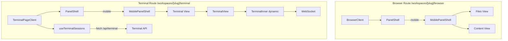
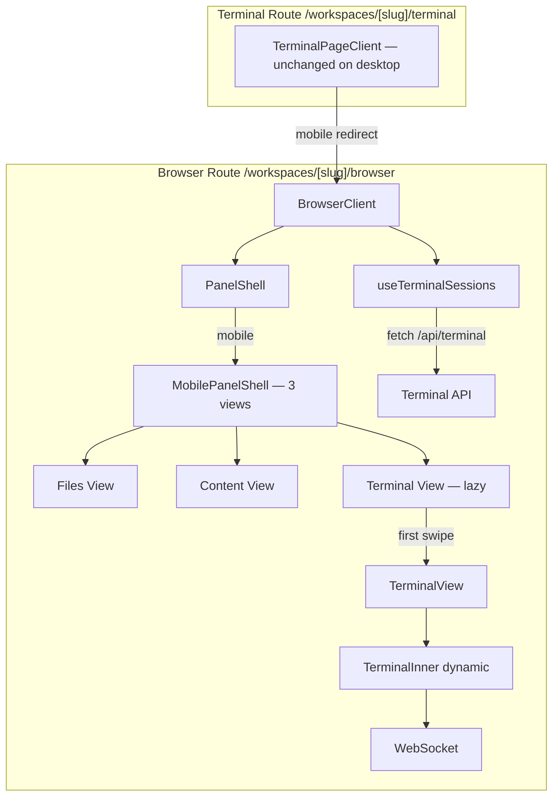
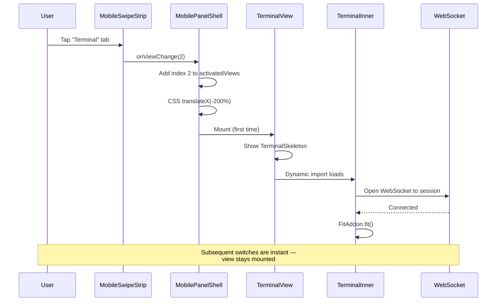

# Workshop: Unified Three-View Mobile Page

**Type**: Architecture / Integration Pattern
**Plan**: 078-mobile-experience
**Spec**: [mobile-experience-spec.md](../mobile-experience-spec.md)
**Created**: 2026-07-20
**Status**: Draft

**Related Documents**:
- [Workshop 001 — Mobile Swipeable Panel Experience](001-mobile-swipeable-panel-experience.md)
- [Workshop 002 — xterm.js Mobile/Touch-First](002-xterm-mobile-touch-first.md)
- [Workshop 003 — Smart Show/Hide Mobile Chrome](003-smart-show-hide-mobile-chrome.md)
- [Mobile Prototype](../../../../scratch/mobile-prototype/index.html) — validated 3-view design
- [Panel Layout Domain](../../../domains/_platform/panel-layout/domain.md)
- [Terminal Domain](../../../domains/terminal/domain.md)

**Domain Context**:
- **Primary Domain**: `_platform/panel-layout` — owns PanelShell, MobilePanelShell, layout composition
- **Related Domains**: `terminal` (TerminalView, session management), `file-browser` (BrowserClient)

---

## Purpose

The validated mobile prototype shows **Files, Content, and Terminal as 3 swipeable views on a single page**. The current implementation splits them across two routes:

- **Browser page** (`/workspaces/[slug]/browser`) — 2 mobile views: Files + Content
- **Terminal page** (`/workspaces/[slug]/terminal`) — 1 mobile view: Terminal

User feedback is clear: **this split is wrong**. All three views belong on one page, matching the prototype. This workshop resolves HOW to unify them — where the terminal lives, how session state is managed, what happens to the terminal route on mobile, and how to avoid performance penalties from eager-mounting xterm.js.

## Key Questions

1. Where does TerminalView render on the browser page?
2. What happens to the terminal route on mobile?
3. What is the final view order?
4. How is terminal session state managed on the browser page?
5. How do we avoid mounting xterm.js + WebSocket until the user swipes to Terminal?

---

## Design Overview

### Current Architecture



### Target Architecture



---

## Question 1 — Where Does Terminal Live on the Browser Page?

### Option A: BrowserClient renders TerminalView as a 3rd mobileView

BrowserClient already owns PanelShell and passes `mobileViews`. Add a third entry with TerminalView content. BrowserClient calls `useTerminalSessions` to get the session name, then passes it to TerminalView.

**Current** (browser-client.tsx line 864):
```tsx
mobileViews={[
  { label: 'Files', icon: <FolderOpen />, content: filesContent },
  { label: 'Content', icon: <FileText />, content: contentView },
]}
```

**Proposed**:
```tsx
mobileViews={[
  { label: 'Files', icon: <FolderOpen />, content: filesContent },
  { label: 'Content', icon: <FileText />, content: contentView },
  { label: 'Terminal', icon: <TerminalSquare />, content: terminalContent, isTerminal: true },
]}
```

**Pros**:
- Minimal architectural change — extends what exists
- MobilePanelShell already handles variable-count views
- Single source of truth for mobile layout on the browser page
- Desktop layout unchanged (mobileViews only rendered on phone)

**Cons**:
- BrowserClient becomes larger (adds terminal concerns)
- Terminal dependencies (useTerminalSessions, TerminalView) imported into browser bundle

### Option B: Shared layout component above both routes

A new `WorkspaceMobileLayout` component in the workspace layout renders all 3 views, wrapping both the browser and terminal routes.

**Pros**:
- Clean separation — neither route knows about the other's content
- Could work with Next.js parallel routes

**Cons**:
- Major architectural change — layout must coordinate with route-rendered content
- Parallel routes in Next.js don't support this "merge into one view" pattern well
- The browser page already has all the state (workspace context, file navigation) — duplicating it in layout is wasteful
- Significantly more complex than Option A

### Option C: Terminal as a portal/slot from layout

The workspace layout provides a React context with a "terminal slot" that any route can render into. The browser page renders it as a 3rd mobile view.

**Pros**:
- Terminal component stays in terminal domain
- Theoretically clean domain boundaries

**Cons**:
- Over-engineered for this use case
- Portal/slot patterns add debugging complexity
- Still needs terminal state (session name) resolved somewhere

### ✅ VERDICT: Option A — BrowserClient renders TerminalView as 3rd mobileView

**Rationale**: The simplest change that matches the prototype. MobilePanelShell already supports N views. BrowserClient already has workspace context (slug, worktreePath, worktreeBranch). Adding `useTerminalSessions` is a single hook call. The terminal import is behind `next/dynamic` (TerminalView uses dynamic import for TerminalInner), so bundle impact is minimal. Desktop layout is completely unchanged — the third view only appears in the `mobileViews` array.

---

## Question 2 — What Happens to the Terminal Route on Mobile?

### Option A: Mobile redirect — terminal route redirects to browser page

On phone viewport, navigating to `/workspaces/[slug]/terminal` redirects to `/workspaces/[slug]/browser` with the Terminal view active (e.g., via a query param `?mobileView=terminal` or a view index).

**Pros**:
- Single canonical mobile page
- No duplicate rendering
- BottomTabBar "Terminal" link goes to the right place

**Cons**:
- Redirect requires detecting viewport on server (unreliable) or client (flash)
- URL param for active view contradicts spec non-goal ("no new URL params for mobile view state")

### Option B: Both routes show all 3 views, different default

Both the browser page and terminal page render Files + Content + Terminal on mobile. Browser defaults to Files (index 0). Terminal defaults to Terminal (index 2).

**Pros**:
- No redirects
- Each route is self-contained
- BottomTabBar links work naturally (terminal link → terminal page → opens at Terminal view)

**Cons**:
- Duplicated 3-view composition in two places
- Two live WebSocket connections if user navigates between routes
- Violates the "single page" prototype intent

### Option C: Browser page gets all 3 views; terminal route remains desktop-only

The terminal route keeps its current single-view mobile layout. On phone, the BottomTabBar "Terminal" link points to the browser page with a hint to open the Terminal view.

**Pros**:
- No changes to terminal route
- Simple

**Cons**:
- Inconsistent — user might land on terminal route from a bookmark and get a degraded experience
- BottomTabBar navigation becomes confusing

### ✅ VERDICT: Option A — Mobile redirect with client-side detection

**Rationale**: The prototype is one page. Mobile users should never see a separate terminal page. Use client-side detection in TerminalPageClient: if `useMobilePatterns` is true, redirect to the browser page. No URL param needed for the active view — the view index is component state. The redirect is lightweight (one render cycle) and the flash is acceptable since the terminal page already shows a loading skeleton.

**Implementation sketch**:
```tsx
// Split TerminalPageClient into gate + client to avoid mounting hooks during redirect.
// TerminalMobileGate checks viewport FIRST — no other hooks before the guard.

function TerminalMobileGate(props: TerminalPageClientProps) {
  const { useMobilePatterns } = useResponsive();
  const router = useRouter();

  useEffect(() => {
    if (useMobilePatterns) {
      router.replace(`/workspaces/${props.slug}/browser?worktree=${encodeURIComponent(props.worktreePath)}&mobileView=2`);
    }
  }, [useMobilePatterns, props.slug, props.worktreePath, router]);

  if (useMobilePatterns) return <TerminalSkeleton />; // Show skeleton during redirect

  return <TerminalPageClient {...props} />;
}

// TerminalPageClient keeps all its hooks (useTerminalSessions, etc.)
// but only mounts on desktop — the gate prevents mobile rendering.
```

**BottomTabBar update**: On mobile, the "Terminal" tab should navigate to the browser page (or trigger a view switch if already there). This is a follow-up task — for now the redirect handles it.

---

## Question 3 — View Order

### The Conflict

| Source | Order |
|--------|-------|
| Workshop 001 (early design) | Terminal → Content → Files |
| Spec (post-prototype validation) | Files → Content → Terminal |
| Prototype HTML (initial build) | Files → Content → Terminal |
| User confirmation | Files → Content → Terminal |

### ✅ RESOLVED: Files → Content → Terminal (indices 0 → 1 → 2)

The spec and user feedback override Workshop 001. The prototype was validated on a physical device with this order. Rationale from spec: "Prototype validated on physical device — order confirmed as Files → Content → Terminal."

```
┌──────┐  ┌─────────┐  ┌──────────┐
│ Files │→ │ Content │→ │ Terminal │
│  (0)  │  │   (1)   │  │   (2)    │
└──────┘  └─────────┘  └──────────┘
  Default    Center       Right-most
```

**Default active view**: Files (index 0) when arriving on the browser page. Users swipe right to reach Content, then Terminal.

---

## Question 4 — Terminal Session Management on Browser Page

### Current State

`TerminalPageClient` uses `useTerminalSessions` which:
1. Fetches `/api/terminal` to list tmux sessions
2. Auto-selects the session matching `currentBranch` (the worktree branch)
3. Falls back to the first available session
4. Provides `selectedSession` (string name) to `TerminalView`

### Design for Browser Page

BrowserClient already has `worktreeBranch` as a prop. The same `useTerminalSessions` hook can be called with `{ currentBranch: sanitizeSessionName(worktreeBranch ?? '') }`. `sanitizeSessionName` is required — raw `worktreeBranch` may contain characters (e.g., `/`, `.`) that are invalid in tmux session names. The terminal page's server component already applies this sanitization; BrowserClient must do the same. Since auto-selection is built in, TerminalView will connect to the right session automatically.

**Key decision**: The session list panel (TerminalSessionList) is NOT needed on mobile. The spec clarifies: "Terminal page no longer has a session list panel on desktop. tmux sessions are managed via tmux itself." On mobile, the terminal view auto-connects to the worktree's session — no UI for session switching.

### Implementation

```tsx
// In BrowserClientInner, alongside existing hooks:
const { selectedSession: terminalSession, loading: terminalLoading } = useTerminalSessions({
  currentBranch: sanitizeSessionName(worktreeBranch ?? ''),
});

// Terminal content for the 3rd mobile view:
const terminalContent = (
  <MainPanel>
    {terminalSession ? (
      <TerminalView
        sessionName={terminalSession}
        cwd={worktreePath}
        themeOverride={terminalTheme}
      />
    ) : (
      <div className="flex h-full items-center justify-center text-sm text-muted-foreground">
        {terminalLoading ? 'Connecting…' : 'No terminal session available'}
      </div>
    )}
  </MainPanel>
);
```

**Edge case — no tmux**: If tmux is not available (e.g., container without tmux), `useTerminalSessions` returns `tmuxAvailable: false`. The terminal view shows a helpful message. This is acceptable — the user sees 2 working views + 1 graceful fallback.

---

## Question 5 — Lazy Mounting for Performance

### The Problem

TerminalView uses `next/dynamic` to load TerminalInner (xterm.js + WebSocket). If all 3 views mount eagerly:
- xterm.js initializes its canvas renderer (GPU memory)
- A WebSocket opens to the terminal backend
- FitAddon computes dimensions

This happens even if the user never swipes to the Terminal view.

### Option A: Eager mount (current behavior for off-screen views)

MobilePanelShell keeps all views mounted with `visibility: hidden`. TerminalView mounts immediately.

**Pros**:
- Instant switch — no loading delay when user swipes to Terminal
- Simpler implementation
- WebSocket stays connected (no reconnection delay)

**Cons**:
- Wastes resources on low-end phones if terminal is never used
- xterm.js canvas renderer allocates GPU memory even when hidden

### Option B: Lazy mount — only mount Terminal on first swipe

Add a `hasBeenActive` tracking mechanism. The Terminal view content is `null` until the user swipes to it for the first time. Once activated, it stays mounted (preserving the WebSocket and scroll position).

**Pros**:
- Zero cost for users who only use Files + Content
- Aligns with spec assumption: "Users on phone are checking status or running quick commands"

**Cons**:
- First swipe to Terminal has a brief loading delay (TerminalSkeleton shows)
- Slightly more complex state in MobilePanelShell

### Option C: Lazy mount with prefetch

Same as B, but prefetch TerminalInner's JS chunk when the browser page loads (via `next/dynamic` preload). First mount still deferred, but the code is already downloaded.

**Pros**:
- Combines resource savings with fast first activation
- Dynamic import chunk downloads during idle time

**Cons**:
- Marginal benefit over Option B (the dynamic import is small)
- Prefetch timing is not guaranteed

### ✅ VERDICT: Option B — Lazy mount on first swipe, then stay mounted

**Rationale**: The spec says mobile users are doing quick tasks. Many sessions won't involve the terminal at all. The TerminalSkeleton provides acceptable feedback during the brief mount. Once mounted, the view stays alive (WebSocket connected, scroll preserved).

### Implementation

Add lazy-mount tracking to MobilePanelShell:

```tsx
// In MobilePanelShell:
const [activatedViews, setActivatedViews] = useState<Set<number>>(new Set([0])); // Index 0 pre-activated

const handleViewChange = useCallback((index: number) => {
  setActiveIndex(index);
  setActivatedViews(prev => {
    if (prev.has(index)) return prev;
    const next = new Set(prev);
    next.add(index);
    return next;
  });
  onViewChange?.(index);
}, [onViewChange]);

// In the render:
{views.map((view, index) => (
  <MobileView key={view.label} isActive={index === activeIndex} isTerminal={view.isTerminal}>
    {activatedViews.has(index) ? view.content : null}
  </MobileView>
))}
```

**Opt-in per view**: Not all views need lazy mounting. Files and Content should mount eagerly (they're lightweight). Only Terminal benefits. We can add a `lazy?: boolean` flag to `MobilePanelShellView`:

```tsx
export interface MobilePanelShellView {
  label: string;
  icon: ReactNode;
  content: ReactNode;
  isTerminal?: boolean;
  lazy?: boolean; // If true, content mounts only on first activation
}
```

Additionally, `MobilePanelShellProps` gains `initialActiveIndex?: number` — used as the initial value for `useState` (not controlled mode). This solves the redirect-to-terminal-tab problem: when `/terminal` redirects to `/browser?mobileView=2`, BrowserClient reads the param and passes `initialActiveIndex={2}` so the user lands on the Terminal tab, not Files.

Non-lazy views mount immediately; lazy views wait for first swipe. This keeps the generic MobilePanelShell reusable.

---

## Summary of Resolved Decisions

| # | Question | Decision |
|---|----------|----------|
| 1 | Where does terminal live? | BrowserClient renders TerminalView as 3rd mobileView |
| 2 | Terminal route on mobile? | Client-side redirect to browser page |
| 3 | View order? | Files (0) → Content (1) → Terminal (2) |
| 4 | Terminal session management? | `useTerminalSessions` in BrowserClient, auto-select worktree session |
| 5 | Lazy mounting? | Lazy mount terminal on first swipe via `lazy` flag on MobilePanelShellView |

---

## Implementation Sketch

### Files Changed

| File | Change |
|------|--------|
| `apps/web/app/(dashboard)/workspaces/[slug]/browser/browser-client.tsx` | Add `useTerminalSessions`, add 3rd mobileView with TerminalView |
| `apps/web/src/features/_platform/panel-layout/components/mobile-panel-shell.tsx` | Add `lazy` flag to `MobilePanelShellView`, track activated views |
| `apps/web/src/features/064-terminal/components/terminal-page-client.tsx` | Add mobile redirect to browser page |
| `apps/web/src/features/_platform/panel-layout/components/mobile-panel-shell.test.tsx` | Tests for lazy mount behavior |

### New Imports in BrowserClient

```tsx
import { TerminalSquare } from 'lucide-react';
import { TerminalView } from '@/features/064-terminal/components/terminal-view';
import { useTerminalSessions } from '@/features/064-terminal/hooks/use-terminal-sessions';
import { sanitizeSessionName } from '@/features/064-terminal/lib/sanitize-session-name';
```

### Sequence: User Swipes to Terminal



### MobilePanelShell Diff (Conceptual)

```diff
 export interface MobilePanelShellView {
   label: string;
   icon: ReactNode;
   content: ReactNode;
   isTerminal?: boolean;
+  lazy?: boolean;
 }

+export interface MobilePanelShellProps {
+  views: MobilePanelShellView[];
+  onViewChange?: (index: number) => void;
+  rightAction?: ReactNode;
+  initialActiveIndex?: number; // Initial view index (not controlled mode)
+}

-export function MobilePanelShell({ views, onViewChange, rightAction }: MobilePanelShellProps) {
-   const [activeIndex, setActiveIndex] = useState(0);
+export function MobilePanelShell({ views, onViewChange, rightAction, initialActiveIndex }: MobilePanelShellProps) {
+   const [activeIndex, setActiveIndex] = useState(initialActiveIndex ?? 0);
+  const [activatedViews, setActivatedViews] = useState<Set<number>>(() => {
+    // Eagerly activate all non-lazy views + initialActiveIndex
+    const initial = new Set<number>();
+    views.forEach((v, i) => { if (!v.lazy) initial.add(i); });
+    if (initialActiveIndex !== undefined) initial.add(initialActiveIndex);
+    return initial;
+  });

   const handleViewChange = useCallback(
     (index: number) => {
       setActiveIndex(index);
+      setActivatedViews(prev => {
+        if (prev.has(index)) return prev;
+        const next = new Set(prev);
+        next.add(index);
+        return next;
+      });
       onViewChange?.(index);
     },
     [onViewChange]
   );

   // ... render
   {views.map((view, index) => (
     <MobileView key={view.label} isActive={index === activeIndex} isTerminal={view.isTerminal}>
-      {view.content}
+      {activatedViews.has(index) ? view.content : null}
     </MobileView>
   ))}
```

> **⚠️ Lazy init bug warning**: Do NOT use `views.filter(v => !v.lazy).map((_, i) => i)` — the `.filter()` reindexes after removing elements, producing wrong indices. Use `views.forEach((v, i) => { if (!v.lazy) initial.add(i); })` instead.

---

## Open Items for Implementation

1. ~~**BottomTabBar "Terminal" link on mobile**~~ — **RESOLVED (FX002-4c)**: On mobile, Terminal nav item navigates to `/browser?...&mobileView=2` instead of `/terminal`. This avoids the redirect hop. Desktop sidebar unchanged.

2. **Terminal theme on browser page** — TerminalPageClient reads `terminalTheme` from `useWorkspaceContext()`. BrowserClient already has workspace context, so this is straightforward — use the same pattern.

3. ~~**Focus management**~~ — **RESOLVED (FX002-3b)**: TerminalView gets `isActive?: boolean` prop, passes it as `isVisible` to TerminalInner. BrowserClient tracks `activeIndex` via MobilePanelShell's `onViewChange` callback and passes `isActive={activeIndex === 2}` to TerminalView. This ensures xterm.js refocuses when the user swipes back to the Terminal tab.

4. **Testing** — Lazy mount behavior should be unit-tested: verify non-lazy views mount immediately, lazy views mount only after activation, activated views stay mounted on subsequent switches. Also test `initialActiveIndex` sets starting view correctly.

5. **Redirect hook ordering (FX002-3)** — TerminalPageClient currently calls `useTerminalSessions` before checking viewport. Must split into `TerminalMobileGate` (checks viewport first, redirects) + `TerminalPageClient` (mounts hooks only on desktop). This avoids mounting WebSocket/session-fetch during the brief redirect.

---

## Relationship to Spec ACs

This workshop updates the following acceptance criteria from the spec:

| AC | Current | After This Workshop |
|----|---------|-------------------|
| AC-03 | Browser page shows 2 views (Files + Content) | Browser page shows 3 views (Files + Content + Terminal) |
| AC-04 | Terminal page shows 1 view (Terminal) | Terminal page redirects to browser page on mobile |
| AC-07 | Off-screen views remain mounted | Off-screen lazy views mount on first activation, then stay mounted |

AC-03 and AC-04 need spec updates to reflect the unified 3-view design. The implementation phase should update the spec as part of the PR.
