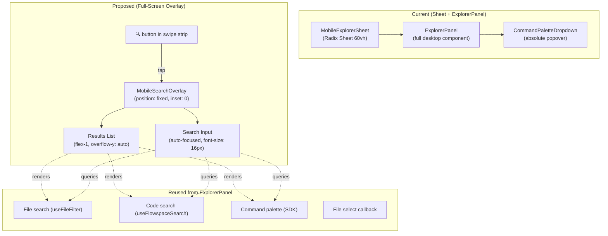

# Workshop: Mobile Explorer Search Overlay

**Type**: UX Flow
**Plan**: 078-mobile-experience
**Spec**: [mobile-experience-spec.md](../mobile-experience-spec.md)
**Created**: 2026-04-15
**Status**: Draft

**Related Documents**:
- [Workshop 003: Smart Show/Hide Mobile Chrome](001-mobile-swipeable-panel-experience.md)
- [MobileExplorerSheet (current)](../../../../apps/web/src/features/_platform/panel-layout/components/mobile-explorer-sheet.tsx)
- [ExplorerPanel](../../../../apps/web/src/features/_platform/panel-layout/components/explorer-panel.tsx)
- [CommandPaletteDropdown](../../../../apps/web/src/features/_platform/panel-layout/components/command-palette-dropdown.tsx)

**Domain Context**:
- **Primary Domain**: `_platform/panel-layout`
- **Related Domains**: `file-browser` (BrowserClient wiring)

---

## Purpose

The current MobileExplorerSheet renders ExplorerPanel inside a bottom Sheet (60vh). This has three critical problems on iOS:

1. **Keyboard doesn't open** — the input is inside a Radix Dialog portal; iOS Safari doesn't auto-focus inputs in portals reliably
2. **Dropdown renders under the input** as an `absolute` popover — on mobile this gets clipped by the Sheet boundaries or renders off-screen
3. **Space is cramped** — 60vh Sheet minus keyboard leaves almost no room for results

This workshop designs a **full-screen search overlay** that replaces the current view, with the input pinned to the top and results filling the remaining screen. Matches the iOS Spotlight / VS Code mobile pattern.

## Key Questions Addressed

- How should the overlay enter/exit? (Animation, trigger, dismissal)
- How does the input get focus and trigger the iOS keyboard?
- How do search results render without the dropdown popover pattern?
- How does this coexist with ExplorerPanel's existing logic (modes, handlers)?

---

## Current State (Problems)

```
┌─────────────────────────────┐
│ Files  Content  Terminal  🔍│  ← Swipe strip
├─────────────────────────────┤
│                             │
│  (file tree fills screen)   │
│                             │
│                             │
├─────────────────────────────┤  ← Sheet slides up from here
│ ┌─────────────────────────┐ │
│ │ 📋 [input field     ] → │ │  ← ExplorerPanel inside Sheet
│ │ ┌───────────────────┐   │ │
│ │ │ dropdown results  │   │ │  ← absolute positioned, clipped
│ │ │ (often empty)     │   │ │
│ │ └───────────────────┘   │ │
│ │ PR Notes Log Terminal   │ │  ← action buttons (irrelevant on mobile)
│ └─────────────────────────┘ │
├─────────────────────────────┤
│ [iOS keyboard]              │  ← often doesn't appear
└─────────────────────────────┘
```

**Issues**:
- Input inside Radix portal → iOS won't auto-focus → no keyboard
- `absolute top-full` dropdown → clipped by `h-[60vh]` Sheet + `overflow` boundaries
- 60vh minus keyboard ≈ 100px for results
- ExplorerPanel renders desktop action buttons (PR, Notes, Log, Terminal) — useless on mobile
- `onBlur` on input closes editing mode → tapping results blurs → results disappear

## Proposed Design: Full-Screen Search Overlay

```
┌─────────────────────────────┐
│ ✕  Search files or > cmds  │  ← Fixed header: close + input (auto-focused)
├─────────────────────────────┤
│                             │
│  README.md                  │  ← Results fill remaining space
│  package.json               │     (scrollable list, same rendering
│  apps/web/src/...           │      as CommandPaletteDropdown)
│  docs/plans/078-...         │
│                             │
│                             │
│                             │
│                             │
├─────────────────────────────┤
│ [iOS keyboard]              │  ← Keyboard appears reliably
└─────────────────────────────┘
```

### Architecture



### Key Design Decisions

#### 1. Full-screen fixed overlay, NOT a Sheet

```
position: fixed;
inset: 0;
z-index: 50;
background: var(--background);
display: flex;
flex-direction: column;
```

**Why not Sheet?**
- Radix Sheet renders in a portal — iOS Safari doesn't auto-focus inputs inside portals
- Sheet has max-height constraints that fight with keyboard
- Sheet's overlay/backdrop blocks touch events we need for results scrolling
- We don't need Sheet's close-on-backdrop feature — we have an explicit ✕ button

**Why fixed overlay?**
- `position: fixed inset-0` creates a true full-screen layer
- Input is a direct child of the overlay, not in a portal — iOS focuses it reliably
- No height constraints — results fill whatever space remains above keyboard
- Simple enter/exit: render or don't render (no animation state machine needed)

#### 2. Input auto-focus with 16px font

```tsx
<input
  ref={inputRef}
  type="text"
  autoFocus
  style={{ fontSize: '16px' }}  // prevents iOS auto-zoom
  enterKeyHint="search"
  placeholder="Search files or > for commands..."
/>
```

- `autoFocus` + `requestAnimationFrame(() => inputRef.current?.focus())` for iOS reliability
- `fontSize: 16px` — below 16px, iOS Safari auto-zooms the viewport on focus
- `enterKeyHint="search"` — iOS keyboard shows "Search" button

#### 3. Results render inline (not as absolute dropdown)

The current `CommandPaletteDropdown` uses `absolute left-0 right-0 top-full` — designed for a desktop dropdown below the input bar. On mobile we render results as a normal flow element:

```tsx
<div className="flex-1 overflow-y-auto">
  {/* Same result rendering logic as CommandPaletteDropdown */}
  {mode === 'search' && fileSearchResults?.map(result => (
    <SearchResultRow ... />
  ))}
  {mode === 'commands' && commands.map(cmd => (
    <CommandRow ... />
  ))}
  {/* etc. */}
</div>
```

**Strategy**: Extract result rendering from `CommandPaletteDropdown` into a shared `SearchResults` component, or duplicate the simple JSX (it's mostly `map` + `<div>` rows).

#### 4. Mode detection from input prefix (same as ExplorerPanel)

| Prefix | Mode | Results |
|--------|------|---------|
| (none) | File search | Fuzzy file name matches |
| `>` | Command palette | SDK commands |
| `#` | Symbol search | grep/FlowSpace |
| `$` | Semantic search | FlowSpace embeddings |

Same prefix system as desktop. No changes needed to the mode logic — just the rendering container changes from popover to inline list.

#### 5. Dismissal

| Action | Result |
|--------|--------|
| Tap ✕ button | Close overlay |
| Select a file result | Close overlay + navigate to file + switch to Content view |
| Execute a command | Close overlay |
| Select a code search result | Close overlay + navigate + switch to Content view |
| Hardware back (Android) | Close overlay |
| Swipe-right gesture | Not implemented V1 (keep it simple) |

#### 6. Component structure

```tsx
interface MobileSearchOverlayProps {
  open: boolean;
  onClose: () => void;
  // Pass through the same search/command props as ExplorerPanel
  onFileSelect: (path: string) => void;
  onCodeSearchSelect: (path: string, line: number) => void;
  onCommandExecute: (cmdId: string) => void;
  // Search state from parent hooks
  fileSearchResults: FileSearchEntry[] | null;
  fileSearchLoading: boolean;
  onSearchQueryChange: (query: string) => void;
  codeSearchResults: CodeSearchResult[] | null;
  codeSearchLoading: boolean;
  onFlowspaceQueryChange: (query: string, mode: string) => void;
  // SDK for commands
  sdk?: IUSDK;
  mru?: MruTracker;
}
```

### Wireframe: States

#### Empty state (just opened)
```
┌─────────────────────────────┐
│ ✕  [                     ] │
├─────────────────────────────┤
│                             │
│     🔍                      │
│     Type to search files    │
│     > for commands          │
│     # for symbols           │
│                             │
├─────────────────────────────┤
│ [keyboard]                  │
└─────────────────────────────┘
```

#### File search results
```
┌─────────────────────────────┐
│ ✕  [package.j             ] │
├─────────────────────────────┤
│  📄 package.json        ./  │
│  📄 package.json  apps/web  │
│  📄 package.json  apps/cli  │
│  📄 pnpm-lock.yaml      ./ │
│                             │
├─────────────────────────────┤
│ [keyboard]                  │
└─────────────────────────────┘
```

#### Command palette (> prefix)
```
┌─────────────────────────────┐
│ ✕  [> theme               ] │
├─────────────────────────────┤
│  ⚡ Toggle Dark Mode        │
│  ⚡ Set Terminal Theme      │
│  ⚡ Reset Layout            │
│                             │
├─────────────────────────────┤
│ [keyboard]                  │
└─────────────────────────────┘
```

## Implementation Approach

### Option A: New `MobileSearchOverlay` component (Recommended)

Create a new component that:
1. Renders `position: fixed inset-0` when `open` is true
2. Has its own input with auto-focus
3. Renders results inline using extracted/shared result row components
4. Manages its own mode detection (same prefix logic)
5. Calls parent callbacks on selection

**Pros**: Clean separation, no modification to ExplorerPanel, mobile-optimized from ground up
**Cons**: Some result rendering duplication with CommandPaletteDropdown

### Option B: Modify ExplorerPanel with mobile mode

Add a `mobile?: boolean` prop to ExplorerPanel that changes:
- Container from `relative border-b` to `fixed inset-0`
- Dropdown from `absolute top-full` to `flex-1 overflow-y-auto`
- Hides desktop action buttons (PR, Notes, Log, Terminal)

**Pros**: Reuses all existing logic, no duplication
**Cons**: Adds complexity to already-541-line component, harder to reason about

### Recommendation: Option A

ExplorerPanel is already complex (541 lines, 35 props). Adding mobile branching violates Finding 03 (keep mobile concerns out of complex components). A dedicated `MobileSearchOverlay` is ~150 lines, single-purpose, testable.

The search hooks (`useFileFilter`, `useFlowspaceSearch`, `useGitGrepSearch`) live in BrowserClient — they pass results as props. `MobileSearchOverlay` receives the same props. No hook duplication.

## Wiring in BrowserClient

```tsx
// Replace MobileExplorerSheet with MobileSearchOverlay
const [searchOpen, setSearchOpen] = useState(false);

// In mobileRightAction:
mobileRightAction={
  <button onClick={() => setSearchOpen(true)} aria-label="Search">
    <Search className="h-4 w-4" />
  </button>
}

// Render overlay (outside PanelShell, sibling to the h-full wrapper):
{searchOpen && (
  <MobileSearchOverlay
    onClose={() => setSearchOpen(false)}
    onFileSelect={(path) => {
      handleFileSelect(path);
      setSearchOpen(false);
    }}
    onCodeSearchSelect={(path, line) => {
      setParams({ file: path, line, mode: 'edit' });
      setSearchOpen(false);
      setMobileActiveIndex(1);
    }}
    onCommandExecute={(cmdId) => {
      recordExecution(cmdId);
      setSearchOpen(false);
    }}
    fileSearchResults={fileFilter.results}
    fileSearchLoading={fileFilter.loading}
    onSearchQueryChange={fileFilter.setQuery}
    codeSearchResults={...}
    codeSearchLoading={...}
    onFlowspaceQueryChange={...}
    sdk={sdk}
    mru={mru}
  />
)}
```

## Open Questions

### Q1: Should we animate the overlay in/out?

**RESOLVED**: No animation for V1. Instant show/hide. Keeps it simple and avoids iOS keyboard animation conflicts. Can add slide-up animation later.

### Q2: What about the desktop ExplorerPanel in the `explorer` slot?

**RESOLVED**: On mobile, the `explorer` slot is never rendered (MobilePanelShell doesn't render it). The MobileSearchOverlay replaces MobileExplorerSheet entirely. Desktop is unchanged.

### Q3: Should keyboard arrow navigation work on results?

**OPEN**: Desktop CommandPaletteDropdown supports arrow key navigation through results. On mobile, users tap results directly. Skip keyboard navigation V1, add if requested.

### Q4: What about the PR/Notes/Log/Terminal action buttons?

**RESOLVED**: Not shown in mobile search overlay. These are desktop-only features with their own mobile access points (BottomTabBar, overlays).

## Files Changed (Estimated)

| File | Change |
|------|--------|
| `mobile-search-overlay.tsx` | **Create** — new full-screen overlay component |
| `mobile-search-overlay.test.tsx` | **Create** — TDD tests |
| `mobile-explorer-sheet.tsx` | **Delete** — replaced by overlay |
| `mobile-explorer-sheet.test.tsx` | **Delete** — replaced |
| `browser-client.tsx` | **Modify** — swap Sheet for Overlay, adjust wiring |
| `panel-layout/index.ts` | **Modify** — swap export |

---

## Navigation

- **Plan**: [mobile-experience-plan.md](../mobile-experience-plan.md)
- **Spec**: [mobile-experience-spec.md](../mobile-experience-spec.md)
- **Workshop 001**: [Mobile Swipeable Panel](001-mobile-swipeable-panel-experience.md)
- **Workshop 003**: [Smart Show/Hide](003-smart-show-hide-mobile-chrome.md)
