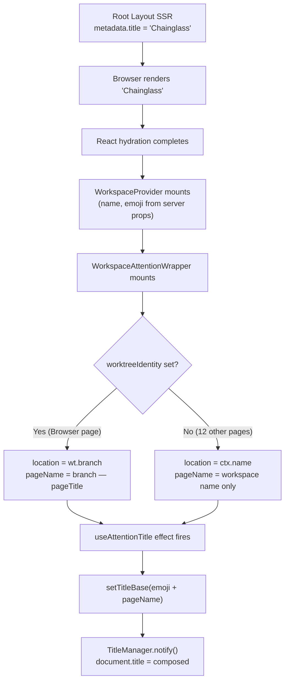

# Research Report: Window Titles Reverting to "Chainglass"

**Generated**: 2026-04-08T10:05:00Z
**Research Query**: "sometimes after restart the titles in windows revert to 'Chainglass' instead of the icon and worktree name"
**Mode**: Pre-Plan
**Location**: docs/plans/079-window-title-revert/research-dossier.md
**FlowSpace**: Available
**Findings**: 56 (synthesized from 8 subagents)

## Executive Summary

### What It Does
Browser tab titles are composed client-side via a singleton `TitleManager` that receives base titles (emoji + branch/workspace name) from `WorkspaceAttentionWrapper` and stackable prefixes from features like Question Popper. The root layout SSR metadata hardcodes `title: 'Chainglass'` as the fallback.

### Business Purpose
Tab titles help users identify workspaces/worktrees across multiple open tabs. The expected format is `{emoji} {branch} — {page}` (e.g., "🔧 077-random-enhancements-2 — Browser").

### Key Insights
1. **Only BrowserClient sets worktreeIdentity** — all other 12 workspace pages (terminal, workflows, agents, settings, etc.) leave it null, so the title shows only workspace name, not branch/worktree
2. **Title is SSR'd as "Chainglass"** and only updated after client-side hydration via useEffect — no `generateMetadata()` in workspace layouts
3. **BrowserClient clears identity on unmount** (`setWorktreeIdentity(null)`), so navigating away from browser loses branch info
4. **TitleManager is an in-memory singleton** — all state lost on page reload until effects re-run

### Quick Stats
- **Title chain**: 4 files, 3 hooks
- **Pages that set identity**: 1 of 13 (BrowserClient only)
- **Test coverage**: Indirect via use-attention-title tests; no reload/revert tests
- **Prior learnings**: 10 relevant from Plans 041, 064, 065, 075, 078

## How It Currently Works

### Title Data Flow



### Entry Points

| Entry Point | Type | Location | Purpose |
|------------|------|----------|---------|
| Root metadata | SSR | `app/layout.tsx:19-27` | Fallback `title: 'Chainglass'` |
| WorkspaceAttentionWrapper | Client effect | `workspace-attention-wrapper.tsx:16-31` | Composes emoji + branch/name |
| useAttentionTitle | Hook | `use-attention-title.ts:25-44` | Calls TitleManager.setTitleBase |
| TitleManager | Singleton | `title-manager.ts:37-44` | Writes `document.title` |
| BrowserClient | Client effect | `browser-client.tsx:362-376` | Only page that sets worktreeIdentity |

### Core Execution Flow

1. **SSR Phase**: Root layout exports `metadata.title = 'Chainglass'`. No workspace sub-layout has `generateMetadata()`. Browser shows "Chainglass".

2. **Hydration Phase**: React hydrates. `WorkspaceProvider` receives server props (name, emoji, color). `WorkspaceAttentionWrapper` renders.

3. **Effect Phase**: `useAttentionTitle` fires in `useEffect`:
   ```ts
   // workspace-attention-wrapper.tsx:20-22
   const resolvedEmoji = wt?.emoji || ctx?.emoji || '';
   const location = wt?.branch || ctx?.name || '';
   const pageName = wt?.pageTitle ? `${location} — ${wt.pageTitle}` : location;
   ```
   If `wt` (worktreeIdentity) is null → uses workspace name only.
   If `wt` is set → uses branch name + page title.

4. **Identity Phase (Browser only)**: BrowserClient's useEffect calls:
   ```ts
   // browser-client.tsx:369-375
   wsCtx?.setWorktreeIdentity({
     worktreePath,
     branch: worktreeBranch,
     pageTitle: 'Browser',
   });
   return () => wsCtx?.setWorktreeIdentity(null);  // ← clears on unmount!
   ```

### Pages That Set worktreeIdentity

| Page | Sets Identity? | Title Result |
|------|---------------|-------------|
| `/browser` | ✅ Yes | `{emoji} {branch} — Browser` |
| `/terminal` | ❌ No | `{emoji} {workspaceName}` |
| `/workflows` | ❌ No | `{emoji} {workspaceName}` |
| `/workflows/[slug]` | ❌ No | `{emoji} {workspaceName}` |
| `/agents` | ❌ No | `{emoji} {workspaceName}` |
| `/agents/[id]` | ❌ No | `{emoji} {workspaceName}` |
| `/settings` | ❌ No | `{emoji} {workspaceName}` |
| `/work-units` | ❌ No | `{emoji} {workspaceName}` |
| `/work-units/[slug]` | ❌ No | `{emoji} {workspaceName}` |
| `/worktree` | ❌ No | `{emoji} {workspaceName}` |
| `/new-worktree` | ❌ No | `{emoji} {workspaceName}` |
| `/samples` | ❌ No | `{emoji} {workspaceName}` |
| `/` (workspace root) | ❌ No | `{emoji} {workspaceName}` |

## Root Cause Analysis

### Why "Chainglass" appears after restart

**Primary cause**: The title "Chainglass" is the SSR metadata title from root layout. It persists until client effects run. The gap between SSR render and effect execution is the "Chainglass" window.

**Timeline on page reload**:
```
t=0ms    SSR HTML: <title>Chainglass</title>
t=0-50ms React hydration begins
t=50ms   WorkspaceProvider renders (ctx available)
t=50ms   WorkspaceAttentionWrapper renders
t=~80ms  useAttentionTitle useEffect fires
t=~80ms  setTitleBase() → document.title updates
```

**Why "sometimes"**: 
- On fast hydration, the "Chainglass" flash is imperceptible
- On slow hydration (large component trees, many providers), it's visible
- If the page is NOT `/browser`, worktreeIdentity stays null and the title is weaker (workspace name only, not branch)
- If the workspace has no emoji set, the title could appear as just the workspace name with no icon

### Secondary Issue: Most pages show weak titles

Even after hydration, 12 of 13 workspace pages show only `{emoji} {workspaceName}` instead of `{emoji} {branch} — {pageName}`. This is because only BrowserClient calls `setWorktreeIdentity()`.

## Architecture & Design

### Component Map

```
app/layout.tsx                          → metadata.title = 'Chainglass' (SSR fallback)
  └─ app/(dashboard)/workspaces/[slug]/
       layout.tsx                       → WorkspaceProvider(name, emoji, ...)
         └─ workspace-attention-wrapper → useAttentionTitle(emoji, pageName)
              └─ use-attention-title.ts → setTitleBase(base)
                   └─ title-manager.ts  → document.title = composed
```

### Design Patterns

1. **Singleton store pattern**: TitleManager is a module-level singleton with subscribers (like a mini-zustand)
2. **Composable prefixes**: Multiple features can stack prefixes (❗ attention, ❓ questions) on top of the base title
3. **Provider → Identity → Hook chain**: Server data → context → client hook → DOM mutation
4. **Cleanup on unmount**: BrowserClient clears identity, causing title to degrade when navigating away

## Dependencies & Integration

### What Title System Depends On

| Dependency | Type | Purpose |
|------------|------|---------|
| WorkspaceProvider | Required | Provides name, emoji, worktreePreferences |
| BrowserClient | Optional | Only consumer that sets branch identity |
| QuestionPopperProvider | Optional | Adds ❓ prefix when questions pending |

### What Depends on Title System

| Consumer | What It Uses |
|----------|-------------|
| Browser tab | `document.title` |
| DashboardSidebar | Same ctx data (emoji + name), but reads directly |

## Quality & Testing

### Current Coverage
- `use-attention-title.test.ts`: Covers composition, emoji fallback, ❗ prefix, unmount cleanup
- **Gap**: No test for reload/restart title reversion
- **Gap**: No test for pages that don't set worktreeIdentity
- **Gap**: No E2E test verifying tab title after navigation
- Smoke test only checks title contains "Chainglass" (the fallback!)

### Known Issues
1. No `generateMetadata()` in workspace layouts → SSR title is always "Chainglass"
2. 12 of 13 pages don't set worktreeIdentity → weak titles even after hydration
3. BrowserClient clears identity on unmount → navigating to terminal degrades title
4. No title persistence mechanism → every reload starts from scratch

## Modification Considerations

### ✅ Safe to Modify
1. **Add `generateMetadata()` to workspace layout** — low risk, sets meaningful SSR title
2. **Have more pages set worktreeIdentity** — each page can set its own pageTitle
3. **Stop clearing identity on BrowserClient unmount** — or move identity setting to layout level

### ⚠️ Modify with Caution
1. **TitleManager singleton** — other features (QuestionPopper) depend on the prefix system
2. **WorkspaceAttentionWrapper** — central to all workspace title composition

### Extension Points
1. **generateMetadata** in workspace layout — Next.js native approach for SSR titles
2. **setWorktreeIdentity** in each page client — add pageTitle per page
3. **Metadata template** — `title: { template: '%s | Chainglass', default: 'Chainglass' }`

## Prior Learnings

### PL-04: Title refresh is a separate pipeline from badge rendering
**Source**: Plan 075
**Relevance**: Title management and badge rendering are independent concerns — the badge removal in Plan 078 shouldn't have affected titles, confirming this is a pre-existing issue.

### PL-08: tmux pane title polling kept for activity log
**Source**: Plan 078
**Relevance**: tmux pane titles flow to activity log, NOT to browser tab title. These are separate systems.

## Domain Context

### Relevant Domains

| Domain | Relationship | Relevant Contracts |
|--------|-------------|-------------------|
| workspace | Primary owner | WorkspaceProvider, WorkspaceContext, worktreeIdentity |
| file-browser | Sets identity | BrowserClient calls setWorktreeIdentity |
| terminal | Affected (weak title) | TerminalPageClient does NOT set worktreeIdentity |

### Domain Boundary Recommendation
Title management is correctly in the workspace domain (via WorkspaceAttentionWrapper + useAttentionTitle). The fix should:
- Stay within workspace domain for identity propagation
- Have each page's client component set its own pageTitle
- Optionally add `generateMetadata` at the workspace layout level

## Critical Discoveries

### 🚨 Critical Finding 01: Only 1 of 13 Pages Sets worktreeIdentity
**Impact**: Critical
**Source**: IA-04, PS-04, DC-05
**What**: `BrowserClient` is the only page that calls `setWorktreeIdentity()`. All other pages (terminal, workflows, agents, etc.) leave it null.
**Why It Matters**: After any navigation away from `/browser`, the title degrades to just workspace name.
**Required Action**: Each workspace page should set worktreeIdentity with its own pageTitle.

### 🚨 Critical Finding 02: No SSR Title Beyond Root "Chainglass"
**Impact**: Critical
**Source**: IA-01, IA-02, DE-01, DC-10
**What**: Root layout has `metadata.title = 'Chainglass'`. No workspace sub-layout has `generateMetadata()` or a metadata template.
**Why It Matters**: On every page load/reload, the browser shows "Chainglass" until client effects run.
**Required Action**: Add `generateMetadata()` to workspace layout using slug/name, and/or use Next.js metadata template.

### 🔶 Medium Finding 03: BrowserClient Clears Identity on Unmount
**Impact**: Medium
**Source**: IA-04, PS-04
**What**: `return () => wsCtx?.setWorktreeIdentity(null)` on line 375.
**Why It Matters**: Navigating from browser to another page clears the branch from the title.
**Required Action**: Either don't clear, or have each page set its own identity.

### 🔶 Medium Finding 04: TitleManager Has No Persistence
**Impact**: Medium
**Source**: DE-02, PS-03, DC-07
**What**: Title state is purely in-memory. On reload, the singleton starts with `base: '', prefixes: new Map()`.
**Why It Matters**: Contributes to the "Chainglass" flash on every reload.
**Required Action**: Could cache last-known title in sessionStorage, but SSR metadata fix is simpler.

## Recommendations

### Primary Fix Strategy
1. **Add `generateMetadata()` to workspace layout** — resolves SSR title to `{workspaceName} | Chainglass`
2. **Set worktreeIdentity in each page** — terminal sets "Terminal", workflows sets "Workflows", etc.
3. **Use Next.js metadata template** — `title: { template: '%s | Chainglass', default: 'Chainglass' }` in root layout

### Alternative Approaches
- **Move worktreeIdentity to layout level** — resolve branch from worktree query param in the layout, not individual pages
- **sessionStorage caching** — TitleManager could cache/restore last title on reload (overkill if SSR is fixed)

## Next Steps

- Run **/plan-1b-specify** to create the feature specification
- No external research needed — this is a well-understood hydration/architecture issue

---

**Research Complete**: 2026-04-08T10:05:00Z
**Report Location**: docs/plans/079-window-title-revert/research-dossier.md
