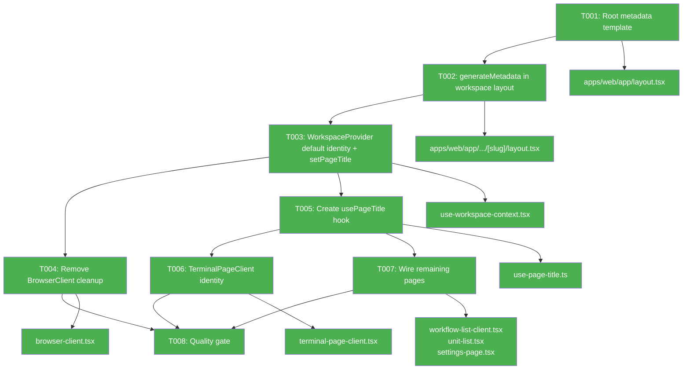

# Fix Window Titles Reverting to "Chainglass" — Implementation Plan

**Mode**: Simple
**Plan Version**: 1.0.0
**Created**: 2026-04-08
**Spec**: [window-title-revert-spec.md](./window-title-revert-spec.md)
**Status**: COMPLETE

## Summary

Browser tab titles revert to "Chainglass" after page reload because (1) the SSR metadata is a static fallback with no workspace-specific `generateMetadata()`, and (2) only BrowserClient sets worktreeIdentity, leaving 12 other pages with weak titles. Fix: add Next.js metadata template + `generateMetadata()` for meaningful SSR titles, initialize WorkspaceProvider with default worktree identity from layout props, add a `setPageTitle()` convenience API so pages can contribute their label without full worktree resolution, and wire key page clients with page-specific titles.

## Target Domains

| Domain | Status | Relationship | Role |
|--------|--------|-------------|------|
| workspace | existing | modify | WorkspaceProvider default identity, setPageTitle API, generateMetadata |
| file-browser | existing | modify | BrowserClient cleanup removal, usePageTitle hook |
| terminal | existing | modify | TerminalPageClient sets identity with 'Terminal' |
| _platform/sdk | existing | consume | TitleManager unchanged — continues as document.title writer |

## Domain Manifest

| File | Domain | Classification | Rationale |
|------|--------|---------------|-----------|
| `apps/web/app/layout.tsx` | — | cross-domain | Root metadata template, affects all pages |
| `apps/web/app/(dashboard)/workspaces/[slug]/layout.tsx` | workspace | internal | generateMetadata + pass default identity to provider |
| `apps/web/src/features/041-file-browser/hooks/use-workspace-context.tsx` | workspace | contract | Add defaultBranch/defaultWorktreePath init + setPageTitle |
| `apps/web/app/(dashboard)/workspaces/[slug]/browser/browser-client.tsx` | file-browser | internal | Remove identity cleanup on unmount |
| `apps/web/src/features/041-file-browser/hooks/use-page-title.ts` | workspace | contract | New convenience hook for page title |
| `apps/web/src/features/064-terminal/components/terminal-page-client.tsx` | terminal | internal | Set worktreeIdentity with 'Terminal' |
| `apps/web/src/features/050-workflow-page/components/workflow-list-client.tsx` | workflow-ui | internal | Use usePageTitle('Workflows') |
| `apps/web/src/features/058-workunit-editor/components/unit-list.tsx` | 058-workunit-editor | internal | Use usePageTitle('Work Units') |
| `apps/web/src/features/settings/components/settings-page.tsx` | _platform/settings | internal | Use usePageTitle('Settings') |

## Key Findings

| # | Impact | Finding | Action |
|---|--------|---------|--------|
| 01 | Critical | Only 1 of 13 workspace pages sets worktreeIdentity — all others show just workspace name | Initialize default identity in WorkspaceProvider from layout props; add setPageTitle for per-page labels |
| 02 | Critical | No generateMetadata in workspace layout — SSR title is always "Chainglass" | Add generateMetadata returning workspace name; add metadata template to root |
| 03 | High | Removing setWorktreeIdentity(null) cleanup risks stale branch when navigating to pages without branch context | Instead of removing cleanup, initialize with defaults from layout — stale identity is acceptable because it's always a valid branch for this workspace |
| 04 | High | Workflows, work-units, settings, agents pages don't resolve worktree branch from server | Create usePageTitle hook that only sets pageTitle, relying on default identity for branch |
| 05 | Medium | useAttentionTitle cleanup doesn't restore base title — stale base persists until overwritten | Acceptable: each page sets its own title via usePageTitle on mount, overwriting previous |
| 06 | Low | No tests assert `document.title === 'Chainglass'` | Template change is safe; no test breakage expected |

## Implementation

**Objective**: Eliminate "Chainglass" title flash on reload and ensure every workspace page shows `{emoji} {branch} — {page}` in the tab title.
**Testing Approach**: Lightweight — existing use-attention-title tests cover the hook chain; verify manually in dev; ensure `just fft` passes.

### Architecture Map

### Tasks

| Status | ID | Task | Domain | Path(s) | Done When | Notes |
|--------|-----|------|--------|---------|-----------|-------|
| [x] | T001 | Add metadata template to root layout | — | `/Users/jordanknight/substrate/077-random-enhancements-2/apps/web/app/layout.tsx` | `title` changed to `{ template: '%s \| Chainglass', default: 'Chainglass' }`; appleWebApp.title unchanged | Per finding 02 |
| [x] | T002 | Add generateMetadata to workspace layout | workspace | `/Users/jordanknight/substrate/077-random-enhancements-2/apps/web/app/(dashboard)/workspaces/[slug]/layout.tsx` | Exports `generateMetadata()` returning `{ title: workspaceName }`; SSR title = `{name} \| Chainglass` | Per finding 02. Layout already resolves workspace name server-side |
| [x] | T003 | Initialize WorkspaceProvider with default identity + add setPageTitle | workspace | `/Users/jordanknight/substrate/077-random-enhancements-2/apps/web/src/features/041-file-browser/hooks/use-workspace-context.tsx` | Provider accepts `defaultWorktreePath` + `defaultBranch` props; `worktreeInput` init'd with defaults (not null); context exposes `setPageTitle(title: string \| null)` that updates only the pageTitle field | Per findings 01, 03, 04. setPageTitle: `setWorktreeInput(prev => prev ? { ...prev, pageTitle: title ?? undefined } : prev)` |
| [x] | T004 | Remove BrowserClient identity cleanup on unmount | file-browser | `/Users/jordanknight/substrate/077-random-enhancements-2/apps/web/app/(dashboard)/workspaces/[slug]/browser/browser-client.tsx` | The `return () => wsCtx?.setWorktreeIdentity(null)` cleanup in the useEffect is removed; identity persists when navigating away | Per finding 03. Default identity from layout prevents null state |
| [x] | T005 | Create usePageTitle convenience hook | workspace | `/Users/jordanknight/substrate/077-random-enhancements-2/apps/web/src/features/041-file-browser/hooks/use-page-title.ts` | Hook calls `ctx.setPageTitle(title)` on mount and `ctx.setPageTitle(null)` on unmount; 15-20 lines | Per finding 04. Enables pages to add their label without worktree resolution |
| [x] | T006 | Wire TerminalPageClient with worktree identity | terminal | `/Users/jordanknight/substrate/077-random-enhancements-2/apps/web/src/features/064-terminal/components/terminal-page-client.tsx` | Calls `setWorktreeIdentity({ worktreePath, branch: worktreeBranch, pageTitle: 'Terminal' })` on mount; already has worktreePath and worktreeBranch as props | Terminal page already resolves branch server-side |
| [x] | T007 | Wire remaining key pages with usePageTitle | workflow-ui, 058-workunit-editor, _platform/settings | `/Users/jordanknight/substrate/077-random-enhancements-2/apps/web/src/features/050-workflow-page/components/workflow-list-client.tsx`, `/Users/jordanknight/substrate/077-random-enhancements-2/apps/web/src/features/058-workunit-editor/components/unit-list.tsx`, `/Users/jordanknight/substrate/077-random-enhancements-2/apps/web/src/features/settings/components/settings-page.tsx` | Each imports `usePageTitle` and calls it with their label: 'Workflows', 'Work Units', 'Settings' | Per finding 04. Agents pages are more complex (no existing client wrapper) — skip for now, they inherit default |
| [x] | T008 | Quality gate | — | — | `just fft` passes (lint + format + typecheck + test); verify titles in dev browser: reload browser page shows `{name} \| Chainglass` briefly then `{emoji} {branch} — Browser`; navigate to terminal shows `{emoji} {branch} — Terminal` | |

### Acceptance Criteria

- [ ] AC-01: Reloading any workspace page shows `{workspaceName} | Chainglass` during SSR, never bare "Chainglass"
- [ ] AC-02: After hydration on browser page, title = `{emoji} {branch} — Browser`
- [ ] AC-03: After hydration on terminal page, title = `{emoji} {branch} — Terminal`
- [ ] AC-04: After hydration on workflows page, title = `{emoji} {branch} — Workflows`
- [ ] AC-05: After hydration on other pages, title = at minimum `{emoji} {branch}`
- [ ] AC-06: Navigating browser → terminal updates title without reverting to "Chainglass"
- [ ] AC-07: Root landing page and non-workspace pages still show "Chainglass"
- [ ] AC-08: Existing ❗ and ❓ prefixes still work on top of new titles
- [ ] AC-09: Existing tests pass (`just fft`)

### Risks

| Risk | Likelihood | Impact | Mitigation |
|------|------------|--------|------------|
| Stale branch identity when navigating between pages with different worktrees | Low | Low | Default identity from layout is always a valid branch; pages that resolve specific worktrees (browser, terminal) override it |
| Brief title flash from layout-level to page-level | Low | Low | Acceptable — layout title is already meaningful (`{emoji} {branch}`); page title just adds the suffix |
| Agents page doesn't get page label | Low | Low | Deferred — agents pages have complex client structure; they inherit the default `{emoji} {branch}` title which is already an improvement |
