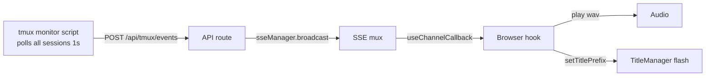

# Research Report: tmux Eventing System

**Generated**: 2026-04-09T00:10:00+10:00
**Research Query**: "new tmux eventing system — raise all events to central event service, reuse all infra, no new SSE. Bell detection with wav sound and window title change/blinking"
**Mode**: Plan-Associated (080-tmux-eventing)
**FlowSpace**: Available
**Findings**: 63 across 8 subagents

## Executive Summary

### What It Does
The codebase already has a mature event pipeline: terminal sidecar polls tmux pane titles → activity log persists entries → SSE mux broadcasts to browser → client hooks consume. A new tmux eventing system would extend this pipeline to detect richer tmux signals (bell, busy/idle, cwd changes, title changes) and surface them as browser notifications (wav sound + title flash on bell).

### Business Purpose
Let users know when long-running terminal tasks finish — a bell (`\a`) from any tmux pane in a workspace triggers an audible notification and visual tab indicator, even when the user is on a different browser tab or window.

### Key Insights
1. **All infrastructure exists** — SSE mux, channel hooks, TitleManager, desktop notifications, central event notifier are all production-ready. No new transport needed.
2. **`pane_current_command` + `window_bell_flag`** are the two tmux-direct signals that reliably detect busy→idle+done transitions (proven in prototype).
3. **No audio infrastructure exists yet** — no wav/mp3 assets, no `new Audio()` calls. Sound is a genuinely new capability.
4. **One central monitor script can watch ALL tmux sessions** — 29 panes across 14 sessions is trivial to poll at 1s intervals.

### Quick Stats
- **Components to modify**: ~5 files, ~3 new files
- **Dependencies**: tmux CLI, existing SSE mux, existing TitleManager
- **Test Coverage**: SSE/terminal well-tested; TitleManager has gaps
- **Complexity**: Low-Medium (reuse everything, add thin layer)
- **Prior Learnings**: 12 relevant from Plans 027, 032, 072, 075, 078, 079
- **Domains**: 3 touched (terminal, activity-log, _platform/events)

## How It Currently Works

### Entry Points

| Entry Point | Type | Location | Purpose |
|------------|------|----------|---------|
| Terminal sidecar WS | WebSocket | `064-terminal/server/terminal-ws.ts:60-190` | PTY I/O + tmux title polling |
| SSE mux endpoint | HTTP GET | `app/api/events/mux/route.ts:44-145` | Multiplexed event stream |
| `sseManager.broadcast()` | Internal API | `lib/sse-manager.ts:55-92` | Push events to browser |
| TitleManager | Singleton | `lib/sdk/title-manager.ts:23-139` | Compose document.title |
| Desktop notifications | Helper | `067-question-popper/lib/desktop-notifications.ts:19-60` | Browser Notification API |

### Core Execution Flow — Current tmux → Browser Path

1. **Terminal sidecar starts** → `terminal-ws.ts` opens WS, spawns tmux via `TmuxSessionManager`
2. **Pane title poll loop** → every few seconds, calls `getPaneTitles()` which runs `tmux list-panes -s -F ...`
3. **Activity log append** → titles that pass `shouldIgnorePaneTitle()` filter get written as JSONL entries
4. **Toast display** → `useActivityLogToasts` polls `/api/activity-log?since=...` and shows Sonner toasts for non-tmux entries
5. **Title management** → `useAttentionTitle` composes `document.title` from workspace identity + page title + prefix slots

### What's Missing for tmux Eventing

- **No bell detection** — `window_bell_flag` is never read
- **No busy/idle detection** — `pane_current_command` is never checked (only `pane_title`)
- **No cwd tracking** — `pane_current_path` is never read
- **No sound** — no audio playback infrastructure
- **No title flash** — TitleManager has prefix slots but no "flash" animation

## Architecture & Design

### Proposed Event Flow

### Existing Components to Reuse

| Component | What | Reuse How |
|-----------|------|-----------|
| `sseManager` | SSE broadcast singleton | Add `tmux-events` channel |
| `MultiplexedSSEProvider` | Client mux | Already handles new channels |
| `useChannelCallback` | Fire-and-forget SSE hook | Perfect for bell → sound |
| `TitleManager` | document.title compositor | Add flash/blink prefix slot |
| `WORKSPACE_SSE_CHANNELS` | Channel allowlist | Add `'tmux-events'` string |
| Desktop notifications | Browser Notification API | Reuse for background tab alerts |

### Design Patterns Identified

1. **Channel-per-feature** (PS-03): Add `'tmux-events'` to `WORKSPACE_SSE_CHANNELS`
2. **Fire-and-forget callback** (PS-02): `useChannelCallback('tmux-events', handleBell)` — no accumulation needed
3. **Central broadcast** (PS-01): Server receives tmux events, broadcasts via existing `sseManager.broadcast()`
4. **Title prefix slots** (IA-09): TitleManager already supports named prefix slots — add `'bell'` slot with timer-based clear

## Dependencies & Integration

### What This Feature Depends On

| Dependency | Type | Purpose | Risk if Changed |
|------------|------|---------|-----------------|
| tmux CLI | Required | `list-panes -s -F` polling | Low — stable API |
| `sseManager` | Required | Event broadcast | Low — mature singleton |
| SSE mux route | Required | Transport to browser | Low — stable |
| TitleManager | Required | Title flash | Low — simple prefix API |
| Web Audio API | New | Play wav on bell | Low — browser native |

### What Would Depend On This

| Consumer | How |
|----------|-----|
| Any browser tab with workspace open | Receives bell/sound notification |
| TitleManager | Flash prefix on bell |
| Future: terminal overlay | Could show busy/idle badges |
| Future: sidebar | Could show per-session activity |

## Quality & Testing

### Current Coverage Relevant to This Feature
- **SSE mux**: Strong coverage (QT-03, QT-04, QT-05)
- **Terminal WS**: Strong unit coverage with fakes (QT-01, QT-02)
- **TitleManager**: Gap — no direct tests (QT-06)
- **Activity log**: Strong functional coverage (QT-07)
- **Terminal → activity-log integration**: Gap (QT-08)

### Testing Strategy for New Feature
- **Unit test**: tmux event parsing, bell detection logic
- **Unit test**: Audio playback hook (mock Audio API)
- **Unit test**: Title flash timer behavior
- **Integration**: SSE channel receives tmux events (existing fake SSE infra)
- **Manual**: End-to-end bell → sound in browser

## Prior Learnings (From Previous Implementations)

### PL-01: Keep terminal WS separate from SSE mux
**Source**: Plan 072 spec
**Action**: Don't route tmux control traffic through SSE. The monitor script POSTs events to an API route; SSE is just the browser notification transport.

### PL-02: One SSE connection per tab
**Source**: Plan 072
**Action**: Model tmux events as a channel subscription on the existing mux. Add `'tmux-events'` to the channel list.

### PL-05: Central notifications should be fire-and-forget
**Source**: Plan 027 spec
**Action**: Keep tmux event payloads tiny — just `{ event, pane, session }`. Don't build a replay buffer.

### PL-08: tmux detection has brittle edge cases
**Source**: Plan 075
**Action**: Monitor script must be async, failure-soft, and graceful when tmux isn't running.

### PL-10: Keep pane-title polling separate from new event streams
**Source**: Plan 078 execution log
**Action**: Don't couple the new event/sound logic to the existing title-poll loop in terminal-ws.ts. The monitor script is independent.

### PL-11: Centralize title/attention state
**Source**: Plan 079
**Action**: If tmux events affect title, update TitleManager through the existing prefix slot API.

### PL-12: Sound alerts are a new feature
**Source**: Plans 053/046
**Action**: No audio infrastructure exists. Treat this as genuinely new — add a wav asset, create an audio playback utility.

## Domain Context

### Domain Placement (from DB findings)

| Piece | Domain | Why |
|-------|--------|-----|
| tmux monitor script | `terminal` | Owns tmux lifecycle and state detection |
| Event broadcast to SSE | `_platform/events` | Owns SSE transport (existing `sseManager`) |
| Browser bell notification | `activity-log` or new thin hook | Extends existing notification patterns |
| Audio playback utility | `_platform/sdk` or inline | Cross-cutting browser capability |
| Title flash | `_platform/sdk` | TitleManager already lives here |

### Recommended Flow (DB-08)
`terminal` detects → API route receives → `_platform/events` broadcasts → browser hook plays sound + flashes title

### Boundary Violations to Avoid
1. Browser polling tmux directly (must go through server)
2. Terminal domain broadcasting SSE directly (use `sseManager`)
3. Duplicating title/toast infrastructure (reuse TitleManager + Sonner)

## Critical Discoveries

### Critical Finding 01: No New SSE Infrastructure Needed
**Impact**: Simplifies entire feature
**What**: The existing SSE mux handles everything — just add a channel string and a callback hook. No new EventSource, no new provider, no new transport.

### Critical Finding 02: Monitor Script is External
**Impact**: Architectural decision
**What**: The tmux monitor runs as an independent process (not inside terminal-ws.ts). It POSTs events to an API endpoint. This keeps it decoupled from the terminal sidecar and allows watching ALL sessions system-wide.

### Critical Finding 03: Audio is Genuinely New
**Impact**: New asset + utility needed
**What**: No wav/mp3 assets exist. No `Audio()` API usage. Need to add a wav file and a small playback utility. The `desktop-notifications.ts` pattern (lazy permission request + fallback) is good precedent.

### Critical Finding 04: TitleManager Flash is Easy
**Impact**: Small addition
**What**: TitleManager already supports named prefix slots via `setTitlePrefix('bell', '🔔')`. Add a timer to auto-clear after N seconds. The question popper already uses `setTitlePrefix('attention', '❗')` as precedent.

## Modification Considerations

### Safe to Modify
- `WORKSPACE_SSE_CHANNELS` — just add a string
- Create new API route for tmux events — no existing code touched
- Create new browser hook — isolated client component

### Modify with Caution
- TitleManager — add flash behavior without breaking existing prefix logic
- Workspace layout — adding channel to the list (trivial but central)

### Danger Zones
- terminal-ws.ts — DO NOT modify the existing pane-title poll loop (PL-10)
- SSE mux infrastructure — DO NOT add new transport mechanisms

## Recommendations

### Architecture
1. **Monitor script** (zsh) → POST to `/api/tmux/events` with session/pane/event payload
2. **API route** → validate, match session to workspace, `sseManager.broadcast('tmux-events', ...)`
3. **Browser hook** → `useChannelCallback('tmux-events', handler)` — on bell event, play wav + flash title
4. **Audio utility** → small `playNotificationSound()` helper with user-provided wav
5. **Title flash** → `setTitlePrefix('bell', '🔔')` + `setTimeout(() => clearTitlePrefix('bell'), 5000)`

### Scope for MVP
- Bell detection only (not busy/idle, cwd, title changes — those are "decide later")
- One wav file provided by user
- Title prefix flash with auto-clear
- Works for any tmux session in the workspace

---

**Research Complete**: 2026-04-09T00:10:00+10:00
**Report Location**: `docs/plans/080-tmux-eventing/research-dossier.md`
