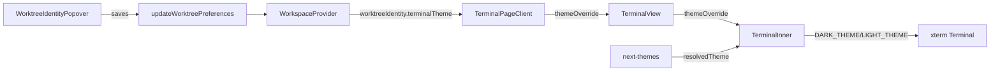

# Research Report: xterm.js Terminal Themes

**Generated**: 2026-04-09T10:12:00Z
**Research Query**: "xterm themes — popular terminal themes like Dracula, Kimbie Light/Dark, and other themes from VS Code and Terminus"
**Mode**: Pre-Plan
**Location**: `docs/plans/081-xterm-themes/research-dossier.md`
**FlowSpace**: Available ✅
**Findings**: 63 across 8 subagents + 2 external research queries

## Executive Summary

### What It Does
The terminal currently has **two hardcoded color palettes** (DARK_THEME / LIGHT_THEME, VS Code-like) in `terminal-inner.tsx`. Theme selection is limited to `dark | light | system` via `worktreeIdentity.terminalTheme`. There is no user-selectable terminal color theme system.

### Business Purpose
Users want the terminal to feel personalized and visually polished — matching popular themes they use in VS Code, iTerm2, Terminus, etc. The current monochrome dark/light is boring and doesn't match the quality of the rest of the app.

### Key Insights
1. **xterm.js ITheme is a flat 30-field object** — no manifest loading needed, just TypeScript constant objects
2. **The SDK settings pattern (contribution → register → store → UI) is the proven path** — follow the icon theme precedent
3. **Terminal theme definitions should stay in `064-terminal/`** — they're terminal-specific, not shared infra (domain boundary: `_platform/themes` is icon-only, designed to grow but doesn't own color themes yet)
4. **~20 popular themes cover 95% of user demand** — Dracula, Nord, Catppuccin (4 flavors), Solarized (2), Gruvbox (2), One Dark, Monokai, Tokyo Night, Night Owl, Material, GitHub Dark, plus current VS Code dark/light

### Quick Stats
- **Components to modify**: ~5 files (terminal-inner, contribution, register, types, constants)
- **Components to create**: ~2 files (theme definitions, terminal theme types)
- **Dependencies**: None new — xterm ITheme is already the interface
- **Test Coverage**: Terminal theme switching has NO tests today (QT-06)
- **Prior Learnings**: 10 relevant discoveries from Plans 064, 073
- **Domains**: Terminal (primary), Themes SDK contribution (secondary)

## How It Currently Works

### Entry Points

| Entry Point | Type | Location | Purpose |
|------------|------|----------|---------|
| `TerminalInner` | Component | `terminal-inner.tsx:75-427` | Creates xterm Terminal with theme |
| `worktreeIdentity.terminalTheme` | State | `use-workspace-context.tsx:99-108` | Stores user's theme choice |
| `WorktreeIdentityPopover` | UI | `worktree-identity-popover.tsx:70-77` | Theme picker (dark/light/system only) |

### Core Execution Flow

1. **User selects theme** in WorktreeIdentityPopover → saves via `updateWorktreePreferences()`
2. **WorkspaceProvider** resolves `worktreeIdentity.terminalTheme` from saved preferences (default: `'dark'`)
3. **TerminalPageClient / TerminalOverlayPanel** reads `wsCtx.worktreeIdentity.terminalTheme`
4. **TerminalView** passes it as `themeOverride` prop to `TerminalInner`
5. **TerminalInner** computes `effectiveTheme`: if override is `'system'`, falls through to `resolvedTheme` from `next-themes`
6. **Terminal init**: `new Terminal({ theme: effectiveTheme === 'dark' ? DARK_THEME : LIGHT_THEME })`
7. **Theme sync effect**: `terminalRef.current.options.theme = effectiveTheme === 'dark' ? DARK_THEME : LIGHT_THEME`

### Data Flow


### Current Theme Objects
```typescript
// terminal-inner.tsx:16-62
const DARK_THEME = {
  background: '#1e1e1e', foreground: '#d4d4d4',
  cursor: '#d4d4d4', cursorAccent: '#1e1e1e',
  selectionBackground: '#264f78',
  black: '#1e1e1e', red: '#f44747', green: '#6a9955', yellow: '#d7ba7d',
  blue: '#569cd6', magenta: '#c586c0', cyan: '#4ec9b0', white: '#d4d4d4',
  brightBlack: '#808080', brightRed: '#f44747', brightGreen: '#6a9955',
  brightYellow: '#d7ba7d', brightBlue: '#569cd6', brightMagenta: '#c586c0',
  brightCyan: '#4ec9b0', brightWhite: '#e8e8e8',
};

const LIGHT_THEME = {
  background: '#ffffff', foreground: '#1e1e1e',
  cursor: '#1e1e1e', cursorAccent: '#ffffff',
  selectionBackground: '#add6ff',
  // ... similar VS Code Light palette
};
```

## Architecture & Design

### xterm.js ITheme Interface (30 fields)
```typescript
interface ITheme {
  foreground?: string;
  background?: string;
  cursor?: string;
  cursorAccent?: string;
  selectionBackground?: string;
  selectionForeground?: string;
  selectionInactiveBackground?: string;
  scrollbarSliderBackground?: string;
  scrollbarSliderHoverBackground?: string;
  scrollbarSliderActiveBackground?: string;
  overviewRulerBorder?: string;
  // ANSI 16 colors
  black?: string; red?: string; green?: string; yellow?: string;
  blue?: string; magenta?: string; cyan?: string; white?: string;
  brightBlack?: string; brightRed?: string; brightGreen?: string;
  brightYellow?: string; brightBlue?: string; brightMagenta?: string;
  brightCyan?: string; brightWhite?: string;
  // Extended (256 colors)
  extendedAnsi?: string[];
}
```

### Design Patterns Identified

1. **SDK Contribution Pattern** (PS-03, PS-04, PS-09): Define settings in `contribution.ts`, register via `register.ts`, contribute to `SettingsStore`, consume via `useSDKSetting()`. This is the proven path for terminal theme selection.

2. **Theme Object Reference Pattern** (PL-01): xterm v6 requires NEW object references for theme updates — can't mutate in place. Each theme must be a distinct const object.

3. **WorktreeIdentity Pattern** (IA-05, DC-07): Terminal theme is currently stored per-worktree via workspace preferences. The new system could either extend this or move to SDK settings.

### Key Design Decision: Where to Store Theme Preference?

**Option A: SDK Setting** (`terminal.theme` via `contribution.ts`)
- ✅ Follows the proven icon theme pattern
- ✅ Appears in Settings page automatically
- ✅ Schema-validated via Zod
- ❌ Currently app-wide, not per-worktree

**Option B: Workspace Preferences** (current `worktreeIdentity.terminalTheme`)
- ✅ Per-worktree customization
- ✅ Already exists and works
- ❌ Not in settings page
- ❌ Limited UI (just the popover)

**Recommendation**: Use SDK settings for the theme catalog selection, but keep the existing worktree override for per-worktree dark/light/system switching. Or unify: the SDK setting becomes the theme, and `system` mode auto-selects the theme's dark/light variant.

## Dependencies & Integration

### Internal Dependencies
| Dependency | Type | Purpose | Risk if Changed |
|-----------|------|---------|-----------------|
| `@xterm/xterm` v6 | Required | Terminal renderer + ITheme | None (stable API) |
| `next-themes` | Required | System dark/light detection | None |
| `_platform/sdk` | Optional | Settings contribution | Low (proven pattern) |
| `_platform/settings` | Optional | Settings UI rendering | Low |
| Workspace prefs | Current | Per-worktree theme storage | Need migration |

### External Dependencies
| Service/Library | Version | Purpose | Criticality |
|----------------|---------|---------|-------------|
| `@xterm/xterm` | ^6.0.0 | ITheme interface | High |
| No new deps needed | — | Themes are just TS objects | — |

### npm Packages Considered
- **`xterm-theme`**: iTerm2 themes adapted for xterm.js — could import, but themes are simple enough to define inline
- **Recommendation**: Define themes as TypeScript constants (no external dep). ~20 theme objects is ~400 lines of TS.

## Quality & Testing

### Current State
- Terminal theme switching: **NOT tested** (QT-06)
- xterm doesn't render in jsdom (PL-04) — can't test visual output
- Theme object shapes: **No snapshot tests** (QT-05)
- SDK settings: tested generically via `use-sdk-setting.test.tsx`

### Testing Strategy for This Feature
- **Unit tests**: Theme object shape validation (all 20 have required ITheme fields)
- **Unit tests**: Theme resolver function (given themeId + dark/light → returns ITheme)
- **Unit tests**: SDK contribution validation (setting contributes correctly)
- **No visual tests needed**: Theme objects are data; xterm handles rendering

## Prior Learnings (From Previous Implementations)

### 📚 PL-01: xterm v6 theme object references
**Source**: Plan 064 Phase 2
**Type**: gotcha
**Action**: Each theme MUST be a distinct frozen object. Never mutate.

### 📚 PL-04: jsdom can't render xterm
**Source**: Plan 064 Phase 2
**Type**: decision
**Action**: Test theme data shapes, not visual rendering.

### 📚 PL-09: SDK settings is the cleanest precedent
**Source**: Plan 073 Phase 3
**Type**: insight
**Action**: Use the `themes.iconTheme` contribution pattern for `terminal.theme`.

### 📚 PL-10: Server/client split for theme infra
**Source**: Plan 073 Phases 2-3
**Type**: insight
**Action**: Terminal themes are pure client-side TS objects — no server-side loader needed (simpler than icon themes).

## Domain Context

### Existing Domains Relevant

| Domain | Relationship | Key Contracts | Assessment |
|--------|-------------|---------------|------------|
| `terminal` | Primary owner | TerminalView, TerminalInner, themeOverride | Theme definitions live here |
| `_platform/themes` | SDK contribution only | registerThemesSDK pattern | Extend contribution, but themes stay in terminal |
| `_platform/sdk` | Infrastructure | sdk.settings.contribute | Consume for setting registration |
| `_platform/settings` | UI rendering | SettingsPage, SettingControl | Auto-renders theme picker |

### Domain Map Position
- Terminal themes are **terminal domain internal** (not cross-domain)
- The SDK setting (`terminal.theme`) crosses into `_platform/themes` contribution
- No new domain needed

### Potential Domain Actions
- Extend `_platform/themes` contribution to include `terminal.theme` setting alongside `themes.iconTheme`
- OR: Terminal domain contributes its own SDK setting directly (simpler, no themes domain change)

## Modification Considerations

### ✅ Safe to Modify
1. **`terminal-inner.tsx`**: Replace hardcoded DARK_THEME/LIGHT_THEME with theme lookup — well-isolated, no external consumers
2. **SDK contribution**: Add new setting — additive, no breaking changes
3. **Theme constants**: New file with theme definitions — pure addition

### ⚠️ Modify with Caution
1. **`worktreeIdentity.terminalTheme`**: Currently `'dark' | 'light' | 'system'` — changing this type affects workspace preferences, popover, and persistence. Either expand to include theme IDs or keep as separate concern.
2. **WorktreeIdentityPopover**: Any UI changes here affect file-browser domain

### 🚫 Danger Zones
1. **Workspace preference schema**: Changing `WorktreeVisualPreferences` type in `packages/workflow` affects the shared package

### Extension Points
1. **SDK Settings**: Designed for exactly this — contributing a new `terminal.theme` select setting
2. **Theme objects**: Simple TypeScript — easy to add more themes later

## Proposed Theme Catalog (~20 themes)

### Dark Themes
| Theme | Origin | Style |
|-------|--------|-------|
| VS Code Dark | Current default | Neutral dark |
| Dracula | Community | Purple-accented dark |
| Nord | Arctic | Cool blue-grey |
| Catppuccin Mocha | Community | Warm pastel dark |
| Catppuccin Macchiato | Community | Mid-tone pastel |
| Catppuccin Frappé | Community | Light-dark pastel |
| Gruvbox Dark | Community | Warm retro |
| One Dark | Atom | Balanced dark |
| Tokyo Night | Community | Cool night tones |
| Monokai | Sublime | Vibrant classic |
| Night Owl | Community | Deep blue dark |
| Material Dark | Google | Material design |
| Solarized Dark | Ethan Schoonover | Precision-crafted |
| GitHub Dark | GitHub | GitHub's dark mode |

### Light Themes
| Theme | Origin | Style |
|-------|--------|-------|
| VS Code Light | Current default | Neutral light |
| Catppuccin Latte | Community | Warm pastel light |
| Gruvbox Light | Community | Warm retro light |
| Solarized Light | Ethan Schoonover | Precision-crafted |
| GitHub Light | GitHub | GitHub's light mode |

## External Research Opportunities

### Research Opportunity 1: Exact Theme Color Palettes

**Why Needed**: The Perplexity research provided approximate palettes. Some themes (Kimbie, Ayu, Everforest, Rose Pine) need verified color values.
**Impact on Plan**: Theme accuracy — users will notice if Dracula doesn't look like Dracula.
**Source Findings**: External Perplexity research

**Ready-to-use prompt:**
```
/deepresearch "I need the exact xterm.js ITheme color values for these terminal themes:
Dracula, Nord, Catppuccin (Mocha, Macchiato, Frappé, Latte), Solarized (Dark, Light),
Gruvbox (Dark, Light), One Dark, Monokai, Tokyo Night, Night Owl, Material Dark,
GitHub Dark, GitHub Light.

For each theme I need all ITheme fields:
foreground, background, cursor, cursorAccent, selectionBackground,
black, red, green, yellow, blue, magenta, cyan, white,
brightBlack, brightRed, brightGreen, brightYellow, brightBlue, brightMagenta, brightCyan, brightWhite.

Sources: official theme repos (github.com/dracula/*, github.com/catppuccin/*, etc.),
iTerm2-color-schemes repo, Windows Terminal themes, VS Code theme extensions.
Prefer the 'canonical' source for each theme."
```

**Results location**: `docs/plans/081-xterm-themes/external-research/theme-palettes.md`

## Critical Discoveries

### 🚨 Critical Finding 01: Theme Object References
**Impact**: Critical
**Source**: PL-01, IA-03
**What**: xterm v6 requires new object references for theme updates. Each theme MUST be a distinct const object — never reuse or mutate.
**Required Action**: Define all themes as frozen const objects, never derive dynamically.

### 🚨 Critical Finding 02: WorktreeIdentity Type Change
**Impact**: High
**Source**: IA-05, IC-04, DB-06
**What**: `terminalTheme` is currently typed as `'dark' | 'light' | 'system'`. Changing this to accept theme IDs (`'dracula' | 'nord' | ...`) affects `packages/workflow/src/entities/workspace.ts` which is a shared package.
**Required Action**: Either expand the type carefully, or add a separate `terminalColorTheme` field alongside the existing one.

### 🚨 Critical Finding 03: No Terminal Theme Tests
**Impact**: Medium
**Source**: QT-06
**What**: Terminal theme switching has no tests. Adding 20 themes without tests risks regressions.
**Required Action**: Add tests for theme object shapes and theme resolution logic.

## Appendix: File Inventory

### Core Files to Modify
| File | Purpose | Lines |
|------|---------|-------|
| `apps/web/src/features/064-terminal/components/terminal-inner.tsx` | Replace hardcoded themes with lookup | 428 |
| `apps/web/src/features/064-terminal/components/terminal-page-client.tsx` | Theme selection flow | 87 |
| `apps/web/src/features/064-terminal/components/terminal-overlay-panel.tsx` | Theme selection flow | 163 |

### New Files to Create
| File | Purpose |
|------|---------|
| `apps/web/src/features/064-terminal/lib/terminal-themes.ts` | Theme catalog (20 ITheme objects) |
| `apps/web/src/features/064-terminal/lib/terminal-theme-types.ts` | TerminalThemeId type, metadata |
| `test/unit/web/features/064-terminal/terminal-themes.test.ts` | Theme shape validation tests |

### Files Potentially Modified
| File | Purpose |
|------|---------|
| `apps/web/src/features/_platform/themes/sdk/contribution.ts` | Add `terminal.theme` setting |
| `apps/web/src/features/_platform/themes/sdk/register.ts` | Register terminal theme setting |
| `apps/web/src/features/064-terminal/index.ts` | Export theme types |
| `packages/workflow/src/entities/workspace.ts` | Expand terminalTheme type (if chosen) |

## Next Steps

**External research identified**: Theme palettes need verification from canonical sources.

- **With research**: Run `/deepresearch` prompt above, then `/plan-1b-specify`
- **Without research** (faster): Run `/plan-1b-specify` directly — approximate palettes from Perplexity are good enough to start, refine during implementation

---

**Research Complete**: 2026-04-09T10:12:00Z
**Report Location**: `docs/plans/081-xterm-themes/research-dossier.md`
