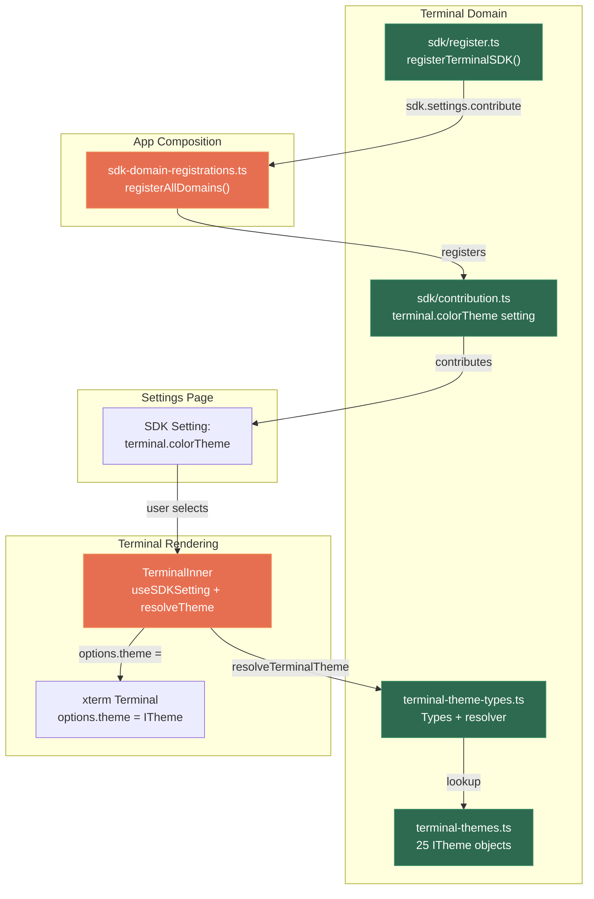

# xterm.js Terminal Color Themes — Implementation Plan

**Mode**: Simple
**Plan Version**: 1.0.0
**Created**: 2026-04-09
**Spec**: [xterm-themes-spec.md](xterm-themes-spec.md)
**Status**: DRAFT

## Summary

The terminal currently has two hardcoded color palettes (VS Code Dark/Light). This plan adds a catalog of 25 popular terminal color themes (Dracula, Nord, Catppuccin, Solarized, Gruvbox, Kimbie, etc.) selectable via an SDK setting in the Settings page. Theme changes apply instantly via xterm.js `options.theme`. An "Auto" mode preserves backward compatibility by following the app's dark/light toggle.

## Target Domains

| Domain | Status | Relationship | Role |
|--------|--------|-------------|------|
| `terminal` | existing | **modify** | Theme catalog, resolver, TerminalInner wiring, SDK contribution |
| `_platform/sdk` | existing | consume | Settings contribution/persistence infrastructure |
| `_platform/themes` | existing | consume | Pattern reference only (no code changes) |

## Domain Manifest

| File | Domain | Classification | Rationale |
|------|--------|---------------|-----------|
| `apps/web/src/features/064-terminal/lib/terminal-themes.ts` | terminal | internal | Theme catalog: 25 ITheme objects + metadata |
| `apps/web/src/features/064-terminal/lib/terminal-theme-types.ts` | terminal | contract | TerminalThemeId, TerminalThemeEntry, resolver function types |
| `apps/web/src/features/064-terminal/sdk/contribution.ts` | terminal | internal | SDK setting: `terminal.colorTheme` |
| `apps/web/src/features/064-terminal/sdk/register.ts` | terminal | internal | `registerTerminalSDK(sdk)` wiring |
| `apps/web/src/features/064-terminal/components/terminal-theme-select.tsx` | terminal | internal | Palette icon → Select dropdown with grouped themes + swatches |
| `apps/web/src/features/064-terminal/components/terminal-inner.tsx` | terminal | internal | Replace hardcoded DARK/LIGHT with theme resolver + useSDKSetting |
| `apps/web/src/features/064-terminal/components/terminal-page-header.tsx` | terminal | internal | Add TerminalThemeSelect to header actions |
| `apps/web/src/features/064-terminal/components/terminal-overlay-panel.tsx` | terminal | internal | Add TerminalThemeSelect to overlay header actions |
| `apps/web/src/features/064-terminal/index.ts` | terminal | contract | Export theme types |
| `apps/web/src/app-composition/sdk-domain-registrations.ts` | cross-domain | cross-domain | Add `registerTerminalSDK` call |
| `test/unit/web/features/064-terminal/terminal-themes.test.ts` | terminal | internal | Theme shape validation + resolver tests |

## Key Findings

| # | Impact | Finding | Action |
|---|--------|---------|--------|
| 01 | Critical | xterm v6 requires **new object references** for theme updates — reassigning the same object is a no-op (PL-01) | Each theme is a distinct frozen const; never derive dynamically |
| 02 | High | SDK contribution pattern is `{ key, schema: z.string().default(), ui: 'select', options, section: 'Appearance' }` — exact format confirmed from `themes/sdk/contribution.ts` | Replicate exactly for `terminal.colorTheme` |
| 03 | High | `useSDKSetting<T>(key)` gets SDK from context internally via `useSDK()` — just call `useSDKSetting<string>('terminal.colorTheme')`, no SDK prop drilling needed | Import and use directly; no custom hook or prop changes needed |
| 04 | Medium | Terminal container has no hardcoded CSS background — xterm controls its own canvas BG. Surrounding UI chrome (overlay panels, disconnected states) uses Tailwind `bg-background` which is outside xterm's domain. | Theme only controls the xterm canvas, not surrounding UI. This is expected behavior. |
| 05 | Medium | `worktreeIdentity.terminalTheme` (`dark\|light\|system`) still drives the mode override. New `terminal.colorTheme` SDK setting is orthogonal — it selects WHICH palette, while the existing field selects WHEN to apply dark vs light. | Keep both systems: `auto` bridges them |
| 06 | Low | `settings/components/setting-control.tsx` already renders `select` UI with `SelectItem` components — no custom UI work needed | Theme dropdown renders automatically from SDK contribution |

## Testing Approach

**Lightweight** — theme data is pure TypeScript objects with no side effects. Testing strategy:

1. **Theme shape validation**: Every theme has all required ITheme fields (foreground, background, cursor, cursorAccent, selectionBackground, 16 ANSI colors)
2. **Theme resolver**: `resolveTerminalTheme()` returns correct theme for valid IDs, falls back to VS Code Dark/Light for unknown IDs and `auto`
3. **Theme uniqueness**: All 25 theme IDs are unique, all names are unique
4. **No xterm visual tests**: xterm doesn't render in jsdom (PL-04) — visual verification is manual via the HTML demo and live testing

## Implementation

**Objective**: Ship 25 selectable terminal color themes via an SDK setting with instant application and auto mode.

### Tasks

| Status | ID | Task | Domain | Path(s) | Done When | Notes |
|--------|-----|------|--------|---------|-----------|-------|
| [x] | T001 | Create terminal theme types | terminal | `apps/web/src/features/064-terminal/lib/terminal-theme-types.ts` | `TerminalThemeId`, `TerminalThemeEntry`, `TerminalThemeCategory` types export cleanly; `resolveTerminalTheme()` and `getThemesByCategory()` functions defined | Workshop data model |
| [x] | T002 | Create theme catalog (25 themes) | terminal | `apps/web/src/features/064-terminal/lib/terminal-themes.ts` | All 25 `TerminalThemeEntry` objects exported as `TERMINAL_THEMES` array; each has valid ITheme with all required fields | Palettes from workshop 001 |
| [x] | T003 | Write theme unit tests | terminal | `test/unit/web/features/064-terminal/terminal-themes.test.ts` | Tests pass: all themes have required fields, resolver works for all IDs + auto + unknown fallback, IDs and names are unique | PL-04: no visual tests |
| [x] | T004 | Create terminal SDK contribution | terminal | `apps/web/src/features/064-terminal/sdk/contribution.ts`, `apps/web/src/features/064-terminal/sdk/register.ts` | `terminal.colorTheme` select setting with all 25 options + Auto; `registerTerminalSDK(sdk)` function exports | Follow themes iconTheme pattern exactly |
| [x] | T005 | Register terminal SDK in app composition | cross-domain | `apps/web/src/app-composition/sdk-domain-registrations.ts` | `registerTerminalSDK` called alongside existing registrations | One-line addition |
| [x] | T006 | Wire TerminalInner to SDK setting | terminal | `apps/web/src/features/064-terminal/components/terminal-inner.tsx` | Remove hardcoded DARK/LIGHT_THEME; consume `terminal.colorTheme` via `useSDKSetting`; resolve theme via `resolveTerminalTheme()`; auto mode uses `resolvedTheme` from next-themes to pick vscode-dark/light; set parent container bg to match theme.background | Per finding 01: new object refs. Per DYK #1: match container bg. Per DYK #2: themeOverride ignored for non-auto |
| [x] | T006b | Create TerminalThemeSelect component | terminal | `apps/web/src/features/064-terminal/components/terminal-theme-select.tsx`, `terminal-page-header.tsx`, `terminal-overlay-panel.tsx` | Palette icon button in header → Radix Select dropdown with dark/light groups + color swatches; integrated into both page header and overlay header | Workshop 002 design |
| [x] | T007 | Export theme types from barrel | terminal | `apps/web/src/features/064-terminal/index.ts` | `TerminalThemeId`, `TerminalThemeEntry`, `resolveTerminalTheme` exported | Public contract addition |
| [x] | T008 | Remove debug line + cleanup | terminal | `apps/web/src/features/064-terminal/components/terminal-inner.tsx` | `window.__xterm` debug line removed; code is clean for commit | Pre-commit cleanup |
| [x] | T009 | Run `just fft` — verify all tests pass | — | — | Lint, format, typecheck, and all tests green | Mandatory pre-commit gate |
| [x] | T010 | Update terminal domain.md | terminal | `docs/domains/terminal/domain.md`, `apps/web/src/features/064-terminal/domain.md` | History entry for Plan 081; SDK contribution listed in Contracts/Composition | Domain bookkeeping |

### Architecture Diagram

### Acceptance Criteria

- [ ] AC-01: Theme catalog exports 25 entries with complete ITheme objects
- [ ] AC-02: `terminal.colorTheme` SDK setting in Settings → Appearance as `<select>`
- [ ] AC-03: Theme applies instantly on selection (no refresh)
- [ ] AC-04: Auto mode follows app dark/light toggle
- [ ] AC-05: Theme persists across browser sessions
- [ ] AC-06: All 25 themes render with distinct, readable output
- [ ] AC-07: Theme category (dark/light) labeled in dropdown options
- [ ] AC-08: Unit tests pass for theme shapes and resolver
- [ ] AC-09: Existing worktreeIdentity.terminalTheme override preserved

### Risks

| Risk | Likelihood | Impact | Mitigation |
|------|------------|--------|------------|
| Theme palette inaccuracy | Low | Low | Palettes from canonical sources + visual review via HTML demo |
| xterm v6 object reference gotcha | Low | Medium | Each theme is a distinct frozen const (PL-01) |
| SDK setting coexistence with worktreeIdentity | Medium | Medium | Auto mode bridges both; worktreeIdentity controls mode, SDK setting controls palette |
| CanvasAddon compatibility | Very Low | Low | Confirmed no special handling needed (IA-09) |
