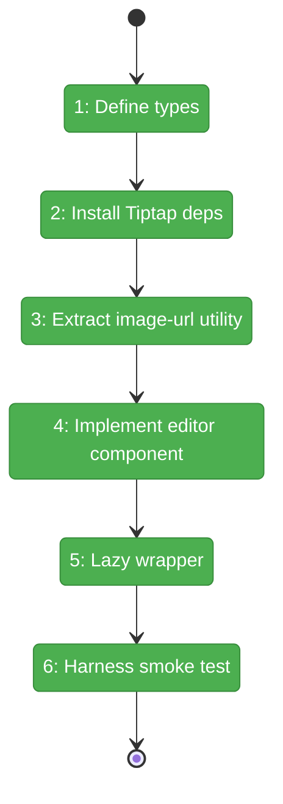
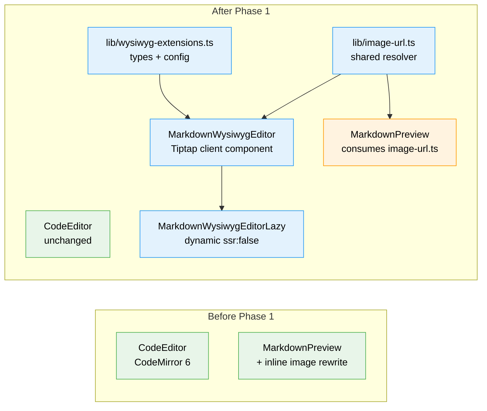

# Flight Plan: Phase 1 — Foundation (Editor Component & Dependencies)

**Plan**: [../../md-editor-plan.md](../../md-editor-plan.md)
**Phase**: Phase 1: Foundation — Editor Component & Dependencies
**Tasks Dossier**: [tasks.md](tasks.md)
**Generated**: 2026-04-18
**Status**: Landed (2026-04-18)

---

## Departure → Destination

**Where we are**: The app's only markdown surface is source-based. `CodeEditor` (CodeMirror 6) handles text editing; `MarkdownPreview` renders a server-compiled HTML tree. No WYSIWYG editor exists anywhere in the codebase. Image URL rewriting is inlined inside `markdown-preview.tsx`. There is no `lib/` folder under `_platform/viewer`.

**Where we're going**: A developer can import `MarkdownWysiwygEditorLazy` from `_platform/viewer`, render it with a markdown string, and get a live visual editor — headings, bold, italics, lists, links, read-only images, light/dark theming — all round-tripping back as markdown. Tiptap sits in its own lazy chunk. The editor fires `onChange` ONLY when the user actually edits. A harness Playwright spec proves it mounts clean in the browser with no hydration warnings. The image URL resolver is a shared utility consumed by both Preview and (future) Rich modes.

---

## Domain Context

### Domains We're Changing

| Domain | What Changes | Key Files |
|--------|-------------|-----------|
| `_platform/viewer` | New `lib/` directory; new image URL resolver utility; new types module for WYSIWYG editor; new editor component + lazy wrapper; index.ts re-exports | `apps/web/src/features/_platform/viewer/lib/image-url.ts`, `lib/wysiwyg-extensions.ts`, `components/markdown-wysiwyg-editor.tsx`, `components/markdown-wysiwyg-editor-lazy.tsx`, `index.ts` |
| `file-browser` | `markdown-preview.tsx` refactored to consume the extracted image URL resolver (behavior preserved) | `apps/web/src/features/041-file-browser/components/markdown-preview.tsx` |
| (infra) | Seven Tiptap packages pinned in `apps/web/package.json` | `apps/web/package.json`, `pnpm-lock.yaml` |

### Domains We Depend On (no changes)

| Domain | What We Consume | Contract |
|--------|----------------|----------|
| `_platform/themes` | `useTheme().resolvedTheme` from `next-themes` | Theme state (dark/light) for `prose-invert` class swap |

---

## Flight Status

<!-- Updated by /plan-6-v2: pending → active → done. Use blocked for problems/input needed. -->

**Legend**: grey = pending | yellow = active | red = blocked/needs input | green = done

---

## Stages

<!-- Updated by /plan-6-v2 during implementation: [ ] → [~] → [x] -->

- [x] **Stage 1: Define types** — Interface-first module for editor props, extension config, and the image URL resolver shape (`lib/wysiwyg-extensions.ts` — new file).
- [x] **Stage 2: Install Tiptap deps** — Added 7 packages (`@tiptap/react`, `@tiptap/pm`, `@tiptap/starter-kit`, `@tiptap/extension-link`, `@tiptap/extension-placeholder`, `@tiptap/extension-image`, `tiptap-markdown`); `pnpm install` succeeded; all imports resolve via tsc.
- [x] **Stage 3: Extract image-url utility** — Lifted image rewriting into `_platform/viewer/lib/image-url.ts` (11 unit tests green); `markdown-preview.tsx` refactored to call `resolveImageUrl({ src, currentFilePath, rawFileBaseUrl })` — behavior identical.
- [x] **Stage 4: Implement editor component** — `MarkdownWysiwygEditor` shipped with StarterKit + tiptap-markdown + Placeholder + Link + custom Image extension (resolver-aware); `lastRenderedValueRef` guards setContent thrash; `emitUpdate: false` on sync; explicit `editor.destroy()` cleanup. 9 test cases green.
- [x] **Stage 5: Lazy wrapper** — `MarkdownWysiwygEditorLazy` shipped via `next/dynamic({ ssr: false })`; Tiptap stays out of the initial bundle; exports added to `_platform/viewer/index.ts`.
- [x] **Stage 6: Harness smoke test** — Harness booted (`just harness-dev` → port 3126). Playwright/CDP spec navigated to `/dev/markdown-wysiwyg-smoke`, asserted `<h1>Hello</h1>` + resolver-rewritten `` src + zero hydration warnings. Screenshot saved: `harness/results/phase-1/smoke-desktop.png` (19.9 KB). Runtime: 1.1s.

---

## Architecture: Before & After

**Legend**: existing (green, unchanged) | changed (orange, modified) | new (blue, created)

---

## Acceptance Criteria

- [ ] Tiptap family installed; `pnpm -F web build` succeeds
- [ ] `MarkdownWysiwygEditor` mounts in isolation with a provided markdown string
- [ ] Placeholder `"Start writing…"` is visible when `value === ''`
- [ ] Inline images render read-only via the shared `resolveImageUrl` utility
- [ ] Dark mode toggles the `prose-invert` class correctly
- [ ] Changing the `value` prop updates editor content
- [ ] `onChange` does NOT fire on mount or on same-value `setContent`
- [ ] No Next.js hydration warnings in the browser console
- [ ] `_platform/viewer/lib/image-url.ts` has 8+ unit tests, all green
- [ ] `markdown-preview.tsx` behavior unchanged; its existing tests still pass
- [ ] Harness Playwright smoke spec returns exit 0 with screenshot evidence

## Goals & Non-Goals

**Goals**:
- Ship a working, lazy-loaded WYSIWYG editor primitive that round-trips a markdown string
- Remove image-url-rewrite duplication before it happens (extract once, consume twice)
- Prove React 19 + Next.js 15 + Tiptap hydrate cleanly
- Preserve Preview behavior during the extraction refactor

**Non-Goals**:
- Toolbar (Phase 2)
- Link popover (Phase 3)
- Production front-matter split/rejoin (Phase 4 — passthrough stubs only)
- FileViewerPanel wiring (Phase 5)
- Corpus round-trip tests (Phase 6)
- Bundle-size gating (deferred to Phase 6.7)

---

## Checklist

- [x] T001: Define `MarkdownWysiwygEditorProps`, `TiptapExtensionConfig`, `ImageUrlResolver` types in `lib/wysiwyg-extensions.ts`
- [x] T002: Added 6 `@tiptap/*` + `tiptap-markdown` packages (resolved to 2.27.2 / 0.8.10); `pnpm install` clean; imports resolve via tsc
- [x] T003: Extracted image resolver to `lib/image-url.ts` (11 unit tests green, all scenarios: relative, absolute, data:, protocol-rel, .. walking, missing inputs); `markdown-preview.tsx` refactored
- [x] T004: `MarkdownWysiwygEditor` shipped — Tiptap + tiptap-markdown + Placeholder + Link + resolver-aware Image; docChanged-gated onChange; no thrash; destroy on unmount. 9 tests green.
- [x] T005: `MarkdownWysiwygEditorLazy` created with `next/dynamic({ ssr: false })`; viewer index re-exports `MarkdownWysiwygEditorLazy`, types, and `resolveImageUrl`
- [x] T006: Harness Playwright smoke spec green — h1/img resolver/no hydration warnings verified; screenshot captured
