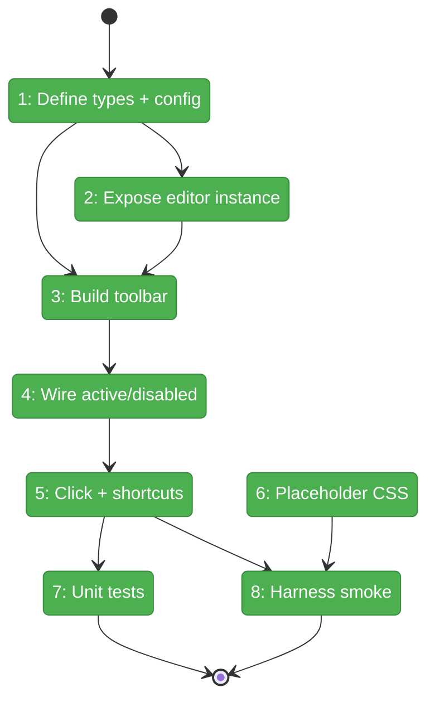
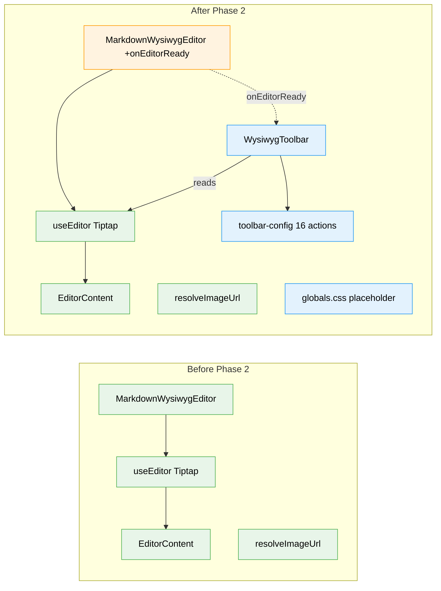

# Flight Plan: Phase 2 — Toolbar & Keyboard Shortcuts

**Plan**: [../../md-editor-plan.md](../../md-editor-plan.md)
**Phase**: Phase 2: Toolbar & Keyboard Shortcuts
**Generated**: 2026-04-18
**Status**: Landed (2026-04-18)

---

## Departure → Destination

**Where we are**: Phase 1 landed. `MarkdownWysiwygEditor` mounts, renders markdown as rich content, resolves image URLs, respects theme, and does not fire `onChange` on mount. But it has no user-visible controls — the only way to format text today is through markdown input rules (typing `# `, `**bold**`, etc.). There is no toolbar; no keyboard shortcut tooling surface; no empty-state placeholder styling; and the private Tiptap `Editor` instance is hidden inside the component.

**Where we're going**: A developer opening `/dev/markdown-wysiwyg-smoke` sees a 16-button toolbar above the editor (workshop § 2.3 layout). Clicking any button formats the selection; the pressed state lights up when the caret is inside that format. Buttons that don't apply in a code block grey out. Every button has a tooltip listing its keyboard shortcut. The placeholder "Start writing…" is visually grey on an empty doc. The harness smoke spec clicks Bold, sees `<strong>` in the DOM, and archives a screenshot.

---

## Domain Context

### Domains We're Changing

| Domain | What Changes | Key Files |
|--------|-------------|-----------|
| `_platform/viewer` | Add `WysiwygToolbar` component + button config module; additive `onEditorReady` callback on existing `MarkdownWysiwygEditor`; add custom `⌘Alt+C` keybinding via StarterKit code-block extension | `apps/web/src/features/_platform/viewer/components/wysiwyg-toolbar.tsx` (new), `lib/wysiwyg-toolbar-config.ts` (new), `components/markdown-wysiwyg-editor.tsx` (modify), `lib/wysiwyg-extensions.ts` (modify), `index.ts` (modify) |
| (infra) | Add Tiptap placeholder CSS to globals; extend dev smoke route with toolbar; extend harness smoke spec | `apps/web/app/globals.css`, `apps/web/app/dev/markdown-wysiwyg-smoke/page.tsx`, `harness/tests/smoke/markdown-wysiwyg-smoke.spec.ts` |

### Domains We Depend On (no changes)

| Domain | What We Consume | Contract |
|--------|----------------|----------|
| `@/components/ui/button` (shadcn) | `Button` with `variant={ghost\|secondary}`, `size="sm"` | Existing shadcn component |
| `lucide-react` | 16 icon components | `Heading1`, `Bold`, `Italic`, `Strikethrough`, `Code`, `List`, `ListOrdered`, `Quote`, `SquareCode`, `Minus`, `Link`, `Undo2`, `Redo2`, `Pilcrow` |
| `@tiptap/react` | `Editor` type + `.isActive()` / `.chain()` / `.can()` runtime APIs | Already installed in Phase 1 |
| `next-themes` | Wrapped by Phase 1 editor; no direct use in toolbar | `useTheme().resolvedTheme` (via Phase 1) |

---

## Flight Status

<!-- Updated by /plan-6-v2: pending → active → done. Use blocked for problems/input needed. -->

**Legend**: grey = pending | yellow = active | red = blocked/needs input | green = done

---

## Stages

<!-- Updated by /plan-6-v2 during implementation: [ ] → [~] → [x] -->

- [x] **Stage 1: Define types + button config** — declare `WysiwygToolbarProps`, `ToolbarAction`, `ToolbarGroup`, extend `MarkdownWysiwygEditorProps` with `onEditorReady`, declare the 16-action / 5-group config module (`lib/wysiwyg-extensions.ts`, `lib/wysiwyg-toolbar-config.ts` — new)
- [x] **Stage 2: Expose editor instance** — additive `onEditorReady` callback in Phase 1 editor (`components/markdown-wysiwyg-editor.tsx`)
- [x] **Stage 3: Build toolbar** — implement `WysiwygToolbar` rendering 16 shadcn-`Button`s + 4 dividers, overflow-x scroll, loading-state (`components/wysiwyg-toolbar.tsx` — new; `index.ts` export)
- [x] **Stage 4: Wire active/disabled** — populate `isActive(editor)` + `isDisabled(editor)` predicates; code-block disable rules; Undo/Redo via `editor.can()` (`wysiwyg-toolbar-config.ts`, `wysiwyg-toolbar.tsx`)
- [x] **Stage 5: Click handlers + ⌘Alt+C** — button onClick bindings; `Mod-Alt-c` is a StarterKit default, no custom registration needed
- [x] **Stage 6: Placeholder CSS** — ship workshop § 6.2 rule so empty-state placeholder renders visually (`app/globals.css`)
- [x] **Stage 7: Unit tests** — 10 React-mount cases + 14 headless markdown cases + 1 editor-onEditorReady case; 45/45 pass
- [x] **Stage 8: Harness smoke extension** — desktop + tablet pass; mobile deferred to Phase 6.4 — toolbar in dev route, Playwright clicks Bold + H2, screenshot to `harness/results/phase-2/` (`app/dev/.../page.tsx`, `harness/tests/smoke/markdown-wysiwyg-smoke.spec.ts`)

---

## Architecture: Before & After

**Legend**: existing (green, unchanged) | changed (orange, modified) | new (blue, created)

---

## Acceptance Criteria

- [x] All 16 toolbar buttons render with correct icons, `aria-label`, and shortcut tooltip (AC-04)
- [x] Toolbar actions mutate the editor on click (AC-04)
- [x] Active-state reflects caret context in real time (AC-04)
- [x] Disabled-state fires in code blocks for B / I / S / inline-code / Link / H1 / H2 / H3 (AC-04)
- [x] Undo/Redo buttons enable/disable from `editor.can()` (AC-04)
- [x] Every keyboard shortcut from workshop § 4 triggers its action (minus `⌘K` which is Phase 3) (AC-05 — StarterKit defaults; desktop+tablet harness)
- [x] `⌘Alt+C` keybinding toggles code block (verified in harness desktop + tablet) (AC-05)
- [x] Placeholder "Start writing…" is visually grey on empty doc (AC-16b)
- [x] Toolbar horizontally scrolls on narrow viewports (AC-14; smoke checks desktop + tablet — mobile variant verified in Phase 6.4)
- [x] `MarkdownWysiwygEditor` regression-free: 10 editor tests (9 Phase 1 + 1 `onEditorReady`) all pass
- [x] Harness smoke green (desktop + tablet); Phase 1 assertions preserved; toolbar screenshots at `harness/results/phase-2/`
- [x] No new `vi.mock` / `vi.fn` / `vi.spyOn` usage introduced (Constitution §4/§7)

## Goals & Non-Goals

**Goals**:
- 16-button toolbar visible and functional
- Full keyboard shortcut set (workshop § 4) — except `⌘K`
- Active + disabled state rendering
- Placeholder CSS shipped
- Editor instance accessible to callers via additive `onEditorReady` callback
- Harness smoke extended without losing Phase 1 coverage

**Non-Goals**:
- Link popover (Phase 3)
- FileViewerPanel integration (Phase 5)
- Front-matter real impl (Phase 4)
- Bundle-size gate (Phase 6.7)
- Mobile-specific harness verification (Phase 6.4)
- Tables / language-pill / error-fallback / a11y audit (Phases 5–6)

---

## Checklist

- [x] T001: Define types + 16-button config module
- [x] T002: Extend `MarkdownWysiwygEditor` with `onEditorReady`
- [x] T003: Implement `WysiwygToolbar` component
- [x] T004: Wire active + disabled state predicates
- [x] T005: Click handlers + `⌘Alt+C` custom keybinding
- [x] T006: Placeholder CSS in globals.css
- [x] T007: Unit tests (10 React-mount + 14 markdown + 1 editor onEditorReady — 45/45 pass)
- [x] T008: Harness smoke extension — desktop + tablet pass; Mod-Alt-C verified; screenshots in `harness/results/phase-2/`
