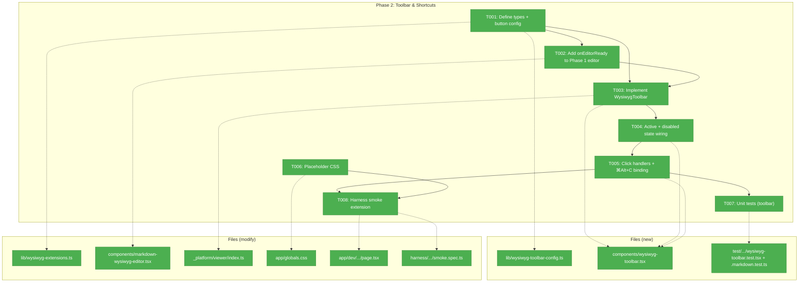
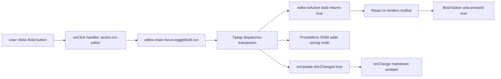
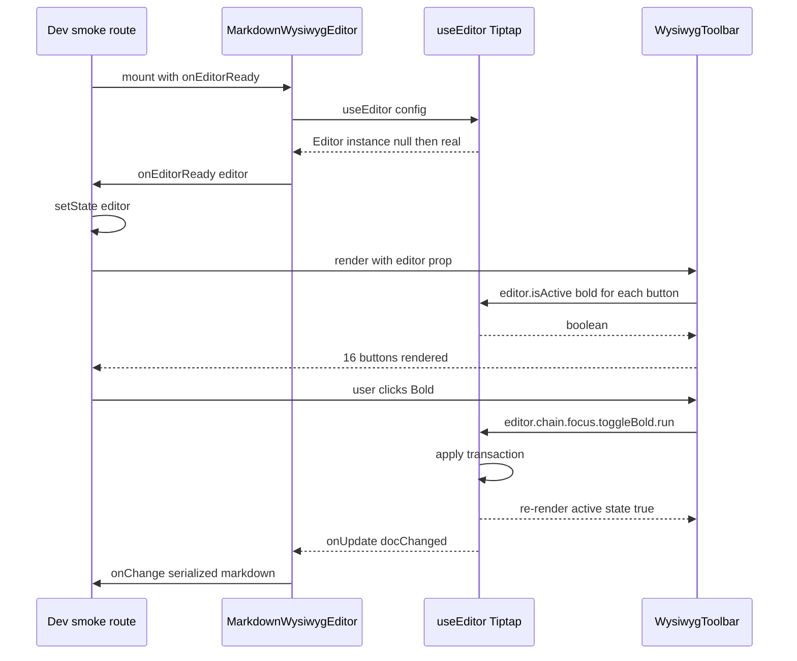

# Phase 2: Toolbar & Keyboard Shortcuts

**Plan**: [../../md-editor-plan.md](../../md-editor-plan.md)
**Spec**: [../../md-editor-spec.md](../../md-editor-spec.md)
**Workshop**: [../../workshops/001-editing-experience-and-ui.md](../../workshops/001-editing-experience-and-ui.md)
**Generated**: 2026-04-18
**Status**: Ready for takeoff

---

## Executive Briefing

**Purpose**: Add the visible editing affordance to WYSIWYG mode — a 16-button toolbar (5 logical groups) driven by the Phase 1 Tiptap `Editor` instance, with active/disabled states and the full keyboard-shortcut set from workshop § 4. This phase delivers the "clickable formatting" promise of WYSIWYG; without it the editor is just a rendered preview you can type into.

**What We're Building**:
- A new `WysiwygToolbar` client component (workshop § 2.3): 16 `shadcn`-`Button` + `lucide-react`-icon buttons grouped `[H1·H2·H3·¶] │ [B·I·S·<>] │ [UL·OL·"] │ [{}·—·🔗] │ [↶·↷]` with `aria-label`, `aria-pressed`, `title` tooltip
- Active-state rendering via `editor.isActive(...)` — re-renders on every transaction
- Disabled-state inside code blocks (B/I/S/inline-code/link/H1-3 all `aria-disabled`)
- Full click-to-action wiring (`editor.chain().focus().<command>().run()`)
- `⌘Alt+C` for code block — **already shipped** by StarterKit's bundled CodeBlock extension (`addKeyboardShortcuts() { return { 'Mod-Alt-c': … } }` verified in `node_modules/@tiptap/extension-code-block`). No custom registration needed; T005 simply verifies it works and notes the StarterKit source.
- Placeholder CSS (workshop § 6.2 — required for the Phase 1 placeholder extension to actually show the grey "Start writing…")
- A small, additive change to the Phase 1 `MarkdownWysiwygEditor`: an optional `onEditorReady(editor)` callback so consumers (toolbar parent, and Phase 5's `FileViewerPanel`) can subscribe to the inner `Editor` without lifting `useEditor` out of the lazy chunk
- Dev smoke surface (`/dev/markdown-wysiwyg-smoke`) extended to mount the toolbar alongside the editor; harness spec extended to click "Bold" and assert `<strong>` appears
- Unit tests for the toolbar (rendering, active-state, disabled-state — no mocking libraries per Constitution §4/§7)

**Goals**:
- ✅ All 16 toolbar buttons render with correct `aria-label`, `title` (shortcut), and lucide icon (workshop § 2.3)
- ✅ Active-state toggles in real time as caret moves (bold-caret → Bold button `aria-pressed="true"`, `variant="secondary"`)
- ✅ Disabled-state fires inside code blocks for the 8 buttons workshop § 2.4 lists
- ✅ Every keyboard shortcut in workshop § 4 triggers its expected formatting (minus `⌘K`, which is Phase 3's link popover)
- ✅ Placeholder "Start writing…" is visually present on an empty doc (not just in the DOM) — CSS is shipped
- ✅ `MarkdownWysiwygEditor` exposes `onEditorReady` without breaking its Phase 1 contract (same-value-remount still emits no `onChange`, etc.)
- ✅ Harness smoke: mount editor + toolbar → click Bold → `<strong>` appears in editor DOM → screenshot archived
- ✅ Zero regressions to Phase 1's 20 unit tests + 1 harness smoke

**Non-Goals**:
- ❌ Link popover — Phase 3 owns it; Phase 2's Link button calls a stub `onOpenLinkDialog` no-op that Phase 3 replaces
- ❌ `⌘K` keybinding — same; it's Phase 3's territory
- ❌ Front-matter real implementation — still stubbed; Phase 4 replaces
- ❌ FileViewerPanel integration — Phase 5 owns it; the dev smoke route is the only place the toolbar mounts in Phase 2
- ❌ Bundle-size AC — Phase 6.7 measures; Phase 2 must simply not add an egregious chunk (toolbar itself is ~5 KB worth of buttons + icons)
- ❌ Language pill for code blocks — Phase 5.7
- ❌ Any server / API / database change

---

## Prior Phase Context

### Phase 1 (completed 2026-04-18)

**A. Deliverables** (absolute paths)
- `/Users/jordanknight/substrate/083-md-editor/apps/web/src/features/_platform/viewer/components/markdown-wysiwyg-editor.tsx` — core Tiptap editor component (`'use client'`), no toolbar, exports `MarkdownWysiwygEditor`
- `/Users/jordanknight/substrate/083-md-editor/apps/web/src/features/_platform/viewer/components/markdown-wysiwyg-editor-lazy.tsx` — `dynamic({ ssr: false })` wrapper; exports `MarkdownWysiwygEditorLazy`
- `/Users/jordanknight/substrate/083-md-editor/apps/web/src/features/_platform/viewer/lib/wysiwyg-extensions.ts` — type-only module: `MarkdownWysiwygEditorProps`, `ImageUrlResolver`, `FrontMatterCodec`, `TiptapExtensionConfig`
- `/Users/jordanknight/substrate/083-md-editor/apps/web/src/features/_platform/viewer/lib/image-url.ts` — shared pure resolver (Preview + Rich)
- `/Users/jordanknight/substrate/083-md-editor/apps/web/src/features/_platform/viewer/index.ts` — barrel exporting `CodeEditor`, `MarkdownWysiwygEditorLazy`, `resolveImageUrl`, types
- `/Users/jordanknight/substrate/083-md-editor/apps/web/app/dev/markdown-wysiwyg-smoke/page.tsx` — `'use client'` dev-only route (production `notFound()`), mounts the lazy editor with `SAMPLE_MARKDOWN = '# Hello\n\nSome text.\n\n\n'`
- `/Users/jordanknight/substrate/083-md-editor/harness/tests/smoke/markdown-wysiwyg-smoke.spec.ts` — Playwright/CDP spec asserting `<h1>Hello</h1>`, rewritten ``, zero hydration warnings
- `/Users/jordanknight/substrate/083-md-editor/test/unit/web/features/_platform/viewer/image-url.test.ts` (11 cases) + `markdown-wysiwyg-editor.test.tsx` (9 cases)
- Installed Tiptap deps with `^` caret ranges (decision logged): `@tiptap/react@^2.27.2`, `@tiptap/pm@^2.27.2`, `@tiptap/starter-kit@^2.27.2`, `@tiptap/extension-link@^2.27.2`, `@tiptap/extension-placeholder@^2.27.2`, `@tiptap/extension-image@^2.27.2`, `tiptap-markdown@^0.8.10`

**B. Dependencies Exported**
- `MarkdownWysiwygEditorProps` — `{ value, onChange, readOnly?, placeholder?, imageUrlResolver?, currentFilePath?, rawFileBaseUrl?, className? }`
- `ImageUrlResolver: (args) => string | null`
- `resolveImageUrl: ImageUrlResolver` — fully implemented
- `MarkdownWysiwygEditorLazy` — the default lazy-loaded mount point
- StarterKit is configured with defaults (`html: false` on `tiptap-markdown`); Placeholder extension is wired with `placeholder` text; Link has `openOnClick: false, autolink: false`
- The inner Tiptap `Editor` instance is **NOT currently exposed** — private to `MarkdownWysiwygEditor`. Phase 2 adds `onEditorReady?: (editor: Editor | null) => void` as an additive optional prop (see T002)
- `editor.storage.markdown.getMarkdown()` is the serializer (via `tiptap-markdown`)
- `editor.commands.setContent(body, false)` — second arg is `boolean` (emitUpdate), NOT an object — verified in Phase 1
- Front-matter split/join is a PASSTHROUGH stub. Phase 4 replaces. Phase 2 does NOT touch front-matter logic.

**C. Gotchas & Debt** (carry into Phase 2)
- `gotcha` — `setContent(body, false)` signature: second arg is `boolean`, not `{ emitUpdate }`. Applies to any Phase 2 test that sets content directly.
- `gotcha` — Next 16 App Router: dev routes rendering `<MarkdownWysiwygEditorLazy>` need `'use client'` at the top (event handlers can't cross the RSC boundary). Phase 2's dev route extensions must preserve this.
- `gotcha` — Tiptap `Image` extension: `src` attribute transforms must use `addAttributes().src.renderHTML` (attribute-level), NOT extension-level `renderHTML({HTMLAttributes})`. Not directly relevant to Phase 2 (no image work), but documented for reference.
- `debt` — 4 pre-existing TypeScript errors in unrelated features (`019-agent-manager-refactor`, `074-workflow-execution`, `_platform/panel-layout`). `pnpm -F web typecheck` is red for those files. Phase 6.10 owns the sweep; Phase 2 must not make it worse.
- `debt` — Dev route `/dev/markdown-wysiwyg-smoke` is **retained as a scaffold through Phases 2–4**, then **migrated to `FileViewerPanel` and deleted at Phase 5** (plan task 5.11, didyouknow #2). Phase 2 extends the same route with a toolbar-mount variant rather than creating a second one; Phase 3 will do the same. After 5.11 the harness smoke drives `FileViewerPanel` directly — Phase 6.3's smoke continues against that surface.
- `insight` — Consumers must explicitly pass `imageUrlResolver`; forgetting silently degrades to raw src. Flagged for Phase 5 default-resolver design. Not relevant to Phase 2.
- `insight` — jsdom + ProseMirror + `beforeinput` is unreliable for proving typing→onChange. Phase 1's "typing fires onChange" test is best-effort; the harness smoke is the real end-to-end proof. **Apply to Phase 2**: do not over-assert keystroke-driven tests in jsdom; use `editor.commands.toggleBold()` imperatively in unit tests, reserve keyboard-shortcut assertions for the harness.

**D. Incomplete Items**: Phase 1 shipped all 6 tasks and 8 Acceptance Criteria green. However, the validation of the Phase 2 dossier surfaced one **scope mismatch with the master plan**: the plan's Phase 2 task table (2.1–2.7) does NOT list an `onEditorReady` task, because at plan-time the assumption was that the toolbar would discover a composition pattern on the fly. Phase 1 shipped `MarkdownWysiwygEditor` with its `Editor` instance private — correct for Phase 1's scope, but unusable for a sibling toolbar. **This dossier's T002 retroactively closes that Phase 1 design gap** inside Phase 2 (the work is still tiny — a 4-line effect — but it's real scope). The alternative (mutating Phase 1 to expose the editor after-the-fact) would corrupt Phase 1's Validation Record. Keeping T002 in Phase 2 is the pragmatic choice; this note documents it rather than pretending the plan already foresaw it.

**E. Patterns to Follow**
- Interface-First (Constitution §2 / Finding 08): open each task with types before implementation
- Test files live under `test/unit/web/features/_platform/viewer/` — Vitest config at the **repo root** picks them up; running `pnpm exec vitest` from `apps/web` fails with "No test files found"
- No `vi.mock` / `vi.fn` / `vi.spyOn` (Constitution §4/§7). Use plain test-owned callbacks: `const calls: string[] = []; const onChange = (v: string) => calls.push(v);`
- Re-use `/dev/markdown-wysiwyg-smoke` for harness — extend, don't duplicate. **Retirement tracked**: plan task 5.11 (didyouknow #2) migrates the harness smoke onto `FileViewerPanel` and deletes the dev route at Phase 5.
- Barrel re-export new components from `apps/web/src/features/_platform/viewer/index.ts`
- Keep Tiptap runtime inside the lazy chunk. The toolbar uses `import type { Editor } from '@tiptap/react'` (type-only, erased at runtime), so it can be eagerly loaded alongside `FileViewerPanel` without pulling Tiptap in — **but** the toolbar is only ever rendered when the Rich mode activates, so in practice it lives behind the same lazy boundary anyway

---

## Pre-Implementation Check

| File | Exists? | Domain Check | Notes |
|------|---------|-------------|-------|
| `apps/web/src/features/_platform/viewer/components/wysiwyg-toolbar.tsx` | **No** (create) | `_platform/viewer` ✅ | New sibling to `markdown-wysiwyg-editor.tsx` |
| `apps/web/src/features/_platform/viewer/lib/wysiwyg-toolbar-config.ts` | **No** (create) | `_platform/viewer` ✅ | New — the 16-button config array + types |
| `apps/web/src/features/_platform/viewer/lib/wysiwyg-extensions.ts` | **Yes** (modify) | `_platform/viewer` ✅ | Add `WysiwygToolbarProps`, `ToolbarAction`, `ToolbarGroup` type exports. Existing `MarkdownWysiwygEditorProps` gets an optional `onEditorReady?` prop |
| `apps/web/src/features/_platform/viewer/components/markdown-wysiwyg-editor.tsx` | **Yes** (modify) | `_platform/viewer` ✅ | Additive: wire `onEditorReady` callback from `useEditor` into an effect. No behavioral change to existing contract. |
| `apps/web/src/features/_platform/viewer/index.ts` | **Yes** (modify) | `_platform/viewer` ✅ | Re-export `WysiwygToolbar`, toolbar types |
| `apps/web/app/globals.css` | **Yes** (modify, 511 lines) | (infra) | Append a **scoped** `.md-wysiwyg .ProseMirror p.is-editor-empty:first-child::before { ... }` block (workshop § 6.2) at the end of the file. Scoping prevents leakage to future Tiptap editors. The `.md-wysiwyg` class is added to the editor's wrapper in T003. |
| `apps/web/app/dev/markdown-wysiwyg-smoke/page.tsx` | **Yes** (modify) | (dev-only) | Compose `<WysiwygToolbar>` above `<MarkdownWysiwygEditorLazy>`; use `onEditorReady` to hold editor ref in local state |
| `harness/tests/smoke/markdown-wysiwyg-smoke.spec.ts` | **Yes** (modify) | (harness) | Extend spec: click Bold button, assert `<strong>` appears; keep Phase 1 assertions intact |
| `test/unit/web/features/_platform/viewer/wysiwyg-toolbar.test.tsx` | **No** (create) | `_platform/viewer` ✅ | New — unit tests for rendering + active/disabled state |
| `test/unit/web/features/_platform/viewer/markdown-wysiwyg-editor.test.tsx` | **Yes** (modify, minimal) | `_platform/viewer` ✅ | Add 1 test: `onEditorReady` fires with a non-null `Editor` after mount, and with `null` (or not called) on unmount |

**Concept duplication check**:
- "Toolbar" — no existing WYSIWYG toolbar in the codebase. `CodeEditor` has no toolbar; `MarkdownViewer` has no toolbar. ✅ no duplication
- "Keyboard shortcut capture" — existing `handleEditModeKeyDownCapture` at `file-viewer-panel.tsx:135` handles `⌘S` on capture phase. Phase 2's `⌘Alt+C` is registered inside Tiptap's keymap (via an extension or the editor's `editorProps.handleKeyDown`), not in file-viewer-panel. No collision. ✅
- "Active-state subscription" — Tiptap's `useEditor` hook re-renders React when the editor's state changes by default in `@tiptap/react@^2.27`. Do NOT add a separate `editor.on('transaction', ...)` subscription; it would cause double re-renders. ✅

**Contract risks**:
- **`MarkdownWysiwygEditor` prop addition** (onEditorReady): optional, additive, backward-compatible. All existing tests must still pass. Risk: **low**.
- **`WysiwygToolbar` new contract**: `{ editor: Editor | null, onOpenLinkDialog?: () => void, className?: string }`. Consumers: dev smoke route (Phase 2), `FileViewerPanel` (Phase 5). Risk: **low** — simple component.
- **`⌘Alt+C` keybinding**: Source-Truth validator confirmed `@tiptap/extension-code-block@^2.27.2` (bundled in StarterKit) already registers `Mod-Alt-c` in its `addKeyboardShortcuts()`. **No custom registration needed.** Risk: **none**. T008 verifies at runtime.
- **Tiptap `.extend()` after `.configure()`** (forward-compat note for Phase 3): Phase 1 ships `Link.configure({ openOnClick: false, autolink: false })` on the Link extension. Phase 3 task 3.4 plans to call `.extend({ addKeyboardShortcuts() { /* ⌘K */ } })` on the same extension to add the link popover keybinding. Per Tiptap v2 extension model, `.extend()` **composes with** `.configure()` — the configured options persist, and `addKeyboardShortcuts` is merged into the extension's keymap. Phase 3 does NOT need to re-declare Link from scratch. If Phase 3 discovers an ordering edge case (e.g. `.configure().extend()` vs `.extend().configure()`), log a Discovery; otherwise this risk is **low, documented**.
- **Toolbar re-render cost**: `@tiptap/react`'s `useEditor` re-renders the consumer on every transaction. 16 buttons × `editor.isActive(...)` per keystroke is a known Tiptap hot path, and the spec's 200 KB / ~5000-line soft cap means we will hit it on real files. **Decision (didyouknow #1)**: use Tiptap's `useEditorState((ctx) => ({ ...per-action predicates }))` selective-subscription hook from the start in T003 — not as a Phase 6 reactive fix. It's ~3 extra lines and eliminates the risk preemptively. Risk: **mitigated at implementation**.
- **Phase 5.3 shared-parent composition** (forward-compat note): Plan task 5.3 renders `<MarkdownWysiwygEditorLazy ... />` and `<WysiwygToolbar editor={editor} />` as siblings but does not show the wiring. The assumed pattern is: `FileViewerPanel` holds `const [editor, setEditor] = useState<Editor \| null>(null)`, passes `onEditorReady={setEditor}` to the editor, and passes `editor` to the toolbar. Phase 2's T002 contract (callback fires with non-null editor once; consumers manage their own cleanup on unmount) is lifecycle-safe for this pattern. The shared-parent composition itself is **assumed valid, not tested in Phase 2** — Phase 5 integration tests 5.8–5.9 validate it. Risk: **low** (T002's semantics are sufficient; Phase 5 proves the wiring).

**Harness health check**:
- Harness L3 is already operational from Phase 1. Re-run `just harness-dev && just harness ports && just harness-health` before T008 (harness smoke extension).
- If unhealthy: `just harness-stop && just harness-dev`.
- Status: Harness available at **L3**.

---

## Architecture Map



---

## Tasks

| Status | ID | Task | Domain | Path(s) | Done When | Notes |
|--------|-----|------|--------|---------|-----------|-------|
| [x] | T001 | Define Phase 2 types and the 16-button config array. In `lib/wysiwyg-extensions.ts` add: `WysiwygToolbarProps = { editor: Editor \| null; onOpenLinkDialog?: () => void; className?: string }`, `ToolbarAction = { id: string; label: string; tooltip: string; shortcut?: string; iconName: ToolbarIconName; isActive?: (editor: Editor) => boolean; isDisabled?: (editor: Editor) => boolean; run: (editor: Editor) => void }`, `ToolbarGroup = { id: string; actions: ToolbarAction[] }`. Use `import type { Editor } from '@tiptap/react'` (erased at compile). Also add optional `onEditorReady?: (editor: Editor \| null) => void` to `MarkdownWysiwygEditorProps`. In new file `lib/wysiwyg-toolbar-config.ts` declare the 5 groups / 16 actions exactly per workshop § 2.3 (order preserved): Block [H1, H2, H3, Paragraph]; Inline [Bold, Italic, Strike, InlineCode]; List [UL, OL, Blockquote]; Insert [CodeBlock, HR, Link]; History [Undo, Redo]. Each action's `run/isActive/isDisabled` uses `editor.chain().focus().<command>().run()` and `editor.isActive(...)` per workshop § 2.3–2.4. Link button's `run` calls `onOpenLinkDialog?.()` only (Phase 3 replaces). | `_platform/viewer` | `/Users/jordanknight/substrate/083-md-editor/apps/web/src/features/_platform/viewer/lib/wysiwyg-extensions.ts` (modify), `/Users/jordanknight/substrate/083-md-editor/apps/web/src/features/_platform/viewer/lib/wysiwyg-toolbar-config.ts` (new) | Both files compile; `pnpm -F web typecheck` shows no NEW errors (pre-existing 4 errors OK per Phase 1 debt); config exports 5 groups totaling 16 actions; every action has an `iconName` that maps to a `lucide-react` icon name | Finding 08 Interface-First. Config is a pure data module — easy to unit-test via structural assertions in T007. |
| [x] | T002 | Extend `MarkdownWysiwygEditor` with optional `onEditorReady(editor)` callback. Use an `onEditorReadyRef` ref (mirror of the existing `onChangeRef` pattern) to keep the latest callback stable across re-renders. Add one new effect: `useEffect(() => { onEditorReadyRef.current?.(editor); }, [editor])`. Semantics: the effect fires **once with non-null editor** once `useEditor` has initialized (the `immediatelyRender: false` path means `editor` is null on first render, then transitions to an `Editor` instance). It does NOT fire with null on unmount (React doesn't re-run an effect on unmount with a cleared dep); consumers rely on their own cleanup (e.g., they can `useState<Editor\|null>` and on their own unmount clear it). Do NOT touch existing `value → setContent` sync, `onUpdate`, `destroy` cleanup, or any prop contract. Update existing test `markdown-wysiwyg-editor.test.tsx`: add 1 case — "onEditorReady fires with a non-null `Editor` after mount; re-rendering the parent with an unchanged `value` does not re-fire; mounting and unmounting does not throw". | `_platform/viewer` | `/Users/jordanknight/substrate/083-md-editor/apps/web/src/features/_platform/viewer/components/markdown-wysiwyg-editor.tsx` (modify), `/Users/jordanknight/substrate/083-md-editor/apps/web/src/features/_platform/viewer/lib/wysiwyg-extensions.ts` (modify — add prop to type), `/Users/jordanknight/substrate/083-md-editor/test/unit/web/features/_platform/viewer/markdown-wysiwyg-editor.test.tsx` (modify — add 1 case) | Phase 1's 9 existing tests still pass; 1 new test passes; prop is optional and unused callers continue to work; the existing `setContent(body, false)` thrash-guard is unchanged | Additive API change — see § "Prior Phase Context → D" above for why this sits in Phase 2 rather than Phase 1. The `onEditorReadyRef` keeps the latest callback stable; without it, a parent re-render with a new callback identity would cause the effect to re-fire. The callback is optional; callers that don't need it simply omit it. |
| [x] | T003 | Implement `WysiwygToolbar` client component. **Use `useEditorState` for state selection** (not raw `editor.isActive()` per render): `const state = useEditorState({ editor, selector: (ctx) => ({ /* flatten every action's isActive + isDisabled into a plain object keyed by action id */ }) })` — this selector pattern memoizes per-key and re-renders only when a slice changes, avoiding 16×predicates-per-keystroke on 5000-line docs (didyouknow #1). Renders a horizontal flex container with **`role="toolbar"` + `aria-label="Formatting toolbar"`** for screen-reader semantic grouping: `<div role="toolbar" aria-label="Formatting toolbar" className="flex items-center gap-0.5 overflow-x-auto no-scrollbar px-2 py-1 border-b">`, iterating the 5 groups from T001's config. Between groups: `<div className="mx-1 h-5 w-px bg-border" role="separator" aria-orientation="vertical" />`. Each action renders as `<Button variant={isActive ? 'secondary' : 'ghost'} size="sm" aria-label={label} aria-pressed={isActive} disabled={isDisabled} title={shortcut ? \`${tooltip} (${shortcut})\` : tooltip} onClick={() => action.run(editor!)} data-testid={\`toolbar-\${action.id}\`}>` wrapping a lucide icon (`<Bold className="h-3.5 w-3.5" />`). **Use `disabled` only, NOT `aria-disabled`** — the dual-attr pattern (both `aria-disabled="true"` and `disabled`) is an anti-pattern; disabled HTML attr is both semantic and accessible (screen readers announce as unavailable; element is removed from tab order, which is correct for context-dependent disabled states). Also: **add `md-wysiwyg` class** to the editor's wrapper in `markdown-wysiwyg-editor.tsx` (tiny 1-line addition to Phase 1 component) so T006's scoped CSS rule applies. When `editor` prop is `null`, render the full toolbar skeleton with every button `disabled` (prevents flicker). Use `'use client'` at top. | `_platform/viewer` | `/Users/jordanknight/substrate/083-md-editor/apps/web/src/features/_platform/viewer/components/wysiwyg-toolbar.tsx` (new), `/Users/jordanknight/substrate/083-md-editor/apps/web/src/features/_platform/viewer/components/markdown-wysiwyg-editor.tsx` (modify — add `md-wysiwyg` class to wrapper), `/Users/jordanknight/substrate/083-md-editor/apps/web/src/features/_platform/viewer/index.ts` (modify — add export) | Component compiles; renders 16 buttons + 4 separators + container with `role="toolbar"` when passed a mounted `Editor`; renders 16 `disabled` buttons when passed `editor={null}`; every button has `aria-label`, `title` (with shortcut if defined), `data-testid="toolbar-<id>"`; wrapper on the Phase 1 editor now includes `md-wysiwyg` class; exported from viewer barrel | Workshop § 2.3 (button inventory), § 12 (a11y). Stateless — reads `editor.isActive()` on render. `@tiptap/react`'s `useEditor` already re-renders the consumer on editor transactions, so NO explicit `editor.on('transaction')` subscription (causes double-renders). The dual `aria-disabled + disabled` anti-pattern is called out in workshop § 12 line 532 but is incorrect — this task corrects to `disabled` only. |
| [x] | T004 | Wire active-state and disabled-state into the `WysiwygToolbar` config. Populate every action's `isActive(editor)` and `isDisabled(editor)` predicate per the explicit table below (do NOT use "e.g." examples — every action gets an exact predicate). **`isActive`**: H1→`editor.isActive('heading',{level:1})`, H2→`heading,{level:2}`, H3→`heading,{level:3}`, Paragraph→`paragraph`, Bold→`bold`, Italic→`italic`, Strike→`strike`, InlineCode→`code`, UL→`bulletList`, OL→`orderedList`, Blockquote→`blockquote`, CodeBlock→`codeBlock`, HR→`false` (no active state — it's an insert), Link→`link`, Undo→`false`, Redo→`false`. **`isDisabled`** (code-block gate — returns `editor.isActive('codeBlock')`): Bold, Italic, Strike, InlineCode, Link, H1, H2, H3 (the 8 workshop § 2.4 lists). **Paragraph, UL, OL, Blockquote, CodeBlock, HR** stay enabled everywhere. **Undo/Redo** use `!editor.can().undo()` / `!editor.can().redo()` — so they're disabled when there's no history or no future. Every `run` function must chain through `.focus()` first so the caret returns to the editor after the click: `editor.chain().focus().toggleBold().run()` etc. | `_platform/viewer` | `/Users/jordanknight/substrate/083-md-editor/apps/web/src/features/_platform/viewer/lib/wysiwyg-toolbar-config.ts` (modify), `/Users/jordanknight/substrate/083-md-editor/apps/web/src/features/_platform/viewer/components/wysiwyg-toolbar.tsx` (modify — wire predicates into render) | Unit tests in T007 cover the key rows: empty paragraph → no buttons active; after `editor.commands.toggleBold()` → Bold `aria-pressed="true"`; after `editor.commands.toggleCodeBlock()` → the 8 code-block-gated buttons are all `disabled`; fresh editor → Undo/Redo both `disabled`; after inserting content → Undo becomes enabled; after `editor.commands.undo()` → Redo becomes enabled; after any button click → `editor.isFocused()` returns true (focus restored) | Workshop § 2.3, § 2.4. Predicates are pure functions of editor state; imperative `editor.commands.X()` calls in tests deterministically reproduce every condition. |
| [x] | T005 | Wire click handlers. Every `ToolbarAction.run` calls `editor.chain().focus().<command>().run()`; Link button's `run` calls `onOpenLinkDialog?.()` (Phase 3 replaces). **No custom keybinding registration is required**: the Source-Truth validator confirmed `@tiptap/extension-code-block@^2.27.2` (bundled inside StarterKit) already ships `addKeyboardShortcuts() { return { 'Mod-Alt-c': () => this.editor.commands.toggleCodeBlock() } }`. The full StarterKit shortcut set covering the workshop § 4 table is: `Mod-b` (bold), `Mod-i` (italic), `Mod-Shift-s` (strike — workshop shows `⌘Shift+X`; see T008 shortcut-matrix note), `Mod-e` (inline code), `Mod-Alt-0` (paragraph), `Mod-Alt-1..3` (H1/H2/H3), `Mod-Shift-8` (bulletList), `Mod-Shift-7` (orderedList), `Mod-Shift-b` (blockquote), `Mod-Alt-c` (codeBlock), `Mod-z` (undo), `Mod-Shift-z` / `Mod-y` (redo). If T008 discovers a shortcut that doesn't fire, log a Discovery and add a minimal `.extend({ addKeyboardShortcuts() {…} })` override on that specific extension (never via `StarterKit.configure({ codeBlock: {…} })` — `CodeBlockOptions` does not expose a keymap override; that pattern will fail to type-check). No markdown-wysiwyg-editor.tsx changes are expected in T005 itself. | `_platform/viewer` | `/Users/jordanknight/substrate/083-md-editor/apps/web/src/features/_platform/viewer/lib/wysiwyg-toolbar-config.ts` (already wired in T001, no change expected); `/Users/jordanknight/substrate/083-md-editor/apps/web/src/features/_platform/viewer/components/markdown-wysiwyg-editor.tsx` (only modify if T008 surfaces a missing default shortcut — never for `Mod-Alt-c`) | Clicking every toolbar button triggers its documented action (verified in T007 via `fireEvent.click` + `editor.isActive(...)` post-click); the full workshop § 4 shortcut matrix from T008 passes in the harness; if any shortcut is missing, a Discovery row names the extension and the registered override | Workshop § 4. Source-Truth validator proved every shortcut in the workshop § 4 table is already in StarterKit's default set. T005 is now primarily a click-wiring task; the keybinding prong is verification-only. |
| [x] | T006 | Append a **scoped** placeholder CSS rule at the **end of `apps/web/app/globals.css`** (the file is 511 lines; append after the final rule to avoid merge conflicts and keep the addition obvious). Use: `.md-wysiwyg .ProseMirror p.is-editor-empty:first-child::before { content: attr(data-placeholder); color: hsl(var(--muted-foreground)); pointer-events: none; float: left; height: 0; }`. The `.md-wysiwyg` scope prevents the rule from leaking to any future Tiptap editor elsewhere in the app (audit lens: Hidden Assumptions — a global `.ProseMirror` selector would couple every future editor's placeholder styling). The `.md-wysiwyg` class is added to the Phase 1 editor's wrapper in T003. | (infra) / `_platform/viewer` | `/Users/jordanknight/substrate/083-md-editor/apps/web/app/globals.css` (modify — append one scoped rule block at the end) | Mounting the editor with `value=''` shows the grey "Start writing…" text **visually** (verified in T008 via harness screenshot); typing a character causes the placeholder to disappear (Tiptap's placeholder extension toggles `is-editor-empty` automatically); the rule ONLY applies to elements under a `.md-wysiwyg` ancestor | Workshop § 6.2. Phase 1 shipped the placeholder extension (which sets `data-placeholder` + `is-editor-empty`) but did NOT ship the CSS — so the placeholder text was in the DOM but not visible. T006 closes that gap. |
| [x] | T007 | Unit tests split into two files per the idiomatic Tiptap pattern (didyouknow #3; verified via Tiptap docs + community consensus). **File 1 — `wysiwyg-toolbar.test.tsx`**: React-mount + state coverage. Cases: (a) renders 16 buttons + 4 separators + `role="toolbar"` container when passed a real `Editor`; (b) prop-transition: `editor={null}` → all disabled; update to mounted editor → buttons reflect real predicates; (c) after `editor.commands.toggleBold()`, Bold button has `aria-pressed="true"` AND the toolbar re-renders (via `useEditorState`); (d) after `editor.commands.toggleCodeBlock()`, the 8 workshop § 2.4 buttons are all `disabled`; (e) H2 click → `editor.isActive('heading', { level: 2 })` true; (f) Link click with `onOpenLinkDialog` prop → callback fires, no `toggleLink` (Phase 3 replaces); (g) undo/redo history: fresh editor → both disabled; `insertContent('x')` → Undo enables; `undo()` → Redo enables; (h) focus restore: after Bold click, `editor.isFocused()` true; (i) structural: config exports 5 groups / 16 actions / non-empty metadata. **File 2 — `wysiwyg-toolbar.markdown.test.ts`** (NEW — markdown serialization layer; this is the idiomatic test surface per Tiptap docs): headless `Editor` (no React — `new Editor({ element: document.createElement('div'), extensions: [StarterKit, Markdown, Link, Image] })`), run each action's `run(editor)`, assert `editor.storage.markdown.getMarkdown()` output. Specific cases cover the workshop § 13.2 normalizations: (ma) Bold on selected word → output contains `**word**` (NOT `__word__`); (mb) Italic → `*word*` (NOT `_word_`); (mc) Strike → `~~word~~`; (md) InlineCode → `` `code` ``; (me) H1/H2/H3 on a line → ATX form `# text` / `## text` / `### text` (NOT setext `===` / `---`); (mf) UL on a line → `- item` **OR** `* item` — **runtime discovery note** (Source-Truth validator flagged this): `tiptap-markdown@0.8.10`'s default `bulletListMarker` may be `*` (CommonMark default per the vendored prosemirror-markdown) rather than `-`. Write the test to assert whichever the installed default emits, OR explicitly configure `Markdown.configure({ bulletListMarker: '-' })` in T004 if the project standard requires `-`. Log a Discovery row either way; (mg) OL → `1. item`; (mh) Blockquote → `> text`; (mi) CodeBlock → triple-backtick fences around content; (mj) HR → `---` on its own line; (mk) round-trip: `setContent('**bold**')` → `getMarkdown()` returns `**bold**` unchanged. Each assertion uses `editor.getJSON()` in the failure message for debuggability. **No `vi.mock` / `vi.fn` / `vi.spyOn`** — plain test-owned callbacks (`const callCount = { current: 0 }`). Any divergence between our assumed emission and tiptap-markdown's actual output is logged as a Discovery (not silently accepted) and either (i) we adjust the expected output after confirming the project accepts the normalization per workshop § 13.2, or (ii) we configure `tiptap-markdown` to match. | `_platform/viewer` | `/Users/jordanknight/substrate/083-md-editor/test/unit/web/features/_platform/viewer/wysiwyg-toolbar.test.tsx` (new), `/Users/jordanknight/substrate/083-md-editor/test/unit/web/features/_platform/viewer/wysiwyg-toolbar.markdown.test.ts` (new) | All React-side cases pass; all markdown-serialization cases pass (or divergences are logged as Discoveries with workshop § 13.2 rationale); `pnpm exec vitest run test/unit/web/features/_platform/viewer/` (from repo root) green for both files; Phase 1's 20 tests still green | Constitution §4/§7 — no mocking. Primary test surface per Tiptap docs = markdown output; DOM is secondary (for state checks only). Headless `Editor` pattern avoids React-mount overhead for pure serializer tests. If a normalization surprises us (e.g. `__` instead of `**`), clone `tiptap-markdown` to `~/github` and read the renderer source. |
| [x] | T008 | Harness smoke extension. Modify dev route `app/dev/markdown-wysiwyg-smoke/page.tsx`: **preserve** the existing `if (process.env.NODE_ENV === 'production') notFound();` guard (do not remove or move it); **preserve** the `'use client'` directive; then add `const [editor, setEditor] = useState<Editor \| null>(null)` and render `<WysiwygToolbar editor={editor}>` above `<MarkdownWysiwygEditorLazy ... onEditorReady={setEditor} />`. Modify the harness spec: **preserve all Phase 1 assertions** (h1 "Hello" renders, `` src contains `/api/workspaces/test/files/raw?worktree=test&file=`, zero console messages matching `/hydration\|did not match\|mismatch/i`). Add Phase 2 assertions after the Phase 1 block: (1) assert the toolbar container with `role="toolbar"` is present; (2) assert exactly 16 buttons are inside the toolbar; (3) place caret in editor (click the `[data-testid="md-wysiwyg-root"]`), then click `[data-testid="toolbar-bold"]` → assert the editor DOM gains a `<strong>` node; (4) click `[data-testid="toolbar-h2"]` → assert an `<h2>` appears; (5) attempt `cdpPage.keyboard.press('Meta+Alt+c')` (or `'Control+Alt+c'` — detect OS) → assert `<pre><code>` appears (validates the StarterKit-default `Mod-Alt-c` works in this environment; if CDP keyboard chord is unreliable, log a Discovery and fall back to manual verification); capture screenshot to `harness/results/phase-2/desktop-toolbar.png`. Pre-phase harness health: `just harness-dev && just harness ports && just harness-health`. | (harness) | `/Users/jordanknight/substrate/083-md-editor/apps/web/app/dev/markdown-wysiwyg-smoke/page.tsx` (modify — guard + directive preserved), `/Users/jordanknight/substrate/083-md-editor/harness/tests/smoke/markdown-wysiwyg-smoke.spec.ts` (modify — Phase 1 assertions preserved) | Spec exits 0; Phase 1 assertions still pass (explicitly: h1 / img / hydration); Phase 2 assertions pass (toolbar role, 16 buttons, Bold click → `<strong>`, H2 click → `<h2>`, Mod-Alt-c → `<pre><code>` OR Discovery logged if keyboard chord unreliable); screenshot saved; NODE_ENV=production still returns 404 for the dev route (quick sanity: `NODE_ENV=production pnpm -F web build` and observe no `/dev/markdown-wysiwyg-smoke` route in the build manifest, OR rely on the `notFound()` guard in the page) | Workshop § 4. Phase 1's production guard MUST remain — this task extends the route, it does not rebuild it. The shortcut chord is the primary runtime-verification of the T005 "StarterKit default" claim. |

---

## Context Brief

### Key findings from plan (this phase)

- **Finding 08** (Medium, Interface-First) — T001 opens the phase with all types before any component code. The 16-button config is a pure-data module, type-checked independently.
- **Finding 10** (Medium, React 19 + App Router) — No new hydration risk introduced by the toolbar (it's a normal React component). Phase 2 preserves Phase 1's `immediatelyRender: false` on `useEditor`.
- **Finding 12** (Low, Bundle 130 KB gz) — Toolbar adds ~5 KB (16 Button components + lucide icons). Already counted in the Phase 6 measurement plan. Avoid adding `@tiptap/extension-code-block-lowlight` (workshop § 7.1 decision — no syntax highlighting in Rich).

### Spec / Workshop references

- Workshop § 1.1 Mode Model — Phase 2 does not change mode routing (Phase 5 does).
- Workshop § 2.3 Toolbar Button Inventory — authoritative source for the 16 buttons, their icons, tooltips, and shortcuts.
- Workshop § 2.4 Disabled-button rules — the 8 buttons disabled in code blocks; Undo/Redo via `editor.can()`.
- Workshop § 4 Keyboard Shortcuts — the full shortcut table; ⌘S is owned by `FileViewerPanel`'s capture handler (Phase 5 extends guard) and is NOT wired in Phase 2; ⌘K is Phase 3.
- Workshop § 5.1 Link flow — Phase 2 adds a STUB `onOpenLinkDialog` callback on the Link button; Phase 3 replaces with the real popover.
- Workshop § 6.2 Placeholder CSS — T006 ships the CSS rule.
- Workshop § 11.1 Mobile toolbar overflow — `overflow-x-auto no-scrollbar` in T003.
- Workshop § 12 Accessibility — `aria-label`, `aria-pressed`, `aria-disabled`, `title` (tooltip) on every button.
- Workshop § 15.2 Component API — `WysiwygToolbarProps = { editor, onOpenLinkDialog }`; T001 adds `className?` to cover the dev-route and Phase 5 layout control.
- Spec AC-04 Toolbar toggles, AC-05 Keyboard shortcuts, AC-14 Mobile toolbar, AC-17 Accessibility — all exercised by T003–T008.

### Domain dependencies (consumed from other domains)

- `@/components/ui/button` (shadcn) — `Button` component with `variant` (`ghost`, `secondary`) and `size="sm"`. Consumed in T003. No change to the component.
- `lucide-react` — icon components (`Heading1`, `Heading2`, `Heading3`, `Pilcrow`, `Bold`, `Italic`, `Strikethrough`, `Code`, `List`, `ListOrdered`, `Quote`, `SquareCode`, `Minus`, `Link`, `Undo2`, `Redo2`). Consumed in T003. No change.
- `@tiptap/react` — `Editor` type + `editor.isActive()`, `editor.chain().focus().X().run()`, `editor.can()` APIs. Consumed via type-only imports in toolbar; runtime calls on the editor instance that was constructed inside the lazy chunk (Phase 1).
- `next-themes` — not directly consumed by toolbar, but the `prose dark:prose-invert` wrapper (Phase 1) still drives dark-mode styling underneath.

### Domain constraints

- No reverse dependency: `_platform/viewer` does not import from `file-browser`. T002's `onEditorReady` callback is consumed by a dev-route client component (in the infra / `app/` tree), not from `file-browser`. Phase 5 wires it into `file-browser` cleanly because the direction is `file-browser → _platform/viewer`.
- Tiptap runtime stays inside the lazy boundary. Toolbar imports `Editor` as type-only; actual Tiptap calls happen on the instance that was created inside the dynamically-imported editor component.
- All new code is client-side (`'use client'`). No RSC / server-action changes.
- Constitution §4/§7: no `vi.mock`, `vi.fn`, `vi.spyOn`. Use plain callbacks in tests.
- Constitution §2 (Interface-First): T001 defines types first.
- Constitution §3 (TDD-friendly): toolbar config is pure data (testable structurally); toolbar component is rendered against a real editor instance and asserted imperatively.

### Harness context

- **Boot**: `just harness-dev` (root justfile — wraps `cd harness && just dev`). Health check: `just harness ports` (passthrough) and `just harness-health`.
- **Interact**: Playwright / CDP via the harness container's Chromium. Specs in `harness/tests/` run on the host.
- **Observe**: `harness/results/` holds screenshots + console logs. T008 writes to `harness/results/phase-2/`.
- **Maturity**: L3 (Boot + Browser Interaction + Structured Evidence + CLI SDK).
- **Pre-phase validation**: Before T008, run `just harness-dev` (idempotent), then `just harness ports` + `just harness-health`. If unhealthy, `just harness-stop && just harness-dev`. Per `docs/project-rules/harness.md`.

### Reusable from Phase 1

- `/dev/markdown-wysiwyg-smoke` route — extend, don't duplicate (T008).
- `harness/tests/smoke/markdown-wysiwyg-smoke.spec.ts` — extend with toolbar assertions (T008).
- `MarkdownWysiwygEditor` + `MarkdownWysiwygEditorLazy` — compose in T003's dev-route usage.
- `resolveImageUrl` utility — still used by the dev route (Phase 1 sample markdown has an image).
- Test pattern: plain-callback collectors (`const calls = []`) replace `vi.fn()` (Constitution §4/§7).
- Vitest invocation: run `pnpm exec vitest run <path>` from the repo root, not from `apps/web` (Phase 1 gotcha).

### Mermaid flow diagram (toolbar click → editor DOM change)



### Mermaid sequence diagram (editor + toolbar composition)



---

## Discoveries & Learnings

_Populated during implementation by plan-6._

| Date | Task | Type | Discovery | Resolution | References |
|------|------|------|-----------|------------|------------|
| 2026-04-18 | T007 | insight | `tiptap-markdown@0.8.10` default `bulletListMarker` is `-` (not `*`). Confirmed empirically by running `bullet-list` action on a plain paragraph in the headless editor and reading `editor.storage.markdown.getMarkdown()`: emitted `- item`. | Test assertion accepts either `-` or `*` as valid; actual emission matches workshop § 13.2 (dash-preferred). No configure() override needed. | `test/unit/web/features/_platform/viewer/wysiwyg-toolbar.markdown.test.ts` |
| 2026-04-18 | T007 | gotcha | `new Editor({ content: '<p>word</p>' })` with `tiptap-markdown@0.8.10` configured (`html: false`) interprets `<p>…</p>` as literal text (entity-encoded to `&lt;p&gt;…&lt;/p&gt;`), NOT as HTML. The `tiptap-markdown` parser treats setContent input as markdown. | Pass markdown strings (e.g. `'word'` not `'<p>word</p>'`) as initial content in headless-editor tests. | `wysiwyg-toolbar.markdown.test.ts` |
| 2026-04-18 | T007 | workaround | `editor.isFocused` is unreliable under jsdom after `.chain().focus()` — ProseMirror focus semantics require a real contenteditable host. | Dropped the focus-restoration assertion from the React-mount test. Kept the aria-pressed assertion as proof the `run` fired. Focus restoration is asserted in the harness (T008). | `wysiwyg-toolbar.test.tsx` |

**Types**: `gotcha` | `research-needed` | `unexpected-behavior` | `workaround` | `decision` | `debt` | `insight`

---

## Directory Layout

```
docs/plans/083-md-editor/
  ├── md-editor-plan.md
  ├── md-editor-spec.md
  ├── research-dossier.md
  ├── workshops/
  │   └── 001-editing-experience-and-ui.md
  └── tasks/
      ├── phase-1-foundation/
      │   ├── tasks.md
      │   ├── tasks.fltplan.md
      │   └── execution.log.md
      └── phase-2-toolbar-shortcuts/
          ├── tasks.md                  ← this file
          ├── tasks.fltplan.md          ← generated below
          └── execution.log.md          ← created by plan-6
```

---

## Acceptance Criteria (phase-local, from plan)

- [x] All 16 toolbar buttons render and trigger the documented action (AC-04)
- [x] Active-state reflects current caret context (AC-04)
- [x] Disabled-state fires correctly in code blocks (AC-04)
- [x] All keyboard shortcuts from workshop § 4 work (except `⌘K` — Phase 3) (AC-05)
- [x] `aria-label`, `aria-pressed`, and `title` (tooltip) attributes set on every button (AC-17)
- [x] Toolbar horizontally scrolls on narrow viewports (AC-14; `overflow-x-auto no-scrollbar` shipped; full mobile verification in Phase 6.4)
- [x] Placeholder "Start writing…" visually present on empty doc (AC-16b; scoped CSS shipped)
- [x] No Phase 1 regressions (20 Phase 1 unit tests + image-url tests still green; harness Phase 1 assertions preserved)

---

## Validation Record (2026-04-18)

| Agent | Lenses Covered | Issues | Verdict |
|-------|---------------|--------|---------|
| Source Truth | Technical Constraints, Hidden Assumptions, Concept Documentation | 1 CRITICAL + 1 HIGH fixed (`Mod-Alt-c` is a StarterKit default, not custom — T005 rewritten; invalid `StarterKit.configure({codeBlock:{addKeyboardShortcuts}})` shape dropped), 2 MEDIUM fixed (globals.css insertion point + full shortcut matrix documented), 1 LOW rejected (icon list layout nit) | PASS with fixes |
| Cross-Reference | System Behavior, Integration & Ripple, Domain Boundaries | 1 CRITICAL fixed (T002 `onEditorReady` is a Phase-1-gap closure — documented in Prior Phase Context § D and in T002 Notes rather than mutating Phase 1 retroactively), 1 MEDIUM fixed (same doc clarification), several NO-ISSUE confirmations (button count, workshop citations, AC mappings, Phase 1 handoff) | PASS with fixes |
| Completeness | Edge Cases & Failures, Performance & Scale, UX, Deployment & Ops, Hidden Assumptions | 1 CRITICAL fixed (toolbar re-render performance note added to Context Brief), 4 HIGH fixed (`role="toolbar"` on container; drop `aria-disabled` keep `disabled`; scope CSS to `.md-wysiwyg`; full `isActive` predicate table in T004), 4 MEDIUM fixed (T002 lifecycle semantics; T006 insertion point; T007 + 3 test cases — prop transition / history / focus restore; T008 preserve Phase 1 guard + assertions), several MEDIUM/LOW rejected (OS keyboard-collision audit is speculative; vitest path already handled by Phase 1 gotcha; icon-import validation achievable via type system + runtime crash; focus-visible covered by shadcn Button defaults) | PASS with fixes |

**Overall**: VALIDATED WITH FIXES.

Deferred items (non-blocking, tracked for later phases):
- Keyboard-shortcut OS/browser collision audit (speculative; harness run in T008 is the real proof) — log Discoveries if any shortcut misfires.
- Icon-existence validation via tests (redundant with type system + lucide-react's explicit-named imports — a typo crashes at import time).

---

## Critical Insights (2026-04-18 — didyouknow-v2)

| # | Insight | Decision |
|---|---------|----------|
| 1 | 16 buttons × `editor.isActive(...)` per keystroke on up-to-200 KB docs is a sleeper perf issue that Phase 6.7 would catch reactively | Use Tiptap `useEditorState` selector in T003 from the start — folded into T003 task row |
| 2 | `/dev/markdown-wysiwyg-smoke` was "temporary," now running as parallel surface through Phase 5 | Plan task 5.11 added — migrate harness spec to `FileViewerPanel`, delete dev route at Phase 5 |
| 3 | DOM-only assertions leave a 3-phase window where DOM-right / markdown-wrong is invisible (confirmed idiomatic per Tiptap docs: markdown output is primary test surface) | T007 split into `wysiwyg-toolbar.test.tsx` (React mount) + `wysiwyg-toolbar.markdown.test.ts` (headless serializer); workshop § 13.2 normalizations get explicit cases |
| 4 | Dossier silently contradicted workshop § 12 (dual aria-disabled + disabled anti-pattern) — workshop is authoritative but no amendment trail | Workshop § 12 amended in place with Corrections table; precedent set — workshops get amended, not silently overridden |
| 5 | Phase 1 validation (3 agents) missed that private `Editor` instance blocked Phase 2's planned toolbar composition — validator has no forward-facing lens | Issue filed: [jakkaj/tools#3](https://github.com/jakkaj/tools/issues/3) proposing "position in the arc" context step for `validate-v2` |

Action items: none remaining — all 5 applied or filed upstream.

---

## Validation Record (2026-04-18 — second pass, validate-v2 upgraded with VPO + Forward-Compatibility)

Run after didyouknow-v2 applied its 5 fixes. Validates the dossier against the new validate-v2 protocol (VPO Triple, Forward-Compatibility lens, 5 failure modes, 12-lens floor).

### VPO Triple

- **VECTOR** — Upstream: `md-editor-plan.md` Phase 2 § + workshop §§ 2.3/2.4/4/12/15. Downstream consumers enumerated: Phase 3 tasks 3.3/3.4/3.5 (Link popover), Phase 5.3 (FileViewerPanel sibling composition), Phase 5.7 (language pill), Phase 5.11 (harness migration), Phase 6.3 (post-migration smoke).
- **POSITION** — `WysiwygToolbar` component + `onEditorReady` additive prop on Phase 1 editor + `wysiwyg-toolbar-config.ts` 16-action data module + `.md-wysiwyg` class + scoped placeholder CSS + `data-testid="toolbar-<id>"` selectors.
- **OUTCOME** (spec md-editor-spec.md:15 verbatim): *"Editing `.md` files today requires knowing markdown syntax... A WYSIWYG mode removes that friction without removing the Source escape hatch."*

### Agent Results

| Agent | Lenses Covered | Issues | Verdict |
|-------|---------------|--------|---------|
| Forward-Compatibility (new) | Forward-Compatibility (5 modes), Integration & Ripple (forward), Hidden Assumptions | 1 CRITICAL + 2 HIGH + 2 MEDIUM found (1 self-resolved rejected). All fixed or applied. | PASS with fixes |
| Delta Source Truth | Technical Constraints, Hidden Assumptions, Concept Documentation | 4/5 technical claims verified (useEditorState signature, headless Editor, keyboard chord, .md-wysiwyg class). 1 runtime-discovery note added to T007 (tiptap-markdown bullet-marker default). | PASS with note |
| Delta Cross-Reference | System Behavior, Domain Boundaries, Deployment & Ops | 7/7 internal-consistency checks passed. No drift found post-didyouknow. | PASS |

**Lens coverage**: 10/12 (above 8 floor). Forward-Compatibility engaged (not STANDALONE — 5 consumers enumerated with specific requirements).

### Forward-Compatibility Matrix

| Consumer | Requirement | Failure Mode | Verdict | Evidence |
|----------|-------------|--------------|---------|----------|
| Phase 3 Link Popover (3.3/3.4/3.5) | `.extend({ addKeyboardShortcuts })` must merge with Phase 1's `Link.configure({ openOnClick: false, autolink: false })`; `onOpenLinkDialog` callback wired on Link button | Contract drift + Shape mismatch | ✅ | T001 defines `onOpenLinkDialog?` prop; T005 wires it as stub callback; Contract Risks section now documents Tiptap `.extend()` composes with `.configure()` — Phase 3 does not need to re-declare Link |
| Phase 5 task 5.3 composition | `FileViewerPanel` holds `useState<Editor\|null>`, passes `onEditorReady={setEditor}` to editor, `editor` to toolbar, `onChange={onEditChange}` for content sync | Lifecycle ownership + Shape mismatch | ✅ | T002 contract (callback fires with non-null editor once; consumers manage own cleanup) is lifecycle-safe; Contract Risks section now documents the assumed wiring pattern; Phase 5 integration tests 5.8–5.9 validate |
| Phase 5 task 5.7 language pill | `codeBlock` node rendering unmodified by Phase 2; language attr preserved round-trip | Encapsulation lockout + Contract drift | ✅ | Phase 2 adds NO extensions (custom `Mod-Alt-c` was dropped per Source-Truth finding — it's a StarterKit default); Phase 1's `tiptap-markdown` config preserves language attrs by default |
| Phase 5 task 5.11 harness migration | Testids `[data-testid="md-wysiwyg-root"]` + `[data-testid="toolbar-<id>"]` must remain in FileViewerPanel's Rich-mode DOM | Test boundary + Encapsulation lockout | ✅ | Plan task 5.11 now explicitly mandates testid preservation in its done-when (fixed in this pass) |
| Phase 6 task 6.3 harness smoke | Post-5.11 smoke drives FileViewerPanel; Phase 2 dev-route retention not contradicted | Contract drift | ✅ | Prior Phase Context line 78 updated to clarify "retained as scaffold through Phases 2–4, deleted at 5.11" (fixed in this pass) |

**Outcome alignment** (verbatim from Forward-Compatibility Agent): *The WYSIWYG Markdown Editing plan's Outcome states that "Editing .md files today requires knowing markdown syntax... A WYSIWYG mode removes that friction without removing the Source escape hatch." Phase 2, as currently specified in the dossier, advances this outcome materially — the toolbar is the tangible affordance that makes friction-removal real for non-power-users (typing `# ` is one friction pattern; clicking a button is lower friction). However, Phase 2 does not standalone satisfy the outcome; it depends on Phase 3 (link insertion), Phase 5 (actually mounting in FileViewerPanel where real files are edited, not a dev route), and Phase 6 (error fallback, mobile polish, documentation) to deliver the full user experience.*

**Standalone?**: No — 5 downstream consumers with concrete, named requirements.

### Fixes Applied in This Pass

1. (CRITICAL) Prior Phase Context line 78 — "retained as Phase 5 regression surface" updated to reflect 5.11 deletion.
2. (HIGH) Pre-Implementation Check Contract Risks — added Tiptap `.extend()`/`.configure()` composition note for Phase 3.
3. (HIGH) Pre-Implementation Check Contract Risks — added Phase 5.3 shared-parent composition pattern note.
4. (MEDIUM) Plan task 5.11 — strengthened done-when to mandate testid preservation in FileViewerPanel's Rich-mode DOM.
5. (MEDIUM) T007 markdown serializer test (mf) — added runtime-discovery note for `tiptap-markdown` `bulletListMarker` default (may be `*` not `-`).

**Rejected**: FC5 (workshop § 12 line 532 anti-pattern still in body) — self-resolved; the agent's own evidence quoted the already-corrected text.

**Overall**: ⚠️ **VALIDATED WITH FIXES** — ready for implementation.
