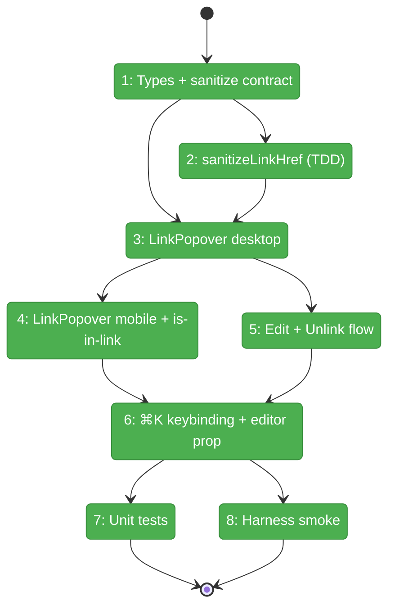

# Flight Plan: Phase 3 — Link Popover

**Plan**: [../../md-editor-plan.md](../../md-editor-plan.md)
**Phase**: Phase 3: Link Popover
**Generated**: 2026-04-18
**Status**: Landed

---

## Departure → Destination

**Where we are**: Phase 2 landed a 16-button toolbar with a Link button that calls a stub `onOpenLinkDialog?.()` and nothing more. `⌘K` does not open anything. The editor has `Link.configure({ openOnClick: false, autolink: false })` from Phase 1 but no keymap entry for link insertion. A user in Rich mode today cannot add a link through any UI path.

**Where we're going**: A developer opening `/dev/markdown-wysiwyg-smoke` can click the Link button OR press `⌘K` and see a popover appear (desktop) or a bottom-sheet slide up (mobile ≤ 768 px). Typing a URL + Enter inserts `<a href>` in the editor, with scheme auto-prepended and `javascript:*` silently rejected. Placing the caret inside an existing link and pressing `⌘K` opens the same UI in Edit mode with URL + Text pre-filled and an Unlink button. All interaction is keyboard-reachable, labeled, and inside a `role="dialog"`. Unit tests and the harness smoke verify the full matrix on desktop + tablet; mobile variant is shipped but its real-device verification is deferred to Phase 6.4.

---

## Domain Context

### Domains We're Changing

| Domain | What Changes | Key Files |
|--------|-------------|-----------|
| `_platform/viewer` | Add `LinkPopover` client component; add `sanitizeLinkHref` pure utility; additive `onOpenLinkDialog?` prop on `MarkdownWysiwygEditor` that threads through to an extended `TiptapLink` keymap; re-export new surface from the barrel. | `apps/web/src/features/_platform/viewer/components/link-popover.tsx` (new), `lib/sanitize-link-href.ts` (new), `lib/wysiwyg-extensions.ts` (modify), `components/markdown-wysiwyg-editor.tsx` (modify), `index.ts` (modify) |
| (infra) | Extend dev smoke route to mount `<LinkPopover>` composed with existing editor + toolbar; extend harness spec with Phase 3 assertions. | `apps/web/app/dev/markdown-wysiwyg-smoke/page.tsx`, `harness/tests/smoke/markdown-wysiwyg-smoke.spec.ts` |

### Domains We Depend On (no changes)

| Domain | What We Consume | Contract |
|--------|----------------|----------|
| `@/components/ui/popover` (shadcn) | `Popover` / `PopoverContent` / `PopoverTrigger` — desktop floating dialog with Radix focus trap + Esc-to-close | Existing shadcn component |
| `@/components/ui/sheet` (shadcn) | `Sheet` / `SheetContent` with `side="bottom"` — mobile bottom-sheet variant | Existing shadcn component |
| `@/components/ui/input` / `label` / `button` (shadcn) | Form primitives for Text + URL inputs and Cancel / Insert / Update / Unlink buttons | Existing shadcn components |
| `lucide-react` | `Link`, `Link2Off` (unlink) icons | Already imported by Phase 2 toolbar |
| `@tiptap/react` | `Editor` type + runtime APIs (`isActive`, `getAttributes`, `chain`, `extendMarkRange`, `setLink`, `unsetLink`, `commands.keyboardShortcut`) | Phase 1 install (`@tiptap/react@^2.27.2`) |
| `@tiptap/extension-link` | `.configure()` + `.extend()` composition for `Mod-k` keymap | Phase 1 install (`@tiptap/extension-link@^2.27.2`) |

---

## Flight Status

<!-- Updated by /plan-6-v2: pending → active → done. Use blocked for problems/input needed. -->



**Legend**: grey = pending | yellow = active | red = blocked/needs input | green = done

---

## Stages

<!-- Updated by /plan-6-v2 during implementation: [ ] → [~] → [x] -->

- [x] **Stage 1: Types + contract** — declare `SanitizedHref`, `LinkPopoverProps`, extend `MarkdownWysiwygEditorProps` with `onOpenLinkDialog?` (`lib/wysiwyg-extensions.ts`, `index.ts` — modify)
- [x] **Stage 2: sanitizeLinkHref (TDD)** — RED-first pure utility covering allow-list, reject, trim, case-insensitivity, relative-URL preservation (`lib/sanitize-link-href.ts` — new; `test/.../sanitize-link-href.test.ts` — new)
- [x] **Stage 3: LinkPopover desktop variant** — shadcn `Popover` with `role="dialog"`, Text + URL inputs, Cancel/Insert buttons, auto-focus on URL, Enter submits, testids attached (`components/link-popover.tsx` — new; `index.ts` — export)
- [x] **Stage 4: Mobile variant + reactive is-in-link** — shadcn `Sheet side="bottom"` branch at `max-width: 768px`; `useEditorState` selector for `isActive('link')` drives title + Unlink button visibility (`components/link-popover.tsx` — modify)
- [x] **Stage 5: Edit + Unlink flow** — pre-fill from `getAttributes('link')` + `extendMarkRange('link')` + `textBetween`; Unlink button; Update button replaces Insert when in Edit mode (`components/link-popover.tsx` — modify)
- [x] **Stage 6: ⌘K keybinding + editor prop threading** — `onOpenLinkDialogRef` mirror of Phase 1/2 ref pattern; `TiptapLink.configure(...).extend({ addKeyboardShortcuts: 'Mod-k' })` composition; 3 new editor tests (`components/markdown-wysiwyg-editor.tsx`, `test/.../markdown-wysiwyg-editor.test.tsx` — modify)
- [x] **Stage 7: Unit tests** — 26 sanitize + 13 popover + 3 editor = 42 new; Phase 1/2's 45 untouched; Constitution §4/§7 compliant (`test/.../sanitize-link-href.test.ts`, `test/.../link-popover.test.tsx` — new; `test/.../markdown-wysiwyg-editor.test.tsx` — modify)
- [x] **Stage 8: Harness smoke extension** — desktop + tablet green; mobile skipped to Phase 6.4; Phase 1/2 assertions preserved; screenshot to `harness/results/phase-3/` (`app/dev/.../page.tsx`, `harness/tests/smoke/markdown-wysiwyg-smoke.spec.ts` — modify)

---

## Architecture: Before & After

```mermaid
flowchart LR
    classDef existing fill:#E8F5E9,stroke:#4CAF50,color:#000
    classDef changed fill:#FFF3E0,stroke:#FF9800,color:#000
    classDef new fill:#E3F2FD,stroke:#2196F3,color:#000

    subgraph Before["Before Phase 3"]
        B1[MarkdownWysiwygEditor]:::existing
        B2[useEditor Tiptap]:::existing
        B3[WysiwygToolbar]:::existing
        B4[Link button stub callback]:::existing
        B5[Link extension .configure openOnClick false]:::existing
        B1 --> B2
        B2 --> B5
        B3 --> B4
    end

    subgraph After["After Phase 3"]
        A1[MarkdownWysiwygEditor + onOpenLinkDialog]:::changed
        A2[useEditor Tiptap]:::existing
        A3[WysiwygToolbar]:::existing
        A4[Link button calls handler]:::existing
        A5[Link .configure.extend addKeyboardShortcuts Mod-k]:::changed
        A6[LinkPopover desktop Popover + mobile Sheet]:::new
        A7[sanitizeLinkHref]:::new
        A8[useEditorState isActive link]:::new
        A1 --> A2
        A2 --> A5
        A5 -. Mod-k fires .-> A1
        A3 --> A4
        A4 -. onOpenLinkDialog .-> A6
        A1 -. onOpenLinkDialog .-> A6
        A6 --> A7
        A6 --> A8
        A6 -- editor.chain.setLink .-> A2
    end
```

**Legend**: existing (green, unchanged) | changed (orange, modified) | new (blue, created)

---

## Acceptance Criteria

- [ ] `⌘K` opens popover (AC-05, AC-13)
- [ ] Toolbar Link button also opens popover (AC-04)
- [ ] URL + Enter inserts link; scheme auto-prepended (AC-13)
- [ ] `javascript:*` rejected silently (AC-13; workshop § 5.5)
- [ ] Caret-in-link → popover pre-fills Text + URL; Unlink visible (AC-13; workshop § 5.3)
- [ ] Mobile (≤ 768 px) → bottom-sheet; URL auto-focused (AC-14; workshop § 5.4 / § 11.3)
- [ ] All interactive elements keyboard-reachable; `role="dialog"`; Esc closes (AC-17; workshop § 12)
- [ ] `MarkdownWysiwygEditor` additive prop preserves Phase 1/2 contract (10 existing tests still green + 1 new)
- [ ] Harness smoke desktop + tablet green; Phase 1/2 assertions preserved; mobile deferred to Phase 6.4
- [ ] `sanitizeLinkHref` unit tests ≥ 14 cases, all green (TDD — RED first)
- [ ] `LinkPopover` unit tests ≥ 10 cases, all green
- [ ] No new `vi.mock` / `vi.fn` / `vi.spyOn` (Constitution §4/§7)

---

## Goals & Non-Goals

**Goals**:
- Visible, clickable link-insertion UI shipped (desktop + mobile branches)
- `⌘K` keyboard shortcut works end-to-end (editor keymap → parent state → popover)
- URL sanitation allow-list enforced (reject `javascript:` + other non-standard schemes)
- Edit vs Insert vs Unlink paths all working
- Dev-route + harness smoke coverage; Phase 1/2 regression-free

**Non-Goals**:
- FileViewerPanel integration — Phase 5 (5.3)
- Front-matter real impl — Phase 4
- Image insertion popover — out of plan (spec Non-Goals)
- Bundle-size measurement — Phase 6.7
- Language pill on code blocks — Phase 5.7
- Real-device mobile testing — Phase 6.4
- Axe accessibility audit — Phase 6.5
- `autolink` (raw URLs auto-wrap) — Phase 1 disabled intentionally; not in Phase 3 scope
- Caret-anchored popover positioning (vs toolbar-anchored) — MVP uses toolbar anchor; revisit in polish if UX feedback demands

---

## Checklist

- [x] T001: Define types (`SanitizedHref`, `LinkPopoverProps`) + extend `MarkdownWysiwygEditorProps` with `onOpenLinkDialog?`
- [x] T002: TDD `sanitizeLinkHref(raw)` — 26 cases, RED → GREEN
- [x] T003: `LinkPopover` desktop variant — shadcn `Popover`, form, testids, auto-focus, Enter-submit
- [x] T004: `LinkPopover` mobile variant (shadcn `Sheet` `side="bottom"`) + `useEditorState` for `isActive('link')`
- [x] T005: Edit mode (pre-fill via `extendMarkRange` + `textBetween` + `getAttributes`) + Unlink button + Update flow
- [x] T006: `⌘K` keybinding — `TiptapLink.extend({ addKeyboardShortcuts })`; `onOpenLinkDialogRef` mirror; 3 editor test cases (Mod-k, readOnly gate, isAllowedUri rejection)
- [x] T007: Unit tests — sanitize (26) + editor Mod-k (3) + popover (13) = 42 new. 87/87 total green.
- [x] T008: Harness smoke — dev route composition; desktop + tablet green (6s/7s); mobile skipped to Phase 6.4
