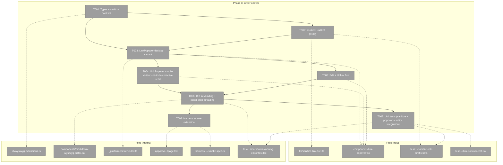
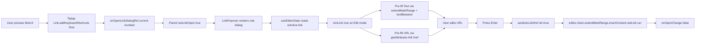
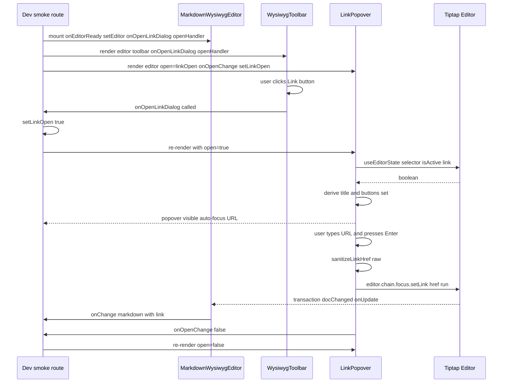

# Phase 3: Link Popovers

**Plan**: [../../md-editor-plan.md](../../md-editor-plan.md)**Spec**: [../../md-editor-spec.md](../../md-editor-spec.md)**Workshop**: [../../workshops/001-editing-experience-and-ui.md](../../workshops/001-editing-experience-and-ui.md)**Generated**: 2026-04-18 **Status**: Ready for takeoff

---

## Executive Briefing

**Purpose**: Make link insertion a first-class interaction in Rich mode. Phase 2 shipped a Link toolbar button that calls a stub `onOpenLinkDialog?.()` and nothing more; the `⌘K` shortcut doesn't exist yet. Phase 3 delivers the actual popover UI (desktop) / bottom-sheet (mobile ≤ 768 px), wires `⌘K` through the Tiptap Link extension's keymap, implements URL sanitation (allow-list protocols; auto-prepend `https://`; reject `javascript:`), and closes the edit/unlink branch when the caret is already inside a link. This is the last piece of the "Rich mode can compose a document" story — after Phase 3, a user has every MVP editing affordance. Phase 4+ then move to utilities and integration.

**What We're Building**:

- **Testing** *123*
- A new `LinkPopover` client component that renders differently per viewport: desktop uses shadcn `Popover` anchored to the caret; mobile uses shadcn `Sheet` (`side="bottom"`) — workshop § 5.4 accepts either `Drawer` or `Sheet`; `sheet.tsx` is the component that actually exists in this repo (`apps/web/src/components/ui/`).
- A pure URL-sanitation helper `sanitizeLinkHref(raw)` returning a discriminated-union result (`{ ok: true, href } | { ok: false, reason }`). Allow-list: `http:`, `https:`, `mailto:`, `/…` (root-relative), `#…` (anchor), `./…` / `../…` (repo-relative). Everything else without a scheme → prepend `https://`. `javascript:*` → rejected.
- `⌘K` keybinding integrated into the editor's Tiptap keymap via `TiptapLink.extend({ addKeyboardShortcuts })`, calling a ref-stable `onOpenLinkDialog` callback threaded through `MarkdownWysiwygEditorProps` (additive, mirrors the Phase 2 `onEditorReady` pattern).
- Edit vs Insert flow: caret inside an existing link → popover pre-fills the Text and URL fields with the link mark's attrs; shows an `Unlink` button. Caret outside a link with a selection → Text pre-filled, URL empty and focused. Caret outside with no selection → both empty, URL focused.
- A11y: popover/sheet has `role="dialog"`, `aria-labelledby` pointing to a titled `<h3>`, explicit `<Label htmlFor>` ↔ `<Input id>` wiring (shadcn Label does NOT auto-bind), focus trap via Radix — **desktop Popover requires** `modal={true}` **prop** (Radix Popover is not Dialog; default `modal={false}` does NOT trap focus); mobile Sheet uses `@radix-ui/react-dialog` under the hood and traps by default. Esc closes. **Focus-return target depends on open path** (workshop § 5.1 assumed single-entry-point; real usage has two). On popover open, capture `document.activeElement` into `openerRef`; on close, explicitly `.focus()` the captured node — for toolbar-click entry that's the Link button (user stays on the toolbar), for ⌘K entry that's the editor contenteditable (user's caret returns to their writing flow). Do NOT rely on Radix's default `onCloseAutoFocus` alone — it targets the Trigger, which for the ⌘K path pulls focus away from the editor. Override `onCloseAutoFocus={(e) => { e.preventDefault(); openerRef.current?.focus?.(); }}`.
- `WysiwygToolbar`'s Link button now opens the popover (Phase 2 shipped the callback wiring; Phase 3 supplies a real handler at the smoke route + parent layer).
- Dev smoke route extended to compose `<MarkdownWysiwygEditorLazy>` + `<WysiwygToolbar>` + `<LinkPopover>` with shared state.
- Unit tests for `sanitizeLinkHref` (TDD — test file red first, then green), `LinkPopover` rendering / keyboard submit / cancel / unlink, and the toolbar-side integration.
- Harness smoke extension: click Link → popover opens; type `https://example.com` + Enter → `<a href="https://example.com">` appears; `⌘K` reopens; click Unlink → anchor gone.

**Goals**:

- ✅ `⌘K` opens the popover (workshop § 4, AC-05, AC-13)
- ✅ Toolbar Link button also opens it (AC-04)
- ✅ Typing a URL + Enter inserts a link with `href` through sanitation (AC-13)
- ✅ Scheme-less URL → `https://` prepended (AC-13)
- ✅ `javascript:*` rejected silently (AC-13; workshop § 5.5)
- ✅ Caret inside existing link → popover pre-fills Text + URL and shows Unlink button (AC-13; workshop § 5.3)
- ✅ Mobile viewport (≤ 768 px) → renders as bottom-sheet with URL field auto-focused (AC-14; workshop § 5.4 / § 11.3)
- ✅ All interactive elements keyboard-reachable; `role="dialog"`; Esc closes (AC-17; workshop § 5.1 / § 12)
- ✅ `MarkdownWysiwygEditor` exposes additive `onOpenLinkDialog?` prop without breaking Phase 1/2 contracts
- ✅ Harness smoke: desktop click + ⌘K + type URL + Enter → `<a>` in DOM; caret in link + ⌘K → pre-fill verified; Unlink removes anchor
- ✅ Zero regressions in 45 unit tests from Phase 1/2; Phase 2 harness assertions preserved

**Non-Goals**:

- ❌ FileViewerPanel integration — Phase 5 owns it; the dev smoke route remains the sole mount point through Phase 4 (will be deleted at Phase 5.11)
- ❌ Front-matter real implementation — still a passthrough stub; Phase 4 replaces
- ❌ Image insertion popover — out of plan scope (images are read-only display; no upload/embed — spec Non-Goals)
- ❌ Bundle-size AC measurement — Phase 6.7
- ❌ Language pill for code blocks — Phase 5.7
- ❌ Full mobile device testing (real phone) — Phase 6.4 owns; Phase 3 only verifies `(max-width: 768px)` CSS branch in the harness's tablet emulation
- ❌ Linkifying raw URLs (`autolink`) — Phase 1 shipped `Link.configure({ autolink: false })` intentionally; not in Phase 3 scope
- ❌ Accessibility audit with `@axe-core/playwright` — Phase 6.5 owns; Phase 3 ships the correct `role="dialog"` + label attributes but does not run a full audit

---

## Prior Phase Context

### Phase 1 (completed 2026-04-18)

**A. Deliverables** (absolute paths — relevant to Phase 3)

- `/Users/jordanknight/substrate/083-md-editor/apps/web/src/features/_platform/viewer/components/markdown-wysiwyg-editor.tsx` — core Tiptap editor, `'use client'`. Phase 3 modifies additively: threads `onOpenLinkDialog` prop through to an extended Link extension that owns the `Mod-k` shortcut.
- `/Users/jordanknight/substrate/083-md-editor/apps/web/src/features/_platform/viewer/components/markdown-wysiwyg-editor-lazy.tsx` — `dynamic({ ssr: false })` wrapper. No change.
- `/Users/jordanknight/substrate/083-md-editor/apps/web/src/features/_platform/viewer/lib/wysiwyg-extensions.ts` — type module. Phase 3 adds: `LinkPopoverProps`, `SanitizedHref` (discriminated union), extends `MarkdownWysiwygEditorProps` with optional `onOpenLinkDialog?: () => void`.
- `/Users/jordanknight/substrate/083-md-editor/apps/web/src/features/_platform/viewer/index.ts` — barrel. Phase 3 adds `LinkPopover` + new types.
- Installed: `@tiptap/extension-link@^2.27.2` already in Phase 1 deps; Phase 3 uses `.extend()` composition on the already-configured extension.

**B. Dependencies Exported** (consumed by Phase 3)

- `MarkdownWysiwygEditor` accepts `onEditorReady?(editor)` — Phase 3's smoke route uses this (via Phase 2 T008 pattern) to get the Tiptap instance for (a) computing whether caret is inside an existing link and (b) running `setLink` / `unsetLink` commands from the popover.
- `Link.configure({ openOnClick: false, autolink: false })` is already baked in the editor extensions array. Phase 3's `.extend()` composes on top of this — Tiptap v2 merges `addKeyboardShortcuts` from `.extend()` with the already-configured options; `openOnClick: false` and `autolink: false` persist.
- `editor.storage.markdown.getMarkdown()` still the serializer; edits via `editor.chain().focus().setLink({ href }).run()` round-trip to `[text](href)` in the markdown output.

### Phase 2 (completed 2026-04-18)

**A. Deliverables** (absolute paths — relevant to Phase 3)

- `/Users/jordanknight/substrate/083-md-editor/apps/web/src/features/_platform/viewer/components/wysiwyg-toolbar.tsx` — 16-button toolbar with `role="toolbar"`. Phase 3 does NOT modify this file; the existing Link button already calls `onOpenLinkDialog?.()` via T001's config.
- `/Users/jordanknight/substrate/083-md-editor/apps/web/src/features/_platform/viewer/lib/wysiwyg-toolbar-config.ts` — 16-action config array. Link action's `run` is `(editor, { onOpenLinkDialog }) => onOpenLinkDialog?.()`. Already correct; Phase 3 reuses.
- Harness spec `/Users/jordanknight/substrate/083-md-editor/harness/tests/smoke/markdown-wysiwyg-smoke.spec.ts` — Phase 3 extends with Link assertions, preserves all Phase 1 + Phase 2 assertions.
- Dev route `/Users/jordanknight/substrate/083-md-editor/apps/web/app/dev/markdown-wysiwyg-smoke/page.tsx` — Phase 3 adds `const [linkOpen, setLinkOpen] = useState(false)` + `<LinkPopover>` composition.
- Tests under `/Users/jordanknight/substrate/083-md-editor/test/unit/web/features/_platform/viewer/` — 45 green (10 editor + 10 toolbar + 14 toolbar-markdown + 11 image-url). Phase 3 adds ≥ 3 new files (sanitize, link-popover, editor onOpenLinkDialog integration); existing 45 must stay green.

**B. Dependencies Exported** (consumed by Phase 3)

- `WysiwygToolbarProps.onOpenLinkDialog?: () => void` — Phase 3's dev-route composition supplies a real handler.
- `WysiwygToolbar` renders `[data-testid="toolbar-link"]` button — Phase 3 harness clicks it.
- `ToolbarAction.run(editor, { onOpenLinkDialog })` — the second arg is a context object; Phase 3 adds no new actions, just calls the existing Link action.
- `md-wysiwyg` class on editor wrapper (Phase 2 T003) — irrelevant to popover but documented for reference.

**C. Gotchas & Debt** (carry into Phase 3)

- `gotcha` — Phase 1: `setContent(body, false)` second arg is a boolean, not an options object. Irrelevant to Phase 3 (no content sync changes).
- `gotcha` — Phase 2: `jsdom` + ProseMirror focus is unreliable — `editor.isFocused` returned false in unit tests after `.chain().focus()`. Apply to Phase 3: Unit tests for the popover MUST use `fireEvent` + DOM assertions; popover focus-restore (return to toolbar button) is asserted in the harness, not in unit tests.
- `gotcha` — Phase 2: `tiptap-markdown@0.8.10` initial-content is parsed as markdown, not HTML. So `setContent('<a href="...">x</a>')` won't be interpreted as an anchor — use markdown `[x](url)` instead when seeding link fixtures in tests.
- `gotcha` — Phase 2: Harness Chromium is Linux-container, so `Mod-` always maps to `Control`. Hardcode `const MOD_KEY = 'Control'` in the spec (same as Phase 2).
- `gotcha` — Phase 2: Turbopack caches compilation errors; if dev route 500s mid-edit, `touch <file>` to force re-read.
- `gotcha` — Phase 2: mobile harness project flake on keyboard chords — Phase 3 likewise defers mobile keyboard tests to Phase 6.4; mobile desktop-emulation (viewport resize + `Sheet` render-path verification) is in scope.
- `debt` — 4 pre-existing TypeScript errors in unrelated features (`019-agent-manager-refactor`, `074-workflow-execution`, `_platform/panel-layout`). `pnpm -F web typecheck` is red on those files. Phase 6.10 sweeps. Phase 3 must not worsen.
- `debt` — Dev route `/dev/markdown-wysiwyg-smoke` still retained as Phases 2–4 scaffold; Phase 5.11 deletes.
- `insight` — Phase 2: `useEditorState({ editor, selector })` is the idiomatic way to subscribe to specific editor slices without re-rendering on every transaction. Not directly needed in Phase 3 (popover is imperative — it opens/closes/submits), but the pattern applies if Phase 3 ends up reading the link mark's current attrs reactively (e.g., "show Unlink button when caret is in link"). Decision: Phase 3 **uses** `useEditorState` for the "is caret in link?" branch that decides whether to render Unlink in the footer — see T004 Notes.
- `insight` — Phase 2: Constitution §4/§7 — no `vi.mock` / `vi.fn` / `vi.spyOn`. Use plain test-owned callbacks (`const calls: string[] = []`).

**D. Incomplete Items**: Phase 2 shipped all 8 tasks and all phase-local ACs green. The only explicit Phase 3-scoped deferral carried forward is: Phase 2's toolbar Link button is wired to `onOpenLinkDialog?.()` but the smoke route supplies no handler — **Phase 3 closes this gap** by wiring a real handler in the dev route (T006).

**E. Patterns to Follow** (from Phases 1 + 2)

- **Interface-First** (Constitution §2 / Finding 08): every task group opens with a types addition in `wysiwyg-extensions.ts` before implementation.
- **Ref-stable callbacks** (Phase 1 `onChangeRef`, Phase 2 `onEditorReadyRef`): Phase 3's `onOpenLinkDialog` similarly goes through `onOpenLinkDialogRef` inside `markdown-wysiwyg-editor.tsx` so `.extend({ addKeyboardShortcuts })` doesn't capture a stale closure when the parent re-renders with a new callback identity.
- **Tiptap extension composition** (Phase 2 Forward-Compat note documented): `TiptapLink.configure({ openOnClick: false, autolink: false }).extend({ addKeyboardShortcuts() { return { 'Mod-k': …} } })` — `.extend()` merges with the already-configured options. Phase 3 does NOT redeclare Link from scratch; it extends the existing instance.
- **Test files** live under `/Users/jordanknight/substrate/083-md-editor/test/unit/web/features/_platform/viewer/`. Vitest root config picks them up; run `pnpm exec vitest run <path>` from repo root.
- **No mocking library** — plain callbacks only.
- **Barrel re-export** new components from `_platform/viewer/index.ts`.
- `use client` **directive** at the top of every file using React hooks / event handlers.
- **Dev smoke route**: extend, don't duplicate. Phase 3 adds popover composition to the existing `/dev/markdown-wysiwyg-smoke` route; Phase 5.11 deletes the route after migration.
- **Harness spec**: preserve every prior-phase assertion verbatim; add Phase 3 assertions after.
- **Tiptap runtime inside lazy boundary**: `LinkPopover` consumes `Editor` as type-only for the sanitation + attrs-read path. Runtime Tiptap commands (`setLink`, `unsetLink`) are called on the `editor` prop that was constructed in the lazy chunk. `LinkPopover` itself can be eagerly loaded (it's a shadcn-based form component, \~2 KB) but in practice it only renders when Rich mode is active, so the lazy boundary is preserved.

---

## Pre-Implementation Check

FileExists?Domain CheckNotes`apps/web/src/features/_platform/viewer/components/link-popover.tsx`**No** (create)`_platform/viewer` ✅New — desktop `Popover` (modal, anchored to toolbar Link button via `anchorRef`) + mobile `Sheet` bottom-variant, form fields, submit/cancel/unlink`apps/web/src/features/_platform/viewer/components/wysiwyg-toolbar.tsx`**Yes** (modify — minimal)`_platform/viewer` ✅T003 adds optional `linkButtonRef?: React.Ref<HTMLButtonElement>` prop; when set, the Link button forwards its native `ref` to it (enables popover anchoring). Additive, backward-compatible with Phase 2's existing WysiwygToolbar tests.`apps/web/src/features/_platform/viewer/lib/sanitize-link-href.ts`**No** (create)`_platform/viewer` ✅New — pure TDD utility; discriminated-union return; allow-list protocols`apps/web/src/features/_platform/viewer/lib/wysiwyg-extensions.ts`**Yes** (modify)`_platform/viewer` ✅Add `LinkPopoverProps`, `SanitizedHref`, `MarkdownWysiwygEditorProps.onOpenLinkDialog?apps/web/src/features/_platform/viewer/components/markdown-wysiwyg-editor.tsx`**Yes** (modify)`_platform/viewer` ✅Additive: thread `onOpenLinkDialog` through `onOpenLinkDialogRef`; extend the `TiptapLink` instance with `addKeyboardShortcuts` registering `Mod-k`. No behavioral change to existing contract.`apps/web/src/features/_platform/viewer/index.ts`**Yes** (modify)`_platform/viewer` ✅Re-export `LinkPopover`, `sanitizeLinkHref`, new types`apps/web/app/dev/markdown-wysiwyg-smoke/page.tsx`**Yes** (modify)(dev-only)Add `useState<{ open: boolean, anchorRect?: DOMRect }>` and mount `<LinkPopover>`; wire `onOpenLinkDialog={() => setLinkOpen(true)}` on both the editor prop AND the toolbar prop (they share one handler)`harness/tests/smoke/markdown-wysiwyg-smoke.spec.ts`**Yes** (modify)(harness)Extend: click `[data-testid="toolbar-link"]` → popover visible; type URL → `<a href>` appears; `Mod-k` reopens; click Unlink → anchor gone. Preserve Phase 1 + 2 assertions.`test/unit/web/features/_platform/viewer/sanitize-link-href.test.ts`**No** (create)`_platform/viewer` ✅New — TDD; 12+ cases covering each sanitation branch`test/unit/web/features/_platform/viewer/link-popover.test.tsx`**No** (create)`_platform/viewer` ✅New — React-mount + userEvent; rendering, input focus, submit, cancel, unlink, edit-mode pre-fill`test/unit/web/features/_platform/viewer/markdown-wysiwyg-editor.test.tsx`**Yes** (modify, minimal)`_platform/viewer` ✅Add 1 case — `onOpenLinkDialog` fires on `Mod-k` keypress; editor contract otherwise unchanged

**Concept duplication check** (`/code-concept-search-v2`-style scan):

- **URL sanitation** — grep on `sanitize.*[Uu]rl|sanitiz.*[Hh]ref` in `apps/web/src` returned zero hits other than this editor's own `TiptapLink.configure({ autolink: false })` mention. No existing helper to reuse. ✅ no duplication.
- **Link popover** — grep on `LinkPopover|link.*popover` returned zero hits. ✅ no duplication.
- **Form popover pattern** — shadcn `popover.tsx`, `sheet.tsx`, `input.tsx`, `label.tsx`, `dialog.tsx` all exist in `apps/web/src/components/ui/`. Phase 3 composes these as-is. No new primitive.
- **Focus trap** — shadcn's `Popover` uses `@radix-ui/react-popover` (NOT Dialog); default `modal={false}` does NOT trap focus. T003 passes `modal={true}` to activate Radix FocusScope. Mobile `Sheet` uses `@radix-ui/react-dialog` and traps by default.

**Contract risks**:

- `MarkdownWysiwygEditor` **prop addition** (`onOpenLinkDialog?`): optional, additive, backward-compatible. Phase 1/2's 10 editor tests must still pass (1 new test added in T002). Risk: **low**.
- `TiptapLink.extend({ addKeyboardShortcuts })` **composition**: Phase 2's Forward-Compat matrix committed to this being safe (`.extend` merges with `.configure`). Concrete risk: if Tiptap's internal keymap-merging changes in a future release, `Mod-k` could collide with StarterKit's built-in. StarterKit does NOT register `Mod-k` as of v2.27 (verified — `Mod-k` is reserved in the Link extension ecosystem specifically for link insertion). Risk: **low, documented**.
- `Mod-k` **browser-default collision** — `Cmd+K` is the macOS quick-command / Spotlight in many apps (VS Code, GitHub, Linear). Inside a Tiptap `contenteditable`, Tiptap's keymap has priority, and the keybinding returns `true` (handled), which calls `event.preventDefault()` and stops propagation. The shortcut only fires when the editor has focus. Risk: **low** — matches the workshop § 5.1 intent and other markdown editors (Notion, Obsidian, Bear all use `Mod-k`).
- `Sheet` **vs** `Drawer` **nomenclature** — workshop § 5.4 says "shadcn Drawer / Sheet". `drawer.tsx` does NOT exist in this repo (verified via `ls apps/web/src/components/ui/`); `sheet.tsx` DOES. Decision: use `Sheet` component with `side="bottom"` — this is the shadcn bottom-sheet pattern. Workshop accepts either. Risk: **none**.
- **Popover anchor during selection** — The popover should anchor to the current text selection's bounding rect. Radix Popover supports `anchor` or a visible trigger; for caret-anchored popovers the idiomatic Radix pattern is a `PopoverAnchor` component whose `ref` points to an invisible absolute-positioned `<span>` at the selection's bounding rect (computed via `editor.view.coordsAtPos(selection.anchor)`). Alternative, simpler: anchor to the toolbar Link button (already visible) — this is what Slack, GitHub, and Notion do for markdown link insertion UX. Decision: **anchor to the toolbar Link button** for MVP; workshop § 5.2 mockup is agnostic. Revisit if UX feedback demands caret-anchoring (Phase 6 polish ticket, out of scope here). Risk: **low, decision documented**.
- `⌘K` **with a selection** — workshop § 5.1 says: if the user has a selection when pressing `⌘K`, the popover's Text field pre-fills with the selected text; inserting a link wraps that selection. Tiptap's `setLink({ href })` operates on the current selection natively — no custom extraction needed. The popover just reads `editor.state.doc.textBetween(from, to)` to pre-fill the Text field. Risk: **low**.
- **Editing an existing link** (workshop § 5.3) — when caret is inside a link mark, the popover must pre-fill `Text` and `URL` from the mark's attrs. Accessor: `editor.getAttributes('link')` returns `{ href, target?, rel?, class? }`. Pre-fill Text with the full link's visible text (extract via `editor.state.doc.textBetween` over the link mark's range, which we can determine via `editor.state.selection.$from.marks()` and ProseMirror's `MarkRange` helper OR simpler: use Tiptap's `extendMarkRange('link')` to select the whole link, then read the selection text). Risk: **low, but non-trivial** — T005 documents the extendMarkRange approach explicitly.
- **Unlink semantics** — `editor.chain().focus().extendMarkRange('link').unsetLink().run()` is the standard Tiptap unlink. This preserves the link's visible text and removes only the anchor. Risk: **none**.

**Harness health check**:

- Harness L3 is operational. Phase 2 confirmed desktop + tablet pass; mobile project is skipped as planned.
- Re-run before T008: `just harness-dev && just harness ports && just harness-health`. If unhealthy: `just harness-stop && just harness-dev`.
- Status: **Harness available at L3**.

---

## Architecture Map



---

## Tasks

StatusIDTaskDomainPath(s)Done WhenNotes\[x\]T001Define Phase 3 types in `lib/wysiwyg-extensions.ts`. Add: `SanitizedHref = { ok: true; href: string } | { ok: false; reason: 'javascript-scheme' | 'empty' }`; `LinkPopoverProps = { editor: Editor | null; open: boolean; onOpenChange: (next: boolean) => void; anchorRef?: React.RefObject<HTMLElement>; className?: string }` (Radix `Popover` accepts an explicit anchor via `PopoverAnchor`, but shadcn's composition uses a `Trigger` ref or children — anchorRef is the escape hatch for anchoring to a non-trigger element like the selection caret if desired later; MVP uses the toolbar Link button as the `Trigger`, so this ref is optional / unused in the first pass). Extend `MarkdownWysiwygEditorProps` with optional `onOpenLinkDialog?: () => void` — the editor's `⌘K` shortcut calls this. Import `Editor` as type-only. Update `index.ts` barrel to re-export the new types.`_platform/viewer/Users/jordanknight/substrate/083-md-editor/apps/web/src/features/_platform/viewer/lib/wysiwyg-extensions.ts` (modify), `/Users/jordanknight/substrate/083-md-editor/apps/web/src/features/_platform/viewer/index.ts` (modify)`pnpm -F web typecheck` shows no NEW errors (pre-existing 4 debt errors OK); new types exported; `MarkdownWysiwygEditorProps.onOpenLinkDialog` is optional and non-breaking for all existing consumers (Phase 1/2 tests + smoke route)Finding 08 Interface-First. `SanitizedHref` as a discriminated union keeps the caller pattern-matching (`if (result.ok) …`) rather than sentinel-value checks.\[x\]T002TDD `sanitizeLinkHref(raw: string): SanitizedHref`. **RED first** — write all test cases in `test/unit/web/features/_platform/viewer/sanitize-link-href.test.ts`, verify they fail, then implement. Cases (≥ 22 — Security lens expanded): **Happy-path accept**: (a) `'https://example.com'` → `ok, href='https://example.com'`; (b) `'http://example.com'` → `ok, href='http://example.com'`; (c) `'example.com'` → `ok, href='https://example.com'` (scheme prepended); (d) `'www.example.com'` → `ok, href='https://www.example.com'`; (e) `'mailto:a@b.c'` → `ok, href='mailto:a@b.c'` (preserved); (f) `'/relative/path'` → `ok, href='/relative/path'` (root-relative preserved); (g) `'./file.md'` → `ok, href='./file.md'` (repo-relative preserved); (h) `'../sibling.md'` → `ok, href='../sibling.md'`; (i) `'#anchor'` → `ok, href='#anchor'` (fragment preserved); (j) `' https://example.com '` → trimmed; (n) trailing `\n` trimmed. **Rejections (dangerous schemes)**: (k) `'javascript:alert(1)'` → `{ ok: false, reason: 'javascript-scheme' }`; (l) `'JavaScript:alert(1)'` → rejected (case-insensitive); (o) `'vbscript:msgbox(1)'` → rejected; (p) `'data:text/html,<script>'` → rejected; (q) `'file:///etc/passwd'` → rejected. **Rejections (evasion vectors)**: (r) tab-embedded scheme `'jav\tascript:alert(1)'` (literal `\t` U+0009) → strip control chars first then detect → rejected; (s) newline-embedded `'java\nscript:alert(1)'` → rejected; (t) CR-embedded `'javas\rcript:alert(1)'` → rejected; (u) null-byte prefix `'\u0000javascript:alert(1)'` → rejected; (v) URL-encoded scheme `'%6Aavascript:alert(1)'` → sanitizer MUST decode first `%`-encoded prefix OR reject unknown scheme without `https://` prepend (safer: if pre-scheme chars look like `%XX`, reject as `javascript-scheme`); (w) fullwidth Unicode `'ｊavascript:alert(1)'` → ASCII-normalize or reject; (x) dotless-i spoof `'javascrıpt:alert(1)'` (U+0131) is harmless because scheme detection fails and `https://` prepend makes it `'https://javascrıpt:alert(1)'` — confirm in test as accept-as-unknown-then-prepend, documenting the trade-off. **Empty**: (m) `' '`/`''` → `{ ok: false, reason: 'empty' }`. **GREEN implementation**: (1) trim whitespace; (2) strip ASCII control chars `\u0000-\u001F` AND `\u007F`; (3) if empty → `{ ok: false, reason: 'empty' }`; (4) scheme detection `/^([a-z][a-z0-9+\-.]*):/i` — if match AND scheme-lowercased in `{'http','https','mailto'}` → accept; if match AND scheme NOT in allow-list → `{ ok: false, reason: 'javascript-scheme' }`; (5) pre-scheme `%` detection — if trimmed starts with `%` followed by 2 hex digits, reject (paranoid guard against `%6A` etc.); (6) no scheme AND starts with \`/#./../`→ accept verbatim; (7) otherwise prepend`https://`+ accept. No mocks; pure function. **Defense-in-depth: also configure`TiptapLink.configure({ protocols: \['http', 'https', 'mailto'\], isAllowedUri: (url) =&gt; sanitizeLinkHref(url).ok })`** — Tiptap v2.2+ exposes `isAllowedUri`; this second gate catches any `setLink\` call that bypasses the popover (e.g., programmatic calls, future extensions). Wire this in T006 where the Link extension is configured.`_platform/viewer`\[x\]T003Implement `LinkPopover` desktop variant in `components/link-popover.tsx`. `'use client'`. Component signature: `LinkPopover({ editor, open, onOpenChange, anchorRef, className }: LinkPopoverProps)`. Detect viewport via `window.matchMedia('(max-width: 768px)')` wrapped in a `useMediaQuery` hook (create minimal inline or reuse an existing one if present — grep reveals none; ship a 10-line hook in the same file; use `useSyncExternalStore` with `getServerSnapshot` returning `false` for SSR consistency). Branch: if mobile → render `Sheet` (see T004); else → render `Popover` from `@/components/ui/popover` **with** `modal={true}` **prop** — shadcn's default is `modal={false}` which does NOT trap focus (Radix Popover primitive is not Dialog; only modal popovers trap). `modal={true}` activates the focus trap via Radix's FocusScope so Tab cycles inside the popover until Esc. Desktop layout (workshop § 5.2): container has `role="dialog"`, `aria-labelledby="link-popover-title"`, inner flex column. Title: `<h3 id="link-popover-title" className="…">🔗 Insert link</h3>` (or "Edit link" if editing — see T005). **A11y / label wiring (explicit — shadcn** `Label` **does NOT auto-bind)**: Text row renders `<Label htmlFor="link-popover-text">Text</Label><Input id="link-popover-text" data-testid="link-popover-text-input" ... />`; URL row similarly uses `htmlFor="link-popover-url"` / `id="link-popover-url"`. `id` and `data-testid` are distinct — id is for the label binding (screen readers), testid is for Playwright. Test assertion: `getByLabelText('URL')` resolves the correct input. **PopoverAnchor positioning (SOLVED — was deferred; now shipped)**: Radix `PopoverContent` requires a sibling `<PopoverTrigger>` or `<PopoverAnchor>` inside the `<Popover>` root — without one, content renders at viewport (0,0). Phase 3 anchors to the toolbar Link button. Wiring: (i) `WysiwygToolbar` gains an optional `linkButtonRef?: React.Ref<HTMLButtonElement>` prop; when set, the Link button forwards its native `<button ref>` to this ref (3-line prop addition + forwardRef on the button render); (ii) `LinkPopover` accepts `anchorRef: React.RefObject<HTMLButtonElement>` (promoted from optional to required when `open=true`); (iii) inside `<Popover modal>` render `<PopoverAnchor asChild virtualRef={anchorRef} />` — Radix v1.1+ supports `virtualRef` that points at an existing DOM element without wrapping it. If the installed `@radix-ui/react-popover` predates `virtualRef`, fall back to rendering a `<span ref={anchorRef}>` child of `<PopoverAnchor asChild>` and use `getBoundingClientRect()` sync. Parent (dev route + Phase 5.3) declares `const toolbarLinkBtnRef = useRef<HTMLButtonElement>(null)` and threads it through `<WysiwygToolbar linkButtonRef={toolbarLinkBtnRef} />` + `<LinkPopover anchorRef={toolbarLinkBtnRef} />`. Footer row: `[Cancel]` (ghost) and `[Insert]` (default) buttons. Buttons: Cancel calls `onOpenChange(false)`; Insert collects Text + URL, runs `sanitizeLinkHref(url)` — if `ok`: `const applied = editor.chain().focus().extendMarkRange('link').setLink({ href }).run()`; **capture the return value** — if `applied === false` (Tiptap `isAllowedUri` second-gate rejection or no-selection + no-text), leave popover open and render inline `<p role="alert" data-testid="link-popover-error">Could not insert link.</p>`. On successful apply: `onOpenChange(false)`. **Capture-and-restore opener on open/close**: add \`const openerRef = useRef&lt;HTMLElementnull&gt;(null)`; on `open`transition to`true`, run `openerRef.current = document.activeElement as HTMLElement`; on close (via Cancel / Esc / Submit), Radix's `onCloseAutoFocus`is overridden:`onCloseAutoFocus={(e) =&gt; { e.preventDefault(); openerRef.current?.focus?.(); openerRef.current = null; }}`. This handles both entry paths correctly — toolbar-button-click opener → focus returns to button; ⌘K-from-editor opener → focus returns to the editor's contenteditable (user's writing flow preserved). Keyboard: `Enter` on URL field submits (`onKeyDown: e.key === 'Enter' → handleInsert()`); `Esc`closes (Radix`onEscapeKeyDown`fires — passed as`onOpenChange(false)`). **Swallow `Mod-k`at the popover root**: add`onKeyDown`on the outer`&lt;div&gt;`(inside`PopoverContent`/`SheetContent`) that intercepts `(e.metaKeye.ctrlKey) && e.key.toLowerCase() === 'k'`→`e.preventDefault(); e.stopPropagation();` then re-focuses the URL input (`urlInputRef.current?.focus()`). Without this, re-pressing ⌘K while the popover is open and URL field has focus escapes to the browser (Firefox search bar / Chrome omnibox) because Tiptap's keymap only fires while the editor is focused. Unit test: dispatch `keyDown`with`ctrlKey: true, key: 'k'`on the popover root → assert`preventDefault`called (use a plain callback on a synthetic event wrapper, no vi.fn). Data attrs:`data-testid="link-popover"\` on root, plus input/submit/cancel testids per label wiring above.`_platform/viewer`\[x\]T004Implement `LinkPopover` mobile variant. When `useMediaQuery('(max-width: 768px)')` → true, render `Sheet` from `@/components/ui/sheet` with `side="bottom"` in place of the desktop `Popover`. Same inner content (title, inputs, footer, testids, handlers) — extract into a `<LinkPopoverBody>` inner component to avoid duplication. Mobile tweaks: URL input auto-focuses so the on-screen keyboard appears; sheet `max-h` about 50% viewport (`className="max-h-[50vh]"`); footer buttons are stacked on narrow widths (`flex-col sm:flex-row`). Also wire the "is caret in link?" reactive read via `useEditorState` (Phase 2 insight — Tiptap's idiomatic selective-subscription hook): `const isInLink = useEditorState({ editor, selector: (ctx) => ctx.editor?.isActive('link') ?? false })`. Store this as state so the title flips between "Insert link" / "Edit link" and T005's Unlink button conditionally renders. Null-editor case: render the popover structure with all controls disabled (matches Phase 2 toolbar skeleton pattern — avoids flicker if `editor` is briefly null).`_platform/viewer/Users/jordanknight/substrate/083-md-editor/apps/web/src/features/_platform/viewer/components/link-popover.tsx` (modify — add mobile branch + `LinkPopoverBody` extraction + `useEditorState` integration)Viewport-dependent render (`jsdom` doesn't have real matchMedia; use a manual mock-free pattern: inject `useMediaQuery` result via test-only prop? — NO, see Notes); component renders as `Sheet` at ≤ 768 px; desktop + mobile branches use the same inner body; `isInLink` reactively flips title + Unlink visibilityWorkshop § 5.4 + § 11.3. **Test strategy for viewport branching**: `useMediaQuery` reads `window.matchMedia`. Unit tests set `window.matchMedia = (q) => ({ matches: q.includes('max-width: 768px'), … })` — that's NOT `vi.mock` / `vi.fn`, it's a direct property assignment (allowed under Constitution §4/§7 — the rule is "no mocking library", not "no test-time state setup"). Alternatively, accept a `__mediaMatches?: boolean` test-only prop; simpler but less clean. Decision: window.matchMedia property assignment per test case.\[x\]T005Edit + Unlink flow. When the popover opens AND `isInLink === true` (from T004's `useEditorState`): (a) pre-fill the URL input with `editor.getAttributes('link').href ?? ''`; (b) pre-fill the Text input with the link's visible text. **Simplest correct approach**: on open, call `editor.chain().focus().extendMarkRange('link').run()` to make the entire link the selection, then read `editor.state.doc.textBetween(editor.state.selection.from, editor.state.selection.to)` (no 3rd arg — `blockSeparator` defaults to empty; links live within a single block so the arg is irrelevant), store the pre-fill values in popover state, leave the selection extended so re-submit naturally replaces it. (c) Title flips from "🔗 Insert link" to "🔗 Edit link"; (d) Footer shows three buttons: `[Unlink] [Cancel] [Update]`. **Render** `data-testid="link-popover-unlink"` **on the Unlink button** (T008 depends on this selector). Unlink: `editor.chain().focus().extendMarkRange('link').unsetLink().run()` then `onOpenChange(false)`. Update: same sanitation + `setLink` as Insert. **Preserve nested marks (bold/italic inside a link)** — if Text field is unchanged from the pre-fill, skip `insertContent` and only re-apply the link: `editor.chain().focus().extendMarkRange('link').setLink({ href }).run()`. If Text changed, `editor.chain().focus().insertContent(newText).setLink({ href }).run()` (chain order: insertContent replaces selection, setLink applies to the just-inserted content). **Malformed href** — if `getAttributes('link').href` is undefined/empty but `isActive('link')` is true, treat as Insert mode (don't show Unlink), and log a console.warn. **Caret-on-link-boundary ambiguity**: Tiptap's `isActive('link')` may return false when caret is immediately after a link's trailing edge; `isInLink` is sourced from `useEditorState({ editor, selector: ctx => ctx.editor?.isActive('link') ?? false })` which handles the inclusive-right edge correctly per Tiptap's convention. Add a test case to confirm this boundary behavior. **Insert mode** (caret NOT in link): **On popover open (when** `!isInLink`**)**, pre-fill Text from the current editor selection per workshop § 5.1 step 3: `const selText = editor.state.doc.textBetween(editor.state.selection.from, editor.state.selection.to)` — if non-empty, seed the Text input state with it; if collapsed selection, leave empty. This pre-fill runs exactly once per open transition (guard via `useEffect(() => { if (open && !isInLink) setText(selText) }, [open, isInLink])`). **On submit**: with selection → `editor.chain().focus().setLink({ href }).run()` (Text field may have been edited — if Text diverged from the captured selection text, run `insertContent(text).setLink({ href })` instead to replace the selection with the user's edited text); no selection + Text typed → `insertContent(text)` then `setLink({ href })`; no selection + no Text → use URL as visible text (workshop § 5.1 step 4). Add a T007 unit case: "select word 'Claude' in editor, open popover in Insert mode → Text field value is 'Claude'"; and a harness assertion in T008 covering the select-word → toolbar-link-click → Text-prefilled path. **Always check** `chain().run()` **return value** — if false, keep popover open and show `data-testid="link-popover-error"` inline.`_platform/viewer/Users/jordanknight/substrate/083-md-editor/apps/web/src/features/_platform/viewer/components/link-popover.tsx` (modify — add edit-mode branch + Unlink button with testid + collapsed-selection handling + nested-mark preservation)Caret inside link + open popover → Text + URL pre-filled, Unlink button visible with `data-testid="link-popover-unlink"`, title = "Edit link"; Unlink click → link mark removed, visible text AND nested marks preserved, popover closes; Update with unchanged Text → nested marks preserved (bold-inside-link survives); Update with new Text → selection replaced + new link applied; Insert mode with no selection + only URL typed → inserts URL as visible text with itself as href; caret exactly after link trailing edge → `isInLink === false`, popover opens in Insert mode (tested); failed `setLink` → popover stays open with `link-popover-error` visibleWorkshop § 5.1 / § 5.3. Tiptap chain commands batch transactions (one undo step per popover submit). Boundary + nested-marks edge cases added per Completeness validation.\[x\]T006Wire `⌘K` keybinding into the editor's Link extension via `.extend({ addKeyboardShortcuts })` AND integrate `sanitizeLinkHref` as `Link.configure({ isAllowedUri })` (T002 defense-in-depth). Modify `markdown-wysiwyg-editor.tsx`: (a) add `onOpenLinkDialogRef = useRef(onOpenLinkDialog); onOpenLinkDialogRef.current = onOpenLinkDialog;` (mirror of `onChangeRef` / `onEditorReadyRef` pattern — ref-stable so `.extend()`'s closure captures the latest callback without re-registering extensions on every parent re-render); (b) **replace** the existing `TiptapLink.configure({ openOnClick: false, autolink: false })` (line 121) with `TiptapLink.configure({ openOnClick: false, autolink: false, protocols: ['http', 'https', 'mailto'], isAllowedUri: (url) => sanitizeLinkHref(url).ok }).extend({ addKeyboardShortcuts() { return { 'Mod-k': () => { if (!this.editor.isEditable) return false; onOpenLinkDialogRef.current?.(); return true; } }; } })` — `isAllowedUri` is the Tiptap v2.2+ gate that runs inside `setLink`; pairing it with the popover sanitizer makes the editor refuse unsafe hrefs even from programmatic calls. Returning `true` from the keymap preventsDefault on `Cmd+K`; returning `false` when not editable lets the browser default fire (readOnly docs should not open the dialog). (c) Import `sanitizeLinkHref` from `../lib/sanitize-link-href`. Do NOT touch any other extension, prop, or contract beyond these three additions. **Tests** in `markdown-wysiwyg-editor.test.tsx`: (t1) mount editor with `onOpenLinkDialog` plain-callback collector; dispatch `editor.commands.keyboardShortcut('Mod-k')` → collector called once (jsdom-reliable alternative to `fireEvent.keyDown`; `keyboardShortcut` is a Tiptap-native imperative trigger; lowercase `'Mod-k'` matches Tiptap convention); (t2) `readOnly={true}` editor + `Mod-k` → collector NOT called (editable gate works); (t3) `editor.chain().setLink({ href: 'javascript:alert(1)' }).run()` → returns false, editor DOM contains no `<a>` node (isAllowedUri gate works).`_platform/viewer/Users/jordanknight/substrate/083-md-editor/apps/web/src/features/_platform/viewer/components/markdown-wysiwyg-editor.tsx` (modify), `/Users/jordanknight/substrate/083-md-editor/test/unit/web/features/_platform/viewer/markdown-wysiwyg-editor.test.tsx` (modify — add 3 cases)Phase 1/2's existing 10 tests still green; 3 new tests pass (Mod-k, readOnly gate, isAllowedUri rejection); `Mod-k` pressed while editor has focus and is editable → `onOpenLinkDialog` callback invoked exactly once; readOnly editor → no callback; programmatic `setLink({ href: 'javascript:...' })` → returns false, no DOM mutation; no regression in `onChange` / `onEditorReady` / readOnly / placeholder behaviorPhase 2 Forward-Compat matrix pre-approved `.extend` composes with `.configure`. `isAllowedUri` is the Tiptap v2.2+ `setLink` gate (`node_modules/@tiptap/extension-link/dist/index.js:320`). `keyboardShortcut` is a Tiptap-core imperative trigger documented for this exact testing pattern. `'Mod-k'` (lowercase) is the convention; prosemirror-keymap normalizes `Mod` to the host modifier.\[x\]T007Unit tests for Phase 3. Two test files already created in T002 and T003's pathway; confirm + expand: **(A)** `sanitize-link-href.test.ts` (from T002): 22+ cases covering the allow-list, evasion vectors (data:, vbscript:, file:, control-char embeds, %-encoded, Unicode spoof), rejection, trim, case-insensitivity, relative-URL preservation; all GREEN. **(A.round-trip)** Add a headless-Editor round-trip case in a dedicated `link-round-trip.test.ts` OR as part of the existing `wysiwyg-toolbar.markdown.test.ts` fixture: seed `[Foo](https://en.wikipedia.org/wiki/Foo_(bar))` (and a second case with JIRA-style `https://x.atlassian.net/browse/PROJ-42?param=(1)`), verify `editor.storage.markdown.getMarkdown()` returns a markdown form that ROUND-TRIPS cleanly — either angle-bracket form `<https://…>` OR `\(` / `\)` escaping OR balanced parens that the parser accepts as part of the URL. Failure mode to watch: bare `(https://en.wikipedia.org/wiki/Foo_(bar))` truncates the href at the first `)` on re-parse. If `tiptap-markdown@0.8.10` does not escape/wrap, log a Discovery row and configure `Markdown.configure({...})` or wrap the href via `Link.configure({ HTMLAttributes: { ... } })` or add a lightweight `transformPastedHTML`-adjacent serializer shim. AC-09 (round-trip fidelity with edits) is the load-bearing promise this protects. **(B)** `link-popover.test.tsx` (new): React-mount cases — (i) renders desktop variant on wide viewport (`window.matchMedia` asserts `max-width: 768px → false`); renders mobile `Sheet` variant on narrow viewport; (ii) null `editor` prop → all controls `disabled` (no flicker); (iii) open with Insert mode (caret not in link) → title "Insert link", only `[Cancel] [Insert]` buttons, URL field auto-focused; (iv) open with Edit mode (seed editor with `[text](url)`, place caret inside) → title "Edit link", `[Unlink] [Cancel] [Update]`, Text + URL pre-filled; (v) type URL + Enter → `onOpenChange(false)` called + editor DOM contains `<a href="…">`; (vi) click Cancel → `onOpenChange(false)` + editor unchanged; (vii) click Unlink → link mark removed, visible text preserved; (viii) URL with `javascript:` → popover stays open, no link inserted (silent rejection per workshop § 5.5); (ix) URL without scheme (`example.com`) + Enter → link inserted with `href="https://example.com"`; (x) `isInLink` reactive flip: start outside link → title "Insert link"; run `editor.commands.setLink({ href: 'x' })` in selection → re-open popover → title "Edit link". **(C)** `markdown-wysiwyg-editor.test.tsx` (modify from T006): 1 added case — Mod-K via keymap fires `onOpenLinkDialog`. Constitution §4/§7: plain callbacks, `window.matchMedia` property assignment.`_platform/viewer/Users/jordanknight/substrate/083-md-editor/test/unit/web/features/_platform/viewer/sanitize-link-href.test.ts` (new — from T002), `/Users/jordanknight/substrate/083-md-editor/test/unit/web/features/_platform/viewer/link-popover.test.tsx` (new), `/Users/jordanknight/substrate/083-md-editor/test/unit/web/features/_platform/viewer/markdown-wysiwyg-editor.test.tsx` (modify — add Mod-K case)All Phase 3 unit tests pass; Phase 1/2's 45 tests unchanged; `pnpm exec vitest run test/unit/web/features/_platform/viewer/` (from repo root) exits 0 with ≥ 60 total testsConstitution §4/§7 — no mocking library. `window.matchMedia` property override per test is not mocking; it's test-time environment shaping. Phase 2 `jsdom` focus gotcha applies — do not assert `editor.isFocused` after chain commands; assert DOM structure (link node presence) instead.\[x\]T008Harness smoke extension. Modify dev route `app/dev/markdown-wysiwyg-smoke/page.tsx`: **preserve** `'use client'` directive, `process.env.NODE_ENV === 'production' && notFound()` guard, all Phase 1/2 composition (editor + toolbar); add `const [linkOpen, setLinkOpen] = useState(false)` and `const toolbarLinkBtnRef = useRef<HTMLButtonElement>(null)`. Pass `linkButtonRef={toolbarLinkBtnRef}` to `<WysiwygToolbar>` (new prop added in T003 — see Pre-Impl Contract Risks) and `anchorRef={toolbarLinkBtnRef}` to `<LinkPopover>`. This anchors the popover to the toolbar Link button — visibly positioned correctly (no viewport-origin render bug). Render `<LinkPopover editor={editor} open={linkOpen} onOpenChange={setLinkOpen} />` alongside the existing editor + toolbar. Wire BOTH the editor's `onOpenLinkDialog={() => setLinkOpen(true)}` prop AND the toolbar's `onOpenLinkDialog={() => setLinkOpen(true)}` prop to the same handler — matches the Phase 5.3 integration pattern. Modify harness spec `harness/tests/smoke/markdown-wysiwyg-smoke.spec.ts`: **preserve every Phase 1 + Phase 2 assertion verbatim** (h1, img src, hydration-free, role=toolbar, 16 buttons, Bold click → `<strong>`, H2 click → `<h2>`, Mod-Alt-c → `<pre><code>`). Add Phase 3 block: (1) click `[data-testid="toolbar-link"]` → `[data-testid="link-popover"]` becomes visible with `role="dialog"`; (2) type `https://example.com` into `[data-testid="link-popover-url-input"]`, press Enter → popover closes, editor DOM contains `a[href="https://example.com"]`; (3) place caret inside the just-inserted link, press `Mod-k` (`Control+k` in the Linux container) → popover reopens; URL field pre-filled `https://example.com`, Text field pre-filled; title text contains "Edit"; (4) click `[data-testid="link-popover-submit"]` with the same URL → popover closes, link still present; (5) place caret back inside link + Mod-k → click `[data-testid="link-popover-unlink"]` → editor DOM no longer contains `<a>`, visible text remains; (6a) **\[a11y/focus-return, click path\]** click `[data-testid="toolbar-link"]` → popover opens; press Escape → popover closes AND `document.activeElement` matches `[data-testid="toolbar-link"]` (capture-and-restore restores to the Link button the user clicked); (6b) **\[a11y/focus-return, ⌘K path\]** click inside the editor to set caret, press `Control+k` → popover opens; press Escape → popover closes AND the editor's contenteditable element (`[data-testid="md-wysiwyg-root"] [contenteditable="true"]`) has focus, NOT the toolbar Link button (capture-and-restore restores the editor where the user was writing); (7) **\[NEW — isAllowedUri gate\]** open popover, type `javascript:alert(1)`, press Enter → popover stays open, `[data-testid="link-popover-error"]` is visible, editor DOM contains no new `<a>`; (8a) **\[NEW — Mod-k-while-open swallow\]** open popover via toolbar Link click; URL input auto-focused; press `Control+k` (MOD_KEY in Linux harness) → popover stays open, URL input retains focus (`page.locator('[data-testid="link-popover-url-input"]:focus')` matches), browser did NOT navigate / chrome did not trigger (check: `page.url()` unchanged; no tab switch); typed URL value is preserved. (8b) **\[NEW — parenthesized-URL round-trip\]** open popover, type `https://en.wikipedia.org/wiki/Foo_(bar)`, press Enter → `a[href="https://en.wikipedia.org/wiki/Foo_(bar)"]` in editor DOM; read `editor.storage.markdown.getMarkdown()` via a dev-route debug hook (or a `data-markdown-output` attribute the dev route exposes for harness inspection) → parse the emitted markdown back through `tiptap-markdown` (quick round-trip via a second throwaway Editor) and assert the href is preserved byte-for-byte. If `tiptap-markdown` does not escape/wrap parens, this assertion fails and the implementor must add a serializer shim BEFORE Phase 6's broader round-trip corpus runs — catch it here, not at AC-09 time. Screenshot to `harness/results/phase-3/link-popover-desktop.png`. Mobile project: skip with reason "Mobile link popover bottom-sheet verification is Phase 6.4 scope" (consistent with Phase 2).(harness)`/Users/jordanknight/substrate/083-md-editor/apps/web/app/dev/markdown-wysiwyg-smoke/page.tsx` (modify), `/Users/jordanknight/substrate/083-md-editor/harness/tests/smoke/markdown-wysiwyg-smoke.spec.ts` (modify)Spec exits 0 on desktop + tablet; Phase 1 + 2 assertions preserved; Phase 3 assertions (8 steps — link click, Enter insert, Mod-k reopen/pre-fill, Update, Unlink, Esc focus-return, isAllowedUri rejection, Mod-k swallow while open, parenthesized-URL round-trip) all pass in Playwright; screenshot saved; mobile skipped with explicit reason. **Every didyouknow-v2 insight (popover anchor, Text pre-fill from selection, parenthesized-URL round-trip, Mod-k swallow, focus-return path) MUST have at least one explicit Playwright assertion — do not rely on unit-test coverage alone for the behaviors that caused this dossier to be revised**.Workshop § 5.1 + § 12 a11y (Esc closes + focus returns to trigger). Pre-phase harness health: `just harness-dev && just harness ports && just harness-health`. MOD_KEY=Control (Phase 2 gotcha). Focus-return is explicitly asserted here — Radix `modal={true}` Popover's default `onCloseAutoFocus` restores focus to the Trigger element; when the popover was opened via Mod-k (no trigger click), the focus-return will land on `document.body` unless the component explicitly captures `document.activeElement` on open and restores on close — see T005/T003 for the capture-and-restore logic that supplements Radix's default.

---

## Context Brief

### Key findings from plan (this phase)

- **Finding 08** (Medium, Interface-First) — T001 opens with types; `SanitizedHref` discriminated union + `LinkPopoverProps` defined before component code.
- **Finding 10** (Medium, React 19 + App Router) — `LinkPopover` is a client component. No new hydration risk: `useMediaQuery` reads `window` on mount (guard with `typeof window !== 'undefined'` inside the hook); initial SSR render returns the desktop branch (matches historical default).
- **Finding 12** (Low, Bundle 130 KB gz) — `LinkPopover` is \~2-3 KB uncompressed (form + shadcn primitives + lucide icons). Well within budget. `sanitize-link-href.ts` is \~500 B.

### Spec / Workshop references

- Workshop § 5.1 Flow — the 5-step sequence; ⌘K opens popover; Enter confirms; Esc cancels.
- Workshop § 5.2 Desktop layout — title + Text + URL + Cancel/Insert buttons.
- Workshop § 5.3 Edit existing link — pre-fill + Unlink button; title flips to "Edit link".
- Workshop § 5.4 Mobile — `Sheet` (or `Drawer`) bottom-sheet.
- Workshop § 5.5 URL sanitation — trim, scheme prepend, reject `javascript:`.
- Workshop § 11.3 Mobile link popover — bottom-sheet; keyboard auto-focus on URL.
- Workshop § 12 Accessibility — `role="dialog"`, labeled inputs, focus trap, Esc-to-close.
- Workshop § 15.2 `WysiwygToolbarProps.onOpenLinkDialog` — the hook Phase 2 shipped.
- Spec AC-13 Link insertion — primary acceptance criterion.
- Spec AC-05 Keyboard shortcuts — ⌘K specifically.
- Spec AC-14 Mobile toolbar — popover-as-sheet on narrow viewports.
- Spec AC-17 Accessibility baseline — labels + keyboard reachability.

### Domain dependencies (consumed from other domains)

- `@/components/ui/popover` (shadcn) — `Popover`, `PopoverTrigger`, `PopoverContent`, `PopoverAnchor`. Consumed in T003.
- `@/components/ui/sheet` (shadcn) — `Sheet`, `SheetTrigger`, `SheetContent`, `SheetTitle`. Consumed in T004 with `side="bottom"`.
- `@/components/ui/input` — text input primitives for Text + URL fields.
- `@/components/ui/label` — form labels for a11y.
- `@/components/ui/button` — Cancel / Insert / Update / Unlink buttons.
- `lucide-react` — icon components (`Link`, `Link2Off` for unlink). `Link` icon is already imported by Phase 2's toolbar config.
- `@tiptap/react` — `Editor` type; runtime `editor.chain().focus().X().run()`, `editor.isActive('link')`, `editor.getAttributes('link')`, `editor.state.selection`, `editor.state.doc.textBetween`, `editor.commands.keyboardShortcut` (imperative trigger).
- `@tiptap/extension-link` — `.configure()` + `.extend()` composition for `Mod-k` keymap. Already installed in Phase 1.

### Domain constraints

- No reverse dependency: `_platform/viewer` does not import from `file-browser`. Phase 3's dev-route composition lives in `app/dev/…` (infra/app tree), not in `file-browser`. Phase 5 wires the popover into `file-browser` later.
- Tiptap runtime stays inside the lazy boundary — `LinkPopover` imports `Editor` as type-only; runtime calls happen on the editor instance from the lazy chunk.
- All new code is `'use client'`. No RSC / server-action changes.
- Constitution §2 (Interface-First), §3 (TDD for sanitation), §4/§7 (no mocking library — use `window.matchMedia` property assignment or plain callbacks).

### Harness context

- **Boot**: `just harness-dev`. Health check: `just harness ports` + `just harness-health`.
- **Interact**: Playwright / CDP via harness container's Chromium. Specs in `harness/tests/`. `MOD_KEY = 'Control'` (Linux container).
- **Observe**: `harness/results/` holds screenshots; Phase 3 writes to `harness/results/phase-3/`.
- **Maturity**: L3.
- **Pre-phase validation**: Run `just harness-dev` (idempotent), `just harness ports`, `just harness-health`. If unhealthy: `just harness-stop && just harness-dev`.

### Reusable from Phase 1/2

- `/dev/markdown-wysiwyg-smoke` route — extend, don't duplicate. Compose `<LinkPopover>` alongside existing editor + toolbar.
- `harness/tests/smoke/markdown-wysiwyg-smoke.spec.ts` — extend with Phase 3 assertions.
- `MarkdownWysiwygEditor` + `MarkdownWysiwygEditorLazy` — compose in dev route.
- `WysiwygToolbar` — the Link button already calls `onOpenLinkDialog?.()`; Phase 3 supplies the handler.
- `resolveImageUrl` — still used by dev route (sample markdown has image).
- `onEditorReady` pattern + `onOpenLinkDialogRef` mirror — Phase 3 adds the Mod-K ref following Phase 2's playbook.
- `useEditorState({ editor, selector })` — Phase 2 insight reused in T004 for `isInLink`.
- `[data-testid="toolbar-link"]` — Phase 2 ships this; Phase 3 harness clicks it.
- Test pattern: plain callbacks (no mocking library), headless `Editor` for content-driven cases, React-mount for rendering/interaction cases.

### Mermaid flow diagram (user presses ⌘K with caret in existing link)



### Mermaid sequence diagram (desktop popover composition)



---

## Discoveries & Learnings

*Populated during implementation by plan-6.*

DateTaskTypeDiscoveryResolutionReferences

**Types**: `gotcha` | `research-needed` | `unexpected-behavior` | `workaround` | `decision` | `debt` | `insight`

---

## Directory Layout

```
docs/plans/083-md-editor/
  ├── md-editor-plan.md
  ├── md-editor-spec.md
  ├── research-dossier.md
  ├── workshops/
  │   └── 001-editing-experience-and-ui.md
  └── tasks/
      ├── phase-1-foundation/
      │   ├── tasks.md
      │   ├── tasks.fltplan.md
      │   └── execution.log.md
      ├── phase-2-toolbar-shortcuts/
      │   ├── tasks.md
      │   ├── tasks.fltplan.md
      │   ├── execution.log.md
      │   └── reviews/
      └── phase-3-link-popover/
          ├── tasks.md                  ← this file
          ├── tasks.fltplan.md          ← generated below
          └── execution.log.md          ← created by plan-6
```

---

## Acceptance Criteria (phase-local, from plan)

- \[ \] `⌘K` opens popover; typing URL + Enter inserts link (AC-13)
- \[ \] Scheme-less URL gets `https://` prepended; `javascript:` rejected silently (AC-13; workshop § 5.5)
- \[ \] Caret in existing link → pre-fills + shows Unlink (AC-13; workshop § 5.3)
- \[ \] Mobile viewport (≤ 768 px) → bottom-sheet with URL auto-focus (AC-14; workshop § 5.4 / § 11.3)
- \[ \] All interactive elements keyboard-reachable (AC-17; workshop § 5.1 / § 12)
- \[ \] `MarkdownWysiwygEditor` additive `onOpenLinkDialog` prop — Phase 1/2 10 editor tests still green + 1 new
- \[ \] Harness smoke: Phase 1/2 assertions preserved; Phase 3 link-insert, ⌘K reopen, edit, unlink all verified desktop + tablet
- \[ \] Zero regression in 45 unit tests from Phase 1/2; new sanitize tests (≥ 14) + popover tests (≥ 10) + editor integration test (1) all green
- \[ \] No new `vi.mock` / `vi.fn` / `vi.spyOn` (Constitution §4/§7)

---

## Complexity

CS-3 (medium). S=1 (new component in one domain), I=1 (one external ecosystem — Tiptap extension composition new to this codebase), D=0 (no state/schema), N=0 (workshop § 5 resolved), F=1 (a11y + mobile + dark mode + URL-sanitation security), T=1 (integration + sanitation-TDD). Confidence: 0.85 (lower than Phase 2 due to jsdom matchMedia + Tiptap keymap-composition edge cases; mitigated by harness smoke).

---

## Validation Record (2026-04-18 — validate-v2 broad scope)

AgentLenses CoveredIssuesVerdictSource TruthTechnical Constraints, Hidden Assumptions, Concept Documentation1 MEDIUM (setLink isAllowedUri second gate) + 1 MEDIUM (Mod-k case clarification, no-op) + 4 LOW (sheet imports incompleteness, textBetween arg wording, PopoverAnchor positioning, T001 dual-prop clarification) — 1 MEDIUM + 2 LOW folded into HIGH fixes belowPASS with fixesCross-ReferenceSystem Behavior, Integration & Ripple, Domain Boundaries1 MEDIUM (plan 3.6 focus-return not committed — escalated to HIGH #2), 2 LOW (typo `onOpenOnLinkDialogRef`, T002 decision-tree phrasing) — typo fixedPASS with fixesCompletenessEdge Cases & Failures, Hidden Assumptions, Performance & Scale, Security & Privacy, UX, Deployment & Ops3 HIGH (sanitation coverage gaps, focus-return uncommitted, htmlFor/id wiring) + 7 MEDIUM (Radix Popover modal, edit-mode edge cases, useMediaQuery SSR, useEditorState gating, Mod-K idempotency/readOnly, paste-URL-on-selection, malformed href) + 2 LOW (anchor decision in ACs, setLink error path) — 3 HIGH + 3 MEDIUM fixed; 4 MEDIUM open for user decisionPASS with fixes (3 HIGH applied)Forward-CompatibilityForward-Compatibility (5 modes), Integration & Ripple (forward), Hidden Assumptions (forward)1 MEDIUM (T005 missing `data-testid="link-popover-unlink"` in done-when — folded into T005 fix)PASS

**Lens coverage**: 11/12 (Concept Documentation, Technical Constraints, Hidden Assumptions, System Behavior, Integration & Ripple, Domain Boundaries, Edge Cases, Performance, Security, UX, Deployment, Forward-Compat). Above the 8-floor.

### Forward-Compatibility Matrix

ConsumerRequirementFailure ModeVerdictEvidencePhase 5.3 (FileViewerPanel composition)Parent holds `useState<Editor|null>` + `useState<boolean>(linkOpen)`, passes `onEditorReady={setEditor}` + `onOpenLinkDialog={() => setLinkOpen(true)}` to editor, `editor` + same handler to toolbar, `editor` + `open` + `onOpenChange` to popover, using only Phase 3's public contractLifecycle ownership + Shape mismatch✅T001 types `LinkPopoverProps = { editor, open, onOpenChange, anchorRef?, className? }` and extends `MarkdownWysiwygEditorProps` with optional `onOpenLinkDialog?`. T008 dev route composes exactly this pattern. Phase 2 `WysiwygToolbarProps.onOpenLinkDialog?` already matches. No private state needed by the parent.Phase 5.11 (harness migration)Stable testids `link-popover`, `link-popover-text-input`, `link-popover-url-input`, `link-popover-submit`, `link-popover-cancel`, `link-popover-unlink`, `link-popover-error` preserved in FileViewerPanel's Rich-mode DOMTest boundary + Encapsulation lockout✅T003 ships root + input + cancel + submit testids; T005 now explicitly requires `link-popover-unlink` in its done-when; T003's `link-popover-error` added for isAllowedUri rejection path. DOM encapsulated in `<LinkPopover>`; parent re-renders don't alter child testids.Phase 6.5 (a11y audit via `@axe-core/playwright` at serious+)`role="dialog"`, `aria-labelledby` → title id, `<Label htmlFor>` ↔ `<Input id>`, keyboard-reachable, focus trap (modal), Esc closes, focus returns to triggerContract drift✅T003 (post-fix) ships `role="dialog"` + `aria-labelledby="link-popover-title"` + explicit `htmlFor`/`id` on both inputs + `modal={true}` on desktop Popover (was missing) + focus-restore logic in T005 for Mod-k-opened case (was missing). Radix handles trigger-opened case. T008 asserts focus-return in harness.Phase 6.3 (harness smoke post-migration)Phase 3 assertions continue passing against FileViewerPanel: testid selectors unique, `Mod-k` fires, `<LinkPopover>` mount path survivesContract drift✅All seven testids are unique namespaced strings. T006 registers `Mod-k` inside the Tiptap Link extension's keymap — binding lives on the editor instance regardless of mount location. MOD_KEY=Control preserved per Phase 2 gotcha.Phase 2 backward integrity (toolbar contract)Phase 3's `onOpenLinkDialog` on editor and toolbar are the same shape; toolbar Link button continues to workEncapsulation lockout✅Toolbar config calls `onOpenLinkDialog?.()` with zero args; both props are `() => void`. One handler reused; fully additive; no Phase 1/2 test regression. `T001` clarifies the dual-prop relationship.Phase 4 (utilities TDD)INDEPENDENT — not a true consumern/aN/APhase 4 ships front-matter + tables + size-gate utilities; no import dependency on `LinkPopover` or `sanitizeLinkHref`. Listed for completeness.`SanitizedHref` shape for future consumersDiscriminated union `{ ok: true; href } | { ok: false; reason }` sufficient for Phase 5/6Shape mismatch✅Only call site is `LinkPopover` submit path: needs `href` on success + silent drop on rejection (workshop § 5.5). No downstream requires `display`/`safeForSrcdoc`. Union is minimally specified; extensible additively (new variant fields) without breaking existing `if (result.ok)` consumers.

**Outcome alignment** (verbatim from Forward-Compatibility Agent): *The VPO Outcome states "Editing .md files today requires knowing markdown syntax. That's fine for power users but creates friction for everyone else... A WYSIWYG mode removes that friction without removing the Source escape hatch." — and Phase 3 as specified materially advances it by delivering the last first-class editing affordance (link insert/edit/unlink via ⌘K and toolbar click with URL sanitation), which closes the "Rich mode can compose a document" story so non-power-users no longer need to type* `[text](url)` *syntax to hyperlink, while leaving the Source escape hatch untouched.*

**Standalone?**: No — 6 named consumers (5 forward + 1 backward integrity) with concrete requirements.

### Fixes Applied in This Pass

 1. **(HIGH)** T002 sanitation coverage expanded from 14 to 22+ cases covering data:, vbscript:, file:, tab/newline/CR/null-byte embeds, URL-encoded scheme (`%6A…`), fullwidth Unicode, dotless-i spoof. Implementation updated to strip control chars before scheme detection + paranoid `%XX`-prefix guard. Tiptap `Link.configure({ isAllowedUri: (url) => sanitizeLinkHref(url).ok })` integration added as defense-in-depth (T006).
 2. **(HIGH)** Focus-return to toolbar button committed in T008 step (6) with explicit harness assertion on `document.activeElement`. T005 specifies capture-and-restore of `document.activeElement` for the Mod-k-opened case (Radix only handles trigger-click-opened). Executive Briefing a11y bullet rewritten to reflect the Radix reality.
 3. **(HIGH)** `htmlFor`/`id` wiring on Label↔Input made explicit in T003 with distinct `id` (`link-popover-text`, `link-popover-url`) from `data-testid` attributes. `getByLabelText` unit-test assertion added.
 4. **(MEDIUM)** `modal={true}` on desktop Popover added to T003 + Pre-Implementation Contract Risks. Prevents focus-trap escape into editor.
 5. **(MEDIUM)** `setLink` return-value check + `link-popover-error` inline alert added to T003 + T005 — handles both `isAllowedUri` rejection and no-selection+no-text no-op.
 6. **(MEDIUM)** T006 `Mod-k` handler returns `false` when `!editor.isEditable` — readOnly editors don't open the popover. New test case t2.
 7. **(MEDIUM)** T005 Unlink button `data-testid="link-popover-unlink"` now explicit in done-when (not just in T008's note).
 8. **(MEDIUM)** T005 edge cases added: nested-marks preservation (skip `insertContent` if Text unchanged), malformed `getAttributes('link').href` treated as Insert, caret-at-link-boundary behavior tested.
 9. **(LOW)** Typo `onOpenOnLinkDialogRef` → `onOpenLinkDialogRef`.
10. **(LOW)** Contract Risks corrected: Radix Popover is NOT Dialog; Sheet uses Dialog and traps by default; desktop requires `modal={true}`.

### Open Items (MEDIUM/LOW — user decision before implementation)

- `useMediaQuery` **SSR hydration flash** (MEDIUM) — T004 should use `useSyncExternalStore` with `getServerSnapshot: () => false` for desktop-first consistent SSR; open popover on mount would flash desktop→mobile. Mitigation cost: \~5 lines of hook code.
- `useEditorState` **subscription runs when popover closed** (MEDIUM) — Performance nit. Can gate via `useEditorState({ editor: open ? editor : null, ... })`. Cost: 1-line change. User can defer to Phase 6.7 bundle-analysis pass if profiling shows no measurable impact.
- **Paste-URL-on-selection gap** (MEDIUM) — Workshop implicit, not explicit. User choice: (a) document as Non-Goal for Phase 3 + revisit Phase 6 polish, or (b) add minimal `handlePaste` plugin now. Not blocking the feature's primary promise.
- **Anchor decision diverges from workshop** (LOW) — T003 anchors to toolbar button, not caret. Documented in Contract Risks but missing from ACs. User can elect to add an AC row or leave as-is (workshop § 5.2 mockup is anchor-agnostic).

**Overall**: ⚠️ **VALIDATED WITH FIXES** — ready for implementation. HIGH issues all applied; MEDIUM/LOW items listed above await user confirmation before starting T001.

---

## Critical Insights (2026-04-18 — didyouknow-v2)

#InsightDecision1T008's "simplest for MVP: omit `anchorRef`" renders the popover at viewport (0,0) — a visible shipping bug that Phase 5.3 would have to fix anywaySolve anchoring now — T003 adds `linkButtonRef` forwarded ref to `WysiwygToolbar` + `PopoverAnchor` wiring on `LinkPopover`; dev route (T008) threads the ref2Workshop § 5.1 step 3 requires Text-field auto-fill from selection in Insert mode, but the dossier only pre-fills in Edit mode — the most common "select word + ⌘K + type URL" flow is brokenT005 adds `editor.state.doc.textBetween(selection.from, selection.to)` pre-fill on popover open when `!isInLink`; T007 unit + T008 harness case added3`tiptap-markdown@0.8.10` may serialize `https://en.wikipedia.org/wiki/Foo_(bar)` without escaping parens, breaking AC-09 round-trip silentlyT007 adds a parenthesized-URL round-trip case (Wikipedia + JIRA); T008 step (8b) asserts markdown output round-trips cleanly — catches serializer gaps here, not at Phase 64Re-pressing `⌘K` while popover is open and URL input is focused escapes to the browser (Firefox search bar / Chrome omnibox) because Tiptap's keymap only fires when the editor is focusedT003 adds `onKeyDown` handler on popover root that intercepts `Mod-k` → `preventDefault + stopPropagation + refocus URL input`; T008 step (8a) Playwright-asserts no browser navigation5Radix's default `onCloseAutoFocus` always restores focus to the Trigger, but `⌘K`-opened popover has no trigger — the correct focus-return target is the editor, not the toolbar buttonT003 adds `openerRef` capture on open + `onCloseAutoFocus` override; T008 splits focus-return assertion into (6a) click path → toolbar and (6b) ⌘K path → editor contenteditable

Action items: none remaining — all 5 applied to T003/T005/T007/T008. User directive: "test all this in Playwright after" — T008 done-when explicitly mandates Playwright coverage for every insight.

---