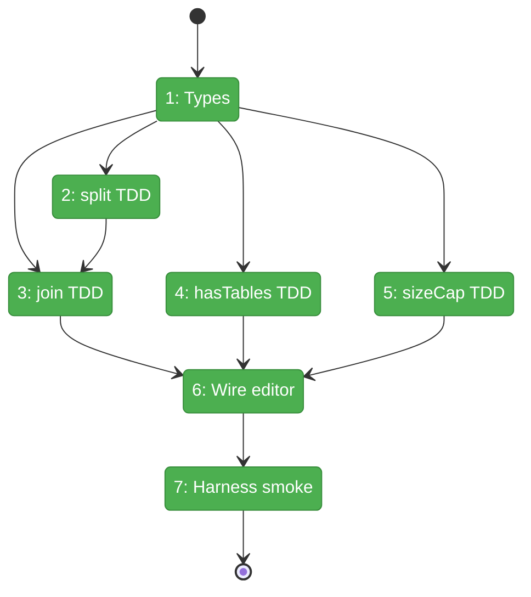
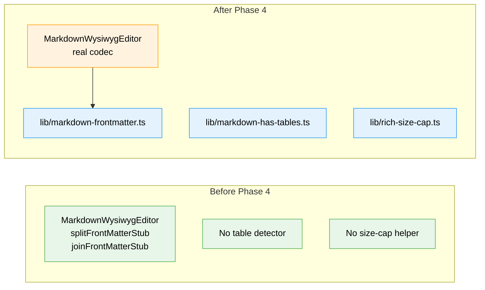

# Flight Plan: Phase 4 — Utilities (TDD)

**Plan**: [../../md-editor-plan.md](../../md-editor-plan.md)
**Phase**: Phase 4: Utilities (TDD)
**Generated**: 2026-04-19
**Status**: Landed

---

## Departure → Destination

**Where we are**: Phases 1–3 shipped. The `MarkdownWysiwygEditor` mounts, the 16-button toolbar drives edits, and the link popover handles insert/edit/unlink with sanitized URLs. 87/87 unit tests green; harness smoke (desktop + tablet) green. But the editor still runs a passthrough stub for YAML front-matter (`markdown-wysiwyg-editor.tsx:43-48`), so a real `.md` file with front-matter would round-trip incorrectly on first edit. Phase 5 needs `hasTables` + `exceedsRichSizeCap` helpers that don't yet exist.

**Where we're going**: Three pure-utility modules land in `_platform/viewer/lib/` — `markdown-frontmatter.ts`, `markdown-has-tables.ts`, `rich-size-cap.ts`. All three are TDD'd to ≥ 26 combined unit tests covering every Finding-03 hazard. The editor imports the real codec, replacing the stubs. A harness smoke extension proves front-matter survives an edit round-trip byte-for-byte. After this phase, every Phase-5 dependency is in place.

---

## Domain Context

### Domains We're Changing

| Domain | What Changes | Key Files |
|--------|-------------|-----------|
| `_platform/viewer` | Adds three pure utility modules + 3 test files + 1 editor wire-in + barrel exports | `lib/markdown-frontmatter.ts`, `lib/markdown-has-tables.ts`, `lib/rich-size-cap.ts`, `components/markdown-wysiwyg-editor.tsx`, `index.ts` |
| (infra) | Dev route gains front-matter sample toggle; harness spec gains front-matter assertions | `apps/web/app/dev/markdown-wysiwyg-smoke/page.tsx`, `harness/tests/smoke/markdown-wysiwyg-smoke.spec.ts` |

### Domains We Depend On (no changes)

| Domain | What We Consume | Contract |
|--------|----------------|----------|
| `_platform/viewer` | `MarkdownWysiwygEditorProps`, `FrontMatterCodec` types | `lib/wysiwyg-extensions.ts` exports |
| `_platform/themes` | Not consumed in Phase 4 | n/a |

---

## Flight Status

<!-- Updated by /plan-6-v2: pending → active → done. Use blocked for problems/input needed. -->



**Legend**: grey = pending | yellow = active | red = blocked/needs input | green = done

---

## Stages

<!-- Updated by /plan-6-v2 during implementation: [ ] → [~] → [x] -->

- [x] **Stage 1: Confirm types** — verify `FrontMatterCodec` + props in `wysiwyg-extensions.ts` match planned function shapes; add gaps if any (`lib/wysiwyg-extensions.ts`)
- [x] **Stage 2: TDD `splitFrontMatter`** — RED 12+ edge cases, then GREEN the numbered-pipeline implementation (`lib/markdown-frontmatter.ts` — new file, `test/...frontmatter.test.ts` — new file)
- [x] **Stage 3: TDD `joinFrontMatter` + round-trip invariant** — RED join cases + round-trip corpus, then GREEN trivial concat (`lib/markdown-frontmatter.ts` — extend, `test/...frontmatter.test.ts` — extend)
- [x] **Stage 4: TDD `hasTables`** — RED 8+ cases incl. fenced-code suppression, then GREEN scanner (`lib/markdown-has-tables.ts` — new file, `test/...has-tables.test.ts` — new file)
- [x] **Stage 5: TDD `exceedsRichSizeCap`** — RED 4 cases incl. multi-byte, then GREEN `TextEncoder`-based helper (`lib/rich-size-cap.ts` — new file, `test/...rich-size-cap.test.ts` — new file)
- [x] **Stage 6: Wire utilities into editor** — swap stubs; add round-trip unit test; extend barrel (`markdown-wysiwyg-editor.tsx`, test, `index.ts`)
- [x] **Stage 7: Harness smoke — front-matter round-trip** — add fixture toggle + 2 new desktop assertions (`app/dev/.../page.tsx`, `harness/tests/smoke/...spec.ts`)

---

## Architecture: Before & After



**Legend**: existing (green, unchanged) | changed (orange, modified) | new (blue, created)

---

## Acceptance Criteria

- [ ] `splitFrontMatter` round-trips cleanly on all 6 corpus samples (Finding 03)
- [ ] `joinFrontMatter(split(x).frontMatter, split(x).body) === x` for every corpus file (AC-10 contribution)
- [ ] `hasTables` matches GFM tables (header+separator) and ignores tables inside ``` / ~~~ fenced code (AC-11 contribution)
- [ ] `exceedsRichSizeCap` uses UTF-8 byte length via `TextEncoder` and correctly flags a 100_000-char CJK string (AC-16a)
- [ ] Editor component has zero remaining `FrontMatterStub` references (`grep` clean)
- [ ] Editor mount/unmount with front-matter-bearing value emits zero `onChange` calls when value unchanged (Finding 11)
- [ ] Harness desktop smoke passes: `<h1>Body</h1>` renders, front-matter preserved in `window.__smokeGetMarkdown()` both pre- and post-edit
- [ ] All 87+ prior unit tests stay green; ≥ 26 new tests land green
- [ ] No new test-only dependencies installed (no `fast-check`)
- [ ] `pnpm -F web typecheck` no worse than the 4 pre-existing errors (`debt` entry from Phase 1 T002)

## Goals & Non-Goals

**Goals**:
- Replace Phase 1 front-matter stubs with edge-case-hardened real implementations
- Ship the two Phase-5 dependency helpers (`hasTables`, `exceedsRichSizeCap`)
- Prove front-matter round-trip in the browser via harness smoke
- Zero UI work; zero new test deps

**Non-Goals**:
- FileViewerPanel wiring (Phase 5)
- Warn-banner UI (Phase 5.5 — Phase 4 only ships the detector)
- Rich-button disable UI (Phase 5.4 — Phase 4 only ships the gate helper)
- Full corpus round-trip suite (Phase 6.2)
- TOML front-matter (`+++` fences) — spec scope is YAML only
- `fast-check` property-based testing — table-driven samples suffice at this scope

---

## Checklist

- [x] T001: Interface-first types confirm/add against `wysiwyg-extensions.ts`
- [x] T002: TDD `splitFrontMatter` — 16+ cases RED → GREEN
- [x] T003: TDD `joinFrontMatter` + bidirectional round-trip invariant
- [x] T004: TDD `hasTables` — 14+ cases incl. fenced-code suppression + nested fences + alignment colons
- [x] T005: TDD `exceedsRichSizeCap` + `RICH_MODE_SIZE_CAP_BYTES = 200_000` (with KB-disambiguation JSDoc)
- [x] T006: Wire utilities into `markdown-wysiwyg-editor.tsx`; remove stubs; add lifecycle-safety test; extend barrel
- [x] T007: Harness smoke — add front-matter fixture toggle + 4 new assertions + screenshot
