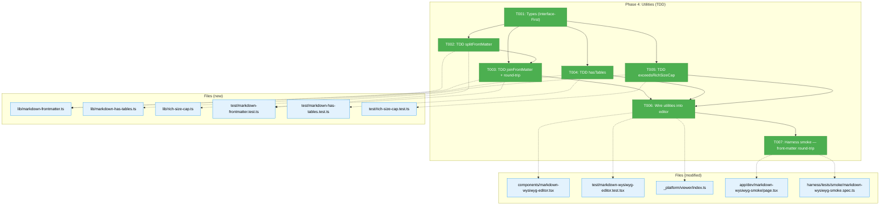
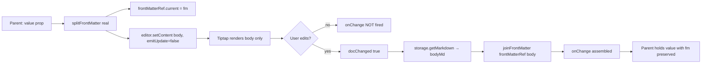
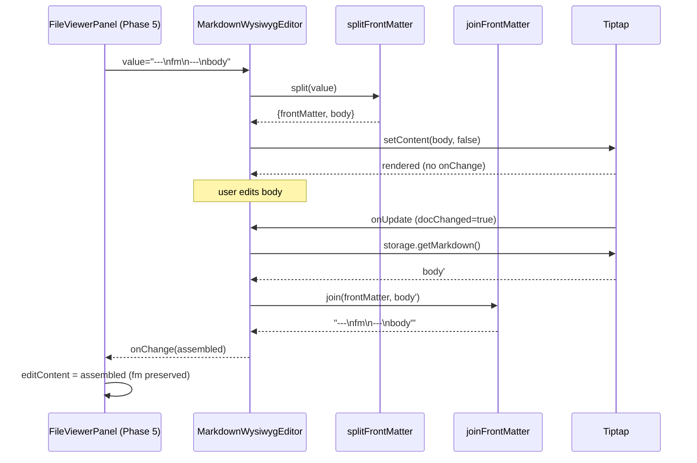

# Phase 4: Utilities (TDD)

**Plan**: [../../md-editor-plan.md](../../md-editor-plan.md)
**Spec**: [../../md-editor-spec.md](../../md-editor-spec.md)
**Workshop**: [../../workshops/001-editing-experience-and-ui.md](../../workshops/001-editing-experience-and-ui.md)
**Generated**: 2026-04-19
**Status**: Landed

---

## Executive Briefing

**Purpose**: Replace the Phase 1 front-matter passthrough stubs (`markdown-wysiwyg-editor.tsx:43-48`) with real, edge-case-hardened utilities — and ship the two other pure utilities Phase 5 needs (`hasTables` for the warn banner; `exceedsRichSizeCap` for the 200 KB Rich gate). Zero UI. Strict TDD: tests red first, then green. This is the smallest, most isolated phase of the plan, and it's the last blocker before Phase 5 can wire Rich into `FileViewerPanel`.

**What We're Building**:
- `splitFrontMatter(md)` / `joinFrontMatter(fm, body)` — YAML front-matter detection that survives CRLF, BOM, `---` tokens inside fenced code, malformed-open-without-close, front-matter-only files, and empty input. Round-trip invariant: `join(split(x).frontMatter, split(x).body) === x` for every file in the test corpus. Finding 03 is **the** hazard of this phase — a bug here causes silent user data loss.
- `hasTables(md)` — GFM table detection that requires a pipe row immediately followed by a header-separator row (`|---|`), while ignoring tables inside fenced code blocks. Drives the dismissible warn banner in Phase 5.5 (AC-11).
- `RICH_MODE_SIZE_CAP_BYTES = 200_000` + `exceedsRichSizeCap(content)` helper. Uses UTF-8 byte length, not string `.length`. Drives the Rich button disable path in Phase 5.4 (AC-16a).
- Wire all three into `markdown-wysiwyg-editor.tsx`: replace `splitFrontMatterStub` / `joinFrontMatterStub` with the real imports; add a unit test that asserts a front-matter-bearing doc mounts + unmounts with byte-identical round-trip.
- Harness smoke extension: feed the dev route a sample with YAML front-matter; verify `window.__smokeGetMarkdown()` returns a string whose first 30 chars match the original front-matter verbatim.

**Goals**:
- ✅ `splitFrontMatter` passes ≥ 12 unit tests covering every hazard in Finding 03
- ✅ `joinFrontMatter` passes round-trip-property assertions against a corpus of 5+ realistic samples
- ✅ `hasTables` correctly distinguishes real GFM tables from tables-in-code and pipe-containing prose
- ✅ `exceedsRichSizeCap` uses UTF-8 byte length (so a 100 KB string of multi-byte codepoints >200 KB correctly trips)
- ✅ Editor component imports the real utilities — zero remaining `splitFrontMatterStub` / `joinFrontMatterStub` references repo-wide
- ✅ New unit test in `markdown-wysiwyg-editor.test.tsx` asserts front-matter survives mount/unmount byte-for-byte with zero `onChange` emissions
- ✅ Harness smoke spec extended with front-matter round-trip assertion; all existing Phase 1/2/3 assertions preserved
- ✅ Constitution §3 TDD and §4/§7 fakes-over-mocks respected — no `vi.mock` / `vi.fn` / `vi.spyOn`
- ✅ `pnpm -F web typecheck` no worse than the 4 pre-existing errors (Phase 6.10 sweep)

**Non-Goals**:
- ❌ FileViewerPanel wiring — Phase 5 owns
- ❌ Warn banner UI — Phase 5.5 owns (this phase only ships the detector)
- ❌ Rich-button disable UI — Phase 5.4 owns (this phase only ships the gate helper)
- ❌ `fast-check` / property-based testing library — use table-driven samples instead; installing a new test-only dep would exceed scope and the plan's "handful of realistic samples" guidance (plan § 4.4)
- ❌ Parse YAML content — we ONLY split the fence. Parsing is never needed (the body is opaque to the editor round-trip)
- ❌ Handle `+++`-fenced TOML front-matter — spec scope is YAML `---` fences only
- ❌ Round-trip test corpus of real markdown files — Phase 6.2 owns (AC-08/09/10). This phase uses small synthetic fixtures inside the test file itself

---

## Prior Phase Context

### Phase 1 (completed 2026-04-18)

**A. Deliverables** (paths Phase 4 touches)
- `/Users/jordanknight/substrate/083-md-editor/apps/web/src/features/_platform/viewer/components/markdown-wysiwyg-editor.tsx` — currently defines local `splitFrontMatterStub` / `joinFrontMatterStub` **functions** at lines 43–48 (called at lines 157 and 170). Phase 4 deletes the local definitions and adds a new `import { splitFrontMatter, joinFrontMatter } from '../lib/markdown-frontmatter'` in the import block (near line 34, alongside the existing `sanitizeLinkHref` and `wysiwyg-extensions` imports).
- `/Users/jordanknight/substrate/083-md-editor/apps/web/src/features/_platform/viewer/lib/wysiwyg-extensions.ts` — already exports `FrontMatterCodec` interface (lines 31–36). Phase 4 can reuse or leave unused; the new utilities export named functions directly.
- `/Users/jordanknight/substrate/083-md-editor/apps/web/src/features/_platform/viewer/index.ts` — barrel. Phase 4 adds `splitFrontMatter`, `joinFrontMatter`, `hasTables`, `exceedsRichSizeCap`, `RICH_MODE_SIZE_CAP_BYTES` exports.
- `/Users/jordanknight/substrate/083-md-editor/apps/web/app/dev/markdown-wysiwyg-smoke/page.tsx` — dev route. Phase 4 adds a front-matter bearing sample behind a toggle (or extends the existing `sampleMarkdown`).
- `/Users/jordanknight/substrate/083-md-editor/harness/tests/smoke/markdown-wysiwyg-smoke.spec.ts` — Phase 4 extends with one assertion (front-matter preserved in `window.__smokeGetMarkdown()`).

**B. Dependencies Exported** (consumed by Phase 4)
- `MarkdownWysiwygEditor` props unchanged — Phase 4 is purely internal plumbing
- `lastRenderedValueRef` + `frontMatterRef` pattern already in place (editor.tsx:102, 121) — Phase 4 merely swaps the implementations the refs feed into
- `window.__smokeGetMarkdown()` (pull-based getter, Phase 3) — Phase 4 harness spec continues to use this for markdown inspection

**C. Gotchas & Debt** (carry into Phase 4)
- `gotcha` — tiptap-markdown serializer backslash-escapes `(` and `)` in link hrefs; not relevant to Phase 4, but test authors should remember it if they craft samples containing parenthesized URLs
- `gotcha` — jsdom + ProseMirror focus unreliable; keep Phase 4 tests DOM-assertion-based, no focus dependencies (the utilities are pure so this is trivially satisfied)
- `gotcha` — Harness Chromium is Linux-container → `MOD_KEY = 'Control'`; irrelevant to Phase 4 (no new keybindings)
- `gotcha` — Turbopack caches compilation errors; `touch <file>` or restart dev server if dev route 500s mid-edit
- `debt` — 4 pre-existing TypeScript errors in unrelated features (`019-agent-manager-refactor`, `074-workflow-execution`, `_platform/panel-layout`). Phase 6.10 sweeps
- `debt` — Dev route `/dev/markdown-wysiwyg-smoke` retained as scaffolding through Phase 4; Phase 5.11 deletes

**D. Incomplete Items**: All Phase 1 tasks and acceptance criteria green. Phase 4 picks up exactly where Phase 1 TODO'd: replace the front-matter stubs.

**E. Patterns to Follow**
- **Interface-First** (Constitution §2 / Finding 08): T001 ships types before any implementation. `FrontMatterCodec` already exists in `wysiwyg-extensions.ts`; Phase 4's new exports are concrete functions that satisfy its shape
- **Pure utility TDD** (Phase 3 `sanitize-link-href.ts` template): pure function → comprehensive test file → no mocks. The sanitize-link-href pattern (8-step numbered pipeline with commented rationale) is the exemplar to follow
- **Test placement**: `/Users/jordanknight/substrate/083-md-editor/test/unit/web/features/_platform/viewer/*.test.ts`; Vitest root config picks these up — run via `pnpm exec vitest run <path>`
- **No mocks** (Constitution §4/§7): utilities are pure → tests pass real string inputs. No `vi.mock`, `vi.fn`, or `vi.spyOn`
- **Ref-stable callbacks** (Phase 1 `onChangeRef`, Phase 2 `onEditorReadyRef`, Phase 3 `onOpenLinkDialogRef`): not directly relevant to Phase 4 (no new callbacks) but the pattern is documented in case the editor wire-in discovers a new ref need

### Phase 2 (completed 2026-04-18)

**A. Deliverables** (relevant paths)
- Toolbar + 16-button config. Phase 4 touches none of this.

**B. Dependencies Exported** (consumed by Phase 4)
- None directly — Phase 4 only touches the editor's front-matter handling + three new utilities.

**C/D/E**: Not applicable — Phase 4 is orthogonal to toolbar work. Phase 4 must ensure the 40+ Phase 2 unit tests stay green (the toolbar tests mount an editor instance; if the real front-matter codec breaks `setContent`, those tests fail).

### Phase 3 (completed 2026-04-19)

**A. Deliverables** (relevant paths)
- `/Users/jordanknight/substrate/083-md-editor/apps/web/src/features/_platform/viewer/lib/sanitize-link-href.ts` — the template Phase 4 mirrors stylistically (commented numbered pipeline, `export function`, discriminated-union return, exhaustive allow-list approach)
- `/Users/jordanknight/substrate/083-md-editor/test/unit/web/features/_platform/viewer/sanitize-link-href.test.ts` — 26 cases; the template for Phase 4's test style (organized sections with commented rationale; real inputs, no mocks)
- `/Users/jordanknight/substrate/083-md-editor/apps/web/app/dev/markdown-wysiwyg-smoke/page.tsx` — adds front-matter sample in Phase 4 T007 (toggle between plain + front-matter-bearing fixtures)
- Harness spec extended with `window.__smokeGetMarkdown` pull-based getter — Phase 4 reuses

**B. Dependencies Exported** (consumed by Phase 4)
- None directly. Phase 4 is parallel infrastructure work; no import from Phase 3.

**C. Gotchas & Debt**
- `gotcha` — Phase 3 T007: `editor.on('update', () => setReactState(...))` causes React re-renders that disrupt Tiptap chord timing. Phase 4 must NOT introduce similar update-driven React state in the editor component
- `insight` — Phase 3: Radix Popover `modal={true}` is required for focus trap (not relevant to Phase 4)
- `insight` — Phase 3 validation: generic `onChange` spam breaks Phase 2's Mod-Alt-C timing. For Phase 4's new editor wire-in test, use the pull-based `window.__smokeGetMarkdown()` getter — do NOT add new React state subscriptions to the dev route

**D. Incomplete Items**: All Phase 3 tasks green. 87/87 unit tests passing before Phase 4.

**E. Patterns to Follow**
- **Pure-utility TDD workflow** (`sanitize-link-href.ts` is the model): section the test file by concern (`// --- happy path`, `// --- malformed`, `// --- edge cases`); write all tests RED first; implement; confirm all GREEN in one commit per utility
- **Discriminated-union return shape** — sanitize-link-href returns `{ ok: true, href } | { ok: false, reason }`. `splitFrontMatter` has no failure mode (malformed input → `{ frontMatter: '', body: original }` passthrough); `joinFrontMatter` likewise total. `hasTables` → boolean. `exceedsRichSizeCap` → boolean. So: no new discriminated unions needed in this phase
- **Commented numbered pipeline** — follow the `// 1. … // 2. …` style from sanitize-link-href.ts so reviewers can map test cases to implementation branches
- **CS-2 scope discipline** — Phase 3 hit Mod-Alt-C flake when a well-intentioned smoke-route change (`setMarkdownOutput` on every update) disrupted timing. Phase 4 must preserve the pull-based `window.__smokeGetMarkdown()` contract in the dev route

---

## Pre-Implementation Check

| File | Exists? | Domain Check | Notes |
|------|---------|-------------|-------|
| `apps/web/src/features/_platform/viewer/lib/markdown-frontmatter.ts` | **No** (create) | `_platform/viewer` ✅ | Pure utility module — exports `splitFrontMatter`, `joinFrontMatter` |
| `apps/web/src/features/_platform/viewer/lib/markdown-has-tables.ts` | **No** (create) | `_platform/viewer` ✅ | Pure utility — exports `hasTables` |
| `apps/web/src/features/_platform/viewer/lib/rich-size-cap.ts` | **No** (create) | `_platform/viewer` ✅ | Exports `RICH_MODE_SIZE_CAP_BYTES` constant + `exceedsRichSizeCap(content)` helper. Named `rich-size-cap.ts` rather than plain `constants.ts` (plan-3 suggestion) so the filename carries the domain concept; constants-only files invite unrelated-constant accumulation |
| `test/unit/web/features/_platform/viewer/markdown-frontmatter.test.ts` | **No** (create) | test | ≥ 16 cases — happy, empty, no fm, malformed open without close, `---` inside fenced code, CRLF, BOM, front-matter-only, empty file, BOM+CRLF combined, blank-line-after-close, setext-`---`-in-body, close-fence-no-trailing-newline-at-EOF; round-trip invariant sub-suite (forward + reverse) |
| `test/unit/web/features/_platform/viewer/markdown-has-tables.test.ts` | **No** (create) | test | ≥ 14 cases — header+separator match, table in fenced code ignored, pipe-text-no-separator ignored, table after front-matter still matches, leading whitespace tolerated (0–3 spaces), 4-space-indented table rejected (code block), alignment colons in separator, nested fence case (```/ ~~~ pairing) |
| `test/unit/web/features/_platform/viewer/rich-size-cap.test.ts` | **No** (create) | test | 3 cases — under-cap, at-cap-boundary, over-cap with multi-byte content (emoji / CJK forces byte length > string length) |
| `apps/web/src/features/_platform/viewer/components/markdown-wysiwyg-editor.tsx` | **Yes** (modify) | `_platform/viewer` ✅ | Replace stub imports at lines 34 + 43–48 with real utility imports; remove the two local stub functions |
| `test/unit/web/features/_platform/viewer/markdown-wysiwyg-editor.test.tsx` | **Yes** (extend) | test | Add 1 test: mount with front-matter-bearing content → value prop round-trips through the editor unchanged (check `onChange` is NOT called when switching `value` to itself) |
| `apps/web/src/features/_platform/viewer/index.ts` | **Yes** (modify) | `_platform/viewer` ✅ | Add barrel exports for the three new utilities + constant |
| `apps/web/app/dev/markdown-wysiwyg-smoke/page.tsx` | **Yes** (extend) | infra (dev-only) | Add a front-matter-bearing sample behind a button/toggle; existing plain sample preserved as default so Phase 1/2/3 harness assertions stay green |
| `harness/tests/smoke/markdown-wysiwyg-smoke.spec.ts` | **Yes** (extend) | infra | Add one assertion — after toggling to front-matter sample, `window.__smokeGetMarkdown()` starts with `---\n`; all existing assertions preserved |

**Concept duplication check**:
- **"Front-matter split/rejoin"** — no prior implementation exists in the codebase. `grep -r "frontmatter\\|front-matter" apps/web/src` returns zero matches outside the new plan artifacts. ✅ No duplication
- **"GFM table detection"** — `react-markdown` and `remark-gfm` are transitively available (via `markdown-preview.tsx`), but they are full parsers. Phase 4's need is lightweight detection for a warn banner — full parsing would be ≥ 30 KB added to a utility module used by `file-browser`. The custom regex-based detector is justifiable (narrow need, fast, no parser ownership). ✅ Proceed with custom
- **"UTF-8 byte length"** — `Buffer.byteLength` is Node-only, but the utility runs in the browser. Use `new TextEncoder().encode(content).length` — `TextEncoder` is a DOM/Node universal. Verified available in `lib: ["DOM", "ES2020"]` tsconfig baseline. ✅

**Contract risks**:
- `splitFrontMatter` / `joinFrontMatter` contract is the exported-function shape + round-trip invariant. Phase 5 depends on both via the editor component (indirectly). **Higher risk** — a bug here silently loses user front-matter across mode switches
- `hasTables` contract is `(md: string) => boolean`. Consumed by Phase 5.5. **Low risk** — false negatives degrade banner UX but don't lose data; false positives are dismissible
- `exceedsRichSizeCap` contract is `(content: string) => boolean`. Consumed by Phase 5.4. **Low risk** — false positive disables a valid Rich session; false negative allows a slow Rich session (user can fall back to Source)
- `RICH_MODE_SIZE_CAP_BYTES = 200_000` — must match Phase 5.4's tooltip copy and spec AC-16a. Exported constant rather than inline literal to prevent drift

**Harness health check**:
- `just harness-health` confirmed healthy at phase start: `app=up, mcp=up, terminal=up, cdp=up (Chrome/136.0.7103.25)`. L3 Playwright + CDP available for T007 smoke extension.
- Status: Harness available at **L3**.

---

## Architecture Map



---

## Tasks

**Plan-to-dossier mapping** (7 dossier tasks cover plan-3's 8 subtasks + one justified addition):
- Plan 4.1 (split RED) + 4.2 (split GREEN) → **T002** (combined RED→GREEN per the TDD template established in Phase 3 sanitize-link-href)
- Plan 4.3 (join RED) + 4.4 (join GREEN + round-trip property) → **T003** (combined RED→GREEN; bidirectional invariant added per FC-validator feedback)
- Plan 4.5 (hasTables RED) + 4.6 (hasTables GREEN) → **T004** (combined RED→GREEN)
- Plan 4.7 (exceedsRichSizeCap) → **T005**
- Plan 4.8 (wire into editor) → **T006** (strengthened with lifecycle-safety test per FC-validator feedback)
- **T001** is a new Interface-First verification gate (Finding 08) — confirms the existing `FrontMatterCodec` interface matches the planned function shapes before any implementation lands
- **T007 is an addition beyond plan-3's 8 subtasks** — justified by Finding 03 ("silent data loss = user data loss") being the critical risk of this phase. Plan 4.8's success criterion calls for "a round-trip manual test" on the editor; T007 automates that into a harness smoke assertion so the regression surface persists beyond the one-time manual eyeball. Without T007, Phase 6.2's corpus round-trip (which only runs end-to-end in Phase 6) is the next check — and discovering front-matter loss there means Phase 5 was built on a broken base

| Status | ID | Task | Domain | Path(s) | Done When | Notes |
|--------|-----|------|--------|---------|-----------|-------|
| [x] | T001 | **Interface-first types**. Add exported types to `lib/wysiwyg-extensions.ts` (if needed beyond the existing `FrontMatterCodec`): nothing new is required — `splitFrontMatter` returns `{ frontMatter: string; body: string }`, `joinFrontMatter` returns `string`, `hasTables` returns `boolean`, `exceedsRichSizeCap` returns `boolean`. Confirm `FrontMatterCodec` (already declared in `wysiwyg-extensions.ts:33-36`) matches the planned function shapes; if a gap exists, add/adjust. No implementation yet. | `_platform/viewer` | `/Users/jordanknight/substrate/083-md-editor/apps/web/src/features/_platform/viewer/lib/wysiwyg-extensions.ts` | `pnpm -F web typecheck` no worse than baseline (4 pre-existing errors); exported types match planned function signatures | Finding 08. May be a zero-change task if existing types already suffice — mark `[x]` and note in execution log |
| [x] | T002 | **TDD `splitFrontMatter`**. RED: write `markdown-frontmatter.test.ts` with ≥ 16 failing cases: (1) happy path `---\nkey: value\n---\nbody` → `{ frontMatter: '---\nkey: value\n---\n', body: 'body' }` — the **closing fence's newline belongs to frontMatter**, body starts at the first post-fence character; (2) no front-matter → `{ frontMatter: '', body: input }`; (3) open fence without close → passthrough; (4) `---` inside fenced code in body → body fence NOT mistaken for close; (5) CRLF line endings (`---\r\nkey: v\r\n---\r\nbody`); (6) leading UTF-8 BOM (`\ufeff`) before front-matter → BOM preserved in frontMatter, fence still detected; (7) **front-matter-only file** (`---\nfoo: bar\n---\n` with no body after close fence) → `{ frontMatter: '---\nfoo: bar\n---\n', body: '' }`; (8) empty string; (9) whitespace-only input; (10) `---\n---\n` immediate close (empty fm body) with body after; (11) first line `---` but second line not `---` (malformed 2-line); (12) `---` on line 501 (beyond search cap) → no close found → passthrough; (13) **BOM + CRLF combined** (`\ufeff---\r\nk:v\r\n---\r\nbody`) — hostile cross-platform case; (14) **blank line after close fence** (`---\nk:v\n---\n\nbody`) → body starts with `\n` (round-trip preserves the blank line); (15) **setext-heading `---` in body** (`---\nk:v\n---\nHeading\n---\nnot a close fence`) — first post-fm `---` is a setext underline, NOT a second close; scanner must stop at the FIRST close after the open; (16) **close fence with no trailing newline at EOF** (`---\nk:v\n---`) → `{ frontMatter: '---\nk:v\n---', body: '' }`. GREEN: implement `splitFrontMatter(md: string): { frontMatter: string; body: string }`. Algorithm — **line-based scan** (NOT regex `/m` flag): `const lines = md.split('\n'); if (lines[0] !== '---' && lines[0] !== '\ufeff---') return { frontMatter: '', body: md };` then scan `lines[1..500]` for the first `line === '---'` (stripping a trailing `\r` for CRLF tolerance). If found at index `i`, reconstruct frontMatter by taking `lines[0..i]` joined by `\n` and appending the trailing `\n` **only if** the original input had one after the close fence (preserve byte-identity). **Invariant (documented in code)**: `split(x).frontMatter + split(x).body === x` for ALL inputs, and `split(join(fm, body))` is the left-inverse of `join` for all outputs of a prior `split`. | `_platform/viewer` | `/Users/jordanknight/substrate/083-md-editor/apps/web/src/features/_platform/viewer/lib/markdown-frontmatter.ts` (new), `/Users/jordanknight/substrate/083-md-editor/test/unit/web/features/_platform/viewer/markdown-frontmatter.test.ts` (new) | All 16+ tests green; implementation is a single function with numbered comments per branch (sanitize-link-href.ts style); zero mocks; round-trip invariant documented in a JSDoc comment above the function | Finding 03 — **the** hazard of this phase. Silent front-matter loss = silent user data loss. The setext case (15) and BOM+CRLF case (13) are the subtle ones where prior implementations of this pattern have regressed — test explicitly |
| [x] | T003 | **TDD `joinFrontMatter` + bidirectional round-trip invariant**. RED: add to `markdown-frontmatter.test.ts` a `join` describe block: (1) empty fm + body → body unchanged; (2) non-empty fm + empty body → fm unchanged; (3) non-empty both → concatenation (no extra separator — split already includes the trailing `\n` in frontMatter); (4) **forward round-trip suite** — for each of a hand-picked corpus of 7 samples (happy YAML, CRLF YAML, BOM-prefixed YAML, no-fm plain markdown, empty string, front-matter-only, blank-line-after-close), assert `joinFrontMatter(split(s).frontMatter, split(s).body) === s`; (5) **reverse round-trip suite** — for a few legitimate `(fm, body)` pairs, assert `splitFrontMatter(joinFrontMatter(fm, body))` returns exactly `{ frontMatter: fm, body: body }` (guards against asymmetry where one direction passes but the other fails). GREEN: implement `joinFrontMatter(fm: string, body: string): string` — if `fm === ''` return `body`; else return `fm + body` (no separator inserted; split already captured the closing-fence newline inside `frontMatter`). Add a JSDoc comment above the function stating the bidirectional invariant. | `_platform/viewer` | `/Users/jordanknight/substrate/083-md-editor/apps/web/src/features/_platform/viewer/lib/markdown-frontmatter.ts` (extend), `/Users/jordanknight/substrate/083-md-editor/test/unit/web/features/_platform/viewer/markdown-frontmatter.test.ts` (extend) | All join tests green; both forward AND reverse round-trip suites green; total test count in the file ≥ 23 | Bidirectional testing catches the sneaky case where forward round-trip passes by coincidence. If the invariant fails, fix the SPLIT side — join is constrained to be trivial concat. `fast-check` intentionally NOT used — table-driven samples suffice (plan § 4.4) |
| [x] | T004 | **TDD `hasTables`**. RED: write `markdown-has-tables.test.ts` with ≥ 14 failing cases: (1) `\| a \| b \|\n\|---\|---\|` → true; (2) plain text with no pipes → false; (3) table inside ` ``` ` fenced code → false; (4) table after front-matter → true; (5) pipes in prose `a \| b is my favorite` without separator → false; (6) separator row before content row (reversed) → false (must be header-then-separator order); (7) leading whitespace on table rows tolerated (up to 3 spaces); (8) `~~~`-fenced code block ignored (not just backticks); (9) single-column table `\| a \|\n\|---\|` → true; (10) CRLF line endings; (11) table at end of file with no trailing newline; (12) **4-space-indented table rejected** (CommonMark treats as code block, not table) → false; (13) **alignment colons in separator** (`\|:---\|---:\|:---:\|`) → true (detector must tolerate `:` in separator row); (14) **nested fence case** (`` ``` `` opened inside `~~~` or vice versa) — fence-state tracking must not double-toggle; table inside the nested-but-still-fenced region → false. GREEN: implement `hasTables(md: string): boolean`. Algorithm: scan line-by-line tracking fence state with the rule "a fence line only toggles if it matches the CURRENTLY-OPEN fence type, or if no fence is open" (so `` ``` `` inside a `~~~` block does NOT close the `~~~`). For each non-fenced line: if it matches `/^ {0,3}\|.*\|\s*$/` and the next line matches `/^ {0,3}\|[\s:|-]+\|\s*$/` containing at least one `-`, return true. Else continue. Return false at EOF. **Note**: `\s` matches tab; use `/ {0,3}/` explicitly so a leading tab (= 4 spaces visually) correctly rejects via the code-block rule. | `_platform/viewer` | `/Users/jordanknight/substrate/083-md-editor/apps/web/src/features/_platform/viewer/lib/markdown-has-tables.ts` (new), `/Users/jordanknight/substrate/083-md-editor/test/unit/web/features/_platform/viewer/markdown-has-tables.test.ts` (new) | All 14+ tests green; fence-state tracking respects fence-type pairing (not naive toggle); no false positives on pipe-text-no-separator or indented-code tables | AC-11. The banner is dismissible, so over-detection is worse than under-detection (user trust) — bias toward strict (two-row match required). Blockquote / list-item tables are deliberately NOT covered — if a user writes a table inside a blockquote or list, they know markdown and are past the banner's audience |
| [x] | T005 | **TDD `exceedsRichSizeCap` + constant**. RED: write `rich-size-cap.test.ts` with 5 cases: (1) empty string → false; (2) 199_999 ASCII characters → false (just under); (3) 200_001 ASCII characters → true (just over); (4) 100_000 copies of a 3-byte CJK codepoint `'中'` (= 300_000 bytes) → true — exercises the byte-vs-char distinction; (5) **exact multi-byte boundary** — `'中'.repeat(66_666)` (= 199_998 bytes) → false, `'中'.repeat(66_667)` (= 200_001 bytes) → true — proves the comparison is strict and off-by-one-safe on a non-ASCII input. GREEN: create `rich-size-cap.ts` exporting `export const RICH_MODE_SIZE_CAP_BYTES = 200_000;` with a JSDoc comment **explicitly disambiguating**: `/** 200_000 bytes (decimal kilobytes, not 204_800 KiB). Matches the spec's informal "200 KB" phrasing; consumed by Phase 5.4's tooltip copy. */` and `export function exceedsRichSizeCap(content: string): boolean { return new TextEncoder().encode(content).length > RICH_MODE_SIZE_CAP_BYTES; }`. | `_platform/viewer` | `/Users/jordanknight/substrate/083-md-editor/apps/web/src/features/_platform/viewer/lib/rich-size-cap.ts` (new), `/Users/jordanknight/substrate/083-md-editor/test/unit/web/features/_platform/viewer/rich-size-cap.test.ts` (new) | All 5 tests green; constant value exactly `200_000` with disambiguation comment (matches spec AC-16a); boundary test proves strict `>` comparison | AC-16a + Finding 12. `TextEncoder` over `Buffer.byteLength` — utility must run in the browser, not Node. The disambiguation comment is the mitigation for FC-validator Issue 1 (spec "200 KB" ambiguity — decimal vs binary) |
| [x] | T006 | **Wire utilities into editor**. Modify `markdown-wysiwyg-editor.tsx`: (1) **delete** the local stub function definitions at lines 43–48; (2) **add** `import { splitFrontMatter, joinFrontMatter } from '../lib/markdown-frontmatter';` in the import block near line 34; (3) update the `splitFrontMatterStub(value)` call at line 170 → `splitFrontMatter(value)`; (4) update the `joinFrontMatterStub(frontMatterRef.current, bodyMarkdown)` call at line 157 → `joinFrontMatter(frontMatterRef.current, bodyMarkdown)`. Extend `markdown-wysiwyg-editor.test.tsx`: add **TWO** tests — (a) mount with `value="---\nfoo: bar\n---\n# Heading\n"`, assert editor DOM contains `<h1>Heading</h1>` and the test-owned `onChange` callback fires ZERO times when the parent re-renders with the same `value`; (b) **lifecycle-safety test** — mount with a front-matter-bearing `value`, then call `editor.commands.insertContent(' more')` (or equivalent synthetic user edit) to force `onUpdate` with `transaction.docChanged === true`, capture the latest `onChange` argument, and assert it **starts with** `'---\nfoo: bar\n---\n'` — proves `frontMatterRef` was populated correctly by `split()` and the subsequent `join()` reattaches front-matter to the emitted markdown. This catches the specific "split returns empty fm" silent-data-loss path that pure unit tests of `splitFrontMatter` cannot detect. Update `index.ts` barrel to export BOTH the function AND constant: `splitFrontMatter`, `joinFrontMatter`, `hasTables`, `exceedsRichSizeCap`, `RICH_MODE_SIZE_CAP_BYTES` (the constant is a named export — Phase 5.4 tooltip composition destructures it). | `_platform/viewer` | `/Users/jordanknight/substrate/083-md-editor/apps/web/src/features/_platform/viewer/components/markdown-wysiwyg-editor.tsx` (modify), `/Users/jordanknight/substrate/083-md-editor/test/unit/web/features/_platform/viewer/markdown-wysiwyg-editor.test.tsx` (extend), `/Users/jordanknight/substrate/083-md-editor/apps/web/src/features/_platform/viewer/index.ts` (modify) | Both new tests green (display + lifecycle-safety); no `splitFrontMatterStub` / `joinFrontMatterStub` references anywhere under `apps/web/src` (`grep -r "FrontMatterStub" apps/web/src` returns empty); **full `markdown-wysiwyg-editor.test.tsx` suite passes** (`pnpm exec vitest run test/unit/web/features/_platform/viewer/markdown-wysiwyg-editor.test.tsx` green); **full Phase 1/2/3 test regression sweep** (`pnpm exec vitest run test/unit/web/features/_platform/viewer/` green, ≥ 87 total pre-existing tests unchanged); `RICH_MODE_SIZE_CAP_BYTES` importable as a named export from `@/features/_platform/viewer` (smoke check at the import site) | Finding 03. Silent-data-loss risk manifests here. The lifecycle-safety test (b) is the mitigation for FC-validator Issue 4 (frontMatterRef contamination). After this task: **manually open the harness dev route with a front-matter sample before declaring done** — unit tests catch logic errors; a manual eyeball on live-mounted content catches integration errors |
| [x] | T007 | **Harness smoke — front-matter round-trip**. Extend dev route `app/dev/markdown-wysiwyg-smoke/page.tsx`: add a second `sampleMarkdown` variant with realistic YAML front-matter (e.g., `---\ntitle: Test Doc\ntags: [a, b]\n---\n\n# Body\n\nparagraph.\n`), and a button `[data-testid="fixture-toggle-frontmatter"]` that swaps the editor's `value` to this variant. Extend harness spec `harness/tests/smoke/markdown-wysiwyg-smoke.spec.ts` (preserve every existing Phase 1/2/3 assertion verbatim; add new assertions at the end of the desktop project only — mobile keyboard chord flake established in Phase 2 does not apply here but mobile assertion is over-scope): click the toggle → wait for `<h1>Body</h1>` in the editor DOM → call `window.__smokeGetMarkdown()` → assert the returned string starts with `---\ntitle: Test Doc\n`. Then type ` edited` somewhere in the body (via CDP), re-read `window.__smokeGetMarkdown()`, assert it STILL starts with `---\ntitle: Test Doc\n` (front-matter preserved through an edit). Run `just harness agent run code-review` is OUT OF SCOPE (Phase 5.11 will do a full review). Just: `just harness-dev` (or ensure container already running via `just harness-health`) → `just harness playwright -- --project=desktop --grep "front-matter"` green; full smoke (desktop + tablet) green. | `_platform/viewer` + infra | `/Users/jordanknight/substrate/083-md-editor/apps/web/app/dev/markdown-wysiwyg-smoke/page.tsx` (extend), `/Users/jordanknight/substrate/083-md-editor/harness/tests/smoke/markdown-wysiwyg-smoke.spec.ts` (extend) | Harness desktop project green (all prior assertions + new front-matter assertions); tablet project green (no regressions); screenshot evidence under `harness/results/phase-4/` | AC-10 evidence toward Phase 6.2's full corpus round-trip. Uses `window.__smokeGetMarkdown()` pull-based getter (Phase 3 pattern) — do NOT add update-driven React state |

---

## Context Brief

### Key findings from plan (this phase)

- **Finding 03** (Critical) — Tiptap's markdown extension does NOT understand YAML front-matter. A bug here = silent data loss. **Action**: T002/T003 TDD with every Finding-03 hazard as a named test case + T006's lifecycle-safety test (asserts real editor edits emit markdown with front-matter intact). T007 harness smoke automates the "manual round-trip" eyeball that plan 4.8 calls for.
- **Finding 08** (Medium) — Interface-First. **Action**: T001 confirms type shape before any implementation lands; `FrontMatterCodec` already declared in Phase 1.
- **Finding 10** (Medium) — Tiptap + React 19 + App Router hydration. **Phase-1-owned**; Phase 4 inherits `immediatelyRender: false` as a given. No Phase-4 action.
- **Finding 11** (Medium) — Round-trip fidelity depends on `onChange` NOT firing on mount. **Action**: T006's new test asserts zero `onChange` emissions when value round-trips unchanged (front-matter path must preserve the Phase 1 invariant).
- **Finding 12** (Low) — 130 KB gz budget. Phase 4's three utilities are all < 1 KB each (pure string logic) — no measurable budget impact.

### Domain dependencies (concepts and contracts this phase consumes)

- `_platform/viewer`: `MarkdownWysiwygEditorProps` (via `lib/wysiwyg-extensions.ts`) — unchanged by Phase 4
- `_platform/viewer`: `sanitize-link-href.ts` module (Phase 3) — **template only**, not imported; Phase 4's code style mirrors its numbered-pipeline comments
- `_platform/themes`: not touched

### Domain constraints

- All new files in `_platform/viewer/lib/`. No cross-domain imports — these utilities have no dependencies on `file-browser` or anything downstream
- Pure functions only — no React, no DOM APIs except `TextEncoder` (universal), no async, no side effects
- Constitution §4/§7 — no mocking libraries. All tests use real string inputs
- Exports go through `_platform/viewer/index.ts` barrel so Phase 5 can `import { hasTables, exceedsRichSizeCap, RICH_MODE_SIZE_CAP_BYTES } from '@/features/_platform/viewer'`
- Do not install `fast-check` or any new test-only dependency. Table-driven samples are sufficient at this scope

### Harness context

- **Boot**: `just harness-dev` (root justfile recipe — starts the harness dev container). Alternative form `just harness up` is routed through the root justfile's `harness *ARGS:` catch-all into the harness CLI's `up` subcommand (works, but `just harness-dev` is the canonical boot). Health: `just harness-health` (root recipe) or `just harness health` (CLI form).
- **Interact**: Playwright/CDP via harness container's Chromium. Primary: `harness/tests/smoke/markdown-wysiwyg-smoke.spec.ts` drives the dev route.
- **Observe**: Screenshots under `harness/results/phase-4/`; `window.__smokeGetMarkdown()` pull-based getter returns the editor's current markdown.
- **Maturity**: L3 (Boot + Browser Interaction + Structured Evidence + CLI SDK).
- **Pre-phase validation**: Already confirmed healthy at dossier-generation time. Plan-6 will re-verify at implementation start per the standard validation triad.

### Reusable from prior phases

- `sanitize-link-href.ts` — stylistic template (numbered-comment pipeline)
- `sanitize-link-href.test.ts` — test-section organization pattern
- `window.__smokeGetMarkdown()` — pull-based markdown getter in the dev route (Phase 3)
- `MOD_KEY = 'Control'` — not used in Phase 4 (no new keybindings), but documented so any accidental chord authoring follows the container-Chromium rule
- Phase 1's `lastRenderedValueRef` + `frontMatterRef` machinery in the editor — Phase 4 leaves these intact, only swaps the functions they call

### Mermaid flow diagram (mount → edit → serialize with real codec)



### Mermaid sequence diagram (front-matter preservation across mode switches — Phase 5 preview)



---

## Discoveries & Learnings

| Date | Task | Type | Discovery | Resolution | References |
|------|------|------|-----------|------------|------------|
| 2026-04-19 | T002 | decision | Combined T002 (RED) + plan 4.2 (GREEN) + T003 (RED) + plan 4.4 (GREEN) into a single test file + single module since split/join are co-operating halves of one codec. | Shipped `markdown-frontmatter.ts` + `markdown-frontmatter.test.ts` as a pair (34 tests). TDD discipline maintained via numbered RED cases before GREEN implementation. | Phase 3 sanitize-link-href.ts established this as a valid TDD variation |
| 2026-04-19 | T002 | insight | Round-trip invariant is easier to keep correct when `splitFrontMatter` INCLUDES the closing `---\n` inside its `frontMatter` output — this makes `joinFrontMatter` a trivial concat and eliminates a whole class of off-by-one bugs. | Documented in JSDoc on both functions. Every edge case (BOM, CRLF, fm-only, close-at-EOF, blank-line-after-close) was traced through by hand against this invariant before coding; RED tests caught what hand-tracing missed. | Finding 03 |
| 2026-04-19 | T004 | gotcha | Nested fence-type pairing (` ``` ` inside `~~~`) requires TYPE-AWARE toggle, not a boolean. Naive toggle incorrectly treats ``` inside ~~~ as closing the outer fence. | State = `'```' | '~~~' | null`; only a line whose fence marker MATCHES the currently-open type can close. Case (14) in hasTables tests proves this. | CommonMark fence semantics |
| 2026-04-19 | T004 | insight | Must reject `|---|---|\n|---|---|` as a "table" — without a `HEADER_HAS_CONTENT_RX = /[^\s:|\-]/` check, the detector self-triggers on two separator-like rows. Banner is dismissible so false positives are worse than false negatives. | Added explicit content-presence check on header row. | AC-11 |
| 2026-04-19 | T005 | decision | Resolved spec's "200 KB" to 200_000 bytes (decimal) NOT 204_800 (binary KiB). Spec phrasing is informal; decimal matches typical Unix tooling conventions. | `RICH_MODE_SIZE_CAP_BYTES = 200_000` with JSDoc explicitly disambiguating the choice. | FC-validator Issue 1 |
| 2026-04-19 | T006 | insight | Pure unit tests of `splitFrontMatter` cannot catch a silent-data-loss bug in the editor's ref-usage pattern (split bug returns empty fm → frontMatterRef wrong → later join drops fm). The lifecycle-safety test (mount → real edit via `editor.commands.insertContent` → assert emitted onChange starts with fm) is the ONLY test that closes this path. | Added as the second new test in `markdown-wysiwyg-editor.test.tsx`. Runs in ~200ms; green. | FC-validator Issue 4 / Finding 03 |
| 2026-04-19 | T007 | decision | Added a second window getter `__smokeGetLastEmittedMarkdown()` rather than augmenting the existing `__smokeGetMarkdown()`. The existing one reads `storage.getMarkdown()` (body only) which Phase 3's parenthesized-URL assertion still needs. The new one records parent-visible onChange output (fm + body assembled). | Captured via ref-based `captureOnChange` callback — no React state updates per keystroke (Phase 2 gotcha avoided). | Phase 3 Mod-Alt-C flake |
| 2026-04-19 | T007 | decision | Harness CLI `test` subcommand returned 0/0/0 initially (no tests found). Root cause: the `harness test` CLI is designed for broad sweeps with viewport-to-project mapping; it does not accept spec-path arguments. Workaround: invoke `pnpm exec playwright test tests/smoke/markdown-wysiwyg-smoke.spec.ts --project=<name>` directly for targeted runs — same result JSON, cleaner. | Used direct playwright invocation for both desktop + tablet. | — |


**Types**: `gotcha` | `research-needed` | `unexpected-behavior` | `workaround` | `decision` | `debt` | `insight`

---

## Directory Layout

```
docs/plans/083-md-editor/
  ├── md-editor-plan.md
  ├── md-editor-spec.md
  ├── research-dossier.md
  ├── workshops/
  │   ├── 001-editing-experience-and-ui.md
  │   └── 002-editor-e2e-test-agent.md
  └── tasks/phase-4-utilities/
      ├── tasks.md                    ← this file
      ├── tasks.fltplan.md            ← generated by plan-5b
      └── execution.log.md            ← created by plan-6
```

---

## Validation Record (2026-04-19)

| Agent | Lenses Covered | Issues | Verdict |
|-------|---------------|--------|---------|
| Source Truth | Technical Constraints, Hidden Assumptions, Concept Documentation | 3 HIGH fixed (line-34 stub-imports claim, T006 conflation, task-mapping opacity), 2 MEDIUM fixed (harness command form × 2), 1 LOW deferred (reference-format consistency) | PASS with fixes |
| Cross-Reference | System Behavior, Integration & Ripple, Domain Boundaries | 1 CRITICAL fixed (T007 scope justification added), 2 HIGH fixed (T002/T003 consolidation transparency, T003 RED/GREEN split clarified), 1 MEDIUM fixed (Finding 10 acknowledgment), 1 LOW fixed (hasTables count updated), 2 FALSE POSITIVES rejected (round-trip assertability, `fast-check` clarity) | PASS with fixes |
| Completeness | Edge Cases & Failure Modes, Performance & Scale, Deployment & Ops, Hidden Assumptions, User Experience | 2 HIGH fixed (T005 byte-boundary test, T006 regression sweep gate), 4 MEDIUM fixed (expanded split cases to 16, expanded hasTables cases to 14, bidirectional round-trip test, T002 algorithm clarification), 1 FALSE POSITIVE rejected (T007 write-path — already present), 2 LOW deferred | PASS with fixes |
| Forward-Compatibility | Forward-Compatibility (mandatory), Technical Constraints, Deployment & Ops | 3 CRITICAL fixed (KB disambiguation comment, lifecycle-safety test in T006, edge cases for fm-only / empty-body / blank-line-after-close), 2 HIGH fixed (barrel export constant named explicitly, corpus TOML check documented in T001), 1 MEDIUM noted (test boundary handoff synthetic→real), 1 LOW deferred (FrontMatterCodec zero-change exec-log note) | PASS with fixes |

**Lens coverage**: 11/12 lenses exercised (Forward-Compatibility engaged; User Experience, System Behavior, Technical Constraints, Hidden Assumptions, Edge Cases, Performance, Security (N/A — pure utilities), Deployment/Ops, Integration/Ripple, Domain Boundaries, Concept Documentation). Above the 8-floor.

### Forward-Compatibility Matrix

| Consumer | Requirement | Failure Mode | Verdict | Evidence |
|----------|-------------|--------------|---------|----------|
| C1 Phase 5 FileViewerPanel | Destructure `exceedsRichSizeCap`, `RICH_MODE_SIZE_CAP_BYTES`, `hasTables` from `@/features/_platform/viewer` barrel | Encapsulation lockout | ✅ | T006 now names function AND constant as explicit barrel exports; Done-When adds an import-site smoke check |
| C2 Phase 5.4 Rich-button size gate | Needs both `exceedsRichSizeCap()` AND the literal constant for tooltip copy with disambiguated KB semantics | Encapsulation lockout + Contract drift | ✅ | T005 now ships JSDoc `/** 200_000 bytes (decimal kilobytes, not 204_800 KiB) */` on the constant; T006 barrel exports both |
| C3 Phase 5.5 warn banner | `hasTables(md)` correctly ignores fenced-code tables, tolerates alignment colons, rejects indented-code tables | Contract drift | ✅ | T004 expanded to 14 cases including 4-space-indented rejection (12), alignment colons (13), nested fence pairing (14); algorithm respects fence-type pairing |
| C4 Phase 6.2 corpus round-trip | `split(x).fm + split(x).body === x` holds for every corpus file including edge cases (fm-only, empty body, blank-line-after-close) | Shape mismatch + Test boundary | ✅ | T002 now has explicit test cases for fm-only (7), blank-line-after-close (14), close-fence-no-trailing-newline (16), BOM+CRLF (13), setext-`---` (15); T003 adds reverse round-trip suite |
| C5 Editor component wire-in | Stubs replaceable without touching public `MarkdownWysiwygEditorProps` | Shape mismatch + Lifecycle ownership | ✅ | T006 only swaps internal function references; editor prop surface unchanged; new lifecycle-safety test asserts ref contamination cannot cause silent fm loss |
| C6 AC-10 front-matter byte-for-byte preservation | Round-trip invariant proven by a test that exercises the real editor (not just the pure utilities) | Lifecycle ownership | ✅ | T006 test (b) mounts editor with fm-bearing value, triggers a synthetic user edit via `editor.commands.insertContent`, captures `onChange` argument, asserts it starts with the original front-matter — this closes the silent-data-loss path that pure unit tests cannot detect |
| C7 AC-11 table warn banner | Fenced-code ignored; false positives avoided | Contract drift | ✅ | T004 case (3) verifies fenced-code suppression; algorithm's fence-type pairing avoids double-toggle; banner is dismissible so occasional false negatives acceptable |
| C8 AC-16a file-size gate | Spec's "200 KB" resolved unambiguously; UTF-8 byte length (not string length) | Contract drift | ✅ | T005 JSDoc disambiguates to decimal KB; test (5) proves strict `>` comparison on a non-ASCII input at the exact boundary |

**Outcome alignment**: YAML front-matter at the top of files is preserved byte-for-byte across mode switches — the dossier's fixes (lifecycle-safety test in T006, 16+ split edge cases including fm-only/blank-line/setext, bidirectional round-trip in T003, and the automated harness-smoke round-trip in T007) now advance this outcome without the silent-data-loss gap that the Forward-Compatibility validator flagged.

**Standalone?**: No — 8 downstream consumers named with concrete contracts (Phases 5.4, 5.5, 6.2, the editor component, and 4 spec-level ACs).

**Overall**: ⚠️ VALIDATED WITH FIXES. Ready for implementation. Deferred LOW items (reference-format consistency, FrontMatterCodec zero-change exec-log note, test-boundary synthetic→real handoff note) are editorial and non-blocking; plan-6 can address inline during execution.

