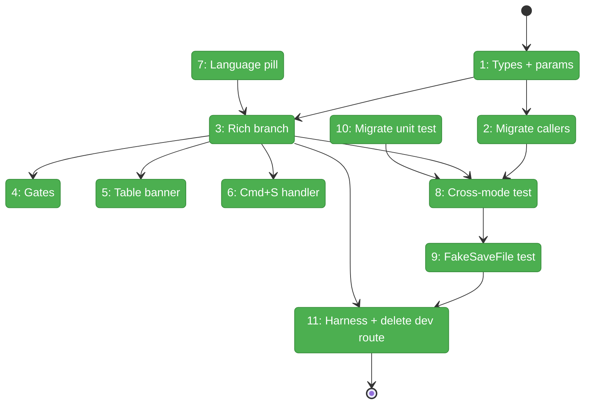
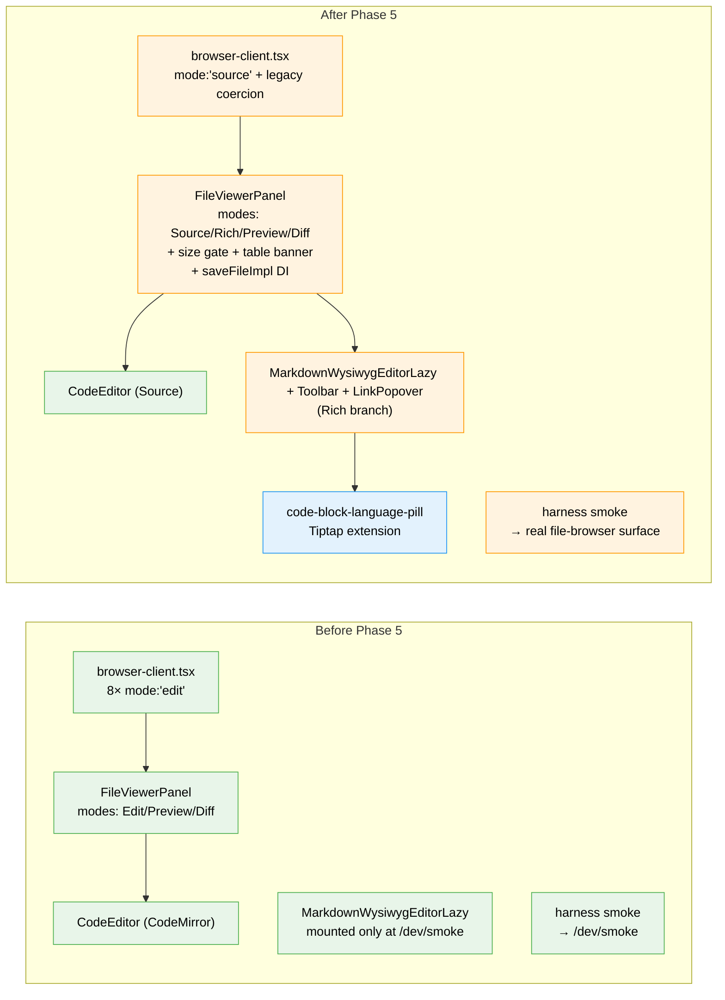

# Flight Plan: Phase 5 — FileViewerPanel Integration

**Plan**: [../../md-editor-plan.md](../../md-editor-plan.md)
**Phase**: Phase 5: FileViewerPanel Integration
**Generated**: 2026-04-19
**Status**: Landed

---

## Departure → Destination

**Where we are**: Phases 1–4 all green and landed on `083-md-editor`. `MarkdownWysiwygEditorLazy`, `WysiwygToolbar`, `LinkPopover`, the front-matter codec, `hasTables`, and `exceedsRichSizeCap` are all exported from `apps/web/src/features/_platform/viewer/index.ts`. The harness Playwright smoke drives these against a dev-only route at `/dev/markdown-wysiwyg-smoke`. `FileViewerPanel` still uses `ViewerMode = 'edit' | 'preview' | 'diff'` with no awareness of Rich mode — a `.md` file in the real file browser has no `[Rich]` button yet.

**Where we're going**: A user can open a `.md` file in the file browser, click the new `[Rich]` button, edit the rendered markdown via the toolbar / keyboard shortcuts / link popover, press `⌘S`, and have the file saved through the existing server pipeline unchanged. The Rich button respects the 200 KB size cap and the markdown-only gate. Tables trigger a dismissible warn banner. Bookmarked `?mode=edit` URLs normalize to `?mode=source`. Code blocks display a read-only language pill. The dev smoke route is deleted; the harness spec drives the real file-browser surface.

---

## Domain Context

### Domains We're Changing

| Domain | What Changes | Key Files |
|--------|-------------|-----------|
| `file-browser` | `ViewerMode` union rename + new `rich` member; Rich branch in `FileViewerPanel` composing Phase 1–3 components; size + language gates; table warn banner; extended `Cmd+S`; optional `saveFileImpl` DI prop; browser-client 8-site migration + URL legacy-mode compat; migrated unit test; new integration test file | `file-viewer-panel.tsx`, `browser-client.tsx`, `file-browser.params.ts`, `file-viewer-panel.test.tsx`, `file-viewer-panel-rich-mode.test.tsx` (new) |
| `_platform/viewer` | New `code-block-language-pill.ts` Tiptap extension; wire-up in editor; CSS for pill positioning | `lib/code-block-language-pill.ts` (new), `components/markdown-wysiwyg-editor.tsx`, `globals.css` |
| (harness) | Port smoke spec off dev route onto real file-browser surface; create `results/phase-5/` evidence dir | `harness/tests/smoke/markdown-wysiwyg-smoke.spec.ts` |
| (scaffold) | Delete `/dev/markdown-wysiwyg-smoke` route | `apps/web/app/dev/markdown-wysiwyg-smoke/` (deleted) |

### Domains We Depend On (no changes)

| Domain | What We Consume | Contract |
|--------|----------------|----------|
| `_platform/viewer` | `MarkdownWysiwygEditorLazy`, `WysiwygToolbar`, `LinkPopover`, `resolveImageUrl`, `hasTables`, `exceedsRichSizeCap`, `RICH_MODE_SIZE_CAP_BYTES` | All via barrel `apps/web/src/features/_platform/viewer/index.ts` |
| `_platform/themes` | `resolvedTheme` (consumed transitively by the editor for `prose-invert`) | `useTheme()` — no Phase 5 code change |
| server / `saveFile` action | unchanged | Finding 01 — do not touch |

---

## Flight Status

<!-- Updated by /plan-6-v2: pending → active → done. Use blocked for problems/input needed. -->

**Legend**: grey = pending | yellow = active | red = blocked/needs input | green = done

---

## Stages

<!-- Updated by /plan-6-v2 during implementation: [ ] → [~] → [x] -->

- [x] **Stage 1: Extend types** — Rename `ViewerMode`, extend params literal with legacy alias (`apps/web/src/features/041-file-browser/components/file-viewer-panel.tsx`, `file-browser.params.ts`)
- [x] **Stage 2: Migrate browser-client** — Update 8 sites + URL legacy-mode coercion effect (`apps/web/app/(dashboard)/workspaces/[slug]/browser/browser-client.tsx`)
- [x] **Stage 3: Add Rich branch** — Compose `MarkdownWysiwygEditorLazy` + `WysiwygToolbar` + `LinkPopover` inside the Rich mode branch of `FileViewerPanel` (`file-viewer-panel.tsx`)
- [x] **Stage 4: Wire size + language gates** — Rich button conditional rendering + disabled + tooltip (`file-viewer-panel.tsx`)
- [x] **Stage 5: Table warn banner** — Dismissible banner + sessionStorage persistence (`file-viewer-panel.tsx`)
- [x] **Stage 6: Extend Cmd+S handler** — Guard update on capture handler + content-area className (`file-viewer-panel.tsx`)
- [x] **Stage 7: Language-pill decoration** — New Tiptap extension + CSS (`lib/code-block-language-pill.ts` — new, `markdown-wysiwyg-editor.tsx`, `globals.css`)
- [x] **Stage 8: Cross-mode sync integration test** — userEvent-driven Rich-edit → Source-round-trip (`file-viewer-panel-rich-mode.test.tsx` — new)
- [x] **Stage 9: FakeSaveFile DI test** — Add `saveFileImpl?` optional prop; integration test exercises Cmd+S via Fake (`file-viewer-panel.tsx`, test)
- [x] **Stage 10: Migrate legacy unit test** — Rename `'edit'` → `'source'`, add Rich-button assertions (`file-viewer-panel.test.tsx`)
- [x] **Stage 11: Harness migration + dev-route deletion** — Port smoke spec to real surface; delete dev route (`harness/tests/smoke/markdown-wysiwyg-smoke.spec.ts`, `apps/web/app/dev/markdown-wysiwyg-smoke/`)

---

## Architecture: Before & After

**Legend**: existing (green, unchanged) | changed (orange, modified) | new (blue, created)

---

## Acceptance Criteria

Each criterion maps to the owning T-IDs (see tasks.md § Plan-Level Acceptance Criteria Mapping for the spec-AC crosswalk).

- [ ] **AC-01**: `.md` file shows 4 mode buttons `[Source] [Rich] [Preview] [Diff]`; non-markdown shows 3 (no Rich) — T003, T004
- [ ] **AC-16a**: Rich button disabled with tooltip above 200 KB (`exceedsRichSizeCap` decimal, not KiB) — T004
- [ ] **AC-11**: Table warn banner shows once per session per file on Rich entry — T005; sessionStorage handles disabled / malformed data gracefully — T005
- [ ] **AC-06**: `⌘S` saves from Rich via the existing unchanged `saveFile` pipeline — T006; Cmd+S + Save button dispatch through the same `performSave` helper — T009
- [ ] **AC-12**: Code blocks with a `language` attr display a read-only language pill (widget decoration is a descendant of `<pre>`; pill does not leak into serialized markdown) — T007
- [ ] **AC-07**: Content sync across Source ↔ Rich preserves edits without saving — T003, T008
- [ ] **AC-02**: Default mode unchanged; legacy `?mode=edit` URL coerces to `?mode=source` on page load; `?mode=edit&line=42` resolves to `?mode=source&line=42` with no thrash — T001, T002
- [ ] Integration tests green with zero `vi.mock` on business logic (uses `FakeSaveFile` + `saveFileImpl?` DI prop) — T008, T009
- [ ] Existing `file-viewer-panel.test.tsx` still green after rename; Rich-visibility assertions added — T010
- [ ] Harness Playwright smoke passes against real file browser (desktop + tablet projects); dev route deleted; `data-emitted-markdown` attribute live on `.md-wysiwyg-editor-mount` wrapper (Phase 6.2 dependency) — T011
- [ ] Error-boundary injection point committed: `.md-wysiwyg-editor-mount` is the single wrappable node for Phase 6.6 — T003
- [ ] `pnpm -F web build` clean; `pnpm -F web typecheck` clean; `pnpm -F web test` green — all tasks
- [ ] No server-side changes (Finding 01 — `saveFile` untouched) — all tasks

## Goals & Non-Goals

**Goals**:
- Wire Phase 1–4 primitives into the real `FileViewerPanel`.
- Migrate `ViewerMode` rename across all callers with legacy-URL compat.
- Prove save works via `Cmd+S` + `FakeSaveFile` integration (constitutionally compliant).
- Delete the dev smoke scaffold; drive the harness against the real surface.

**Non-Goals**:
- Round-trip corpus tests (Phase 6.2).
- Mobile swipe-gesture audit (Phase 6.4).
- Axe/accessibility sweep (Phase 6.5).
- Tiptap-init error fallback UI (Phase 6.6).
- Bundle-size gate (Phase 6.7).
- `domain.md` Source Location realignment (Phase 6.8).
- Any server-side change.

---

## Checklist

- [x] T001: Extend `ViewerMode` union + params literal with `'edit'` legacy alias
- [x] T002: Migrate `browser-client.tsx` 8 sites + legacy-URL `useEffect` coercion
- [x] T003: Add Rich branch composing `MarkdownWysiwygEditorLazy` + `WysiwygToolbar` + `LinkPopover`
- [x] T004: File-size + language gates on the Rich `ModeButton`
- [x] T005: Table warn banner with per-file sessionStorage dismissal
- [x] T006: Extend `handleEditModeKeyDownCapture` guard + content-area className
- [x] T007: Language-pill Tiptap extension + CSS positioning
- [x] T008: Cross-mode content-sync integration test (userEvent-driven, no `vi.mock` on business logic)
- [x] T009: `FakeSaveFile` + `saveFileImpl?` optional DI prop integration test
- [x] T010: Migrate existing `file-viewer-panel.test.tsx` renames + Rich-visibility assertions
- [x] T011: Harness smoke migration to real file-browser surface + delete dev route
