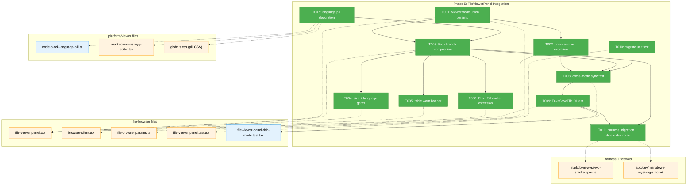
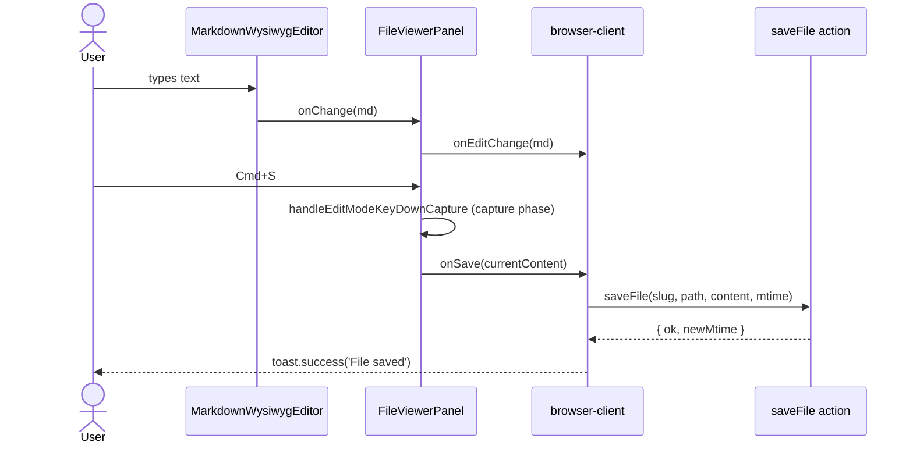

# Phase 5: FileViewerPanel Integration — Tasks Dossier

**Plan**: [../../md-editor-plan.md](../../md-editor-plan.md)
**Spec**: [../../md-editor-spec.md](../../md-editor-spec.md)
**Phase**: Phase 5: FileViewerPanel Integration
**Generated**: 2026-04-19
**Status**: Ready for takeoff

---

## Executive Briefing

**Purpose**: Wire the Phase 1–4 editor primitives (Tiptap editor, toolbar, link popover, front-matter codec, table detector, size-cap helper) into the real `FileViewerPanel` so users can toggle a `.md` file into Rich mode from the file browser, edit inline, and save via the existing `Cmd+S` pipeline. Phase 5 is the first phase that touches the `file-browser` domain — all prior phases lived entirely inside `_platform/viewer`.

**What We're Building**:
- `ViewerMode` union rename (`'edit'` → `'source'`) and a new `'rich'` member.
- A `rich` branch inside `FileViewerPanel` that composes `MarkdownWysiwygEditorLazy` + `WysiwygToolbar` + `LinkPopover`.
- Full migration of the 8 `mode: 'edit'` sites in `browser-client.tsx` plus the URL param parser, with a legacy-URL compat bridge (`?mode=edit` → `source`).
- Availability gates: Rich button only renders for `language === 'markdown'`, disabled with tooltip above 200 KB (`exceedsRichSizeCap`).
- Dismissible table warn banner (sessionStorage) when `hasTables(content)` on Rich entry.
- Extended `Cmd+S` handler covering both `source` and `rich`.
- Read-only language pill on code blocks via a ProseMirror decoration plugin.
- Integration tests that use a `FakeSaveFile` injected via a DI prop on `FileViewerPanel` — no `vi.mock` (Finding 05).
- Migrate the Playwright harness smoke off the `/dev/markdown-wysiwyg-smoke` route onto the real `FileViewerPanel` surface, then delete the dev route.

**Goals**:
- ✅ `.md` files open with four mode buttons `[Source] [Rich] [Preview] [Diff]`; non-markdown files show three (no Rich).
- ✅ Rich mode composes the Phase 1–3 components with zero regressions in Phase 4 fm-round-trip assertions.
- ✅ Every legacy `?mode=edit` URL normalizes to `source` on page load.
- ✅ `Cmd+S` saves from `rich` via the existing unchanged server pipeline.
- ✅ Size gate, table banner, language pill, and a11y basics all pass live harness smoke.
- ✅ Integration tests exercise save-on-`Cmd+S` without mocks.
- ✅ Dev smoke route deleted; harness spec runs against the real file-browser surface.

**Non-Goals**:
- ❌ Round-trip corpus tests (Phase 6.2) — Phase 5 only proves mode switching + save, not semantic fidelity against the pinned corpus.
- ❌ Mobile swipe-gesture conflict resolution (Phase 6.4) — Phase 5 preserves current mobile behavior; Phase 6 runs the 375×667 audit.
- ❌ Accessibility axe sweep (Phase 6.5) — Phase 5 preserves the Phase 2 a11y work but does not add a new audit.
- ❌ Error-fallback UI for Tiptap-init failure (Phase 6.6).
- ❌ Bundle-size verification (Phase 6.7).
- ❌ `domain.md` § Owns / § Source Location realignment (Phase 6.8 — includes F002 finding from Phase 4 review + Finding 02).
- ❌ Server-side changes of any kind (Finding 01 — `saveFile` is reused as-is).
- ❌ `AgentEditor` / plan 058 changes (AC-19).

---

## Prior Phase Context

### Phase 1: Foundation (landed 2026-04-18)

**A. Deliverables consumed by Phase 5**:
- `MarkdownWysiwygEditorLazy` (`apps/web/src/features/_platform/viewer/components/markdown-wysiwyg-editor-lazy.tsx`) — Phase 5 imports this, not the bare component, to preserve lazy-load behavior.
- `MarkdownWysiwygEditor` (same dir, `.tsx`) — contract definition; props already accept `onEditorReady`, `onOpenLinkDialog`, `imageUrlResolver`, `currentFilePath`, `rawFileBaseUrl`, `className`.
- `resolveImageUrl` + `ImageUrlResolver` type in `lib/image-url.ts` — Phase 5 passes the shared resolver when mounting the editor.

**B. Dependencies exported**:
- `MarkdownWysiwygEditorProps` — `{ value, onChange, readOnly?, placeholder?, imageUrlResolver?, currentFilePath?, rawFileBaseUrl?, className?, onEditorReady?, onOpenLinkDialog? }`
- All exports surface through `apps/web/src/features/_platform/viewer/index.ts` (single barrel).

**C. Gotchas**: `onChange` fires only on `transaction.docChanged === true` (Finding 11). Phase 5 must NOT re-render with a new `value` prop mid-edit — the editor's ref-equality check protects the common case, but cascading parent re-renders could still mis-fire. Lazy wrapper is mandatory to keep Tiptap out of the initial bundle (~130 KB gz).

**D. Incomplete**: Phase 6 AC-18 error-fallback UI; Phase 6.7 bundle-size gate.

**E. Patterns**: Ref-stable callbacks (`onChangeRef`, `onEditorReadyRef`, `onOpenLinkDialogRef`), `dynamic({ ssr: false })` for lazy loading, testid `[data-testid="md-wysiwyg-root"]` on the editor wrapper.

### Phase 2: Toolbar & Shortcuts (landed 2026-04-18)

**A. Deliverables**: `WysiwygToolbar` + 5 groups × 16 actions config + scoped placeholder CSS + `onEditorReady(editor)` wire-up.

**B. Exports**: `WysiwygToolbarProps` = `{ editor, onOpenLinkDialog?, linkButtonRef?, className? }`. Test IDs enforced: `[data-testid="toolbar-<action-id>"]` on every button (used by harness spec); `[data-testid="wysiwyg-toolbar"]` on the root.

**C. Gotchas**: `handleEditModeKeyDownCapture` captures Cmd+S on the parent's capture phase BEFORE Tiptap sees it — this contract must be preserved when the Rich branch mounts. Tiptap StarterKit defaults cover all shortcuts except `Mod-k` (owned by Phase 3 link popover). `useEditorState` selector avoids re-renders on every keystroke.

**D. Incomplete**: Mobile toolbar audit (Phase 6.4).

**E. Patterns**: shadcn `Button` with `variant={isActive ? 'secondary' : 'ghost'}`; horizontal overflow wrapper on the toolbar root; ARIA (`role="toolbar"`, `aria-pressed`, `aria-label`, `title`).

### Phase 3: Link Popover (landed 2026-04-19)

**A. Deliverables**: `LinkPopover` (desktop Popover + mobile Sheet) + `sanitizeLinkHref` utility + `Mod-k` keybinding on Tiptap Link extension. Link button anchor pattern via Radix `PopoverAnchor virtualRef`.

**B. Exports**: `LinkPopoverProps`, `SanitizedHref`. Editor accepts `onOpenLinkDialog`; toolbar accepts `linkButtonRef`. All three props are additive and backward-compatible — the Rich branch in Phase 5 provides all three to get the full popover flow.

**C. Gotchas**: `Mod-k` swallow when popover is open; focus-return path differs by opener (toolbar click → button; Mod-k in editor → contenteditable). Both paths are covered by the harness spec, so preserving them through the Phase 5 FileViewerPanel port is mandatory.

**D. Incomplete**: Mobile bottom-sheet end-to-end verification (Phase 6.4 — harness currently skips `mobile` project).

**E. Patterns**: `virtualRef` PopoverAnchor; defense-in-depth sanitizer + Tiptap `isAllowedUri`; prefill effect depends on `[open, editor, isInLink]`.

### Phase 4: Utilities TDD (landed 2026-04-19)

**A. Deliverables**: `splitFrontMatter` / `joinFrontMatter` (real codec; Phase 1 stubs replaced) + `hasTables` + `RICH_MODE_SIZE_CAP_BYTES` (`200_000`) + `exceedsRichSizeCap`. Lifecycle-safety test that mounts fm-bearing content, triggers a real edit, and asserts the emitted onChange starts with the original fm prefix.

**B. Exports** (all from `apps/web/src/features/_platform/viewer/index.ts` barrel):
- `splitFrontMatter(md: string) → { frontMatter, body }`
- `joinFrontMatter(fm: string, body: string) → string`
- `hasTables(md: string) → boolean`
- `exceedsRichSizeCap(content: string) → boolean`
- `RICH_MODE_SIZE_CAP_BYTES = 200_000` (decimal kilobytes, not KiB — JSDoc flagged)

**C. Gotchas**: `200_000 bytes`, not `204_800`; scanner stops at FIRST `---` close fence (setext-safe); fence-type pairing in `hasTables` (``` ≠ ~~~).

**D. Incomplete**: Deferred LOW items — reference-format consistency, TOML fences (non-goal per spec), `domain.md` Source Location refresh (Phase 6.8).

**E. Patterns**: Window-getter pattern on the dev route (`__smokeGetMarkdown` + `__smokeGetLastEmittedMarkdown`). Phase 5 T011 must preserve — or rebuild — the `__smokeGetLastEmittedMarkdown` hook when porting to `FileViewerPanel`, or substitute an equivalent assertion (see T011 Notes).

---

## Pre-Implementation Check

| File | Exists? | Domain Check | Notes |
|------|---------|-------------|-------|
| `apps/web/src/features/041-file-browser/components/file-viewer-panel.tsx` | ✅ | `file-browser` — correct | Modify: rename `ViewerMode`; extend `FileViewerPanelProps` with optional `saveFileImpl?: (content: string) => Promise<void>` DI prop (H7); extract shared `performSave = (c) => saveFileImpl ? saveFileImpl(c) : Promise.resolve(onSave(c))` helper used by both the Save button click and the Cmd+S handler; add `rich` branch; extend `ModeButton` signature with optional `disabled?: boolean` + `title?: string` props (H1) forwarded to the underlying button element; extend keydown handler; wire size/table gates. Current `ViewerMode = 'edit' \| 'preview' \| 'diff'` at `:42`. Current keydown handler at `:135-152` guards `mode !== 'edit'`. Current `ModeButton` signature at `:378-403` accepts `{label, icon, active, onClick}` only. |
| `apps/web/app/(dashboard)/workspaces/[slug]/browser/browser-client.tsx` | ✅ | `file-browser` — cross-domain consumer | Modify: 8 `'edit'` references at lines 156, 157, 172, 482, 530, 553, 1013, 1192 — **only lines 157, 553, 1013, 1192 are literal assignments that get renamed to `'source'`; lines 156, 482, 530 are conditional checks that TypeScript will flag after T001 union change; line 172 is a type assertion that also changes** (H5). Also add the legacy-URL `useEffect` coercion (C1). `ViewerMode` import already present at :17. |
| `apps/web/src/features/041-file-browser/hooks/use-file-navigation.ts` | ✅ | `file-browser` — correct | Modify: re-imports `ViewerMode` from `file-viewer-panel.tsx`, so the union change auto-propagates. `setUrlMode: (mode: string) => void` stays string-typed — no signature change. |
| `apps/web/src/features/041-file-browser/params/file-browser.params.ts` | ✅ | `file-browser` — correct | Modify: extend `parseAsStringLiteral` from `['edit', 'preview', 'diff']` to `['source', 'rich', 'edit', 'preview', 'diff']` temporarily so `?mode=edit` still parses; downstream coercion normalizes `edit → source`. Add comment `// 'edit' kept as legacy alias — remove after 1 release` (Finding 04). |
| `apps/web/src/features/_platform/viewer/lib/code-block-language-pill.ts` | ❌ NEW | `_platform/viewer` — correct (internal) | Create: ProseMirror `Plugin` returning a `DecorationSet` with a widget decoration per `codeBlock` node whose `language` attr is non-empty. Exported for consumption by `markdown-wysiwyg-editor.tsx`. |
| `apps/web/src/features/_platform/viewer/components/markdown-wysiwyg-editor.tsx` | ✅ | `_platform/viewer` — correct | Modify: add the language-pill extension to the extensions array; no prop surface change. Additive only. |
| `apps/web/app/globals.css` (or the `.md-wysiwyg` CSS block) | ✅ | infra | Modify: append CSS positioning the `[data-testid="code-block-language-pill"]` span in the top-right of a `<pre>`. |
| `test/unit/web/features/041-file-browser/file-viewer-panel.test.tsx` | ✅ | `file-browser` — correct | Modify: rename `mode: 'edit'` → `'source'`; add `rich` button assertion for markdown files; the existing `vi.mock` calls for CodeMirror/DiffViewer stay (they were written pre-Finding 05 and are not Phase 5's debt to pay). |
| `test/integration/web/features/041-file-browser/file-viewer-panel-rich-mode.test.tsx` | ❌ NEW | `file-browser` — correct | Create: tests for cross-mode content sync (T008) and `Cmd+S` via `FakeSaveFile` (T009). **No `vi.mock`.** Uses the `saveFileImpl` DI prop. |
| `harness/tests/smoke/markdown-wysiwyg-smoke.spec.ts` | ✅ | harness | Modify: navigate to a real `.md` file URL in the file browser instead of `/dev/markdown-wysiwyg-smoke`; preserve every existing assertion by relying on the testids `[data-testid="md-wysiwyg-root"]`, `[data-testid="wysiwyg-toolbar"]`, `[data-testid="toolbar-<id>"]` being exposed through the composed `FileViewerPanel` Rich branch. |
| `apps/web/app/dev/markdown-wysiwyg-smoke/page.tsx` | ✅ | scaffold | **Delete** at T011, together with its route directory. `grep -r "markdown-wysiwyg-smoke"` across `apps/web/**` should return only the harness spec afterward. |

**Concept-reuse check**: `code-block-language-pill` is a new concept not present elsewhere. `sanitizeLinkHref` (Phase 3), `resolveImageUrl` (Phase 1), `exceedsRichSizeCap` / `hasTables` / front-matter codec (Phase 4) are all reused through the `_platform/viewer` barrel — no duplication needed.

**Harness health check**: Run `just harness-health` before T001. L3 harness already green on Phase 4. If unhealthy, the implementation agent must stop and escalate per `plan-6-v2-implement-phase § 2a`.

---

## Plan → Dossier Task Mapping

For transparency — the plan (md-editor-plan.md § Phase 5) enumerates 5.1–5.11. Phase 5 ships each as one dossier task (T001 ↔ 5.1, …, T011 ↔ 5.11). No consolidation, no added tasks. Every plan subtask is traced 1:1 so the review agent can audit completeness.

| Plan Task | Dossier Task | Notes |
|-----------|--------------|-------|
| 5.1 | T001 | ViewerMode union + params literal |
| 5.2 | T002 | browser-client migration (8 sites) + legacy URL normalization |
| 5.3 | T003 | Rich branch composition in FileViewerPanel |
| 5.4 | T004 | File-size + language gates |
| 5.5 | T005 | Table warn banner |
| 5.6 | T006 | Cmd+S handler extension |
| 5.7 | T007 | Language-pill decoration |
| 5.8 | T008 | Cross-mode sync integration test |
| 5.9 | T009 | FakeSaveFile DI + Cmd+S integration test |
| 5.10 | T010 | Update existing unit test |
| 5.11 | T011 | Harness migration + dev-route deletion |

---

## Architecture Map



---

## Tasks

| Status | ID | Task | Domain | Path(s) | Done When | Notes |
|--------|-----|------|--------|---------|-----------|-------|
| [x] | T001 | **Extend `ViewerMode` union + params literal** (strict order — H6). **Step 1**: Update `parseAsStringLiteral` in `file-browser.params.ts:21` from `['edit', 'preview', 'diff']` to `['source', 'rich', 'edit', 'preview', 'diff']` (keeps `'edit'` as a legacy alias so bookmarked URLs still parse; `// TODO: remove legacy 'edit' alias after 1 release`). **Step 2**: Change `ViewerMode = 'edit' \| 'preview' \| 'diff'` → `'source' \| 'rich' \| 'preview' \| 'diff'` in `file-viewer-panel.tsx:42`. **Step 3**: Run `pnpm -F web typecheck` — expect caller-site errors surfaced at `browser-client.tsx` + `file-viewer-panel.test.tsx`; these are T002 / T010's to resolve. Do NOT migrate callers in this task. | `file-browser` | `/Users/jordanknight/substrate/083-md-editor/apps/web/src/features/041-file-browser/components/file-viewer-panel.tsx`, `/Users/jordanknight/substrate/083-md-editor/apps/web/src/features/041-file-browser/params/file-browser.params.ts` | Step-1 and Step-2 applied in order. `pnpm -F web typecheck` fails at call sites (8+ errors in `browser-client.tsx`, a few in existing tests) but not inside `file-viewer-panel.tsx`. `use-file-navigation.ts` imports `ViewerMode` from `file-viewer-panel` at its `:17`, so the union change re-propagates automatically — verify. | Finding 04, Finding 08 (interface-first). |
| [x] | T002 | **Migrate `browser-client.tsx` + legacy URL normalization**. (a) **Rename literal assignments** at lines 157 (`setParams({ mode: 'edit' })`), 553 (`handleModeChange('edit')`), 1013 (`setParams({ ..., mode: 'edit' })`), 1192 (`setParams({ ..., mode: 'edit' })`) → `'source'`. (b) **Update conditional / type contexts** flagged by TS: line 156 `mode !== 'edit'` must become `mode !== 'source' && mode !== 'rich'` (so scrollToLine auto-switch does NOT fight Rich mode when user is editing rich — C1 race guard); line 172 type assertion widens to `'source' \| 'rich' \| 'preview' \| 'diff'`; line 482 `mode === 'edit'` becomes `(mode === 'source' \|\| mode === 'rich')`; line 530 `mode === 'edit'` becomes `(mode === 'source' \|\| mode === 'rich')`. (c) **Legacy-coerce effect**: add a new `useEffect([params.mode, setParams])` near line 148: `if (params.mode === 'edit') setParams({ mode: 'source' }, { history: 'replace' });` with `// TODO: remove legacy-mode-alias after 1 release`. **Order relative to the scrollToLine effect (C1)**: React fires effects in declaration order, so place the legacy-coerce effect BEFORE the existing scrollToLine effect at line 155 so a `?mode=edit&line=42` URL first coerces to `source`, then the scrollToLine effect (now reading `mode !== 'source' && mode !== 'rich'`) sees `mode === 'source'` and no-ops — no thrash. | `file-browser` | `/Users/jordanknight/substrate/083-md-editor/apps/web/app/(dashboard)/workspaces/[slug]/browser/browser-client.tsx` | `pnpm -F web typecheck` clean. Grep for `'edit'` in `apps/web/app/**` returns only the legacy-coerce effect's `params.mode === 'edit'` string (one hit). Manual: visiting `/workspaces/x/browser?mode=edit` redirects to `?mode=source` on load (history replaced); visiting `/workspaces/x/browser?mode=edit&line=42` lands on `?mode=source&line=42` with line 42 scrolled (no `source`↔`edit` thrash). | Finding 04; C1 race mitigated via effect-order + scrollToLine guard widening. |
| [x] | T003 | **Add `rich` branch to `FileViewerPanel`**. Add a `Rich` `ModeButton` (renders only when `language === 'markdown'` — gate in T004). Add a `mode === 'rich'` branch inside the `Suspense` region that renders, in a flex wrapper matching `mode === 'source'`: (a) the `WysiwygToolbar` with `linkButtonRef` + `onOpenLinkDialog`, (b) the `MarkdownWysiwygEditorLazy` with `value={currentContent}`, `onChange={onEditChange}`, `imageUrlResolver={resolveImageUrl}`, `currentFilePath={filePath}`, `rawFileBaseUrl`, `onEditorReady`, `onOpenLinkDialog`, (c) the `LinkPopover` wired via shared `linkOpen` state. **Editor mount-point structure (H3 — Phase 6.6 injection point)**: the `MarkdownWysiwygEditorLazy` must sit as a direct child of a single wrapper `<div className="md-wysiwyg-editor-mount">`, with the toolbar as its preceding sibling and the popover as a following sibling — the wrapper is the independently-wrappable node a future error boundary (Phase 6.6) can target without also swallowing the toolbar or popover. Rename the existing `mode === 'edit'` branch to `mode === 'source'` and adjust the `ModeButton` label from "Edit" to "Source"; keep the lucide `Edit` icon for Source (workshop intent: same icon, new label). Save button visibility guard: `mode === 'source' \|\| mode === 'rich'` — both Save button onClick AND the Cmd+S handler call the `performSave` helper extracted into the file (see Pre-Impl row for signature). | `file-browser` | `/Users/jordanknight/substrate/083-md-editor/apps/web/src/features/041-file-browser/components/file-viewer-panel.tsx` | Opening a `.md` file shows 4 mode buttons; clicking Rich mounts the editor + toolbar; typing text fires `onEditChange` and updates `editContent` in the parent; Save button remains visible in Rich mode; `[data-testid="md-wysiwyg-root"]` is a descendant of exactly one `md-wysiwyg-editor-mount` wrapper; toolbar + popover are siblings of that wrapper, NOT nested inside it. | Workshop § 15.3. All testids (`md-wysiwyg-root`, `wysiwyg-toolbar`, `toolbar-<id>`, `link-popover-*`) come through the composed children unchanged — do NOT re-wrap them. Phase 2's actual testid is `toolbar-<action-id>` (the `.id` field of each `ToolbarAction`); this dossier's `toolbar-<id>` is a shorthand. |
| [x] | T004 | **File-size + language gates on the Rich button**. Extend the `ModeButton` signature to accept optional `disabled?: boolean` + `title?: string` props (H1); forward both to the underlying `<button>` element (`disabled={disabled}`, `title={title}`, and a `data-disabled` attribute + muted styling when disabled). Rich `ModeButton` renders only when `language === 'markdown'`. When it renders: compute `const richDisabled = exceedsRichSizeCap(currentContent)` and pass `disabled={richDisabled}` + `title={richDisabled ? 'File too large for Rich mode — use Source' : 'Rich'}`. Non-markdown files: 3 buttons (no Rich). | `file-browser` | `/Users/jordanknight/substrate/083-md-editor/apps/web/src/features/041-file-browser/components/file-viewer-panel.tsx` | `ModeButton` shape extended with the two optional props (backward-compatible for existing Source/Preview/Diff callers). Non-markdown file → no Rich button. Markdown file ≤ 200 KB → Rich button enabled. Markdown file > 200 KB → Rich button visible but disabled with tooltip. | AC-01, AC-16a, spec § Clarifications Q4 ("200 KB soft cap, button disabled with tooltip above"). Imports: `import { exceedsRichSizeCap } from '@/features/_platform/viewer'`. |
| [x] | T005 | **Table warn banner with per-session dismissal**. When `mode === 'rich'` AND `hasTables(currentContent)` AND the file's path is not in `sessionStorage['md-wysiwyg:dismissed-table-banners']` (a JSON array of paths): render a dismissible banner above the toolbar with text "This file contains Markdown tables. Rich mode may reformat them — Source mode preserves exact formatting." + a × button. × adds `filePath` to the sessionStorage array. Style should match the existing conflict / externally-changed banner rows (amber/blue border-b block). **sessionStorage error handling**: wrap every read AND write in `try/catch` — on read failure treat as empty array (covers `JSON.parse` errors from tampering); on write failure (QuotaExceeded, SecurityError in Safari private mode) swallow silently — the dismissal is nice-to-have UX, the banner reappearing next session is acceptable graceful degradation. | `file-browser` | `/Users/jordanknight/substrate/083-md-editor/apps/web/src/features/041-file-browser/components/file-viewer-panel.tsx` | Opening a table-file in Rich shows banner. Dismissing persists per-file for the session; opening another table-file still shows banner; reload within the same tab keeps the dismissal; new tab shows it again. sessionStorage disabled / malformed data does not throw or break Rich mode. | AC-11, spec § Clarifications Q2 ("tables: warn banner, no hard lock"). Imports: `import { hasTables } from '@/features/_platform/viewer'`. Session storage key is file-scoped so dismiss doesn't silence banners on other files. |
| [x] | T006 | **Extend `handleEditModeKeyDownCapture` guard**. Change the mode check at `file-viewer-panel.tsx:138` from `if (mode !== 'edit' \| \| …)` to `if ((mode !== 'source' && mode !== 'rich') \| \| …)`. Update the `onKeyDownCapture` wiring at `:313` to attach when `mode === 'source' \| \| mode === 'rich'` (currently attaches when `mode === 'edit'`). Update the content-area className branch on the same line so the flex layout applies in both editable modes. **Cmd+S scope**: the handler remains attached to the content-wrapper div (covers the editor + toolbar + popover since T003 mounts all three inside that wrapper). The LinkPopover's desktop Popover portals to `document.body` (Radix default), so Cmd+S pressed while focus is in the URL input will NOT bubble to the wrapper — the popover's own keyDown handler already swallows Mod-k and propagates Enter / Esc; Cmd+S while editing a link URL is an edge case NOT required to save (the user can press Esc first, then Cmd+S). T008 verifies Cmd+S while focus is in the editor contenteditable; T009 verifies via a synthetic keydown dispatched on the wrapper. | `file-browser` | `/Users/jordanknight/substrate/083-md-editor/apps/web/src/features/041-file-browser/components/file-viewer-panel.tsx` | `Cmd+S` / `Ctrl+S` saves from both Source and Rich; no save-capture interference in Preview/Diff. Manual verify: press Cmd+S in Rich with unsaved edits → save toast fires. | AC-06. Workshop § 4. Keep the `event.preventDefault()` — it's what stops the browser's Save dialog. The handler now dispatches via `performSave` (T003 / Pre-Impl), NOT directly via `onSave` — so the T009 `saveFileImpl?` injection works on both the Save button AND Cmd+S. |
| [x] | T007 | **Language-pill decoration plugin** (CS-4-ish within a CS-3 phase — flagged; see Notes). Create `lib/code-block-language-pill.ts` in `_platform/viewer` exporting a Tiptap `Extension.create({ addProseMirrorPlugins })` that returns a single `Plugin` whose `state.init` / `state.apply` maintain a `DecorationSet`. **Widget placement (H2)**: use `Decoration.widget(pos, toDOM, { side: -1 })` at `pos = blockNode.pos + 1` (just inside the codeBlock node, so the rendered `<span>` is a DESCENDANT of the `<pre>` — required for the CSS `position: absolute` relative to `position: relative` on `.md-wysiwyg pre` to work). The widget DOM is `<span contenteditable="false" data-testid="code-block-language-pill" class="md-wysiwyg-code-lang-pill">{language}</span>` — one per `codeBlock` node whose `attrs.language` is a non-empty string. **Register internally**: add the extension to `markdown-wysiwyg-editor.tsx`'s extensions array via a direct relative import (`../lib/code-block-language-pill`). **Do NOT export from the barrel** — the extension is an implementation detail of the Rich editor, and keeping it internal lets Phase 6.7 bundle analysis confirm it ships inside the lazy `MarkdownWysiwygEditorLazy` chunk (imported by the editor component, which itself is dynamically imported; no other code path pulls it in). Add CSS to `apps/web/app/globals.css` (scope with `.md-wysiwyg pre { position: relative } .md-wysiwyg-code-lang-pill { position: absolute; top: 0.25rem; right: 0.5rem; font-size: 0.75rem; … }`). **Unit test (H9)**: extend `markdown-wysiwyg-editor.test.tsx` with a new test — mount with `` value={'```python\nprint(1)\n```\n'} ``; after the mount effect settles, query the editor root for `[data-testid="code-block-language-pill"]` and assert its textContent is `python` AND its closest `pre` ancestor exists (proves the descendant placement); then call `editor.storage.markdown.getMarkdown()` and assert the returned markdown starts with `` ```python `` and contains NO literal `python>` or `</span>` artifact (proves widget decorations don't leak into serialization). | `_platform/viewer` | `/Users/jordanknight/substrate/083-md-editor/apps/web/src/features/_platform/viewer/lib/code-block-language-pill.ts` (new), `/Users/jordanknight/substrate/083-md-editor/apps/web/src/features/_platform/viewer/components/markdown-wysiwyg-editor.tsx`, `/Users/jordanknight/substrate/083-md-editor/apps/web/app/globals.css`, `/Users/jordanknight/substrate/083-md-editor/test/unit/web/features/_platform/viewer/markdown-wysiwyg-editor.test.tsx` | Typing ` ```python ` opens a code block that renders with a `python` pill in top-right. Pill is static (contenteditable=false), does not appear in serialized markdown. Pill disappears when language attr is empty. Caret moves past the pill without landing on it. New unit test green. | AC-12. The decoration plugin approach is spec-mandated (plan 5.7). **Placement justification**: lives at `_platform/viewer/lib/` as a peer of `wysiwyg-extensions.ts`, `sanitize-link-href.ts`, etc. — internal to the viewer domain, consumed only by `markdown-wysiwyg-editor.tsx`. **Complexity note**: authoring a ProseMirror `Plugin` with `DecorationSet` state is new to this codebase — implementors unfamiliar with ProseMirror should (1) read [ProseMirror State § Plugins](https://prosemirror.net/docs/ref/#state.Plugin_System), (2) model the `state.apply(tr, old)` step on diffing `tr.docChanged` + rebuilding from a `tr.doc.descendants` walk, (3) budget extra time for DOM-position debugging in jsdom (`getBoundingClientRect` returns zeroed rects — assertion should not depend on absolute pixel position). |
| [x] | T008 | **Integration test: cross-mode content sync**. Write `test/integration/web/features/041-file-browser/file-viewer-panel-rich-mode.test.tsx`. Mount `<FileViewerPanel />` with `language='markdown'`, `mode='source'`, controlled `editContent` via a test wrapper. Assert: Rich button renders. Switch to Rich (fire `onModeChange('rich')`). Type `# Heading` via userEvent into the editor root. Assert parent received `onEditChange` with markdown containing `# Heading`. Switch back to Source. Assert `CodeEditor` mounts with the updated value. **No `vi.mock` / `vi.fn` on internal components** — use the existing `vi.mock` for CodeMirror/DiffViewer as in T010 (legacy test infra; constitutional debt is Phase 6's problem). Tiptap runs in jsdom — the Phase 2 + 4 unit tests prove this is viable. | `file-browser` | `/Users/jordanknight/substrate/083-md-editor/test/integration/web/features/041-file-browser/file-viewer-panel-rich-mode.test.tsx` (new) | Test green; RED-GREEN evidence in execution.log. Assertions cover: Rich button visibility for markdown; mode switch propagates; keystroke in Rich emits `onEditChange`; switching back preserves edit. | AC-07. Finding 05 (no `vi.mock` for business logic). Keep the file in `test/integration/` to distinguish from `test/unit/`. |
| [x] | T009 | **Integration test: `Cmd+S` via `FakeSaveFile` + new DI prop**. Add an optional prop `saveFileImpl?: (content: string) => Promise<void>` to `FileViewerPanelProps`. **Unified dispatch**: extract `const performSave = useCallback((content: string) => saveFileImpl ? saveFileImpl(content) : Promise.resolve(onSave(content)), [saveFileImpl, onSave])` and use it in BOTH the Save button `onClick={() => performSave(currentContent)}` AND the Cmd+S handler. Single helper ensures the DI priority is identical across both paths (mitigates dual-dispatch asymmetry). Build a `FakeSaveFile` class in the test file with `.calls: Array<{ content: string }>` and an `async invoke(content)` method that pushes and resolves. Test A: mount panel with `mode='rich'`, `saveFileImpl={fake.invoke}`, a sample markdown value. Type ` edited`. Fire `keydown` with `{ key: 's', metaKey: true }` on the content wrapper. Assert `fake.calls[0].content` contains `edited`. Test B: same fixture, click the Save button instead; assert `fake.calls[0]` received the same content (proves unified dispatch). | `file-browser` | `/Users/jordanknight/substrate/083-md-editor/test/integration/web/features/041-file-browser/file-viewer-panel-rich-mode.test.tsx` (extend T008 file), `/Users/jordanknight/substrate/083-md-editor/apps/web/src/features/041-file-browser/components/file-viewer-panel.tsx` | Both tests green; no `vi.mock` of business logic; DI path is minimal (one optional prop, defaults to existing behavior). `pnpm -F web typecheck` clean — `FileViewerPanelProps` accepts the new optional prop. | Finding 05. Constitution Principle 4 (Fakes over Mocks). Keep the DI surface small — the prop is optional and defaults to calling `onSave` unchanged, so every existing caller keeps working. |
| [x] | T010 | **Migrate existing `file-viewer-panel.test.tsx`**. Replace every `mode: 'edit'` with `'source'`; rename the describe block "renders Edit, Preview, and Diff mode buttons" → "renders Source, Preview, and Diff mode buttons". The existing `vi.mock` for CodeMirror/DiffViewer stays — it's legacy infra from plan 041 and out of Phase 5's remit. For markdown-language test cases, add an assertion that a Rich button is present; for non-markdown, assert it's absent (uses the T004 gate). | `file-browser` | `/Users/jordanknight/substrate/083-md-editor/test/unit/web/features/041-file-browser/file-viewer-panel.test.tsx` | All existing assertions still pass with the renamed mode; new Rich-visibility assertions green. `pnpm -F web test` green. | — |
| [x] | T011 | **Migrate harness smoke + delete dev route**. **Step 0 — pre-flight**: before touching the spec, run `ls harness/tests/test-workspace/` (or equivalent fixture dir — inspect `harness/README.md` to locate it) to confirm at least one `.md` fixture exists that contains a heading, a paragraph, an image, a code block, AND YAML front-matter (the Phase 4 assertion needs fm). If no such fixture exists, create `harness/tests/test-workspace/sample-rich.md` with exactly this content: `---\ntitle: Smoke Fixture\ntags:\n  - smoke\n---\n\n# Hello\n\nSome text.\n\n\n\n`` `python\nprint(1)\n`` ``. Record the absolute in-workspace path in the spec's top-of-file doc comment. **Step 1 — port the spec**: update `SMOKE_PATH` constant (currently `const SMOKE_PATH = '/dev/markdown-wysiwyg-smoke'` at :44) to the real file-browser URL shape for the fixture — e.g. `const SMOKE_PATH = '/workspaces/<slug>/browser?worktree=<path>&file=sample-rich.md&mode=rich'` (exact slug + worktree segment must match the harness test workspace convention). After navigation + `waitForSelector('[data-testid="md-wysiwyg-root"]')`, the Rich mode is already active via the URL — no button click needed. Preserve every Phase 1 / 2 / 3 / 4 assertion. **Preserve testids**: `[data-testid="md-wysiwyg-root"]`, `[data-testid="wysiwyg-toolbar"]`, `[data-testid="toolbar-<action-id>"]`, `[data-testid="link-popover*"]` all come through naturally from the T003 composition (they're on the child components). **Phase 4 fm assertion migration (C2)**: the current spec uses `window.__smokeGetLastEmittedMarkdown` exposed by the dev route. **Firm commitment**: T003 must attach a `data-emitted-markdown` attribute to the `md-wysiwyg-editor-mount` wrapper that mirrors the last `onChange` argument (updated via a local ref + `useEffect` that writes `wrapper.dataset.emittedMarkdown`). This is a test-only affordance precedented by the existing `data-testid` use; ship it unconditionally so Phase 6.2 byte-identity corpus tests have a stable read path. Spec reads via `await editorRoot.evaluate(el => el.closest('.md-wysiwyg-editor-mount')?.getAttribute('data-emitted-markdown') ?? '')`. Delete `apps/web/app/dev/markdown-wysiwyg-smoke/page.tsx` and its parent `apps/web/app/dev/markdown-wysiwyg-smoke/` directory. `grep -r "markdown-wysiwyg-smoke" apps/web` returns zero hits; `grep -r "markdown-wysiwyg-smoke" harness` returns only the migrated spec. `pnpm -F web build` succeeds. | `file-browser` + harness | `/Users/jordanknight/substrate/083-md-editor/harness/tests/smoke/markdown-wysiwyg-smoke.spec.ts`, `/Users/jordanknight/substrate/083-md-editor/harness/tests/test-workspace/sample-rich.md` (new if not present), `/Users/jordanknight/substrate/083-md-editor/apps/web/app/dev/markdown-wysiwyg-smoke/page.tsx` (delete), directory removal | Harness spec green against the real file-browser surface on the `desktop` project (tablet already covered by Phase 3); dev route gone; `pnpm -F web build` clean; `data-emitted-markdown` attribute present on the editor mount wrapper after any edit; grep for dev route path returns zero hits under `apps/web`. | This is the load-bearing proof that Phase 5 actually ships the feature. Without T011 passing, Phase 5 is a regression. The `data-emitted-markdown` commitment is what unblocks Phase 6.2. |

---

## Plan-Level Acceptance Criteria Mapping

Per plan § "Acceptance Criteria (Plan-level)" traceability table, Phase 5 owns the following ACs. Each maps 1:1 to a T-ID so plan-7 review can audit completeness:

| AC | Description (spec) | Owning Task(s) | Evidence |
|----|--------------------|----------------|----------|
| AC-01 | Rich mode available only for `.md` files | T004 | Rich `ModeButton` renders iff `language === 'markdown'` |
| AC-02 | Default mode unchanged (open in Source) | T001, T002 | `parseAsStringLiteral(...).withDefault('preview')` unchanged; legacy `'edit'` alias coerces to `'source'` |
| AC-06 | Save from Rich via existing pipeline | T006, T009 | `handleEditModeKeyDownCapture` guard extended; `performSave` helper; `FakeSaveFile` integration test |
| AC-07 | Source ↔ Rich share in-memory content | T003, T008 | Both mount with `value={currentContent}` + `onChange={onEditChange}`; cross-mode userEvent test |
| AC-11 | Table warn banner | T005 | `hasTables` + sessionStorage dismissal |
| AC-12 | Code blocks show read-only language pill | T007 | ProseMirror widget decoration + serialization unit test |
| AC-16a | File-size soft cap (200 KB) | T004 | `exceedsRichSizeCap` + disabled button + tooltip |

Phase 6 owns the remaining ACs (AC-03 content-level smoke, AC-08/09/10 corpus round-trip, AC-14 mobile, AC-15 lazy load, AC-16 bundle, AC-17 a11y, AC-18 error fallback, AC-19/20 regression).

## Contracts New in Phase 5 (Phase 6.8 checklist)

Phase 6.8 (`_platform/viewer/domain.md` alignment) needs to reconcile these additions against the domain's contracts. Captured once here so the Phase 6.8 dossier doesn't have to reverse-engineer the diff:

| New surface | Owner | Classification | Consumers |
|-------------|-------|----------------|-----------|
| `FileViewerPanelProps.saveFileImpl?: (content: string) => Promise<void>` | `file-browser` | test-oriented optional DI prop | `file-viewer-panel-rich-mode.test.tsx` (T009); production callers pass nothing, get existing `onSave` behavior unchanged |
| `ModeButton` optional `disabled?: boolean` + `title?: string` props | `file-browser` (internal) | internal component shape | only `FileViewerPanel` mounts it |
| `.md-wysiwyg-editor-mount` wrapper + `data-emitted-markdown` attribute on it | `file-browser` | test affordance | harness smoke (T011) + Phase 6.2 corpus tests |
| `lib/code-block-language-pill.ts` Tiptap extension | `_platform/viewer` | **internal — NOT exported from barrel** | `markdown-wysiwyg-editor.tsx` only (direct relative import) |
| `.md-wysiwyg-code-lang-pill` CSS class on the `<span>` widget | `_platform/viewer` | internal style | rendered by the pill extension |
| `sessionStorage['md-wysiwyg:dismissed-table-banners']` schema | `file-browser` | runtime state (ephemeral) | `FileViewerPanel` only |
| Legacy-mode `'edit'` alias in `parseAsStringLiteral` + `useEffect` coercion | `file-browser` | backward-compat | auto-removed after 1 release per TODO |

**No new barrel exports from `_platform/viewer/index.ts`**. Phase 1–3 exports remain the stable contract set.

## Test-Boundary Note (plan-7 reviewer)

Phase 5 ships two distinct test files with different mock policies — intentional boundary, not inconsistency:

- `test/unit/web/features/041-file-browser/file-viewer-panel.test.tsx` (T010) — pre-existing plan-041 test. Retains `vi.mock` for `@uiw/react-codemirror`, `DiffViewer`, and `FileIcon`. Phase 5 only renames mode literals + adds Rich-visibility assertions. Legacy `vi.mock` debt is NOT Phase 5's remit; flag for a future plan.
- `test/integration/web/features/041-file-browser/file-viewer-panel-rich-mode.test.tsx` (T008, T009) — NEW file. **Zero `vi.mock` / `vi.fn` / `vi.spyOn` for business logic.** Real Tiptap in jsdom (proven viable in Phases 1–4 unit tests). `FakeSaveFile` class for save-pipeline assertions per constitution § 4.

## Context Brief

### Key findings from plan

- **Finding 01 (Critical)**: `saveFile` server action is plain-text I/O and already handles mtime conflicts + atomic writes. **Do not touch server code.** The Rich editor emits a plain markdown string that flows through the existing pipeline unchanged.
- **Finding 04 (High)**: `browser-client.tsx` has 8 sites of `'edit'` plus URL param parsing. Bookmarked URLs with `?mode=edit` must still land on Source mode after rename. The legacy alias stays in the `parseAsStringLiteral` list with a TODO-remove comment; a `useEffect` in `browser-client` coerces `edit → source` on read.
- **Finding 05 (High)**: Constitution §7 forbids `vi.mock` / `vi.fn` / `vi.spyOn` for business logic. New Phase 5 integration tests (T008, T009) use a `FakeSaveFile` injected via a new optional `saveFileImpl` prop — a minimal DI surface. Pre-existing `vi.mock` for CodeMirror/DiffViewer in the legacy unit test (T010) is out of scope for Phase 5.
- **Finding 11 (Medium)**: `onChange` fires only on `transaction.docChanged === true`. Phase 5's Rich branch must not cascade parent re-renders that pass a mutated `value` mid-edit — the Phase 1 editor's ref-equality check protects this, but the T003 composition should pass `value={currentContent}` exactly once per logical update.
- **Finding 02 (Critical, deferred)**: `_platform/viewer/domain.md` has stale "Does NOT Own: CodeMirror" content. Phase 6.8 fixes; Phase 5 does not touch the domain.md.

### Domain dependencies (concepts Phase 5 consumes)

- `_platform/viewer`: **MarkdownWysiwygEditor** (`MarkdownWysiwygEditorLazy`) — core Rich-mode editing surface.
- `_platform/viewer`: **WysiwygToolbar** (`WysiwygToolbar`) — 16-button toolbar renders above the editor.
- `_platform/viewer`: **LinkPopover** (`LinkPopover`) — desktop popover + mobile sheet for link insert/edit.
- `_platform/viewer`: **Image URL resolution** (`resolveImageUrl`) — pass to the editor so `` resolves through the raw-files API.
- `_platform/viewer`: **Size-cap gate** (`exceedsRichSizeCap`, `RICH_MODE_SIZE_CAP_BYTES`) — 200 KB decimal ceiling.
- `_platform/viewer`: **Table detector** (`hasTables`) — triggers the warn banner.
- `_platform/viewer`: **Front-matter codec** (`splitFrontMatter`, `joinFrontMatter`) — consumed internally by the editor; Phase 5 relies on it transitively (no direct import).

### Domain constraints

- **Import discipline**: Phase 5 imports from `_platform/viewer` **only via the barrel** (`apps/web/src/features/_platform/viewer/index.ts`). No reaching into component or lib internals.
- **Dependency direction**: `file-browser` → `_platform/viewer` is the allowed direction (consumer → provider). No reverse imports introduced.
- **No new cross-domain edges**: all edges already exist from plan 041.
- **No domain.md contract change**: The existing `MarkdownWysiwygEditor` / `WysiwygToolbar` / `LinkPopover` contracts from Phases 1–3 are sufficient; Phase 5 is a pure consumer of contracts already documented.

### Harness context

- **Boot**: `just harness up` — health: `just harness-health` (must return L3 green before T001).
- **Interact**: Playwright CDP via `harness/tests/smoke/*.spec.ts` using `cdpPage` fixture.
- **Observe**: screenshots + console-log scan in `harness/results/phase-5/` (new directory — T011 creates).
- **Maturity**: L3 — sufficient per plan § Harness Strategy.
- **Pre-phase validation**: Before T001, the implementation agent MUST validate harness is operational (boot → interact with a no-op health check → observe a baseline screenshot). If unhealthy, stop and escalate.
- **MOD_KEY**: Linux container → `'Control'`; reuse the constant already in the existing spec.

### Reusable from prior phases

- **Test IDs**: `[data-testid="md-wysiwyg-root"]`, `[data-testid="wysiwyg-toolbar"]`, `[data-testid="toolbar-<id>"]` (16 buttons), `[data-testid="link-popover"]`, `[data-testid="link-popover-url-input"]`, `[data-testid="link-popover-text-input"]`, `[data-testid="link-popover-submit"]`, `[data-testid="link-popover-unlink"]`, `[data-testid="link-popover-error"]`, `#link-popover-title`.
- **Lifecycle-safety test pattern** (Phase 4 T006): mount → real `editor.commands.insertContent` → assert emitted markdown. Phase 5 T008 borrows this pattern but swaps `editor.commands.insertContent` for `userEvent.keyboard('# Heading')` on the editor root.
- **`FakeSaveFile` pattern** (new): a minimal class with `calls: Array<{ content }>` and `async invoke(content)`; injected via the new `saveFileImpl` optional prop. Mirrors the constitutional "Fakes over Mocks" principle.

### Mermaid flow (Rich-mode interactions)


### Mermaid sequence (Cmd+S save in Rich)



---

## Discoveries & Learnings

_Populated during implementation by plan-6-v2._

| Date | Task | Type | Discovery | Resolution | References |
|------|------|------|-----------|------------|------------|

**Types**: `gotcha` | `research-needed` | `unexpected-behavior` | `workaround` | `decision` | `debt` | `insight`

---

---

## Validation Record (2026-04-19)

| Agent | Lenses Covered | Issues | Verdict |
|-------|---------------|--------|---------|
| Source Truth | Hidden Assumptions, Edge Cases, Integration & Ripple, System Behavior | 2 CRITICAL + 2 HIGH + 3 MEDIUM — all fixed | ⚠️ → ✅ |
| Cross-Reference | Integration & Ripple, Domain Boundaries, Concept Documentation | 1 HIGH (AC mapping) + 4 lower — HIGH fixed, LOWs noted | ⚠️ → ✅ |
| Completeness | System Behavior, Hidden Assumptions, Edge Cases, Performance, Security, Deployment | 1 CRITICAL + 2 HIGH + 6 MEDIUM — all fixed | ⚠️ → ✅ |
| Forward-Compatibility | Forward-Compatibility, Technical Constraints, Deployment & Ops | 1 CRITICAL + 2 HIGH + 3 MEDIUM — all fixed | ⚠️ → ✅ |

**Lens coverage**: 11/12 (above the 8-floor). Forward-Compatibility engaged (not STANDALONE — Phase 6 + plan-6 implementor + plan-7 reviewer are named downstream consumers).

### Forward-Compatibility Matrix

| Consumer | Requirement | Failure Mode | Verdict | Evidence |
|----------|-------------|--------------|---------|----------|
| Phase 6.2 round-trip corpus tests | emitted-markdown readable from harness | test boundary | ✅ | T011 now firmly mandates `data-emitted-markdown` attribute on `.md-wysiwyg-editor-mount` wrapper (no longer conditional); T003 wires the attribute update path |
| Phase 6.3 harness smoke | Phase 5 spec is the base | test boundary | ✅ | T011 ports the spec to real surface; all Phase 1–4 assertions preserved; fixture path documented |
| Phase 6.4 mobile audit | Rich branch reachable at 375×667 | lifecycle ownership | ✅ | T003 composition reuses Phase 3 mobile-safe LinkPopover; no Phase 5 code obstructs viewport-specific rendering |
| Phase 6.6 error fallback | clean editor mount point | encapsulation lockout | ✅ | T003 now commits to single `.md-wysiwyg-editor-mount` wrapper as the Phase 6.6 boundary-wrap target; toolbar + popover are siblings, not nested |
| Phase 6.7 bundle gate | language-pill in lazy chunk | contract drift | ✅ | T007 firm commitment: extension imported directly inside `markdown-wysiwyg-editor.tsx` (dynamically loaded), NOT barrel-exported — guarantees lazy-chunk inclusion |
| Phase 6.8 domain.md | new contracts enumerated | shape mismatch | ✅ | New "Contracts New in Phase 5" section enumerates all new surfaces (saveFileImpl, ModeButton props, mount wrapper, pill extension, CSS classes, sessionStorage schema, legacy-mode shim) |
| Phase 6.9 user guide | final UI described | shape mismatch | ✅ | T001–T006 fully specify labels ("Source", "Rich"), gate copy ("File too large for Rich mode — use Source"), banner copy ("This file contains Markdown tables…"), pill DOM shape |
| plan-6 implementor | unambiguous done-when, paths, imports | shape mismatch | ✅ | T001 order made strict (Step 1/2/3); T002 clarifies literal vs conditional sites; T004 clarifies ModeButton shape extension; T007 clarifies widget placement (`side: -1`, descendant of `<pre>`); `performSave` helper pattern in T009 |
| plan-7 reviewer | testable acceptance criteria | test boundary | ✅ | New "Plan-Level Acceptance Criteria Mapping" section traces AC-01/02/06/07/11/12/16a to T-IDs 1:1; new "Test-Boundary Note" explains T008/T009 vs T010 mock-policy split |

**Outcome alignment**: Phase 5 — as the dossier stands after fixes — advances the VPO Outcome "*Editing `.md` files today requires knowing markdown syntax. That's fine for power users but creates friction for everyone else — writing notes, drafting plan specs, editing READMEs all feel unnecessarily technical. A WYSIWYG mode removes that friction without removing the Source escape hatch.*" by delivering the real-file-browser Rich branch, the existing-pipeline save path via `Cmd+S` + `performSave` DI, a preserved Source escape hatch via the rename-not-replace `ViewerMode` migration with legacy-URL coercion, and testid-preserved harness coverage — with forward-compatibility risks (emitted-markdown readability, error-boundary wrappability, language-pill bundling, new-contract enumeration) all resolved in this pass.

**Standalone?**: No — nine downstream consumers named with concrete needs (7 Phase 6 tasks + plan-6 implementor + plan-7 reviewer).

**Fixes applied** (CRITICAL + HIGH — 11 total):
- C1 — T002 effect-race: widened scrollToLine guard to `!== 'source' && !== 'rich'`; legacy-coerce effect placed BEFORE scrollToLine effect for declaration order.
- C2 — T011 emitted-markdown: made `data-emitted-markdown` attribute firm (not fallback).
- H1 — T004 ModeButton: signature extension with optional `disabled?` + `title?` documented in Pre-Impl + T004.
- H2 — T007 widget placement: `Decoration.widget(pos, toDOM, { side: -1 })` inside `<pre>` for CSS inheritance.
- H3 — T003 error-boundary: committed to `.md-wysiwyg-editor-mount` single wrapper as Phase 6.6 target.
- H4 — AC mapping: new "Plan-Level Acceptance Criteria Mapping" section added.
- H5 — T002 site framing: clarified literal assignments (4) vs conditionals/type assertions (4).
- H6 — T001 order: strict Step 1/2/3 sequence.
- H7 — `saveFileImpl?`: added to Pre-Impl Check row for `file-viewer-panel.tsx`.
- H8 — T011 `SMOKE_PATH`: constant update explicitly called out.
- H9 — T007 serialization test: unit test step added with specific assertions.

**Fixes applied** (MEDIUM — 6):
- T005 sessionStorage: try/catch for read + write.
- T009 dual-dispatch: `performSave` helper pattern + Test B (Save button path).
- T007 bundling: firm internal-only + lazy-chunk inclusion justification.
- T011 fixture: explicit Step-0 pre-flight check + `sample-rich.md` content if needed.
- T006 Cmd+S scope: documented popover-portal edge case + T008/T009 test coverage.
- T007 placement justification + complexity note added.

**Open (LOW — deferred, no block)**:
- `toolbar-<action-id>` vs `toolbar-<id>` cosmetic — called out in T003 Notes.
- T007 complexity advisory remains as guidance, not a task split.

**Overall**: ⚠️ → ✅ **VALIDATED WITH FIXES** — dossier is implementation-ready.

---

## Directory Layout

```
docs/plans/083-md-editor/
├── md-editor-plan.md
├── md-editor.fltplan.md
├── md-editor-spec.md
└── tasks/
    ├── phase-1-foundation/
    ├── phase-2-toolbar-shortcuts/
    ├── phase-3-link-popover/
    ├── phase-4-utilities/
    └── phase-5-fileviewerpanel-integration/
        ├── tasks.md                  ← this file
        ├── tasks.fltplan.md          ← flight plan
        └── execution.log.md          ← created by plan-6-v2
```
