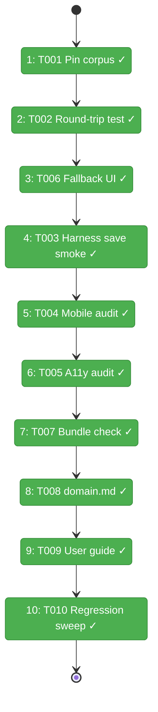
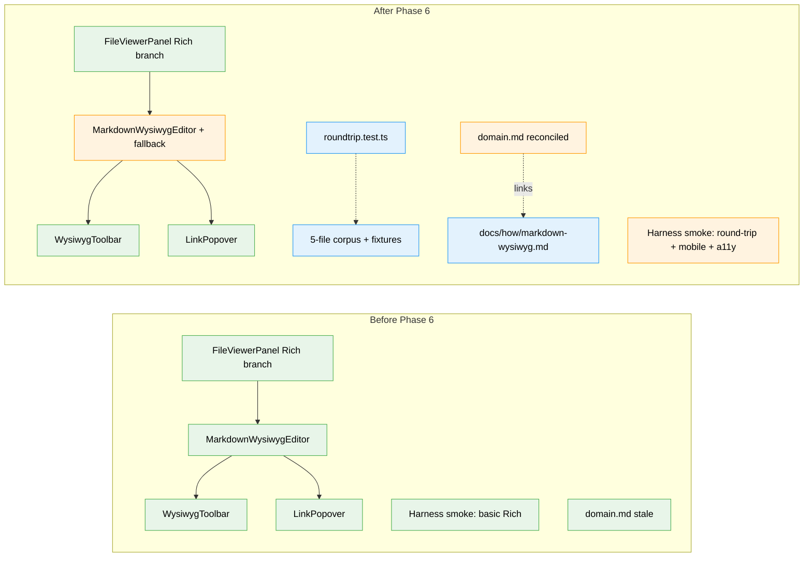

# Flight Plan: Phase 6 — Round-trip Tests, Polish, Docs, Domain.md

**Plan**: [md-editor-plan.md](../../md-editor-plan.md)
**Phase**: Phase 6: Round-trip Tests, Polish, Docs, Domain.md
**Generated**: 2026-04-20
**Status**: Landed

---

## Departure → Destination

**Where we are**: Phases 1–5 have landed. `MarkdownWysiwygEditor` + `WysiwygToolbar` + `LinkPopover` render inside `FileViewerPanel`'s Rich branch, driven by lazy `@tiptap/*`. The save pipeline is reused via `performSave()` and `Cmd+S`. Legacy `?mode=edit` URLs are coerced to `source`. The corpus files exist on disk but are not yet pinned. `_platform/viewer/domain.md` is stale — it still claims it doesn't own CodeMirror, which it has since Plan 058. There is no user-facing documentation, no round-trip test, no accessibility audit, no bundle-size check, no error-fallback UI.

**Where we're going**: A developer can confidently round-trip any of 5 pinned corpus files through the editor with byte-identity when unedited; the Playwright harness smoke proves Rich → type → `⌘S` → reload survives; mobile works at 375×667 without swipe-gesture conflict; the editor fails gracefully with a "Switch to Source mode" button when Tiptap can't mount; the lazy chunk stays under 130 KB gz; `_platform/viewer/domain.md` is accurate; and `docs/how/markdown-wysiwyg.md` is the canonical user guide.

---

## Domain Context

### Domains We're Changing

| Domain | What Changes | Key Files |
|--------|-------------|-----------|
| `_platform/viewer` | Tiptap-init error fallback UI (T006); domain.md reconciliation (T008) | `markdown-wysiwyg-editor.tsx`, `markdown-wysiwyg-editor-lazy.tsx`, `docs/domains/_platform/viewer/domain.md` |
| `file-browser` | Optional `onFallback` wire-through on the Rich branch (T006); optional swipe-conflict patch on editor wrapper is logically `_platform/viewer` but surfaces via `file-browser` integration (T004) | `file-viewer-panel.tsx` |
| (docs) | New user guide | `docs/how/markdown-wysiwyg.md` |
| (infra / test) | Pinned corpus + synthetic fixtures + round-trip test | `test/fixtures/markdown/*`, `test/unit/web/features/_platform/viewer/roundtrip.test.ts` |
| (harness) | Extend smoke spec with save-round-trip, mobile, a11y scenarios | `harness/tests/smoke/markdown-wysiwyg-smoke.spec.ts` |

### Domains We Depend On (no changes)

| Domain | What We Consume | Contract |
|--------|-----------------|----------|
| `_platform/viewer` | Front-matter codec | `splitFrontMatter` / `joinFrontMatter` |
| `_platform/viewer` | Tiptap extension config | `TiptapExtensionConfig` |
| `_platform/viewer` | Editor DOM surface | `.md-wysiwyg-editor-mount` + `data-emitted-markdown` |
| `file-browser` | Save pipeline | `performSave` + `saveFileImpl` DI prop |
| (server) | Save action | `saveFile` — **untouched** (Finding 01) |

---

## Flight Status

<!-- Updated by /plan-6-v2: pending → active → done. Use blocked for problems/input needed. -->

**Legend**: grey = pending | yellow = active | red = blocked/needs input | green = done

---

## Stages

<!-- Updated by /plan-6-v2 during implementation: [ ] → [~] → [x]. Stage N ↔ Task T0NN (see mapping in Stage headings). Execution order follows the dependency graph, NOT numeric T-ID order — note T006 runs before T003. -->

- [x] **Stage 1 → T001: Pin the round-trip corpus** — Add 3 synthetic fixtures (tables-only, frontmatter-weird, references-and-images) plus a typed `index.ts` barrel exporting 6 paths (`test/fixtures/markdown/` — new files)
- [x] **Stage 2 → T002: Extract `buildMarkdownExtensions` + write `roundtrip.test.ts`** — Lift inline extensions array to `lib/build-markdown-extensions.ts`; drive Tiptap headlessly in Node; assert byte-identity (no edits) and single-delta (one edit); document reference-link flattening caveat (new helper + `test/unit/web/features/_platform/viewer/roundtrip.test.ts`)
- [x] **Stage 3 → T006: Tiptap init + post-mount error fallback UI** — Add `onFallback?` + `createEditorOverride?` props; handle mount + transaction errors; render fallback panel with Source-mode button; two forced-failure tests (`markdown-wysiwyg-editor.tsx`, `markdown-wysiwyg-editor-lazy.tsx`, `wysiwyg-extensions.ts`, `file-viewer-panel.tsx`, `markdown-wysiwyg-editor.test.tsx`)
- [x] **Stage 4 → T003: Harness save-round-trip smoke** — Rich → type → `⌘S` → observe save-signal → reload → verify; cover/mark negative paths (save during mount, conflict banner, reload-race); evidence screenshot (`harness/tests/smoke/markdown-wysiwyg-smoke.spec.ts`)
- [x] **Stage 5 → T004: Mobile audit at 3 viewports** — 375×667 + 667×375 + 1024×768; toolbar scroll, bottom-sheet vs popover, swipe-vs-selection; patch `.md-wysiwyg-editor-mount` wrapper in `file-viewer-panel.tsx` if needed
- [x] **Stage 6 → T005: Accessibility audit** — Dep gate `@axe-core/playwright`; axe + Tab/Enter/Space (no arrow-key — not implemented) + aria-pressed + contrast in both themes + 200 KB forced-Source accessible explanation + SR smoke pass; evidence JSON
- [x] **Stage 7 → T007: Bundle-size check** — `pnpm --filter @chainglass/web analyze` → lazy `@tiptap/*` chunk ≤ 130 KB gz AND Source-only path has zero Tiptap bytes; log command + result; if over, file scope ticket
- [x] **Stage 8 → T008: Update `_platform/viewer/domain.md`** — Owns + Contracts + Composition + Source Location; remove stale "CodeMirror" NOT-Own line; add Concepts entries for all 3 (MarkdownWysiwygEditor, WysiwygToolbar, LinkPopover); link to guide
- [x] **Stage 9 → T009: Write `docs/how/markdown-wysiwyg.md`** — 7 sections; add back-links from spec + domain.md
- [x] **Stage 10 → T010: Final regression sweep** — `just fft` (already chains lint/format/build/typecheck/test/security-audit); harness re-run if T003-T006 changed runtime; AC-19 non-touch diff for `058-workunit-editor/`; AC-20 non-touch diff for viewer components

---

## Architecture: Before & After

**Legend**: existing (green, unchanged) | changed (orange, modified) | new (blue, created)

---

## Acceptance Criteria

- [ ] Round-trip byte-identity passes on all 6 corpus files (AC-08)
- [ ] With-edit test produces exactly one delta equal to `**<token>**` (AC-09, AC-10)
- [ ] Harness save-round-trip smoke exits 0; screenshot captured; negative paths covered/declared (AC-03, AC-06, AC-20)
- [ ] Mobile toolbar reachable on 375×667 + 667×375 + 1024×768; link bottom-sheet renders on phone, popover on tablet+; selection works without triggering swipe (AC-14, Finding 07)
- [ ] axe: zero violations at `serious` or `critical`; Tab/Enter/Space keyboard flow recorded; contrast passes both themes; 200 KB forced-Source path accessibly explained (AC-17)
- [ ] Forced-failure tests green (mount + post-mount); fallback panel + "Switch to Source" button work (AC-18)
- [ ] Lazy `@tiptap/*` chunk ≤ 130 KB gz AND Source-only path has zero `@tiptap/*` bytes (AC-15, AC-16)
- [ ] `_platform/viewer/domain.md` accurate; "Does NOT Own: CodeMirror editor" line removed (Finding 02); Concepts entries for MarkdownWysiwygEditor + WysiwygToolbar + LinkPopover (F005)
- [ ] `docs/how/markdown-wysiwyg.md` published with all 7 sections; linked from spec + domain.md
- [ ] `just fft` passes (or only security-audit fails with documented reason); AC-19 non-touch diff for `058-workunit-editor/` is empty; AC-20 non-touch diff for viewer components matches expectation (plan DoD)

## Goals & Non-Goals

**Goals**:
- Round-trip fidelity proven at the serializer boundary and end-to-end through save/reload
- Mobile + accessibility + error-fallback polish
- Bundle budget verified
- Documentation drift closed (domain.md + user guide)
- All quality gates green

**Non-Goals**:
- Changing server save code (Finding 01)
- Moving files between domains
- Removing the legacy `?mode=edit` coercion
- Adding new Tiptap extensions
- Fixing the 4 pre-existing typecheck debt items (surface, don't fix)

---

## Checklist

> **Execution order note**: follows the dependency graph — **T006 runs before T003** — not numeric T-ID order. T001→T002→T006→T003→T004→T005→T007→T008→T009→T010.

- [x] T001: Pin the corpus — 3 real docs + 3 synthetic fixtures + typed `index.ts` barrel
- [x] T002: Extract `buildMarkdownExtensions` + write `roundtrip.test.ts` — headless Tiptap drive; byte-identity + single-delta; ref-link flattening caveat
- [x] T006: Tiptap init + post-mount error fallback UI + `createEditorOverride?` DI prop + 2 forced-failure tests
- [x] T003: Harness save-round-trip smoke scenario + negative paths
- [x] T004: Mobile audit at 375×667 + 667×375 + 1024×768; patch `.md-wysiwyg-editor-mount` in `file-viewer-panel.tsx` if swipe conflict
- [x] T005: Accessibility audit — axe + Tab/Enter/Space + aria-pressed + contrast + oversized-file SR path
- [x] T007: Bundle-size check — lazy chunk ≤ 130 KB gz + Source path has zero Tiptap bytes
- [x] T008: Update `docs/domains/_platform/viewer/domain.md` + Concepts for all 3 Rich components
- [x] T009: Write `docs/how/markdown-wysiwyg.md`
- [x] T010: Final regression sweep — `just fft` + harness re-run if needed + AC-19/AC-20 non-touch diffs

---

## Navigation

- **Plan**: [md-editor-plan.md](../../md-editor-plan.md)
- **Tasks**: [tasks.md](./tasks.md)
- **Execution log**: `./execution.log.md` _(created by plan-6)_
