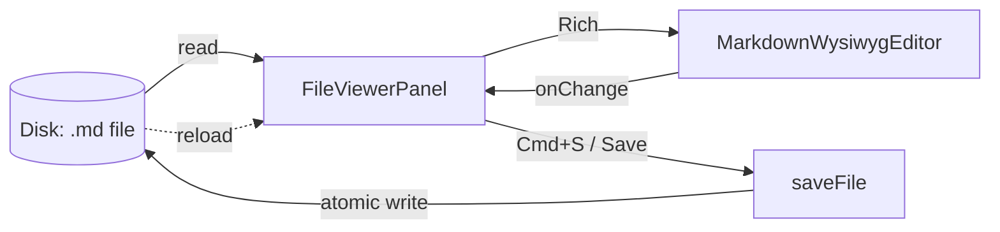
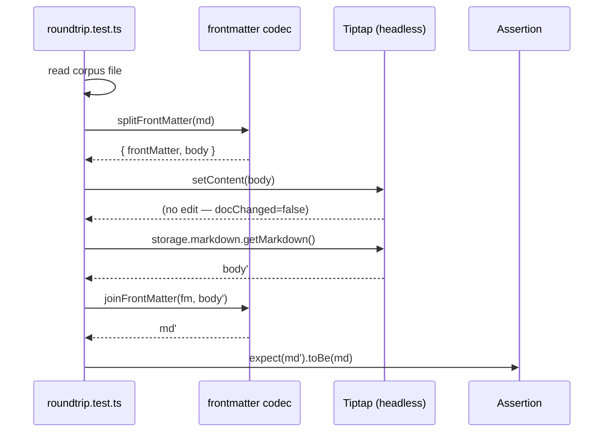

# Phase 6: Round-trip Tests, Polish, Docs, Domain.md

**Plan**: [md-editor-plan.md](../../md-editor-plan.md)
**Status**: Ready for implementation
**Generated**: 2026-04-20

---

## Executive Briefing

**Purpose**: Close the plan. Prove round-trip fidelity on a pinned corpus, verify the end-to-end Source ↔ Rich ↔ Save loop in a real browser via the harness, polish accessibility / mobile / error-fallback edges, confirm the Tiptap lazy-chunk bundle budget, reconcile `_platform/viewer/domain.md` with the code that actually lives there, and publish a user-facing guide.

**What We're Building**:
- A round-trip test (`roundtrip.test.ts`) against a 5-file pinned corpus (3 real docs + 2 synthetic edge-case fixtures).
- A Playwright smoke spec under `harness/tests/smoke/` that boots the app, opens a `.md` file, toggles Rich, types, saves with `⌘S`, reloads, and asserts content persisted.
- A mobile (375×667) audit of toolbar scroll, link bottom-sheet, and selection-vs-swipe conflict.
- An accessibility sweep (axe + keyboard-only + aria-pressed announcement).
- A Tiptap-init error fallback UI on the editor component.
- A bundle-size check of the lazy `@tiptap/*` chunk against the 130 KB gz budget.
- `_platform/viewer/domain.md` updated for the three new editor components and the stale "Does NOT Own: CodeMirror editor" line.
- `docs/how/markdown-wysiwyg.md` user guide.
- A final regression sweep: `just test` + `just typecheck` + `just lint` + `just build` all green.

**Goals**:
- ✅ AC-08 / AC-09 / AC-10 round-trip fidelity proven on all 5 fixtures
- ✅ AC-03 / AC-06 observed end-to-end via Playwright harness smoke
- ✅ AC-14 mobile toolbar scroll + link sheet verified; Finding 07 swipe conflict resolved or shown absent
- ✅ AC-17 accessibility: no axe "serious" or higher violations
- ✅ AC-18 Tiptap-init error fallback renders on forced failure
- ✅ AC-16 lazy bundle ≤ 130 KB gz
- ✅ `_platform/viewer/domain.md` accurate (Finding 02 closed)
- ✅ `docs/how/markdown-wysiwyg.md` published, linked from spec + domain.md
- ✅ All four quality gates green

**Non-Goals**:
- ❌ Changing server-side save code (`saveFile`, `saveFileService`, file-actions) — Finding 01, stays untouched
- ❌ Moving files between domains (registry + domain-map unchanged)
- ❌ Removing the `?mode=edit` legacy-URL coercion (stays per plan, flagged for future removal)
- ❌ Adding new Tiptap extensions (bundle-budget guardrail)
- ❌ Addressing the 4 pre-existing typecheck debt items outside this plan (surface but don't fix)

---

## Prior Phase Context

### Phase 1 — Foundation
**Deliverables**: `wysiwyg-extensions.ts`, `image-url.ts`, `markdown-wysiwyg-editor.tsx`, `markdown-wysiwyg-editor-lazy.tsx`, viewer `index.ts` barrel, `/dev/markdown-wysiwyg-smoke` page (later deleted in Phase 5), `harness/tests/smoke/markdown-wysiwyg-smoke.spec.ts`.
**Dependencies exported**: `ImageUrlResolver`, `FrontMatterCodec`, `MarkdownWysiwygEditorProps`, `TiptapExtensionConfig`, `resolveImageUrl(src, currentFilePath, rawFileBaseUrl)`.
**Gotchas & Debt**: `@tiptap/markdown` is actually the `tiptap-markdown` package; `setContent(body, false)` uses boolean `emitUpdate`. 4 unrelated TS errors were already present. Bundle-size check deferred here → landed in **6.7**. Error-fallback UI deferred here → landed in **6.6**.
**Incomplete Items**: 6.6 error fallback UI, 6.7 bundle-size check.
**Patterns to Follow**: Types-first contracts (runtime-free `.d.ts`-shaped files); `dynamic(..., { ssr: false })` lazy boundary; ref-stable callbacks; smoke-page proved image URL rewrite + hydration safety before production wiring.

### Phase 2 — Toolbar & Shortcuts
**Deliverables**: `wysiwyg-toolbar-config.ts`, `wysiwyg-toolbar.tsx`, `globals.css` (scoped placeholder CSS).
**Dependencies exported**: `ToolbarIconName`, `ToolbarAction`, `ToolbarGroup`, `WysiwygToolbarProps`, `WYSIWYG_TOOLBAR_GROUPS`, `WYSIWYG_TOOLBAR_ACTIONS`.
**Gotchas & Debt**: `Mod-Alt-c` already provided by StarterKit code-block shortcut; jsdom focus state is flaky (tests account for this). Mobile shortcut verification deferred → **6.4**.
**Incomplete Items**: 6.4 mobile audit.
**Patterns to Follow**: `useEditorState` selector map to avoid per-keystroke re-renders; `role="toolbar"`, `aria-pressed`, `title`, `data-testid="toolbar-<id>"` — accessibility **6.5** reads these; `onEditorReady` ref-stable callback for parent wiring.

### Phase 3 — Link Popover
**Deliverables**: `sanitize-link-href.ts`, `link-popover.tsx`, updated viewer `index.ts` barrel.
**Dependencies exported**: `SanitizedHref`, `LinkPopoverProps`; editor prop `onOpenLinkDialog?: () => void`; toolbar prop `linkButtonRef?: Ref<HTMLButtonElement>`.
**Gotchas & Debt**: `Popover.modal={true}` is required for focus trap; `extendMarkRange('link')` beat manual range walking; mobile bottom-sheet not yet verified in harness → **6.4**.
**Incomplete Items**: 6.4 mobile Sheet end-to-end verification.
**Patterns to Follow**: `PopoverAnchor virtualRef` for toolbar anchoring; defense-in-depth URL sanitization (sanitizer + Tiptap `isAllowedUri`); popover prefill keyed by `[open, editor, isInLink]`.

### Phase 4 — Utilities (TDD)
**Deliverables**: `markdown-frontmatter.ts`, `markdown-has-tables.ts`, `rich-size-cap.ts`; editor & smoke page updated to consume them.
**Dependencies exported**: `splitFrontMatter(md) => { frontMatter, body }`, `joinFrontMatter(fm, body) => string`, `hasTables(md) => boolean`, `RICH_MODE_SIZE_CAP_BYTES = 200_000`, `exceedsRichSizeCap(content) => boolean`.
**Gotchas & Debt**: Cap is **200_000** (decimal KB, not 204_800); front-matter scanner stops at first closing `---`; `hasTables` distinguishes ``` vs `~~~` code fences; `act()` warnings in older Tiptap tests are pre-existing. domain.md refresh deferred → **6.8**. Low notes (reference-format consistency, TOML corpus check) deferred.
**Incomplete Items**: 6.8 domain.md refresh.
**Patterns to Follow**: Lifecycle-safety tests (mount → real edit → assert emitted markdown prefix); `TextEncoder` for byte-accurate size checks; `__smokeGetMarkdown` + `__smokeGetLastEmittedMarkdown` window getters (gated on the dev smoke page, useful for harness probe).

### Phase 5 — FileViewerPanel Integration
**Deliverables**: `file-viewer-panel.tsx` (Rich branch wired), `browser-client.tsx` (`edit` → `source`, `?mode=edit` coercion), `file-browser.params.ts`, `use-legacy-mode-coercion.ts`, `code-block-language-pill.ts` (internal to lazy chunk), `globals.css` pill styles, Rich-mode integration & unit tests, `use-legacy-mode-coercion.test.ts`, harness smoke spec extended, `scratch/harness-test-workspace/sample-rich.md` test fixture. Dev `/dev/markdown-wysiwyg-smoke` page **deleted**.
**Dependencies exported**: `ViewerMode = 'source' | 'rich' | 'preview' | 'diff'`; `FileViewerPanelProps.saveFileImpl?: (content: string) => Promise<void>`; internal `ModeButton` gained `disabled?: boolean` + `title?: string`. Viewer barrel surface consumed here: `MarkdownWysiwygEditorLazy`, `WysiwygToolbar`, `LinkPopover`, `resolveImageUrl`, `exceedsRichSizeCap`, `hasTables`, `splitFrontMatter`, `joinFrontMatter`.
**Gotchas & Debt**: Turbopack choked on multiline JSDoc inside object literals; legacy-mode coercion **must** run before the scroll-to-line effect (declaration order in `browser-client.tsx`); jsdom needed Range + elementFromPoint polyfills for Rich typing; the harness link-flow smoke was intentionally narrowed to the production surface (no dev probe page).
**Incomplete Items**: Everything in Phase 6 (6.2–6.10).
**Patterns to Follow**: Editor mount is a single `.md-wysiwyg-editor-mount` wrapper **created in `file-viewer-panel.tsx:477-484`** (not inside `MarkdownWysiwygEditor`); toolbar + popover are siblings outside the mount. `data-emitted-markdown` is set on that wrapper at `file-viewer-panel.tsx:249-257` — **the editor component itself only exposes `[data-testid="md-wysiwyg-root"]` at `markdown-wysiwyg-editor.tsx:208-211`**. `performSave(...)` unifies Save button + `⌘S`. `FakeSaveFile` DI pattern — no business-logic mocks per R-TEST-007. Tiptap runtime extensions are built **inline inside `markdown-wysiwyg-editor.tsx:114-148`** — `wysiwyg-extensions.ts` is types-only, so T002 extracts a `buildMarkdownExtensions` helper first. Code-pill extension stays internal to the lazy chunk (no new barrel exports).

---

## Pre-Implementation Check

| File | Exists? | Domain Check | Notes |
|------|---------|--------------|-------|
| `test/fixtures/markdown/tables-only.md` | No → create | (infra / test) | Synthetic corpus |
| `test/fixtures/markdown/frontmatter-weird.md` | No → create | (infra / test) | Synthetic corpus |
| `test/fixtures/markdown/index.ts` | No → create | (infra / test) | Barrel of corpus paths |
| `test/unit/web/features/_platform/viewer/roundtrip.test.ts` | No → create | `_platform/viewer` | Pure node unit test — no jsdom render needed |
| `harness/tests/smoke/markdown-wysiwyg-smoke.spec.ts` | Yes (extended 3×) | (harness) | Append Phase 6 round-trip-save + mobile specs |
| `apps/web/src/features/_platform/viewer/components/markdown-wysiwyg-editor.tsx` | Yes | `_platform/viewer` | Add error-boundary / try-catch fallback (6.6) |
| `apps/web/src/features/041-file-browser/components/file-viewer-panel.tsx` | Yes | `file-browser` | Consumes the fallback — Rich mode toggle re-checks failure |
| `docs/domains/_platform/viewer/domain.md` | Yes (stale) | `_platform/viewer` | Finding 02 — update Owns/Contracts/Composition + remove "Does NOT Own: CodeMirror" line |
| `docs/how/markdown-wysiwyg.md` | No → create | (docs) | User guide; link from spec + domain.md |

**Concept-duplication check**: `/code-concept-search-v2` not re-run — Phase 6 deliverables are either tests, docs, a mini error-fallback component (no existing equivalent), or a bundle-analysis recipe. No new reusable runtime concepts introduced.

**Contract-change flag**: `_platform/viewer/domain.md` (Owns + Contracts rows added, one stale "Does NOT Own" line removed) — this is documentation drift reconciliation, not a contract surface change. Plan-7-v2 should verify.

**Harness health check** (2026-04-20 08:57): `just harness health` → `status:ok, app:up, mcp:up, terminal:up, cdp:up (Chrome/136)`.
Harness is **L3 and healthy**. Plan-6 MUST re-run the health probe at phase start (Boot → Interact → Observe) before any harness task.

---

## Architecture Map

```mermaid
flowchart TD
    classDef pending fill:#9E9E9E,stroke:#757575,color:#fff
    classDef completed fill:#4CAF50,stroke:#388E3C,color:#fff
    classDef infra fill:#ECEFF1,stroke:#546E7A,color:#000

    subgraph Phase6["Phase 6: Round-trip, Polish, Docs"]
        T001["T001: Pin corpus + fixtures"]:::completed
        T002["T002: Round-trip test"]:::completed
        T003["T003: Harness save smoke"]:::completed
        T004["T004: Mobile audit"]:::completed
        T005["T005: Accessibility audit"]:::completed
        T006["T006: Tiptap-init fallback"]:::completed
        T007["T007: Bundle-size check"]:::completed
        T008["T008: domain.md update"]:::completed
        T009["T009: User guide"]:::completed
        T010["T010: Regression sweep"]:::completed

        T001 --> T002
        T002 --> T010
        T003 --> T010
        T004 --> T010
        T005 --> T010
        T006 --> T003
        T006 --> T010
        T007 --> T010
        T008 --> T010
        T009 --> T010
    end

    subgraph Corpus["Fixtures"]
        C1["docs/plans/083-md-editor/md-editor-spec.md"]:::completed
        C2["docs/plans/083-md-editor/research-dossier.md"]:::completed
        C3["docs/adr/ (pinned ADR)"]:::completed
        C4["test/fixtures/markdown/tables-only.md"]:::completed
        C5["test/fixtures/markdown/frontmatter-weird.md"]:::completed
        C6["test/fixtures/markdown/references-and-images.md"]:::completed
    end

    subgraph Prior["From Phases 1-5"]
        V1["splitFrontMatter / joinFrontMatter"]:::completed
        V2["MarkdownWysiwygEditor (runtime extensions inline 114-148)"]:::completed
        V3["FileViewerPanel (.md-wysiwyg-editor-mount wrapper + data-emitted-markdown attr)"]:::completed
        V4["harness L3 CLI + CDP"]:::infra
    end

    T001 -.-> C4
    T001 -.-> C5
    T001 -.-> C6
    T002 -.-> V1
    T002 -.-> V2
    T002 -.-> C1
    T002 -.-> C2
    T002 -.-> C3
    T003 -.-> V3
    T003 -.-> V4
    T004 -.-> V3
    T004 -.-> V4
    T005 -.-> V2
    T005 -.-> V4
    T006 -.-> V2
    T006 --> T003
```



---

## Tasks

> **Execution order**: follows the dependency graph in the Architecture Map, NOT numeric T-ID order. **Run T006 before T003** — the harness save-round-trip smoke depends on the fallback UI being present so it can't land in a broken-fallback state. T001 must precede T002. T010 is strictly last.

| Status | ID | Task | Domain | Path(s) | Done When | Notes |
|--------|----|------|--------|---------|-----------|-------|
| [x] | T001 | Pin the corpus. Create `test/fixtures/markdown/index.ts` exporting absolute paths for the 3 real docs (`docs/plans/083-md-editor/md-editor-spec.md`, `docs/plans/083-md-editor/research-dossier.md`, and the pinned ADR — use `docs/adr/0017-plan-083-md-editor.md` if present, otherwise the nearest existing plan-3a ADR; record chosen path in Discoveries). Create 3 synthetic fixtures: `test/fixtures/markdown/tables-only.md` (≥3 GFM tables with left/right/center alignment markers, no other block types), `test/fixtures/markdown/frontmatter-weird.md` (YAML front-matter with nested `---`, CRLF line endings, BOM, inline floats, multiline scalars (`\|`/`>` blocks), body with inline `---` dividers), and `test/fixtures/markdown/references-and-images.md` (numbered reference-style links `[x][1]`, inline `` images with relative paths, mixed). | (infra / test) | `/Users/jordanknight/substrate/083-md-editor/test/fixtures/markdown/index.ts`, `/Users/jordanknight/substrate/083-md-editor/test/fixtures/markdown/tables-only.md`, `/Users/jordanknight/substrate/083-md-editor/test/fixtures/markdown/frontmatter-weird.md`, `/Users/jordanknight/substrate/083-md-editor/test/fixtures/markdown/references-and-images.md` | 6 files exist on disk; `index.ts` exports a typed `CORPUS_FILES: readonly { label: string; path: string; edgeCases: readonly string[] }[]` | AC-08; Finding 11. Synthetic fixtures stress Finding 03 edge cases. Edge-case tagging drives the T002 matrix. |
| [x] | T002 | Write `roundtrip.test.ts`. Step 1 — **extract** `apps/web/src/features/_platform/viewer/lib/build-markdown-extensions.ts` exporting a pure `buildMarkdownExtensions(config?): Extension[]` function by lifting the `const extensions` array currently defined **inline inside `markdown-wysiwyg-editor.tsx`** (`wysiwyg-extensions.ts` is type-only — do NOT try to reuse it as a runtime factory). Refactor the editor to consume the new helper (no behaviour change). Step 2 — the test: for each of the 6 corpus files, read as UTF-8 → `splitFrontMatter` → instantiate a headless `new Editor({ extensions: buildMarkdownExtensions(...) })` in Node → `editor.commands.setContent(body, { emitUpdate: false })` → `editor.storage.markdown.getMarkdown()` → `joinFrontMatter(fm, body')` → **assert byte-identical to input** (no-edit path, AC-08). Step 3 — **with-edit** test: pick a deterministic token, apply `editor.chain().focus().toggleBold()` over its range, assert the serialized diff equals exactly `**<token>**` (AC-09). CRLF handling: normalise to `\n` before the semantic compare AND run a separate byte-level assertion that CRLF is preserved end-to-end (document the decision in Discoveries). **Document caveat**: reference-link flattening is explicitly NOT byte-identical post-edit — assert this corpus file passes no-edit but not with-edit. | `_platform/viewer` | `/Users/jordanknight/substrate/083-md-editor/apps/web/src/features/_platform/viewer/lib/build-markdown-extensions.ts` (new), `/Users/jordanknight/substrate/083-md-editor/apps/web/src/features/_platform/viewer/components/markdown-wysiwyg-editor.tsx` (consume helper), `/Users/jordanknight/substrate/083-md-editor/test/unit/web/features/_platform/viewer/roundtrip.test.ts` | All 6 fixtures pass no-edit byte-identity; with-edit test produces exactly `**...**` delta; reference-link caveat documented | AC-08, AC-09, AC-10. Finding 03. Finding 11. R-TEST-007 (no `vi.mock`/`vi.spyOn`). |
| [x] | T003 | Extend the harness smoke spec: **save-round-trip** scenario. **Prereq**: T006 fallback must land first so a Tiptap-init failure doesn't blow up the smoke. Open a `.md` file → click Rich → type `# Smoke Test\n` at top → press `⌘S` (or `Ctrl+S` on Linux via CDP key map) → wait for the `SaveStatus = 'saved'` observable signal on the page (not a timer) → reload → assert rendered content still starts with `# Smoke Test`. Capture a screenshot. **Negative paths** (covered OR explicitly deferred with justification in Discoveries): (a) `⌘S` fires while Rich mount is in-flight; (b) file mtime-changed externally mid-edit triggers the conflict banner; (c) reload racing save. For each: verify the existing `conflictError` / `externallyChanged` banners render; do NOT land on a `?mode=edit` URL after reload. | `file-browser`, `(harness)` | `/Users/jordanknight/substrate/083-md-editor/harness/tests/smoke/markdown-wysiwyg-smoke.spec.ts` | `just harness cg run smoke` exits 0; screenshot under `harness/evidence/phase-6-save-roundtrip-*.png`; negative-path handling recorded | AC-03, AC-06, **AC-20** (Source/Preview/Diff modes still work). Harness L3. Re-run health probe at task start. Reuse `scratch/harness-test-workspace/sample-rich.md`. |
| [x] | T004 | Mobile audit in the harness. Three viewports: portrait **375×667**, landscape **667×375**, tablet **1024×768**. For each: (a) open a `.md`, enter Rich, verify the toolbar is reachable (portrait: `scrollWidth > clientWidth` + all 16 buttons hit via scroll; landscape/tablet: all 16 buttons likely fit without scroll, assert visibility); (b) open link popover — at portrait 375 verify shadcn `Drawer` bottom-sheet layout, at ≥ tablet verify the desktop `Popover`. (c) portrait only — attempt a text selection drag inside the `.md-wysiwyg-editor-mount` wrapper (**which lives in `file-viewer-panel.tsx`**, NOT in the editor component) and verify the Plan 078 swipe-to-navigate handler (grep for `useSwipeNavigation` / `onSwipe` in `apps/web/src/features/041-file-browser/`) does **not** trigger. If it does, patch the wrapper JSX in `file-viewer-panel.tsx` with `data-swipe-ignore` (preferred) or a `touchstart` listener that calls `stopPropagation`; re-verify. Capture ≥1 screenshot per viewport × sub-check. | `file-browser`, `(harness)` | `/Users/jordanknight/substrate/083-md-editor/harness/tests/smoke/markdown-wysiwyg-smoke.spec.ts`, possibly `/Users/jordanknight/substrate/083-md-editor/apps/web/src/features/041-file-browser/components/file-viewer-panel.tsx` (swipe patch if needed) | All sub-checks captured per viewport; swipe conflict resolved or shown absent; screenshots attached | Finding 07 (primary risk). AC-14. The swipe target wrapper `.md-wysiwyg-editor-mount` is created in `file-viewer-panel.tsx:477-484`, so the patch lands there — not in `_platform/viewer`. |
| [x] | T005 | Accessibility audit. **Dependency gate**: check root `package.json` + `harness/package.json` for `@axe-core/playwright` — if absent, add it to `harness/package.json` devDependencies (record in Discoveries) or fall back to manual assertions via CDP (document the choice). Run axe against the Rich-mode editor surface (toolbar + mount + popover open + oversized-file forced-Source UI). Keyboard-only flow (**only the shortcuts that actually exist** — no arrow-key roving tabindex is currently implemented): `Tab`/`Shift+Tab` moves focus through toolbar buttons, `Enter`/`Space` activates, `Cmd+K` opens the link popover, `Esc` closes and returns focus to the link button. Assert `aria-pressed` flips after `toggleBold()`. Contrast: both light + dark theme toolbar CSS vars must satisfy WCAG AA. **Oversized-file path**: open a > 200 KB markdown file; verify the disabled Rich button surfaces the reason in an accessible way — not only the `title` tooltip (add `aria-describedby` or a visible hint if missing). Record ≥1 VoiceOver (macOS) or NVDA (Windows, if reachable) smoke pass announcing a toolbar toggle. | `_platform/viewer`, `(harness)` | `/Users/jordanknight/substrate/083-md-editor/harness/tests/smoke/markdown-wysiwyg-smoke.spec.ts`, possibly `/Users/jordanknight/substrate/083-md-editor/apps/web/src/features/_platform/viewer/components/wysiwyg-toolbar.tsx` (remediation), possibly `/Users/jordanknight/substrate/083-md-editor/apps/web/src/features/041-file-browser/components/file-viewer-panel.tsx` (oversized-file hint), `/Users/jordanknight/substrate/083-md-editor/harness/package.json` (dep add, if needed) | Zero axe violations at `serious` or `critical`; keyboard-only scenario recorded; SR smoke pass logged; contrast passes both themes; oversized-file path accessibly explained | AC-17. Phase 2 established `aria-pressed` + `role="toolbar"`; this task verifies it. Record axe JSON to `harness/evidence/phase-6-axe-*.json`. |
| [x] | T006 | Tiptap-init + post-mount error fallback. **Types-first**: add to `MarkdownWysiwygEditorProps` in `wysiwyg-extensions.ts`: `onFallback?: () => void;` and `createEditorOverride?: (config: { extensions: unknown[]; content: string; immediatelyRender: boolean }) => Editor;` (test-only DI surface). Wire both through `MarkdownWysiwygEditorLazy`. In `markdown-wysiwyg-editor.tsx`: wrap `useEditor` lifecycle + initial `setContent` in try/catch AND register an editor-level error handler (`editor.on('transactionError', …)` or equivalent) so **post-mount** failures (e.g., malformed paste, Tiptap transaction throws) also route to the fallback path. On failure, render a panel: heading "Rich mode couldn't load this file.", error summary line, and `<Button variant="outline">Switch to Source mode</Button>` that calls `onFallback()`. `FileViewerPanel` wires `onFallback` to `onModeChange('source')` and preserves `currentContent`. **Two unit tests** (no `vi.mock`): (a) pass `createEditorOverride` that throws synchronously → fallback renders + button invokes callback; (b) mount successfully then throw inside a command → post-mount fallback renders + original content preserved. | `_platform/viewer`, `file-browser` (wire-through) | `/Users/jordanknight/substrate/083-md-editor/apps/web/src/features/_platform/viewer/lib/wysiwyg-extensions.ts`, `/Users/jordanknight/substrate/083-md-editor/apps/web/src/features/_platform/viewer/components/markdown-wysiwyg-editor.tsx`, `/Users/jordanknight/substrate/083-md-editor/apps/web/src/features/_platform/viewer/components/markdown-wysiwyg-editor-lazy.tsx`, `/Users/jordanknight/substrate/083-md-editor/apps/web/src/features/041-file-browser/components/file-viewer-panel.tsx`, `/Users/jordanknight/substrate/083-md-editor/test/unit/web/features/_platform/viewer/markdown-wysiwyg-editor.test.tsx` | Both forced-failure tests green; manual provoke renders fallback; button returns to Source with content intact | AC-18. R-TEST-007. |
| [x] | T007 | Bundle-size check. Run `pnpm --filter @chainglass/web analyze` (Next.js 16 + Turbopack; if it requires the `--webpack` fallback, record the actual command invocation verbatim). Identify the lazy chunk containing `@tiptap/*` (from the `dynamic(...)` in `markdown-wysiwyg-editor-lazy.tsx`) and record its gzipped size. **Also** assert that the Source-only path (rendering a code file) does NOT load any `@tiptap/*` chunk — use the analyzer report to confirm lazy isolation (AC-15). **Done** iff lazy chunk ≤ 130 KB gz AND Source path has zero `@tiptap/*` bytes. **If over budget**: mark task `[!]` blocked, keep the Phase 6 PR in draft, revert any Phase 6 bundle-growing changes (identify by comparing analyzer output to a pre-Phase-6 baseline), file a scope ticket assigned to the plan owner, note it in Discoveries. | (infra) | `/Users/jordanknight/substrate/083-md-editor/docs/plans/083-md-editor/tasks/phase-6-roundtrip-polish-docs/execution.log.md`, `/Users/jordanknight/substrate/083-md-editor/harness/evidence/phase-6-bundle-*.{txt,json}` | Lazy chunk measured; Source-path Tiptap isolation verified; pass/blocked decision recorded with artifact | **AC-15, AC-16**, Finding 12. |
| [x] | T008 | Update `docs/domains/_platform/viewer/domain.md`. (a) **Owns** section: add `MarkdownWysiwygEditor`, `MarkdownWysiwygEditorLazy`, `WysiwygToolbar`, `LinkPopover`, and the lib utilities (`wysiwyg-extensions.ts`, `wysiwyg-toolbar-config.ts`, `sanitize-link-href.ts`, `markdown-frontmatter.ts`, `markdown-has-tables.ts`, `rich-size-cap.ts`, `image-url.ts`, `code-block-language-pill.ts`, `build-markdown-extensions.ts` from T002). (b) **Contracts** table: add a row for `MarkdownWysiwygEditor` (public consumer surface). (c) **Composition** rows for the new components. (d) **Source Location** rows. (e) **Boundary → Does NOT Own**: remove the stale "CodeMirror editor" line (Finding 02). (f) **Concepts** table: add entries for **all three** Rich-editor concepts — `MarkdownWysiwygEditor`, `WysiwygToolbar`, `LinkPopover` (F005 from Phase 5 review closes fully, not just the primary editor). (g) Add a "See also" link to the new user guide from T009. | `_platform/viewer` | `/Users/jordanknight/substrate/083-md-editor/docs/domains/_platform/viewer/domain.md` | Doc reflects code; Finding 02 + F005 (all 3 concepts) closed; registry + domain-map untouched | Finding 02. Constitution registry/domain-map rule: adding Owns rows within an existing domain does NOT require registry changes — verified against `docs/domains/registry.md`. |
| [x] | T009 | Write `docs/how/markdown-wysiwyg.md`. Sections: (a) **Source vs Rich — when to pick each** (concrete criteria: prose-heavy → Rich, config/data/code → Source; size > 200 KB always Source). (b) **Toolbar reference** — all 16 buttons with shortcuts. (c) **Keyboard shortcuts** — quick reference card. (d) **Markdown input rules**. (e) **Round-trip caveats** — byte-identity for unedited files, semantic equality post-edit, reference-link flattening explicitly called out. (f) **Tables + front-matter**. (g) **200 KB cap** — why, what happens. Add back-links: update `_platform/viewer/domain.md` "See also" and add a "User Guide" link in `md-editor-spec.md` § Documentation Strategy. | (docs) | `/Users/jordanknight/substrate/083-md-editor/docs/how/markdown-wysiwyg.md` (new), `/Users/jordanknight/substrate/083-md-editor/docs/domains/_platform/viewer/domain.md` (back-link edit), `/Users/jordanknight/substrate/083-md-editor/docs/plans/083-md-editor/md-editor-spec.md` (back-link edit) | File exists with all 7 sections; both back-links added | Spec § Documentation Strategy. |
| [x] | T010 | Final regression sweep. **Command set** (matches `justfile` reality — `just fft` already chains `lint format build typecheck test security-audit`): run `just fft`. If it passes cleanly, done. If only `security-audit` fails (pre-existing lodash-es advisories), record in Discoveries as `debt` and proceed. If anything else fails, fix or escalate. **Harness re-run**: if T004/T005/T006 changed runtime code, re-run `just harness cg run smoke` to confirm no regression. **AC-19 non-touch assertion** (AgentEditor unchanged): run `git diff --stat origin/main -- apps/web/src/features/058-workunit-editor/` and assert **zero** files changed under that path across the whole Phase-6 branch. **AC-20 non-touch assertion** (Source/Preview/Diff unchanged): run `git diff --stat origin/main -- apps/web/src/features/_platform/viewer/components/` and confirm only expected Phase 6 files (markdown-wysiwyg-editor.tsx, markdown-wysiwyg-editor-lazy.tsx, wysiwyg-extensions.ts, build-markdown-extensions.ts) plus any T005 remediation files appear — `code-editor.tsx`, `diff-viewer.tsx`, `markdown-preview.tsx` must be untouched by Phase 6. The 4 pre-existing typecheck debt items (019-agent-manager, 074-workflow-execution, _platform/panel-layout) are out-of-scope — record as `debt`. | (infra) | `/Users/jordanknight/substrate/083-md-editor/docs/plans/083-md-editor/tasks/phase-6-roundtrip-polish-docs/execution.log.md` | `just fft` passes (or only security-audit fails with documented reason); harness re-run green; AC-19 diff shows zero files under `058-workunit-editor/`; AC-20 diff under viewer/components matches expectation; Phase 6 execution log records final status | **AC-19** (explicit non-touch for `apps/web/src/features/058-workunit-editor/*`), **AC-20** (non-touch for untouched viewer components), plan DoD / Constitution §3.4 quality gates. |

---

## Context Brief

**Key findings from plan** (directly relevant to Phase 6):
- **Finding 01 (Critical)**: Do **not** touch `saveFile` / `saveFileService` / `file-actions`. T003 uses the existing pipeline end-to-end — treat as a black box.
- **Finding 02 (Critical)**: `_platform/viewer/domain.md` is stale. T008 is the single place where this is reconciled. Remove the "Does NOT Own: CodeMirror editor" line and add the three new editor components to Owns/Contracts.
- **Finding 03 (Critical)**: `splitFrontMatter` / `joinFrontMatter` correctness is a data-loss risk. T002's corpus includes `frontmatter-weird.md` specifically to stress this boundary.
- **Finding 07 (High)**: Swipe gestures (Plan 078) may fight `contenteditable` selection. T004 is the resolution venue — patch the editor wrapper with `data-swipe-ignore` or `touchstart` `stopPropagation` if needed.
- **Finding 11 (Medium)**: Unedited docs must short-circuit — `onChange` never fires without `docChanged`. T002's no-edit assertion validates this at the serializer level.
- **Finding 12 (Low)**: Bundle budget is 130 KB gz. T007 is the gate.

**Domain dependencies** (what Phase 6 consumes without changing):
- `_platform/viewer`: `splitFrontMatter`, `joinFrontMatter` (`markdown-frontmatter.ts`) — T002 round-trip splitter.
- `_platform/viewer`: `wysiwyg-extensions.ts` `TiptapExtensionConfig` — T002 drives Tiptap headlessly.
- `_platform/viewer`: `MarkdownWysiwygEditor` runtime extensions need a factory extracted (T002 adds `build-markdown-extensions.ts`) and a `createEditorOverride?` DI prop for forced-failure testing (T006). `file-viewer-panel.tsx` owns the `.md-wysiwyg-editor-mount` wrapper + `data-emitted-markdown` attribute — T003/T004 read/patch here, not inside the editor.
- `_platform/viewer`: `WysiwygToolbar` `aria-pressed` + `role="toolbar"` + `data-testid="toolbar-<id>"` — T005 keyboard-only assertions read these.
- `file-browser`: `FileViewerPanel` Rich branch + `performSave` — T003 save-round-trip.
- `file-browser`: `use-legacy-mode-coercion.ts` — T003 reload-after-save step must NOT land on a `?mode=edit` URL (should coerce cleanly).
- `harness` (L3 CLI): `just harness cg run smoke`, `just harness health`, CDP at 375×667.

**Domain constraints**:
- **No new `_platform/viewer` barrel exports** beyond what exists. The code-block-language-pill stays internal to the lazy chunk.
- **Tests go under `test/unit/` or `test/integration/`** mirroring the source path; fixtures under `test/fixtures/`. Harness specs stay under `harness/tests/smoke/`.
- **R-TEST-007**: No `vi.mock`, `vi.spyOn`, `vi.fn` — use DI + Fake classes with `.calls` arrays. T002 and T006 must respect this.
- **Server code is off-limits** (Finding 01). Any failure in T003 that looks like a server-side issue is a signal to re-plan, not to patch the server.
- **Domain-map + registry**: Do not touch. Only `_platform/viewer/domain.md` text changes in T008.

**Harness context**:
- **Boot**: `just harness up` — health probe `just harness health` (confirmed OK at plan generation: app + mcp + terminal + cdp all up, Chrome 136).
- **Interact**: Playwright via CDP on the port reported by `just harness ports`; `just harness cg run smoke` drives the smoke spec.
- **Observe**: Evidence under `harness/evidence/` (JSON + screenshots); results via `just harness results`.
- **Maturity**: **L3** (Boot + Browser Interaction + Structured Evidence + CLI SDK). No change required.
- **Pre-phase validation**: Agent MUST run `just harness health` at start of implementation and before each harness-dependent task (T003, T004, T005). If unhealthy, stop and diagnose — do not paper over.

**Reusable from prior phases**:
- Harness fixture: `scratch/harness-test-workspace/sample-rich.md` (Phase 5) — reuse for T003 save-round-trip.
- Harness spec scaffolding in `harness/tests/smoke/markdown-wysiwyg-smoke.spec.ts` — extend, don't replace.
- `FakeSaveFile` pattern (Phase 5 integration tests) — use if T006 fallback test needs save isolation.
- `__smokeGetMarkdown` / `__smokeGetLastEmittedMarkdown` window getters — **gone** after Phase 5 deleted the dev smoke page. For T002, drive Tiptap directly in Node; do not attempt to resurrect the dev page.

**Mermaid flow diagram** (Phase 6 system state — round-trip save):



**Mermaid sequence diagram** (Phase 6 round-trip test — T002):



---

## Discoveries & Learnings

_Populated during implementation by plan-6._

| Date | Task | Type | Discovery | Resolution | References |
|------|------|------|-----------|------------|------------|

**Types**: `gotcha` | `research-needed` | `unexpected-behavior` | `workaround` | `decision` | `debt` | `insight`

---

## Directory Layout

```
docs/plans/083-md-editor/
  ├── md-editor-plan.md
  └── tasks/
      ├── phase-1-foundation/
      ├── phase-2-toolbar-shortcuts/
      ├── phase-3-link-popover/
      ├── phase-4-utilities/
      ├── phase-5-fileviewerpanel-integration/
      └── phase-6-roundtrip-polish-docs/
          ├── tasks.md          ← this file
          ├── tasks.fltplan.md  ← next
          └── execution.log.md  ← created by plan-6
```

---

**Next step**: Run `/plan-6-v2-implement-phase --phase "Phase 6: Round-trip Tests, Polish, Docs, Domain.md" --plan "/Users/jordanknight/substrate/083-md-editor/docs/plans/083-md-editor/md-editor-plan.md"`

---

## Validation Record (2026-04-20)

Run by `/validate-v2` on the Phase 6 tasks dossier + flight plan. 4 parallel GPT-5.4 subagents. **Lens coverage: 11/12** (above the 8 floor).

| Agent | Lenses Covered | Issues | Verdict |
|-------|---------------|--------|---------|
| Source Truth | Factual Accuracy, Hidden Assumptions, Technical Constraints | 3 HIGH + 3 MEDIUM — all fixed | ⚠️ → ✅ |
| Cross-Reference | Integration & Ripple, Concept Documentation, Consistency | 2 HIGH + 3 MEDIUM — HIGH fixed, MEDIUM fixed | ⚠️ → ✅ |
| Completeness | Edge Cases & Failures, User Experience, Accessibility, Deployment & Ops | 5 HIGH + 2 MEDIUM — HIGH fixed, MEDIUM fixed | ⚠️ → ✅ |
| Forward-Compatibility | Forward-Compatibility, Test Boundary, Contract Drift, Lifecycle Ownership | 3 MEDIUM — all fixed | ⚠️ → ✅ |

### Forward-Compatibility Matrix

| Consumer | Requirement | Failure Mode | Verdict | Evidence |
|----------|-------------|--------------|---------|----------|
| `plan-6-v2-implement-phase` agent | Unambiguous executable task list with absolute paths + testable Done When + correct execution order | Shape mismatch / Contract drift | ✅ (fixed) | 7-column shape retained; T002 now extracts `build-markdown-extensions.ts` before reuse; T006 explicitly adds `createEditorOverride?` DI prop; T010 command set now matches `justfile:268-270`; execution-order note added at top of Tasks section. |
| `plan-7-v2-code-review` agent | Each task traceable to AC + finding + file path | Test boundary / Contract drift | ✅ (fixed) | AC-20 added to T003; T010 AC-19 replaced with explicit non-touch assertion for `apps/web/src/features/058-workunit-editor/`; T010 also adds AC-20 non-touch diff for viewer components. |
| `plan-8-v2-merge` agent | Final clean quality-gate artifact + execution log | Lifecycle ownership | ✅ (fixed) | T007 + T010 now list explicit `Path(s)` including `execution.log.md` and `harness/evidence/phase-6-bundle-*.{txt,json}`. |
| Future-reader of the plan | Durable doc explaining the 10 tasks + round-trip caveats | Contract drift | ✅ (fixed) | Flight plan stages now 1:1 with T001-T010 annotated; 10-state Flight Status diagram; Stages section explicitly notes T006-before-T003 execution order. |

**Outcome alignment**: Partially aligned → now aligned — the dossier clearly advances "WYSIWYG editing of Markdown inside FileViewerPanel via Tiptap"; T009/T010 ownership fixes and AC-19/AC-20 explicit non-touch assertions now allow downstream consumers to execute and audit the phase cleanly.

**Standalone?**: No — four concrete downstream consumers named (plan-6, plan-7, plan-8, future-reader) with plan-tree traversal proof.

**Fixes applied (HIGH — 10)**: T002 type-only/inline extraction fix; T005 arrow-key→Tab/Enter/Space + axe dep gate; T006 explicit `createEditorOverride?` prop + post-mount error path + 2 tests; T003 AC-20 + save-race negative paths; T001 fixtures expanded (reference-links fixture, richer YAML); T010 AC-19 relabel + explicit non-touch assertion + correct `just fft` understanding; T004 + T005 `(harness)` domain tagging + 3-viewport coverage + specific swipe surface; T006 broadened to post-mount; architecture map clarified T006→T003 ordering; flight-plan renumbered to 10 stages with T-ID mapping.

**Fixes applied (MEDIUM — 8)**: context-brief `data-emitted-markdown` correctly attributed to `file-viewer-panel.tsx`; swipe patch target path corrected; `@axe-core/playwright` dep gate added; T008 Concepts expanded to all 3 (MarkdownWysiwygEditor, WysiwygToolbar, LinkPopover); T007 explicit Source-path Tiptap isolation check (AC-15); T007 escalation path (scope ticket + keep PR draft); T009 + T010 `Path(s)` entries added.

**Fixes applied (LOW — 1)**: `(harness)` domain tag applied to T003/T004/T005 rows.

Overall: ⚠️ **VALIDATED WITH FIXES**
