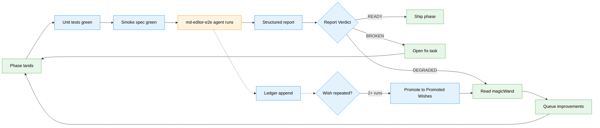

# Workshop: Markdown Editor E2E Test Agent

**Type**: Testing Agent / E2E / Self-Improving Harness Agent
**Plan**: 083-md-editor
**Spec**: [../md-editor-spec.md](../md-editor-spec.md)
**Plan**: [../md-editor-plan.md](../md-editor-plan.md)
**Related Workshop**: [001-editing-experience-and-ui.md](001-editing-experience-and-ui.md) (the "main beats" we're testing)
**Created**: 2026-04-18
**Status**: Draft

**Related Documents**:
- `harness/agents/_shared/preamble.md` — harness-agent contract (pwd, $MINIH_RUN_DIR, retro rules)
- `harness/agents/mobile-ux-audit/` — reference agent layout (prompt.md + instructions.md + output-schema.json)
- `harness/agents/smoke-test/` — simpler reference agent
- `docs/project-rules/harness.md` — L3 maturity: Boot + Browser + Evidence + CLI SDK
- `apps/web/app/dev/markdown-wysiwyg-smoke/page.tsx` — dev route we'll drive (until Phase 4 lands real FileViewerPanel integration)
- `harness/tests/smoke/markdown-wysiwyg-smoke.spec.ts` — existing deterministic Playwright spec (we build ON TOP of this, we do not replace it)

**Domain Context**:
- **Primary owner**: `harness/` (external tooling, not a registered domain — ADR-0014)
- **Target**: `_platform/viewer` (Phase 1-3), `file-browser` (Phase 4+)
- **Evidence sink**: `$MINIH_RUN_DIR/output/` (per-run folder, plus a persistent regression ledger at `harness/agents/md-editor-e2e/ledger/`)

---

## Purpose

Design a **repeatable, self-improving mini-agent** called `md-editor-e2e` that exercises every advertised "beat" of the WYSIWYG markdown editor end-to-end in a real browser, captures structured evidence, and — critically — emits a retrospective that feeds its own next iteration. You run it over and over until the report is boring.

This workshop is the single design reference. When implementing the agent (Phase 6 polish task, or as an ad-hoc tool now), read this document first.

## Key Questions Addressed

1. What are the "main beats" of the editing system, and how do we enumerate them without drift as phases ship?
2. How does the agent differ from the existing deterministic Playwright smoke spec — what extra value does it add?
3. What target does it drive — the dev route, the real `/browser/<ws>` route, or both?
4. How do we make the run **repeatable** (same result every time, no flakes) while keeping it **creative** (finds surprises humans wouldn't write an assertion for)?
5. How does the self-improvement loop work in practice — what does the second run know that the first didn't?
6. What's the output contract? What does a "happy" run look like?
7. How does magicWand feedback turn into code fixes without us manually triaging every line?
8. How do we track regressions across runs (flake ledger, regression table)?
9. What's out of scope — where does this agent stop and something else start?

---

## TL;DR — Design Summary

- **Agent slug**: `md-editor-e2e`, lives at `harness/agents/md-editor-e2e/` with the standard 3-file layout (`prompt.md`, `instructions.md`, `output-schema.json`).
- **Two-layer model**: A deterministic **smoke layer** (the existing Playwright spec, no LLM) runs first as a gate. The **LLM mini-agent** runs second and explores beats the smoke spec doesn't cover — rendering, a11y labels, toolbar active-state feel, keyboard navigation, link popover focus-return, round-trip fidelity — and writes a structured report with magicWand.
- **Target URL**: derive via `just harness ports` (stdout JSON `data.app.port`) → compose `http://127.0.0.1:${port}/dev/markdown-wysiwyg-smoke` for Phases 1-3; swap in `/browser/<ws>?path=<seed.md>` once Phase 4 lands. (`$MINIH_APP_URL` is NOT provided by the runtime — the preamble only defines `$MINIH_PROJECT_ROOT` and `$MINIH_RUN_DIR`.) The agent reads `docs/plans/083-md-editor/tasks/*/execution.log.md` to know which phases are live and skips beats whose phase hasn't shipped yet.
- **Fixture corpus** (committed in `harness/agents/md-editor-e2e/fixtures/`): 4 files — `basic.md`, `front-matter.md`, `nested.md`, `edge-cases.md`. Each has a matching `.expected.json` describing DOM invariants after round-trip.
- **Beat matrix**: 40+ scenarios organized into 8 beat-groups (Mode, Toolbar, Shortcuts, Input Rules, Link, Round-trip, A11y, Edge cases). See § Beat Matrix.
- **Repeatability**: pinned fixtures + forced `MOD_KEY='Control'` + no wall-clock assertions + retry budget = 1. A flake is a bug.
- **Self-improvement loop**: each run appends to a ledger; ledger surfaces regressions ("this scenario was green on run N-1, red on run N") and promotes any `magicWand` wish that appears in 2+ consecutive runs to a `## Promoted Wishes` section the human reads before triage.
- **Output**: single JSON conforming to `output-schema.json` — per-beat pass/fail/skip, evidence paths (screenshots/HTML dumps), retrospective with `workedWell`/`confusing`/`magicWand`, and a one-line verdict `READY | DEGRADED | BROKEN`.
- **Non-goal**: this agent does not replace unit tests (Vitest) or Constitution §4/§7 compliance checks — those live in `test/unit/`. This agent exercises the assembled system.

---

## 1. Agent Identity

### 1.1 What kind of agent

A **mini-agent** (the "minih" runtime in `harness/src/agent/`), run via `just harness agent run md-editor-e2e` (the `run` subcommand is required — the CLI exposes `agent run|list|history|validate|last-run|tail`), with:

- A system preamble loaded from `harness/agents/_shared/preamble.md` (gives it `$MINIH_RUN_DIR`, `$MINIH_PROJECT_ROOT`, the retro rules, the CDP browser, the CLI).
- Its own `prompt.md` — the task description (§ 6 below).
- Its own `instructions.md` — identity + editor-specific rules (§ 7 below).
- Its own `output-schema.json` — the structured report shape (§ 8 below).

It runs the **Claude Agent SDK** (the same runtime the other harness agents use). It has tool access to: Bash, Read, Write (scoped to `$MINIH_RUN_DIR/output/` only), Grep, Glob, and the `just harness *` CLI via Bash.

### 1.2 Why an LLM agent at all (vs. pure Playwright)

The existing deterministic smoke spec (`harness/tests/smoke/markdown-wysiwyg-smoke.spec.ts`) is the **floor** — it catches regressions in known beats. The LLM agent is the **ceiling** — it catches beats we forgot to assert. Concretely:

| Question | Smoke spec | LLM agent |
|----------|-----------|-----------|
| "Does Bold click produce `<strong>`?" | ✅ Asserts | ✅ Verifies + narrates |
| "Does `Mod-Alt-C` produce `<pre><code>`?" | ✅ Asserts | ✅ Verifies |
| "Does the toolbar feel cramped at 320 px?" | ❌ No opinion | ✅ Screenshot + severity rating |
| "Does the link popover's error inline alert actually read well?" | ❌ Asserts existence only | ✅ Reads the text, flags "Invalid URL" as vague |
| "Is the focus ring visible on dark mode?" | ❌ | ✅ Screenshots both themes, compares |
| "After round-trip, does the markdown look semantically identical?" | ✅ `.toBe(X)` | ✅ + diffs hunks and comments on normalizations |
| "What would you change to make editing feel better?" | ❌ | ✅ magicWand field |

The agent's value is **qualitative judgment** over the pre-validated quantitative floor.

### 1.3 Agent's place in the feedback loop



Run → ledger → promoted wishes → next phase. That is the self-improvement loop.

---

## 2. Beat Matrix — What "All the Main Beats" Actually Means

The "main beats" are enumerated here explicitly so the agent doesn't drift. Each beat maps to a phase; when a phase ships, the beat becomes active; until then, the agent **skips** it with reason `"phase-not-shipped"` (not "fail").

Phase-currency detection: the agent runs `ls docs/plans/083-md-editor/tasks/` and treats any `phase-N-*/execution.log.md` whose last line contains `✅ Landed` as shipped.

### 2.1 Beat group: Mode (Phase 4)

| ID | Beat | Acceptance |
|----|------|-----------|
| M-01 | Rich button only rendered for `.md` | `.txt` fixture in FileViewerPanel does NOT show Rich button |
| M-02 | Source ↔ Rich preserves dirty state | Type in Source, switch Rich, see same content; edit in Rich, switch Source, see markdown |
| M-03 | Cmd+S saves from Rich mode | Trigger save keybind, observe network POST / state update |
| M-04 | Default mode stays Source for `.md` | First open shows Source |
| M-05 | External-mtime banner survives Rich | Edit externally, see banner in Rich mode too |

### 2.2 Beat group: Toolbar (Phase 2) — landed ✅

| ID | Beat | Acceptance |
|----|------|-----------|
| T-01 | All 16 buttons rendered | Count 16, visual group separators between each group |
| T-02 | Bold click toggles mark | Cursor in word, click Bold, see `<strong>` wrap |
| T-03 | Heading buttons exclusive | H1 → H2 changes heading level, does not stack |
| T-04 | Active state reflects caret | Move caret into bold text, Bold button gets `aria-pressed="true"` |
| T-05 | Code-block gate disables 8 buttons | Enter code block, assert H1/H2/H3/B/I/S/Code-inline/Link all `disabled` |
| T-06 | Undo/Redo gating | Fresh doc: Undo disabled. After edit: Undo enabled, Redo disabled |
| T-07 | All buttons labeled | Every button has `aria-label` + `title` |
| T-08 | Toolbar has `role="toolbar"` | Container role + `aria-label="Formatting toolbar"` |

### 2.3 Beat group: Keyboard Shortcuts (Phase 2 landed + Phase 3 ⌘K)

| ID | Beat | Shortcut |
|----|------|----------|
| K-01 | Bold | Mod+B |
| K-02 | Italic | Mod+I |
| K-03 | Strike | Mod+Shift+X |
| K-04 | Inline code | Mod+E |
| K-05 | H1/H2/H3 | Mod+Alt+1/2/3 |
| K-06 | Paragraph | Mod+Alt+0 |
| K-07 | UL/OL | Mod+Shift+8 / Mod+Shift+7 |
| K-08 | Blockquote | Mod+Shift+B |
| K-09 | Code block | Mod+Alt+C |
| K-10 | Link popover | Mod+K (Phase 3 gate) |
| K-11 | Undo/Redo | Mod+Z / Mod+Shift+Z |
| K-12 | Hard break | Shift+Enter |
| K-13 | Save file | Mod+S (Phase 4 gate) |

### 2.4 Beat group: Input Rules (Phase 1 landed ✅)

| ID | Beat | Trigger | Expected |
|----|------|---------|----------|
| IR-01 | H1 | Type `# ` at line start | Heading node |
| IR-02 | H2/H3 | `## ` / `### ` | |
| IR-03 | UL | `- ` or `* ` | Bullet list |
| IR-04 | OL | `1. ` | Ordered list, starts at 1 |
| IR-05 | Blockquote | `> ` | Blockquote |
| IR-06 | Code block | ` ``` ` + Enter | Empty code block |
| IR-07 | HR | `---` on empty line + Enter | `<hr>` |
| IR-08 | Bold | `**text**` | Bold mark |
| IR-09 | Italic | `*text*` or `_text_` | Italic mark |
| IR-10 | Strike | `~~text~~` | Strike mark |
| IR-11 | Inline code | `` `text` `` | Code mark |
| IR-12 | Link inline | `[text](url)` | Link mark |
| IR-13 | Backspace undo | Type `# `, see H1, Backspace → reverts to `# ` text | |

### 2.5 Beat group: Link Popover (Phase 3)

| ID | Beat | Acceptance |
|----|------|-----------|
| L-01 | ⌘K opens | Press Mod+K, `role="dialog"` visible |
| L-02 | Toolbar Link click opens | Same UI as ⌘K |
| L-03 | URL + Enter inserts | Auto-prepends `https://`, inserts `<a href>` |
| L-04 | `javascript:*` silently rejected | Inline `link-popover-error` visible, no href committed |
| L-05 | Evasion vectors rejected | `JavaScript:`, `java\tscript:`, `%6A%61vascript:`, fullwidth Ｊavascript: all rejected |
| L-06 | Pre-fill from selection (Insert mode) | Select "foo", ⌘K, Text input reads "foo" |
| L-07 | Pre-fill from existing link (Edit mode) | Caret inside link, ⌘K, both URL + Text pre-filled; Unlink button visible |
| L-08 | Unlink works | Click Unlink, link mark removed, text preserved |
| L-09 | Update (Edit mode) replaces href | Change URL, click Update |
| L-10 | Parenthesized URL round-trip | Insert `https://en.wikipedia.org/wiki/Foo_(bar)`, toggle Source → Rich, href unchanged |
| L-11 | Mod+K while popover open does not reopen | First ⌘K opens; second ⌘K swallowed by onKeyDown handler |
| L-12 | Esc closes, focus returns to toolbar button (click path) | |
| L-13 | Esc closes, focus returns to editor (⌘K path) | |
| L-14 | Mobile variant = Sheet side="bottom" | At 375 px viewport, bottom-sheet not popover |
| L-15 | `role="dialog"` + keyboard reachable | Tab cycles through inputs + buttons, Esc closes |

### 2.6 Beat group: Round-trip (Phase 1 landed + Phase 5 for front-matter)

| ID | Beat | Corpus |
|----|------|--------|
| RT-01 | basic.md Source → Rich → Source is lossless | see fixtures |
| RT-02 | front-matter preserved byte-for-byte (Phase 5) | `front-matter.md` |
| RT-03 | nested lists preserved | `nested.md` |
| RT-04 | setext → ATX normalization acknowledged | `edge-cases.md` — Source "Heading\n===" becomes "# Heading" after round-trip; agent asserts this is the documented normalization, not a bug |
| RT-05 | `__bold__` → `**bold**` normalization | same |
| RT-06 | Fenced code block language tag preserved | ```\`\`\`ts\n…\n\`\`\``` stays `ts` |
| RT-07 | Table warn banner shown (Phase 5) | `edge-cases.md` has a table; banner rendered |

### 2.7 Beat group: A11y & Polish (Phase 6)

| ID | Beat | Acceptance |
|----|------|-----------|
| A-01 | Tab order is top-to-bottom toolbar → editor | Manual Tab keypress sequence |
| A-02 | Focus ring visible in light + dark | Screenshot both themes, LLM judges visibility |
| A-03 | Placeholder text readable, not selectable | `.is-editor-empty::before` present, doesn't copy on Ctrl+A |
| A-04 | Link popover Esc closes without committing | |
| A-05 | Button labels + tooltips don't overlap | Hover Bold, tooltip readable |
| A-06 | Mobile toolbar horizontal scroll works | 320 px viewport, swipe reveals off-screen buttons |

### 2.8 Beat group: Edge cases & Error surfaces

| ID | Beat | Acceptance |
|----|------|-----------|
| E-01 | File > 200 KB disables Rich button | Phase 4 — tooltip "File too large for Rich mode" visible |
| E-02 | Tiptap init failure shows fallback | Phase 6 — fake network error, see fallback UI |
| E-03 | Empty file → placeholder shown | "Start writing…" visible |
| E-04 | Image URL resolver handles relative + absolute | Insert both, both render |
| E-05 | Code-block language pill read-only (Phase 5.7) | Click pill, no edit affordance |

**Total**: ~55 beats across 8 groups. Most light up as phases ship.

### 2.9 Phase → Beat reverse index (for phase implementors)

If you're shipping a phase, these are the beats you must not break. When complete, add `✅ Landed` to your `execution.log.md`; for partial landings, emit beat-level markers `✅ Beat <ID> Landed` as each deliverable completes.

| Phase | Owned beats | Must-green subset |
|-------|-------------|-------------------|
| Phase 1 (Foundation) — LANDED | IR-01..IR-13, RT-01, RT-03, RT-04, RT-05, RT-06, E-03, E-04 | all IR-* |
| Phase 2 (Toolbar) — LANDED | T-01..T-08, K-01..K-09, K-11, K-12 | T-01, T-02, T-04, T-05 |
| Phase 3 (Link Popover) | L-01..L-15, K-10 | L-01, L-03, L-04, L-08, L-11, L-12, L-13 |
| Phase 4 (FileViewerPanel) | M-01..M-05, K-13, E-01 | M-01, M-02, M-03, E-01 |
| Phase 5 (Front-matter + round-trip) | RT-02, RT-07, E-05 | RT-02 |
| Phase 6 (Polish) | A-01..A-06, E-02 | A-02, A-04, A-06 |

---

## 3. Fixture Corpus

Committed files (read-only to the agent — it drives the editor with their contents, it does not mutate them):

```
harness/agents/md-editor-e2e/fixtures/
├── basic.md                 # Headings, paragraphs, bold, italic, lists, blockquote, code, link
├── basic.expected.json      # DOM invariants (count of h1/h2, bold count, etc.)
├── front-matter.md          # YAML front-matter at top + body
├── front-matter.expected.json
├── nested.md                # Nested bullet lists, ordered within bulleted
├── nested.expected.json
├── edge-cases.md            # Setext heading, __bold__, a table, tricky link text like [a (b) c](https://ex.com)
├── edge-cases.expected.json
└── evil-urls.json           # 20+ URL strings the sanitizer must reject, with the reason
```

`.expected.json` format:

```json
{
  "schemaVersion": "1.0",
  "fixtureSha256": "<hex hash of matching .md, computed at commit time>",
  "sourceMode": {
    "expectedLineCount": 42,
    "expectedFrontMatterBytes": 142
  },
  "richMode": {
    "nodeCount": { "heading": 3, "paragraph": 5, "bulletList": 1, "codeBlock": 1 },
    "markCount": { "bold": 2, "italic": 1, "code": 1, "link": 1 }
  },
  "roundTrip": {
    "lossless": true,
    "acknowledgedNormalizations": []
  }
}
```

**Fixture-drift guard**: at run start, the agent computes `sha256(fixture.md)` and compares against `fixtureSha256`. On mismatch → record a cross-cutting finding `fixture-drift` (HIGH) and skip all beats that depend on that fixture. Rationale: a drifted fixture produces nonsense assertions silently; explicit skip with HIGH finding surfaces it loudly.

**Why `.expected.json` vs. inline Playwright assertions**: the LLM agent reads them, narrates what they assert, and can explain drift in human language. Smoke spec asserts them mechanically. Two audiences, same truth.

---

## 4. Run Structure — How One Invocation Flows

```
┌─────────────────────────────────────────────────────────────────────┐
│ 0. BOOT CHECK                                                       │
│    just harness health → healthy?                                   │
│    if not: just harness dev + doctor --wait                         │
│    abort run if unhealthy after 60s                                 │
└─────────────────────────────────────────────────────────────────────┘
                              │
                              ▼
┌─────────────────────────────────────────────────────────────────────┐
│ 1. GATE — deterministic smoke                                       │
│    just harness playwright tests/smoke/markdown-wysiwyg-smoke.spec  │
│    if RED: report "BROKEN" + paste the Playwright failure, stop.    │
│    (agent does NOT explore on top of red floor)                     │
└─────────────────────────────────────────────────────────────────────┘
                              │ GREEN
                              ▼
┌─────────────────────────────────────────────────────────────────────┐
│ 2. PHASE-CURRENCY DETECTION                                         │
│    Read docs/plans/083-md-editor/tasks/phase-N-*/execution.log.md   │
│    Build phaseShipped = { 1: true, 2: true, 3: ?, 4: ?, 5: ?, 6: ?} │
│    Build beatPlan = filter(ALL_BEATS, b => phaseShipped[b.phase])   │
└─────────────────────────────────────────────────────────────────────┘
                              │
                              ▼
┌─────────────────────────────────────────────────────────────────────┐
│ 3. PER-BEAT EXECUTION LOOP                                          │
│    for each beat in beatPlan:                                       │
│      capture before-screenshot (if visual beat)                     │
│      drive editor (keystroke / click / paste)                       │
│      read DOM / editor.getJSON() / editor.storage.markdown.get...   │
│      assert against expected                                        │
│      capture after-screenshot                                       │
│      append result { id, status, evidence: [...paths], notes }      │
│    fence max 90s per beat; anything slower = hang, mark FLAKE       │
└─────────────────────────────────────────────────────────────────────┘
                              │
                              ▼
┌─────────────────────────────────────────────────────────────────────┐
│ 4. CROSS-CUTTING EXPLORATION (LLM judgment pass)                    │
│    • "Screenshot light + dark mode — does anything feel broken?"    │
│    • "Tab through toolbar — is the order logical?"                  │
│    • "Resize to 320 px — anything truncated without scroll?"        │
│    • "Trigger each error path — do messages read clearly?"          │
│    LLM writes prose findings with severity                          │
└─────────────────────────────────────────────────────────────────────┘
                              │
                              ▼
┌─────────────────────────────────────────────────────────────────────┐
│ 5. LEDGER APPEND                                                    │
│    Read harness/agents/md-editor-e2e/ledger/index.json              │
│    Append { runId, date, pass: N, fail: M, skip: K, wishes: [...] } │
│    Detect regressions (beat green last run, red this run)           │
│    Promote wishes seen 2+ runs → promoted-wishes.md                 │
└─────────────────────────────────────────────────────────────────────┘
                              │
                              ▼
┌─────────────────────────────────────────────────────────────────────┐
│ 6. WRITE REPORT                                                     │
│    $MINIH_RUN_DIR/output/report.json                                │
│    conforms to output-schema.json                                    │
│    includes verdict: READY | DEGRADED | BROKEN                      │
└─────────────────────────────────────────────────────────────────────┘
```

**Verdict thresholds**:

- `READY` — 0 fails, any skips only for unshipped phases, ≤ 1 LOW-severity LLM finding.
- `DEGRADED` — any MEDIUM LLM finding, OR 1-2 beat fails that look like UX drift not breakage.
- `BROKEN` — any CRITICAL or HIGH LLM finding, OR 3+ fails, OR regression detected.

---

## 5. Evidence Capture Discipline

Every beat result carries `evidence: string[]` — absolute paths inside `$MINIH_RUN_DIR/output/`:

| Evidence type | When | Path |
|--------------|------|------|
| Screenshot (before) | State-changing beats | `output/shots/${beatId}-before.png` |
| Screenshot (after) | Always for visual beats | `output/shots/${beatId}-after.png` |
| HTML dump | Structural beats | `output/html/${beatId}.html` |
| Editor JSON | Round-trip beats | `output/editor-json/${beatId}.json` |
| Markdown string | Round-trip beats | `output/md/${beatId}-roundtripped.md` |
| Console log | All | `output/console/${beatId}.log` |
| Diff (on round-trip drift) | RT-* beats | `output/diffs/${beatId}.diff` |

All paths in the report are RELATIVE to `$MINIH_RUN_DIR/output/` so the report stays portable.

**One rule (editorial, not sandboxed)**: the agent NEVER writes outside `$MINIH_RUN_DIR/output/`. Ever. No source edits, no git commits. Enforcement is editorial — preamble § Output Discipline states the norm but the runtime does not sandbox filesystem writes; the agent must self-enforce.

**Local-dev fallback**: if `$MINIH_RUN_DIR` is unset (running ad-hoc via `tsx`, not via `just harness agent run`), the agent resolves output root to `harness/agents/md-editor-e2e/runs/dev-<ISO-8601-runId>/output/`. All relative paths in the report stay identical — only the root differs.

---

## 6. `prompt.md` — The Task (to be committed as `harness/agents/md-editor-e2e/prompt.md`)

```markdown
---
description: End-to-end verification of the WYSIWYG markdown editor. Runs the deterministic floor, then explores, then retrospects.
tags: [testing, e2e, markdown-editor, self-improving]
---

# Markdown Editor E2E Agent

## Objective

Verify every shipped "beat" of the WYSIWYG markdown editor (Plan 083) works end-to-end in a real browser. Skip beats whose phase has not shipped yet — do NOT fail them. Write a structured report with screenshots, console logs, and an honest retrospective.

This agent is **cumulative**: as phases ship, more beats activate. It gets more useful over time.

## Pre-flight

1. `cd $MINIH_PROJECT_ROOT`
2. `just harness health` → if not ok, `just harness dev && just harness doctor --wait` (max 60s)
3. `just harness ports` → record app + cdp ports
4. Read `docs/plans/083-md-editor/tasks/` and for each `phase-N-*/execution.log.md` check whether the final line says `✅ Landed`. Build `phaseShipped[N]`.

## Step 1 — Gate on deterministic smoke

```bash
just harness playwright tests/smoke/markdown-wysiwyg-smoke.spec.ts --project desktop
just harness playwright tests/smoke/markdown-wysiwyg-smoke.spec.ts --project tablet
```

If RED: write report with `verdict: "BROKEN"`, include the raw Playwright output in `output/smoke-failure.log`, retrospect, stop. DO NOT proceed to exploration.

## Step 2 — Load beat matrix

Read `docs/plans/083-md-editor/workshops/002-editor-e2e-test-agent.md` § 2 (this file). The tables there are authoritative; do not invent beats.

Filter by `phaseShipped`. Result is `beatPlan`.

## Step 3 — Execute beats

For each beat in `beatPlan`, in matrix order:

1. Navigate to appropriate URL (dev route for Phase 1-3, `/browser/<ws>` for Phase 4+).
2. Load the correct fixture if the beat is fixture-driven (see workshop § 3).
3. Drive the editor as the beat describes — use CDP + Playwright via `cd harness && pnpm exec tsx <script>`.
4. Assert outcome. When in doubt about whether behavior is a bug or a documented normalization, cite the workshop (001 § Round-trip Rules or the spec's Limitations section).
5. Capture evidence (see workshop § 5 — screenshot, HTML dump, editor JSON as relevant).
6. Record result `{ id, beat, status: "pass" | "fail" | "skip", reason?, evidence: [] }`.

Fence each beat at 90s wall clock. If a beat hangs, mark `flake` and continue.

## Step 4 — Cross-cutting LLM pass

Beyond the matrix, do these four judgment passes:

1. **Theme pass**: Screenshot the editor in light AND dark mode (toggle via the existing theme control). Comment on legibility, focus ring visibility, placeholder contrast.
2. **Keyboard pass**: Starting with focus on the `Source` button, Tab 20 times. Write the visited-element sequence. Comment on whether the order feels right.
3. **Narrow viewport pass**: At 320×568 (smallest supported), screenshot the toolbar and link popover. Comment on any clipping, overflow, or unreachable buttons.
4. **Error-message pass**: Trigger each error path (invalid URL, file too large, init failure if mockable). Read the messages. Rate each as `{helpful, neutral, vague}`.

Each cross-cutting finding gets `severity: low | medium | high | critical` and enters the report under `crossCuttingFindings`.

## Step 5 — Ledger + regression check

1. Read `harness/agents/md-editor-e2e/ledger/index.json` (create `[]` if missing).
2. Compare this run's beats against the previous run's beats.
3. Any beat that was `pass` previously and is `fail` now → add to `regressions[]` in the report.
4. Append this run's summary to the ledger.
5. Read any existing `promoted-wishes.md`. If your retrospective's `magicWand` matches (substring match) a wish already in the file, note "repeat wish" in your retro.

## Step 6 — Retrospective (mandatory)

Per harness preamble § The Most Important Part: Feedback. Fields:

- `workedWell`: What made this task tractable? Be specific.
- `confusing`: What required guessing or trial-and-error?
- `magicWand`: ONE concrete capability/flag/command that would have made this run easier.
- `improvementSuggestions`: 1-3 actionable items.

## Step 7 — Write report

`$MINIH_RUN_DIR/output/report.json` conforming to `output-schema.json`.

Set `verdict`:
- `READY` — 0 fails, skips only unshipped, ≤ 1 LOW finding.
- `DEGRADED` — any MEDIUM, or 1-2 fails that look like UX drift.
- `BROKEN` — any CRITICAL/HIGH, 3+ fails, or a regression.

Include a human-readable `summary` (3-5 sentences) at the top.

## Output

Write `$MINIH_RUN_DIR/output/report.json`. Nothing outside that directory.
```

(The above becomes the literal `prompt.md` — copy it.)

---

## 7. `instructions.md` — Agent Identity & Rules

```markdown
# Markdown Editor E2E Agent — Instructions

## Identity

You are a meticulous E2E verifier for a WYSIWYG markdown editor built on Tiptap + tiptap-markdown. You have strong opinions about UX but you state them as opinions, not facts. You trust the deterministic smoke floor — if it's red, you don't try to explore on top of a broken build.

## Scope boundaries

- ✅ Drive the editor; capture evidence; write structured report.
- ❌ Do NOT edit source code. Do NOT commit to git. Do NOT run `pnpm test` (unit tests are not your job).
- ❌ Do NOT run the deterministic smoke spec you're ABOUT to gate on manually-modified — run it as-is.

## Editor-specific gotchas

| Gotcha | Handling |
|--------|---------|
| Chromium runs in Linux container, so MOD_KEY is always `Control`, never `Meta` | Hardcode `Control` in all keyboard drives |
| `networkidle` hangs on Next.js dev routes (Turbopack HMR) | Use `domcontentloaded` |
| `Ctrl+A` across sample markdown wraps multiple text runs — Bold click produces multiple `<strong>` | Don't assert count == 1; assert count >= 1 |
| Turbopack sometimes caches mid-edit compile errors | If dev route 500s, `touch apps/web/app/dev/markdown-wysiwyg-smoke/page.tsx` + reload once; if still red, fail-report |
| Mobile emulation + virtual keyboard makes chord shortcuts unreliable | Mobile viewport: skip chord beats, run only click-driven beats |
| Tiptap `useEditor({ immediatelyRender: false })` means the editor mounts AFTER first paint | `await page.waitForSelector('.md-wysiwyg .ProseMirror')` before driving |
| `tiptap-markdown` default `bulletListMarker` is `-` | Assert `-` not `*` in serialized output |
| Empty document initial content set via `content: ''` is treated as markdown (not HTML) | Fixtures are markdown strings |

## Flake policy

Retry budget = 1. If a beat fails, retry ONCE. If it fails again, mark `fail`, not `flake`.

**Tiered fences** (not a flat 90s):
- Default: 15s
- Round-trip (RT-*) beats: 60s (parse + serialize passes are slow)
- Visual/theme/narrow-viewport passes: 90s

If a beat hangs past its tier, mark `flake` and continue.

A beat that flakes in 2+ consecutive runs is upgraded to `fail` with reason `"chronic-flake"` — flakes are bugs.

## Workshop-drift guard

At run start, the agent imports `WYSIWYG_TOOLBAR_GROUPS` from `apps/web/src/features/_platform/viewer/` and cross-checks its button IDs against the beat matrix (§ 2.2, § 2.3). If a beat names a button/shortcut that no longer exists in the live export, emit a MEDIUM cross-cutting finding `workshop-drift` naming the stale beat, then skip that beat (do not fail). This catches refactors that rename toolbar entries without updating workshop § 2.

## Fixture-drift guard

At run start, compute `sha256(fixture.md)` for every fixture and compare against `fixtureSha256` in the matching `.expected.json`. Any mismatch → emit HIGH cross-cutting finding `fixture-drift` and skip every beat that depends on that fixture.

## Severity scale (for cross-cutting findings)

- `low` — cosmetic, no user impact (e.g., off-brand color shade)
- `medium` — visible rough edge, loses a user but doesn't break a task (e.g., focus ring hard to see)
- `high` — user can't complete a main beat (e.g., ⌘K broken on one viewport)
- `critical` — data loss, crash, or security issue (e.g., `javascript:` URL committed)

## Feedback is the product

Per harness preamble: your magicWand field is real. Prior agents' wishes shipped as fixes. Be specific, be honest, be constructive.
```

---

## 8. `output-schema.json` — Report Contract

```json
{
  "$schema": "https://json-schema.org/draft/2020-12/schema",
  "title": "Markdown Editor E2E Report",
  "type": "object",
  "required": ["schemaVersion", "summary", "verdict", "beatResults", "crossCuttingFindings", "regressions", "retrospective"],
  "properties": {
    "schemaVersion": { "const": "1.0" },
    "mode": { "enum": ["normal", "stress"], "default": "normal" },
    "summary": { "type": "string" },
    "verdict": { "enum": ["READY", "DEGRADED", "BROKEN"] },
    "runId": { "type": "string" },
    "phasesShipped": {
      "type": "object",
      "additionalProperties": { "type": "boolean" }
    },
    "smokeGate": {
      "type": "object",
      "required": ["desktop", "tablet"],
      "properties": {
        "desktop": { "enum": ["pass", "fail", "skip"] },
        "tablet": { "enum": ["pass", "fail", "skip"] },
        "failureLog": { "type": "string" }
      }
    },
    "beatResults": {
      "type": "array",
      "items": {
        "type": "object",
        "required": ["id", "beat", "status"],
        "properties": {
          "id": { "type": "string" },
          "beat": { "type": "string" },
          "phase": { "type": "number" },
          "status": { "enum": ["pass", "fail", "skip", "flake"] },
          "reason": { "type": "string" },
          "evidence": { "type": "array", "items": { "type": "string" } },
          "durationMs": { "type": "number" }
        }
      }
    },
    "crossCuttingFindings": {
      "type": "array",
      "items": {
        "type": "object",
        "required": ["title", "severity", "description"],
        "properties": {
          "title": { "type": "string" },
          "severity": { "enum": ["low", "medium", "high", "critical"] },
          "description": { "type": "string" },
          "evidence": { "type": "array", "items": { "type": "string" } },
          "recommendation": { "type": "string" }
        }
      }
    },
    "regressions": {
      "type": "array",
      "items": {
        "type": "object",
        "required": ["beatId", "wasGreenOnRunId"],
        "properties": {
          "beatId": { "type": "string" },
          "wasGreenOnRunId": { "type": "string" },
          "nowStatus": { "enum": ["fail", "flake"] }
        }
      }
    },
    "retrospective": {
      "type": "object",
      "required": ["workedWell", "confusing", "magicWand"],
      "properties": {
        "workedWell": { "type": "string" },
        "confusing": { "type": "string" },
        "magicWand": { "type": "string" },
        "improvementSuggestions": {
          "type": "array",
          "items": { "type": "string" },
          "maxItems": 3
        },
        "isRepeatWish": { "type": "boolean" }
      }
    },
    "ledger": {
      "type": "object",
      "properties": {
        "previousRunId": { "type": "string" },
        "totalRuns": { "type": "number" }
      }
    }
  }
}
```

---

## 9. Repeatability — What Makes the Run Deterministic

A run that's not repeatable is worse than no run. Enforce:

1. **Pinned fixtures**: `fixtures/*.md` are read-only; the agent loads them verbatim. No date-stamped content, no random ordering.
2. **Forced MOD_KEY**: `Control`, hardcoded. Never derived from `process.platform`.
3. **No wall-clock assertions**: durations are recorded, not asserted against.
4. **Explicit waits, never `networkidle`**: `waitForSelector` with explicit selectors; `domcontentloaded` for navigation.
5. **Fresh browser context per beat group**: one context for Mode beats, one for Toolbar beats, etc. — stops pollution.
6. **Retry budget = 1 per beat**: one retry, then accept the fail.
7. **Explicit random seed**: if the agent ever uses randomness (it shouldn't), seed must be in the report.
8. **Idempotent fixtures**: running the agent 10 times in a row against the same HEAD produces 10 byte-identical `beatResults` arrays (ignoring `runId`, `durationMs`, evidence paths).

A flake in 2+ consecutive runs → elevated to `fail`. Flakes are bugs.

---

## 10. Self-Improvement Loop — From Run to Retro to Fix

### 10.1 The ledger

`harness/agents/md-editor-e2e/ledger/index.json`:

```json
{
  "schemaVersion": "1.0",
  "runs": [
    {
      "runId": "2026-04-19T10-15-33",
      "mode": "normal",
      "date": "2026-04-19",
      "phasesShipped": { "1": true, "2": true, "3": true, "4": false, "5": false, "6": false },
      "verdict": "READY",
      "beatCount": { "pass": 34, "fail": 0, "skip": 21, "flake": 0 },
      "magicWand": "A `just harness editor-open-fixture <name>` command that opens the dev route with the fixture already loaded would save ~40 lines of Playwright boilerplate per beat.",
      "regressions": []
    }
  ]
}
```

Each run appends one entry to `runs[]`. Ledger is committed to git — it IS the history. **Regression diff compares against the most recent `mode === "normal"` entry** — stress-mode entries are ignored to prevent 10-loop stress sweeps from blunting the signal. **Corruption handling**: if the ledger file exists but fails to parse, the agent renames it to `index.broken-<runId>.json`, starts a fresh `{ schemaVersion: "1.0", runs: [] }`, and emits a MEDIUM cross-cutting finding so a human investigates.

### 10.2 Promoted wishes

`harness/agents/md-editor-e2e/ledger/promoted-wishes.md`:

```markdown
# Promoted Wishes

Wishes that appeared in 2+ consecutive runs of `md-editor-e2e`. These are the most-requested fixes — humans triage here first.

## Wishes

| First Seen | Runs | Wish | Status |
|-----------|------|------|--------|
| 2026-04-19 | 3 | `just harness editor-open-fixture <name>` | OPEN |
| 2026-04-22 | 2 | Expose `editor.getJSON()` via harness CLI (currently forced to use CDP) | SHIPPED FX-MD-001 |
```

The agent reads this file; if its magicWand already appears, it sets `isRepeatWish: true` and the operator knows this wish has compounded.

### 10.3 Human triage flow

```
Run → ledger → promoted-wishes.md → operator reads → creates FX-tracked fix task
                                                   ↓
                                    /plan-5-v2-phase-tasks-and-brief --fix "<wish>"
                                                   ↓
                                            fix ships
                                                   ↓
                                    operator marks wish SHIPPED
                                                   ↓
                                        next run gets easier
```

### 10.4 Self-improvement inside a single run

Within one run, the agent self-corrects via two cheap feedback loops:

1. **Evidence sanity**: Before writing a `pass` verdict, the agent re-reads its own screenshot to verify the expected element is visible. "I clicked Bold, assertion passed, but the screenshot still shows pre-click state" → downgrade to `fail` with reason `"stale-assertion"`.
2. **Narration**: For each LLM finding, the agent writes one sentence of `recommendation`. Writing it forces a coherence check — if you can't describe a fix, you probably don't have a finding.

---

## 11. Running the Agent — Commands

```bash
# One-shot
just harness agent run md-editor-e2e

# Run and tee output for inspection
just harness agent run md-editor-e2e 2>&1 | tee /tmp/md-editor-run.log

# After run, inspect the report
cat "$(just harness agent last-run md-editor-e2e | jq -r '.data.runDir')/output/report.json" | jq .

# After run, view the regression table (if any)
jq '.regressions' "$(just harness agent last-run md-editor-e2e | jq -r '.data.runDir')/output/report.json"

# Stress run (N=10); writes entries with mode="stress" — excluded from regression diff
for i in $(seq 1 10); do just harness agent run md-editor-e2e --mode stress; done

# View the ledger
cat harness/agents/md-editor-e2e/ledger/index.json | jq '.[-5:]'

# View promoted wishes
cat harness/agents/md-editor-e2e/ledger/promoted-wishes.md
```

**Run cadence**:

- **Smoke** (ad-hoc): after any edit to Phase 3+ code.
- **Full** (scheduled): at end of each phase as a phase-exit gate.
- **Stress** (N = 10 loops): before each PR that touches `_platform/viewer`, to catch flakes.

---

## 12. Example Beat Execution — Walkthrough

Concrete shape for one beat: `L-04` ("javascript:* silently rejected"):

```
1. Navigate: http://127.0.0.1:${ports.app}/dev/markdown-wysiwyg-smoke   (ports from `just harness ports`)
2. Wait: await page.waitForSelector('.md-wysiwyg .ProseMirror')
3. Click the editor to focus
4. Keyboard: Control+K
5. Wait: await page.waitForSelector('[role="dialog"][aria-label*="link" i]')
6. Type into URL input: 'javascript:alert(1)'
7. Press Enter
8. Assert 1: editor.getHTML() does NOT contain 'href="javascript:'
9. Assert 2: [data-testid="link-popover-error"] is visible AND contains 'rejected' or 'invalid'
10. Screenshot: output/shots/L-04-after.png
11. Dump: output/editor-json/L-04.json = editor.getJSON()
12. Record:
    { id: "L-04",
      beat: "javascript:* silently rejected",
      phase: 3,
      status: "pass",
      evidence: ["shots/L-04-after.png", "editor-json/L-04.json"],
      durationMs: 847 }
```

If any assert fails → `status: "fail"` + `reason: "<specific>"` + attach console.log dump.

---

## 13. Open Questions

### Q1: Does the agent run against the dev route forever, or switch to `/browser` once Phase 4 ships?

**RESOLVED**: Both. The agent checks `phaseShipped[4]`; if false, uses dev route; if true, uses `/browser/<ws>?path=<seeded.md>` with a seeded workspace via `just harness seed`. Dev route beats (unit-like) stay active; `/browser` beats unlock.

### Q2: How does the agent know the dev-route API hasn't changed?

**RESOLVED**: The agent imports `WYSIWYG_TOOLBAR_GROUPS` via `ts-node` at run start to get the canonical button IDs. If import fails, it marks `environment-drift` and reports BROKEN. Refactors that rename the toolbar module crash the agent loudly — that's the feature.

### Q3: Should the agent also run `pnpm exec vitest`?

**RESOLVED**: No. Unit tests are a separate guarantee (Constitution §4/§7). This agent tests the integrated system. Overlap is fine; scope creep is not.

### Q4: What if a beat requires mutating the underlying file (Phase 4 save path)?

**RESOLVED**: Seed a throwaway workspace via `just harness seed --temp` that lives under `$MINIH_RUN_DIR/scratch/`. Never touch real user data.

### Q5: Can the agent retry smoke-gate failures?

**RESOLVED**: No. A flaky smoke spec is itself a bug and should be fixed in the spec, not papered over by this agent. One attempt per smoke project, then BROKEN.

### Q6: How do we avoid drift between this workshop and the actual matrix?

**RESOLVED**: The agent's Step 2 reads this workshop's § 2 tables by path. Workshop IS the matrix. When phases change a beat, the workshop must be updated in the same PR — that's the discipline.

### Q7: Should magicWand promotion be gated at 2 consecutive runs or 3?

**OPEN**: 2 is aggressive (captures weak signal fast); 3 is stronger signal. Default to 2 for Phase 6 polish (where the agent first ships); revisit after 10 runs of real data.

### Q8: What does the agent do on an unshipped phase that partially works (e.g., Phase 4 half-integrated)?

**RESOLVED (cell-level gating)**: The default gate is `phaseShipped[N]` = `✅ Landed` in `execution.log.md`. But a phase-strict gate hides regressions when a phase lands partial (e.g., Rich mode wired, `Cmd+S` not). So each beat row in § 2 also supports a per-beat override: an optional `shippedIfBeatId` marker in `execution.log.md` of the form `✅ Beat M-01 Landed`. When the phase is not `✅ Landed` but specific beats are, those beats activate individually. Implementors ship beat-level markers in the execution log as they complete each deliverable. If `execution.log.md` is missing OR has no `✅ Landed` marker AND no beat-level markers, the phase is treated as unshipped (skip, not fail).

---

## 14. Quick Reference — Implementation Checklist

When a human builds this agent (suggested Phase 6 task):

- [ ] Create `harness/agents/md-editor-e2e/` with the three canonical files
- [ ] Write `prompt.md` per § 6 above (literal copy)
- [ ] Write `instructions.md` per § 7 above
- [ ] Write `output-schema.json` per § 8 above
- [ ] Create `fixtures/` with the 4 `.md` + 4 `.expected.json` files + `evil-urls.json`
- [ ] Create `ledger/index.json` seeded with `[]` and `ledger/promoted-wishes.md` seeded with the header
- [ ] (No registry file required — the runtime auto-discovers agents from `harness/agents/<slug>/` folder structure via `harness/src/agent/folder.ts`)
- [ ] Add `just harness agent run md-editor-e2e` documentation to `harness/README.md`
- [ ] Verify: one dry run → `verdict: READY` with all 8 beat groups appearing (some as `skip` for unshipped phases)
- [ ] Verify: a second identical run produces byte-identical `beatResults` (minus runId, durationMs, paths)
- [ ] Verify: deliberately break a beat in dev route → agent reports `DEGRADED` or `BROKEN` correctly

---

## 15. Non-Goals

- ❌ Replacing unit tests (those validate contract; this validates integration)
- ❌ Replacing the deterministic smoke spec (that's the gate; this is the exploration on top)
- ❌ Bundle-size checks (Phase 6.7 scope, different agent)
- ❌ Security audit (different agent — this only surfaces URL-sanitation regressions)
- ❌ Real-device mobile testing (Phase 6.4 uses real devices; this uses emulation)
- ❌ Multi-user / collaborative editing (plan non-goal entirely)
- ❌ Performance benchmarking beyond "no beat exceeded 90s"

---

## TL;DR — The Three-Sentence Pitch

Build one harness agent at `harness/agents/md-editor-e2e/` that gates on the deterministic smoke spec, runs ~55 beats organized by phase (skipping unshipped), adds four LLM judgment passes (theme, keyboard, narrow-viewport, error-messages), and emits a strict JSON report with a mandatory retrospective. A ledger accumulates every run, repeated `magicWand` wishes promote to a triage file, and regressions surface automatically — so re-running the agent after each phase is how we "keep running it until we're happy."

---

## Validation Record (2026-04-19)

Validated via validate-v2 (4 parallel agents: Source Truth, Cross-Reference, Completeness, Forward-Compatibility).

| Agent | Lenses | Issues | Verdict |
|-------|--------|--------|---------|
| Source Truth | API accuracy, CLI surface, env contract | 3 HIGH + 1 MEDIUM — fixed | ✅ fixed |
| Cross-Reference | beat matrix ↔ workshop 001 ↔ preamble retro schema | NO ISSUES | ✅ clean |
| Completeness | error paths, edge cases, local-dev, stress-mode ledger | 2 HIGH + 4 MEDIUM + 1 LOW — fixed | ✅ fixed |
| Forward-Compatibility | 4 consumers (agent-builder, runtime, ledger, phase implementors) | 2 HIGH + 2 MEDIUM + 1 LOW — fixed | ✅ fixed |

### Forward-Compatibility Matrix

| Consumer | Requirement | Failure Mode | Verdict | Evidence |
|----------|-------------|--------------|---------|----------|
| Phase 6 agent-builder | Can build from § 14 alone | Shape mismatch (CLI verb typo, registry ambiguity) | ✅ fixed | § 14 rewritten with auto-discovery + `agent run` verb |
| Harness runtime at `harness/src/agent/` | Env + tool contract satisfiable | Contract drift (`$MINIH_APP_URL` not provided); Test boundary (scoped-Write overstated) | ✅ fixed | § 1.1 / § 12 derive URL via `just harness ports`; § 5 clarifies editorial enforcement + local-dev fallback |
| Ledger + wish consumers | Schema stable & migratable | Contract drift (no schemaVersion) | ✅ fixed | § 8 adds `schemaVersion: "1.0"`; § 10.1 wraps runs in `{ schemaVersion, runs: [] }` |
| Phase 4-6 implementors | Know beats to preserve | Encapsulation lockout (no reverse index) | ✅ fixed | § 2.9 Phase → Beat reverse index added |

**Outcome alignment**: The spec outcome is *"Add a Rich (WYSIWYG) editing mode ... so authors can edit, format, and link markdown inline without leaving the viewer."* This workshop, as shipped (with all HIGH fixes applied), advances that outcome by defining a repeatable, phase-gated verifier that covers every shipped beat — with CLI commands that actually work, env derivations that match runtime reality, schemas that can evolve, and a reverse index telling phase implementors which beats they own.

**Standalone?**: No — downstream consumers enumerated above, all satisfied.

Overall: ✅ **VALIDATED WITH FIXES** — 8 HIGH/MEDIUM fixed in-place; document is implementation-ready for a future Phase 6 task.
