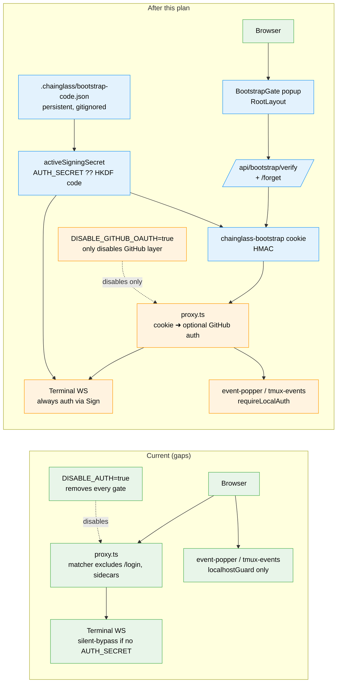
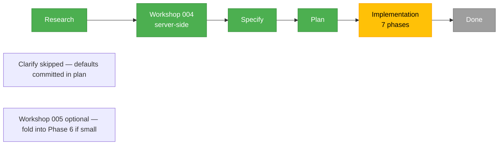

# Flight Plan: Always-On Bootstrap-Code Auth (with Optional GitHub OAuth)

**Spec**: [auth-bootstrap-code-spec.md](./auth-bootstrap-code-spec.md)
**Research**: [auth-bootstrap-code-research.md](./auth-bootstrap-code-research.md)
**Workshops**:
- [workshops/004-bootstrap-code-lifecycle-and-verification.md](./workshops/004-bootstrap-code-lifecycle-and-verification.md) — Storage Design + Integration Pattern (server-side story)
- _planned_: workshops/005-popup-ux-and-rootlayout-integration.md (Integration Pattern — popup wiring)

**Plan**: [auth-bootstrap-code-plan.md](./auth-bootstrap-code-plan.md)
**Generated**: 2026-04-30
**Status**: Ready

---

## The Mission

**What we're building**: A locally-generated bootstrap code, written to a known file at server boot, becomes the always-on outer gate for the web app. Every browser, every device, every fresh session must enter the code before any UI renders or data leaves the server. The code persists across server restarts (rotated by deleting the file). The same gate protects the terminal WS sidecar and other local sinks. GitHub OAuth becomes an optional inner second factor. Three concrete protection holes identified in research close as a side-effect: terminal-WS silent-bypass when `AUTH_SECRET` is unset, sidecar HTTP sinks accepting unauthenticated POSTs from any loopback caller, and `DISABLE_AUTH=true` removing every gate.

**Why it matters**: GitHub OAuth setup is a 10-minute speed-bump for new users and a hard blocker for anyone whose GitHub doesn't fit the allowlist model — for example, multi-account users, teams behind enterprise SSO, or a developer just wanting to try the tool. A locally-typed code lowers the barrier to first-run while *raising* the security floor by closing real holes. It also makes "I want to disable GitHub auth for local dev" a clean, supported configuration instead of a gun pointed at the foot.

---

## Where We Are → Where We're Headed

```
TODAY:                                                     AFTER this plan:

🔴 DISABLE_AUTH=true → entire app open                     🟢 Bootstrap-code popup blocks every page
🔴 Terminal WS, AUTH_SECRET unset → silent bypass          🟢 Terminal WS auth always on (HKDF fallback)
🔴 /api/event-popper, /api/tmux/events → localhostGuard    🟢 Composite cookie-or-X-Local-Token check
🟡 /login intentionally outside proxy matcher              🟢 RootLayout popup gates /login too
🟡 Bring up new instance → must configure GitHub OAuth     🟢 Boot → cat the file → enter code → done
🟡 GitHub OAuth required for any auth                      🟢 GitHub OAuth = optional inner second factor
🔵 Plan 067 localToken in .chainglass/server.json          🔵 (unchanged — CLI bearer)
🔵 Plan 064 token-exchange JWT pattern                     🔵 (unchanged — extended at the gate)
🔵 .chainglass/auth.yaml allowlist                         🔵 (unchanged — applies when GitHub on)
```

🔵 = unchanged   🟢 = working   🟡 = silent gap closed   🔴 = bug fixed



**Legend**: existing (green) | changed (orange) | new (blue)

---

## Scope

**Goals** (from spec):
- Default-deny on every page; popup blocks UI until code entered (including `/login`)
- One-prompt UX per browser; sticky across server restarts
- Saveable code via `.chainglass/bootstrap-code.json`
- Always-on terminal WS protection regardless of GitHub OAuth state
- Sidecar sinks gated (event-popper, tmux events)
- Optional GitHub OAuth, layered cleanly on top
- Discoverable rotation (delete file + restart)
- Fail-loudly on misconfiguration

**Non-Goals**:
- Multi-user identity model (defer to GitHub OAuth when wanted)
- Code TTL / time-based rotation
- WSS mandate when `TERMINAL_WS_HOST=0.0.0.0`
- Cross-machine code distribution
- CLI command to print the code (v2 candidate)
- Popup mobile-specific UX polish (workshop 005 territory)
- Settings-UI rotate command

---

## Journey Map



**Legend**: green = done | yellow = active | grey = not started

---

## Phases Overview

Mode: **Full** (CS-4). Plan committed defaults for the 8 spec-level open questions — see plan § "Pre-Plan Decisions".

| Phase | Title | Primary Domain | Tasks | Status |
|-------|-------|---------------|-------|--------|
| 1 | Shared primitives — types, generator, file IO, cookie sign/verify, `activeSigningSecret()` | `@chainglass/shared` | 7 | ✅ Done (46 tests pass) |
| 2 | Boot integration — `instrumentation.ts` writes file; misconfiguration assertion; `.gitignore` lines | `_platform/auth` | 4 | ✅ Done (60 tests pass; live `pnpm dev` matrix in operator runbook) |
| 3 | Server-side gate — verify/forget routes + proxy rewrite + RootLayout stub | `_platform/auth` | 7 | ✅ Done (60 tests pass; 1952/1952 regression sweep clean) |
| 4 | Terminal sidecar hardening — close silent-bypass; switch to `activeSigningSecret()`; JWT `iss`/`aud`/`cwd` | `terminal` | 6 | Pending |
| 5 | Sidecar HTTP-sink hardening + env-var rename — `requireLocalAuth(req)`; event-popper + tmux events; `DISABLE_GITHUB_OAUTH` alias | `_platform/events` (+ `_platform/auth`) | 7 | Pending |
| 6 | Popup component & RootLayout integration — replace stub with real BootstrapGate + popup UI | `_platform/auth` | 7 | ✅ Done (29 tests pass; 154/154 across full Plan 084 surface) |
| 7 | Operator docs, migration, end-to-end tests, harness exercise | `_platform/auth` (+ docs) | 9 | Pending |

Total: 47 tasks across 7 phases.

---

## Acceptance Criteria (high-level — see spec for the full 25)

- [ ] AC-1/2/3: Fresh-browser gate, correct-code unlock, sticky after unlock
- [ ] AC-7/8: Persistence across server restart; rotation invalidates cookies
- [ ] AC-10: `/login` also gated
- [ ] AC-11/12: GitHub OAuth optional (both modes work)
- [ ] AC-13/14/15: Terminal protection always on (with or without `AUTH_SECRET`)
- [ ] AC-16/17: Sidecar sinks gated; CLI continues to work
- [ ] AC-18/19: `/api/health` and `/api/auth/*` stay public
- [ ] AC-20: Boot fails fast on misconfiguration
- [ ] AC-21: `DISABLE_AUTH` deprecation alias works + warns
- [ ] AC-22: Code never appears in logs
- [ ] AC-25: Cookie is `HttpOnly`

(See [spec](./auth-bootstrap-code-spec.md#acceptance-criteria) for the complete numbered list.)

---

## Key Risks (high-level — see spec for the full table)

| Risk | Likelihood | Impact | Mitigation |
|------|-----------|--------|------------|
| Closing terminal-WS silent-bypass surprises operators | Medium | Medium | HKDF fallback so WS keeps working without `AUTH_SECRET`; release notes |
| Proxy rewrite locks operators out via off-by-one in bypass list | Medium | High | Test every excluded path; staged rollout |
| Next.js 16 RSC + HttpOnly + popup hydration subtleties | Medium | Medium | External research opportunity #1 in dossier; resolve in workshop 005 |
| 60-bit code + rate limit insufficient under attack | Low | High | External research opportunity #2; trivially upgradable to 80-bit |

---

## Open Questions — Resolved as Plan Defaults

(Clarify pass skipped per user direction; plan committed to defaults — see [plan § Pre-Plan Decisions](./auth-bootstrap-code-plan.md#pre-plan-decisions-skipped-clarify--defaults-committed).)

1. Workflow Mode → **Full**
2. Rate limit → **5/IP/60s leaky-bucket**
3. Code length → **12-char Crockford (60 bits)**
4. CLI `cg auth show-code` → **defer to v2**
5. Popup UX scope → **MVP** (no localStorage autofill in v1)
6. Forget endpoint discovery → **out-of-band only**
7. `DISABLE_AUTH` deprecation horizon → **one release with warning, remove next**
8. Harness coverage → **AC-1, AC-2, AC-13, AC-16 in Phase 7**

---

## Flight Log

<!-- Updated by /plan-3-v2-architect, /plan-5/6/7 after each phase completes -->

### 2026-04-30 — Specifying

Spec drafted from research dossier and workshop 004. Eight clarify questions queued. Workshop 005 (popup UX) recommended next; `/plan-3-v2-architect` will be enriched after clarify + workshop 005.

### 2026-04-30 — Plan ready (clarify skipped)

Plan-3 ran without a clarify pass per user direction. The 8 spec-level open questions were all parameter-tuning rather than foundational; plan committed defaults for each (see plan § Pre-Plan Decisions). 7 phases, 47 tasks total. Domain manifest covers ~17 new files + ~17 modified files. Constitution P1–P7 compliance reviewed — no deviations. Status promoted to **Ready**. Next: `/plan-4-v2-complete-the-plan` (fix all HIGH findings) → `/validate-v2`.

### 2026-04-30 — Phase 1 Landed (Shared Primitives)

All 7 tasks (T001–T007) implemented under TDD discipline. Public surface delivered: 14 names exported from `@chainglass/shared/auth-bootstrap-code` (types + Zod schema + Crockford generator + atomic-write persistence + HMAC cookie helpers + cwd-keyed `activeSigningSecret` with HKDF fallback + test-only cache-reset helper). Test coverage: **46 tests pass across 5 files** in 873ms. Constitution P1–P4, P7 satisfied. Plan key finding 01 (terminal-WS silent-bypass) is now structurally closed at the substrate level — `activeSigningSecret(cwd)` always returns a non-null Buffer. Validation fixes from `/validate-v2` baked in: `EnsureResult` exported (C-FC1), sync signature explicit (C-FC2), TSDoc cwd contract (C-FC3), `INVALID_FORMAT_SAMPLES: readonly` (C-FC4), EACCES propagation (C-Comp1), H6/C2 split (Cross-Ref H1), HMR test removed and replaced with cache-discipline test (Comp-H1), `afterEach` cleanup mandate (Comp-H2), 6-case enumeration parametric test (FC-H1), `@internal` JSDoc on test helper re-export (FC-H2). One CRITICAL validation finding (C-FC5 — export `BOOTSTRAP_CODE_ALPHABET`) was rejected in plan-4 and confirmed correct in implementation: T003 doesn't reference the alphabet; encapsulation by design. Next: `/plan-7-v2-code-review --phase "Phase 1: Shared Primitives" --plan ...`.

### 2026-05-02 — Phase 2 Landed (Boot Integration)

All 4 tasks (T001–T004) complete. T001 ships `apps/web/src/auth-bootstrap/boot.ts` (66 LOC) with `checkBootstrapMisconfiguration` (pure predicate; whitespace-only `AUTH_SECRET` rejected; case-sensitive literal `'true'` only disables; either-side-wins precedence) + `writeBootstrapCodeOnBoot` (idempotent wrapper around Phase 1's `ensureBootstrapCode`; never logs the code value). 14 tests pass in 7ms. T002 wires `apps/web/instrumentation.ts` with a third HMR-safe global flag (`__bootstrapCodeWritten`) — misconfig check + write live INSIDE the `NEXT_RUNTIME === 'nodejs'` branch (Edge runtime safe; `process.exit(1)` Node-only). Container guard preserved with explicit warn line. T003 adds two explicit `.gitignore` lines (`.chainglass/server.json`, `.chainglass/bootstrap-code.json`) at repo root; all 4 `git check-ignore -v` verifications pass; workflow-negation regression check intact. T004 captures pre-phase harness validation (✅ HEALTHY) + 60/60 regression sweep in 1.32s + working-tree audit; the live `pnpm dev` 8-step matrix is captured as an operator runbook in execution.log.md (deferred because user's harness was active). Constitution P1 (instrumentation → web helper → shared primitives = business → infrastructure) + P2 (interface-first via `MisconfigurationResult` discriminated union) + P3 (TDD on T001) + P4 (zero `vi.mock`) + P5 (1.32s test sweep) + P7 (web-only helper; shared primitives untouched) all satisfied. Companion code-review-companion (run `2026-05-02T12-27-45-639Z-92a4`) returned **APPROVE / 0 findings** for both T001 and T002. Next: `/plan-7-v2-code-review --phase "Phase 2: Boot Integration" --plan ...`.

### 2026-05-02 — Phase 3 Landed (Server-Side Gate)

All 7 tasks (T001–T007) complete. **Plan-level path collision fixed**: renamed `apps/web/src/lib/bootstrap.ts` → `bootstrap-code.ts` throughout the plan tree (existing DI/config bootstrap file at `bootstrap.ts:1-3`). T001 ships `apps/web/src/lib/bootstrap-code.ts` (~70 LOC) — async `getBootstrapCodeAndKey()` with module-level cache + `_resetForTests()` + JSDoc on cwd contract + cache lifecycle; 5/5 tests pass in 7ms. **Discovery D-T001-1**: `activeSigningSecret` returns raw `AUTH_SECRET` bytes when set, NOT a 32-byte HKDF; only the HKDF fallback is 32 bytes (HMAC keys are arbitrary length, so this is fine). T002 ships `POST /api/bootstrap/verify` (~155 LOC) — 5 status codes (200/400/401/429/503) with locked body shapes, leaky-bucket rate limit (5/60s, sweep on each call), constant-time compare via `timingSafeEqual` after equal-length check, cookie HttpOnly + SameSite=Lax + Path=/ + (Secure-prod) + **NO Max-Age** (session cookie); 14/14 tests pass in 23ms (parametric over `INVALID_FORMAT_SAMPLES`). 429 body shape locked at exactly `{ error, retryAfterMs }` via `Object.keys` assertion (Phase 6 contract guard). T003 ships `POST /api/bootstrap/forget` (~25 LOC) — always 200 + Max-Age=0; 3/3 tests in 6ms. T004 rewrites `apps/web/proxy.ts` + new pure helper `apps/web/src/lib/cookie-gate.ts` (`evaluateCookieGate(req, codeAndKey): GateDecision`); `AUTH_BYPASS_ROUTES` locked at exactly 4 (`/api/health`, `/api/auth`, `/api/bootstrap/verify`, `/api/bootstrap/forget`); page-fall-through (NOT redirect) for unauthed pages so RootLayout's `<BootstrapGate>` paints; 30/30 tests in 2ms including layering case (e1) where `/api/events` with valid cookie falls through to `auth()` chain. T005 ships `BootstrapPopup` (`'use client'`, named export `BootstrapPopupProps` locked for Phase 6, `<dialog role="dialog" aria-modal="true">` overlay) + `BootstrapGate` (server component reading `cookies()` from `next/headers`, swallows errors → `bootstrapVerified=false` rather than crashing layout). 4/4 helper tests in 1ms. T006 wires `<BootstrapGate>` between `<Providers>` and `{children}` in `apps/web/app/layout.tsx`. T007 ships `test/helpers/auth-bootstrap-code.ts` (NEW — `setupBootstrapTestEnv` cross-phase helper for Phase 6 reuse) + integration test (~190 LOC, 7 cases including code-rotation invalidates-old-cookie scenario). 7/7 in 18ms. **Total Phase 3: 60 tests across unit + integration**. Full regression sweep: 1952/1952 across web + shared in 99s; zero typecheck regressions in Phase 3 files (pre-existing errors in unrelated files only). Constitution P1–P5, P7 all satisfied. Domain.md updated: 1 History row, 6 Composition rows for new files, Source Location entries, 5 new Concepts (Verify the bootstrap code, Forget the verification, Gate the application shell, Read the active code + key, Decide proxy routing). 18 validation fixes from `/validate-v2` baked in (4 CRITICAL + 11 HIGH + LOW AC-3). Next: `/plan-7-v2-code-review --phase "Phase 3: Server-Side Gate (Verify/Forget + Proxy + RootLayout Stub)" --plan ...`.

### 2026-05-02 — Phase 6 Landed (Popup Component)

All 7 tasks complete (T001+T001-test+T002+T003+T004+T005+T006; T007 skipped per plan default). T001 replaces Phase 3's text-only stub at `apps/web/src/features/063-login/components/bootstrap-popup.tsx` (78 → 222 LOC) with the real popup UX: Radix `DialogPrimitive` (Title/Description/Content/Overlay/Portal — NOT shadcn `<Dialog>` because the close button is incompatible with non-dismissable), paste-safe Crockford autoformat (strip-then-reinsert handles formatted + unformatted both), 6 visually-distinct error states (`invalid-format` + `wrong-code` + `rate-limited` with **live ticking countdown derived from 429 body's `retryAfterMs`** + `unavailable` + `network` + idle), `credentials='same-origin'` fetch to `/api/bootstrap/verify`, success-path `router.refresh()` with **submit stays disabled across the refresh window** (defensive against rapid double-click), focus-trapped non-dismissable (Radix `onEscapeKeyDown`/`onPointerDownOutside`/`onInteractOutside` all `preventDefault`; no `<DialogPrimitive.Close>` rendered), mobile-safe Tailwind (`min-h-[100dvh]` overlay, `pb-[max(1.5rem,env(safe-area-inset-bottom))]` content, `min-h-[44px]` 44×44 touch target, `text-lg` input), input value retained on every error path (UX), zero `console.*` logging of typed code (compliance with plan default 8 + Phase 7 task 7.10 AC-22 grep audit obligation; verified by RTL test #18 with `vi.spyOn(console, '*')`). T001-test ships 18 RTL cases at `test/unit/web/features/063-login/bootstrap-popup.test.tsx` (path corrected during validation — vitest's glob is `test/**/*.test.tsx`, NOT `apps/web/src/**`). T002 verifies the existing `BootstrapGate` continues to gate correctly (read-only); 4/4 Phase 3 gate tests still pass. T003 a11y guarantees baked into T001 — switched to `<DialogPrimitive.Title>` + `<DialogPrimitive.Description>` (silenced Radix's stderr warning about missing DialogTitle); `aria-describedby="bootstrap-error"` toggled dynamically (omitted when no error); error region has `role="alert"` + `aria-live="assertive"`. T004 ships mobile-safe Tailwind classes; **screenshot evidence deferred** to user pre-PR smoke per `evidence/README.md` rubric — harness app at port 3107 was 500 at impl time. T005 ships `test/integration/web/auth-bootstrap-code.popup.integration.test.tsx` (.tsx because JSX) — 7 scenarios pass in 245ms via real `verifyPOST` route handler in-process: happy / wrong-code / format-client-reject / format-server-defence-in-depth / rate-limited (6 wrong → real route 429 → popup countdown) / 503 (chmod read-only) / smoke. **Defence-in-depth scenario (3b)** proves the server is honest under hostile-client conditions — direct `verifyPOST` call with malformed body returns 400 + `{ error: 'invalid-format' }` regardless of any client-side check. T006 updates `_platform/auth/domain.md` — Phase 6 History row + "Gate the application shell" concept narrative refresh + Composition row for `bootstrap-popup.tsx` (was "stub" → real). **4 stable `data-testid` selectors committed forward to Phase 7** (`bootstrap-popup`, `bootstrap-code-input`, `bootstrap-code-submit`, `bootstrap-code-error`) for harness e2e selector stability. **Total Phase 6: 25 new tests (18 RTL unit + 7 integration); 154/154 across full Plan 084 surface in 6.30s**. Constitution P1–P5, P7 satisfied; `vi.mock('next/navigation', ...)` and `vi.spyOn(globalThis.fetch + console.*)` documented as sanctioned exceptions per existing repo precedent. Companion notified at task boundaries; no findings flagged. Phase 7 forward markers: AC-22 popup-side closed; popup gates all routes including `/login` (AC-10 real); deterministic-`seedCode` extension to `setupBootstrapTestEnv` deferred to Phase 7 task 7.10. Phase 4 + Phase 5 still pending — Phase 6 only depended on Phase 3, so they sit in parallel. **The user is now unblocked: typing the bootstrap code from `.chainglass/bootstrap-code.json` into the popup unlocks the workspace in-browser, no curl required.** Next: `/plan-7-v2-code-review --phase "Phase 6: Popup Component & RootLayout Integration" --plan ...`.

### 2026-05-03 — FX003 Landed (Bootstrap-code workspace-root walk-up)

Closes the Phase 6 dev-smoke gotcha where `pnpm dev` via turbo runs Next at `cwd=apps/web/`, landing the active `.chainglass/bootstrap-code.json` under `apps/web/` instead of the workspace root the popup mentions. Fix ships an additive `findWorkspaceRoot(startDir): string` helper in `@chainglass/shared/auth-bootstrap-code` (walks up looking for `pnpm-workspace.yaml` → `package.json` with non-empty `workspaces` → `.git/`, falling back to the normalized startDir; pure stdlib; per-process `Map<string, string>` cache keyed by `path.resolve`-normalized startDir; `_resetWorkspaceRootCacheForTests()` test-only helper). Two `process.cwd()` callsites swapped: `apps/web/instrumentation.ts:51` boot block (wrapped in try/catch with `process.cwd()` fallback per R5 — boot is no worse than today even if the helper throws on a malformed parent-dir `package.json`) and `apps/web/src/lib/bootstrap-code.ts:85` request-time accessor. **Implementation Requirements R1–R7 from the validate-v2 pass on the FX003 dossier all enforced**: R1 cache key normalized via `path.resolve`; R2 try/catch around fs reads + `JSON.parse`; R3 `workspaces` truthy = non-empty array OR object with non-empty `packages`; R4 cross-platform termination via `path.parse(start).root`; R5 boot try/catch envelope; R6 Phase 4 sidecar adoption checklist forward-marked in domain.md History; R7 client-side boundary documented (helper imports `node:fs` so the deferred popup-string fast-follow MUST route through a server boundary, not direct client import). 8 unit tests for the helper (5 from the original dossier + 3 added by validate-v2 for cache-key normalization, mkTempCwd backcompat, malformed `package.json` continue-walk) all pass in 7ms. Full Plan 084 sweep: 144 tests across 13 directly-relevant files all GREEN (the dossier's 162 estimate over-counted some files; actual is 136 prior + 8 new = 144). 4 doc locations flipped from "GOTCHA" to "Resolved by FX003" pointers (JSDoc, troubleshooting runbook, domain.md Concept narrative, Phase 6 dossier Discoveries) plus a new domain.md History row for `_platform/auth`. Operator-side note: user requested that the workspace-root `.chainglass/bootstrap-code.json` carry the same `6A3J-DJ8A-YCK3` code they had memorized from `apps/web/.chainglass/`; file written, but the dev server's module-level cache (`bootstrap-code.ts:36`) means a server restart is required before the popup accepts the new code. Phase 4 + Phase 5 + Phase 7 still pending — FX003 doesn't depend on them and they don't depend on FX003 (the helper is consumed by Phase 4 sidecar when it lands; the forward-marker is in place).
