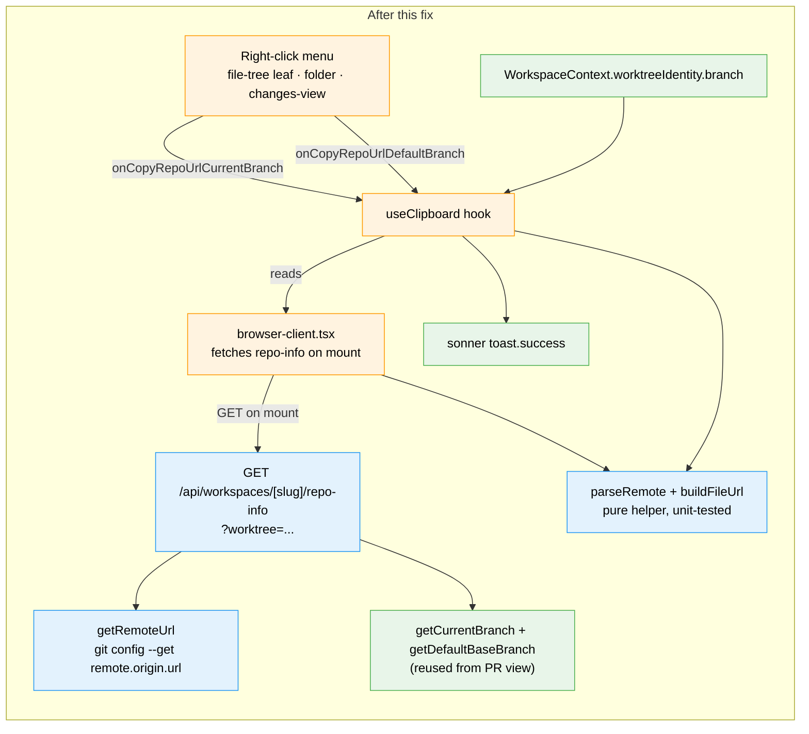
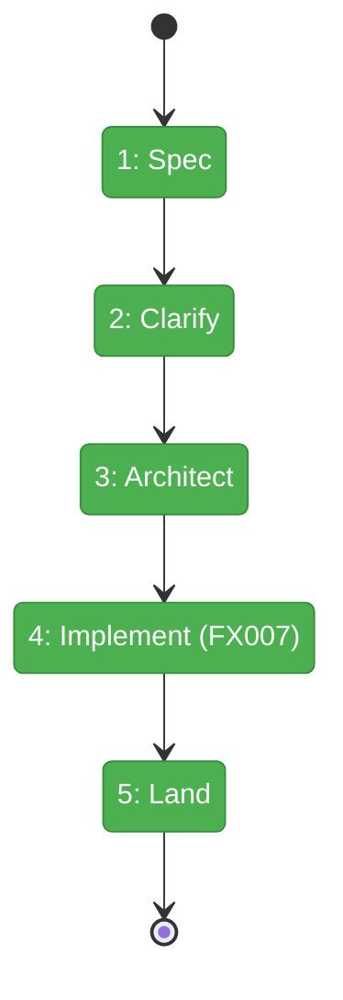

# Flight Plan: Copy Repo URL from Right-Click Menu

**Spec**: [copy-repo-url-spec.md](./copy-repo-url-spec.md)
**Research**: [copy-repo-url-research.md](./copy-repo-url-research.md)
**Plan**: [copy-repo-url-plan.md](./copy-repo-url-plan.md)
**Generated**: 2026-05-09
**Status**: LANDED (Mode: Simple, FX007, CS-3, 8 tasks, 21 ACs, all tests green) — implementation complete 2026-05-09

---

## The Mission

**What we're building**: Two new right-click menu items in the file browser — **Copy URL (this branch)** and **Copy URL (default branch)** — that put a clickable web URL to the file on the user's clipboard. The URL adapts to the host: GitHub remotes produce `/blob/<branch>/<path>` URLs; Azure DevOps remotes produce `?path=/<path>&version=GB<branch>` URLs. Both `https` and `ssh` remote forms are accepted; both produce `https` URLs.

**Why it matters**: Copy Full Path and Copy Relative Path produce strings only the user can resolve. A web URL pastes cleanly into a PR description, a Slack message, or a code-review comment and resolves for anyone with repo access. It closes a small but constant friction point in collaborative workflows.

---

## Where We Are → Where We're Headed

```
TODAY:                                          AFTER this fix:
─────────────────────────────────────────       ─────────────────────────────────────────
Right-click menu has:                           Right-click menu adds:
  • Copy Full Path                              + Copy URL (this branch)
  • Copy Relative Path                          + Copy URL (default branch)
  • Copy Tree From Here                         (existing items unchanged)
  • Copy Content (changes view only)
  • Download (changes view only)
  • Add Note / Rename / Delete

git remote URL is not exposed anywhere          Small server util reads
  in the codebase                                 `git config --get remote.origin.url`
                                                  via the same execFile pattern as
                                                  git-branch-service.ts

Branch info already lives on                    Reused as-is:
  WorkspaceContext.worktreeIdentity.branch        - current branch from context
  getDefaultBaseBranch (PR view, plan 071)        - default branch via the existing util

Domains touched: 1 modified (file-browser); 0 new; 0 consumed
```

---

## Architecture: Before & After



**Legend**: green = existing/unchanged | orange = touched | blue = new

---

## Flight Status



**Legend**: grey = pending | yellow = active | red = blocked/needs input | green = done

---

## Stages

- [x] **Stage 1: Spec** — `copy-repo-url-spec.md` written.
- [x] **Stage 2: Clarify** — 8 questions resolved 2026-05-09. Key decision: lift git utils to `_platform/git` sub-domain (scope expanded to CS-3, adds PR-view import refactor).
- [x] **Stage 3: Architect** — `/plan-3-v2-architect` produces fix dossier with 5 task groups (per § Phases in spec). Validated 2026-05-09 (CRITICAL+HIGH fixes applied).
- [x] **Stage 4: Implement (FX007)** — `_platform/git` sub-domain + URL builder (TDD) + `getRemoteUrl` util + PR-view import refactor + repo-info API route + `useClipboard` extension + menu items at 3 render sites. 8/8 tasks complete.
- [x] **Stage 5: Land** — domain.md history updated for `_platform/git`, `file-browser`, `pr-view`; registry + domain-map updated. 8 commits on branch.

---

## Acceptance Criteria (preview from spec)

- [ ] GitHub HTTPS and SSH remotes both produce correct `/blob/<branch>/<path>` URLs.
- [ ] Azure DevOps HTTPS and SSH remotes both produce correct `?path=/<path>&version=GB<branch>` URLs.
- [ ] Both menu items appear in all three context-menu sites (file-tree leaf, folder, changes view).
- [ ] Items are hidden when no `origin` remote is configured or the host is unknown.
- [ ] Default-branch detection falls back to `main` when `origin/HEAD` isn't set (matches existing contract).
- [ ] New endpoint is auth-gated and validates the `worktree` query param against known worktrees.
- [ ] Existing menu items (Copy Full Path, Copy Relative Path, Copy Tree, Copy Content, Download, Add Note, Rename, Delete) are unchanged.

---

## Goals & Non-Goals

**Goals**
- Two new menu items per render site, host-adaptive, branch-aware.
- Reuse existing branch-detection and clipboard plumbing.
- Pure URL builder is the only piece warranting full TDD.

**Non-Goals**
- Hosts other than GitHub and Azure DevOps (helper designed for future extension).
- Line-range deep links, commit-pinned URLs, URL preview, keyboard shortcut, history list.
- Windows server support.

---

## Resolved Decisions (clarify session 2026-05-09)

- **Mode**: Simple / Fix → **FX007**.
- **Testing**: Hybrid — TDD on URL builder, lightweight elsewhere.
- **Mocks**: Targeted on git CLI only.
- **Docs**: None beyond domain.md History entries.
- **Helper placement**: **Lift to `_platform/git` sub-domain** (the scope-expanding decision — adds new sub-domain + PR-view import refactor, pushes complexity to CS-3).
- **Detached HEAD**: Switch "this branch" item → "Copy URL (this commit)" using SHA (`/blob/<sha>/...` GitHub, `?path=/...&version=GC<sha>` ADO).
- **Menu UX**: Flat items, "Copy URL (this branch)" + "Copy URL (default branch)".
- **No remote / unknown host**: Hide both URL items entirely.

### Carried-forward (not asked)

- Same-branch dedup → show both.
- Toast wording → generic "URL copied".
- Legacy ADO `<org>.visualstudio.com` → out of scope.
