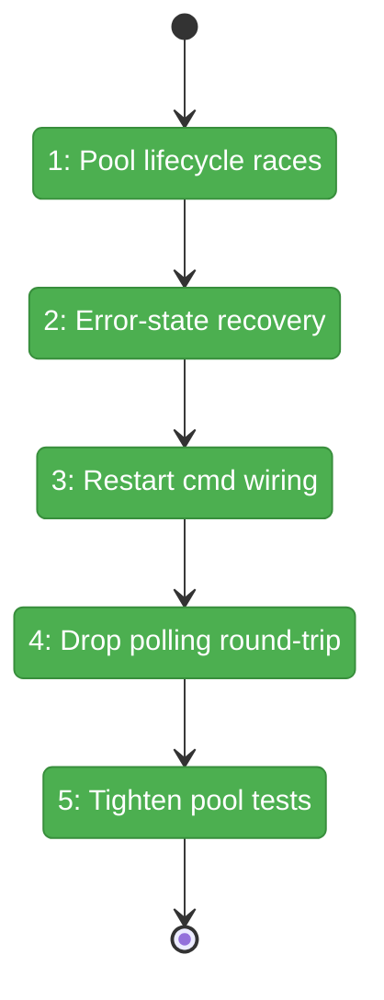

# Flight Plan: Fix FX001 — FlowSpace MCP Review Fixes

**Fix**: [FX001-flowspace-mcp-review-fixes.md](./FX001-flowspace-mcp-review-fixes.md)
**Plan**: [../flowspace-mcp-search-plan.md](../flowspace-mcp-search-plan.md)
**Generated**: 2026-04-26
**Status**: Landed

---

## What → Why

**Problem**: The just-landed Plan 084 has 7 Critical/High bugs surfaced by code review — pool lifecycle races (`maybeRecycle` vs `transport.onclose`, idle reaper vs in-flight searches), permanent error-state poisoning, a `> Restart FlowSpace` SDK command that's a silent no-op (reads a URL param that isn't on dashboard URLs), 1–2 s of unnecessary polling latency on cold start, and pool tests that don't actually catch the dedup regression they're supposed to.

**Fix**: Five tightly-themed tasks against the modules touched in Plan 084 — no contract changes, no new domains. Make the lifecycle race-free, recover from spawn errors automatically, wire the SDK command properly, drop the polling round-trip when spawning, and tighten the test suite to actually exercise the invariants it claims.

---

## Domain Context

| Domain | Relationship | What Changes |
|--------|-------------|--------------|
| `_platform/panel-layout`-adjacent (`apps/web/src/lib/server/`) | modify | `flowspace-mcp-client.ts`: lifecycle race fixes; `flowspace-search-action.ts`: error-state recovery + drop polling round-trip on spawning |
| `file-browser` | modify | `browser-client.tsx`: register Restart FlowSpace command via `useEffect` with live worktreePath; `sdk/register.ts`: simplify or remove the URL-reading variant |
| **tests** | extend | Pool semantics test gets a delay-injecting transport + 3 new cases (recycle, crash, reap) |

No domain contracts change. The `flowspaceSearch` discriminated union return type is preserved.

---

## Flight Status

<!-- Updated by /plan-6-v2: pending → active → done. Use blocked for problems/input needed. -->

**Legend**: grey = pending | yellow = active | red = blocked/needs input | green = done

---

## Stages

<!-- Updated by /plan-6-v2 during implementation: [ ] → [~] → [x] -->

- [x] **Stage 1: Make pool lifecycle race-free** — `maybeRecycle` explicit `pool.delete`; `inflight` increment moved synchronously inside `flowspaceMcpSearch` after `getOrSpawn`; `transport.onerror` wired alongside `onclose`; retry loop bounded at 2 attempts (`flowspace-mcp-client.ts`)
- [x] **Stage 2: Recover from spawn errors** — server action treats `error` like `idle` and respawns (`flowspace-search-action.ts`)
- [x] **Stage 3: Wire `> Restart FlowSpace` properly** — registered in `browser-client.tsx` via `useEffect` closure over `worktreePath`; URL-sniffing variant in `sdk/register.ts` removed
- [x] **Stage 4: Drop polling round-trip when spawning** — server action falls through to `flowspaceMcpSearch` whose internal `getOrSpawn` already awaits `proc.ready` (kept the `idle` short-circuit so the loading message appears immediately)
- [x] **Stage 5: Tighten pool tests** — added `setReadGraphMtimeForTests` and `runIdleReaperOnce` test seams; 4 new tests (mtime recycle, `transport.onclose` crash, idle reap, slow-connect dedup regression guard) — 8 pool tests total, all green

---

## Acceptance

- [x] **AC-FX-1**: Cold-call latency drops to `spawn-time + ~100 ms` (was `spawn-time + ~1 s`).
- [x] **AC-FX-2**: Transient spawn failures self-recover on the next user keystroke.
- [x] **AC-FX-3**: `> Restart FlowSpace` actually shuts down the active worktree's process (logged).
- [x] **AC-FX-4**: Idle reaper does not kill in-flight searches.
- [x] **AC-FX-5**: Dedup invariant has a real regression guard (slow-connect test).
- [x] **AC-FX-6**: New unit cases for recycle / crash / reap all pass.
- [~] **AC-FX-7**: Mid-search crash mapping deferred to FX002 if real-world behaviour proves it.

---

## Out of Scope (deferred to FX002 if needed)

Medium/Low/Nit review findings: `mapMcpError` cache invalidation scope, `fetchInProgressRef` query-drop, sequential stale-file filter, `checkFlowspaceAvailability` HMR cache, `__clearFlowspacePool` close ordering, duplicate log helpers, mode-mapping type narrowing, spawn-error log elapsed-time consistency.
