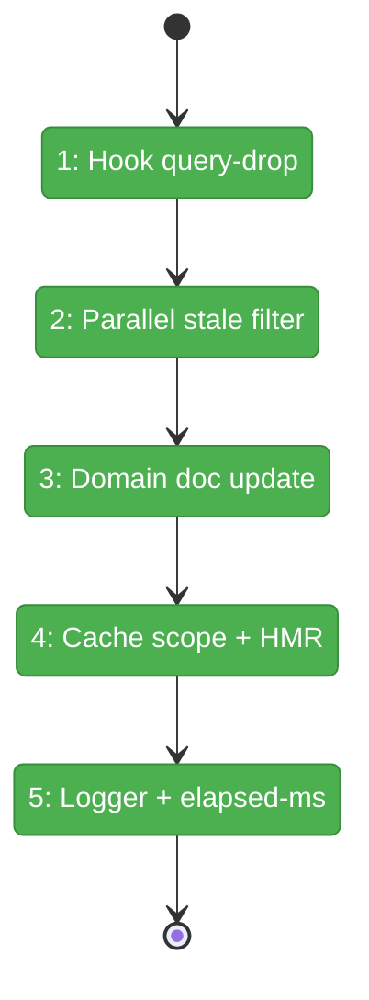

# Flight Plan: Fix FX002 — FlowSpace MCP Polish

**Fix**: [FX002-flowspace-mcp-polish.md](./FX002-flowspace-mcp-polish.md)
**Plan**: [../flowspace-mcp-search-plan.md](../flowspace-mcp-search-plan.md)
**Generated**: 2026-04-26
**Status**: Landed

---

## What → Why

**Problem**: FX001 fixed the seven Critical/High items; minih's re-review then APPROVE'd it but flagged 2 Medium + 1 Low follow-ups (hook query-drop edge case, sequential stale-file I/O, domain Source Location gap). FX001 also explicitly listed three more Medium/Nit items as deferred-to-FX002.

**Fix**: Four tasks, no contract changes. Drop the redundant `fetchInProgressRef` guard in the hook (epoch counter is sufficient); parallelise the stale-file filter with `Promise.allSettled`; update `docs/domains/file-browser/domain.md` Source Location; bundle small wins (mapMcpError ENOENT scope, HMR-pin availability cache, dedup log helper, spawn-error elapsed-ms log).

---

## Domain Context

| Domain | Relationship | What Changes |
|--------|-------------|--------------|
| `file-browser` | modify | `useFlowspaceSearch` hook simplified (epoch-only cancellation); domain.md Source Location updated to list FlowSpace files |
| `_platform/panel-layout`-adjacent (`apps/web/src/lib/server/`) | modify | `flowspace-search-action.ts` parallel stale-file filter + `mapMcpError` ENOENT scope fix + `globalThis` availability cache; `flowspace-mcp-client.ts` shared log helper + spawn-error elapsed-ms; new `flowspace-log.ts` (5-line shared module) |
| **tests** | extend | One new hook unit test for rapid query changes (regression guard for F001) |

No domain contracts change. No effect on the discriminated union, the `> Restart FlowSpace` SDK command, or any test seam exports.

---

## Flight Status

<!-- Updated by /plan-6-v2: pending → active → done. Use blocked for problems/input needed. -->

**Legend**: grey = pending | yellow = active | red = blocked/needs input | green = done

---

## Stages

<!-- Updated by /plan-6-v2 during implementation: [ ] → [~] → [x] -->

- [x] **Stage 1: Drop `fetchInProgressRef` guard in `useFlowspaceSearch`** — hook-side epoch + server-side `getOrSpawn` sync prefix together cover supersedence; new hook regression test added (F001) (`use-flowspace-search.ts`)
- [x] **Stage 2: Parallelise stale-file filter** — replace sequential `for await access` with `Promise.allSettled` (order-preserved) so search latency scales with slowest stat (F002) (`flowspace-search-action.ts`)
- [x] **Stage 3: Update domain doc Source Location** — list all 5 FlowSpace files by name with role descriptions (F003) (`docs/domains/file-browser/domain.md`)
- [x] **Stage 4: Cache scope + HMR pin** — scope `mapMcpError` ENOENT to spawn path; pin `fs2AvailableCache` to `globalThis`; extend `FakeServerHandle` so AC-FX02-4a is testable (`flowspace-search-action.ts`, `flowspace-mcp-client.ts`, `flowspace-mcp-client.test.ts`)
- [x] **Stage 5: Shared logger + elapsed-ms log** — extract `flowspace-log.ts` (named `LOG_PREFIX`, `log`); both consumers import; spawn-error log includes `ms` (NEW `flowspace-log.ts`, `flowspace-mcp-client.ts`, `flowspace-search-action.ts`)

---

## Acceptance

- [x] **AC-FX02-1**: Rapid query change during a poll supersedes the prior run; new hook regression test passes.
- [x] **AC-FX02-2**: Parallel stale-file filter — order preserved; latency scales with slowest stat.
- [x] **AC-FX02-3**: Domain doc Source Location names all 5 FlowSpace files with roles (verified by reading, not grep).
- [x] **AC-FX02-4a**: Search-time ENOENT no longer invalidates availability cache (action-level test).
- [x] **AC-FX02-4b**: Spawn-time ENOENT still detected and cache invalidated (transport-factory stub test).
- [x] **AC-FX02-4c**: Availability cache survives HMR via `globalThis`.
- [x] **AC-FX02-5a**: Single shared `log`/`LOG_PREFIX` from `flowspace-log.ts`; no duplicates.
- [x] **AC-FX02-5b**: `[flowspace-mcp] spawn error` log includes `ms` field.
- [x] **AC-FX02-6**: Repo-wide tests pass (≥3 new tests added); lint + typecheck clean.

---

## Out of Scope (deferred to FX003 if needed)

- AC-FX-7 (mid-search crash → mappable user-friendly error message). Structural fix in place; only the wording lacks polish. Promote only if real-world telemetry shows raw fragments.
- `mode === 'semantic' ? 'semantic' : 'auto'` type narrowing at the MCP-client boundary (cosmetic).
- `__clearFlowspacePool` close-ordering nit (current test patterns are correct).
