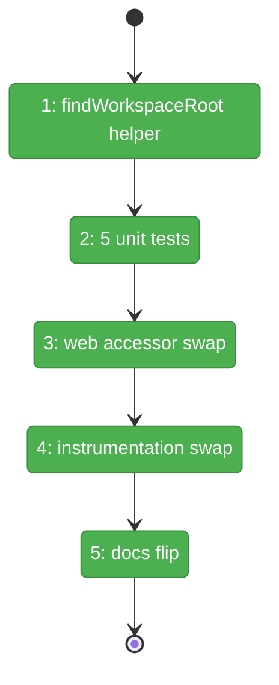
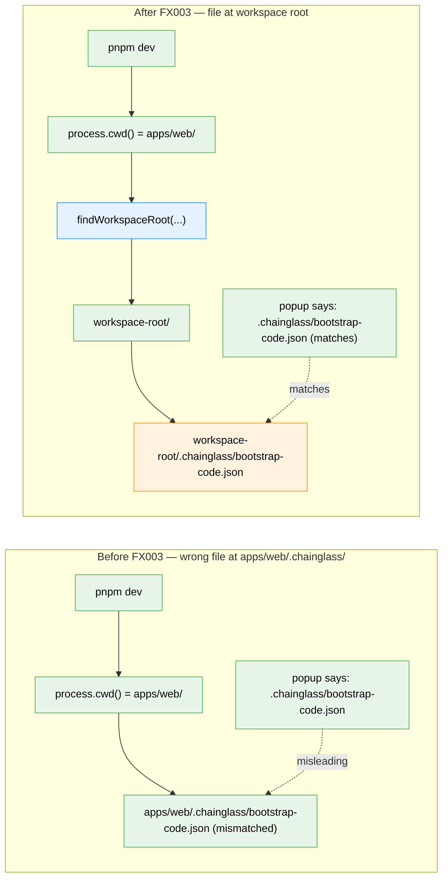

# Flight Plan: Fix FX003 — Bootstrap-code workspace-root walk-up

**Fix**: [FX003-bootstrap-code-workspace-root-walkup.md](./FX003-bootstrap-code-workspace-root-walkup.md)
**Plan**: [auth-bootstrap-code-plan.md](../auth-bootstrap-code-plan.md)
**Generated**: 2026-05-03
**Status**: Landed (2026-05-03)

---

## What → Why

**Problem**: `pnpm dev` runs Next at `cwd=apps/web/`, so `getBootstrapCodeAndKey()` and the Phase 2 boot block resolve the active bootstrap-code file at `apps/web/.chainglass/bootstrap-code.json` — a different file from the workspace-root one the popup tells operators to read.

**Fix**: Add an additive `findWorkspaceRoot(startDir): string` helper to `@chainglass/shared/auth-bootstrap-code` (walks up looking for `pnpm-workspace.yaml` / `package.json` `workspaces` / `.git/`); swap two `process.cwd()` callsites in `apps/web/` to call through the helper; flip 4 doc locations from "GOTCHA" to "RESOLVED BY FX003".

---

## Domain Context

| Domain | Relationship | What Changes |
|--------|-------------|-------------|
| `@chainglass/shared` (auth-bootstrap-code) | **modify (additive contract)** | New `workspace-root.ts` helper; barrel re-exports |
| `_platform/auth` | **modify (call-site swap)** | Two `process.cwd()` callsites → `findWorkspaceRoot(process.cwd())` |
| `terminal` (future) | consume | Phase 4 sidecar adopts the same helper when it lands; not in this fix's scope |

---

## Flight Status

**Legend**: grey = pending | yellow = active | red = blocked/needs input | green = done

---

## Stages

- [x] **Stage 1: Implement `findWorkspaceRoot(startDir)`** — `packages/shared/src/auth-bootstrap-code/workspace-root.ts` (new file). Walk-up loop checking `pnpm-workspace.yaml` → `package.json` workspaces → `.git/`. Per-process cache + `_resetWorkspaceRootCacheForTests()`. Barrel re-export.
- [x] **Stage 2: 8 unit tests for the helper** — `test/unit/shared/auth-bootstrap-code/workspace-root.test.ts` (new). pnpm-workspace priority / package.json workspaces / .git fallback / no-marker fallback / cache discipline / mkTempCwd backcompat / cache-key normalization / malformed package.json continue-walk.
- [x] **Stage 3: Switch `getBootstrapCodeAndKey()` to walk-up** — `apps/web/src/lib/bootstrap-code.ts`: `process.cwd()` → `findWorkspaceRoot(process.cwd())`; flip JSDoc "KNOWN GOTCHA" → "RESOLVED BY FX003".
- [x] **Stage 4: Switch instrumentation boot block to walk-up** — `apps/web/instrumentation.ts:51` callsite + import + try/catch envelope (R5).
- [x] **Stage 5: Flip 4 doc locations + add domain.md History row** — troubleshooting doc, domain.md Concept narrative, domain.md History, Phase 6 dossier Discoveries (resolution row).

---

## Architecture: Before & After

**Legend**: existing (green) | changed (orange, file location moved) | new (blue, helper added)

---

## Acceptance

- [ ] `findWorkspaceRoot(startDir): string` exists, exported from `@chainglass/shared/auth-bootstrap-code` barrel, cached (key normalized via `path.resolve`), with `_resetWorkspaceRootCacheForTests()`
- [ ] Implementation Requirements R1–R7 (in FX003 dossier) all satisfied
- [ ] 8/8 unit tests for the helper pass (added cases for tmpdir fallback, cache-key normalization, malformed package.json continue-walk)
- [ ] `getBootstrapCodeAndKey()` uses the walk-up
- [ ] `instrumentation.ts` boot block uses the walk-up wrapped in try/catch with `process.cwd()` fallback
- [ ] Existing Phase 3 + Phase 6 tests still pass (34 directly-affected + the rest of 154/154 sweep — target **162/162 with the 8 new helper cases**)
- [ ] Manual smoke from a fresh `pnpm dev` boot: only one `bootstrap-code.json` exists, at workspace root
- [ ] Manual smoke from the popup: typing the workspace-root code unlocks the workspace
- [ ] 4 doc locations updated (JSDoc, troubleshooting runbook, domain.md Concept, Phase 6 Discoveries)
- [ ] domain.md § History gains FX003 row

## Goals & Non-Goals

**Goals**:
- Single canonical `.chainglass/` location regardless of `process.cwd()`
- Phase 4 sidecar inherits the helper when it lands (forward-marker, not implemented here)
- All four documentation locations consistent ("RESOLVED BY FX003")
- Backwards-compatible: callers passing explicit `cwd` to shared primitives are unaffected

**Non-Goals**:
- Threading the resolved absolute path to the popup string (separate debt row in Phase 6 Discoveries; future polish if surfaced again)
- Migrating Phase 4 terminal-WS sidecar's cwd resolution (Phase 4 itself is not landed; the sidecar adopts the helper when Phase 4 ships)
- Watching `bootstrap-code.json` for in-process rotation (out of scope — process restart is the rotation mechanism per design)
- Modifying shared `ensureBootstrapCode` / `activeSigningSecret` signatures (additive only — they keep accepting an explicit `cwd`)

---

## Checklist

- [x] FX003-1: Implement `findWorkspaceRoot()` helper in `packages/shared/src/auth-bootstrap-code/workspace-root.ts`; barrel re-export
- [x] FX003-1-test: 8 unit tests at `test/unit/shared/auth-bootstrap-code/workspace-root.test.ts`
- [x] FX003-2: `apps/web/src/lib/bootstrap-code.ts` accessor uses walk-up; JSDoc "GOTCHA" → "RESOLVED BY FX003"
- [x] FX003-3: `apps/web/instrumentation.ts` boot block uses walk-up + try/catch envelope
- [x] FX003-4: 4 doc locations flipped + domain.md History row added
