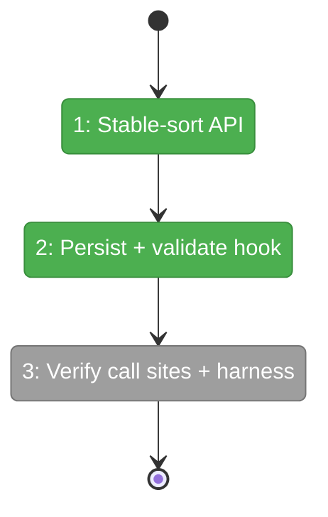
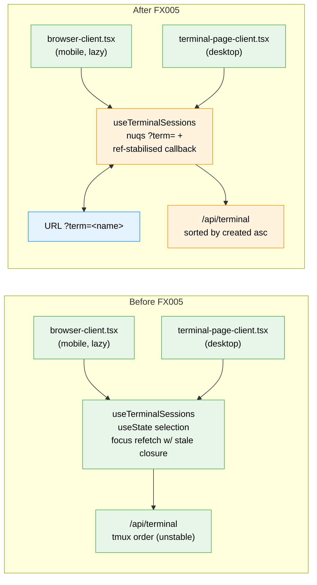

# Flight Plan: Fix FX005 — Mobile terminal picks wrong tmux session after sleep/wake

**Fix**: [FX005-mobile-terminal-session-selection.md](./FX005-mobile-terminal-session-selection.md)
**Status**: Ready for takeoff

---

## What → Why

**Problem**: Mobile Terminal tab is `lazy: true`; on browser sleep/wake the rehydrated mount re-runs `useTerminalSessions`'s auto-pick (`enriched[0]`) against an unstably-ordered `/api/terminal` response, picking a different session than the user had selected. Compounded by a stale closure on the `window.focus` listener (`selectedSession` is in `fetchSessions` deps).

**Fix**: Persist `selectedSession` in a URL param via `nuqs`, validate it against the live session list on every refetch (keep if still present, fall back only if gone), stable-sort the API response, and read the stored name through a ref so the focus listener is not dependency-coupled to selection state.

---

## Domain Context

| Domain | Relationship | What Changes |
|--------|-------------|-------------|
| `terminal` | modify (internal) | Hook gains URL-backed state + ref-stabilised callback. API route sorts by `created` asc. No contract change. |

---

## Flight Status

**Legend**: grey = pending | yellow = active | red = blocked/needs input | green = done

---

## Stages

- [x] **Stage 1: Stable-sort API response** — sort `tmux list-sessions` output by `created` ascending in the `/api/terminal` route handler (`app/api/terminal/route.ts`). Add unit test for ordering.
- [x] **Stage 2: Persist selection + drop stale closure** — back `selectedSession` with `nuqs` `?term=<name>`, mirror it through a ref so `fetchSessions` doesn't depend on it, validate on every refetch, only fall back when the stored session is gone (`hooks/use-terminal-sessions.ts`). Add 4 regression tests.
- [ ] **Stage 3: Verify both call sites + harness** — confirm mobile + desktop inherit selection without extra wiring; add a "wake-from-sleep persists session" assertion to `harness/agents/mobile-ux-audit/prompt.md` Section 5.

---

## Architecture: Before & After

**Legend**: existing (green, unchanged) | changed (orange, modified) | new (blue, created)

---

## Acceptance

- [ ] Mobile sleep/wake preserves the selected session.
- [ ] Mobile selection survives a hard refresh (URL-backed).
- [ ] If the stored session is killed externally, hook falls back gracefully and updates the URL.
- [ ] Desktop deep-link `/workspaces/<slug>/terminal?term=foo` mounts with `foo` selected.
- [ ] `/api/terminal` ordering is deterministic across consecutive calls.
- [ ] 4 new hook regression tests + 1 API ordering test pass.

## Goals & Non-Goals

**Goals**:
- Stop picking the wrong tmux session on mobile after sleep/wake.
- Make the choice shareable via URL.
- Eliminate the stale-closure footgun on the focus listener.

**Non-Goals**:
- Persisting non-selection state (scrollback, sub-window, etc.).
- Adding a UI affordance for picking sessions on mobile (current strip is fine).
- Touching xterm.js or the WebSocket bridge.

---

## Checklist

- [x] FX005-1: Stable-sort `/api/terminal` response by `created` ascending.
- [x] FX005-2: URL-persist `selectedSession` via `nuqs`, validate on refetch, stabilise callback.
- [ ] FX005-3: Verify both call sites inherit; update mobile-ux-audit prompt.
