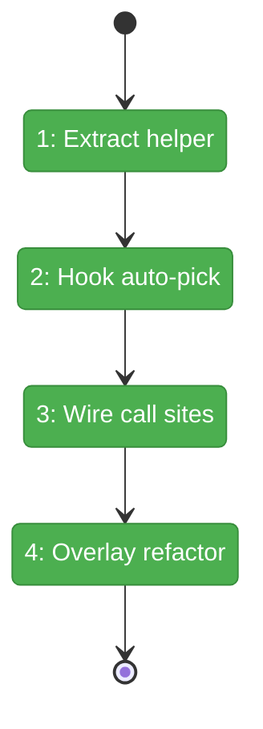
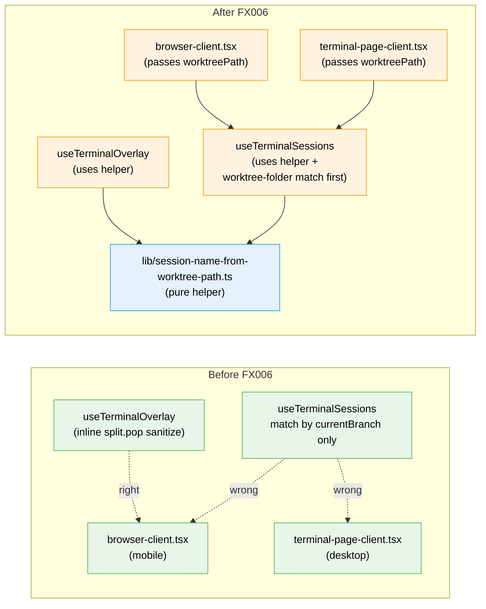

# Flight Plan: Fix FX006 — Auto-pick the tmux session by worktree folder name

**Fix**: [FX006-worktree-folder-session-match.md](./FX006-worktree-folder-session-match.md)
**Status**: Landed

---

## What → Why

**Problem**: `useTerminalSessions` matches by branch name when sessions are actually named after the worktree folder. Cold loads of `/workspaces/higgs-jordo/browser` (branch `main`, session `higgs-jordo`) auto-pick the wrong session — `osk-data` after FX005-1's stable sort. Desktop's backtick overlay uses the right heuristic; the in-tab hook on both desktop and mobile uses the wrong one. Mobile is the surface where the bug is fully visible because there's no session-list escape hatch.

**Fix**: Extract the worktree-folder-name derivation (which already lives inline in `useTerminalOverlay`) into a shared pure helper, add a new worktree-folder-match candidate to the hook's auto-pick logic ahead of the branch-name match, wire `worktreePath` through both call sites, and refactor the overlay to use the helper. Additive at the hook surface; structurally simplifying at the domain level.

---

## Domain Context

| Domain | Relationship | What Changes |
|--------|-------------|-------------|
| `terminal` | modify (internal) | New helper `lib/session-name-from-worktree-path.ts`. Hook gains optional `worktreePath` argument and a new auto-pick candidate (worktree-folder match) above the existing branch match. Overlay refactored to use the same helper. No public domain contract changed. |

---

## Flight Status

**Legend**: grey = pending | yellow = active | red = blocked/needs input | green = done

---

## Stages

- [x] **Stage 1: Extract helper** — pure `sessionNameFromWorktreePath` at `apps/web/src/features/064-terminal/lib/session-name-from-worktree-path.ts` + ≥6 unit tests covering the higgs path, trailing slash, empty, special chars, single-segment, dotted-path.
- [x] **Stage 2: Hook auto-pick by worktree folder** — `useTerminalSessions` accepts optional `worktreePath`, adds the new candidate before the existing branch-name match, JSDoc documents the resolution order. 4 new regression tests including the user's exact higgs-jordo case (worktree=`/Users/jordanknight/github/higgs-jordo`, branch=`main`, session list `[osk-data, 084-random-enhancements-3, higgs-jordo]`, expect `higgs-jordo`).
- [x] **Stage 3: Wire `worktreePath` into both call sites** — `browser-client.tsx` (mobile Terminal tab) and `terminal-page-client.tsx` (desktop) pass the prop they already have in scope.
- [x] **Stage 4: Overlay refactor** — replace the inline `sanitizeSessionName(worktree.split('/').pop() ?? '')` at `use-terminal-overlay.tsx:67` with a call to the new helper. Eliminates the duplication that caused this bug to ship.

---

## Architecture: Before & After

**Legend**: existing (green, unchanged) | changed (orange, modified) | new (blue, created)

---

## Acceptance Criteria

- [ ] Mobile cold-load `/workspaces/higgs-jordo/browser?mobileView=2` lands on the `higgs-jordo` tmux session.
- [ ] Desktop terminal page `/workspaces/higgs-jordo/terminal` (no prior `?session=`) also lands on `higgs-jordo`.
- [ ] Desktop backtick overlay still lands on `higgs-jordo` (overlay refactor preserves behavior).
- [ ] Workspaces where worktree-folder happens to equal branch (e.g. `084-random-enhancements-3`) — no behavior change.
- [ ] Workspaces with only a branch-named session — branch-match fallback resolves correctly.
- [ ] All 11 hook tests (7 existing FX005-2 + 4 new FX006) pass.
- [ ] All 6 FX005-1 sort tests pass.
- [ ] Helper unit tests ≥6 cover the path-edge-cases enumerated.
- [ ] All 173 terminal-domain tests still pass.

## Goals & Non-Goals

**Goals**:
- Make `useTerminalSessions` use the convention sessions are actually named with (worktree folder).
- Eliminate the inline duplication of session-derivation logic between the hook and the overlay.
- Preserve FX005-2's URL persistence as the user-controlled override.

**Non-Goals**:
- Adding a mobile session-picker UI (separate concern; tracked as F001 path B from FX005's review and may become a future fix dossier).
- Changing the hook's return shape or adding new public fields.
- Touching xterm.js, the WS sidecar, or `tmux-session-manager.ts`.
- Renaming or repurposing `sanitizeSessionName` (used by other call sites).

---

## Checklist

- [x] FX006-1: Extract `sessionNameFromWorktreePath` helper + ≥6 tests.
- [x] FX006-2: `useTerminalSessions` adds worktree-folder match before branch match + 5 new tests including the higgs-jordo regression. (Scope expanded: `isCurrentWorktree` flag rename also touched types.ts + terminal-session-list.tsx + its test — see execution log.)
- [x] FX006-3: Wire `worktreePath` through `browser-client.tsx` and `terminal-page-client.tsx` call sites.
- [x] FX006-4: Refactor `useTerminalOverlay` to call the shared helper.
