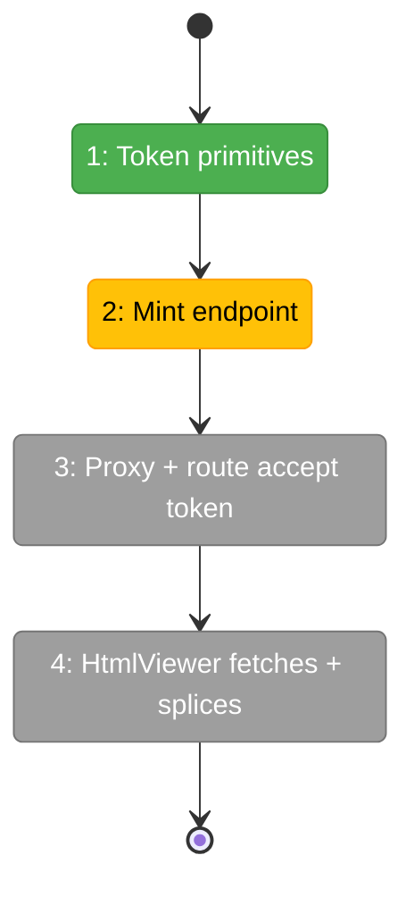
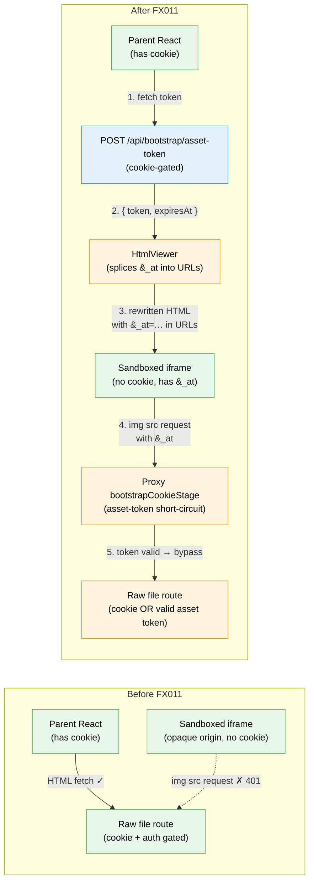

# Flight Plan: Fix FX011 — HtmlViewer asset token

**Fix**: [FX011-html-viewer-asset-token.md](./FX011-html-viewer-asset-token.md)
**Plan**: [auth-bootstrap-code-plan.md](../auth-bootstrap-code-plan.md)
**Generated**: 2026-05-16
**Status**: Ready

---

## What → Why

**Problem**: HtmlViewer renders HTML inside a sandboxed iframe (`sandbox="allow-scripts"`, opaque origin). The browser strips the `chainglass-bootstrap` HttpOnly cookie from every asset request the iframe makes, so embedded ``/`<link>`/`<script>` references all 401. HtmlViewer landed before Plan 084's always-on cookie gate — silent regression.

**Fix**: Mint a short-lived (10 min), HMAC-signed asset token scoped to a worktree using the same signing key as the bootstrap cookie. Parent React (which holds the cookie) calls a new `/api/bootstrap/asset-token` endpoint to acquire a token, then HtmlViewer splices `&_at=<token>` into every rewritten asset URL. Proxy and raw-file route both accept the token as alternate auth for the raw-file route only. Sandbox stays strict.

---

## Domain Context

| Domain | Relationship | What Changes |
|--------|-------------|-------------|
| `_platform/auth` | modify — additive contract | `buildAssetToken` / `verifyAssetToken` helpers in `@chainglass/shared/auth-bootstrap-code`; new mint route `POST /api/bootstrap/asset-token`; proxy gains narrow asset-token short-circuit scoped to `/api/workspaces/<slug>/files/raw`. |
| `file-browser` | modify | `HtmlViewer` fetches token on mount and splices it into rewritten URLs; raw-file route handler accepts token in lieu of `auth()`. |

---

## Flight Status

<!-- Updated by /plan-6-v2: pending → active → done. Use blocked for problems/input needed. -->

**Legend**: grey = pending | yellow = active | red = blocked/needs input | green = done

---

## Stages

<!-- Updated by /plan-6-v2 during implementation: [ ] → [~] → [x] -->

- [x] **Stage 1: Token primitives** — Add `buildAssetToken` / `verifyAssetToken` HMAC helpers in `@chainglass/shared/auth-bootstrap-code` mirroring the existing cookie sign/verify pattern, with full unit-test coverage. (`packages/shared/src/auth-bootstrap-code/asset-token.ts` — new file)
- [ ] **Stage 2: Mint endpoint** — Add `POST /api/bootstrap/asset-token` that reads worktree from the request body and returns a 10-min token bound to it. Cookie-gated (not in `AUTH_BYPASS_ROUTES`). (`apps/web/app/api/bootstrap/asset-token/route.ts` — new file)
- [ ] **Stage 3: Proxy + route accept token** — Teach `bootstrapCookieStage` to `'bypass'` for `/api/workspaces/<slug>/files/raw` when `?_at=<token>` and `?worktree=` match; teach the raw-route handler to skip `auth()` when the same token is valid. (`apps/web/proxy.ts`, `apps/web/app/api/workspaces/[slug]/files/raw/route.ts`)
- [ ] **Stage 4: HtmlViewer fetches + splices** — On mount, parent fetches a token via the mint endpoint and HtmlViewer's URL rewriter appends `&_at=<token>` to each rewritten asset URL. Iframe sandbox stays strict (`allow-scripts` only). (`apps/web/src/features/041-file-browser/components/html-viewer.tsx`)

---

## Architecture: Before & After

**Legend**: existing (green, unchanged) | changed (orange, modified) | new (blue, created)

---

## Acceptance Criteria

- [ ] `storyboard.html` in `higgs-jordo` renders with all `hero.png` images visible.
- [ ] Sandbox attribute on the iframe stays `sandbox="allow-scripts"` (NOT relaxed to `allow-same-origin`).
- [ ] Cookie-less + token-less request to the raw-file route still returns `401 bootstrap-required` (regression locked).
- [ ] Cookie-less request with a valid token bound to the right worktree returns 200 + bytes.
- [ ] Worktree-A token used against worktree-B returns 401.
- [ ] Expired token returns 401.
- [ ] All new + existing `proxy.test.ts`, `auth-bootstrap-code.envmatrix.integration.test.ts`, and `asset-token.test.ts` suites pass.

## Goals & Non-Goals

**Goals**:
- Restore inline image rendering in HtmlViewer without weakening Plan 084's auth posture.
- Provide a reusable asset-token primitive that future binary viewers needing iframe-loaded sub-resources can adopt.

**Non-Goals**:
- Token refresh / long-lived viewer sessions (v2 — for now the 10-min TTL is sufficient for typical browsing).
- Granular per-file scoping (token grants read access to the whole worktree for its lifetime — same as the cookie).
- Server-side asset inlining or data-URI substitution (rejected: blows up payload size for HTML with large images).
- Relaxing the iframe sandbox to `allow-same-origin` (rejected: would let hostile HTML drive the app API).
- Changing the `AUTH_BYPASS_ROUTES` list — the new mint endpoint is intentionally cookie-gated, and the raw-file token short-circuit lives inside `bootstrapCookieStage` (route-pattern-scoped), not in the bypass list.

---

## Checklist

- [x] FX011-1: Add `buildAssetToken` / `verifyAssetToken` primitives + unit tests
- [ ] FX011-2: Add `POST /api/bootstrap/asset-token` mint route + unit/envmatrix tests
- [ ] FX011-3: Wire token recognition into proxy + raw-file route handler + tests
- [ ] FX011-4: Modify HtmlViewer to fetch token and splice into rewritten URLs + manual verification
